cola Report for Hierarchical Partitioning - 'TCGA_KIRP_methylation'
==================

**Date**: 2021-07-22 17:34:06 CEST, **cola version**: 1.9.4

----------------------------------------------------------------

<style type='text/css'>

body, td, th {
   font-family: Arial,Helvetica,sans-serif;
   background-color: white;
   font-size: 13px;
  max-width: 800px;
  margin: auto;
  margin-left:210px;
  padding: 0px 10px 0px 10px;
  border-left: 1px solid #EEEEEE;
  line-height: 150%;
}

tt, code, pre {
   font-family: 'DejaVu Sans Mono', 'Droid Sans Mono', 'Lucida Console', Consolas, Monaco, 

monospace;
}

h1 {
   font-size:2.2em;
}

h2 {
   font-size:1.8em;
}

h3 {
   font-size:1.4em;
}

h4 {
   font-size:1.0em;
}

h5 {
   font-size:0.9em;
}

h6 {
   font-size:0.8em;
}

a {
  text-decoration: none;
  color: #0366d6;
}

a:hover {
  text-decoration: underline;
}

a:visited {
   color: #0366d6;
}

pre, img {
  max-width: 100%;
}
pre {
  overflow-x: auto;
}
pre code {
   display: block; padding: 0.5em;
}

code {
  font-size: 92%;
  border: 1px solid #ccc;
}

code[class] {
  background-color: #F8F8F8;
}

table, td, th {
  border: 1px solid #ccc;
}

blockquote {
   color:#666666;
   margin:0;
   padding-left: 1em;
   border-left: 0.5em #EEE solid;
}

hr {
   height: 0px;
   border-bottom: none;
   border-top-width: thin;
   border-top-style: dotted;
   border-top-color: #999999;
}

@media print {
   * {
      background: transparent !important;
      color: black !important;
      filter:none !important;
      -ms-filter: none !important;
   }

   body {
      font-size:12pt;
      max-width:100%;
   }

   a, a:visited {
      text-decoration: underline;
   }

   hr {
      visibility: hidden;
      page-break-before: always;
   }

   pre, blockquote {
      padding-right: 1em;
      page-break-inside: avoid;
   }

   tr, img {
      page-break-inside: avoid;
   }

   img {
      max-width: 100% !important;
   }

   @page :left {
      margin: 15mm 20mm 15mm 10mm;
   }

   @page :right {
      margin: 15mm 10mm 15mm 20mm;
   }

   p, h2, h3 {
      orphans: 3; widows: 3;
   }

   h2, h3 {
      page-break-after: avoid;
   }
}
</style>


## Summary


First the variable is renamed to `res_rh`.


```r
res_rh = rh
```


The partition hierarchy and all available functions which can be applied to `res_rh` object.


```r
res_rh
```

```
#> A 'HierarchicalPartition' object with 4 combinations of top-value methods and partitioning methods.
#>   On a matrix with 376053 rows and 321 columns.
#>   Performed in total 75600 partitions.
#>   There are 37 groups under the following parameters:
#>     - min_samples: 6
#>     - mean_silhouette_cutoff: 0.9
#>     - min_n_signatures: 1000 (signatures are selected based on:)
#>       - fdr_cutoff: 0.05
#>       - group_diff: 0.25
#> 
#> Hierarchy of the partition:
#>   0, 321 cols
#>   |-- 01, 79 cols, 2544 signatures
#>   |   |-- 011, 33 cols, 424 signatures (c)
#>   |   |-- 012, 27 cols, 4789 signatures
#>   |   |   |-- 0121, 4 cols (b)
#>   |   |   |-- 0122, 10 cols (b)
#>   |   |   |-- 0123, 5 cols (b)
#>   |   |   `-- 0124, 8 cols (b)
#>   |   `-- 013, 19 cols, 3199 signatures
#>   |       |-- 0131, 14 cols, 1212 signatures
#>   |       |   |-- 01311, 12 cols, 139 signatures (c)
#>   |       |   `-- 01312, 2 cols (b)
#>   |       `-- 0132, 5 cols (b)
#>   |-- 02, 56 cols, 6551 signatures
#>   |   |-- 021, 31 cols, 454 signatures (c)
#>   |   |-- 022, 17 cols, 8085 signatures
#>   |   |   |-- 0221, 12 cols, 52 signatures (c)
#>   |   |   |-- 0222, 3 cols (b)
#>   |   |   `-- 0223, 2 cols (b)
#>   |   `-- 023, 8 cols (b)
#>   |-- 03, 59 cols, 26826 signatures
#>   |   |-- 031, 33 cols, 5590 signatures
#>   |   |   |-- 0311, 17 cols, 2840 signatures
#>   |   |   |   |-- 03111, 9 cols (b)
#>   |   |   |   |-- 03112, 3 cols (b)
#>   |   |   |   `-- 03113, 5 cols (b)
#>   |   |   |-- 0312, 4 cols (b)
#>   |   |   `-- 0313, 12 cols, 25 signatures (c)
#>   |   |-- 032, 22 cols, 2274 signatures
#>   |   |   |-- 0321, 12 cols, 1 signatures (c)
#>   |   |   `-- 0322, 10 cols (b)
#>   |   `-- 033, 4 cols (b)
#>   |-- 04, 44 cols, 36795 signatures
#>   |   |-- 041, 10 cols (b)
#>   |   |-- 042, 11 cols (b)
#>   |   |-- 043, 12 cols, 1141 signatures
#>   |   |   |-- 0431, 4 cols (b)
#>   |   |   |-- 0432, 4 cols (b)
#>   |   |   `-- 0433, 4 cols (b)
#>   |   `-- 044, 11 cols (b)
#>   `-- 05, 83 cols, 9931 signatures
#>       |-- 051, 32 cols, 1801 signatures
#>       |   |-- 0511, 15 cols, 9 signatures (c)
#>       |   |-- 0512, 7 cols (b)
#>       |   `-- 0513, 10 cols (b)
#>       |-- 052, 13 cols, 3659 signatures
#>       |   |-- 0521, 3 cols (b)
#>       |   |-- 0522, 8 cols (b)
#>       |   `-- 0523, 2 cols (b)
#>       |-- 053, 32 cols, 4193 signatures
#>       |   |-- 0531, 17 cols, 417 signatures (c)
#>       |   |-- 0532, 11 cols (b)
#>       |   `-- 0533, 4 cols (b)
#>       `-- 054, 6 cols (b)
#> Stop reason:
#>   b) Subgroup had too few columns.
#>   c) There were too few signatures.
#> 
#> Following methods can be applied to this 'HierarchicalPartition' object:
#>  [1] "all_leaves"            "all_nodes"             "cola_report"           "collect_classes"      
#>  [5] "colnames"              "compare_signatures"    "dimension_reduction"   "functional_enrichment"
#>  [9] "get_anno_col"          "get_anno"              "get_children_nodes"    "get_classes"          
#> [13] "get_matrix"            "get_signatures"        "is_leaf_node"          "max_depth"            
#> [17] "merge_node"            "ncol"                  "node_info"             "node_level"           
#> [21] "nrow"                  "rownames"              "show"                  "split_node"           
#> [25] "suggest_best_k"        "test_to_known_factors" "top_rows_heatmap"      "top_rows_overlap"     
#> 
#> You can get result for a single node by e.g. object["01"]
```

The call of `hierarchical_partition()` was:


```
#> hierarchical_partition(data = mat, top_n = 1000, top_value_method = c("SD", "ATC"), 
#>     partition_method = c("kmeans", "skmeans"), subset = 500, group_diff = 0.25, min_n_signatures = 1000, 
#>     filter_fun = function(mat) {
#>         s = rowSds(mat)
#>         order(-s)[1:30000]
#>     }, max_k = 8, scale_rows = FALSE, cores = 4)
```

Dimension of the input matrix:


```r
mat = get_matrix(res_rh)
dim(mat)
```

```
#> [1] 376053    321
```

All the methods that were tried:


```r
res_rh@param$combination_method
```

```
#> [[1]]
#> [1] "SD"     "kmeans"
#> 
#> [[2]]
#> [1] "ATC"    "kmeans"
#> 
#> [[3]]
#> [1] "SD"      "skmeans"
#> 
#> [[4]]
#> [1] "ATC"     "skmeans"
```

### Density distribution

The density distribution for each sample is visualized as one column in the following heatmap.
The clustering is based on the distance which is the Kolmogorov-Smirnov statistic between two distributions.


```r
library(ComplexHeatmap)
densityHeatmap(mat, ylab = "value", cluster_columns = TRUE, show_column_names = FALSE,
    mc.cores = 1)
```


Some values about the hierarchy:


```r
all_nodes(res_rh)
```

```
#>  [1] "0"     "01"    "011"   "012"   "0121"  "0122"  "0123"  "0124"  "013"   "0131"  "01311" "01312"
#> [13] "0132"  "02"    "021"   "022"   "0221"  "0222"  "0223"  "023"   "03"    "031"   "0311"  "03111"
#> [25] "03112" "03113" "0312"  "0313"  "032"   "0321"  "0322"  "033"   "04"    "041"   "042"   "043"  
#> [37] "0431"  "0432"  "0433"  "044"   "05"    "051"   "0511"  "0512"  "0513"  "052"   "0521"  "0522" 
#> [49] "0523"  "053"   "0531"  "0532"  "0533"  "054"
```

```r
all_leaves(res_rh)
```

```
#>  [1] "011"   "0121"  "0122"  "0123"  "0124"  "01311" "01312" "0132"  "021"   "0221"  "0222"  "0223" 
#> [13] "023"   "03111" "03112" "03113" "0312"  "0313"  "0321"  "0322"  "033"   "041"   "042"   "0431" 
#> [25] "0432"  "0433"  "044"   "0511"  "0512"  "0513"  "0521"  "0522"  "0523"  "0531"  "0532"  "0533" 
#> [37] "054"
```

```r
node_info(res_rh)
```

```
#>       id best_method depth best_k n_columns n_signatures p_signatures is_leaf
#> 1      0 ATC:skmeans     1      5       321        40190     1.07e-01   FALSE
#> 2     01  SD:skmeans     2      3        79         2544     6.77e-03   FALSE
#> 3    011 ATC:skmeans     3      2        33          424     1.13e-03    TRUE
#> 4    012  ATC:kmeans     3      4        27         4789     1.27e-02   FALSE
#> 5   0121 not applied     4     NA         4           NA           NA    TRUE
#> 6   0122 not applied     4     NA        10           NA           NA    TRUE
#> 7   0123 not applied     4     NA         5           NA           NA    TRUE
#> 8   0124 not applied     4     NA         8           NA           NA    TRUE
#> 9    013  ATC:kmeans     3      2        19         3199     8.51e-03   FALSE
#> 10  0131  ATC:kmeans     4      2        14         1212     3.22e-03   FALSE
#> 11 01311  ATC:kmeans     5      2        12          139     3.70e-04    TRUE
#> 12 01312 not applied     5     NA         2           NA           NA    TRUE
#> 13  0132 not applied     4     NA         5           NA           NA    TRUE
#> 14    02  SD:skmeans     2      3        56         6551     1.74e-02   FALSE
#> 15   021 ATC:skmeans     3      4        31          454     1.21e-03    TRUE
#> 16   022   SD:kmeans     3      3        17         8085     2.15e-02   FALSE
#> 17  0221  ATC:kmeans     4      3        12           52     1.38e-04    TRUE
#> 18  0222 not applied     4     NA         3           NA           NA    TRUE
#> 19  0223 not applied     4     NA         2           NA           NA    TRUE
#> 20   023 not applied     3     NA         8           NA           NA    TRUE
#> 21    03  ATC:kmeans     2      3        59        26826     7.13e-02   FALSE
#> 22   031  ATC:kmeans     3      3        33         5590     1.49e-02   FALSE
#> 23  0311   SD:kmeans     4      3        17         2840     7.55e-03   FALSE
#> 24 03111 not applied     5     NA         9           NA           NA    TRUE
#> 25 03112 not applied     5     NA         3           NA           NA    TRUE
#> 26 03113 not applied     5     NA         5           NA           NA    TRUE
#> 27  0312 not applied     4     NA         4           NA           NA    TRUE
#> 28  0313 ATC:skmeans     4      3        12           25     6.65e-05    TRUE
#> 29   032   SD:kmeans     3      2        22         2274     6.05e-03   FALSE
#> 30  0321  ATC:kmeans     4      3        12            1     2.66e-06    TRUE
#> 31  0322 not applied     4     NA        10           NA           NA    TRUE
#> 32   033 not applied     3     NA         4           NA           NA    TRUE
#> 33    04   SD:kmeans     2      4        44        36795     9.78e-02   FALSE
#> 34   041 not applied     3     NA        10           NA           NA    TRUE
#> 35   042 not applied     3     NA        11           NA           NA    TRUE
#> 36   043 ATC:skmeans     3      3        12         1141     3.03e-03   FALSE
#> 37  0431 not applied     4     NA         4           NA           NA    TRUE
#> 38  0432 not applied     4     NA         4           NA           NA    TRUE
#> 39  0433 not applied     4     NA         4           NA           NA    TRUE
#> 40   044 not applied     3     NA        11           NA           NA    TRUE
#> 41    05 ATC:skmeans     2      4        83         9931     2.64e-02   FALSE
#> 42   051  ATC:kmeans     3      3        32         1801     4.79e-03   FALSE
#> 43  0511  ATC:kmeans     4      2        15            9     2.39e-05    TRUE
#> 44  0512 not applied     4     NA         7           NA           NA    TRUE
#> 45  0513 not applied     4     NA        10           NA           NA    TRUE
#> 46   052 ATC:skmeans     3      3        13         3659     9.73e-03   FALSE
#> 47  0521 not applied     4     NA         3           NA           NA    TRUE
#> 48  0522 not applied     4     NA         8           NA           NA    TRUE
#> 49  0523 not applied     4     NA         2           NA           NA    TRUE
#> 50   053  ATC:kmeans     3      3        32         4193     1.12e-02   FALSE
#> 51  0531  ATC:kmeans     4      3        17          417     1.11e-03    TRUE
#> 52  0532 not applied     4     NA        11           NA           NA    TRUE
#> 53  0533 not applied     4     NA         4           NA           NA    TRUE
#> 54   054 not applied     3     NA         6           NA           NA    TRUE
```

In the output from `node_info()`, there are the following columns:

- `id`: The node id.
- `best_method`: The best method selected.
- `depth`: Depth of the node in the hierarchy.
- `best_k`: Best number of groups of the partition on that node.
- `n_columns`: Number of columns in the submatrix.
- `n_signatures`: Number of signatures with the `best_k`.
- `p_signatures`: Proportion of hte signatures in total number of rows in the matrix.
- `is_leaf`: Whether the node is a leaf.

Labels of nodes are encoded in a special way. The number of digits
correspond to the depth of the node in the hierarchy and the value of the
digits correspond to the index of the subgroup in the current node, E.g. a label
of “012” means the node is the second subgroup of the partition which is the
first subgroup of the root node.

### Suggest the best k


Following table shows the best `k` (number of partitions) for each node in the
partition hierarchy. Clicking on the node name in the table goes to the
corresponding section for the partitioning on that node.

[The cola vignette](https://jokergoo.github.io/cola_vignettes/cola.html#toc_13)
explains the definition of the metrics used for determining the best
number of partitions.


```r
suggest_best_k(res_rh)
```


|Node                  |Best method                                         |Is leaf   |Best k |1-PAC |Mean silhouette |Concordance | #samples|   |
|:---------------------|:---------------------------------------------------|:---------|:------|:-----|:---------------|:-----------|--------:|:--|
|[Node0](#Node0)       |ATC:skmeans                                         |          |7      |0.95  |0.89            |0.95        |      321|*  |
|[Node01](#Node01)     |SD:skmeans                                          |          |3      |1.00  |0.96            |0.98        |       79|** |
|Node011-leaf          |ATC:skmeans                                         |✓ (&#99;) |6      |0.59  |0.46            |0.78        |       33|   |
|[Node012](#Node012)   |ATC:kmeans                                          |          |8      |0.92  |0.77            |0.88        |       27|*  |
|Node0121-leaf         |<span style='color:grey;'><i>not applied</i></span> |✓ (b)     |       |      |                |            |        4|   |
|Node0122-leaf         |<span style='color:grey;'><i>not applied</i></span> |✓ (b)     |       |      |                |            |       10|   |
|Node0123-leaf         |<span style='color:grey;'><i>not applied</i></span> |✓ (b)     |       |      |                |            |        5|   |
|Node0124-leaf         |<span style='color:grey;'><i>not applied</i></span> |✓ (b)     |       |      |                |            |        8|   |
|[Node013](#Node013)   |ATC:kmeans                                          |          |2      |1.00  |1.00            |1.00        |       19|** |
|[Node0131](#Node0131) |ATC:kmeans                                          |          |8      |1.00  |0.55            |0.98        |       14|** |
|Node01311-leaf        |ATC:kmeans                                          |✓ (&#99;) |8      |0.95  |0.43            |0.97        |       12|** |
|Node01312-leaf        |<span style='color:grey;'><i>not applied</i></span> |✓ (b)     |       |      |                |            |        2|   |
|Node0132-leaf         |<span style='color:grey;'><i>not applied</i></span> |✓ (b)     |       |      |                |            |        5|   |
|[Node02](#Node02)     |SD:skmeans                                          |          |3      |1.00  |0.97            |0.99        |       56|** |
|Node021-leaf          |ATC:skmeans                                         |✓ (&#99;) |7      |0.97  |0.91            |0.96        |       31|** |
|[Node022](#Node022)   |SD:kmeans                                           |          |4      |0.84  |0.85            |0.96        |       17|   |
|Node0221-leaf         |ATC:kmeans                                          |✓ (&#99;) |8      |0.92  |0.44            |0.88        |       12|*  |
|Node0222-leaf         |<span style='color:grey;'><i>not applied</i></span> |✓ (b)     |       |      |                |            |        3|   |
|Node0223-leaf         |<span style='color:grey;'><i>not applied</i></span> |✓ (b)     |       |      |                |            |        2|   |
|Node023-leaf          |<span style='color:grey;'><i>not applied</i></span> |✓ (b)     |       |      |                |            |        8|   |
|[Node03](#Node03)     |ATC:kmeans                                          |          |3      |1.00  |0.99            |0.98        |       59|** |
|[Node031](#Node031)   |ATC:kmeans                                          |          |3      |1.00  |0.96            |0.99        |       33|** |
|[Node0311](#Node0311) |SD:kmeans                                           |          |7      |0.90  |0.79            |0.89        |       17|*  |
|Node03111-leaf        |<span style='color:grey;'><i>not applied</i></span> |✓ (b)     |       |      |                |            |        9|   |
|Node03112-leaf        |<span style='color:grey;'><i>not applied</i></span> |✓ (b)     |       |      |                |            |        3|   |
|Node03113-leaf        |<span style='color:grey;'><i>not applied</i></span> |✓ (b)     |       |      |                |            |        5|   |
|Node0312-leaf         |<span style='color:grey;'><i>not applied</i></span> |✓ (b)     |       |      |                |            |        4|   |
|Node0313-leaf         |ATC:skmeans                                         |✓ (&#99;) |8      |0.94  |0.60            |0.97        |       12|*  |
|[Node032](#Node032)   |SD:kmeans                                           |          |2      |1.00  |0.98            |0.98        |       22|** |
|Node0321-leaf         |ATC:kmeans                                          |✓ (&#99;) |7      |1.00  |0.66            |1.00        |       12|** |
|Node0322-leaf         |<span style='color:grey;'><i>not applied</i></span> |✓ (b)     |       |      |                |            |       10|   |
|Node033-leaf          |<span style='color:grey;'><i>not applied</i></span> |✓ (b)     |       |      |                |            |        4|   |
|[Node04](#Node04)     |SD:kmeans                                           |          |6      |0.90  |0.84            |0.88        |       44|*  |
|Node041-leaf          |<span style='color:grey;'><i>not applied</i></span> |✓ (b)     |       |      |                |            |       10|   |
|Node042-leaf          |<span style='color:grey;'><i>not applied</i></span> |✓ (b)     |       |      |                |            |       11|   |
|[Node043](#Node043)   |ATC:skmeans                                         |          |7      |0.92  |0.64            |0.94        |       12|*  |
|Node0431-leaf         |<span style='color:grey;'><i>not applied</i></span> |✓ (b)     |       |      |                |            |        4|   |
|Node0432-leaf         |<span style='color:grey;'><i>not applied</i></span> |✓ (b)     |       |      |                |            |        4|   |
|Node0433-leaf         |<span style='color:grey;'><i>not applied</i></span> |✓ (b)     |       |      |                |            |        4|   |
|Node044-leaf          |<span style='color:grey;'><i>not applied</i></span> |✓ (b)     |       |      |                |            |       11|   |
|[Node05](#Node05)     |ATC:skmeans                                         |          |8      |0.91  |0.88            |0.92        |       83|*  |
|[Node051](#Node051)   |ATC:kmeans                                          |          |3      |1.00  |1.00            |1.00        |       32|** |
|Node0511-leaf         |ATC:kmeans                                          |✓ (&#99;) |2      |1.00  |1.00            |1.00        |       15|** |
|Node0512-leaf         |<span style='color:grey;'><i>not applied</i></span> |✓ (b)     |       |      |                |            |        7|   |
|Node0513-leaf         |<span style='color:grey;'><i>not applied</i></span> |✓ (b)     |       |      |                |            |       10|   |
|[Node052](#Node052)   |ATC:skmeans                                         |          |4      |1.00  |0.91            |0.99        |       13|** |
|Node0521-leaf         |<span style='color:grey;'><i>not applied</i></span> |✓ (b)     |       |      |                |            |        3|   |
|Node0522-leaf         |<span style='color:grey;'><i>not applied</i></span> |✓ (b)     |       |      |                |            |        8|   |
|Node0523-leaf         |<span style='color:grey;'><i>not applied</i></span> |✓ (b)     |       |      |                |            |        2|   |
|[Node053](#Node053)   |ATC:kmeans                                          |          |3      |1.00  |1.00            |1.00        |       32|** |
|Node0531-leaf         |ATC:kmeans                                          |✓ (&#99;) |3      |1.00  |1.00            |1.00        |       17|** |
|Node0532-leaf         |<span style='color:grey;'><i>not applied</i></span> |✓ (b)     |       |      |                |            |       11|   |
|Node0533-leaf         |<span style='color:grey;'><i>not applied</i></span> |✓ (b)     |       |      |                |            |        4|   |
|Node054-leaf          |<span style='color:grey;'><i>not applied</i></span> |✓ (b)     |       |      |                |            |        6|   |


Stop reason: b) Subgroup had too few columns. c) There were too few signatures. 

\*\*: 1-PAC > 0.95, \*: 1-PAC > 0.9


### Partition hierarchy

The nodes of the hierarchy can be merged by setting the `merge_node` parameters. Here we 
control the hierarchy with the `min_n_signatures` parameter. The value of `min_n_signatures` is
from `node_info()`.


<style type='text/css'>


.ui-helper-hidden {
	display: none;
}
.ui-helper-hidden-accessible {
	border: 0;
	clip: rect(0 0 0 0);
	height: 1px;
	margin: -1px;
	overflow: hidden;
	padding: 0;
	position: absolute;
	width: 1px;
}
.ui-helper-reset {
	margin: 0;
	padding: 0;
	border: 0;
	outline: 0;
	line-height: 1.3;
	text-decoration: none;
	font-size: 100%;
	list-style: none;
}
.ui-helper-clearfix:before,
.ui-helper-clearfix:after {
	content: "";
	display: table;
	border-collapse: collapse;
}
.ui-helper-clearfix:after {
	clear: both;
}
.ui-helper-zfix {
	width: 100%;
	height: 100%;
	top: 0;
	left: 0;
	position: absolute;
	opacity: 0;
	filter:Alpha(Opacity=0); 
}

.ui-front {
	z-index: 100;
}


.ui-state-disabled {
	cursor: default !important;
	pointer-events: none;
}


.ui-icon {
	display: inline-block;
	vertical-align: middle;
	margin-top: -.25em;
	position: relative;
	text-indent: -99999px;
	overflow: hidden;
	background-repeat: no-repeat;
}

.ui-widget-icon-block {
	left: 50%;
	margin-left: -8px;
	display: block;
}


.ui-widget-overlay {
	position: fixed;
	top: 0;
	left: 0;
	width: 100%;
	height: 100%;
}
.ui-accordion .ui-accordion-header {
	display: block;
	cursor: pointer;
	position: relative;
	margin: 2px 0 0 0;
	padding: .5em .5em .5em .7em;
	font-size: 100%;
}
.ui-accordion .ui-accordion-content {
	padding: 1em 2.2em;
	border-top: 0;
	overflow: auto;
}
.ui-autocomplete {
	position: absolute;
	top: 0;
	left: 0;
	cursor: default;
}
.ui-menu {
	list-style: none;
	padding: 0;
	margin: 0;
	display: block;
	outline: 0;
}
.ui-menu .ui-menu {
	position: absolute;
}
.ui-menu .ui-menu-item {
	margin: 0;
	cursor: pointer;
	
	list-style-image: url("data:image/gif;base64,R0lGODlhAQABAIAAAAAAAP///yH5BAEAAAAALAAAAAABAAEAAAIBRAA7");
}
.ui-menu .ui-menu-item-wrapper {
	position: relative;
	padding: 3px 1em 3px .4em;
}
.ui-menu .ui-menu-divider {
	margin: 5px 0;
	height: 0;
	font-size: 0;
	line-height: 0;
	border-width: 1px 0 0 0;
}
.ui-menu .ui-state-focus,
.ui-menu .ui-state-active {
	margin: -1px;
}


.ui-menu-icons {
	position: relative;
}
.ui-menu-icons .ui-menu-item-wrapper {
	padding-left: 2em;
}


.ui-menu .ui-icon {
	position: absolute;
	top: 0;
	bottom: 0;
	left: .2em;
	margin: auto 0;
}


.ui-menu .ui-menu-icon {
	left: auto;
	right: 0;
}
.ui-button {
	padding: .4em 1em;
	display: inline-block;
	position: relative;
	line-height: normal;
	margin-right: .1em;
	cursor: pointer;
	vertical-align: middle;
	text-align: center;
	-webkit-user-select: none;
	-moz-user-select: none;
	-ms-user-select: none;
	user-select: none;

	
	overflow: visible;
}

.ui-button,
.ui-button:link,
.ui-button:visited,
.ui-button:hover,
.ui-button:active {
	text-decoration: none;
}


.ui-button-icon-only {
	width: 2em;
	box-sizing: border-box;
	text-indent: -9999px;
	white-space: nowrap;
}


input.ui-button.ui-button-icon-only {
	text-indent: 0;
}


.ui-button-icon-only .ui-icon {
	position: absolute;
	top: 50%;
	left: 50%;
	margin-top: -8px;
	margin-left: -8px;
}

.ui-button.ui-icon-notext .ui-icon {
	padding: 0;
	width: 2.1em;
	height: 2.1em;
	text-indent: -9999px;
	white-space: nowrap;

}

input.ui-button.ui-icon-notext .ui-icon {
	width: auto;
	height: auto;
	text-indent: 0;
	white-space: normal;
	padding: .4em 1em;
}


input.ui-button::-moz-focus-inner,
button.ui-button::-moz-focus-inner {
	border: 0;
	padding: 0;
}
.ui-controlgroup {
	vertical-align: middle;
	display: inline-block;
}
.ui-controlgroup > .ui-controlgroup-item {
	float: left;
	margin-left: 0;
	margin-right: 0;
}
.ui-controlgroup > .ui-controlgroup-item:focus,
.ui-controlgroup > .ui-controlgroup-item.ui-visual-focus {
	z-index: 9999;
}
.ui-controlgroup-vertical > .ui-controlgroup-item {
	display: block;
	float: none;
	width: 100%;
	margin-top: 0;
	margin-bottom: 0;
	text-align: left;
}
.ui-controlgroup-vertical .ui-controlgroup-item {
	box-sizing: border-box;
}
.ui-controlgroup .ui-controlgroup-label {
	padding: .4em 1em;
}
.ui-controlgroup .ui-controlgroup-label span {
	font-size: 80%;
}
.ui-controlgroup-horizontal .ui-controlgroup-label + .ui-controlgroup-item {
	border-left: none;
}
.ui-controlgroup-vertical .ui-controlgroup-label + .ui-controlgroup-item {
	border-top: none;
}
.ui-controlgroup-horizontal .ui-controlgroup-label.ui-widget-content {
	border-right: none;
}
.ui-controlgroup-vertical .ui-controlgroup-label.ui-widget-content {
	border-bottom: none;
}


.ui-controlgroup-vertical .ui-spinner-input {

	
	width: 75%;
	width: calc( 100% - 2.4em );
}
.ui-controlgroup-vertical .ui-spinner .ui-spinner-up {
	border-top-style: solid;
}

.ui-checkboxradio-label .ui-icon-background {
	box-shadow: inset 1px 1px 1px #ccc;
	border-radius: .12em;
	border: none;
}
.ui-checkboxradio-radio-label .ui-icon-background {
	width: 16px;
	height: 16px;
	border-radius: 1em;
	overflow: visible;
	border: none;
}
.ui-checkboxradio-radio-label.ui-checkboxradio-checked .ui-icon,
.ui-checkboxradio-radio-label.ui-checkboxradio-checked:hover .ui-icon {
	background-image: none;
	width: 8px;
	height: 8px;
	border-width: 4px;
	border-style: solid;
}
.ui-checkboxradio-disabled {
	pointer-events: none;
}
.ui-datepicker {
	width: 17em;
	padding: .2em .2em 0;
	display: none;
}
.ui-datepicker .ui-datepicker-header {
	position: relative;
	padding: .2em 0;
}
.ui-datepicker .ui-datepicker-prev,
.ui-datepicker .ui-datepicker-next {
	position: absolute;
	top: 2px;
	width: 1.8em;
	height: 1.8em;
}
.ui-datepicker .ui-datepicker-prev-hover,
.ui-datepicker .ui-datepicker-next-hover {
	top: 1px;
}
.ui-datepicker .ui-datepicker-prev {
	left: 2px;
}
.ui-datepicker .ui-datepicker-next {
	right: 2px;
}
.ui-datepicker .ui-datepicker-prev-hover {
	left: 1px;
}
.ui-datepicker .ui-datepicker-next-hover {
	right: 1px;
}
.ui-datepicker .ui-datepicker-prev span,
.ui-datepicker .ui-datepicker-next span {
	display: block;
	position: absolute;
	left: 50%;
	margin-left: -8px;
	top: 50%;
	margin-top: -8px;
}
.ui-datepicker .ui-datepicker-title {
	margin: 0 2.3em;
	line-height: 1.8em;
	text-align: center;
}
.ui-datepicker .ui-datepicker-title select {
	font-size: 1em;
	margin: 1px 0;
}
.ui-datepicker select.ui-datepicker-month,
.ui-datepicker select.ui-datepicker-year {
	width: 45%;
}
.ui-datepicker table {
	width: 100%;
	font-size: .9em;
	border-collapse: collapse;
	margin: 0 0 .4em;
}
.ui-datepicker th {
	padding: .7em .3em;
	text-align: center;
	font-weight: bold;
	border: 0;
}
.ui-datepicker td {
	border: 0;
	padding: 1px;
}
.ui-datepicker td span,
.ui-datepicker td a {
	display: block;
	padding: .2em;
	text-align: right;
	text-decoration: none;
}
.ui-datepicker .ui-datepicker-buttonpane {
	background-image: none;
	margin: .7em 0 0 0;
	padding: 0 .2em;
	border-left: 0;
	border-right: 0;
	border-bottom: 0;
}
.ui-datepicker .ui-datepicker-buttonpane button {
	float: right;
	margin: .5em .2em .4em;
	cursor: pointer;
	padding: .2em .6em .3em .6em;
	width: auto;
	overflow: visible;
}
.ui-datepicker .ui-datepicker-buttonpane button.ui-datepicker-current {
	float: left;
}


.ui-datepicker.ui-datepicker-multi {
	width: auto;
}
.ui-datepicker-multi .ui-datepicker-group {
	float: left;
}
.ui-datepicker-multi .ui-datepicker-group table {
	width: 95%;
	margin: 0 auto .4em;
}
.ui-datepicker-multi-2 .ui-datepicker-group {
	width: 50%;
}
.ui-datepicker-multi-3 .ui-datepicker-group {
	width: 33.3%;
}
.ui-datepicker-multi-4 .ui-datepicker-group {
	width: 25%;
}
.ui-datepicker-multi .ui-datepicker-group-last .ui-datepicker-header,
.ui-datepicker-multi .ui-datepicker-group-middle .ui-datepicker-header {
	border-left-width: 0;
}
.ui-datepicker-multi .ui-datepicker-buttonpane {
	clear: left;
}
.ui-datepicker-row-break {
	clear: both;
	width: 100%;
	font-size: 0;
}


.ui-datepicker-rtl {
	direction: rtl;
}
.ui-datepicker-rtl .ui-datepicker-prev {
	right: 2px;
	left: auto;
}
.ui-datepicker-rtl .ui-datepicker-next {
	left: 2px;
	right: auto;
}
.ui-datepicker-rtl .ui-datepicker-prev:hover {
	right: 1px;
	left: auto;
}
.ui-datepicker-rtl .ui-datepicker-next:hover {
	left: 1px;
	right: auto;
}
.ui-datepicker-rtl .ui-datepicker-buttonpane {
	clear: right;
}
.ui-datepicker-rtl .ui-datepicker-buttonpane button {
	float: left;
}
.ui-datepicker-rtl .ui-datepicker-buttonpane button.ui-datepicker-current,
.ui-datepicker-rtl .ui-datepicker-group {
	float: right;
}
.ui-datepicker-rtl .ui-datepicker-group-last .ui-datepicker-header,
.ui-datepicker-rtl .ui-datepicker-group-middle .ui-datepicker-header {
	border-right-width: 0;
	border-left-width: 1px;
}


.ui-datepicker .ui-icon {
	display: block;
	text-indent: -99999px;
	overflow: hidden;
	background-repeat: no-repeat;
	left: .5em;
	top: .3em;
}
.ui-dialog {
	position: absolute;
	top: 0;
	left: 0;
	padding: .2em;
	outline: 0;
}
.ui-dialog .ui-dialog-titlebar {
	padding: .4em 1em;
	position: relative;
}
.ui-dialog .ui-dialog-title {
	float: left;
	margin: .1em 0;
	white-space: nowrap;
	width: 90%;
	overflow: hidden;
	text-overflow: ellipsis;
}
.ui-dialog .ui-dialog-titlebar-close {
	position: absolute;
	right: .3em;
	top: 50%;
	width: 20px;
	margin: -10px 0 0 0;
	padding: 1px;
	height: 20px;
}
.ui-dialog .ui-dialog-content {
	position: relative;
	border: 0;
	padding: .5em 1em;
	background: none;
	overflow: auto;
}
.ui-dialog .ui-dialog-buttonpane {
	text-align: left;
	border-width: 1px 0 0 0;
	background-image: none;
	margin-top: .5em;
	padding: .3em 1em .5em .4em;
}
.ui-dialog .ui-dialog-buttonpane .ui-dialog-buttonset {
	float: right;
}
.ui-dialog .ui-dialog-buttonpane button {
	margin: .5em .4em .5em 0;
	cursor: pointer;
}
.ui-dialog .ui-resizable-n {
	height: 2px;
	top: 0;
}
.ui-dialog .ui-resizable-e {
	width: 2px;
	right: 0;
}
.ui-dialog .ui-resizable-s {
	height: 2px;
	bottom: 0;
}
.ui-dialog .ui-resizable-w {
	width: 2px;
	left: 0;
}
.ui-dialog .ui-resizable-se,
.ui-dialog .ui-resizable-sw,
.ui-dialog .ui-resizable-ne,
.ui-dialog .ui-resizable-nw {
	width: 7px;
	height: 7px;
}
.ui-dialog .ui-resizable-se {
	right: 0;
	bottom: 0;
}
.ui-dialog .ui-resizable-sw {
	left: 0;
	bottom: 0;
}
.ui-dialog .ui-resizable-ne {
	right: 0;
	top: 0;
}
.ui-dialog .ui-resizable-nw {
	left: 0;
	top: 0;
}
.ui-draggable .ui-dialog-titlebar {
	cursor: move;
}
.ui-draggable-handle {
	-ms-touch-action: none;
	touch-action: none;
}
.ui-resizable {
	position: relative;
}
.ui-resizable-handle {
	position: absolute;
	font-size: 0.1px;
	display: block;
	-ms-touch-action: none;
	touch-action: none;
}
.ui-resizable-disabled .ui-resizable-handle,
.ui-resizable-autohide .ui-resizable-handle {
	display: none;
}
.ui-resizable-n {
	cursor: n-resize;
	height: 7px;
	width: 100%;
	top: -5px;
	left: 0;
}
.ui-resizable-s {
	cursor: s-resize;
	height: 7px;
	width: 100%;
	bottom: -5px;
	left: 0;
}
.ui-resizable-e {
	cursor: e-resize;
	width: 7px;
	right: -5px;
	top: 0;
	height: 100%;
}
.ui-resizable-w {
	cursor: w-resize;
	width: 7px;
	left: -5px;
	top: 0;
	height: 100%;
}
.ui-resizable-se {
	cursor: se-resize;
	width: 12px;
	height: 12px;
	right: 1px;
	bottom: 1px;
}
.ui-resizable-sw {
	cursor: sw-resize;
	width: 9px;
	height: 9px;
	left: -5px;
	bottom: -5px;
}
.ui-resizable-nw {
	cursor: nw-resize;
	width: 9px;
	height: 9px;
	left: -5px;
	top: -5px;
}
.ui-resizable-ne {
	cursor: ne-resize;
	width: 9px;
	height: 9px;
	right: -5px;
	top: -5px;
}
.ui-progressbar {
	height: 2em;
	text-align: left;
	overflow: hidden;
}
.ui-progressbar .ui-progressbar-value {
	margin: -1px;
	height: 100%;
}
.ui-progressbar .ui-progressbar-overlay {
	background: url("data:image/gif;base64,R0lGODlhKAAoAIABAAAAAP///yH/C05FVFNDQVBFMi4wAwEAAAAh+QQJAQABACwAAAAAKAAoAAACkYwNqXrdC52DS06a7MFZI+4FHBCKoDeWKXqymPqGqxvJrXZbMx7Ttc+w9XgU2FB3lOyQRWET2IFGiU9m1frDVpxZZc6bfHwv4c1YXP6k1Vdy292Fb6UkuvFtXpvWSzA+HycXJHUXiGYIiMg2R6W459gnWGfHNdjIqDWVqemH2ekpObkpOlppWUqZiqr6edqqWQAAIfkECQEAAQAsAAAAACgAKAAAApSMgZnGfaqcg1E2uuzDmmHUBR8Qil95hiPKqWn3aqtLsS18y7G1SzNeowWBENtQd+T1JktP05nzPTdJZlR6vUxNWWjV+vUWhWNkWFwxl9VpZRedYcflIOLafaa28XdsH/ynlcc1uPVDZxQIR0K25+cICCmoqCe5mGhZOfeYSUh5yJcJyrkZWWpaR8doJ2o4NYq62lAAACH5BAkBAAEALAAAAAAoACgAAAKVDI4Yy22ZnINRNqosw0Bv7i1gyHUkFj7oSaWlu3ovC8GxNso5fluz3qLVhBVeT/Lz7ZTHyxL5dDalQWPVOsQWtRnuwXaFTj9jVVh8pma9JjZ4zYSj5ZOyma7uuolffh+IR5aW97cHuBUXKGKXlKjn+DiHWMcYJah4N0lYCMlJOXipGRr5qdgoSTrqWSq6WFl2ypoaUAAAIfkECQEAAQAsAAAAACgAKAAAApaEb6HLgd/iO7FNWtcFWe+ufODGjRfoiJ2akShbueb0wtI50zm02pbvwfWEMWBQ1zKGlLIhskiEPm9R6vRXxV4ZzWT2yHOGpWMyorblKlNp8HmHEb/lCXjcW7bmtXP8Xt229OVWR1fod2eWqNfHuMjXCPkIGNileOiImVmCOEmoSfn3yXlJWmoHGhqp6ilYuWYpmTqKUgAAIfkECQEAAQAsAAAAACgAKAAAApiEH6kb58biQ3FNWtMFWW3eNVcojuFGfqnZqSebuS06w5V80/X02pKe8zFwP6EFWOT1lDFk8rGERh1TTNOocQ61Hm4Xm2VexUHpzjymViHrFbiELsefVrn6XKfnt2Q9G/+Xdie499XHd2g4h7ioOGhXGJboGAnXSBnoBwKYyfioubZJ2Hn0RuRZaflZOil56Zp6iioKSXpUAAAh+QQJAQABACwAAAAAKAAoAAACkoQRqRvnxuI7kU1a1UU5bd5tnSeOZXhmn5lWK3qNTWvRdQxP8qvaC+/yaYQzXO7BMvaUEmJRd3TsiMAgswmNYrSgZdYrTX6tSHGZO73ezuAw2uxuQ+BbeZfMxsexY35+/Qe4J1inV0g4x3WHuMhIl2jXOKT2Q+VU5fgoSUI52VfZyfkJGkha6jmY+aaYdirq+lQAACH5BAkBAAEALAAAAAAoACgAAAKWBIKpYe0L3YNKToqswUlvznigd4wiR4KhZrKt9Upqip61i9E3vMvxRdHlbEFiEXfk9YARYxOZZD6VQ2pUunBmtRXo1Lf8hMVVcNl8JafV38aM2/Fu5V16Bn63r6xt97j09+MXSFi4BniGFae3hzbH9+hYBzkpuUh5aZmHuanZOZgIuvbGiNeomCnaxxap2upaCZsq+1kAACH5BAkBAAEALAAAAAAoACgAAAKXjI8By5zf4kOxTVrXNVlv1X0d8IGZGKLnNpYtm8Lr9cqVeuOSvfOW79D9aDHizNhDJidFZhNydEahOaDH6nomtJjp1tutKoNWkvA6JqfRVLHU/QUfau9l2x7G54d1fl995xcIGAdXqMfBNadoYrhH+Mg2KBlpVpbluCiXmMnZ2Sh4GBqJ+ckIOqqJ6LmKSllZmsoq6wpQAAAh+QQJAQABACwAAAAAKAAoAAAClYx/oLvoxuJDkU1a1YUZbJ59nSd2ZXhWqbRa2/gF8Gu2DY3iqs7yrq+xBYEkYvFSM8aSSObE+ZgRl1BHFZNr7pRCavZ5BW2142hY3AN/zWtsmf12p9XxxFl2lpLn1rseztfXZjdIWIf2s5dItwjYKBgo9yg5pHgzJXTEeGlZuenpyPmpGQoKOWkYmSpaSnqKileI2FAAACH5BAkBAAEALAAAAAAoACgAAAKVjB+gu+jG4kORTVrVhRlsnn2dJ3ZleFaptFrb+CXmO9OozeL5VfP99HvAWhpiUdcwkpBH3825AwYdU8xTqlLGhtCosArKMpvfa1mMRae9VvWZfeB2XfPkeLmm18lUcBj+p5dnN8jXZ3YIGEhYuOUn45aoCDkp16hl5IjYJvjWKcnoGQpqyPlpOhr3aElaqrq56Bq7VAAAOw==");
	height: 100%;
	filter: alpha(opacity=25); 
	opacity: 0.25;
}
.ui-progressbar-indeterminate .ui-progressbar-value {
	background-image: none;
}
.ui-selectable {
	-ms-touch-action: none;
	touch-action: none;
}
.ui-selectable-helper {
	position: absolute;
	z-index: 100;
	border: 1px dotted black;
}
.ui-selectmenu-menu {
	padding: 0;
	margin: 0;
	position: absolute;
	top: 0;
	left: 0;
	display: none;
}
.ui-selectmenu-menu .ui-menu {
	overflow: auto;
	overflow-x: hidden;
	padding-bottom: 1px;
}
.ui-selectmenu-menu .ui-menu .ui-selectmenu-optgroup {
	font-size: 1em;
	font-weight: bold;
	line-height: 1.5;
	padding: 2px 0.4em;
	margin: 0.5em 0 0 0;
	height: auto;
	border: 0;
}
.ui-selectmenu-open {
	display: block;
}
.ui-selectmenu-text {
	display: block;
	margin-right: 20px;
	overflow: hidden;
	text-overflow: ellipsis;
}
.ui-selectmenu-button.ui-button {
	text-align: left;
	white-space: nowrap;
	width: 14em;
}
.ui-selectmenu-icon.ui-icon {
	float: right;
	margin-top: 0;
}
.ui-slider {
	position: relative;
	text-align: left;
}
.ui-slider .ui-slider-handle {
	position: absolute;
	z-index: 2;
	width: 1.2em;
	height: 1.2em;
	cursor: default;
	-ms-touch-action: none;
	touch-action: none;
}
.ui-slider .ui-slider-range {
	position: absolute;
	z-index: 1;
	font-size: .7em;
	display: block;
	border: 0;
	background-position: 0 0;
}


.ui-slider.ui-state-disabled .ui-slider-handle,
.ui-slider.ui-state-disabled .ui-slider-range {
	filter: inherit;
}

.ui-slider-horizontal {
	height: .8em;
}
.ui-slider-horizontal .ui-slider-handle {
	top: -.3em;
	margin-left: -.6em;
}
.ui-slider-horizontal .ui-slider-range {
	top: 0;
	height: 100%;
}
.ui-slider-horizontal .ui-slider-range-min {
	left: 0;
}
.ui-slider-horizontal .ui-slider-range-max {
	right: 0;
}

.ui-slider-vertical {
	width: .8em;
	height: 100px;
}
.ui-slider-vertical .ui-slider-handle {
	left: -.3em;
	margin-left: 0;
	margin-bottom: -.6em;
}
.ui-slider-vertical .ui-slider-range {
	left: 0;
	width: 100%;
}
.ui-slider-vertical .ui-slider-range-min {
	bottom: 0;
}
.ui-slider-vertical .ui-slider-range-max {
	top: 0;
}
.ui-sortable-handle {
	-ms-touch-action: none;
	touch-action: none;
}
.ui-spinner {
	position: relative;
	display: inline-block;
	overflow: hidden;
	padding: 0;
	vertical-align: middle;
}
.ui-spinner-input {
	border: none;
	background: none;
	color: inherit;
	padding: .222em 0;
	margin: .2em 0;
	vertical-align: middle;
	margin-left: .4em;
	margin-right: 2em;
}
.ui-spinner-button {
	width: 1.6em;
	height: 50%;
	font-size: .5em;
	padding: 0;
	margin: 0;
	text-align: center;
	position: absolute;
	cursor: default;
	display: block;
	overflow: hidden;
	right: 0;
}

.ui-spinner a.ui-spinner-button {
	border-top-style: none;
	border-bottom-style: none;
	border-right-style: none;
}
.ui-spinner-up {
	top: 0;
}
.ui-spinner-down {
	bottom: 0;
}
.ui-tabs {
	position: relative;
	padding: .2em;
}
.ui-tabs .ui-tabs-nav {
	margin: 0;
	padding: .2em .2em 0;
}
.ui-tabs .ui-tabs-nav li {
	list-style: none;
	float: left;
	position: relative;
	top: 0;
	margin: 1px .2em 0 0;
	border-bottom-width: 0;
	padding: 0;
	white-space: nowrap;
}
.ui-tabs .ui-tabs-nav .ui-tabs-anchor {
	float: left;
	padding: .5em 1em;
	text-decoration: none;
}
.ui-tabs .ui-tabs-nav li.ui-tabs-active {
	margin-bottom: -1px;
	padding-bottom: 1px;
}
.ui-tabs .ui-tabs-nav li.ui-tabs-active .ui-tabs-anchor,
.ui-tabs .ui-tabs-nav li.ui-state-disabled .ui-tabs-anchor,
.ui-tabs .ui-tabs-nav li.ui-tabs-loading .ui-tabs-anchor {
	cursor: text;
}
.ui-tabs-collapsible .ui-tabs-nav li.ui-tabs-active .ui-tabs-anchor {
	cursor: pointer;
}
.ui-tabs .ui-tabs-panel {
	display: block;
	border-width: 0;
	padding: 1em 1.4em;
	background: none;
}
.ui-tooltip {
	padding: 8px;
	position: absolute;
	z-index: 9999;
	max-width: 300px;
}
body .ui-tooltip {
	border-width: 2px;
}

.ui-widget {
	font-family: Arial,Helvetica,sans-serif;
	font-size: 1em;
}
.ui-widget .ui-widget {
	font-size: 1em;
}
.ui-widget input,
.ui-widget select,
.ui-widget textarea,
.ui-widget button {
	font-family: Arial,Helvetica,sans-serif;
	font-size: 1em;
}
.ui-widget.ui-widget-content {
	border: 1px solid #c5c5c5;
}
.ui-widget-content {
	border: 1px solid #dddddd;
	background: #ffffff;
	color: #333333;
}
.ui-widget-content a {
	color: #333333;
}
.ui-widget-header {
	border: 1px solid #dddddd;
	background: #e9e9e9;
	color: #333333;
	font-weight: bold;
}
.ui-widget-header a {
	color: #333333;
}


.ui-state-default,
.ui-widget-content .ui-state-default,
.ui-widget-header .ui-state-default,
.ui-button,


html .ui-button.ui-state-disabled:hover,
html .ui-button.ui-state-disabled:active {
	border: 1px solid #c5c5c5;
	background: #f6f6f6;
	font-weight: normal;
	color: #454545;
}
.ui-state-default a,
.ui-state-default a:link,
.ui-state-default a:visited,
a.ui-button,
a:link.ui-button,
a:visited.ui-button,
.ui-button {
	color: #454545;
	text-decoration: none;
}
.ui-state-hover,
.ui-widget-content .ui-state-hover,
.ui-widget-header .ui-state-hover,
.ui-state-focus,
.ui-widget-content .ui-state-focus,
.ui-widget-header .ui-state-focus,
.ui-button:hover,
.ui-button:focus {
	border: 1px solid #cccccc;
	background: #ededed;
	font-weight: normal;
	color: #2b2b2b;
}
.ui-state-hover a,
.ui-state-hover a:hover,
.ui-state-hover a:link,
.ui-state-hover a:visited,
.ui-state-focus a,
.ui-state-focus a:hover,
.ui-state-focus a:link,
.ui-state-focus a:visited,
a.ui-button:hover,
a.ui-button:focus {
	color: #2b2b2b;
	text-decoration: none;
}

.ui-visual-focus {
	box-shadow: 0 0 3px 1px rgb(94, 158, 214);
}
.ui-state-active,
.ui-widget-content .ui-state-active,
.ui-widget-header .ui-state-active,
a.ui-button:active,
.ui-button:active,
.ui-button.ui-state-active:hover {
	border: 1px solid #003eff;
	background: #007fff;
	font-weight: normal;
	color: #ffffff;
}
.ui-icon-background,
.ui-state-active .ui-icon-background {
	border: #003eff;
	background-color: #ffffff;
}
.ui-state-active a,
.ui-state-active a:link,
.ui-state-active a:visited {
	color: #ffffff;
	text-decoration: none;
}


.ui-state-highlight,
.ui-widget-content .ui-state-highlight,
.ui-widget-header .ui-state-highlight {
	border: 1px solid #dad55e;
	background: #fffa90;
	color: #777620;
}
.ui-state-checked {
	border: 1px solid #dad55e;
	background: #fffa90;
}
.ui-state-highlight a,
.ui-widget-content .ui-state-highlight a,
.ui-widget-header .ui-state-highlight a {
	color: #777620;
}
.ui-state-error,
.ui-widget-content .ui-state-error,
.ui-widget-header .ui-state-error {
	border: 1px solid #f1a899;
	background: #fddfdf;
	color: #5f3f3f;
}
.ui-state-error a,
.ui-widget-content .ui-state-error a,
.ui-widget-header .ui-state-error a {
	color: #5f3f3f;
}
.ui-state-error-text,
.ui-widget-content .ui-state-error-text,
.ui-widget-header .ui-state-error-text {
	color: #5f3f3f;
}
.ui-priority-primary,
.ui-widget-content .ui-priority-primary,
.ui-widget-header .ui-priority-primary {
	font-weight: bold;
}
.ui-priority-secondary,
.ui-widget-content .ui-priority-secondary,
.ui-widget-header .ui-priority-secondary {
	opacity: .7;
	filter:Alpha(Opacity=70); 
	font-weight: normal;
}
.ui-state-disabled,
.ui-widget-content .ui-state-disabled,
.ui-widget-header .ui-state-disabled {
	opacity: .35;
	filter:Alpha(Opacity=35); 
	background-image: none;
}
.ui-state-disabled .ui-icon {
	filter:Alpha(Opacity=35); 
}


.ui-icon {
	width: 16px;
	height: 16px;
}
.ui-icon,
.ui-widget-content .ui-icon {
	background-image: url("images/ui-icons_444444_256x240.png");
}
.ui-widget-header .ui-icon {
	background-image: url("images/ui-icons_444444_256x240.png");
}
.ui-state-hover .ui-icon,
.ui-state-focus .ui-icon,
.ui-button:hover .ui-icon,
.ui-button:focus .ui-icon {
	background-image: url("images/ui-icons_555555_256x240.png");
}
.ui-state-active .ui-icon,
.ui-button:active .ui-icon {
	background-image: url("images/ui-icons_ffffff_256x240.png");
}
.ui-state-highlight .ui-icon,
.ui-button .ui-state-highlight.ui-icon {
	background-image: url("images/ui-icons_777620_256x240.png");
}
.ui-state-error .ui-icon,
.ui-state-error-text .ui-icon {
	background-image: url("images/ui-icons_cc0000_256x240.png");
}
.ui-button .ui-icon {
	background-image: url("images/ui-icons_777777_256x240.png");
}


.ui-icon-blank { background-position: 16px 16px; }
.ui-icon-caret-1-n { background-position: 0 0; }
.ui-icon-caret-1-ne { background-position: -16px 0; }
.ui-icon-caret-1-e { background-position: -32px 0; }
.ui-icon-caret-1-se { background-position: -48px 0; }
.ui-icon-caret-1-s { background-position: -65px 0; }
.ui-icon-caret-1-sw { background-position: -80px 0; }
.ui-icon-caret-1-w { background-position: -96px 0; }
.ui-icon-caret-1-nw { background-position: -112px 0; }
.ui-icon-caret-2-n-s { background-position: -128px 0; }
.ui-icon-caret-2-e-w { background-position: -144px 0; }
.ui-icon-triangle-1-n { background-position: 0 -16px; }
.ui-icon-triangle-1-ne { background-position: -16px -16px; }
.ui-icon-triangle-1-e { background-position: -32px -16px; }
.ui-icon-triangle-1-se { background-position: -48px -16px; }
.ui-icon-triangle-1-s { background-position: -65px -16px; }
.ui-icon-triangle-1-sw { background-position: -80px -16px; }
.ui-icon-triangle-1-w { background-position: -96px -16px; }
.ui-icon-triangle-1-nw { background-position: -112px -16px; }
.ui-icon-triangle-2-n-s { background-position: -128px -16px; }
.ui-icon-triangle-2-e-w { background-position: -144px -16px; }
.ui-icon-arrow-1-n { background-position: 0 -32px; }
.ui-icon-arrow-1-ne { background-position: -16px -32px; }
.ui-icon-arrow-1-e { background-position: -32px -32px; }
.ui-icon-arrow-1-se { background-position: -48px -32px; }
.ui-icon-arrow-1-s { background-position: -65px -32px; }
.ui-icon-arrow-1-sw { background-position: -80px -32px; }
.ui-icon-arrow-1-w { background-position: -96px -32px; }
.ui-icon-arrow-1-nw { background-position: -112px -32px; }
.ui-icon-arrow-2-n-s { background-position: -128px -32px; }
.ui-icon-arrow-2-ne-sw { background-position: -144px -32px; }
.ui-icon-arrow-2-e-w { background-position: -160px -32px; }
.ui-icon-arrow-2-se-nw { background-position: -176px -32px; }
.ui-icon-arrowstop-1-n { background-position: -192px -32px; }
.ui-icon-arrowstop-1-e { background-position: -208px -32px; }
.ui-icon-arrowstop-1-s { background-position: -224px -32px; }
.ui-icon-arrowstop-1-w { background-position: -240px -32px; }
.ui-icon-arrowthick-1-n { background-position: 1px -48px; }
.ui-icon-arrowthick-1-ne { background-position: -16px -48px; }
.ui-icon-arrowthick-1-e { background-position: -32px -48px; }
.ui-icon-arrowthick-1-se { background-position: -48px -48px; }
.ui-icon-arrowthick-1-s { background-position: -64px -48px; }
.ui-icon-arrowthick-1-sw { background-position: -80px -48px; }
.ui-icon-arrowthick-1-w { background-position: -96px -48px; }
.ui-icon-arrowthick-1-nw { background-position: -112px -48px; }
.ui-icon-arrowthick-2-n-s { background-position: -128px -48px; }
.ui-icon-arrowthick-2-ne-sw { background-position: -144px -48px; }
.ui-icon-arrowthick-2-e-w { background-position: -160px -48px; }
.ui-icon-arrowthick-2-se-nw { background-position: -176px -48px; }
.ui-icon-arrowthickstop-1-n { background-position: -192px -48px; }
.ui-icon-arrowthickstop-1-e { background-position: -208px -48px; }
.ui-icon-arrowthickstop-1-s { background-position: -224px -48px; }
.ui-icon-arrowthickstop-1-w { background-position: -240px -48px; }
.ui-icon-arrowreturnthick-1-w { background-position: 0 -64px; }
.ui-icon-arrowreturnthick-1-n { background-position: -16px -64px; }
.ui-icon-arrowreturnthick-1-e { background-position: -32px -64px; }
.ui-icon-arrowreturnthick-1-s { background-position: -48px -64px; }
.ui-icon-arrowreturn-1-w { background-position: -64px -64px; }
.ui-icon-arrowreturn-1-n { background-position: -80px -64px; }
.ui-icon-arrowreturn-1-e { background-position: -96px -64px; }
.ui-icon-arrowreturn-1-s { background-position: -112px -64px; }
.ui-icon-arrowrefresh-1-w { background-position: -128px -64px; }
.ui-icon-arrowrefresh-1-n { background-position: -144px -64px; }
.ui-icon-arrowrefresh-1-e { background-position: -160px -64px; }
.ui-icon-arrowrefresh-1-s { background-position: -176px -64px; }
.ui-icon-arrow-4 { background-position: 0 -80px; }
.ui-icon-arrow-4-diag { background-position: -16px -80px; }
.ui-icon-extlink { background-position: -32px -80px; }
.ui-icon-newwin { background-position: -48px -80px; }
.ui-icon-refresh { background-position: -64px -80px; }
.ui-icon-shuffle { background-position: -80px -80px; }
.ui-icon-transfer-e-w { background-position: -96px -80px; }
.ui-icon-transferthick-e-w { background-position: -112px -80px; }
.ui-icon-folder-collapsed { background-position: 0 -96px; }
.ui-icon-folder-open { background-position: -16px -96px; }
.ui-icon-document { background-position: -32px -96px; }
.ui-icon-document-b { background-position: -48px -96px; }
.ui-icon-note { background-position: -64px -96px; }
.ui-icon-mail-closed { background-position: -80px -96px; }
.ui-icon-mail-open { background-position: -96px -96px; }
.ui-icon-suitcase { background-position: -112px -96px; }
.ui-icon-comment { background-position: -128px -96px; }
.ui-icon-person { background-position: -144px -96px; }
.ui-icon-print { background-position: -160px -96px; }
.ui-icon-trash { background-position: -176px -96px; }
.ui-icon-locked { background-position: -192px -96px; }
.ui-icon-unlocked { background-position: -208px -96px; }
.ui-icon-bookmark { background-position: -224px -96px; }
.ui-icon-tag { background-position: -240px -96px; }
.ui-icon-home { background-position: 0 -112px; }
.ui-icon-flag { background-position: -16px -112px; }
.ui-icon-calendar { background-position: -32px -112px; }
.ui-icon-cart { background-position: -48px -112px; }
.ui-icon-pencil { background-position: -64px -112px; }
.ui-icon-clock { background-position: -80px -112px; }
.ui-icon-disk { background-position: -96px -112px; }
.ui-icon-calculator { background-position: -112px -112px; }
.ui-icon-zoomin { background-position: -128px -112px; }
.ui-icon-zoomout { background-position: -144px -112px; }
.ui-icon-search { background-position: -160px -112px; }
.ui-icon-wrench { background-position: -176px -112px; }
.ui-icon-gear { background-position: -192px -112px; }
.ui-icon-heart { background-position: -208px -112px; }
.ui-icon-star { background-position: -224px -112px; }
.ui-icon-link { background-position: -240px -112px; }
.ui-icon-cancel { background-position: 0 -128px; }
.ui-icon-plus { background-position: -16px -128px; }
.ui-icon-plusthick { background-position: -32px -128px; }
.ui-icon-minus { background-position: -48px -128px; }
.ui-icon-minusthick { background-position: -64px -128px; }
.ui-icon-close { background-position: -80px -128px; }
.ui-icon-closethick { background-position: -96px -128px; }
.ui-icon-key { background-position: -112px -128px; }
.ui-icon-lightbulb { background-position: -128px -128px; }
.ui-icon-scissors { background-position: -144px -128px; }
.ui-icon-clipboard { background-position: -160px -128px; }
.ui-icon-copy { background-position: -176px -128px; }
.ui-icon-contact { background-position: -192px -128px; }
.ui-icon-image { background-position: -208px -128px; }
.ui-icon-video { background-position: -224px -128px; }
.ui-icon-script { background-position: -240px -128px; }
.ui-icon-alert { background-position: 0 -144px; }
.ui-icon-info { background-position: -16px -144px; }
.ui-icon-notice { background-position: -32px -144px; }
.ui-icon-help { background-position: -48px -144px; }
.ui-icon-check { background-position: -64px -144px; }
.ui-icon-bullet { background-position: -80px -144px; }
.ui-icon-radio-on { background-position: -96px -144px; }
.ui-icon-radio-off { background-position: -112px -144px; }
.ui-icon-pin-w { background-position: -128px -144px; }
.ui-icon-pin-s { background-position: -144px -144px; }
.ui-icon-play { background-position: 0 -160px; }
.ui-icon-pause { background-position: -16px -160px; }
.ui-icon-seek-next { background-position: -32px -160px; }
.ui-icon-seek-prev { background-position: -48px -160px; }
.ui-icon-seek-end { background-position: -64px -160px; }
.ui-icon-seek-start { background-position: -80px -160px; }

.ui-icon-seek-first { background-position: -80px -160px; }
.ui-icon-stop { background-position: -96px -160px; }
.ui-icon-eject { background-position: -112px -160px; }
.ui-icon-volume-off { background-position: -128px -160px; }
.ui-icon-volume-on { background-position: -144px -160px; }
.ui-icon-power { background-position: 0 -176px; }
.ui-icon-signal-diag { background-position: -16px -176px; }
.ui-icon-signal { background-position: -32px -176px; }
.ui-icon-battery-0 { background-position: -48px -176px; }
.ui-icon-battery-1 { background-position: -64px -176px; }
.ui-icon-battery-2 { background-position: -80px -176px; }
.ui-icon-battery-3 { background-position: -96px -176px; }
.ui-icon-circle-plus { background-position: 0 -192px; }
.ui-icon-circle-minus { background-position: -16px -192px; }
.ui-icon-circle-close { background-position: -32px -192px; }
.ui-icon-circle-triangle-e { background-position: -48px -192px; }
.ui-icon-circle-triangle-s { background-position: -64px -192px; }
.ui-icon-circle-triangle-w { background-position: -80px -192px; }
.ui-icon-circle-triangle-n { background-position: -96px -192px; }
.ui-icon-circle-arrow-e { background-position: -112px -192px; }
.ui-icon-circle-arrow-s { background-position: -128px -192px; }
.ui-icon-circle-arrow-w { background-position: -144px -192px; }
.ui-icon-circle-arrow-n { background-position: -160px -192px; }
.ui-icon-circle-zoomin { background-position: -176px -192px; }
.ui-icon-circle-zoomout { background-position: -192px -192px; }
.ui-icon-circle-check { background-position: -208px -192px; }
.ui-icon-circlesmall-plus { background-position: 0 -208px; }
.ui-icon-circlesmall-minus { background-position: -16px -208px; }
.ui-icon-circlesmall-close { background-position: -32px -208px; }
.ui-icon-squaresmall-plus { background-position: -48px -208px; }
.ui-icon-squaresmall-minus { background-position: -64px -208px; }
.ui-icon-squaresmall-close { background-position: -80px -208px; }
.ui-icon-grip-dotted-vertical { background-position: 0 -224px; }
.ui-icon-grip-dotted-horizontal { background-position: -16px -224px; }
.ui-icon-grip-solid-vertical { background-position: -32px -224px; }
.ui-icon-grip-solid-horizontal { background-position: -48px -224px; }
.ui-icon-gripsmall-diagonal-se { background-position: -64px -224px; }
.ui-icon-grip-diagonal-se { background-position: -80px -224px; }


.ui-corner-all,
.ui-corner-top,
.ui-corner-left,
.ui-corner-tl {
	border-top-left-radius: 3px;
}
.ui-corner-all,
.ui-corner-top,
.ui-corner-right,
.ui-corner-tr {
	border-top-right-radius: 3px;
}
.ui-corner-all,
.ui-corner-bottom,
.ui-corner-left,
.ui-corner-bl {
	border-bottom-left-radius: 3px;
}
.ui-corner-all,
.ui-corner-bottom,
.ui-corner-right,
.ui-corner-br {
	border-bottom-right-radius: 3px;
}


.ui-widget-overlay {
	background: #aaaaaa;
	opacity: .3;
	filter: Alpha(Opacity=30); 
}
.ui-widget-shadow {
	-webkit-box-shadow: 0px 0px 5px #666666;
	box-shadow: 0px 0px 5px #666666;
} 
</style>
<script src='js/jquery-1.12.4.js'></script>
<script src='js/jquery-ui.js'></script>

<script>
$( function() {
	$( '#tabs-collect-classes-from-hierarchical-partition' ).tabs();
} );
</script>
<div id='tabs-collect-classes-from-hierarchical-partition'>
<ul>
<li><a href='#tab-collect-classes-from-hierarchical-partition-1'>n_signatures ≥ 1141</a></li>
<li><a href='#tab-collect-classes-from-hierarchical-partition-2'>n_signatures ≥ 1212</a></li>
<li><a href='#tab-collect-classes-from-hierarchical-partition-3'>n_signatures ≥ 1801</a></li>
<li><a href='#tab-collect-classes-from-hierarchical-partition-4'>n_signatures ≥ 2274</a></li>
<li><a href='#tab-collect-classes-from-hierarchical-partition-5'>n_signatures ≥ 2544</a></li>
<li><a href='#tab-collect-classes-from-hierarchical-partition-6'>n_signatures ≥ 2840</a></li>
<li><a href='#tab-collect-classes-from-hierarchical-partition-7'>n_signatures ≥ 3199</a></li>
<li><a href='#tab-collect-classes-from-hierarchical-partition-8'>n_signatures ≥ 3659</a></li>
<li><a href='#tab-collect-classes-from-hierarchical-partition-9'>n_signatures ≥ 4193</a></li>
<li><a href='#tab-collect-classes-from-hierarchical-partition-10'>n_signatures ≥ 4789</a></li>
<li><a href='#tab-collect-classes-from-hierarchical-partition-11'>n_signatures ≥ 5590</a></li>
<li><a href='#tab-collect-classes-from-hierarchical-partition-12'>n_signatures ≥ 6551</a></li>
<li><a href='#tab-collect-classes-from-hierarchical-partition-13'>n_signatures ≥ 8085</a></li>
<li><a href='#tab-collect-classes-from-hierarchical-partition-14'>n_signatures ≥ 9931</a></li>
<li><a href='#tab-collect-classes-from-hierarchical-partition-15'>n_signatures ≥ 26826</a></li>
<li><a href='#tab-collect-classes-from-hierarchical-partition-16'>n_signatures ≥ 36795</a></li>
<li><a href='#tab-collect-classes-from-hierarchical-partition-17'>n_signatures ≥ 40190</a></li>
</ul>
<div id='tab-collect-classes-from-hierarchical-partition-1'>
<pre><code class="r">collect_classes(res_rh, merge_node = merge_node_param(min_n_signatures = 1141))
</code></pre>

<p></p>

</div>
<div id='tab-collect-classes-from-hierarchical-partition-2'>
<pre><code class="r">collect_classes(res_rh, merge_node = merge_node_param(min_n_signatures = 1212))
</code></pre>

<p></p>

</div>
<div id='tab-collect-classes-from-hierarchical-partition-3'>
<pre><code class="r">collect_classes(res_rh, merge_node = merge_node_param(min_n_signatures = 1801))
</code></pre>

<p></p>

</div>
<div id='tab-collect-classes-from-hierarchical-partition-4'>
<pre><code class="r">collect_classes(res_rh, merge_node = merge_node_param(min_n_signatures = 2274))
</code></pre>

<p>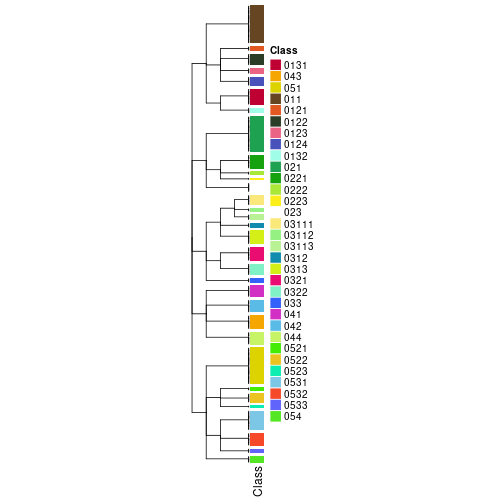</p>

</div>
<div id='tab-collect-classes-from-hierarchical-partition-5'>
<pre><code class="r">collect_classes(res_rh, merge_node = merge_node_param(min_n_signatures = 2544))
</code></pre>

<p></p>

</div>
<div id='tab-collect-classes-from-hierarchical-partition-6'>
<pre><code class="r">collect_classes(res_rh, merge_node = merge_node_param(min_n_signatures = 2840))
</code></pre>

<p></p>

</div>
<div id='tab-collect-classes-from-hierarchical-partition-7'>
<pre><code class="r">collect_classes(res_rh, merge_node = merge_node_param(min_n_signatures = 3199))
</code></pre>

<p></p>

</div>
<div id='tab-collect-classes-from-hierarchical-partition-8'>
<pre><code class="r">collect_classes(res_rh, merge_node = merge_node_param(min_n_signatures = 3659))
</code></pre>

<p></p>

</div>
<div id='tab-collect-classes-from-hierarchical-partition-9'>
<pre><code class="r">collect_classes(res_rh, merge_node = merge_node_param(min_n_signatures = 4193))
</code></pre>

<p></p>

</div>
<div id='tab-collect-classes-from-hierarchical-partition-10'>
<pre><code class="r">collect_classes(res_rh, merge_node = merge_node_param(min_n_signatures = 4789))
</code></pre>

<p></p>

</div>
<div id='tab-collect-classes-from-hierarchical-partition-11'>
<pre><code class="r">collect_classes(res_rh, merge_node = merge_node_param(min_n_signatures = 5590))
</code></pre>

<p></p>

</div>
<div id='tab-collect-classes-from-hierarchical-partition-12'>
<pre><code class="r">collect_classes(res_rh, merge_node = merge_node_param(min_n_signatures = 6551))
</code></pre>

<p></p>

</div>
<div id='tab-collect-classes-from-hierarchical-partition-13'>
<pre><code class="r">collect_classes(res_rh, merge_node = merge_node_param(min_n_signatures = 8085))
</code></pre>

<p></p>

</div>
<div id='tab-collect-classes-from-hierarchical-partition-14'>
<pre><code class="r">collect_classes(res_rh, merge_node = merge_node_param(min_n_signatures = 9931))
</code></pre>

<p></p>

</div>
<div id='tab-collect-classes-from-hierarchical-partition-15'>
<pre><code class="r">collect_classes(res_rh, merge_node = merge_node_param(min_n_signatures = 26826))
</code></pre>

<p></p>

</div>
<div id='tab-collect-classes-from-hierarchical-partition-16'>
<pre><code class="r">collect_classes(res_rh, merge_node = merge_node_param(min_n_signatures = 36795))
</code></pre>

<p></p>

</div>
<div id='tab-collect-classes-from-hierarchical-partition-17'>
<pre><code class="r">collect_classes(res_rh, merge_node = merge_node_param(min_n_signatures = 40190))
</code></pre>

<p></p>

</div>
</div>

Following shows the table of the partitions (You need to click the **show/hide
code output** link to see it).


<script>
$( function() {
	$( '#tabs-get-classes-from-hierarchical-partition' ).tabs();
} );
</script>
<div id='tabs-get-classes-from-hierarchical-partition'>
<ul>
<li><a href='#tab-get-classes-from-hierarchical-partition-1'>n_signatures ≥ 1141</a></li>
<li><a href='#tab-get-classes-from-hierarchical-partition-2'>n_signatures ≥ 1212</a></li>
<li><a href='#tab-get-classes-from-hierarchical-partition-3'>n_signatures ≥ 1801</a></li>
<li><a href='#tab-get-classes-from-hierarchical-partition-4'>n_signatures ≥ 2274</a></li>
<li><a href='#tab-get-classes-from-hierarchical-partition-5'>n_signatures ≥ 2544</a></li>
<li><a href='#tab-get-classes-from-hierarchical-partition-6'>n_signatures ≥ 2840</a></li>
<li><a href='#tab-get-classes-from-hierarchical-partition-7'>n_signatures ≥ 3199</a></li>
<li><a href='#tab-get-classes-from-hierarchical-partition-8'>n_signatures ≥ 3659</a></li>
<li><a href='#tab-get-classes-from-hierarchical-partition-9'>n_signatures ≥ 4193</a></li>
<li><a href='#tab-get-classes-from-hierarchical-partition-10'>n_signatures ≥ 4789</a></li>
<li><a href='#tab-get-classes-from-hierarchical-partition-11'>n_signatures ≥ 5590</a></li>
<li><a href='#tab-get-classes-from-hierarchical-partition-12'>n_signatures ≥ 6551</a></li>
<li><a href='#tab-get-classes-from-hierarchical-partition-13'>n_signatures ≥ 8085</a></li>
<li><a href='#tab-get-classes-from-hierarchical-partition-14'>n_signatures ≥ 9931</a></li>
<li><a href='#tab-get-classes-from-hierarchical-partition-15'>n_signatures ≥ 26826</a></li>
<li><a href='#tab-get-classes-from-hierarchical-partition-16'>n_signatures ≥ 36795</a></li>
<li><a href='#tab-get-classes-from-hierarchical-partition-17'>n_signatures ≥ 40190</a></li>
</ul>

<div id='tab-get-classes-from-hierarchical-partition-1'>
<p><a id='tab-get-classes-from-hierarchical-partition-1-a' style='color:#0366d6' href='#'>show/hide code output</a></p>
<pre><code class="r">get_classes(res_rh, merge_node = merge_node_param(min_n_signatures = 1141))
</code></pre>

<pre><code>#&gt; TCGA.SX.A7SM.01 TCGA.IA.A83W.01 TCGA.B1.A656.01 TCGA.4A.A93X.01 TCGA.G7.A8LC.01 TCGA.SX.A7SS.01 
#&gt;           &quot;042&quot;          &quot;0512&quot;          &quot;0312&quot;           &quot;042&quot;          &quot;0533&quot;           &quot;011&quot; 
#&gt; TCGA.B9.A69E.01 TCGA.BQ.5878.01 TCGA.DW.5561.01 TCGA.PJ.A8JU.01 TCGA.EV.5901.01 TCGA.SX.A7SR.01 
#&gt;          &quot;0313&quot;           &quot;011&quot;         &quot;01312&quot;          &quot;0322&quot;           &quot;054&quot;          &quot;0511&quot; 
#&gt; TCGA.BQ.5894.01 TCGA.KV.A6GE.01 TCGA.BQ.5882.01 TCGA.SX.A7SQ.01 TCGA.F9.A7Q0.01 TCGA.IZ.A6M8.01 
#&gt;           &quot;041&quot;           &quot;011&quot;          &quot;0432&quot;         &quot;01311&quot;          &quot;0321&quot;          &quot;0531&quot; 
#&gt; TCGA.B1.A654.01 TCGA.B3.8121.01 TCGA.MH.A856.01 TCGA.G7.A4TM.01 TCGA.IZ.8196.01 TCGA.B9.A5W7.01 
#&gt;          &quot;0132&quot;         &quot;03112&quot;          &quot;0512&quot;         &quot;01311&quot;          &quot;0123&quot;         &quot;01311&quot; 
#&gt; TCGA.B9.5156.01 TCGA.A4.A7UZ.01 TCGA.Y8.A897.01 TCGA.SX.A7SP.01 TCGA.Y8.A8RZ.01 TCGA.A4.A5XZ.01 
#&gt;          &quot;0513&quot;          &quot;0321&quot;          &quot;0511&quot;          &quot;0522&quot;          &quot;0523&quot;          &quot;0532&quot; 
#&gt; TCGA.Y8.A898.01 TCGA.BQ.5893.01 TCGA.SX.A7SU.01 TCGA.IZ.8195.01 TCGA.GL.8500.01 TCGA.EV.5902.01 
#&gt;          &quot;0511&quot;           &quot;041&quot;         &quot;01311&quot;           &quot;044&quot;          &quot;0124&quot;          &quot;0123&quot; 
#&gt; TCGA.J7.A8I2.01 TCGA.A4.8516.01 TCGA.A4.8312.01 TCGA.BQ.5880.01 TCGA.Y8.A8RY.01 TCGA.SX.A7SN.01 
#&gt;           &quot;033&quot;          &quot;0122&quot;           &quot;023&quot;          &quot;0321&quot;          &quot;0511&quot;          &quot;0513&quot; 
#&gt; TCGA.MH.A854.01 TCGA.A4.8517.01 TCGA.GL.A9DD.01 TCGA.A4.8630.01 TCGA.4A.A93W.01 TCGA.SX.A7SO.01 
#&gt;          &quot;0121&quot;          &quot;0531&quot;         &quot;03111&quot;           &quot;011&quot;          &quot;0132&quot;          &quot;0521&quot; 
#&gt; TCGA.GL.A9DC.01 TCGA.A4.8515.01 TCGA.IZ.A6M9.01 TCGA.BQ.5880.11 TCGA.B1.A657.01 TCGA.G7.A8LD.01 
#&gt;          &quot;0121&quot;           &quot;011&quot;           &quot;011&quot;           &quot;021&quot;          &quot;0511&quot;          &quot;0433&quot; 
#&gt; TCGA.Y8.A8S1.01 TCGA.IA.A83S.01 TCGA.Y8.A8S0.01 TCGA.BQ.5884.11 TCGA.B1.A655.01 TCGA.BQ.5877.11 
#&gt;          &quot;0313&quot;         &quot;03111&quot;           &quot;011&quot;          &quot;0221&quot;          &quot;0322&quot;           &quot;021&quot; 
#&gt; TCGA.EV.5903.01 TCGA.J7.8537.01 TCGA.A4.A6HP.01 TCGA.BQ.5890.01 TCGA.Y8.A896.01 TCGA.BQ.5888.01 
#&gt;          &quot;0513&quot;          &quot;0432&quot;          &quot;0513&quot;           &quot;042&quot;          &quot;0321&quot;          &quot;0322&quot; 
#&gt; TCGA.BQ.5879.01 TCGA.GL.A9DE.01 TCGA.G7.A8LB.01 TCGA.IA.A83T.01 TCGA.IA.A83V.01 TCGA.BQ.5876.11 
#&gt;           &quot;041&quot;           &quot;042&quot;           &quot;011&quot;          &quot;0313&quot;          &quot;0321&quot;           &quot;021&quot; 
#&gt; TCGA.BQ.5885.11 TCGA.KV.A6GD.01 TCGA.SX.A7SL.01 TCGA.B9.A8YI.01 TCGA.B9.A8YH.01 TCGA.4A.A93Y.01 
#&gt;           &quot;021&quot;         &quot;03111&quot;           &quot;011&quot;           &quot;044&quot;          &quot;0122&quot;          &quot;0322&quot; 
#&gt; TCGA.BQ.5886.01 TCGA.A4.A5Y0.01 TCGA.A4.8098.01 TCGA.MH.A857.01 TCGA.BQ.5889.11 TCGA.DW.5560.01 
#&gt;          &quot;0531&quot;          &quot;0522&quot;          &quot;0533&quot;           &quot;023&quot;           &quot;021&quot;           &quot;054&quot; 
#&gt; TCGA.F9.A8NY.01 TCGA.BQ.5894.11 TCGA.BQ.5891.11 TCGA.G7.A8LE.01 TCGA.SX.A71W.01 TCGA.Y8.A894.01 
#&gt;           &quot;041&quot;           &quot;021&quot;          &quot;0221&quot;         &quot;01311&quot;           &quot;011&quot;          &quot;0121&quot; 
#&gt; TCGA.WN.A9G9.01 TCGA.A4.8310.01 TCGA.A4.8518.01 TCGA.BQ.5881.11 TCGA.BQ.5893.11 TCGA.A4.8311.01 
#&gt;          &quot;0313&quot;          &quot;0532&quot;          &quot;0321&quot;           &quot;021&quot;           &quot;021&quot;           &quot;011&quot; 
#&gt; TCGA.BQ.5891.01 TCGA.Y8.A895.01 TCGA.BQ.5876.01 TCGA.MH.A855.01 TCGA.P4.AAVO.01 TCGA.BQ.5886.11 
#&gt;          &quot;0431&quot;           &quot;011&quot;          &quot;0312&quot;          &quot;0322&quot;           &quot;044&quot;           &quot;021&quot; 
#&gt; TCGA.2Z.A9JS.01 TCGA.BQ.5888.11 TCGA.2Z.A9J8.01 TCGA.KV.A74V.01 TCGA.A4.A5Y1.01 TCGA.BQ.5875.01 
#&gt;           &quot;011&quot;          &quot;0221&quot;          &quot;0523&quot;           &quot;011&quot;          &quot;0431&quot;           &quot;042&quot; 
#&gt; TCGA.UZ.A9PZ.01 TCGA.Q2.A5QZ.01 TCGA.P4.A5E8.01 TCGA.B9.5155.01 TCGA.B9.A5W9.01 TCGA.5P.A9K4.01 
#&gt;          &quot;0122&quot;           &quot;044&quot;           &quot;041&quot;           &quot;011&quot;           &quot;044&quot;           &quot;011&quot; 
#&gt; TCGA.P4.A5E7.01 TCGA.PJ.A5Z9.01 TCGA.5P.A9K8.01 TCGA.5P.A9KF.01 TCGA.P4.AAVK.01 TCGA.2Z.A9JM.01 
#&gt;           &quot;054&quot;           &quot;011&quot;          &quot;0223&quot;          &quot;0122&quot;           &quot;042&quot;          &quot;0513&quot; 
#&gt; TCGA.A4.A48D.01 TCGA.BQ.5889.01 TCGA.2Z.A9JD.01 TCGA.5P.A9K2.01 TCGA.2Z.A9JO.01 TCGA.5P.A9K9.01 
#&gt;          &quot;0313&quot;         &quot;03113&quot;          &quot;0531&quot;           &quot;011&quot;          &quot;0322&quot;          &quot;0433&quot; 
#&gt; TCGA.UZ.A9PV.01 TCGA.SX.A71V.01 TCGA.BQ.5892.11 TCGA.UZ.A9Q0.01 TCGA.UZ.A9PX.01 TCGA.UZ.A9PR.01 
#&gt;           &quot;011&quot;          &quot;0532&quot;           &quot;021&quot;           &quot;011&quot;          &quot;0122&quot;          &quot;0122&quot; 
#&gt; TCGA.IA.A40X.01 TCGA.5P.A9JW.01 TCGA.IA.A40Y.01 TCGA.BQ.5883.11 TCGA.BQ.5878.11 TCGA.P4.A5EA.01 
#&gt;          &quot;0522&quot;          &quot;0313&quot;          &quot;0431&quot;          &quot;0221&quot;          &quot;0221&quot;           &quot;041&quot; 
#&gt; TCGA.5P.A9KE.01 TCGA.5P.A9K3.01 TCGA.B1.A47N.01 TCGA.5P.A9KA.01 TCGA.BQ.5879.11 TCGA.P4.A5ED.01 
#&gt;          &quot;0531&quot;           &quot;042&quot;         &quot;01311&quot;          &quot;0512&quot;          &quot;0221&quot;           &quot;023&quot; 
#&gt; TCGA.A4.A772.01 TCGA.B1.A47O.01 TCGA.IA.A40U.01 TCGA.2Z.A9JE.01 TCGA.B9.A44B.01 TCGA.AT.A5NU.01 
#&gt;          &quot;0511&quot;         &quot;03112&quot;          &quot;0532&quot;          &quot;0123&quot;           &quot;042&quot;           &quot;011&quot; 
#&gt; TCGA.BQ.5882.11 TCGA.BQ.5877.01 TCGA.DW.7963.01 TCGA.2Z.A9JL.01 TCGA.2Z.A9JQ.01 TCGA.2Z.A9JK.01 
#&gt;           &quot;021&quot;          &quot;0431&quot;          &quot;0531&quot;          &quot;0512&quot;          &quot;0123&quot;          &quot;0321&quot; 
#&gt; TCGA.UZ.A9PU.01 TCGA.P4.A5EB.01 TCGA.BQ.5892.01 TCGA.B1.A47M.11 TCGA.2Z.A9J9.01 TCGA.UZ.A9PS.05 
#&gt;          &quot;0122&quot;          &quot;0124&quot;          &quot;0321&quot;           &quot;023&quot;           &quot;023&quot;          &quot;0312&quot; 
#&gt; TCGA.P4.AAVM.01 TCGA.PJ.A5Z8.01 TCGA.5P.A9JZ.01 TCGA.2Z.A9JG.01 TCGA.BQ.5884.01 TCGA.2Z.A9JI.01 
#&gt;          &quot;0531&quot;          &quot;0313&quot;           &quot;054&quot;           &quot;044&quot;          &quot;0322&quot;          &quot;0432&quot; 
#&gt; TCGA.BQ.5890.11 TCGA.BQ.5881.01 TCGA.UZ.A9PP.01 TCGA.5P.A9JU.01 TCGA.2Z.A9JN.01 TCGA.UZ.A9PS.01 
#&gt;           &quot;021&quot;          &quot;0531&quot;         &quot;01311&quot;           &quot;042&quot;          &quot;0222&quot;          &quot;0522&quot; 
#&gt; TCGA.BQ.5875.11 TCGA.5P.A9JY.01 TCGA.B9.A5W8.01 TCGA.F9.A4JJ.01 TCGA.BQ.5883.01 TCGA.5P.A9K0.01 
#&gt;          &quot;0221&quot;           &quot;011&quot;         &quot;03111&quot;           &quot;041&quot;          &quot;0222&quot;          &quot;0531&quot; 
#&gt; TCGA.P4.AAVL.01 TCGA.B1.5398.01 TCGA.5P.A9K6.01 TCGA.UZ.A9PQ.01 TCGA.P4.A5E6.01 TCGA.BQ.5885.01 
#&gt;          &quot;0124&quot;          &quot;0313&quot;          &quot;0531&quot;           &quot;044&quot;          &quot;0532&quot;          &quot;0532&quot; 
#&gt; TCGA.UZ.A9Q1.01 TCGA.2Z.A9JP.01 TCGA.5P.A9KC.01 TCGA.5P.A9KH.01 TCGA.2Z.A9JR.01 TCGA.GL.A59T.01 
#&gt;           &quot;044&quot;          &quot;0531&quot;          &quot;0322&quot;           &quot;023&quot;          &quot;0511&quot;          &quot;0511&quot; 
#&gt; TCGA.5P.A9JV.01 TCGA.WN.AB4C.01 TCGA.SX.A71R.01 TCGA.A4.A5DU.01 TCGA.B1.A47M.01 TCGA.2Z.A9JJ.01 
#&gt;           &quot;023&quot;          &quot;0322&quot;          &quot;0122&quot;          &quot;0132&quot;          &quot;0511&quot;           &quot;054&quot; 
#&gt; TCGA.2Z.A9JT.01 TCGA.GL.A4EM.01 TCGA.HE.7129.01 TCGA.HE.7128.01 TCGA.HE.A5NL.01 TCGA.G7.7502.01 
#&gt;          &quot;0531&quot;          &quot;0313&quot;           &quot;011&quot;         &quot;03111&quot;          &quot;0513&quot;          &quot;0532&quot; 
#&gt; TCGA.BQ.7059.01 TCGA.DZ.6134.11 TCGA.HE.A5NJ.01 TCGA.BQ.7053.11 TCGA.GL.6846.11 TCGA.GL.6846.01 
#&gt;         &quot;03111&quot;           &quot;021&quot;           &quot;011&quot;          &quot;0221&quot;           &quot;021&quot;           &quot;044&quot; 
#&gt; TCGA.DW.7839.01 TCGA.DW.7841.01 TCGA.BQ.7049.01 TCGA.G7.6793.01 TCGA.BQ.7051.01 TCGA.BQ.7045.01 
#&gt;          &quot;0132&quot;          &quot;0513&quot;         &quot;03113&quot;           &quot;041&quot;           &quot;011&quot;          &quot;0531&quot; 
#&gt; TCGA.HE.A5NF.01 TCGA.A4.7996.01 TCGA.BQ.7046.01 TCGA.DZ.6132.11 TCGA.G7.7501.01 TCGA.O9.A75Z.01 
#&gt;         &quot;03111&quot;          &quot;0532&quot;          &quot;0531&quot;           &quot;021&quot;          &quot;0521&quot;         &quot;01311&quot; 
#&gt; TCGA.DW.7834.01 TCGA.DZ.6133.01 TCGA.A4.A4ZT.01 TCGA.BQ.7060.01 TCGA.G7.6792.01 TCGA.HE.7130.01 
#&gt;          &quot;0511&quot;          &quot;0122&quot;           &quot;011&quot;          &quot;0531&quot;          &quot;0512&quot;           &quot;033&quot; 
#&gt; TCGA.GL.7773.01 TCGA.DZ.6133.11 TCGA.B1.7332.01 TCGA.BQ.7053.01 TCGA.DZ.6131.01 TCGA.BQ.7062.01 
#&gt;           &quot;054&quot;          &quot;0221&quot;           &quot;011&quot;          &quot;0522&quot;           &quot;033&quot;          &quot;0532&quot; 
#&gt; TCGA.BQ.7046.11 TCGA.A4.7288.01 TCGA.DZ.6131.11 TCGA.BQ.7062.11 TCGA.BQ.7061.01 TCGA.A4.7286.01 
#&gt;           &quot;021&quot;          &quot;0522&quot;           &quot;021&quot;           &quot;021&quot;           &quot;042&quot;          &quot;0532&quot; 
#&gt; TCGA.G7.6797.01 TCGA.BQ.7058.01 TCGA.G7.6795.01 TCGA.HE.A5NH.01 TCGA.MH.A55W.01 TCGA.G7.6790.01 
#&gt;           &quot;011&quot;           &quot;042&quot;          &quot;0511&quot;          &quot;0124&quot;          &quot;0532&quot;          &quot;0531&quot; 
#&gt; TCGA.MH.A560.01 TCGA.A4.7997.01 TCGA.MH.A561.01 TCGA.BQ.7056.11 TCGA.B9.7268.01 TCGA.BQ.7055.11 
#&gt;          &quot;0312&quot;          &quot;0512&quot;          &quot;0511&quot;          &quot;0221&quot;           &quot;011&quot;           &quot;021&quot; 
#&gt; TCGA.HE.A5NI.01 TCGA.GL.7966.01 TCGA.BQ.7059.11 TCGA.A4.A57E.01 TCGA.A4.7288.11 TCGA.AL.A5DJ.01 
#&gt;           &quot;011&quot;           &quot;041&quot;           &quot;021&quot;          &quot;0521&quot;          &quot;0221&quot;          &quot;0433&quot; 
#&gt; TCGA.G7.6796.01 TCGA.DW.7837.01 TCGA.BQ.7051.11 TCGA.BQ.7048.01 TCGA.F9.A7VF.01 TCGA.BQ.7049.11 
#&gt;          &quot;0321&quot;          &quot;0513&quot;           &quot;021&quot;           &quot;044&quot;           &quot;011&quot;           &quot;021&quot; 
#&gt; TCGA.DZ.6134.01 TCGA.BQ.5887.01 TCGA.DZ.6135.01 TCGA.MH.A55Z.01 TCGA.A4.7915.01 TCGA.BQ.7048.11 
#&gt;          &quot;0313&quot;          &quot;0432&quot;          &quot;0124&quot;          &quot;0122&quot;           &quot;041&quot;           &quot;021&quot; 
#&gt; TCGA.HE.A5NK.01 TCGA.G7.6789.01 TCGA.AL.7173.01 TCGA.SX.A71S.01 TCGA.BQ.7061.11 TCGA.DW.7840.01 
#&gt;         &quot;03111&quot;          &quot;0433&quot;         &quot;03112&quot;          &quot;0121&quot;          &quot;0223&quot;          &quot;0124&quot; 
#&gt; TCGA.GL.A59R.01 TCGA.BQ.7050.11 TCGA.BQ.7058.11 TCGA.DW.7838.01 TCGA.SX.A71U.01 TCGA.DZ.6135.11 
#&gt;          &quot;0123&quot;          &quot;0221&quot;           &quot;021&quot;         &quot;03113&quot;          &quot;0511&quot;           &quot;021&quot; 
#&gt; TCGA.BQ.7044.11 TCGA.V9.A7HT.01 TCGA.DW.7842.01 TCGA.BQ.7050.01 TCGA.BQ.7055.01 TCGA.J7.6720.01 
#&gt;           &quot;021&quot;         &quot;03111&quot;         &quot;01311&quot;          &quot;0522&quot;           &quot;023&quot;          &quot;0511&quot; 
#&gt; TCGA.BQ.7060.11 TCGA.BQ.7044.01 TCGA.DZ.6132.01 TCGA.DW.7836.01 TCGA.A4.7828.01 TCGA.BQ.5887.11 
#&gt;           &quot;021&quot;           &quot;044&quot;         &quot;03113&quot;         &quot;01311&quot;          &quot;0222&quot;           &quot;021&quot; 
#&gt; TCGA.B3.A6W5.01 TCGA.MH.A562.01 TCGA.A4.7734.01 TCGA.BQ.7045.11 TCGA.A4.7584.01 TCGA.BQ.7056.01 
#&gt;           &quot;011&quot;          &quot;0513&quot;          &quot;0132&quot;           &quot;021&quot;          &quot;0531&quot;          &quot;0522&quot; 
#&gt; TCGA.A4.7287.01 TCGA.UZ.A9PJ.01 TCGA.2Z.A9J1.01 TCGA.UN.AAZ9.01 TCGA.UZ.A9PO.01 TCGA.UZ.A9PL.01 
#&gt;           &quot;033&quot;         &quot;01311&quot;          &quot;0512&quot;          &quot;0533&quot;          &quot;0313&quot;          &quot;0124&quot; 
#&gt; TCGA.A4.7732.11 TCGA.A4.7732.01 TCGA.2Z.A9J2.01 TCGA.2Z.A9J3.01 TCGA.2Z.A9J6.01 TCGA.F9.A97G.01 
#&gt;           &quot;021&quot;         &quot;01311&quot;          &quot;0322&quot;          &quot;0124&quot;          &quot;0513&quot;          &quot;0313&quot; 
#&gt; TCGA.UZ.A9PM.01 TCGA.A4.7585.11 TCGA.2K.A9WE.01 TCGA.A4.7583.01 TCGA.UZ.A9PK.01 TCGA.UZ.A9PN.01 
#&gt;          &quot;0321&quot;           &quot;021&quot;         &quot;03113&quot;          &quot;0533&quot;           &quot;011&quot;          &quot;0321&quot; 
#&gt; TCGA.2Z.A9J7.01 TCGA.2Z.A9J5.01 TCGA.A4.7585.01 
#&gt;         &quot;01312&quot;          &quot;0511&quot;          &quot;0321&quot;
</code></pre>

<script>
$('#tab-get-classes-from-hierarchical-partition-1-a').parent().next().next().hide();
$('#tab-get-classes-from-hierarchical-partition-1-a').click(function(){
  $('#tab-get-classes-from-hierarchical-partition-1-a').parent().next().next().toggle();
  return(false);
});
</script>
</div>

<div id='tab-get-classes-from-hierarchical-partition-2'>
<p><a id='tab-get-classes-from-hierarchical-partition-2-a' style='color:#0366d6' href='#'>show/hide code output</a></p>
<pre><code class="r">get_classes(res_rh, merge_node = merge_node_param(min_n_signatures = 1212))
</code></pre>

<pre><code>#&gt; TCGA.SX.A7SM.01 TCGA.IA.A83W.01 TCGA.B1.A656.01 TCGA.4A.A93X.01 TCGA.G7.A8LC.01 TCGA.SX.A7SS.01 
#&gt;           &quot;042&quot;          &quot;0512&quot;          &quot;0312&quot;           &quot;042&quot;          &quot;0533&quot;           &quot;011&quot; 
#&gt; TCGA.B9.A69E.01 TCGA.BQ.5878.01 TCGA.DW.5561.01 TCGA.PJ.A8JU.01 TCGA.EV.5901.01 TCGA.SX.A7SR.01 
#&gt;          &quot;0313&quot;           &quot;011&quot;         &quot;01312&quot;          &quot;0322&quot;           &quot;054&quot;          &quot;0511&quot; 
#&gt; TCGA.BQ.5894.01 TCGA.KV.A6GE.01 TCGA.BQ.5882.01 TCGA.SX.A7SQ.01 TCGA.F9.A7Q0.01 TCGA.IZ.A6M8.01 
#&gt;           &quot;041&quot;           &quot;011&quot;           &quot;043&quot;         &quot;01311&quot;          &quot;0321&quot;          &quot;0531&quot; 
#&gt; TCGA.B1.A654.01 TCGA.B3.8121.01 TCGA.MH.A856.01 TCGA.G7.A4TM.01 TCGA.IZ.8196.01 TCGA.B9.A5W7.01 
#&gt;          &quot;0132&quot;         &quot;03112&quot;          &quot;0512&quot;         &quot;01311&quot;          &quot;0123&quot;         &quot;01311&quot; 
#&gt; TCGA.B9.5156.01 TCGA.A4.A7UZ.01 TCGA.Y8.A897.01 TCGA.SX.A7SP.01 TCGA.Y8.A8RZ.01 TCGA.A4.A5XZ.01 
#&gt;          &quot;0513&quot;          &quot;0321&quot;          &quot;0511&quot;          &quot;0522&quot;          &quot;0523&quot;          &quot;0532&quot; 
#&gt; TCGA.Y8.A898.01 TCGA.BQ.5893.01 TCGA.SX.A7SU.01 TCGA.IZ.8195.01 TCGA.GL.8500.01 TCGA.EV.5902.01 
#&gt;          &quot;0511&quot;           &quot;041&quot;         &quot;01311&quot;           &quot;044&quot;          &quot;0124&quot;          &quot;0123&quot; 
#&gt; TCGA.J7.A8I2.01 TCGA.A4.8516.01 TCGA.A4.8312.01 TCGA.BQ.5880.01 TCGA.Y8.A8RY.01 TCGA.SX.A7SN.01 
#&gt;           &quot;033&quot;          &quot;0122&quot;           &quot;023&quot;          &quot;0321&quot;          &quot;0511&quot;          &quot;0513&quot; 
#&gt; TCGA.MH.A854.01 TCGA.A4.8517.01 TCGA.GL.A9DD.01 TCGA.A4.8630.01 TCGA.4A.A93W.01 TCGA.SX.A7SO.01 
#&gt;          &quot;0121&quot;          &quot;0531&quot;         &quot;03111&quot;           &quot;011&quot;          &quot;0132&quot;          &quot;0521&quot; 
#&gt; TCGA.GL.A9DC.01 TCGA.A4.8515.01 TCGA.IZ.A6M9.01 TCGA.BQ.5880.11 TCGA.B1.A657.01 TCGA.G7.A8LD.01 
#&gt;          &quot;0121&quot;           &quot;011&quot;           &quot;011&quot;           &quot;021&quot;          &quot;0511&quot;           &quot;043&quot; 
#&gt; TCGA.Y8.A8S1.01 TCGA.IA.A83S.01 TCGA.Y8.A8S0.01 TCGA.BQ.5884.11 TCGA.B1.A655.01 TCGA.BQ.5877.11 
#&gt;          &quot;0313&quot;         &quot;03111&quot;           &quot;011&quot;          &quot;0221&quot;          &quot;0322&quot;           &quot;021&quot; 
#&gt; TCGA.EV.5903.01 TCGA.J7.8537.01 TCGA.A4.A6HP.01 TCGA.BQ.5890.01 TCGA.Y8.A896.01 TCGA.BQ.5888.01 
#&gt;          &quot;0513&quot;           &quot;043&quot;          &quot;0513&quot;           &quot;042&quot;          &quot;0321&quot;          &quot;0322&quot; 
#&gt; TCGA.BQ.5879.01 TCGA.GL.A9DE.01 TCGA.G7.A8LB.01 TCGA.IA.A83T.01 TCGA.IA.A83V.01 TCGA.BQ.5876.11 
#&gt;           &quot;041&quot;           &quot;042&quot;           &quot;011&quot;          &quot;0313&quot;          &quot;0321&quot;           &quot;021&quot; 
#&gt; TCGA.BQ.5885.11 TCGA.KV.A6GD.01 TCGA.SX.A7SL.01 TCGA.B9.A8YI.01 TCGA.B9.A8YH.01 TCGA.4A.A93Y.01 
#&gt;           &quot;021&quot;         &quot;03111&quot;           &quot;011&quot;           &quot;044&quot;          &quot;0122&quot;          &quot;0322&quot; 
#&gt; TCGA.BQ.5886.01 TCGA.A4.A5Y0.01 TCGA.A4.8098.01 TCGA.MH.A857.01 TCGA.BQ.5889.11 TCGA.DW.5560.01 
#&gt;          &quot;0531&quot;          &quot;0522&quot;          &quot;0533&quot;           &quot;023&quot;           &quot;021&quot;           &quot;054&quot; 
#&gt; TCGA.F9.A8NY.01 TCGA.BQ.5894.11 TCGA.BQ.5891.11 TCGA.G7.A8LE.01 TCGA.SX.A71W.01 TCGA.Y8.A894.01 
#&gt;           &quot;041&quot;           &quot;021&quot;          &quot;0221&quot;         &quot;01311&quot;           &quot;011&quot;          &quot;0121&quot; 
#&gt; TCGA.WN.A9G9.01 TCGA.A4.8310.01 TCGA.A4.8518.01 TCGA.BQ.5881.11 TCGA.BQ.5893.11 TCGA.A4.8311.01 
#&gt;          &quot;0313&quot;          &quot;0532&quot;          &quot;0321&quot;           &quot;021&quot;           &quot;021&quot;           &quot;011&quot; 
#&gt; TCGA.BQ.5891.01 TCGA.Y8.A895.01 TCGA.BQ.5876.01 TCGA.MH.A855.01 TCGA.P4.AAVO.01 TCGA.BQ.5886.11 
#&gt;           &quot;043&quot;           &quot;011&quot;          &quot;0312&quot;          &quot;0322&quot;           &quot;044&quot;           &quot;021&quot; 
#&gt; TCGA.2Z.A9JS.01 TCGA.BQ.5888.11 TCGA.2Z.A9J8.01 TCGA.KV.A74V.01 TCGA.A4.A5Y1.01 TCGA.BQ.5875.01 
#&gt;           &quot;011&quot;          &quot;0221&quot;          &quot;0523&quot;           &quot;011&quot;           &quot;043&quot;           &quot;042&quot; 
#&gt; TCGA.UZ.A9PZ.01 TCGA.Q2.A5QZ.01 TCGA.P4.A5E8.01 TCGA.B9.5155.01 TCGA.B9.A5W9.01 TCGA.5P.A9K4.01 
#&gt;          &quot;0122&quot;           &quot;044&quot;           &quot;041&quot;           &quot;011&quot;           &quot;044&quot;           &quot;011&quot; 
#&gt; TCGA.P4.A5E7.01 TCGA.PJ.A5Z9.01 TCGA.5P.A9K8.01 TCGA.5P.A9KF.01 TCGA.P4.AAVK.01 TCGA.2Z.A9JM.01 
#&gt;           &quot;054&quot;           &quot;011&quot;          &quot;0223&quot;          &quot;0122&quot;           &quot;042&quot;          &quot;0513&quot; 
#&gt; TCGA.A4.A48D.01 TCGA.BQ.5889.01 TCGA.2Z.A9JD.01 TCGA.5P.A9K2.01 TCGA.2Z.A9JO.01 TCGA.5P.A9K9.01 
#&gt;          &quot;0313&quot;         &quot;03113&quot;          &quot;0531&quot;           &quot;011&quot;          &quot;0322&quot;           &quot;043&quot; 
#&gt; TCGA.UZ.A9PV.01 TCGA.SX.A71V.01 TCGA.BQ.5892.11 TCGA.UZ.A9Q0.01 TCGA.UZ.A9PX.01 TCGA.UZ.A9PR.01 
#&gt;           &quot;011&quot;          &quot;0532&quot;           &quot;021&quot;           &quot;011&quot;          &quot;0122&quot;          &quot;0122&quot; 
#&gt; TCGA.IA.A40X.01 TCGA.5P.A9JW.01 TCGA.IA.A40Y.01 TCGA.BQ.5883.11 TCGA.BQ.5878.11 TCGA.P4.A5EA.01 
#&gt;          &quot;0522&quot;          &quot;0313&quot;           &quot;043&quot;          &quot;0221&quot;          &quot;0221&quot;           &quot;041&quot; 
#&gt; TCGA.5P.A9KE.01 TCGA.5P.A9K3.01 TCGA.B1.A47N.01 TCGA.5P.A9KA.01 TCGA.BQ.5879.11 TCGA.P4.A5ED.01 
#&gt;          &quot;0531&quot;           &quot;042&quot;         &quot;01311&quot;          &quot;0512&quot;          &quot;0221&quot;           &quot;023&quot; 
#&gt; TCGA.A4.A772.01 TCGA.B1.A47O.01 TCGA.IA.A40U.01 TCGA.2Z.A9JE.01 TCGA.B9.A44B.01 TCGA.AT.A5NU.01 
#&gt;          &quot;0511&quot;         &quot;03112&quot;          &quot;0532&quot;          &quot;0123&quot;           &quot;042&quot;           &quot;011&quot; 
#&gt; TCGA.BQ.5882.11 TCGA.BQ.5877.01 TCGA.DW.7963.01 TCGA.2Z.A9JL.01 TCGA.2Z.A9JQ.01 TCGA.2Z.A9JK.01 
#&gt;           &quot;021&quot;           &quot;043&quot;          &quot;0531&quot;          &quot;0512&quot;          &quot;0123&quot;          &quot;0321&quot; 
#&gt; TCGA.UZ.A9PU.01 TCGA.P4.A5EB.01 TCGA.BQ.5892.01 TCGA.B1.A47M.11 TCGA.2Z.A9J9.01 TCGA.UZ.A9PS.05 
#&gt;          &quot;0122&quot;          &quot;0124&quot;          &quot;0321&quot;           &quot;023&quot;           &quot;023&quot;          &quot;0312&quot; 
#&gt; TCGA.P4.AAVM.01 TCGA.PJ.A5Z8.01 TCGA.5P.A9JZ.01 TCGA.2Z.A9JG.01 TCGA.BQ.5884.01 TCGA.2Z.A9JI.01 
#&gt;          &quot;0531&quot;          &quot;0313&quot;           &quot;054&quot;           &quot;044&quot;          &quot;0322&quot;           &quot;043&quot; 
#&gt; TCGA.BQ.5890.11 TCGA.BQ.5881.01 TCGA.UZ.A9PP.01 TCGA.5P.A9JU.01 TCGA.2Z.A9JN.01 TCGA.UZ.A9PS.01 
#&gt;           &quot;021&quot;          &quot;0531&quot;         &quot;01311&quot;           &quot;042&quot;          &quot;0222&quot;          &quot;0522&quot; 
#&gt; TCGA.BQ.5875.11 TCGA.5P.A9JY.01 TCGA.B9.A5W8.01 TCGA.F9.A4JJ.01 TCGA.BQ.5883.01 TCGA.5P.A9K0.01 
#&gt;          &quot;0221&quot;           &quot;011&quot;         &quot;03111&quot;           &quot;041&quot;          &quot;0222&quot;          &quot;0531&quot; 
#&gt; TCGA.P4.AAVL.01 TCGA.B1.5398.01 TCGA.5P.A9K6.01 TCGA.UZ.A9PQ.01 TCGA.P4.A5E6.01 TCGA.BQ.5885.01 
#&gt;          &quot;0124&quot;          &quot;0313&quot;          &quot;0531&quot;           &quot;044&quot;          &quot;0532&quot;          &quot;0532&quot; 
#&gt; TCGA.UZ.A9Q1.01 TCGA.2Z.A9JP.01 TCGA.5P.A9KC.01 TCGA.5P.A9KH.01 TCGA.2Z.A9JR.01 TCGA.GL.A59T.01 
#&gt;           &quot;044&quot;          &quot;0531&quot;          &quot;0322&quot;           &quot;023&quot;          &quot;0511&quot;          &quot;0511&quot; 
#&gt; TCGA.5P.A9JV.01 TCGA.WN.AB4C.01 TCGA.SX.A71R.01 TCGA.A4.A5DU.01 TCGA.B1.A47M.01 TCGA.2Z.A9JJ.01 
#&gt;           &quot;023&quot;          &quot;0322&quot;          &quot;0122&quot;          &quot;0132&quot;          &quot;0511&quot;           &quot;054&quot; 
#&gt; TCGA.2Z.A9JT.01 TCGA.GL.A4EM.01 TCGA.HE.7129.01 TCGA.HE.7128.01 TCGA.HE.A5NL.01 TCGA.G7.7502.01 
#&gt;          &quot;0531&quot;          &quot;0313&quot;           &quot;011&quot;         &quot;03111&quot;          &quot;0513&quot;          &quot;0532&quot; 
#&gt; TCGA.BQ.7059.01 TCGA.DZ.6134.11 TCGA.HE.A5NJ.01 TCGA.BQ.7053.11 TCGA.GL.6846.11 TCGA.GL.6846.01 
#&gt;         &quot;03111&quot;           &quot;021&quot;           &quot;011&quot;          &quot;0221&quot;           &quot;021&quot;           &quot;044&quot; 
#&gt; TCGA.DW.7839.01 TCGA.DW.7841.01 TCGA.BQ.7049.01 TCGA.G7.6793.01 TCGA.BQ.7051.01 TCGA.BQ.7045.01 
#&gt;          &quot;0132&quot;          &quot;0513&quot;         &quot;03113&quot;           &quot;041&quot;           &quot;011&quot;          &quot;0531&quot; 
#&gt; TCGA.HE.A5NF.01 TCGA.A4.7996.01 TCGA.BQ.7046.01 TCGA.DZ.6132.11 TCGA.G7.7501.01 TCGA.O9.A75Z.01 
#&gt;         &quot;03111&quot;          &quot;0532&quot;          &quot;0531&quot;           &quot;021&quot;          &quot;0521&quot;         &quot;01311&quot; 
#&gt; TCGA.DW.7834.01 TCGA.DZ.6133.01 TCGA.A4.A4ZT.01 TCGA.BQ.7060.01 TCGA.G7.6792.01 TCGA.HE.7130.01 
#&gt;          &quot;0511&quot;          &quot;0122&quot;           &quot;011&quot;          &quot;0531&quot;          &quot;0512&quot;           &quot;033&quot; 
#&gt; TCGA.GL.7773.01 TCGA.DZ.6133.11 TCGA.B1.7332.01 TCGA.BQ.7053.01 TCGA.DZ.6131.01 TCGA.BQ.7062.01 
#&gt;           &quot;054&quot;          &quot;0221&quot;           &quot;011&quot;          &quot;0522&quot;           &quot;033&quot;          &quot;0532&quot; 
#&gt; TCGA.BQ.7046.11 TCGA.A4.7288.01 TCGA.DZ.6131.11 TCGA.BQ.7062.11 TCGA.BQ.7061.01 TCGA.A4.7286.01 
#&gt;           &quot;021&quot;          &quot;0522&quot;           &quot;021&quot;           &quot;021&quot;           &quot;042&quot;          &quot;0532&quot; 
#&gt; TCGA.G7.6797.01 TCGA.BQ.7058.01 TCGA.G7.6795.01 TCGA.HE.A5NH.01 TCGA.MH.A55W.01 TCGA.G7.6790.01 
#&gt;           &quot;011&quot;           &quot;042&quot;          &quot;0511&quot;          &quot;0124&quot;          &quot;0532&quot;          &quot;0531&quot; 
#&gt; TCGA.MH.A560.01 TCGA.A4.7997.01 TCGA.MH.A561.01 TCGA.BQ.7056.11 TCGA.B9.7268.01 TCGA.BQ.7055.11 
#&gt;          &quot;0312&quot;          &quot;0512&quot;          &quot;0511&quot;          &quot;0221&quot;           &quot;011&quot;           &quot;021&quot; 
#&gt; TCGA.HE.A5NI.01 TCGA.GL.7966.01 TCGA.BQ.7059.11 TCGA.A4.A57E.01 TCGA.A4.7288.11 TCGA.AL.A5DJ.01 
#&gt;           &quot;011&quot;           &quot;041&quot;           &quot;021&quot;          &quot;0521&quot;          &quot;0221&quot;           &quot;043&quot; 
#&gt; TCGA.G7.6796.01 TCGA.DW.7837.01 TCGA.BQ.7051.11 TCGA.BQ.7048.01 TCGA.F9.A7VF.01 TCGA.BQ.7049.11 
#&gt;          &quot;0321&quot;          &quot;0513&quot;           &quot;021&quot;           &quot;044&quot;           &quot;011&quot;           &quot;021&quot; 
#&gt; TCGA.DZ.6134.01 TCGA.BQ.5887.01 TCGA.DZ.6135.01 TCGA.MH.A55Z.01 TCGA.A4.7915.01 TCGA.BQ.7048.11 
#&gt;          &quot;0313&quot;           &quot;043&quot;          &quot;0124&quot;          &quot;0122&quot;           &quot;041&quot;           &quot;021&quot; 
#&gt; TCGA.HE.A5NK.01 TCGA.G7.6789.01 TCGA.AL.7173.01 TCGA.SX.A71S.01 TCGA.BQ.7061.11 TCGA.DW.7840.01 
#&gt;         &quot;03111&quot;           &quot;043&quot;         &quot;03112&quot;          &quot;0121&quot;          &quot;0223&quot;          &quot;0124&quot; 
#&gt; TCGA.GL.A59R.01 TCGA.BQ.7050.11 TCGA.BQ.7058.11 TCGA.DW.7838.01 TCGA.SX.A71U.01 TCGA.DZ.6135.11 
#&gt;          &quot;0123&quot;          &quot;0221&quot;           &quot;021&quot;         &quot;03113&quot;          &quot;0511&quot;           &quot;021&quot; 
#&gt; TCGA.BQ.7044.11 TCGA.V9.A7HT.01 TCGA.DW.7842.01 TCGA.BQ.7050.01 TCGA.BQ.7055.01 TCGA.J7.6720.01 
#&gt;           &quot;021&quot;         &quot;03111&quot;         &quot;01311&quot;          &quot;0522&quot;           &quot;023&quot;          &quot;0511&quot; 
#&gt; TCGA.BQ.7060.11 TCGA.BQ.7044.01 TCGA.DZ.6132.01 TCGA.DW.7836.01 TCGA.A4.7828.01 TCGA.BQ.5887.11 
#&gt;           &quot;021&quot;           &quot;044&quot;         &quot;03113&quot;         &quot;01311&quot;          &quot;0222&quot;           &quot;021&quot; 
#&gt; TCGA.B3.A6W5.01 TCGA.MH.A562.01 TCGA.A4.7734.01 TCGA.BQ.7045.11 TCGA.A4.7584.01 TCGA.BQ.7056.01 
#&gt;           &quot;011&quot;          &quot;0513&quot;          &quot;0132&quot;           &quot;021&quot;          &quot;0531&quot;          &quot;0522&quot; 
#&gt; TCGA.A4.7287.01 TCGA.UZ.A9PJ.01 TCGA.2Z.A9J1.01 TCGA.UN.AAZ9.01 TCGA.UZ.A9PO.01 TCGA.UZ.A9PL.01 
#&gt;           &quot;033&quot;         &quot;01311&quot;          &quot;0512&quot;          &quot;0533&quot;          &quot;0313&quot;          &quot;0124&quot; 
#&gt; TCGA.A4.7732.11 TCGA.A4.7732.01 TCGA.2Z.A9J2.01 TCGA.2Z.A9J3.01 TCGA.2Z.A9J6.01 TCGA.F9.A97G.01 
#&gt;           &quot;021&quot;         &quot;01311&quot;          &quot;0322&quot;          &quot;0124&quot;          &quot;0513&quot;          &quot;0313&quot; 
#&gt; TCGA.UZ.A9PM.01 TCGA.A4.7585.11 TCGA.2K.A9WE.01 TCGA.A4.7583.01 TCGA.UZ.A9PK.01 TCGA.UZ.A9PN.01 
#&gt;          &quot;0321&quot;           &quot;021&quot;         &quot;03113&quot;          &quot;0533&quot;           &quot;011&quot;          &quot;0321&quot; 
#&gt; TCGA.2Z.A9J7.01 TCGA.2Z.A9J5.01 TCGA.A4.7585.01 
#&gt;         &quot;01312&quot;          &quot;0511&quot;          &quot;0321&quot;
</code></pre>

<script>
$('#tab-get-classes-from-hierarchical-partition-2-a').parent().next().next().hide();
$('#tab-get-classes-from-hierarchical-partition-2-a').click(function(){
  $('#tab-get-classes-from-hierarchical-partition-2-a').parent().next().next().toggle();
  return(false);
});
</script>
</div>

<div id='tab-get-classes-from-hierarchical-partition-3'>
<p><a id='tab-get-classes-from-hierarchical-partition-3-a' style='color:#0366d6' href='#'>show/hide code output</a></p>
<pre><code class="r">get_classes(res_rh, merge_node = merge_node_param(min_n_signatures = 1801))
</code></pre>

<pre><code>#&gt; TCGA.SX.A7SM.01 TCGA.IA.A83W.01 TCGA.B1.A656.01 TCGA.4A.A93X.01 TCGA.G7.A8LC.01 TCGA.SX.A7SS.01 
#&gt;           &quot;042&quot;          &quot;0512&quot;          &quot;0312&quot;           &quot;042&quot;          &quot;0533&quot;           &quot;011&quot; 
#&gt; TCGA.B9.A69E.01 TCGA.BQ.5878.01 TCGA.DW.5561.01 TCGA.PJ.A8JU.01 TCGA.EV.5901.01 TCGA.SX.A7SR.01 
#&gt;          &quot;0313&quot;           &quot;011&quot;          &quot;0131&quot;          &quot;0322&quot;           &quot;054&quot;          &quot;0511&quot; 
#&gt; TCGA.BQ.5894.01 TCGA.KV.A6GE.01 TCGA.BQ.5882.01 TCGA.SX.A7SQ.01 TCGA.F9.A7Q0.01 TCGA.IZ.A6M8.01 
#&gt;           &quot;041&quot;           &quot;011&quot;           &quot;043&quot;          &quot;0131&quot;          &quot;0321&quot;          &quot;0531&quot; 
#&gt; TCGA.B1.A654.01 TCGA.B3.8121.01 TCGA.MH.A856.01 TCGA.G7.A4TM.01 TCGA.IZ.8196.01 TCGA.B9.A5W7.01 
#&gt;          &quot;0132&quot;         &quot;03112&quot;          &quot;0512&quot;          &quot;0131&quot;          &quot;0123&quot;          &quot;0131&quot; 
#&gt; TCGA.B9.5156.01 TCGA.A4.A7UZ.01 TCGA.Y8.A897.01 TCGA.SX.A7SP.01 TCGA.Y8.A8RZ.01 TCGA.A4.A5XZ.01 
#&gt;          &quot;0513&quot;          &quot;0321&quot;          &quot;0511&quot;          &quot;0522&quot;          &quot;0523&quot;          &quot;0532&quot; 
#&gt; TCGA.Y8.A898.01 TCGA.BQ.5893.01 TCGA.SX.A7SU.01 TCGA.IZ.8195.01 TCGA.GL.8500.01 TCGA.EV.5902.01 
#&gt;          &quot;0511&quot;           &quot;041&quot;          &quot;0131&quot;           &quot;044&quot;          &quot;0124&quot;          &quot;0123&quot; 
#&gt; TCGA.J7.A8I2.01 TCGA.A4.8516.01 TCGA.A4.8312.01 TCGA.BQ.5880.01 TCGA.Y8.A8RY.01 TCGA.SX.A7SN.01 
#&gt;           &quot;033&quot;          &quot;0122&quot;           &quot;023&quot;          &quot;0321&quot;          &quot;0511&quot;          &quot;0513&quot; 
#&gt; TCGA.MH.A854.01 TCGA.A4.8517.01 TCGA.GL.A9DD.01 TCGA.A4.8630.01 TCGA.4A.A93W.01 TCGA.SX.A7SO.01 
#&gt;          &quot;0121&quot;          &quot;0531&quot;         &quot;03111&quot;           &quot;011&quot;          &quot;0132&quot;          &quot;0521&quot; 
#&gt; TCGA.GL.A9DC.01 TCGA.A4.8515.01 TCGA.IZ.A6M9.01 TCGA.BQ.5880.11 TCGA.B1.A657.01 TCGA.G7.A8LD.01 
#&gt;          &quot;0121&quot;           &quot;011&quot;           &quot;011&quot;           &quot;021&quot;          &quot;0511&quot;           &quot;043&quot; 
#&gt; TCGA.Y8.A8S1.01 TCGA.IA.A83S.01 TCGA.Y8.A8S0.01 TCGA.BQ.5884.11 TCGA.B1.A655.01 TCGA.BQ.5877.11 
#&gt;          &quot;0313&quot;         &quot;03111&quot;           &quot;011&quot;          &quot;0221&quot;          &quot;0322&quot;           &quot;021&quot; 
#&gt; TCGA.EV.5903.01 TCGA.J7.8537.01 TCGA.A4.A6HP.01 TCGA.BQ.5890.01 TCGA.Y8.A896.01 TCGA.BQ.5888.01 
#&gt;          &quot;0513&quot;           &quot;043&quot;          &quot;0513&quot;           &quot;042&quot;          &quot;0321&quot;          &quot;0322&quot; 
#&gt; TCGA.BQ.5879.01 TCGA.GL.A9DE.01 TCGA.G7.A8LB.01 TCGA.IA.A83T.01 TCGA.IA.A83V.01 TCGA.BQ.5876.11 
#&gt;           &quot;041&quot;           &quot;042&quot;           &quot;011&quot;          &quot;0313&quot;          &quot;0321&quot;           &quot;021&quot; 
#&gt; TCGA.BQ.5885.11 TCGA.KV.A6GD.01 TCGA.SX.A7SL.01 TCGA.B9.A8YI.01 TCGA.B9.A8YH.01 TCGA.4A.A93Y.01 
#&gt;           &quot;021&quot;         &quot;03111&quot;           &quot;011&quot;           &quot;044&quot;          &quot;0122&quot;          &quot;0322&quot; 
#&gt; TCGA.BQ.5886.01 TCGA.A4.A5Y0.01 TCGA.A4.8098.01 TCGA.MH.A857.01 TCGA.BQ.5889.11 TCGA.DW.5560.01 
#&gt;          &quot;0531&quot;          &quot;0522&quot;          &quot;0533&quot;           &quot;023&quot;           &quot;021&quot;           &quot;054&quot; 
#&gt; TCGA.F9.A8NY.01 TCGA.BQ.5894.11 TCGA.BQ.5891.11 TCGA.G7.A8LE.01 TCGA.SX.A71W.01 TCGA.Y8.A894.01 
#&gt;           &quot;041&quot;           &quot;021&quot;          &quot;0221&quot;          &quot;0131&quot;           &quot;011&quot;          &quot;0121&quot; 
#&gt; TCGA.WN.A9G9.01 TCGA.A4.8310.01 TCGA.A4.8518.01 TCGA.BQ.5881.11 TCGA.BQ.5893.11 TCGA.A4.8311.01 
#&gt;          &quot;0313&quot;          &quot;0532&quot;          &quot;0321&quot;           &quot;021&quot;           &quot;021&quot;           &quot;011&quot; 
#&gt; TCGA.BQ.5891.01 TCGA.Y8.A895.01 TCGA.BQ.5876.01 TCGA.MH.A855.01 TCGA.P4.AAVO.01 TCGA.BQ.5886.11 
#&gt;           &quot;043&quot;           &quot;011&quot;          &quot;0312&quot;          &quot;0322&quot;           &quot;044&quot;           &quot;021&quot; 
#&gt; TCGA.2Z.A9JS.01 TCGA.BQ.5888.11 TCGA.2Z.A9J8.01 TCGA.KV.A74V.01 TCGA.A4.A5Y1.01 TCGA.BQ.5875.01 
#&gt;           &quot;011&quot;          &quot;0221&quot;          &quot;0523&quot;           &quot;011&quot;           &quot;043&quot;           &quot;042&quot; 
#&gt; TCGA.UZ.A9PZ.01 TCGA.Q2.A5QZ.01 TCGA.P4.A5E8.01 TCGA.B9.5155.01 TCGA.B9.A5W9.01 TCGA.5P.A9K4.01 
#&gt;          &quot;0122&quot;           &quot;044&quot;           &quot;041&quot;           &quot;011&quot;           &quot;044&quot;           &quot;011&quot; 
#&gt; TCGA.P4.A5E7.01 TCGA.PJ.A5Z9.01 TCGA.5P.A9K8.01 TCGA.5P.A9KF.01 TCGA.P4.AAVK.01 TCGA.2Z.A9JM.01 
#&gt;           &quot;054&quot;           &quot;011&quot;          &quot;0223&quot;          &quot;0122&quot;           &quot;042&quot;          &quot;0513&quot; 
#&gt; TCGA.A4.A48D.01 TCGA.BQ.5889.01 TCGA.2Z.A9JD.01 TCGA.5P.A9K2.01 TCGA.2Z.A9JO.01 TCGA.5P.A9K9.01 
#&gt;          &quot;0313&quot;         &quot;03113&quot;          &quot;0531&quot;           &quot;011&quot;          &quot;0322&quot;           &quot;043&quot; 
#&gt; TCGA.UZ.A9PV.01 TCGA.SX.A71V.01 TCGA.BQ.5892.11 TCGA.UZ.A9Q0.01 TCGA.UZ.A9PX.01 TCGA.UZ.A9PR.01 
#&gt;           &quot;011&quot;          &quot;0532&quot;           &quot;021&quot;           &quot;011&quot;          &quot;0122&quot;          &quot;0122&quot; 
#&gt; TCGA.IA.A40X.01 TCGA.5P.A9JW.01 TCGA.IA.A40Y.01 TCGA.BQ.5883.11 TCGA.BQ.5878.11 TCGA.P4.A5EA.01 
#&gt;          &quot;0522&quot;          &quot;0313&quot;           &quot;043&quot;          &quot;0221&quot;          &quot;0221&quot;           &quot;041&quot; 
#&gt; TCGA.5P.A9KE.01 TCGA.5P.A9K3.01 TCGA.B1.A47N.01 TCGA.5P.A9KA.01 TCGA.BQ.5879.11 TCGA.P4.A5ED.01 
#&gt;          &quot;0531&quot;           &quot;042&quot;          &quot;0131&quot;          &quot;0512&quot;          &quot;0221&quot;           &quot;023&quot; 
#&gt; TCGA.A4.A772.01 TCGA.B1.A47O.01 TCGA.IA.A40U.01 TCGA.2Z.A9JE.01 TCGA.B9.A44B.01 TCGA.AT.A5NU.01 
#&gt;          &quot;0511&quot;         &quot;03112&quot;          &quot;0532&quot;          &quot;0123&quot;           &quot;042&quot;           &quot;011&quot; 
#&gt; TCGA.BQ.5882.11 TCGA.BQ.5877.01 TCGA.DW.7963.01 TCGA.2Z.A9JL.01 TCGA.2Z.A9JQ.01 TCGA.2Z.A9JK.01 
#&gt;           &quot;021&quot;           &quot;043&quot;          &quot;0531&quot;          &quot;0512&quot;          &quot;0123&quot;          &quot;0321&quot; 
#&gt; TCGA.UZ.A9PU.01 TCGA.P4.A5EB.01 TCGA.BQ.5892.01 TCGA.B1.A47M.11 TCGA.2Z.A9J9.01 TCGA.UZ.A9PS.05 
#&gt;          &quot;0122&quot;          &quot;0124&quot;          &quot;0321&quot;           &quot;023&quot;           &quot;023&quot;          &quot;0312&quot; 
#&gt; TCGA.P4.AAVM.01 TCGA.PJ.A5Z8.01 TCGA.5P.A9JZ.01 TCGA.2Z.A9JG.01 TCGA.BQ.5884.01 TCGA.2Z.A9JI.01 
#&gt;          &quot;0531&quot;          &quot;0313&quot;           &quot;054&quot;           &quot;044&quot;          &quot;0322&quot;           &quot;043&quot; 
#&gt; TCGA.BQ.5890.11 TCGA.BQ.5881.01 TCGA.UZ.A9PP.01 TCGA.5P.A9JU.01 TCGA.2Z.A9JN.01 TCGA.UZ.A9PS.01 
#&gt;           &quot;021&quot;          &quot;0531&quot;          &quot;0131&quot;           &quot;042&quot;          &quot;0222&quot;          &quot;0522&quot; 
#&gt; TCGA.BQ.5875.11 TCGA.5P.A9JY.01 TCGA.B9.A5W8.01 TCGA.F9.A4JJ.01 TCGA.BQ.5883.01 TCGA.5P.A9K0.01 
#&gt;          &quot;0221&quot;           &quot;011&quot;         &quot;03111&quot;           &quot;041&quot;          &quot;0222&quot;          &quot;0531&quot; 
#&gt; TCGA.P4.AAVL.01 TCGA.B1.5398.01 TCGA.5P.A9K6.01 TCGA.UZ.A9PQ.01 TCGA.P4.A5E6.01 TCGA.BQ.5885.01 
#&gt;          &quot;0124&quot;          &quot;0313&quot;          &quot;0531&quot;           &quot;044&quot;          &quot;0532&quot;          &quot;0532&quot; 
#&gt; TCGA.UZ.A9Q1.01 TCGA.2Z.A9JP.01 TCGA.5P.A9KC.01 TCGA.5P.A9KH.01 TCGA.2Z.A9JR.01 TCGA.GL.A59T.01 
#&gt;           &quot;044&quot;          &quot;0531&quot;          &quot;0322&quot;           &quot;023&quot;          &quot;0511&quot;          &quot;0511&quot; 
#&gt; TCGA.5P.A9JV.01 TCGA.WN.AB4C.01 TCGA.SX.A71R.01 TCGA.A4.A5DU.01 TCGA.B1.A47M.01 TCGA.2Z.A9JJ.01 
#&gt;           &quot;023&quot;          &quot;0322&quot;          &quot;0122&quot;          &quot;0132&quot;          &quot;0511&quot;           &quot;054&quot; 
#&gt; TCGA.2Z.A9JT.01 TCGA.GL.A4EM.01 TCGA.HE.7129.01 TCGA.HE.7128.01 TCGA.HE.A5NL.01 TCGA.G7.7502.01 
#&gt;          &quot;0531&quot;          &quot;0313&quot;           &quot;011&quot;         &quot;03111&quot;          &quot;0513&quot;          &quot;0532&quot; 
#&gt; TCGA.BQ.7059.01 TCGA.DZ.6134.11 TCGA.HE.A5NJ.01 TCGA.BQ.7053.11 TCGA.GL.6846.11 TCGA.GL.6846.01 
#&gt;         &quot;03111&quot;           &quot;021&quot;           &quot;011&quot;          &quot;0221&quot;           &quot;021&quot;           &quot;044&quot; 
#&gt; TCGA.DW.7839.01 TCGA.DW.7841.01 TCGA.BQ.7049.01 TCGA.G7.6793.01 TCGA.BQ.7051.01 TCGA.BQ.7045.01 
#&gt;          &quot;0132&quot;          &quot;0513&quot;         &quot;03113&quot;           &quot;041&quot;           &quot;011&quot;          &quot;0531&quot; 
#&gt; TCGA.HE.A5NF.01 TCGA.A4.7996.01 TCGA.BQ.7046.01 TCGA.DZ.6132.11 TCGA.G7.7501.01 TCGA.O9.A75Z.01 
#&gt;         &quot;03111&quot;          &quot;0532&quot;          &quot;0531&quot;           &quot;021&quot;          &quot;0521&quot;          &quot;0131&quot; 
#&gt; TCGA.DW.7834.01 TCGA.DZ.6133.01 TCGA.A4.A4ZT.01 TCGA.BQ.7060.01 TCGA.G7.6792.01 TCGA.HE.7130.01 
#&gt;          &quot;0511&quot;          &quot;0122&quot;           &quot;011&quot;          &quot;0531&quot;          &quot;0512&quot;           &quot;033&quot; 
#&gt; TCGA.GL.7773.01 TCGA.DZ.6133.11 TCGA.B1.7332.01 TCGA.BQ.7053.01 TCGA.DZ.6131.01 TCGA.BQ.7062.01 
#&gt;           &quot;054&quot;          &quot;0221&quot;           &quot;011&quot;          &quot;0522&quot;           &quot;033&quot;          &quot;0532&quot; 
#&gt; TCGA.BQ.7046.11 TCGA.A4.7288.01 TCGA.DZ.6131.11 TCGA.BQ.7062.11 TCGA.BQ.7061.01 TCGA.A4.7286.01 
#&gt;           &quot;021&quot;          &quot;0522&quot;           &quot;021&quot;           &quot;021&quot;           &quot;042&quot;          &quot;0532&quot; 
#&gt; TCGA.G7.6797.01 TCGA.BQ.7058.01 TCGA.G7.6795.01 TCGA.HE.A5NH.01 TCGA.MH.A55W.01 TCGA.G7.6790.01 
#&gt;           &quot;011&quot;           &quot;042&quot;          &quot;0511&quot;          &quot;0124&quot;          &quot;0532&quot;          &quot;0531&quot; 
#&gt; TCGA.MH.A560.01 TCGA.A4.7997.01 TCGA.MH.A561.01 TCGA.BQ.7056.11 TCGA.B9.7268.01 TCGA.BQ.7055.11 
#&gt;          &quot;0312&quot;          &quot;0512&quot;          &quot;0511&quot;          &quot;0221&quot;           &quot;011&quot;           &quot;021&quot; 
#&gt; TCGA.HE.A5NI.01 TCGA.GL.7966.01 TCGA.BQ.7059.11 TCGA.A4.A57E.01 TCGA.A4.7288.11 TCGA.AL.A5DJ.01 
#&gt;           &quot;011&quot;           &quot;041&quot;           &quot;021&quot;          &quot;0521&quot;          &quot;0221&quot;           &quot;043&quot; 
#&gt; TCGA.G7.6796.01 TCGA.DW.7837.01 TCGA.BQ.7051.11 TCGA.BQ.7048.01 TCGA.F9.A7VF.01 TCGA.BQ.7049.11 
#&gt;          &quot;0321&quot;          &quot;0513&quot;           &quot;021&quot;           &quot;044&quot;           &quot;011&quot;           &quot;021&quot; 
#&gt; TCGA.DZ.6134.01 TCGA.BQ.5887.01 TCGA.DZ.6135.01 TCGA.MH.A55Z.01 TCGA.A4.7915.01 TCGA.BQ.7048.11 
#&gt;          &quot;0313&quot;           &quot;043&quot;          &quot;0124&quot;          &quot;0122&quot;           &quot;041&quot;           &quot;021&quot; 
#&gt; TCGA.HE.A5NK.01 TCGA.G7.6789.01 TCGA.AL.7173.01 TCGA.SX.A71S.01 TCGA.BQ.7061.11 TCGA.DW.7840.01 
#&gt;         &quot;03111&quot;           &quot;043&quot;         &quot;03112&quot;          &quot;0121&quot;          &quot;0223&quot;          &quot;0124&quot; 
#&gt; TCGA.GL.A59R.01 TCGA.BQ.7050.11 TCGA.BQ.7058.11 TCGA.DW.7838.01 TCGA.SX.A71U.01 TCGA.DZ.6135.11 
#&gt;          &quot;0123&quot;          &quot;0221&quot;           &quot;021&quot;         &quot;03113&quot;          &quot;0511&quot;           &quot;021&quot; 
#&gt; TCGA.BQ.7044.11 TCGA.V9.A7HT.01 TCGA.DW.7842.01 TCGA.BQ.7050.01 TCGA.BQ.7055.01 TCGA.J7.6720.01 
#&gt;           &quot;021&quot;         &quot;03111&quot;          &quot;0131&quot;          &quot;0522&quot;           &quot;023&quot;          &quot;0511&quot; 
#&gt; TCGA.BQ.7060.11 TCGA.BQ.7044.01 TCGA.DZ.6132.01 TCGA.DW.7836.01 TCGA.A4.7828.01 TCGA.BQ.5887.11 
#&gt;           &quot;021&quot;           &quot;044&quot;         &quot;03113&quot;          &quot;0131&quot;          &quot;0222&quot;           &quot;021&quot; 
#&gt; TCGA.B3.A6W5.01 TCGA.MH.A562.01 TCGA.A4.7734.01 TCGA.BQ.7045.11 TCGA.A4.7584.01 TCGA.BQ.7056.01 
#&gt;           &quot;011&quot;          &quot;0513&quot;          &quot;0132&quot;           &quot;021&quot;          &quot;0531&quot;          &quot;0522&quot; 
#&gt; TCGA.A4.7287.01 TCGA.UZ.A9PJ.01 TCGA.2Z.A9J1.01 TCGA.UN.AAZ9.01 TCGA.UZ.A9PO.01 TCGA.UZ.A9PL.01 
#&gt;           &quot;033&quot;          &quot;0131&quot;          &quot;0512&quot;          &quot;0533&quot;          &quot;0313&quot;          &quot;0124&quot; 
#&gt; TCGA.A4.7732.11 TCGA.A4.7732.01 TCGA.2Z.A9J2.01 TCGA.2Z.A9J3.01 TCGA.2Z.A9J6.01 TCGA.F9.A97G.01 
#&gt;           &quot;021&quot;          &quot;0131&quot;          &quot;0322&quot;          &quot;0124&quot;          &quot;0513&quot;          &quot;0313&quot; 
#&gt; TCGA.UZ.A9PM.01 TCGA.A4.7585.11 TCGA.2K.A9WE.01 TCGA.A4.7583.01 TCGA.UZ.A9PK.01 TCGA.UZ.A9PN.01 
#&gt;          &quot;0321&quot;           &quot;021&quot;         &quot;03113&quot;          &quot;0533&quot;           &quot;011&quot;          &quot;0321&quot; 
#&gt; TCGA.2Z.A9J7.01 TCGA.2Z.A9J5.01 TCGA.A4.7585.01 
#&gt;          &quot;0131&quot;          &quot;0511&quot;          &quot;0321&quot;
</code></pre>

<script>
$('#tab-get-classes-from-hierarchical-partition-3-a').parent().next().next().hide();
$('#tab-get-classes-from-hierarchical-partition-3-a').click(function(){
  $('#tab-get-classes-from-hierarchical-partition-3-a').parent().next().next().toggle();
  return(false);
});
</script>
</div>

<div id='tab-get-classes-from-hierarchical-partition-4'>
<p><a id='tab-get-classes-from-hierarchical-partition-4-a' style='color:#0366d6' href='#'>show/hide code output</a></p>
<pre><code class="r">get_classes(res_rh, merge_node = merge_node_param(min_n_signatures = 2274))
</code></pre>

<pre><code>#&gt; TCGA.SX.A7SM.01 TCGA.IA.A83W.01 TCGA.B1.A656.01 TCGA.4A.A93X.01 TCGA.G7.A8LC.01 TCGA.SX.A7SS.01 
#&gt;           &quot;042&quot;           &quot;051&quot;          &quot;0312&quot;           &quot;042&quot;          &quot;0533&quot;           &quot;011&quot; 
#&gt; TCGA.B9.A69E.01 TCGA.BQ.5878.01 TCGA.DW.5561.01 TCGA.PJ.A8JU.01 TCGA.EV.5901.01 TCGA.SX.A7SR.01 
#&gt;          &quot;0313&quot;           &quot;011&quot;          &quot;0131&quot;          &quot;0322&quot;           &quot;054&quot;           &quot;051&quot; 
#&gt; TCGA.BQ.5894.01 TCGA.KV.A6GE.01 TCGA.BQ.5882.01 TCGA.SX.A7SQ.01 TCGA.F9.A7Q0.01 TCGA.IZ.A6M8.01 
#&gt;           &quot;041&quot;           &quot;011&quot;           &quot;043&quot;          &quot;0131&quot;          &quot;0321&quot;          &quot;0531&quot; 
#&gt; TCGA.B1.A654.01 TCGA.B3.8121.01 TCGA.MH.A856.01 TCGA.G7.A4TM.01 TCGA.IZ.8196.01 TCGA.B9.A5W7.01 
#&gt;          &quot;0132&quot;         &quot;03112&quot;           &quot;051&quot;          &quot;0131&quot;          &quot;0123&quot;          &quot;0131&quot; 
#&gt; TCGA.B9.5156.01 TCGA.A4.A7UZ.01 TCGA.Y8.A897.01 TCGA.SX.A7SP.01 TCGA.Y8.A8RZ.01 TCGA.A4.A5XZ.01 
#&gt;           &quot;051&quot;          &quot;0321&quot;           &quot;051&quot;          &quot;0522&quot;          &quot;0523&quot;          &quot;0532&quot; 
#&gt; TCGA.Y8.A898.01 TCGA.BQ.5893.01 TCGA.SX.A7SU.01 TCGA.IZ.8195.01 TCGA.GL.8500.01 TCGA.EV.5902.01 
#&gt;           &quot;051&quot;           &quot;041&quot;          &quot;0131&quot;           &quot;044&quot;          &quot;0124&quot;          &quot;0123&quot; 
#&gt; TCGA.J7.A8I2.01 TCGA.A4.8516.01 TCGA.A4.8312.01 TCGA.BQ.5880.01 TCGA.Y8.A8RY.01 TCGA.SX.A7SN.01 
#&gt;           &quot;033&quot;          &quot;0122&quot;           &quot;023&quot;          &quot;0321&quot;           &quot;051&quot;           &quot;051&quot; 
#&gt; TCGA.MH.A854.01 TCGA.A4.8517.01 TCGA.GL.A9DD.01 TCGA.A4.8630.01 TCGA.4A.A93W.01 TCGA.SX.A7SO.01 
#&gt;          &quot;0121&quot;          &quot;0531&quot;         &quot;03111&quot;           &quot;011&quot;          &quot;0132&quot;          &quot;0521&quot; 
#&gt; TCGA.GL.A9DC.01 TCGA.A4.8515.01 TCGA.IZ.A6M9.01 TCGA.BQ.5880.11 TCGA.B1.A657.01 TCGA.G7.A8LD.01 
#&gt;          &quot;0121&quot;           &quot;011&quot;           &quot;011&quot;           &quot;021&quot;           &quot;051&quot;           &quot;043&quot; 
#&gt; TCGA.Y8.A8S1.01 TCGA.IA.A83S.01 TCGA.Y8.A8S0.01 TCGA.BQ.5884.11 TCGA.B1.A655.01 TCGA.BQ.5877.11 
#&gt;          &quot;0313&quot;         &quot;03111&quot;           &quot;011&quot;          &quot;0221&quot;          &quot;0322&quot;           &quot;021&quot; 
#&gt; TCGA.EV.5903.01 TCGA.J7.8537.01 TCGA.A4.A6HP.01 TCGA.BQ.5890.01 TCGA.Y8.A896.01 TCGA.BQ.5888.01 
#&gt;           &quot;051&quot;           &quot;043&quot;           &quot;051&quot;           &quot;042&quot;          &quot;0321&quot;          &quot;0322&quot; 
#&gt; TCGA.BQ.5879.01 TCGA.GL.A9DE.01 TCGA.G7.A8LB.01 TCGA.IA.A83T.01 TCGA.IA.A83V.01 TCGA.BQ.5876.11 
#&gt;           &quot;041&quot;           &quot;042&quot;           &quot;011&quot;          &quot;0313&quot;          &quot;0321&quot;           &quot;021&quot; 
#&gt; TCGA.BQ.5885.11 TCGA.KV.A6GD.01 TCGA.SX.A7SL.01 TCGA.B9.A8YI.01 TCGA.B9.A8YH.01 TCGA.4A.A93Y.01 
#&gt;           &quot;021&quot;         &quot;03111&quot;           &quot;011&quot;           &quot;044&quot;          &quot;0122&quot;          &quot;0322&quot; 
#&gt; TCGA.BQ.5886.01 TCGA.A4.A5Y0.01 TCGA.A4.8098.01 TCGA.MH.A857.01 TCGA.BQ.5889.11 TCGA.DW.5560.01 
#&gt;          &quot;0531&quot;          &quot;0522&quot;          &quot;0533&quot;           &quot;023&quot;           &quot;021&quot;           &quot;054&quot; 
#&gt; TCGA.F9.A8NY.01 TCGA.BQ.5894.11 TCGA.BQ.5891.11 TCGA.G7.A8LE.01 TCGA.SX.A71W.01 TCGA.Y8.A894.01 
#&gt;           &quot;041&quot;           &quot;021&quot;          &quot;0221&quot;          &quot;0131&quot;           &quot;011&quot;          &quot;0121&quot; 
#&gt; TCGA.WN.A9G9.01 TCGA.A4.8310.01 TCGA.A4.8518.01 TCGA.BQ.5881.11 TCGA.BQ.5893.11 TCGA.A4.8311.01 
#&gt;          &quot;0313&quot;          &quot;0532&quot;          &quot;0321&quot;           &quot;021&quot;           &quot;021&quot;           &quot;011&quot; 
#&gt; TCGA.BQ.5891.01 TCGA.Y8.A895.01 TCGA.BQ.5876.01 TCGA.MH.A855.01 TCGA.P4.AAVO.01 TCGA.BQ.5886.11 
#&gt;           &quot;043&quot;           &quot;011&quot;          &quot;0312&quot;          &quot;0322&quot;           &quot;044&quot;           &quot;021&quot; 
#&gt; TCGA.2Z.A9JS.01 TCGA.BQ.5888.11 TCGA.2Z.A9J8.01 TCGA.KV.A74V.01 TCGA.A4.A5Y1.01 TCGA.BQ.5875.01 
#&gt;           &quot;011&quot;          &quot;0221&quot;          &quot;0523&quot;           &quot;011&quot;           &quot;043&quot;           &quot;042&quot; 
#&gt; TCGA.UZ.A9PZ.01 TCGA.Q2.A5QZ.01 TCGA.P4.A5E8.01 TCGA.B9.5155.01 TCGA.B9.A5W9.01 TCGA.5P.A9K4.01 
#&gt;          &quot;0122&quot;           &quot;044&quot;           &quot;041&quot;           &quot;011&quot;           &quot;044&quot;           &quot;011&quot; 
#&gt; TCGA.P4.A5E7.01 TCGA.PJ.A5Z9.01 TCGA.5P.A9K8.01 TCGA.5P.A9KF.01 TCGA.P4.AAVK.01 TCGA.2Z.A9JM.01 
#&gt;           &quot;054&quot;           &quot;011&quot;          &quot;0223&quot;          &quot;0122&quot;           &quot;042&quot;           &quot;051&quot; 
#&gt; TCGA.A4.A48D.01 TCGA.BQ.5889.01 TCGA.2Z.A9JD.01 TCGA.5P.A9K2.01 TCGA.2Z.A9JO.01 TCGA.5P.A9K9.01 
#&gt;          &quot;0313&quot;         &quot;03113&quot;          &quot;0531&quot;           &quot;011&quot;          &quot;0322&quot;           &quot;043&quot; 
#&gt; TCGA.UZ.A9PV.01 TCGA.SX.A71V.01 TCGA.BQ.5892.11 TCGA.UZ.A9Q0.01 TCGA.UZ.A9PX.01 TCGA.UZ.A9PR.01 
#&gt;           &quot;011&quot;          &quot;0532&quot;           &quot;021&quot;           &quot;011&quot;          &quot;0122&quot;          &quot;0122&quot; 
#&gt; TCGA.IA.A40X.01 TCGA.5P.A9JW.01 TCGA.IA.A40Y.01 TCGA.BQ.5883.11 TCGA.BQ.5878.11 TCGA.P4.A5EA.01 
#&gt;          &quot;0522&quot;          &quot;0313&quot;           &quot;043&quot;          &quot;0221&quot;          &quot;0221&quot;           &quot;041&quot; 
#&gt; TCGA.5P.A9KE.01 TCGA.5P.A9K3.01 TCGA.B1.A47N.01 TCGA.5P.A9KA.01 TCGA.BQ.5879.11 TCGA.P4.A5ED.01 
#&gt;          &quot;0531&quot;           &quot;042&quot;          &quot;0131&quot;           &quot;051&quot;          &quot;0221&quot;           &quot;023&quot; 
#&gt; TCGA.A4.A772.01 TCGA.B1.A47O.01 TCGA.IA.A40U.01 TCGA.2Z.A9JE.01 TCGA.B9.A44B.01 TCGA.AT.A5NU.01 
#&gt;           &quot;051&quot;         &quot;03112&quot;          &quot;0532&quot;          &quot;0123&quot;           &quot;042&quot;           &quot;011&quot; 
#&gt; TCGA.BQ.5882.11 TCGA.BQ.5877.01 TCGA.DW.7963.01 TCGA.2Z.A9JL.01 TCGA.2Z.A9JQ.01 TCGA.2Z.A9JK.01 
#&gt;           &quot;021&quot;           &quot;043&quot;          &quot;0531&quot;           &quot;051&quot;          &quot;0123&quot;          &quot;0321&quot; 
#&gt; TCGA.UZ.A9PU.01 TCGA.P4.A5EB.01 TCGA.BQ.5892.01 TCGA.B1.A47M.11 TCGA.2Z.A9J9.01 TCGA.UZ.A9PS.05 
#&gt;          &quot;0122&quot;          &quot;0124&quot;          &quot;0321&quot;           &quot;023&quot;           &quot;023&quot;          &quot;0312&quot; 
#&gt; TCGA.P4.AAVM.01 TCGA.PJ.A5Z8.01 TCGA.5P.A9JZ.01 TCGA.2Z.A9JG.01 TCGA.BQ.5884.01 TCGA.2Z.A9JI.01 
#&gt;          &quot;0531&quot;          &quot;0313&quot;           &quot;054&quot;           &quot;044&quot;          &quot;0322&quot;           &quot;043&quot; 
#&gt; TCGA.BQ.5890.11 TCGA.BQ.5881.01 TCGA.UZ.A9PP.01 TCGA.5P.A9JU.01 TCGA.2Z.A9JN.01 TCGA.UZ.A9PS.01 
#&gt;           &quot;021&quot;          &quot;0531&quot;          &quot;0131&quot;           &quot;042&quot;          &quot;0222&quot;          &quot;0522&quot; 
#&gt; TCGA.BQ.5875.11 TCGA.5P.A9JY.01 TCGA.B9.A5W8.01 TCGA.F9.A4JJ.01 TCGA.BQ.5883.01 TCGA.5P.A9K0.01 
#&gt;          &quot;0221&quot;           &quot;011&quot;         &quot;03111&quot;           &quot;041&quot;          &quot;0222&quot;          &quot;0531&quot; 
#&gt; TCGA.P4.AAVL.01 TCGA.B1.5398.01 TCGA.5P.A9K6.01 TCGA.UZ.A9PQ.01 TCGA.P4.A5E6.01 TCGA.BQ.5885.01 
#&gt;          &quot;0124&quot;          &quot;0313&quot;          &quot;0531&quot;           &quot;044&quot;          &quot;0532&quot;          &quot;0532&quot; 
#&gt; TCGA.UZ.A9Q1.01 TCGA.2Z.A9JP.01 TCGA.5P.A9KC.01 TCGA.5P.A9KH.01 TCGA.2Z.A9JR.01 TCGA.GL.A59T.01 
#&gt;           &quot;044&quot;          &quot;0531&quot;          &quot;0322&quot;           &quot;023&quot;           &quot;051&quot;           &quot;051&quot; 
#&gt; TCGA.5P.A9JV.01 TCGA.WN.AB4C.01 TCGA.SX.A71R.01 TCGA.A4.A5DU.01 TCGA.B1.A47M.01 TCGA.2Z.A9JJ.01 
#&gt;           &quot;023&quot;          &quot;0322&quot;          &quot;0122&quot;          &quot;0132&quot;           &quot;051&quot;           &quot;054&quot; 
#&gt; TCGA.2Z.A9JT.01 TCGA.GL.A4EM.01 TCGA.HE.7129.01 TCGA.HE.7128.01 TCGA.HE.A5NL.01 TCGA.G7.7502.01 
#&gt;          &quot;0531&quot;          &quot;0313&quot;           &quot;011&quot;         &quot;03111&quot;           &quot;051&quot;          &quot;0532&quot; 
#&gt; TCGA.BQ.7059.01 TCGA.DZ.6134.11 TCGA.HE.A5NJ.01 TCGA.BQ.7053.11 TCGA.GL.6846.11 TCGA.GL.6846.01 
#&gt;         &quot;03111&quot;           &quot;021&quot;           &quot;011&quot;          &quot;0221&quot;           &quot;021&quot;           &quot;044&quot; 
#&gt; TCGA.DW.7839.01 TCGA.DW.7841.01 TCGA.BQ.7049.01 TCGA.G7.6793.01 TCGA.BQ.7051.01 TCGA.BQ.7045.01 
#&gt;          &quot;0132&quot;           &quot;051&quot;         &quot;03113&quot;           &quot;041&quot;           &quot;011&quot;          &quot;0531&quot; 
#&gt; TCGA.HE.A5NF.01 TCGA.A4.7996.01 TCGA.BQ.7046.01 TCGA.DZ.6132.11 TCGA.G7.7501.01 TCGA.O9.A75Z.01 
#&gt;         &quot;03111&quot;          &quot;0532&quot;          &quot;0531&quot;           &quot;021&quot;          &quot;0521&quot;          &quot;0131&quot; 
#&gt; TCGA.DW.7834.01 TCGA.DZ.6133.01 TCGA.A4.A4ZT.01 TCGA.BQ.7060.01 TCGA.G7.6792.01 TCGA.HE.7130.01 
#&gt;           &quot;051&quot;          &quot;0122&quot;           &quot;011&quot;          &quot;0531&quot;           &quot;051&quot;           &quot;033&quot; 
#&gt; TCGA.GL.7773.01 TCGA.DZ.6133.11 TCGA.B1.7332.01 TCGA.BQ.7053.01 TCGA.DZ.6131.01 TCGA.BQ.7062.01 
#&gt;           &quot;054&quot;          &quot;0221&quot;           &quot;011&quot;          &quot;0522&quot;           &quot;033&quot;          &quot;0532&quot; 
#&gt; TCGA.BQ.7046.11 TCGA.A4.7288.01 TCGA.DZ.6131.11 TCGA.BQ.7062.11 TCGA.BQ.7061.01 TCGA.A4.7286.01 
#&gt;           &quot;021&quot;          &quot;0522&quot;           &quot;021&quot;           &quot;021&quot;           &quot;042&quot;          &quot;0532&quot; 
#&gt; TCGA.G7.6797.01 TCGA.BQ.7058.01 TCGA.G7.6795.01 TCGA.HE.A5NH.01 TCGA.MH.A55W.01 TCGA.G7.6790.01 
#&gt;           &quot;011&quot;           &quot;042&quot;           &quot;051&quot;          &quot;0124&quot;          &quot;0532&quot;          &quot;0531&quot; 
#&gt; TCGA.MH.A560.01 TCGA.A4.7997.01 TCGA.MH.A561.01 TCGA.BQ.7056.11 TCGA.B9.7268.01 TCGA.BQ.7055.11 
#&gt;          &quot;0312&quot;           &quot;051&quot;           &quot;051&quot;          &quot;0221&quot;           &quot;011&quot;           &quot;021&quot; 
#&gt; TCGA.HE.A5NI.01 TCGA.GL.7966.01 TCGA.BQ.7059.11 TCGA.A4.A57E.01 TCGA.A4.7288.11 TCGA.AL.A5DJ.01 
#&gt;           &quot;011&quot;           &quot;041&quot;           &quot;021&quot;          &quot;0521&quot;          &quot;0221&quot;           &quot;043&quot; 
#&gt; TCGA.G7.6796.01 TCGA.DW.7837.01 TCGA.BQ.7051.11 TCGA.BQ.7048.01 TCGA.F9.A7VF.01 TCGA.BQ.7049.11 
#&gt;          &quot;0321&quot;           &quot;051&quot;           &quot;021&quot;           &quot;044&quot;           &quot;011&quot;           &quot;021&quot; 
#&gt; TCGA.DZ.6134.01 TCGA.BQ.5887.01 TCGA.DZ.6135.01 TCGA.MH.A55Z.01 TCGA.A4.7915.01 TCGA.BQ.7048.11 
#&gt;          &quot;0313&quot;           &quot;043&quot;          &quot;0124&quot;          &quot;0122&quot;           &quot;041&quot;           &quot;021&quot; 
#&gt; TCGA.HE.A5NK.01 TCGA.G7.6789.01 TCGA.AL.7173.01 TCGA.SX.A71S.01 TCGA.BQ.7061.11 TCGA.DW.7840.01 
#&gt;         &quot;03111&quot;           &quot;043&quot;         &quot;03112&quot;          &quot;0121&quot;          &quot;0223&quot;          &quot;0124&quot; 
#&gt; TCGA.GL.A59R.01 TCGA.BQ.7050.11 TCGA.BQ.7058.11 TCGA.DW.7838.01 TCGA.SX.A71U.01 TCGA.DZ.6135.11 
#&gt;          &quot;0123&quot;          &quot;0221&quot;           &quot;021&quot;         &quot;03113&quot;           &quot;051&quot;           &quot;021&quot; 
#&gt; TCGA.BQ.7044.11 TCGA.V9.A7HT.01 TCGA.DW.7842.01 TCGA.BQ.7050.01 TCGA.BQ.7055.01 TCGA.J7.6720.01 
#&gt;           &quot;021&quot;         &quot;03111&quot;          &quot;0131&quot;          &quot;0522&quot;           &quot;023&quot;           &quot;051&quot; 
#&gt; TCGA.BQ.7060.11 TCGA.BQ.7044.01 TCGA.DZ.6132.01 TCGA.DW.7836.01 TCGA.A4.7828.01 TCGA.BQ.5887.11 
#&gt;           &quot;021&quot;           &quot;044&quot;         &quot;03113&quot;          &quot;0131&quot;          &quot;0222&quot;           &quot;021&quot; 
#&gt; TCGA.B3.A6W5.01 TCGA.MH.A562.01 TCGA.A4.7734.01 TCGA.BQ.7045.11 TCGA.A4.7584.01 TCGA.BQ.7056.01 
#&gt;           &quot;011&quot;           &quot;051&quot;          &quot;0132&quot;           &quot;021&quot;          &quot;0531&quot;          &quot;0522&quot; 
#&gt; TCGA.A4.7287.01 TCGA.UZ.A9PJ.01 TCGA.2Z.A9J1.01 TCGA.UN.AAZ9.01 TCGA.UZ.A9PO.01 TCGA.UZ.A9PL.01 
#&gt;           &quot;033&quot;          &quot;0131&quot;           &quot;051&quot;          &quot;0533&quot;          &quot;0313&quot;          &quot;0124&quot; 
#&gt; TCGA.A4.7732.11 TCGA.A4.7732.01 TCGA.2Z.A9J2.01 TCGA.2Z.A9J3.01 TCGA.2Z.A9J6.01 TCGA.F9.A97G.01 
#&gt;           &quot;021&quot;          &quot;0131&quot;          &quot;0322&quot;          &quot;0124&quot;           &quot;051&quot;          &quot;0313&quot; 
#&gt; TCGA.UZ.A9PM.01 TCGA.A4.7585.11 TCGA.2K.A9WE.01 TCGA.A4.7583.01 TCGA.UZ.A9PK.01 TCGA.UZ.A9PN.01 
#&gt;          &quot;0321&quot;           &quot;021&quot;         &quot;03113&quot;          &quot;0533&quot;           &quot;011&quot;          &quot;0321&quot; 
#&gt; TCGA.2Z.A9J7.01 TCGA.2Z.A9J5.01 TCGA.A4.7585.01 
#&gt;          &quot;0131&quot;           &quot;051&quot;          &quot;0321&quot;
</code></pre>

<script>
$('#tab-get-classes-from-hierarchical-partition-4-a').parent().next().next().hide();
$('#tab-get-classes-from-hierarchical-partition-4-a').click(function(){
  $('#tab-get-classes-from-hierarchical-partition-4-a').parent().next().next().toggle();
  return(false);
});
</script>
</div>

<div id='tab-get-classes-from-hierarchical-partition-5'>
<p><a id='tab-get-classes-from-hierarchical-partition-5-a' style='color:#0366d6' href='#'>show/hide code output</a></p>
<pre><code class="r">get_classes(res_rh, merge_node = merge_node_param(min_n_signatures = 2544))
</code></pre>

<pre><code>#&gt; TCGA.SX.A7SM.01 TCGA.IA.A83W.01 TCGA.B1.A656.01 TCGA.4A.A93X.01 TCGA.G7.A8LC.01 TCGA.SX.A7SS.01 
#&gt;           &quot;042&quot;           &quot;051&quot;          &quot;0312&quot;           &quot;042&quot;          &quot;0533&quot;           &quot;011&quot; 
#&gt; TCGA.B9.A69E.01 TCGA.BQ.5878.01 TCGA.DW.5561.01 TCGA.PJ.A8JU.01 TCGA.EV.5901.01 TCGA.SX.A7SR.01 
#&gt;          &quot;0313&quot;           &quot;011&quot;          &quot;0131&quot;           &quot;032&quot;           &quot;054&quot;           &quot;051&quot; 
#&gt; TCGA.BQ.5894.01 TCGA.KV.A6GE.01 TCGA.BQ.5882.01 TCGA.SX.A7SQ.01 TCGA.F9.A7Q0.01 TCGA.IZ.A6M8.01 
#&gt;           &quot;041&quot;           &quot;011&quot;           &quot;043&quot;          &quot;0131&quot;           &quot;032&quot;          &quot;0531&quot; 
#&gt; TCGA.B1.A654.01 TCGA.B3.8121.01 TCGA.MH.A856.01 TCGA.G7.A4TM.01 TCGA.IZ.8196.01 TCGA.B9.A5W7.01 
#&gt;          &quot;0132&quot;         &quot;03112&quot;           &quot;051&quot;          &quot;0131&quot;          &quot;0123&quot;          &quot;0131&quot; 
#&gt; TCGA.B9.5156.01 TCGA.A4.A7UZ.01 TCGA.Y8.A897.01 TCGA.SX.A7SP.01 TCGA.Y8.A8RZ.01 TCGA.A4.A5XZ.01 
#&gt;           &quot;051&quot;           &quot;032&quot;           &quot;051&quot;          &quot;0522&quot;          &quot;0523&quot;          &quot;0532&quot; 
#&gt; TCGA.Y8.A898.01 TCGA.BQ.5893.01 TCGA.SX.A7SU.01 TCGA.IZ.8195.01 TCGA.GL.8500.01 TCGA.EV.5902.01 
#&gt;           &quot;051&quot;           &quot;041&quot;          &quot;0131&quot;           &quot;044&quot;          &quot;0124&quot;          &quot;0123&quot; 
#&gt; TCGA.J7.A8I2.01 TCGA.A4.8516.01 TCGA.A4.8312.01 TCGA.BQ.5880.01 TCGA.Y8.A8RY.01 TCGA.SX.A7SN.01 
#&gt;           &quot;033&quot;          &quot;0122&quot;           &quot;023&quot;           &quot;032&quot;           &quot;051&quot;           &quot;051&quot; 
#&gt; TCGA.MH.A854.01 TCGA.A4.8517.01 TCGA.GL.A9DD.01 TCGA.A4.8630.01 TCGA.4A.A93W.01 TCGA.SX.A7SO.01 
#&gt;          &quot;0121&quot;          &quot;0531&quot;         &quot;03111&quot;           &quot;011&quot;          &quot;0132&quot;          &quot;0521&quot; 
#&gt; TCGA.GL.A9DC.01 TCGA.A4.8515.01 TCGA.IZ.A6M9.01 TCGA.BQ.5880.11 TCGA.B1.A657.01 TCGA.G7.A8LD.01 
#&gt;          &quot;0121&quot;           &quot;011&quot;           &quot;011&quot;           &quot;021&quot;           &quot;051&quot;           &quot;043&quot; 
#&gt; TCGA.Y8.A8S1.01 TCGA.IA.A83S.01 TCGA.Y8.A8S0.01 TCGA.BQ.5884.11 TCGA.B1.A655.01 TCGA.BQ.5877.11 
#&gt;          &quot;0313&quot;         &quot;03111&quot;           &quot;011&quot;          &quot;0221&quot;           &quot;032&quot;           &quot;021&quot; 
#&gt; TCGA.EV.5903.01 TCGA.J7.8537.01 TCGA.A4.A6HP.01 TCGA.BQ.5890.01 TCGA.Y8.A896.01 TCGA.BQ.5888.01 
#&gt;           &quot;051&quot;           &quot;043&quot;           &quot;051&quot;           &quot;042&quot;           &quot;032&quot;           &quot;032&quot; 
#&gt; TCGA.BQ.5879.01 TCGA.GL.A9DE.01 TCGA.G7.A8LB.01 TCGA.IA.A83T.01 TCGA.IA.A83V.01 TCGA.BQ.5876.11 
#&gt;           &quot;041&quot;           &quot;042&quot;           &quot;011&quot;          &quot;0313&quot;           &quot;032&quot;           &quot;021&quot; 
#&gt; TCGA.BQ.5885.11 TCGA.KV.A6GD.01 TCGA.SX.A7SL.01 TCGA.B9.A8YI.01 TCGA.B9.A8YH.01 TCGA.4A.A93Y.01 
#&gt;           &quot;021&quot;         &quot;03111&quot;           &quot;011&quot;           &quot;044&quot;          &quot;0122&quot;           &quot;032&quot; 
#&gt; TCGA.BQ.5886.01 TCGA.A4.A5Y0.01 TCGA.A4.8098.01 TCGA.MH.A857.01 TCGA.BQ.5889.11 TCGA.DW.5560.01 
#&gt;          &quot;0531&quot;          &quot;0522&quot;          &quot;0533&quot;           &quot;023&quot;           &quot;021&quot;           &quot;054&quot; 
#&gt; TCGA.F9.A8NY.01 TCGA.BQ.5894.11 TCGA.BQ.5891.11 TCGA.G7.A8LE.01 TCGA.SX.A71W.01 TCGA.Y8.A894.01 
#&gt;           &quot;041&quot;           &quot;021&quot;          &quot;0221&quot;          &quot;0131&quot;           &quot;011&quot;          &quot;0121&quot; 
#&gt; TCGA.WN.A9G9.01 TCGA.A4.8310.01 TCGA.A4.8518.01 TCGA.BQ.5881.11 TCGA.BQ.5893.11 TCGA.A4.8311.01 
#&gt;          &quot;0313&quot;          &quot;0532&quot;           &quot;032&quot;           &quot;021&quot;           &quot;021&quot;           &quot;011&quot; 
#&gt; TCGA.BQ.5891.01 TCGA.Y8.A895.01 TCGA.BQ.5876.01 TCGA.MH.A855.01 TCGA.P4.AAVO.01 TCGA.BQ.5886.11 
#&gt;           &quot;043&quot;           &quot;011&quot;          &quot;0312&quot;           &quot;032&quot;           &quot;044&quot;           &quot;021&quot; 
#&gt; TCGA.2Z.A9JS.01 TCGA.BQ.5888.11 TCGA.2Z.A9J8.01 TCGA.KV.A74V.01 TCGA.A4.A5Y1.01 TCGA.BQ.5875.01 
#&gt;           &quot;011&quot;          &quot;0221&quot;          &quot;0523&quot;           &quot;011&quot;           &quot;043&quot;           &quot;042&quot; 
#&gt; TCGA.UZ.A9PZ.01 TCGA.Q2.A5QZ.01 TCGA.P4.A5E8.01 TCGA.B9.5155.01 TCGA.B9.A5W9.01 TCGA.5P.A9K4.01 
#&gt;          &quot;0122&quot;           &quot;044&quot;           &quot;041&quot;           &quot;011&quot;           &quot;044&quot;           &quot;011&quot; 
#&gt; TCGA.P4.A5E7.01 TCGA.PJ.A5Z9.01 TCGA.5P.A9K8.01 TCGA.5P.A9KF.01 TCGA.P4.AAVK.01 TCGA.2Z.A9JM.01 
#&gt;           &quot;054&quot;           &quot;011&quot;          &quot;0223&quot;          &quot;0122&quot;           &quot;042&quot;           &quot;051&quot; 
#&gt; TCGA.A4.A48D.01 TCGA.BQ.5889.01 TCGA.2Z.A9JD.01 TCGA.5P.A9K2.01 TCGA.2Z.A9JO.01 TCGA.5P.A9K9.01 
#&gt;          &quot;0313&quot;         &quot;03113&quot;          &quot;0531&quot;           &quot;011&quot;           &quot;032&quot;           &quot;043&quot; 
#&gt; TCGA.UZ.A9PV.01 TCGA.SX.A71V.01 TCGA.BQ.5892.11 TCGA.UZ.A9Q0.01 TCGA.UZ.A9PX.01 TCGA.UZ.A9PR.01 
#&gt;           &quot;011&quot;          &quot;0532&quot;           &quot;021&quot;           &quot;011&quot;          &quot;0122&quot;          &quot;0122&quot; 
#&gt; TCGA.IA.A40X.01 TCGA.5P.A9JW.01 TCGA.IA.A40Y.01 TCGA.BQ.5883.11 TCGA.BQ.5878.11 TCGA.P4.A5EA.01 
#&gt;          &quot;0522&quot;          &quot;0313&quot;           &quot;043&quot;          &quot;0221&quot;          &quot;0221&quot;           &quot;041&quot; 
#&gt; TCGA.5P.A9KE.01 TCGA.5P.A9K3.01 TCGA.B1.A47N.01 TCGA.5P.A9KA.01 TCGA.BQ.5879.11 TCGA.P4.A5ED.01 
#&gt;          &quot;0531&quot;           &quot;042&quot;          &quot;0131&quot;           &quot;051&quot;          &quot;0221&quot;           &quot;023&quot; 
#&gt; TCGA.A4.A772.01 TCGA.B1.A47O.01 TCGA.IA.A40U.01 TCGA.2Z.A9JE.01 TCGA.B9.A44B.01 TCGA.AT.A5NU.01 
#&gt;           &quot;051&quot;         &quot;03112&quot;          &quot;0532&quot;          &quot;0123&quot;           &quot;042&quot;           &quot;011&quot; 
#&gt; TCGA.BQ.5882.11 TCGA.BQ.5877.01 TCGA.DW.7963.01 TCGA.2Z.A9JL.01 TCGA.2Z.A9JQ.01 TCGA.2Z.A9JK.01 
#&gt;           &quot;021&quot;           &quot;043&quot;          &quot;0531&quot;           &quot;051&quot;          &quot;0123&quot;           &quot;032&quot; 
#&gt; TCGA.UZ.A9PU.01 TCGA.P4.A5EB.01 TCGA.BQ.5892.01 TCGA.B1.A47M.11 TCGA.2Z.A9J9.01 TCGA.UZ.A9PS.05 
#&gt;          &quot;0122&quot;          &quot;0124&quot;           &quot;032&quot;           &quot;023&quot;           &quot;023&quot;          &quot;0312&quot; 
#&gt; TCGA.P4.AAVM.01 TCGA.PJ.A5Z8.01 TCGA.5P.A9JZ.01 TCGA.2Z.A9JG.01 TCGA.BQ.5884.01 TCGA.2Z.A9JI.01 
#&gt;          &quot;0531&quot;          &quot;0313&quot;           &quot;054&quot;           &quot;044&quot;           &quot;032&quot;           &quot;043&quot; 
#&gt; TCGA.BQ.5890.11 TCGA.BQ.5881.01 TCGA.UZ.A9PP.01 TCGA.5P.A9JU.01 TCGA.2Z.A9JN.01 TCGA.UZ.A9PS.01 
#&gt;           &quot;021&quot;          &quot;0531&quot;          &quot;0131&quot;           &quot;042&quot;          &quot;0222&quot;          &quot;0522&quot; 
#&gt; TCGA.BQ.5875.11 TCGA.5P.A9JY.01 TCGA.B9.A5W8.01 TCGA.F9.A4JJ.01 TCGA.BQ.5883.01 TCGA.5P.A9K0.01 
#&gt;          &quot;0221&quot;           &quot;011&quot;         &quot;03111&quot;           &quot;041&quot;          &quot;0222&quot;          &quot;0531&quot; 
#&gt; TCGA.P4.AAVL.01 TCGA.B1.5398.01 TCGA.5P.A9K6.01 TCGA.UZ.A9PQ.01 TCGA.P4.A5E6.01 TCGA.BQ.5885.01 
#&gt;          &quot;0124&quot;          &quot;0313&quot;          &quot;0531&quot;           &quot;044&quot;          &quot;0532&quot;          &quot;0532&quot; 
#&gt; TCGA.UZ.A9Q1.01 TCGA.2Z.A9JP.01 TCGA.5P.A9KC.01 TCGA.5P.A9KH.01 TCGA.2Z.A9JR.01 TCGA.GL.A59T.01 
#&gt;           &quot;044&quot;          &quot;0531&quot;           &quot;032&quot;           &quot;023&quot;           &quot;051&quot;           &quot;051&quot; 
#&gt; TCGA.5P.A9JV.01 TCGA.WN.AB4C.01 TCGA.SX.A71R.01 TCGA.A4.A5DU.01 TCGA.B1.A47M.01 TCGA.2Z.A9JJ.01 
#&gt;           &quot;023&quot;           &quot;032&quot;          &quot;0122&quot;          &quot;0132&quot;           &quot;051&quot;           &quot;054&quot; 
#&gt; TCGA.2Z.A9JT.01 TCGA.GL.A4EM.01 TCGA.HE.7129.01 TCGA.HE.7128.01 TCGA.HE.A5NL.01 TCGA.G7.7502.01 
#&gt;          &quot;0531&quot;          &quot;0313&quot;           &quot;011&quot;         &quot;03111&quot;           &quot;051&quot;          &quot;0532&quot; 
#&gt; TCGA.BQ.7059.01 TCGA.DZ.6134.11 TCGA.HE.A5NJ.01 TCGA.BQ.7053.11 TCGA.GL.6846.11 TCGA.GL.6846.01 
#&gt;         &quot;03111&quot;           &quot;021&quot;           &quot;011&quot;          &quot;0221&quot;           &quot;021&quot;           &quot;044&quot; 
#&gt; TCGA.DW.7839.01 TCGA.DW.7841.01 TCGA.BQ.7049.01 TCGA.G7.6793.01 TCGA.BQ.7051.01 TCGA.BQ.7045.01 
#&gt;          &quot;0132&quot;           &quot;051&quot;         &quot;03113&quot;           &quot;041&quot;           &quot;011&quot;          &quot;0531&quot; 
#&gt; TCGA.HE.A5NF.01 TCGA.A4.7996.01 TCGA.BQ.7046.01 TCGA.DZ.6132.11 TCGA.G7.7501.01 TCGA.O9.A75Z.01 
#&gt;         &quot;03111&quot;          &quot;0532&quot;          &quot;0531&quot;           &quot;021&quot;          &quot;0521&quot;          &quot;0131&quot; 
#&gt; TCGA.DW.7834.01 TCGA.DZ.6133.01 TCGA.A4.A4ZT.01 TCGA.BQ.7060.01 TCGA.G7.6792.01 TCGA.HE.7130.01 
#&gt;           &quot;051&quot;          &quot;0122&quot;           &quot;011&quot;          &quot;0531&quot;           &quot;051&quot;           &quot;033&quot; 
#&gt; TCGA.GL.7773.01 TCGA.DZ.6133.11 TCGA.B1.7332.01 TCGA.BQ.7053.01 TCGA.DZ.6131.01 TCGA.BQ.7062.01 
#&gt;           &quot;054&quot;          &quot;0221&quot;           &quot;011&quot;          &quot;0522&quot;           &quot;033&quot;          &quot;0532&quot; 
#&gt; TCGA.BQ.7046.11 TCGA.A4.7288.01 TCGA.DZ.6131.11 TCGA.BQ.7062.11 TCGA.BQ.7061.01 TCGA.A4.7286.01 
#&gt;           &quot;021&quot;          &quot;0522&quot;           &quot;021&quot;           &quot;021&quot;           &quot;042&quot;          &quot;0532&quot; 
#&gt; TCGA.G7.6797.01 TCGA.BQ.7058.01 TCGA.G7.6795.01 TCGA.HE.A5NH.01 TCGA.MH.A55W.01 TCGA.G7.6790.01 
#&gt;           &quot;011&quot;           &quot;042&quot;           &quot;051&quot;          &quot;0124&quot;          &quot;0532&quot;          &quot;0531&quot; 
#&gt; TCGA.MH.A560.01 TCGA.A4.7997.01 TCGA.MH.A561.01 TCGA.BQ.7056.11 TCGA.B9.7268.01 TCGA.BQ.7055.11 
#&gt;          &quot;0312&quot;           &quot;051&quot;           &quot;051&quot;          &quot;0221&quot;           &quot;011&quot;           &quot;021&quot; 
#&gt; TCGA.HE.A5NI.01 TCGA.GL.7966.01 TCGA.BQ.7059.11 TCGA.A4.A57E.01 TCGA.A4.7288.11 TCGA.AL.A5DJ.01 
#&gt;           &quot;011&quot;           &quot;041&quot;           &quot;021&quot;          &quot;0521&quot;          &quot;0221&quot;           &quot;043&quot; 
#&gt; TCGA.G7.6796.01 TCGA.DW.7837.01 TCGA.BQ.7051.11 TCGA.BQ.7048.01 TCGA.F9.A7VF.01 TCGA.BQ.7049.11 
#&gt;           &quot;032&quot;           &quot;051&quot;           &quot;021&quot;           &quot;044&quot;           &quot;011&quot;           &quot;021&quot; 
#&gt; TCGA.DZ.6134.01 TCGA.BQ.5887.01 TCGA.DZ.6135.01 TCGA.MH.A55Z.01 TCGA.A4.7915.01 TCGA.BQ.7048.11 
#&gt;          &quot;0313&quot;           &quot;043&quot;          &quot;0124&quot;          &quot;0122&quot;           &quot;041&quot;           &quot;021&quot; 
#&gt; TCGA.HE.A5NK.01 TCGA.G7.6789.01 TCGA.AL.7173.01 TCGA.SX.A71S.01 TCGA.BQ.7061.11 TCGA.DW.7840.01 
#&gt;         &quot;03111&quot;           &quot;043&quot;         &quot;03112&quot;          &quot;0121&quot;          &quot;0223&quot;          &quot;0124&quot; 
#&gt; TCGA.GL.A59R.01 TCGA.BQ.7050.11 TCGA.BQ.7058.11 TCGA.DW.7838.01 TCGA.SX.A71U.01 TCGA.DZ.6135.11 
#&gt;          &quot;0123&quot;          &quot;0221&quot;           &quot;021&quot;         &quot;03113&quot;           &quot;051&quot;           &quot;021&quot; 
#&gt; TCGA.BQ.7044.11 TCGA.V9.A7HT.01 TCGA.DW.7842.01 TCGA.BQ.7050.01 TCGA.BQ.7055.01 TCGA.J7.6720.01 
#&gt;           &quot;021&quot;         &quot;03111&quot;          &quot;0131&quot;          &quot;0522&quot;           &quot;023&quot;           &quot;051&quot; 
#&gt; TCGA.BQ.7060.11 TCGA.BQ.7044.01 TCGA.DZ.6132.01 TCGA.DW.7836.01 TCGA.A4.7828.01 TCGA.BQ.5887.11 
#&gt;           &quot;021&quot;           &quot;044&quot;         &quot;03113&quot;          &quot;0131&quot;          &quot;0222&quot;           &quot;021&quot; 
#&gt; TCGA.B3.A6W5.01 TCGA.MH.A562.01 TCGA.A4.7734.01 TCGA.BQ.7045.11 TCGA.A4.7584.01 TCGA.BQ.7056.01 
#&gt;           &quot;011&quot;           &quot;051&quot;          &quot;0132&quot;           &quot;021&quot;          &quot;0531&quot;          &quot;0522&quot; 
#&gt; TCGA.A4.7287.01 TCGA.UZ.A9PJ.01 TCGA.2Z.A9J1.01 TCGA.UN.AAZ9.01 TCGA.UZ.A9PO.01 TCGA.UZ.A9PL.01 
#&gt;           &quot;033&quot;          &quot;0131&quot;           &quot;051&quot;          &quot;0533&quot;          &quot;0313&quot;          &quot;0124&quot; 
#&gt; TCGA.A4.7732.11 TCGA.A4.7732.01 TCGA.2Z.A9J2.01 TCGA.2Z.A9J3.01 TCGA.2Z.A9J6.01 TCGA.F9.A97G.01 
#&gt;           &quot;021&quot;          &quot;0131&quot;           &quot;032&quot;          &quot;0124&quot;           &quot;051&quot;          &quot;0313&quot; 
#&gt; TCGA.UZ.A9PM.01 TCGA.A4.7585.11 TCGA.2K.A9WE.01 TCGA.A4.7583.01 TCGA.UZ.A9PK.01 TCGA.UZ.A9PN.01 
#&gt;           &quot;032&quot;           &quot;021&quot;         &quot;03113&quot;          &quot;0533&quot;           &quot;011&quot;           &quot;032&quot; 
#&gt; TCGA.2Z.A9J7.01 TCGA.2Z.A9J5.01 TCGA.A4.7585.01 
#&gt;          &quot;0131&quot;           &quot;051&quot;           &quot;032&quot;
</code></pre>

<script>
$('#tab-get-classes-from-hierarchical-partition-5-a').parent().next().next().hide();
$('#tab-get-classes-from-hierarchical-partition-5-a').click(function(){
  $('#tab-get-classes-from-hierarchical-partition-5-a').parent().next().next().toggle();
  return(false);
});
</script>
</div>

<div id='tab-get-classes-from-hierarchical-partition-6'>
<p><a id='tab-get-classes-from-hierarchical-partition-6-a' style='color:#0366d6' href='#'>show/hide code output</a></p>
<pre><code class="r">get_classes(res_rh, merge_node = merge_node_param(min_n_signatures = 2840))
</code></pre>

<pre><code>#&gt; TCGA.SX.A7SM.01 TCGA.IA.A83W.01 TCGA.B1.A656.01 TCGA.4A.A93X.01 TCGA.G7.A8LC.01 TCGA.SX.A7SS.01 
#&gt;           &quot;042&quot;           &quot;051&quot;          &quot;0312&quot;           &quot;042&quot;          &quot;0533&quot;            &quot;01&quot; 
#&gt; TCGA.B9.A69E.01 TCGA.BQ.5878.01 TCGA.DW.5561.01 TCGA.PJ.A8JU.01 TCGA.EV.5901.01 TCGA.SX.A7SR.01 
#&gt;          &quot;0313&quot;            &quot;01&quot;            &quot;01&quot;           &quot;032&quot;           &quot;054&quot;           &quot;051&quot; 
#&gt; TCGA.BQ.5894.01 TCGA.KV.A6GE.01 TCGA.BQ.5882.01 TCGA.SX.A7SQ.01 TCGA.F9.A7Q0.01 TCGA.IZ.A6M8.01 
#&gt;           &quot;041&quot;            &quot;01&quot;           &quot;043&quot;            &quot;01&quot;           &quot;032&quot;          &quot;0531&quot; 
#&gt; TCGA.B1.A654.01 TCGA.B3.8121.01 TCGA.MH.A856.01 TCGA.G7.A4TM.01 TCGA.IZ.8196.01 TCGA.B9.A5W7.01 
#&gt;            &quot;01&quot;         &quot;03112&quot;           &quot;051&quot;            &quot;01&quot;            &quot;01&quot;            &quot;01&quot; 
#&gt; TCGA.B9.5156.01 TCGA.A4.A7UZ.01 TCGA.Y8.A897.01 TCGA.SX.A7SP.01 TCGA.Y8.A8RZ.01 TCGA.A4.A5XZ.01 
#&gt;           &quot;051&quot;           &quot;032&quot;           &quot;051&quot;          &quot;0522&quot;          &quot;0523&quot;          &quot;0532&quot; 
#&gt; TCGA.Y8.A898.01 TCGA.BQ.5893.01 TCGA.SX.A7SU.01 TCGA.IZ.8195.01 TCGA.GL.8500.01 TCGA.EV.5902.01 
#&gt;           &quot;051&quot;           &quot;041&quot;            &quot;01&quot;           &quot;044&quot;            &quot;01&quot;            &quot;01&quot; 
#&gt; TCGA.J7.A8I2.01 TCGA.A4.8516.01 TCGA.A4.8312.01 TCGA.BQ.5880.01 TCGA.Y8.A8RY.01 TCGA.SX.A7SN.01 
#&gt;           &quot;033&quot;            &quot;01&quot;           &quot;023&quot;           &quot;032&quot;           &quot;051&quot;           &quot;051&quot; 
#&gt; TCGA.MH.A854.01 TCGA.A4.8517.01 TCGA.GL.A9DD.01 TCGA.A4.8630.01 TCGA.4A.A93W.01 TCGA.SX.A7SO.01 
#&gt;            &quot;01&quot;          &quot;0531&quot;         &quot;03111&quot;            &quot;01&quot;            &quot;01&quot;          &quot;0521&quot; 
#&gt; TCGA.GL.A9DC.01 TCGA.A4.8515.01 TCGA.IZ.A6M9.01 TCGA.BQ.5880.11 TCGA.B1.A657.01 TCGA.G7.A8LD.01 
#&gt;            &quot;01&quot;            &quot;01&quot;            &quot;01&quot;           &quot;021&quot;           &quot;051&quot;           &quot;043&quot; 
#&gt; TCGA.Y8.A8S1.01 TCGA.IA.A83S.01 TCGA.Y8.A8S0.01 TCGA.BQ.5884.11 TCGA.B1.A655.01 TCGA.BQ.5877.11 
#&gt;          &quot;0313&quot;         &quot;03111&quot;            &quot;01&quot;          &quot;0221&quot;           &quot;032&quot;           &quot;021&quot; 
#&gt; TCGA.EV.5903.01 TCGA.J7.8537.01 TCGA.A4.A6HP.01 TCGA.BQ.5890.01 TCGA.Y8.A896.01 TCGA.BQ.5888.01 
#&gt;           &quot;051&quot;           &quot;043&quot;           &quot;051&quot;           &quot;042&quot;           &quot;032&quot;           &quot;032&quot; 
#&gt; TCGA.BQ.5879.01 TCGA.GL.A9DE.01 TCGA.G7.A8LB.01 TCGA.IA.A83T.01 TCGA.IA.A83V.01 TCGA.BQ.5876.11 
#&gt;           &quot;041&quot;           &quot;042&quot;            &quot;01&quot;          &quot;0313&quot;           &quot;032&quot;           &quot;021&quot; 
#&gt; TCGA.BQ.5885.11 TCGA.KV.A6GD.01 TCGA.SX.A7SL.01 TCGA.B9.A8YI.01 TCGA.B9.A8YH.01 TCGA.4A.A93Y.01 
#&gt;           &quot;021&quot;         &quot;03111&quot;            &quot;01&quot;           &quot;044&quot;            &quot;01&quot;           &quot;032&quot; 
#&gt; TCGA.BQ.5886.01 TCGA.A4.A5Y0.01 TCGA.A4.8098.01 TCGA.MH.A857.01 TCGA.BQ.5889.11 TCGA.DW.5560.01 
#&gt;          &quot;0531&quot;          &quot;0522&quot;          &quot;0533&quot;           &quot;023&quot;           &quot;021&quot;           &quot;054&quot; 
#&gt; TCGA.F9.A8NY.01 TCGA.BQ.5894.11 TCGA.BQ.5891.11 TCGA.G7.A8LE.01 TCGA.SX.A71W.01 TCGA.Y8.A894.01 
#&gt;           &quot;041&quot;           &quot;021&quot;          &quot;0221&quot;            &quot;01&quot;            &quot;01&quot;            &quot;01&quot; 
#&gt; TCGA.WN.A9G9.01 TCGA.A4.8310.01 TCGA.A4.8518.01 TCGA.BQ.5881.11 TCGA.BQ.5893.11 TCGA.A4.8311.01 
#&gt;          &quot;0313&quot;          &quot;0532&quot;           &quot;032&quot;           &quot;021&quot;           &quot;021&quot;            &quot;01&quot; 
#&gt; TCGA.BQ.5891.01 TCGA.Y8.A895.01 TCGA.BQ.5876.01 TCGA.MH.A855.01 TCGA.P4.AAVO.01 TCGA.BQ.5886.11 
#&gt;           &quot;043&quot;            &quot;01&quot;          &quot;0312&quot;           &quot;032&quot;           &quot;044&quot;           &quot;021&quot; 
#&gt; TCGA.2Z.A9JS.01 TCGA.BQ.5888.11 TCGA.2Z.A9J8.01 TCGA.KV.A74V.01 TCGA.A4.A5Y1.01 TCGA.BQ.5875.01 
#&gt;            &quot;01&quot;          &quot;0221&quot;          &quot;0523&quot;            &quot;01&quot;           &quot;043&quot;           &quot;042&quot; 
#&gt; TCGA.UZ.A9PZ.01 TCGA.Q2.A5QZ.01 TCGA.P4.A5E8.01 TCGA.B9.5155.01 TCGA.B9.A5W9.01 TCGA.5P.A9K4.01 
#&gt;            &quot;01&quot;           &quot;044&quot;           &quot;041&quot;            &quot;01&quot;           &quot;044&quot;            &quot;01&quot; 
#&gt; TCGA.P4.A5E7.01 TCGA.PJ.A5Z9.01 TCGA.5P.A9K8.01 TCGA.5P.A9KF.01 TCGA.P4.AAVK.01 TCGA.2Z.A9JM.01 
#&gt;           &quot;054&quot;            &quot;01&quot;          &quot;0223&quot;            &quot;01&quot;           &quot;042&quot;           &quot;051&quot; 
#&gt; TCGA.A4.A48D.01 TCGA.BQ.5889.01 TCGA.2Z.A9JD.01 TCGA.5P.A9K2.01 TCGA.2Z.A9JO.01 TCGA.5P.A9K9.01 
#&gt;          &quot;0313&quot;         &quot;03113&quot;          &quot;0531&quot;            &quot;01&quot;           &quot;032&quot;           &quot;043&quot; 
#&gt; TCGA.UZ.A9PV.01 TCGA.SX.A71V.01 TCGA.BQ.5892.11 TCGA.UZ.A9Q0.01 TCGA.UZ.A9PX.01 TCGA.UZ.A9PR.01 
#&gt;            &quot;01&quot;          &quot;0532&quot;           &quot;021&quot;            &quot;01&quot;            &quot;01&quot;            &quot;01&quot; 
#&gt; TCGA.IA.A40X.01 TCGA.5P.A9JW.01 TCGA.IA.A40Y.01 TCGA.BQ.5883.11 TCGA.BQ.5878.11 TCGA.P4.A5EA.01 
#&gt;          &quot;0522&quot;          &quot;0313&quot;           &quot;043&quot;          &quot;0221&quot;          &quot;0221&quot;           &quot;041&quot; 
#&gt; TCGA.5P.A9KE.01 TCGA.5P.A9K3.01 TCGA.B1.A47N.01 TCGA.5P.A9KA.01 TCGA.BQ.5879.11 TCGA.P4.A5ED.01 
#&gt;          &quot;0531&quot;           &quot;042&quot;            &quot;01&quot;           &quot;051&quot;          &quot;0221&quot;           &quot;023&quot; 
#&gt; TCGA.A4.A772.01 TCGA.B1.A47O.01 TCGA.IA.A40U.01 TCGA.2Z.A9JE.01 TCGA.B9.A44B.01 TCGA.AT.A5NU.01 
#&gt;           &quot;051&quot;         &quot;03112&quot;          &quot;0532&quot;            &quot;01&quot;           &quot;042&quot;            &quot;01&quot; 
#&gt; TCGA.BQ.5882.11 TCGA.BQ.5877.01 TCGA.DW.7963.01 TCGA.2Z.A9JL.01 TCGA.2Z.A9JQ.01 TCGA.2Z.A9JK.01 
#&gt;           &quot;021&quot;           &quot;043&quot;          &quot;0531&quot;           &quot;051&quot;            &quot;01&quot;           &quot;032&quot; 
#&gt; TCGA.UZ.A9PU.01 TCGA.P4.A5EB.01 TCGA.BQ.5892.01 TCGA.B1.A47M.11 TCGA.2Z.A9J9.01 TCGA.UZ.A9PS.05 
#&gt;            &quot;01&quot;            &quot;01&quot;           &quot;032&quot;           &quot;023&quot;           &quot;023&quot;          &quot;0312&quot; 
#&gt; TCGA.P4.AAVM.01 TCGA.PJ.A5Z8.01 TCGA.5P.A9JZ.01 TCGA.2Z.A9JG.01 TCGA.BQ.5884.01 TCGA.2Z.A9JI.01 
#&gt;          &quot;0531&quot;          &quot;0313&quot;           &quot;054&quot;           &quot;044&quot;           &quot;032&quot;           &quot;043&quot; 
#&gt; TCGA.BQ.5890.11 TCGA.BQ.5881.01 TCGA.UZ.A9PP.01 TCGA.5P.A9JU.01 TCGA.2Z.A9JN.01 TCGA.UZ.A9PS.01 
#&gt;           &quot;021&quot;          &quot;0531&quot;            &quot;01&quot;           &quot;042&quot;          &quot;0222&quot;          &quot;0522&quot; 
#&gt; TCGA.BQ.5875.11 TCGA.5P.A9JY.01 TCGA.B9.A5W8.01 TCGA.F9.A4JJ.01 TCGA.BQ.5883.01 TCGA.5P.A9K0.01 
#&gt;          &quot;0221&quot;            &quot;01&quot;         &quot;03111&quot;           &quot;041&quot;          &quot;0222&quot;          &quot;0531&quot; 
#&gt; TCGA.P4.AAVL.01 TCGA.B1.5398.01 TCGA.5P.A9K6.01 TCGA.UZ.A9PQ.01 TCGA.P4.A5E6.01 TCGA.BQ.5885.01 
#&gt;            &quot;01&quot;          &quot;0313&quot;          &quot;0531&quot;           &quot;044&quot;          &quot;0532&quot;          &quot;0532&quot; 
#&gt; TCGA.UZ.A9Q1.01 TCGA.2Z.A9JP.01 TCGA.5P.A9KC.01 TCGA.5P.A9KH.01 TCGA.2Z.A9JR.01 TCGA.GL.A59T.01 
#&gt;           &quot;044&quot;          &quot;0531&quot;           &quot;032&quot;           &quot;023&quot;           &quot;051&quot;           &quot;051&quot; 
#&gt; TCGA.5P.A9JV.01 TCGA.WN.AB4C.01 TCGA.SX.A71R.01 TCGA.A4.A5DU.01 TCGA.B1.A47M.01 TCGA.2Z.A9JJ.01 
#&gt;           &quot;023&quot;           &quot;032&quot;            &quot;01&quot;            &quot;01&quot;           &quot;051&quot;           &quot;054&quot; 
#&gt; TCGA.2Z.A9JT.01 TCGA.GL.A4EM.01 TCGA.HE.7129.01 TCGA.HE.7128.01 TCGA.HE.A5NL.01 TCGA.G7.7502.01 
#&gt;          &quot;0531&quot;          &quot;0313&quot;            &quot;01&quot;         &quot;03111&quot;           &quot;051&quot;          &quot;0532&quot; 
#&gt; TCGA.BQ.7059.01 TCGA.DZ.6134.11 TCGA.HE.A5NJ.01 TCGA.BQ.7053.11 TCGA.GL.6846.11 TCGA.GL.6846.01 
#&gt;         &quot;03111&quot;           &quot;021&quot;            &quot;01&quot;          &quot;0221&quot;           &quot;021&quot;           &quot;044&quot; 
#&gt; TCGA.DW.7839.01 TCGA.DW.7841.01 TCGA.BQ.7049.01 TCGA.G7.6793.01 TCGA.BQ.7051.01 TCGA.BQ.7045.01 
#&gt;            &quot;01&quot;           &quot;051&quot;         &quot;03113&quot;           &quot;041&quot;            &quot;01&quot;          &quot;0531&quot; 
#&gt; TCGA.HE.A5NF.01 TCGA.A4.7996.01 TCGA.BQ.7046.01 TCGA.DZ.6132.11 TCGA.G7.7501.01 TCGA.O9.A75Z.01 
#&gt;         &quot;03111&quot;          &quot;0532&quot;          &quot;0531&quot;           &quot;021&quot;          &quot;0521&quot;            &quot;01&quot; 
#&gt; TCGA.DW.7834.01 TCGA.DZ.6133.01 TCGA.A4.A4ZT.01 TCGA.BQ.7060.01 TCGA.G7.6792.01 TCGA.HE.7130.01 
#&gt;           &quot;051&quot;            &quot;01&quot;            &quot;01&quot;          &quot;0531&quot;           &quot;051&quot;           &quot;033&quot; 
#&gt; TCGA.GL.7773.01 TCGA.DZ.6133.11 TCGA.B1.7332.01 TCGA.BQ.7053.01 TCGA.DZ.6131.01 TCGA.BQ.7062.01 
#&gt;           &quot;054&quot;          &quot;0221&quot;            &quot;01&quot;          &quot;0522&quot;           &quot;033&quot;          &quot;0532&quot; 
#&gt; TCGA.BQ.7046.11 TCGA.A4.7288.01 TCGA.DZ.6131.11 TCGA.BQ.7062.11 TCGA.BQ.7061.01 TCGA.A4.7286.01 
#&gt;           &quot;021&quot;          &quot;0522&quot;           &quot;021&quot;           &quot;021&quot;           &quot;042&quot;          &quot;0532&quot; 
#&gt; TCGA.G7.6797.01 TCGA.BQ.7058.01 TCGA.G7.6795.01 TCGA.HE.A5NH.01 TCGA.MH.A55W.01 TCGA.G7.6790.01 
#&gt;            &quot;01&quot;           &quot;042&quot;           &quot;051&quot;            &quot;01&quot;          &quot;0532&quot;          &quot;0531&quot; 
#&gt; TCGA.MH.A560.01 TCGA.A4.7997.01 TCGA.MH.A561.01 TCGA.BQ.7056.11 TCGA.B9.7268.01 TCGA.BQ.7055.11 
#&gt;          &quot;0312&quot;           &quot;051&quot;           &quot;051&quot;          &quot;0221&quot;            &quot;01&quot;           &quot;021&quot; 
#&gt; TCGA.HE.A5NI.01 TCGA.GL.7966.01 TCGA.BQ.7059.11 TCGA.A4.A57E.01 TCGA.A4.7288.11 TCGA.AL.A5DJ.01 
#&gt;            &quot;01&quot;           &quot;041&quot;           &quot;021&quot;          &quot;0521&quot;          &quot;0221&quot;           &quot;043&quot; 
#&gt; TCGA.G7.6796.01 TCGA.DW.7837.01 TCGA.BQ.7051.11 TCGA.BQ.7048.01 TCGA.F9.A7VF.01 TCGA.BQ.7049.11 
#&gt;           &quot;032&quot;           &quot;051&quot;           &quot;021&quot;           &quot;044&quot;            &quot;01&quot;           &quot;021&quot; 
#&gt; TCGA.DZ.6134.01 TCGA.BQ.5887.01 TCGA.DZ.6135.01 TCGA.MH.A55Z.01 TCGA.A4.7915.01 TCGA.BQ.7048.11 
#&gt;          &quot;0313&quot;           &quot;043&quot;            &quot;01&quot;            &quot;01&quot;           &quot;041&quot;           &quot;021&quot; 
#&gt; TCGA.HE.A5NK.01 TCGA.G7.6789.01 TCGA.AL.7173.01 TCGA.SX.A71S.01 TCGA.BQ.7061.11 TCGA.DW.7840.01 
#&gt;         &quot;03111&quot;           &quot;043&quot;         &quot;03112&quot;            &quot;01&quot;          &quot;0223&quot;            &quot;01&quot; 
#&gt; TCGA.GL.A59R.01 TCGA.BQ.7050.11 TCGA.BQ.7058.11 TCGA.DW.7838.01 TCGA.SX.A71U.01 TCGA.DZ.6135.11 
#&gt;            &quot;01&quot;          &quot;0221&quot;           &quot;021&quot;         &quot;03113&quot;           &quot;051&quot;           &quot;021&quot; 
#&gt; TCGA.BQ.7044.11 TCGA.V9.A7HT.01 TCGA.DW.7842.01 TCGA.BQ.7050.01 TCGA.BQ.7055.01 TCGA.J7.6720.01 
#&gt;           &quot;021&quot;         &quot;03111&quot;            &quot;01&quot;          &quot;0522&quot;           &quot;023&quot;           &quot;051&quot; 
#&gt; TCGA.BQ.7060.11 TCGA.BQ.7044.01 TCGA.DZ.6132.01 TCGA.DW.7836.01 TCGA.A4.7828.01 TCGA.BQ.5887.11 
#&gt;           &quot;021&quot;           &quot;044&quot;         &quot;03113&quot;            &quot;01&quot;          &quot;0222&quot;           &quot;021&quot; 
#&gt; TCGA.B3.A6W5.01 TCGA.MH.A562.01 TCGA.A4.7734.01 TCGA.BQ.7045.11 TCGA.A4.7584.01 TCGA.BQ.7056.01 
#&gt;            &quot;01&quot;           &quot;051&quot;            &quot;01&quot;           &quot;021&quot;          &quot;0531&quot;          &quot;0522&quot; 
#&gt; TCGA.A4.7287.01 TCGA.UZ.A9PJ.01 TCGA.2Z.A9J1.01 TCGA.UN.AAZ9.01 TCGA.UZ.A9PO.01 TCGA.UZ.A9PL.01 
#&gt;           &quot;033&quot;            &quot;01&quot;           &quot;051&quot;          &quot;0533&quot;          &quot;0313&quot;            &quot;01&quot; 
#&gt; TCGA.A4.7732.11 TCGA.A4.7732.01 TCGA.2Z.A9J2.01 TCGA.2Z.A9J3.01 TCGA.2Z.A9J6.01 TCGA.F9.A97G.01 
#&gt;           &quot;021&quot;            &quot;01&quot;           &quot;032&quot;            &quot;01&quot;           &quot;051&quot;          &quot;0313&quot; 
#&gt; TCGA.UZ.A9PM.01 TCGA.A4.7585.11 TCGA.2K.A9WE.01 TCGA.A4.7583.01 TCGA.UZ.A9PK.01 TCGA.UZ.A9PN.01 
#&gt;           &quot;032&quot;           &quot;021&quot;         &quot;03113&quot;          &quot;0533&quot;            &quot;01&quot;           &quot;032&quot; 
#&gt; TCGA.2Z.A9J7.01 TCGA.2Z.A9J5.01 TCGA.A4.7585.01 
#&gt;            &quot;01&quot;           &quot;051&quot;           &quot;032&quot;
</code></pre>

<script>
$('#tab-get-classes-from-hierarchical-partition-6-a').parent().next().next().hide();
$('#tab-get-classes-from-hierarchical-partition-6-a').click(function(){
  $('#tab-get-classes-from-hierarchical-partition-6-a').parent().next().next().toggle();
  return(false);
});
</script>
</div>

<div id='tab-get-classes-from-hierarchical-partition-7'>
<p><a id='tab-get-classes-from-hierarchical-partition-7-a' style='color:#0366d6' href='#'>show/hide code output</a></p>
<pre><code class="r">get_classes(res_rh, merge_node = merge_node_param(min_n_signatures = 3199))
</code></pre>

<pre><code>#&gt; TCGA.SX.A7SM.01 TCGA.IA.A83W.01 TCGA.B1.A656.01 TCGA.4A.A93X.01 TCGA.G7.A8LC.01 TCGA.SX.A7SS.01 
#&gt;           &quot;042&quot;           &quot;051&quot;          &quot;0312&quot;           &quot;042&quot;          &quot;0533&quot;            &quot;01&quot; 
#&gt; TCGA.B9.A69E.01 TCGA.BQ.5878.01 TCGA.DW.5561.01 TCGA.PJ.A8JU.01 TCGA.EV.5901.01 TCGA.SX.A7SR.01 
#&gt;          &quot;0313&quot;            &quot;01&quot;            &quot;01&quot;           &quot;032&quot;           &quot;054&quot;           &quot;051&quot; 
#&gt; TCGA.BQ.5894.01 TCGA.KV.A6GE.01 TCGA.BQ.5882.01 TCGA.SX.A7SQ.01 TCGA.F9.A7Q0.01 TCGA.IZ.A6M8.01 
#&gt;           &quot;041&quot;            &quot;01&quot;           &quot;043&quot;            &quot;01&quot;           &quot;032&quot;          &quot;0531&quot; 
#&gt; TCGA.B1.A654.01 TCGA.B3.8121.01 TCGA.MH.A856.01 TCGA.G7.A4TM.01 TCGA.IZ.8196.01 TCGA.B9.A5W7.01 
#&gt;            &quot;01&quot;          &quot;0311&quot;           &quot;051&quot;            &quot;01&quot;            &quot;01&quot;            &quot;01&quot; 
#&gt; TCGA.B9.5156.01 TCGA.A4.A7UZ.01 TCGA.Y8.A897.01 TCGA.SX.A7SP.01 TCGA.Y8.A8RZ.01 TCGA.A4.A5XZ.01 
#&gt;           &quot;051&quot;           &quot;032&quot;           &quot;051&quot;          &quot;0522&quot;          &quot;0523&quot;          &quot;0532&quot; 
#&gt; TCGA.Y8.A898.01 TCGA.BQ.5893.01 TCGA.SX.A7SU.01 TCGA.IZ.8195.01 TCGA.GL.8500.01 TCGA.EV.5902.01 
#&gt;           &quot;051&quot;           &quot;041&quot;            &quot;01&quot;           &quot;044&quot;            &quot;01&quot;            &quot;01&quot; 
#&gt; TCGA.J7.A8I2.01 TCGA.A4.8516.01 TCGA.A4.8312.01 TCGA.BQ.5880.01 TCGA.Y8.A8RY.01 TCGA.SX.A7SN.01 
#&gt;           &quot;033&quot;            &quot;01&quot;           &quot;023&quot;           &quot;032&quot;           &quot;051&quot;           &quot;051&quot; 
#&gt; TCGA.MH.A854.01 TCGA.A4.8517.01 TCGA.GL.A9DD.01 TCGA.A4.8630.01 TCGA.4A.A93W.01 TCGA.SX.A7SO.01 
#&gt;            &quot;01&quot;          &quot;0531&quot;          &quot;0311&quot;            &quot;01&quot;            &quot;01&quot;          &quot;0521&quot; 
#&gt; TCGA.GL.A9DC.01 TCGA.A4.8515.01 TCGA.IZ.A6M9.01 TCGA.BQ.5880.11 TCGA.B1.A657.01 TCGA.G7.A8LD.01 
#&gt;            &quot;01&quot;            &quot;01&quot;            &quot;01&quot;           &quot;021&quot;           &quot;051&quot;           &quot;043&quot; 
#&gt; TCGA.Y8.A8S1.01 TCGA.IA.A83S.01 TCGA.Y8.A8S0.01 TCGA.BQ.5884.11 TCGA.B1.A655.01 TCGA.BQ.5877.11 
#&gt;          &quot;0313&quot;          &quot;0311&quot;            &quot;01&quot;          &quot;0221&quot;           &quot;032&quot;           &quot;021&quot; 
#&gt; TCGA.EV.5903.01 TCGA.J7.8537.01 TCGA.A4.A6HP.01 TCGA.BQ.5890.01 TCGA.Y8.A896.01 TCGA.BQ.5888.01 
#&gt;           &quot;051&quot;           &quot;043&quot;           &quot;051&quot;           &quot;042&quot;           &quot;032&quot;           &quot;032&quot; 
#&gt; TCGA.BQ.5879.01 TCGA.GL.A9DE.01 TCGA.G7.A8LB.01 TCGA.IA.A83T.01 TCGA.IA.A83V.01 TCGA.BQ.5876.11 
#&gt;           &quot;041&quot;           &quot;042&quot;            &quot;01&quot;          &quot;0313&quot;           &quot;032&quot;           &quot;021&quot; 
#&gt; TCGA.BQ.5885.11 TCGA.KV.A6GD.01 TCGA.SX.A7SL.01 TCGA.B9.A8YI.01 TCGA.B9.A8YH.01 TCGA.4A.A93Y.01 
#&gt;           &quot;021&quot;          &quot;0311&quot;            &quot;01&quot;           &quot;044&quot;            &quot;01&quot;           &quot;032&quot; 
#&gt; TCGA.BQ.5886.01 TCGA.A4.A5Y0.01 TCGA.A4.8098.01 TCGA.MH.A857.01 TCGA.BQ.5889.11 TCGA.DW.5560.01 
#&gt;          &quot;0531&quot;          &quot;0522&quot;          &quot;0533&quot;           &quot;023&quot;           &quot;021&quot;           &quot;054&quot; 
#&gt; TCGA.F9.A8NY.01 TCGA.BQ.5894.11 TCGA.BQ.5891.11 TCGA.G7.A8LE.01 TCGA.SX.A71W.01 TCGA.Y8.A894.01 
#&gt;           &quot;041&quot;           &quot;021&quot;          &quot;0221&quot;            &quot;01&quot;            &quot;01&quot;            &quot;01&quot; 
#&gt; TCGA.WN.A9G9.01 TCGA.A4.8310.01 TCGA.A4.8518.01 TCGA.BQ.5881.11 TCGA.BQ.5893.11 TCGA.A4.8311.01 
#&gt;          &quot;0313&quot;          &quot;0532&quot;           &quot;032&quot;           &quot;021&quot;           &quot;021&quot;            &quot;01&quot; 
#&gt; TCGA.BQ.5891.01 TCGA.Y8.A895.01 TCGA.BQ.5876.01 TCGA.MH.A855.01 TCGA.P4.AAVO.01 TCGA.BQ.5886.11 
#&gt;           &quot;043&quot;            &quot;01&quot;          &quot;0312&quot;           &quot;032&quot;           &quot;044&quot;           &quot;021&quot; 
#&gt; TCGA.2Z.A9JS.01 TCGA.BQ.5888.11 TCGA.2Z.A9J8.01 TCGA.KV.A74V.01 TCGA.A4.A5Y1.01 TCGA.BQ.5875.01 
#&gt;            &quot;01&quot;          &quot;0221&quot;          &quot;0523&quot;            &quot;01&quot;           &quot;043&quot;           &quot;042&quot; 
#&gt; TCGA.UZ.A9PZ.01 TCGA.Q2.A5QZ.01 TCGA.P4.A5E8.01 TCGA.B9.5155.01 TCGA.B9.A5W9.01 TCGA.5P.A9K4.01 
#&gt;            &quot;01&quot;           &quot;044&quot;           &quot;041&quot;            &quot;01&quot;           &quot;044&quot;            &quot;01&quot; 
#&gt; TCGA.P4.A5E7.01 TCGA.PJ.A5Z9.01 TCGA.5P.A9K8.01 TCGA.5P.A9KF.01 TCGA.P4.AAVK.01 TCGA.2Z.A9JM.01 
#&gt;           &quot;054&quot;            &quot;01&quot;          &quot;0223&quot;            &quot;01&quot;           &quot;042&quot;           &quot;051&quot; 
#&gt; TCGA.A4.A48D.01 TCGA.BQ.5889.01 TCGA.2Z.A9JD.01 TCGA.5P.A9K2.01 TCGA.2Z.A9JO.01 TCGA.5P.A9K9.01 
#&gt;          &quot;0313&quot;          &quot;0311&quot;          &quot;0531&quot;            &quot;01&quot;           &quot;032&quot;           &quot;043&quot; 
#&gt; TCGA.UZ.A9PV.01 TCGA.SX.A71V.01 TCGA.BQ.5892.11 TCGA.UZ.A9Q0.01 TCGA.UZ.A9PX.01 TCGA.UZ.A9PR.01 
#&gt;            &quot;01&quot;          &quot;0532&quot;           &quot;021&quot;            &quot;01&quot;            &quot;01&quot;            &quot;01&quot; 
#&gt; TCGA.IA.A40X.01 TCGA.5P.A9JW.01 TCGA.IA.A40Y.01 TCGA.BQ.5883.11 TCGA.BQ.5878.11 TCGA.P4.A5EA.01 
#&gt;          &quot;0522&quot;          &quot;0313&quot;           &quot;043&quot;          &quot;0221&quot;          &quot;0221&quot;           &quot;041&quot; 
#&gt; TCGA.5P.A9KE.01 TCGA.5P.A9K3.01 TCGA.B1.A47N.01 TCGA.5P.A9KA.01 TCGA.BQ.5879.11 TCGA.P4.A5ED.01 
#&gt;          &quot;0531&quot;           &quot;042&quot;            &quot;01&quot;           &quot;051&quot;          &quot;0221&quot;           &quot;023&quot; 
#&gt; TCGA.A4.A772.01 TCGA.B1.A47O.01 TCGA.IA.A40U.01 TCGA.2Z.A9JE.01 TCGA.B9.A44B.01 TCGA.AT.A5NU.01 
#&gt;           &quot;051&quot;          &quot;0311&quot;          &quot;0532&quot;            &quot;01&quot;           &quot;042&quot;            &quot;01&quot; 
#&gt; TCGA.BQ.5882.11 TCGA.BQ.5877.01 TCGA.DW.7963.01 TCGA.2Z.A9JL.01 TCGA.2Z.A9JQ.01 TCGA.2Z.A9JK.01 
#&gt;           &quot;021&quot;           &quot;043&quot;          &quot;0531&quot;           &quot;051&quot;            &quot;01&quot;           &quot;032&quot; 
#&gt; TCGA.UZ.A9PU.01 TCGA.P4.A5EB.01 TCGA.BQ.5892.01 TCGA.B1.A47M.11 TCGA.2Z.A9J9.01 TCGA.UZ.A9PS.05 
#&gt;            &quot;01&quot;            &quot;01&quot;           &quot;032&quot;           &quot;023&quot;           &quot;023&quot;          &quot;0312&quot; 
#&gt; TCGA.P4.AAVM.01 TCGA.PJ.A5Z8.01 TCGA.5P.A9JZ.01 TCGA.2Z.A9JG.01 TCGA.BQ.5884.01 TCGA.2Z.A9JI.01 
#&gt;          &quot;0531&quot;          &quot;0313&quot;           &quot;054&quot;           &quot;044&quot;           &quot;032&quot;           &quot;043&quot; 
#&gt; TCGA.BQ.5890.11 TCGA.BQ.5881.01 TCGA.UZ.A9PP.01 TCGA.5P.A9JU.01 TCGA.2Z.A9JN.01 TCGA.UZ.A9PS.01 
#&gt;           &quot;021&quot;          &quot;0531&quot;            &quot;01&quot;           &quot;042&quot;          &quot;0222&quot;          &quot;0522&quot; 
#&gt; TCGA.BQ.5875.11 TCGA.5P.A9JY.01 TCGA.B9.A5W8.01 TCGA.F9.A4JJ.01 TCGA.BQ.5883.01 TCGA.5P.A9K0.01 
#&gt;          &quot;0221&quot;            &quot;01&quot;          &quot;0311&quot;           &quot;041&quot;          &quot;0222&quot;          &quot;0531&quot; 
#&gt; TCGA.P4.AAVL.01 TCGA.B1.5398.01 TCGA.5P.A9K6.01 TCGA.UZ.A9PQ.01 TCGA.P4.A5E6.01 TCGA.BQ.5885.01 
#&gt;            &quot;01&quot;          &quot;0313&quot;          &quot;0531&quot;           &quot;044&quot;          &quot;0532&quot;          &quot;0532&quot; 
#&gt; TCGA.UZ.A9Q1.01 TCGA.2Z.A9JP.01 TCGA.5P.A9KC.01 TCGA.5P.A9KH.01 TCGA.2Z.A9JR.01 TCGA.GL.A59T.01 
#&gt;           &quot;044&quot;          &quot;0531&quot;           &quot;032&quot;           &quot;023&quot;           &quot;051&quot;           &quot;051&quot; 
#&gt; TCGA.5P.A9JV.01 TCGA.WN.AB4C.01 TCGA.SX.A71R.01 TCGA.A4.A5DU.01 TCGA.B1.A47M.01 TCGA.2Z.A9JJ.01 
#&gt;           &quot;023&quot;           &quot;032&quot;            &quot;01&quot;            &quot;01&quot;           &quot;051&quot;           &quot;054&quot; 
#&gt; TCGA.2Z.A9JT.01 TCGA.GL.A4EM.01 TCGA.HE.7129.01 TCGA.HE.7128.01 TCGA.HE.A5NL.01 TCGA.G7.7502.01 
#&gt;          &quot;0531&quot;          &quot;0313&quot;            &quot;01&quot;          &quot;0311&quot;           &quot;051&quot;          &quot;0532&quot; 
#&gt; TCGA.BQ.7059.01 TCGA.DZ.6134.11 TCGA.HE.A5NJ.01 TCGA.BQ.7053.11 TCGA.GL.6846.11 TCGA.GL.6846.01 
#&gt;          &quot;0311&quot;           &quot;021&quot;            &quot;01&quot;          &quot;0221&quot;           &quot;021&quot;           &quot;044&quot; 
#&gt; TCGA.DW.7839.01 TCGA.DW.7841.01 TCGA.BQ.7049.01 TCGA.G7.6793.01 TCGA.BQ.7051.01 TCGA.BQ.7045.01 
#&gt;            &quot;01&quot;           &quot;051&quot;          &quot;0311&quot;           &quot;041&quot;            &quot;01&quot;          &quot;0531&quot; 
#&gt; TCGA.HE.A5NF.01 TCGA.A4.7996.01 TCGA.BQ.7046.01 TCGA.DZ.6132.11 TCGA.G7.7501.01 TCGA.O9.A75Z.01 
#&gt;          &quot;0311&quot;          &quot;0532&quot;          &quot;0531&quot;           &quot;021&quot;          &quot;0521&quot;            &quot;01&quot; 
#&gt; TCGA.DW.7834.01 TCGA.DZ.6133.01 TCGA.A4.A4ZT.01 TCGA.BQ.7060.01 TCGA.G7.6792.01 TCGA.HE.7130.01 
#&gt;           &quot;051&quot;            &quot;01&quot;            &quot;01&quot;          &quot;0531&quot;           &quot;051&quot;           &quot;033&quot; 
#&gt; TCGA.GL.7773.01 TCGA.DZ.6133.11 TCGA.B1.7332.01 TCGA.BQ.7053.01 TCGA.DZ.6131.01 TCGA.BQ.7062.01 
#&gt;           &quot;054&quot;          &quot;0221&quot;            &quot;01&quot;          &quot;0522&quot;           &quot;033&quot;          &quot;0532&quot; 
#&gt; TCGA.BQ.7046.11 TCGA.A4.7288.01 TCGA.DZ.6131.11 TCGA.BQ.7062.11 TCGA.BQ.7061.01 TCGA.A4.7286.01 
#&gt;           &quot;021&quot;          &quot;0522&quot;           &quot;021&quot;           &quot;021&quot;           &quot;042&quot;          &quot;0532&quot; 
#&gt; TCGA.G7.6797.01 TCGA.BQ.7058.01 TCGA.G7.6795.01 TCGA.HE.A5NH.01 TCGA.MH.A55W.01 TCGA.G7.6790.01 
#&gt;            &quot;01&quot;           &quot;042&quot;           &quot;051&quot;            &quot;01&quot;          &quot;0532&quot;          &quot;0531&quot; 
#&gt; TCGA.MH.A560.01 TCGA.A4.7997.01 TCGA.MH.A561.01 TCGA.BQ.7056.11 TCGA.B9.7268.01 TCGA.BQ.7055.11 
#&gt;          &quot;0312&quot;           &quot;051&quot;           &quot;051&quot;          &quot;0221&quot;            &quot;01&quot;           &quot;021&quot; 
#&gt; TCGA.HE.A5NI.01 TCGA.GL.7966.01 TCGA.BQ.7059.11 TCGA.A4.A57E.01 TCGA.A4.7288.11 TCGA.AL.A5DJ.01 
#&gt;            &quot;01&quot;           &quot;041&quot;           &quot;021&quot;          &quot;0521&quot;          &quot;0221&quot;           &quot;043&quot; 
#&gt; TCGA.G7.6796.01 TCGA.DW.7837.01 TCGA.BQ.7051.11 TCGA.BQ.7048.01 TCGA.F9.A7VF.01 TCGA.BQ.7049.11 
#&gt;           &quot;032&quot;           &quot;051&quot;           &quot;021&quot;           &quot;044&quot;            &quot;01&quot;           &quot;021&quot; 
#&gt; TCGA.DZ.6134.01 TCGA.BQ.5887.01 TCGA.DZ.6135.01 TCGA.MH.A55Z.01 TCGA.A4.7915.01 TCGA.BQ.7048.11 
#&gt;          &quot;0313&quot;           &quot;043&quot;            &quot;01&quot;            &quot;01&quot;           &quot;041&quot;           &quot;021&quot; 
#&gt; TCGA.HE.A5NK.01 TCGA.G7.6789.01 TCGA.AL.7173.01 TCGA.SX.A71S.01 TCGA.BQ.7061.11 TCGA.DW.7840.01 
#&gt;          &quot;0311&quot;           &quot;043&quot;          &quot;0311&quot;            &quot;01&quot;          &quot;0223&quot;            &quot;01&quot; 
#&gt; TCGA.GL.A59R.01 TCGA.BQ.7050.11 TCGA.BQ.7058.11 TCGA.DW.7838.01 TCGA.SX.A71U.01 TCGA.DZ.6135.11 
#&gt;            &quot;01&quot;          &quot;0221&quot;           &quot;021&quot;          &quot;0311&quot;           &quot;051&quot;           &quot;021&quot; 
#&gt; TCGA.BQ.7044.11 TCGA.V9.A7HT.01 TCGA.DW.7842.01 TCGA.BQ.7050.01 TCGA.BQ.7055.01 TCGA.J7.6720.01 
#&gt;           &quot;021&quot;          &quot;0311&quot;            &quot;01&quot;          &quot;0522&quot;           &quot;023&quot;           &quot;051&quot; 
#&gt; TCGA.BQ.7060.11 TCGA.BQ.7044.01 TCGA.DZ.6132.01 TCGA.DW.7836.01 TCGA.A4.7828.01 TCGA.BQ.5887.11 
#&gt;           &quot;021&quot;           &quot;044&quot;          &quot;0311&quot;            &quot;01&quot;          &quot;0222&quot;           &quot;021&quot; 
#&gt; TCGA.B3.A6W5.01 TCGA.MH.A562.01 TCGA.A4.7734.01 TCGA.BQ.7045.11 TCGA.A4.7584.01 TCGA.BQ.7056.01 
#&gt;            &quot;01&quot;           &quot;051&quot;            &quot;01&quot;           &quot;021&quot;          &quot;0531&quot;          &quot;0522&quot; 
#&gt; TCGA.A4.7287.01 TCGA.UZ.A9PJ.01 TCGA.2Z.A9J1.01 TCGA.UN.AAZ9.01 TCGA.UZ.A9PO.01 TCGA.UZ.A9PL.01 
#&gt;           &quot;033&quot;            &quot;01&quot;           &quot;051&quot;          &quot;0533&quot;          &quot;0313&quot;            &quot;01&quot; 
#&gt; TCGA.A4.7732.11 TCGA.A4.7732.01 TCGA.2Z.A9J2.01 TCGA.2Z.A9J3.01 TCGA.2Z.A9J6.01 TCGA.F9.A97G.01 
#&gt;           &quot;021&quot;            &quot;01&quot;           &quot;032&quot;            &quot;01&quot;           &quot;051&quot;          &quot;0313&quot; 
#&gt; TCGA.UZ.A9PM.01 TCGA.A4.7585.11 TCGA.2K.A9WE.01 TCGA.A4.7583.01 TCGA.UZ.A9PK.01 TCGA.UZ.A9PN.01 
#&gt;           &quot;032&quot;           &quot;021&quot;          &quot;0311&quot;          &quot;0533&quot;            &quot;01&quot;           &quot;032&quot; 
#&gt; TCGA.2Z.A9J7.01 TCGA.2Z.A9J5.01 TCGA.A4.7585.01 
#&gt;            &quot;01&quot;           &quot;051&quot;           &quot;032&quot;
</code></pre>

<script>
$('#tab-get-classes-from-hierarchical-partition-7-a').parent().next().next().hide();
$('#tab-get-classes-from-hierarchical-partition-7-a').click(function(){
  $('#tab-get-classes-from-hierarchical-partition-7-a').parent().next().next().toggle();
  return(false);
});
</script>
</div>

<div id='tab-get-classes-from-hierarchical-partition-8'>
<p><a id='tab-get-classes-from-hierarchical-partition-8-a' style='color:#0366d6' href='#'>show/hide code output</a></p>
<pre><code class="r">get_classes(res_rh, merge_node = merge_node_param(min_n_signatures = 3659))
</code></pre>

<pre><code>#&gt; TCGA.SX.A7SM.01 TCGA.IA.A83W.01 TCGA.B1.A656.01 TCGA.4A.A93X.01 TCGA.G7.A8LC.01 TCGA.SX.A7SS.01 
#&gt;           &quot;042&quot;           &quot;051&quot;          &quot;0312&quot;           &quot;042&quot;          &quot;0533&quot;            &quot;01&quot; 
#&gt; TCGA.B9.A69E.01 TCGA.BQ.5878.01 TCGA.DW.5561.01 TCGA.PJ.A8JU.01 TCGA.EV.5901.01 TCGA.SX.A7SR.01 
#&gt;          &quot;0313&quot;            &quot;01&quot;            &quot;01&quot;           &quot;032&quot;           &quot;054&quot;           &quot;051&quot; 
#&gt; TCGA.BQ.5894.01 TCGA.KV.A6GE.01 TCGA.BQ.5882.01 TCGA.SX.A7SQ.01 TCGA.F9.A7Q0.01 TCGA.IZ.A6M8.01 
#&gt;           &quot;041&quot;            &quot;01&quot;           &quot;043&quot;            &quot;01&quot;           &quot;032&quot;          &quot;0531&quot; 
#&gt; TCGA.B1.A654.01 TCGA.B3.8121.01 TCGA.MH.A856.01 TCGA.G7.A4TM.01 TCGA.IZ.8196.01 TCGA.B9.A5W7.01 
#&gt;            &quot;01&quot;          &quot;0311&quot;           &quot;051&quot;            &quot;01&quot;            &quot;01&quot;            &quot;01&quot; 
#&gt; TCGA.B9.5156.01 TCGA.A4.A7UZ.01 TCGA.Y8.A897.01 TCGA.SX.A7SP.01 TCGA.Y8.A8RZ.01 TCGA.A4.A5XZ.01 
#&gt;           &quot;051&quot;           &quot;032&quot;           &quot;051&quot;          &quot;0522&quot;          &quot;0523&quot;          &quot;0532&quot; 
#&gt; TCGA.Y8.A898.01 TCGA.BQ.5893.01 TCGA.SX.A7SU.01 TCGA.IZ.8195.01 TCGA.GL.8500.01 TCGA.EV.5902.01 
#&gt;           &quot;051&quot;           &quot;041&quot;            &quot;01&quot;           &quot;044&quot;            &quot;01&quot;            &quot;01&quot; 
#&gt; TCGA.J7.A8I2.01 TCGA.A4.8516.01 TCGA.A4.8312.01 TCGA.BQ.5880.01 TCGA.Y8.A8RY.01 TCGA.SX.A7SN.01 
#&gt;           &quot;033&quot;            &quot;01&quot;           &quot;023&quot;           &quot;032&quot;           &quot;051&quot;           &quot;051&quot; 
#&gt; TCGA.MH.A854.01 TCGA.A4.8517.01 TCGA.GL.A9DD.01 TCGA.A4.8630.01 TCGA.4A.A93W.01 TCGA.SX.A7SO.01 
#&gt;            &quot;01&quot;          &quot;0531&quot;          &quot;0311&quot;            &quot;01&quot;            &quot;01&quot;          &quot;0521&quot; 
#&gt; TCGA.GL.A9DC.01 TCGA.A4.8515.01 TCGA.IZ.A6M9.01 TCGA.BQ.5880.11 TCGA.B1.A657.01 TCGA.G7.A8LD.01 
#&gt;            &quot;01&quot;            &quot;01&quot;            &quot;01&quot;           &quot;021&quot;           &quot;051&quot;           &quot;043&quot; 
#&gt; TCGA.Y8.A8S1.01 TCGA.IA.A83S.01 TCGA.Y8.A8S0.01 TCGA.BQ.5884.11 TCGA.B1.A655.01 TCGA.BQ.5877.11 
#&gt;          &quot;0313&quot;          &quot;0311&quot;            &quot;01&quot;          &quot;0221&quot;           &quot;032&quot;           &quot;021&quot; 
#&gt; TCGA.EV.5903.01 TCGA.J7.8537.01 TCGA.A4.A6HP.01 TCGA.BQ.5890.01 TCGA.Y8.A896.01 TCGA.BQ.5888.01 
#&gt;           &quot;051&quot;           &quot;043&quot;           &quot;051&quot;           &quot;042&quot;           &quot;032&quot;           &quot;032&quot; 
#&gt; TCGA.BQ.5879.01 TCGA.GL.A9DE.01 TCGA.G7.A8LB.01 TCGA.IA.A83T.01 TCGA.IA.A83V.01 TCGA.BQ.5876.11 
#&gt;           &quot;041&quot;           &quot;042&quot;            &quot;01&quot;          &quot;0313&quot;           &quot;032&quot;           &quot;021&quot; 
#&gt; TCGA.BQ.5885.11 TCGA.KV.A6GD.01 TCGA.SX.A7SL.01 TCGA.B9.A8YI.01 TCGA.B9.A8YH.01 TCGA.4A.A93Y.01 
#&gt;           &quot;021&quot;          &quot;0311&quot;            &quot;01&quot;           &quot;044&quot;            &quot;01&quot;           &quot;032&quot; 
#&gt; TCGA.BQ.5886.01 TCGA.A4.A5Y0.01 TCGA.A4.8098.01 TCGA.MH.A857.01 TCGA.BQ.5889.11 TCGA.DW.5560.01 
#&gt;          &quot;0531&quot;          &quot;0522&quot;          &quot;0533&quot;           &quot;023&quot;           &quot;021&quot;           &quot;054&quot; 
#&gt; TCGA.F9.A8NY.01 TCGA.BQ.5894.11 TCGA.BQ.5891.11 TCGA.G7.A8LE.01 TCGA.SX.A71W.01 TCGA.Y8.A894.01 
#&gt;           &quot;041&quot;           &quot;021&quot;          &quot;0221&quot;            &quot;01&quot;            &quot;01&quot;            &quot;01&quot; 
#&gt; TCGA.WN.A9G9.01 TCGA.A4.8310.01 TCGA.A4.8518.01 TCGA.BQ.5881.11 TCGA.BQ.5893.11 TCGA.A4.8311.01 
#&gt;          &quot;0313&quot;          &quot;0532&quot;           &quot;032&quot;           &quot;021&quot;           &quot;021&quot;            &quot;01&quot; 
#&gt; TCGA.BQ.5891.01 TCGA.Y8.A895.01 TCGA.BQ.5876.01 TCGA.MH.A855.01 TCGA.P4.AAVO.01 TCGA.BQ.5886.11 
#&gt;           &quot;043&quot;            &quot;01&quot;          &quot;0312&quot;           &quot;032&quot;           &quot;044&quot;           &quot;021&quot; 
#&gt; TCGA.2Z.A9JS.01 TCGA.BQ.5888.11 TCGA.2Z.A9J8.01 TCGA.KV.A74V.01 TCGA.A4.A5Y1.01 TCGA.BQ.5875.01 
#&gt;            &quot;01&quot;          &quot;0221&quot;          &quot;0523&quot;            &quot;01&quot;           &quot;043&quot;           &quot;042&quot; 
#&gt; TCGA.UZ.A9PZ.01 TCGA.Q2.A5QZ.01 TCGA.P4.A5E8.01 TCGA.B9.5155.01 TCGA.B9.A5W9.01 TCGA.5P.A9K4.01 
#&gt;            &quot;01&quot;           &quot;044&quot;           &quot;041&quot;            &quot;01&quot;           &quot;044&quot;            &quot;01&quot; 
#&gt; TCGA.P4.A5E7.01 TCGA.PJ.A5Z9.01 TCGA.5P.A9K8.01 TCGA.5P.A9KF.01 TCGA.P4.AAVK.01 TCGA.2Z.A9JM.01 
#&gt;           &quot;054&quot;            &quot;01&quot;          &quot;0223&quot;            &quot;01&quot;           &quot;042&quot;           &quot;051&quot; 
#&gt; TCGA.A4.A48D.01 TCGA.BQ.5889.01 TCGA.2Z.A9JD.01 TCGA.5P.A9K2.01 TCGA.2Z.A9JO.01 TCGA.5P.A9K9.01 
#&gt;          &quot;0313&quot;          &quot;0311&quot;          &quot;0531&quot;            &quot;01&quot;           &quot;032&quot;           &quot;043&quot; 
#&gt; TCGA.UZ.A9PV.01 TCGA.SX.A71V.01 TCGA.BQ.5892.11 TCGA.UZ.A9Q0.01 TCGA.UZ.A9PX.01 TCGA.UZ.A9PR.01 
#&gt;            &quot;01&quot;          &quot;0532&quot;           &quot;021&quot;            &quot;01&quot;            &quot;01&quot;            &quot;01&quot; 
#&gt; TCGA.IA.A40X.01 TCGA.5P.A9JW.01 TCGA.IA.A40Y.01 TCGA.BQ.5883.11 TCGA.BQ.5878.11 TCGA.P4.A5EA.01 
#&gt;          &quot;0522&quot;          &quot;0313&quot;           &quot;043&quot;          &quot;0221&quot;          &quot;0221&quot;           &quot;041&quot; 
#&gt; TCGA.5P.A9KE.01 TCGA.5P.A9K3.01 TCGA.B1.A47N.01 TCGA.5P.A9KA.01 TCGA.BQ.5879.11 TCGA.P4.A5ED.01 
#&gt;          &quot;0531&quot;           &quot;042&quot;            &quot;01&quot;           &quot;051&quot;          &quot;0221&quot;           &quot;023&quot; 
#&gt; TCGA.A4.A772.01 TCGA.B1.A47O.01 TCGA.IA.A40U.01 TCGA.2Z.A9JE.01 TCGA.B9.A44B.01 TCGA.AT.A5NU.01 
#&gt;           &quot;051&quot;          &quot;0311&quot;          &quot;0532&quot;            &quot;01&quot;           &quot;042&quot;            &quot;01&quot; 
#&gt; TCGA.BQ.5882.11 TCGA.BQ.5877.01 TCGA.DW.7963.01 TCGA.2Z.A9JL.01 TCGA.2Z.A9JQ.01 TCGA.2Z.A9JK.01 
#&gt;           &quot;021&quot;           &quot;043&quot;          &quot;0531&quot;           &quot;051&quot;            &quot;01&quot;           &quot;032&quot; 
#&gt; TCGA.UZ.A9PU.01 TCGA.P4.A5EB.01 TCGA.BQ.5892.01 TCGA.B1.A47M.11 TCGA.2Z.A9J9.01 TCGA.UZ.A9PS.05 
#&gt;            &quot;01&quot;            &quot;01&quot;           &quot;032&quot;           &quot;023&quot;           &quot;023&quot;          &quot;0312&quot; 
#&gt; TCGA.P4.AAVM.01 TCGA.PJ.A5Z8.01 TCGA.5P.A9JZ.01 TCGA.2Z.A9JG.01 TCGA.BQ.5884.01 TCGA.2Z.A9JI.01 
#&gt;          &quot;0531&quot;          &quot;0313&quot;           &quot;054&quot;           &quot;044&quot;           &quot;032&quot;           &quot;043&quot; 
#&gt; TCGA.BQ.5890.11 TCGA.BQ.5881.01 TCGA.UZ.A9PP.01 TCGA.5P.A9JU.01 TCGA.2Z.A9JN.01 TCGA.UZ.A9PS.01 
#&gt;           &quot;021&quot;          &quot;0531&quot;            &quot;01&quot;           &quot;042&quot;          &quot;0222&quot;          &quot;0522&quot; 
#&gt; TCGA.BQ.5875.11 TCGA.5P.A9JY.01 TCGA.B9.A5W8.01 TCGA.F9.A4JJ.01 TCGA.BQ.5883.01 TCGA.5P.A9K0.01 
#&gt;          &quot;0221&quot;            &quot;01&quot;          &quot;0311&quot;           &quot;041&quot;          &quot;0222&quot;          &quot;0531&quot; 
#&gt; TCGA.P4.AAVL.01 TCGA.B1.5398.01 TCGA.5P.A9K6.01 TCGA.UZ.A9PQ.01 TCGA.P4.A5E6.01 TCGA.BQ.5885.01 
#&gt;            &quot;01&quot;          &quot;0313&quot;          &quot;0531&quot;           &quot;044&quot;          &quot;0532&quot;          &quot;0532&quot; 
#&gt; TCGA.UZ.A9Q1.01 TCGA.2Z.A9JP.01 TCGA.5P.A9KC.01 TCGA.5P.A9KH.01 TCGA.2Z.A9JR.01 TCGA.GL.A59T.01 
#&gt;           &quot;044&quot;          &quot;0531&quot;           &quot;032&quot;           &quot;023&quot;           &quot;051&quot;           &quot;051&quot; 
#&gt; TCGA.5P.A9JV.01 TCGA.WN.AB4C.01 TCGA.SX.A71R.01 TCGA.A4.A5DU.01 TCGA.B1.A47M.01 TCGA.2Z.A9JJ.01 
#&gt;           &quot;023&quot;           &quot;032&quot;            &quot;01&quot;            &quot;01&quot;           &quot;051&quot;           &quot;054&quot; 
#&gt; TCGA.2Z.A9JT.01 TCGA.GL.A4EM.01 TCGA.HE.7129.01 TCGA.HE.7128.01 TCGA.HE.A5NL.01 TCGA.G7.7502.01 
#&gt;          &quot;0531&quot;          &quot;0313&quot;            &quot;01&quot;          &quot;0311&quot;           &quot;051&quot;          &quot;0532&quot; 
#&gt; TCGA.BQ.7059.01 TCGA.DZ.6134.11 TCGA.HE.A5NJ.01 TCGA.BQ.7053.11 TCGA.GL.6846.11 TCGA.GL.6846.01 
#&gt;          &quot;0311&quot;           &quot;021&quot;            &quot;01&quot;          &quot;0221&quot;           &quot;021&quot;           &quot;044&quot; 
#&gt; TCGA.DW.7839.01 TCGA.DW.7841.01 TCGA.BQ.7049.01 TCGA.G7.6793.01 TCGA.BQ.7051.01 TCGA.BQ.7045.01 
#&gt;            &quot;01&quot;           &quot;051&quot;          &quot;0311&quot;           &quot;041&quot;            &quot;01&quot;          &quot;0531&quot; 
#&gt; TCGA.HE.A5NF.01 TCGA.A4.7996.01 TCGA.BQ.7046.01 TCGA.DZ.6132.11 TCGA.G7.7501.01 TCGA.O9.A75Z.01 
#&gt;          &quot;0311&quot;          &quot;0532&quot;          &quot;0531&quot;           &quot;021&quot;          &quot;0521&quot;            &quot;01&quot; 
#&gt; TCGA.DW.7834.01 TCGA.DZ.6133.01 TCGA.A4.A4ZT.01 TCGA.BQ.7060.01 TCGA.G7.6792.01 TCGA.HE.7130.01 
#&gt;           &quot;051&quot;            &quot;01&quot;            &quot;01&quot;          &quot;0531&quot;           &quot;051&quot;           &quot;033&quot; 
#&gt; TCGA.GL.7773.01 TCGA.DZ.6133.11 TCGA.B1.7332.01 TCGA.BQ.7053.01 TCGA.DZ.6131.01 TCGA.BQ.7062.01 
#&gt;           &quot;054&quot;          &quot;0221&quot;            &quot;01&quot;          &quot;0522&quot;           &quot;033&quot;          &quot;0532&quot; 
#&gt; TCGA.BQ.7046.11 TCGA.A4.7288.01 TCGA.DZ.6131.11 TCGA.BQ.7062.11 TCGA.BQ.7061.01 TCGA.A4.7286.01 
#&gt;           &quot;021&quot;          &quot;0522&quot;           &quot;021&quot;           &quot;021&quot;           &quot;042&quot;          &quot;0532&quot; 
#&gt; TCGA.G7.6797.01 TCGA.BQ.7058.01 TCGA.G7.6795.01 TCGA.HE.A5NH.01 TCGA.MH.A55W.01 TCGA.G7.6790.01 
#&gt;            &quot;01&quot;           &quot;042&quot;           &quot;051&quot;            &quot;01&quot;          &quot;0532&quot;          &quot;0531&quot; 
#&gt; TCGA.MH.A560.01 TCGA.A4.7997.01 TCGA.MH.A561.01 TCGA.BQ.7056.11 TCGA.B9.7268.01 TCGA.BQ.7055.11 
#&gt;          &quot;0312&quot;           &quot;051&quot;           &quot;051&quot;          &quot;0221&quot;            &quot;01&quot;           &quot;021&quot; 
#&gt; TCGA.HE.A5NI.01 TCGA.GL.7966.01 TCGA.BQ.7059.11 TCGA.A4.A57E.01 TCGA.A4.7288.11 TCGA.AL.A5DJ.01 
#&gt;            &quot;01&quot;           &quot;041&quot;           &quot;021&quot;          &quot;0521&quot;          &quot;0221&quot;           &quot;043&quot; 
#&gt; TCGA.G7.6796.01 TCGA.DW.7837.01 TCGA.BQ.7051.11 TCGA.BQ.7048.01 TCGA.F9.A7VF.01 TCGA.BQ.7049.11 
#&gt;           &quot;032&quot;           &quot;051&quot;           &quot;021&quot;           &quot;044&quot;            &quot;01&quot;           &quot;021&quot; 
#&gt; TCGA.DZ.6134.01 TCGA.BQ.5887.01 TCGA.DZ.6135.01 TCGA.MH.A55Z.01 TCGA.A4.7915.01 TCGA.BQ.7048.11 
#&gt;          &quot;0313&quot;           &quot;043&quot;            &quot;01&quot;            &quot;01&quot;           &quot;041&quot;           &quot;021&quot; 
#&gt; TCGA.HE.A5NK.01 TCGA.G7.6789.01 TCGA.AL.7173.01 TCGA.SX.A71S.01 TCGA.BQ.7061.11 TCGA.DW.7840.01 
#&gt;          &quot;0311&quot;           &quot;043&quot;          &quot;0311&quot;            &quot;01&quot;          &quot;0223&quot;            &quot;01&quot; 
#&gt; TCGA.GL.A59R.01 TCGA.BQ.7050.11 TCGA.BQ.7058.11 TCGA.DW.7838.01 TCGA.SX.A71U.01 TCGA.DZ.6135.11 
#&gt;            &quot;01&quot;          &quot;0221&quot;           &quot;021&quot;          &quot;0311&quot;           &quot;051&quot;           &quot;021&quot; 
#&gt; TCGA.BQ.7044.11 TCGA.V9.A7HT.01 TCGA.DW.7842.01 TCGA.BQ.7050.01 TCGA.BQ.7055.01 TCGA.J7.6720.01 
#&gt;           &quot;021&quot;          &quot;0311&quot;            &quot;01&quot;          &quot;0522&quot;           &quot;023&quot;           &quot;051&quot; 
#&gt; TCGA.BQ.7060.11 TCGA.BQ.7044.01 TCGA.DZ.6132.01 TCGA.DW.7836.01 TCGA.A4.7828.01 TCGA.BQ.5887.11 
#&gt;           &quot;021&quot;           &quot;044&quot;          &quot;0311&quot;            &quot;01&quot;          &quot;0222&quot;           &quot;021&quot; 
#&gt; TCGA.B3.A6W5.01 TCGA.MH.A562.01 TCGA.A4.7734.01 TCGA.BQ.7045.11 TCGA.A4.7584.01 TCGA.BQ.7056.01 
#&gt;            &quot;01&quot;           &quot;051&quot;            &quot;01&quot;           &quot;021&quot;          &quot;0531&quot;          &quot;0522&quot; 
#&gt; TCGA.A4.7287.01 TCGA.UZ.A9PJ.01 TCGA.2Z.A9J1.01 TCGA.UN.AAZ9.01 TCGA.UZ.A9PO.01 TCGA.UZ.A9PL.01 
#&gt;           &quot;033&quot;            &quot;01&quot;           &quot;051&quot;          &quot;0533&quot;          &quot;0313&quot;            &quot;01&quot; 
#&gt; TCGA.A4.7732.11 TCGA.A4.7732.01 TCGA.2Z.A9J2.01 TCGA.2Z.A9J3.01 TCGA.2Z.A9J6.01 TCGA.F9.A97G.01 
#&gt;           &quot;021&quot;            &quot;01&quot;           &quot;032&quot;            &quot;01&quot;           &quot;051&quot;          &quot;0313&quot; 
#&gt; TCGA.UZ.A9PM.01 TCGA.A4.7585.11 TCGA.2K.A9WE.01 TCGA.A4.7583.01 TCGA.UZ.A9PK.01 TCGA.UZ.A9PN.01 
#&gt;           &quot;032&quot;           &quot;021&quot;          &quot;0311&quot;          &quot;0533&quot;            &quot;01&quot;           &quot;032&quot; 
#&gt; TCGA.2Z.A9J7.01 TCGA.2Z.A9J5.01 TCGA.A4.7585.01 
#&gt;            &quot;01&quot;           &quot;051&quot;           &quot;032&quot;
</code></pre>

<script>
$('#tab-get-classes-from-hierarchical-partition-8-a').parent().next().next().hide();
$('#tab-get-classes-from-hierarchical-partition-8-a').click(function(){
  $('#tab-get-classes-from-hierarchical-partition-8-a').parent().next().next().toggle();
  return(false);
});
</script>
</div>

<div id='tab-get-classes-from-hierarchical-partition-9'>
<p><a id='tab-get-classes-from-hierarchical-partition-9-a' style='color:#0366d6' href='#'>show/hide code output</a></p>
<pre><code class="r">get_classes(res_rh, merge_node = merge_node_param(min_n_signatures = 4193))
</code></pre>

<pre><code>#&gt; TCGA.SX.A7SM.01 TCGA.IA.A83W.01 TCGA.B1.A656.01 TCGA.4A.A93X.01 TCGA.G7.A8LC.01 TCGA.SX.A7SS.01 
#&gt;           &quot;042&quot;           &quot;051&quot;          &quot;0312&quot;           &quot;042&quot;          &quot;0533&quot;            &quot;01&quot; 
#&gt; TCGA.B9.A69E.01 TCGA.BQ.5878.01 TCGA.DW.5561.01 TCGA.PJ.A8JU.01 TCGA.EV.5901.01 TCGA.SX.A7SR.01 
#&gt;          &quot;0313&quot;            &quot;01&quot;            &quot;01&quot;           &quot;032&quot;           &quot;054&quot;           &quot;051&quot; 
#&gt; TCGA.BQ.5894.01 TCGA.KV.A6GE.01 TCGA.BQ.5882.01 TCGA.SX.A7SQ.01 TCGA.F9.A7Q0.01 TCGA.IZ.A6M8.01 
#&gt;           &quot;041&quot;            &quot;01&quot;           &quot;043&quot;            &quot;01&quot;           &quot;032&quot;          &quot;0531&quot; 
#&gt; TCGA.B1.A654.01 TCGA.B3.8121.01 TCGA.MH.A856.01 TCGA.G7.A4TM.01 TCGA.IZ.8196.01 TCGA.B9.A5W7.01 
#&gt;            &quot;01&quot;          &quot;0311&quot;           &quot;051&quot;            &quot;01&quot;            &quot;01&quot;            &quot;01&quot; 
#&gt; TCGA.B9.5156.01 TCGA.A4.A7UZ.01 TCGA.Y8.A897.01 TCGA.SX.A7SP.01 TCGA.Y8.A8RZ.01 TCGA.A4.A5XZ.01 
#&gt;           &quot;051&quot;           &quot;032&quot;           &quot;051&quot;           &quot;052&quot;           &quot;052&quot;          &quot;0532&quot; 
#&gt; TCGA.Y8.A898.01 TCGA.BQ.5893.01 TCGA.SX.A7SU.01 TCGA.IZ.8195.01 TCGA.GL.8500.01 TCGA.EV.5902.01 
#&gt;           &quot;051&quot;           &quot;041&quot;            &quot;01&quot;           &quot;044&quot;            &quot;01&quot;            &quot;01&quot; 
#&gt; TCGA.J7.A8I2.01 TCGA.A4.8516.01 TCGA.A4.8312.01 TCGA.BQ.5880.01 TCGA.Y8.A8RY.01 TCGA.SX.A7SN.01 
#&gt;           &quot;033&quot;            &quot;01&quot;           &quot;023&quot;           &quot;032&quot;           &quot;051&quot;           &quot;051&quot; 
#&gt; TCGA.MH.A854.01 TCGA.A4.8517.01 TCGA.GL.A9DD.01 TCGA.A4.8630.01 TCGA.4A.A93W.01 TCGA.SX.A7SO.01 
#&gt;            &quot;01&quot;          &quot;0531&quot;          &quot;0311&quot;            &quot;01&quot;            &quot;01&quot;           &quot;052&quot; 
#&gt; TCGA.GL.A9DC.01 TCGA.A4.8515.01 TCGA.IZ.A6M9.01 TCGA.BQ.5880.11 TCGA.B1.A657.01 TCGA.G7.A8LD.01 
#&gt;            &quot;01&quot;            &quot;01&quot;            &quot;01&quot;           &quot;021&quot;           &quot;051&quot;           &quot;043&quot; 
#&gt; TCGA.Y8.A8S1.01 TCGA.IA.A83S.01 TCGA.Y8.A8S0.01 TCGA.BQ.5884.11 TCGA.B1.A655.01 TCGA.BQ.5877.11 
#&gt;          &quot;0313&quot;          &quot;0311&quot;            &quot;01&quot;          &quot;0221&quot;           &quot;032&quot;           &quot;021&quot; 
#&gt; TCGA.EV.5903.01 TCGA.J7.8537.01 TCGA.A4.A6HP.01 TCGA.BQ.5890.01 TCGA.Y8.A896.01 TCGA.BQ.5888.01 
#&gt;           &quot;051&quot;           &quot;043&quot;           &quot;051&quot;           &quot;042&quot;           &quot;032&quot;           &quot;032&quot; 
#&gt; TCGA.BQ.5879.01 TCGA.GL.A9DE.01 TCGA.G7.A8LB.01 TCGA.IA.A83T.01 TCGA.IA.A83V.01 TCGA.BQ.5876.11 
#&gt;           &quot;041&quot;           &quot;042&quot;            &quot;01&quot;          &quot;0313&quot;           &quot;032&quot;           &quot;021&quot; 
#&gt; TCGA.BQ.5885.11 TCGA.KV.A6GD.01 TCGA.SX.A7SL.01 TCGA.B9.A8YI.01 TCGA.B9.A8YH.01 TCGA.4A.A93Y.01 
#&gt;           &quot;021&quot;          &quot;0311&quot;            &quot;01&quot;           &quot;044&quot;            &quot;01&quot;           &quot;032&quot; 
#&gt; TCGA.BQ.5886.01 TCGA.A4.A5Y0.01 TCGA.A4.8098.01 TCGA.MH.A857.01 TCGA.BQ.5889.11 TCGA.DW.5560.01 
#&gt;          &quot;0531&quot;           &quot;052&quot;          &quot;0533&quot;           &quot;023&quot;           &quot;021&quot;           &quot;054&quot; 
#&gt; TCGA.F9.A8NY.01 TCGA.BQ.5894.11 TCGA.BQ.5891.11 TCGA.G7.A8LE.01 TCGA.SX.A71W.01 TCGA.Y8.A894.01 
#&gt;           &quot;041&quot;           &quot;021&quot;          &quot;0221&quot;            &quot;01&quot;            &quot;01&quot;            &quot;01&quot; 
#&gt; TCGA.WN.A9G9.01 TCGA.A4.8310.01 TCGA.A4.8518.01 TCGA.BQ.5881.11 TCGA.BQ.5893.11 TCGA.A4.8311.01 
#&gt;          &quot;0313&quot;          &quot;0532&quot;           &quot;032&quot;           &quot;021&quot;           &quot;021&quot;            &quot;01&quot; 
#&gt; TCGA.BQ.5891.01 TCGA.Y8.A895.01 TCGA.BQ.5876.01 TCGA.MH.A855.01 TCGA.P4.AAVO.01 TCGA.BQ.5886.11 
#&gt;           &quot;043&quot;            &quot;01&quot;          &quot;0312&quot;           &quot;032&quot;           &quot;044&quot;           &quot;021&quot; 
#&gt; TCGA.2Z.A9JS.01 TCGA.BQ.5888.11 TCGA.2Z.A9J8.01 TCGA.KV.A74V.01 TCGA.A4.A5Y1.01 TCGA.BQ.5875.01 
#&gt;            &quot;01&quot;          &quot;0221&quot;           &quot;052&quot;            &quot;01&quot;           &quot;043&quot;           &quot;042&quot; 
#&gt; TCGA.UZ.A9PZ.01 TCGA.Q2.A5QZ.01 TCGA.P4.A5E8.01 TCGA.B9.5155.01 TCGA.B9.A5W9.01 TCGA.5P.A9K4.01 
#&gt;            &quot;01&quot;           &quot;044&quot;           &quot;041&quot;            &quot;01&quot;           &quot;044&quot;            &quot;01&quot; 
#&gt; TCGA.P4.A5E7.01 TCGA.PJ.A5Z9.01 TCGA.5P.A9K8.01 TCGA.5P.A9KF.01 TCGA.P4.AAVK.01 TCGA.2Z.A9JM.01 
#&gt;           &quot;054&quot;            &quot;01&quot;          &quot;0223&quot;            &quot;01&quot;           &quot;042&quot;           &quot;051&quot; 
#&gt; TCGA.A4.A48D.01 TCGA.BQ.5889.01 TCGA.2Z.A9JD.01 TCGA.5P.A9K2.01 TCGA.2Z.A9JO.01 TCGA.5P.A9K9.01 
#&gt;          &quot;0313&quot;          &quot;0311&quot;          &quot;0531&quot;            &quot;01&quot;           &quot;032&quot;           &quot;043&quot; 
#&gt; TCGA.UZ.A9PV.01 TCGA.SX.A71V.01 TCGA.BQ.5892.11 TCGA.UZ.A9Q0.01 TCGA.UZ.A9PX.01 TCGA.UZ.A9PR.01 
#&gt;            &quot;01&quot;          &quot;0532&quot;           &quot;021&quot;            &quot;01&quot;            &quot;01&quot;            &quot;01&quot; 
#&gt; TCGA.IA.A40X.01 TCGA.5P.A9JW.01 TCGA.IA.A40Y.01 TCGA.BQ.5883.11 TCGA.BQ.5878.11 TCGA.P4.A5EA.01 
#&gt;           &quot;052&quot;          &quot;0313&quot;           &quot;043&quot;          &quot;0221&quot;          &quot;0221&quot;           &quot;041&quot; 
#&gt; TCGA.5P.A9KE.01 TCGA.5P.A9K3.01 TCGA.B1.A47N.01 TCGA.5P.A9KA.01 TCGA.BQ.5879.11 TCGA.P4.A5ED.01 
#&gt;          &quot;0531&quot;           &quot;042&quot;            &quot;01&quot;           &quot;051&quot;          &quot;0221&quot;           &quot;023&quot; 
#&gt; TCGA.A4.A772.01 TCGA.B1.A47O.01 TCGA.IA.A40U.01 TCGA.2Z.A9JE.01 TCGA.B9.A44B.01 TCGA.AT.A5NU.01 
#&gt;           &quot;051&quot;          &quot;0311&quot;          &quot;0532&quot;            &quot;01&quot;           &quot;042&quot;            &quot;01&quot; 
#&gt; TCGA.BQ.5882.11 TCGA.BQ.5877.01 TCGA.DW.7963.01 TCGA.2Z.A9JL.01 TCGA.2Z.A9JQ.01 TCGA.2Z.A9JK.01 
#&gt;           &quot;021&quot;           &quot;043&quot;          &quot;0531&quot;           &quot;051&quot;            &quot;01&quot;           &quot;032&quot; 
#&gt; TCGA.UZ.A9PU.01 TCGA.P4.A5EB.01 TCGA.BQ.5892.01 TCGA.B1.A47M.11 TCGA.2Z.A9J9.01 TCGA.UZ.A9PS.05 
#&gt;            &quot;01&quot;            &quot;01&quot;           &quot;032&quot;           &quot;023&quot;           &quot;023&quot;          &quot;0312&quot; 
#&gt; TCGA.P4.AAVM.01 TCGA.PJ.A5Z8.01 TCGA.5P.A9JZ.01 TCGA.2Z.A9JG.01 TCGA.BQ.5884.01 TCGA.2Z.A9JI.01 
#&gt;          &quot;0531&quot;          &quot;0313&quot;           &quot;054&quot;           &quot;044&quot;           &quot;032&quot;           &quot;043&quot; 
#&gt; TCGA.BQ.5890.11 TCGA.BQ.5881.01 TCGA.UZ.A9PP.01 TCGA.5P.A9JU.01 TCGA.2Z.A9JN.01 TCGA.UZ.A9PS.01 
#&gt;           &quot;021&quot;          &quot;0531&quot;            &quot;01&quot;           &quot;042&quot;          &quot;0222&quot;           &quot;052&quot; 
#&gt; TCGA.BQ.5875.11 TCGA.5P.A9JY.01 TCGA.B9.A5W8.01 TCGA.F9.A4JJ.01 TCGA.BQ.5883.01 TCGA.5P.A9K0.01 
#&gt;          &quot;0221&quot;            &quot;01&quot;          &quot;0311&quot;           &quot;041&quot;          &quot;0222&quot;          &quot;0531&quot; 
#&gt; TCGA.P4.AAVL.01 TCGA.B1.5398.01 TCGA.5P.A9K6.01 TCGA.UZ.A9PQ.01 TCGA.P4.A5E6.01 TCGA.BQ.5885.01 
#&gt;            &quot;01&quot;          &quot;0313&quot;          &quot;0531&quot;           &quot;044&quot;          &quot;0532&quot;          &quot;0532&quot; 
#&gt; TCGA.UZ.A9Q1.01 TCGA.2Z.A9JP.01 TCGA.5P.A9KC.01 TCGA.5P.A9KH.01 TCGA.2Z.A9JR.01 TCGA.GL.A59T.01 
#&gt;           &quot;044&quot;          &quot;0531&quot;           &quot;032&quot;           &quot;023&quot;           &quot;051&quot;           &quot;051&quot; 
#&gt; TCGA.5P.A9JV.01 TCGA.WN.AB4C.01 TCGA.SX.A71R.01 TCGA.A4.A5DU.01 TCGA.B1.A47M.01 TCGA.2Z.A9JJ.01 
#&gt;           &quot;023&quot;           &quot;032&quot;            &quot;01&quot;            &quot;01&quot;           &quot;051&quot;           &quot;054&quot; 
#&gt; TCGA.2Z.A9JT.01 TCGA.GL.A4EM.01 TCGA.HE.7129.01 TCGA.HE.7128.01 TCGA.HE.A5NL.01 TCGA.G7.7502.01 
#&gt;          &quot;0531&quot;          &quot;0313&quot;            &quot;01&quot;          &quot;0311&quot;           &quot;051&quot;          &quot;0532&quot; 
#&gt; TCGA.BQ.7059.01 TCGA.DZ.6134.11 TCGA.HE.A5NJ.01 TCGA.BQ.7053.11 TCGA.GL.6846.11 TCGA.GL.6846.01 
#&gt;          &quot;0311&quot;           &quot;021&quot;            &quot;01&quot;          &quot;0221&quot;           &quot;021&quot;           &quot;044&quot; 
#&gt; TCGA.DW.7839.01 TCGA.DW.7841.01 TCGA.BQ.7049.01 TCGA.G7.6793.01 TCGA.BQ.7051.01 TCGA.BQ.7045.01 
#&gt;            &quot;01&quot;           &quot;051&quot;          &quot;0311&quot;           &quot;041&quot;            &quot;01&quot;          &quot;0531&quot; 
#&gt; TCGA.HE.A5NF.01 TCGA.A4.7996.01 TCGA.BQ.7046.01 TCGA.DZ.6132.11 TCGA.G7.7501.01 TCGA.O9.A75Z.01 
#&gt;          &quot;0311&quot;          &quot;0532&quot;          &quot;0531&quot;           &quot;021&quot;           &quot;052&quot;            &quot;01&quot; 
#&gt; TCGA.DW.7834.01 TCGA.DZ.6133.01 TCGA.A4.A4ZT.01 TCGA.BQ.7060.01 TCGA.G7.6792.01 TCGA.HE.7130.01 
#&gt;           &quot;051&quot;            &quot;01&quot;            &quot;01&quot;          &quot;0531&quot;           &quot;051&quot;           &quot;033&quot; 
#&gt; TCGA.GL.7773.01 TCGA.DZ.6133.11 TCGA.B1.7332.01 TCGA.BQ.7053.01 TCGA.DZ.6131.01 TCGA.BQ.7062.01 
#&gt;           &quot;054&quot;          &quot;0221&quot;            &quot;01&quot;           &quot;052&quot;           &quot;033&quot;          &quot;0532&quot; 
#&gt; TCGA.BQ.7046.11 TCGA.A4.7288.01 TCGA.DZ.6131.11 TCGA.BQ.7062.11 TCGA.BQ.7061.01 TCGA.A4.7286.01 
#&gt;           &quot;021&quot;           &quot;052&quot;           &quot;021&quot;           &quot;021&quot;           &quot;042&quot;          &quot;0532&quot; 
#&gt; TCGA.G7.6797.01 TCGA.BQ.7058.01 TCGA.G7.6795.01 TCGA.HE.A5NH.01 TCGA.MH.A55W.01 TCGA.G7.6790.01 
#&gt;            &quot;01&quot;           &quot;042&quot;           &quot;051&quot;            &quot;01&quot;          &quot;0532&quot;          &quot;0531&quot; 
#&gt; TCGA.MH.A560.01 TCGA.A4.7997.01 TCGA.MH.A561.01 TCGA.BQ.7056.11 TCGA.B9.7268.01 TCGA.BQ.7055.11 
#&gt;          &quot;0312&quot;           &quot;051&quot;           &quot;051&quot;          &quot;0221&quot;            &quot;01&quot;           &quot;021&quot; 
#&gt; TCGA.HE.A5NI.01 TCGA.GL.7966.01 TCGA.BQ.7059.11 TCGA.A4.A57E.01 TCGA.A4.7288.11 TCGA.AL.A5DJ.01 
#&gt;            &quot;01&quot;           &quot;041&quot;           &quot;021&quot;           &quot;052&quot;          &quot;0221&quot;           &quot;043&quot; 
#&gt; TCGA.G7.6796.01 TCGA.DW.7837.01 TCGA.BQ.7051.11 TCGA.BQ.7048.01 TCGA.F9.A7VF.01 TCGA.BQ.7049.11 
#&gt;           &quot;032&quot;           &quot;051&quot;           &quot;021&quot;           &quot;044&quot;            &quot;01&quot;           &quot;021&quot; 
#&gt; TCGA.DZ.6134.01 TCGA.BQ.5887.01 TCGA.DZ.6135.01 TCGA.MH.A55Z.01 TCGA.A4.7915.01 TCGA.BQ.7048.11 
#&gt;          &quot;0313&quot;           &quot;043&quot;            &quot;01&quot;            &quot;01&quot;           &quot;041&quot;           &quot;021&quot; 
#&gt; TCGA.HE.A5NK.01 TCGA.G7.6789.01 TCGA.AL.7173.01 TCGA.SX.A71S.01 TCGA.BQ.7061.11 TCGA.DW.7840.01 
#&gt;          &quot;0311&quot;           &quot;043&quot;          &quot;0311&quot;            &quot;01&quot;          &quot;0223&quot;            &quot;01&quot; 
#&gt; TCGA.GL.A59R.01 TCGA.BQ.7050.11 TCGA.BQ.7058.11 TCGA.DW.7838.01 TCGA.SX.A71U.01 TCGA.DZ.6135.11 
#&gt;            &quot;01&quot;          &quot;0221&quot;           &quot;021&quot;          &quot;0311&quot;           &quot;051&quot;           &quot;021&quot; 
#&gt; TCGA.BQ.7044.11 TCGA.V9.A7HT.01 TCGA.DW.7842.01 TCGA.BQ.7050.01 TCGA.BQ.7055.01 TCGA.J7.6720.01 
#&gt;           &quot;021&quot;          &quot;0311&quot;            &quot;01&quot;           &quot;052&quot;           &quot;023&quot;           &quot;051&quot; 
#&gt; TCGA.BQ.7060.11 TCGA.BQ.7044.01 TCGA.DZ.6132.01 TCGA.DW.7836.01 TCGA.A4.7828.01 TCGA.BQ.5887.11 
#&gt;           &quot;021&quot;           &quot;044&quot;          &quot;0311&quot;            &quot;01&quot;          &quot;0222&quot;           &quot;021&quot; 
#&gt; TCGA.B3.A6W5.01 TCGA.MH.A562.01 TCGA.A4.7734.01 TCGA.BQ.7045.11 TCGA.A4.7584.01 TCGA.BQ.7056.01 
#&gt;            &quot;01&quot;           &quot;051&quot;            &quot;01&quot;           &quot;021&quot;          &quot;0531&quot;           &quot;052&quot; 
#&gt; TCGA.A4.7287.01 TCGA.UZ.A9PJ.01 TCGA.2Z.A9J1.01 TCGA.UN.AAZ9.01 TCGA.UZ.A9PO.01 TCGA.UZ.A9PL.01 
#&gt;           &quot;033&quot;            &quot;01&quot;           &quot;051&quot;          &quot;0533&quot;          &quot;0313&quot;            &quot;01&quot; 
#&gt; TCGA.A4.7732.11 TCGA.A4.7732.01 TCGA.2Z.A9J2.01 TCGA.2Z.A9J3.01 TCGA.2Z.A9J6.01 TCGA.F9.A97G.01 
#&gt;           &quot;021&quot;            &quot;01&quot;           &quot;032&quot;            &quot;01&quot;           &quot;051&quot;          &quot;0313&quot; 
#&gt; TCGA.UZ.A9PM.01 TCGA.A4.7585.11 TCGA.2K.A9WE.01 TCGA.A4.7583.01 TCGA.UZ.A9PK.01 TCGA.UZ.A9PN.01 
#&gt;           &quot;032&quot;           &quot;021&quot;          &quot;0311&quot;          &quot;0533&quot;            &quot;01&quot;           &quot;032&quot; 
#&gt; TCGA.2Z.A9J7.01 TCGA.2Z.A9J5.01 TCGA.A4.7585.01 
#&gt;            &quot;01&quot;           &quot;051&quot;           &quot;032&quot;
</code></pre>

<script>
$('#tab-get-classes-from-hierarchical-partition-9-a').parent().next().next().hide();
$('#tab-get-classes-from-hierarchical-partition-9-a').click(function(){
  $('#tab-get-classes-from-hierarchical-partition-9-a').parent().next().next().toggle();
  return(false);
});
</script>
</div>

<div id='tab-get-classes-from-hierarchical-partition-10'>
<p><a id='tab-get-classes-from-hierarchical-partition-10-a' style='color:#0366d6' href='#'>show/hide code output</a></p>
<pre><code class="r">get_classes(res_rh, merge_node = merge_node_param(min_n_signatures = 4789))
</code></pre>

<pre><code>#&gt; TCGA.SX.A7SM.01 TCGA.IA.A83W.01 TCGA.B1.A656.01 TCGA.4A.A93X.01 TCGA.G7.A8LC.01 TCGA.SX.A7SS.01 
#&gt;           &quot;042&quot;           &quot;051&quot;          &quot;0312&quot;           &quot;042&quot;           &quot;053&quot;            &quot;01&quot; 
#&gt; TCGA.B9.A69E.01 TCGA.BQ.5878.01 TCGA.DW.5561.01 TCGA.PJ.A8JU.01 TCGA.EV.5901.01 TCGA.SX.A7SR.01 
#&gt;          &quot;0313&quot;            &quot;01&quot;            &quot;01&quot;           &quot;032&quot;           &quot;054&quot;           &quot;051&quot; 
#&gt; TCGA.BQ.5894.01 TCGA.KV.A6GE.01 TCGA.BQ.5882.01 TCGA.SX.A7SQ.01 TCGA.F9.A7Q0.01 TCGA.IZ.A6M8.01 
#&gt;           &quot;041&quot;            &quot;01&quot;           &quot;043&quot;            &quot;01&quot;           &quot;032&quot;           &quot;053&quot; 
#&gt; TCGA.B1.A654.01 TCGA.B3.8121.01 TCGA.MH.A856.01 TCGA.G7.A4TM.01 TCGA.IZ.8196.01 TCGA.B9.A5W7.01 
#&gt;            &quot;01&quot;          &quot;0311&quot;           &quot;051&quot;            &quot;01&quot;            &quot;01&quot;            &quot;01&quot; 
#&gt; TCGA.B9.5156.01 TCGA.A4.A7UZ.01 TCGA.Y8.A897.01 TCGA.SX.A7SP.01 TCGA.Y8.A8RZ.01 TCGA.A4.A5XZ.01 
#&gt;           &quot;051&quot;           &quot;032&quot;           &quot;051&quot;           &quot;052&quot;           &quot;052&quot;           &quot;053&quot; 
#&gt; TCGA.Y8.A898.01 TCGA.BQ.5893.01 TCGA.SX.A7SU.01 TCGA.IZ.8195.01 TCGA.GL.8500.01 TCGA.EV.5902.01 
#&gt;           &quot;051&quot;           &quot;041&quot;            &quot;01&quot;           &quot;044&quot;            &quot;01&quot;            &quot;01&quot; 
#&gt; TCGA.J7.A8I2.01 TCGA.A4.8516.01 TCGA.A4.8312.01 TCGA.BQ.5880.01 TCGA.Y8.A8RY.01 TCGA.SX.A7SN.01 
#&gt;           &quot;033&quot;            &quot;01&quot;           &quot;023&quot;           &quot;032&quot;           &quot;051&quot;           &quot;051&quot; 
#&gt; TCGA.MH.A854.01 TCGA.A4.8517.01 TCGA.GL.A9DD.01 TCGA.A4.8630.01 TCGA.4A.A93W.01 TCGA.SX.A7SO.01 
#&gt;            &quot;01&quot;           &quot;053&quot;          &quot;0311&quot;            &quot;01&quot;            &quot;01&quot;           &quot;052&quot; 
#&gt; TCGA.GL.A9DC.01 TCGA.A4.8515.01 TCGA.IZ.A6M9.01 TCGA.BQ.5880.11 TCGA.B1.A657.01 TCGA.G7.A8LD.01 
#&gt;            &quot;01&quot;            &quot;01&quot;            &quot;01&quot;           &quot;021&quot;           &quot;051&quot;           &quot;043&quot; 
#&gt; TCGA.Y8.A8S1.01 TCGA.IA.A83S.01 TCGA.Y8.A8S0.01 TCGA.BQ.5884.11 TCGA.B1.A655.01 TCGA.BQ.5877.11 
#&gt;          &quot;0313&quot;          &quot;0311&quot;            &quot;01&quot;          &quot;0221&quot;           &quot;032&quot;           &quot;021&quot; 
#&gt; TCGA.EV.5903.01 TCGA.J7.8537.01 TCGA.A4.A6HP.01 TCGA.BQ.5890.01 TCGA.Y8.A896.01 TCGA.BQ.5888.01 
#&gt;           &quot;051&quot;           &quot;043&quot;           &quot;051&quot;           &quot;042&quot;           &quot;032&quot;           &quot;032&quot; 
#&gt; TCGA.BQ.5879.01 TCGA.GL.A9DE.01 TCGA.G7.A8LB.01 TCGA.IA.A83T.01 TCGA.IA.A83V.01 TCGA.BQ.5876.11 
#&gt;           &quot;041&quot;           &quot;042&quot;            &quot;01&quot;          &quot;0313&quot;           &quot;032&quot;           &quot;021&quot; 
#&gt; TCGA.BQ.5885.11 TCGA.KV.A6GD.01 TCGA.SX.A7SL.01 TCGA.B9.A8YI.01 TCGA.B9.A8YH.01 TCGA.4A.A93Y.01 
#&gt;           &quot;021&quot;          &quot;0311&quot;            &quot;01&quot;           &quot;044&quot;            &quot;01&quot;           &quot;032&quot; 
#&gt; TCGA.BQ.5886.01 TCGA.A4.A5Y0.01 TCGA.A4.8098.01 TCGA.MH.A857.01 TCGA.BQ.5889.11 TCGA.DW.5560.01 
#&gt;           &quot;053&quot;           &quot;052&quot;           &quot;053&quot;           &quot;023&quot;           &quot;021&quot;           &quot;054&quot; 
#&gt; TCGA.F9.A8NY.01 TCGA.BQ.5894.11 TCGA.BQ.5891.11 TCGA.G7.A8LE.01 TCGA.SX.A71W.01 TCGA.Y8.A894.01 
#&gt;           &quot;041&quot;           &quot;021&quot;          &quot;0221&quot;            &quot;01&quot;            &quot;01&quot;            &quot;01&quot; 
#&gt; TCGA.WN.A9G9.01 TCGA.A4.8310.01 TCGA.A4.8518.01 TCGA.BQ.5881.11 TCGA.BQ.5893.11 TCGA.A4.8311.01 
#&gt;          &quot;0313&quot;           &quot;053&quot;           &quot;032&quot;           &quot;021&quot;           &quot;021&quot;            &quot;01&quot; 
#&gt; TCGA.BQ.5891.01 TCGA.Y8.A895.01 TCGA.BQ.5876.01 TCGA.MH.A855.01 TCGA.P4.AAVO.01 TCGA.BQ.5886.11 
#&gt;           &quot;043&quot;            &quot;01&quot;          &quot;0312&quot;           &quot;032&quot;           &quot;044&quot;           &quot;021&quot; 
#&gt; TCGA.2Z.A9JS.01 TCGA.BQ.5888.11 TCGA.2Z.A9J8.01 TCGA.KV.A74V.01 TCGA.A4.A5Y1.01 TCGA.BQ.5875.01 
#&gt;            &quot;01&quot;          &quot;0221&quot;           &quot;052&quot;            &quot;01&quot;           &quot;043&quot;           &quot;042&quot; 
#&gt; TCGA.UZ.A9PZ.01 TCGA.Q2.A5QZ.01 TCGA.P4.A5E8.01 TCGA.B9.5155.01 TCGA.B9.A5W9.01 TCGA.5P.A9K4.01 
#&gt;            &quot;01&quot;           &quot;044&quot;           &quot;041&quot;            &quot;01&quot;           &quot;044&quot;            &quot;01&quot; 
#&gt; TCGA.P4.A5E7.01 TCGA.PJ.A5Z9.01 TCGA.5P.A9K8.01 TCGA.5P.A9KF.01 TCGA.P4.AAVK.01 TCGA.2Z.A9JM.01 
#&gt;           &quot;054&quot;            &quot;01&quot;          &quot;0223&quot;            &quot;01&quot;           &quot;042&quot;           &quot;051&quot; 
#&gt; TCGA.A4.A48D.01 TCGA.BQ.5889.01 TCGA.2Z.A9JD.01 TCGA.5P.A9K2.01 TCGA.2Z.A9JO.01 TCGA.5P.A9K9.01 
#&gt;          &quot;0313&quot;          &quot;0311&quot;           &quot;053&quot;            &quot;01&quot;           &quot;032&quot;           &quot;043&quot; 
#&gt; TCGA.UZ.A9PV.01 TCGA.SX.A71V.01 TCGA.BQ.5892.11 TCGA.UZ.A9Q0.01 TCGA.UZ.A9PX.01 TCGA.UZ.A9PR.01 
#&gt;            &quot;01&quot;           &quot;053&quot;           &quot;021&quot;            &quot;01&quot;            &quot;01&quot;            &quot;01&quot; 
#&gt; TCGA.IA.A40X.01 TCGA.5P.A9JW.01 TCGA.IA.A40Y.01 TCGA.BQ.5883.11 TCGA.BQ.5878.11 TCGA.P4.A5EA.01 
#&gt;           &quot;052&quot;          &quot;0313&quot;           &quot;043&quot;          &quot;0221&quot;          &quot;0221&quot;           &quot;041&quot; 
#&gt; TCGA.5P.A9KE.01 TCGA.5P.A9K3.01 TCGA.B1.A47N.01 TCGA.5P.A9KA.01 TCGA.BQ.5879.11 TCGA.P4.A5ED.01 
#&gt;           &quot;053&quot;           &quot;042&quot;            &quot;01&quot;           &quot;051&quot;          &quot;0221&quot;           &quot;023&quot; 
#&gt; TCGA.A4.A772.01 TCGA.B1.A47O.01 TCGA.IA.A40U.01 TCGA.2Z.A9JE.01 TCGA.B9.A44B.01 TCGA.AT.A5NU.01 
#&gt;           &quot;051&quot;          &quot;0311&quot;           &quot;053&quot;            &quot;01&quot;           &quot;042&quot;            &quot;01&quot; 
#&gt; TCGA.BQ.5882.11 TCGA.BQ.5877.01 TCGA.DW.7963.01 TCGA.2Z.A9JL.01 TCGA.2Z.A9JQ.01 TCGA.2Z.A9JK.01 
#&gt;           &quot;021&quot;           &quot;043&quot;           &quot;053&quot;           &quot;051&quot;            &quot;01&quot;           &quot;032&quot; 
#&gt; TCGA.UZ.A9PU.01 TCGA.P4.A5EB.01 TCGA.BQ.5892.01 TCGA.B1.A47M.11 TCGA.2Z.A9J9.01 TCGA.UZ.A9PS.05 
#&gt;            &quot;01&quot;            &quot;01&quot;           &quot;032&quot;           &quot;023&quot;           &quot;023&quot;          &quot;0312&quot; 
#&gt; TCGA.P4.AAVM.01 TCGA.PJ.A5Z8.01 TCGA.5P.A9JZ.01 TCGA.2Z.A9JG.01 TCGA.BQ.5884.01 TCGA.2Z.A9JI.01 
#&gt;           &quot;053&quot;          &quot;0313&quot;           &quot;054&quot;           &quot;044&quot;           &quot;032&quot;           &quot;043&quot; 
#&gt; TCGA.BQ.5890.11 TCGA.BQ.5881.01 TCGA.UZ.A9PP.01 TCGA.5P.A9JU.01 TCGA.2Z.A9JN.01 TCGA.UZ.A9PS.01 
#&gt;           &quot;021&quot;           &quot;053&quot;            &quot;01&quot;           &quot;042&quot;          &quot;0222&quot;           &quot;052&quot; 
#&gt; TCGA.BQ.5875.11 TCGA.5P.A9JY.01 TCGA.B9.A5W8.01 TCGA.F9.A4JJ.01 TCGA.BQ.5883.01 TCGA.5P.A9K0.01 
#&gt;          &quot;0221&quot;            &quot;01&quot;          &quot;0311&quot;           &quot;041&quot;          &quot;0222&quot;           &quot;053&quot; 
#&gt; TCGA.P4.AAVL.01 TCGA.B1.5398.01 TCGA.5P.A9K6.01 TCGA.UZ.A9PQ.01 TCGA.P4.A5E6.01 TCGA.BQ.5885.01 
#&gt;            &quot;01&quot;          &quot;0313&quot;           &quot;053&quot;           &quot;044&quot;           &quot;053&quot;           &quot;053&quot; 
#&gt; TCGA.UZ.A9Q1.01 TCGA.2Z.A9JP.01 TCGA.5P.A9KC.01 TCGA.5P.A9KH.01 TCGA.2Z.A9JR.01 TCGA.GL.A59T.01 
#&gt;           &quot;044&quot;           &quot;053&quot;           &quot;032&quot;           &quot;023&quot;           &quot;051&quot;           &quot;051&quot; 
#&gt; TCGA.5P.A9JV.01 TCGA.WN.AB4C.01 TCGA.SX.A71R.01 TCGA.A4.A5DU.01 TCGA.B1.A47M.01 TCGA.2Z.A9JJ.01 
#&gt;           &quot;023&quot;           &quot;032&quot;            &quot;01&quot;            &quot;01&quot;           &quot;051&quot;           &quot;054&quot; 
#&gt; TCGA.2Z.A9JT.01 TCGA.GL.A4EM.01 TCGA.HE.7129.01 TCGA.HE.7128.01 TCGA.HE.A5NL.01 TCGA.G7.7502.01 
#&gt;           &quot;053&quot;          &quot;0313&quot;            &quot;01&quot;          &quot;0311&quot;           &quot;051&quot;           &quot;053&quot; 
#&gt; TCGA.BQ.7059.01 TCGA.DZ.6134.11 TCGA.HE.A5NJ.01 TCGA.BQ.7053.11 TCGA.GL.6846.11 TCGA.GL.6846.01 
#&gt;          &quot;0311&quot;           &quot;021&quot;            &quot;01&quot;          &quot;0221&quot;           &quot;021&quot;           &quot;044&quot; 
#&gt; TCGA.DW.7839.01 TCGA.DW.7841.01 TCGA.BQ.7049.01 TCGA.G7.6793.01 TCGA.BQ.7051.01 TCGA.BQ.7045.01 
#&gt;            &quot;01&quot;           &quot;051&quot;          &quot;0311&quot;           &quot;041&quot;            &quot;01&quot;           &quot;053&quot; 
#&gt; TCGA.HE.A5NF.01 TCGA.A4.7996.01 TCGA.BQ.7046.01 TCGA.DZ.6132.11 TCGA.G7.7501.01 TCGA.O9.A75Z.01 
#&gt;          &quot;0311&quot;           &quot;053&quot;           &quot;053&quot;           &quot;021&quot;           &quot;052&quot;            &quot;01&quot; 
#&gt; TCGA.DW.7834.01 TCGA.DZ.6133.01 TCGA.A4.A4ZT.01 TCGA.BQ.7060.01 TCGA.G7.6792.01 TCGA.HE.7130.01 
#&gt;           &quot;051&quot;            &quot;01&quot;            &quot;01&quot;           &quot;053&quot;           &quot;051&quot;           &quot;033&quot; 
#&gt; TCGA.GL.7773.01 TCGA.DZ.6133.11 TCGA.B1.7332.01 TCGA.BQ.7053.01 TCGA.DZ.6131.01 TCGA.BQ.7062.01 
#&gt;           &quot;054&quot;          &quot;0221&quot;            &quot;01&quot;           &quot;052&quot;           &quot;033&quot;           &quot;053&quot; 
#&gt; TCGA.BQ.7046.11 TCGA.A4.7288.01 TCGA.DZ.6131.11 TCGA.BQ.7062.11 TCGA.BQ.7061.01 TCGA.A4.7286.01 
#&gt;           &quot;021&quot;           &quot;052&quot;           &quot;021&quot;           &quot;021&quot;           &quot;042&quot;           &quot;053&quot; 
#&gt; TCGA.G7.6797.01 TCGA.BQ.7058.01 TCGA.G7.6795.01 TCGA.HE.A5NH.01 TCGA.MH.A55W.01 TCGA.G7.6790.01 
#&gt;            &quot;01&quot;           &quot;042&quot;           &quot;051&quot;            &quot;01&quot;           &quot;053&quot;           &quot;053&quot; 
#&gt; TCGA.MH.A560.01 TCGA.A4.7997.01 TCGA.MH.A561.01 TCGA.BQ.7056.11 TCGA.B9.7268.01 TCGA.BQ.7055.11 
#&gt;          &quot;0312&quot;           &quot;051&quot;           &quot;051&quot;          &quot;0221&quot;            &quot;01&quot;           &quot;021&quot; 
#&gt; TCGA.HE.A5NI.01 TCGA.GL.7966.01 TCGA.BQ.7059.11 TCGA.A4.A57E.01 TCGA.A4.7288.11 TCGA.AL.A5DJ.01 
#&gt;            &quot;01&quot;           &quot;041&quot;           &quot;021&quot;           &quot;052&quot;          &quot;0221&quot;           &quot;043&quot; 
#&gt; TCGA.G7.6796.01 TCGA.DW.7837.01 TCGA.BQ.7051.11 TCGA.BQ.7048.01 TCGA.F9.A7VF.01 TCGA.BQ.7049.11 
#&gt;           &quot;032&quot;           &quot;051&quot;           &quot;021&quot;           &quot;044&quot;            &quot;01&quot;           &quot;021&quot; 
#&gt; TCGA.DZ.6134.01 TCGA.BQ.5887.01 TCGA.DZ.6135.01 TCGA.MH.A55Z.01 TCGA.A4.7915.01 TCGA.BQ.7048.11 
#&gt;          &quot;0313&quot;           &quot;043&quot;            &quot;01&quot;            &quot;01&quot;           &quot;041&quot;           &quot;021&quot; 
#&gt; TCGA.HE.A5NK.01 TCGA.G7.6789.01 TCGA.AL.7173.01 TCGA.SX.A71S.01 TCGA.BQ.7061.11 TCGA.DW.7840.01 
#&gt;          &quot;0311&quot;           &quot;043&quot;          &quot;0311&quot;            &quot;01&quot;          &quot;0223&quot;            &quot;01&quot; 
#&gt; TCGA.GL.A59R.01 TCGA.BQ.7050.11 TCGA.BQ.7058.11 TCGA.DW.7838.01 TCGA.SX.A71U.01 TCGA.DZ.6135.11 
#&gt;            &quot;01&quot;          &quot;0221&quot;           &quot;021&quot;          &quot;0311&quot;           &quot;051&quot;           &quot;021&quot; 
#&gt; TCGA.BQ.7044.11 TCGA.V9.A7HT.01 TCGA.DW.7842.01 TCGA.BQ.7050.01 TCGA.BQ.7055.01 TCGA.J7.6720.01 
#&gt;           &quot;021&quot;          &quot;0311&quot;            &quot;01&quot;           &quot;052&quot;           &quot;023&quot;           &quot;051&quot; 
#&gt; TCGA.BQ.7060.11 TCGA.BQ.7044.01 TCGA.DZ.6132.01 TCGA.DW.7836.01 TCGA.A4.7828.01 TCGA.BQ.5887.11 
#&gt;           &quot;021&quot;           &quot;044&quot;          &quot;0311&quot;            &quot;01&quot;          &quot;0222&quot;           &quot;021&quot; 
#&gt; TCGA.B3.A6W5.01 TCGA.MH.A562.01 TCGA.A4.7734.01 TCGA.BQ.7045.11 TCGA.A4.7584.01 TCGA.BQ.7056.01 
#&gt;            &quot;01&quot;           &quot;051&quot;            &quot;01&quot;           &quot;021&quot;           &quot;053&quot;           &quot;052&quot; 
#&gt; TCGA.A4.7287.01 TCGA.UZ.A9PJ.01 TCGA.2Z.A9J1.01 TCGA.UN.AAZ9.01 TCGA.UZ.A9PO.01 TCGA.UZ.A9PL.01 
#&gt;           &quot;033&quot;            &quot;01&quot;           &quot;051&quot;           &quot;053&quot;          &quot;0313&quot;            &quot;01&quot; 
#&gt; TCGA.A4.7732.11 TCGA.A4.7732.01 TCGA.2Z.A9J2.01 TCGA.2Z.A9J3.01 TCGA.2Z.A9J6.01 TCGA.F9.A97G.01 
#&gt;           &quot;021&quot;            &quot;01&quot;           &quot;032&quot;            &quot;01&quot;           &quot;051&quot;          &quot;0313&quot; 
#&gt; TCGA.UZ.A9PM.01 TCGA.A4.7585.11 TCGA.2K.A9WE.01 TCGA.A4.7583.01 TCGA.UZ.A9PK.01 TCGA.UZ.A9PN.01 
#&gt;           &quot;032&quot;           &quot;021&quot;          &quot;0311&quot;           &quot;053&quot;            &quot;01&quot;           &quot;032&quot; 
#&gt; TCGA.2Z.A9J7.01 TCGA.2Z.A9J5.01 TCGA.A4.7585.01 
#&gt;            &quot;01&quot;           &quot;051&quot;           &quot;032&quot;
</code></pre>

<script>
$('#tab-get-classes-from-hierarchical-partition-10-a').parent().next().next().hide();
$('#tab-get-classes-from-hierarchical-partition-10-a').click(function(){
  $('#tab-get-classes-from-hierarchical-partition-10-a').parent().next().next().toggle();
  return(false);
});
</script>
</div>

<div id='tab-get-classes-from-hierarchical-partition-11'>
<p><a id='tab-get-classes-from-hierarchical-partition-11-a' style='color:#0366d6' href='#'>show/hide code output</a></p>
<pre><code class="r">get_classes(res_rh, merge_node = merge_node_param(min_n_signatures = 5590))
</code></pre>

<pre><code>#&gt; TCGA.SX.A7SM.01 TCGA.IA.A83W.01 TCGA.B1.A656.01 TCGA.4A.A93X.01 TCGA.G7.A8LC.01 TCGA.SX.A7SS.01 
#&gt;           &quot;042&quot;           &quot;051&quot;          &quot;0312&quot;           &quot;042&quot;           &quot;053&quot;            &quot;01&quot; 
#&gt; TCGA.B9.A69E.01 TCGA.BQ.5878.01 TCGA.DW.5561.01 TCGA.PJ.A8JU.01 TCGA.EV.5901.01 TCGA.SX.A7SR.01 
#&gt;          &quot;0313&quot;            &quot;01&quot;            &quot;01&quot;           &quot;032&quot;           &quot;054&quot;           &quot;051&quot; 
#&gt; TCGA.BQ.5894.01 TCGA.KV.A6GE.01 TCGA.BQ.5882.01 TCGA.SX.A7SQ.01 TCGA.F9.A7Q0.01 TCGA.IZ.A6M8.01 
#&gt;           &quot;041&quot;            &quot;01&quot;           &quot;043&quot;            &quot;01&quot;           &quot;032&quot;           &quot;053&quot; 
#&gt; TCGA.B1.A654.01 TCGA.B3.8121.01 TCGA.MH.A856.01 TCGA.G7.A4TM.01 TCGA.IZ.8196.01 TCGA.B9.A5W7.01 
#&gt;            &quot;01&quot;          &quot;0311&quot;           &quot;051&quot;            &quot;01&quot;            &quot;01&quot;            &quot;01&quot; 
#&gt; TCGA.B9.5156.01 TCGA.A4.A7UZ.01 TCGA.Y8.A897.01 TCGA.SX.A7SP.01 TCGA.Y8.A8RZ.01 TCGA.A4.A5XZ.01 
#&gt;           &quot;051&quot;           &quot;032&quot;           &quot;051&quot;           &quot;052&quot;           &quot;052&quot;           &quot;053&quot; 
#&gt; TCGA.Y8.A898.01 TCGA.BQ.5893.01 TCGA.SX.A7SU.01 TCGA.IZ.8195.01 TCGA.GL.8500.01 TCGA.EV.5902.01 
#&gt;           &quot;051&quot;           &quot;041&quot;            &quot;01&quot;           &quot;044&quot;            &quot;01&quot;            &quot;01&quot; 
#&gt; TCGA.J7.A8I2.01 TCGA.A4.8516.01 TCGA.A4.8312.01 TCGA.BQ.5880.01 TCGA.Y8.A8RY.01 TCGA.SX.A7SN.01 
#&gt;           &quot;033&quot;            &quot;01&quot;           &quot;023&quot;           &quot;032&quot;           &quot;051&quot;           &quot;051&quot; 
#&gt; TCGA.MH.A854.01 TCGA.A4.8517.01 TCGA.GL.A9DD.01 TCGA.A4.8630.01 TCGA.4A.A93W.01 TCGA.SX.A7SO.01 
#&gt;            &quot;01&quot;           &quot;053&quot;          &quot;0311&quot;            &quot;01&quot;            &quot;01&quot;           &quot;052&quot; 
#&gt; TCGA.GL.A9DC.01 TCGA.A4.8515.01 TCGA.IZ.A6M9.01 TCGA.BQ.5880.11 TCGA.B1.A657.01 TCGA.G7.A8LD.01 
#&gt;            &quot;01&quot;            &quot;01&quot;            &quot;01&quot;           &quot;021&quot;           &quot;051&quot;           &quot;043&quot; 
#&gt; TCGA.Y8.A8S1.01 TCGA.IA.A83S.01 TCGA.Y8.A8S0.01 TCGA.BQ.5884.11 TCGA.B1.A655.01 TCGA.BQ.5877.11 
#&gt;          &quot;0313&quot;          &quot;0311&quot;            &quot;01&quot;          &quot;0221&quot;           &quot;032&quot;           &quot;021&quot; 
#&gt; TCGA.EV.5903.01 TCGA.J7.8537.01 TCGA.A4.A6HP.01 TCGA.BQ.5890.01 TCGA.Y8.A896.01 TCGA.BQ.5888.01 
#&gt;           &quot;051&quot;           &quot;043&quot;           &quot;051&quot;           &quot;042&quot;           &quot;032&quot;           &quot;032&quot; 
#&gt; TCGA.BQ.5879.01 TCGA.GL.A9DE.01 TCGA.G7.A8LB.01 TCGA.IA.A83T.01 TCGA.IA.A83V.01 TCGA.BQ.5876.11 
#&gt;           &quot;041&quot;           &quot;042&quot;            &quot;01&quot;          &quot;0313&quot;           &quot;032&quot;           &quot;021&quot; 
#&gt; TCGA.BQ.5885.11 TCGA.KV.A6GD.01 TCGA.SX.A7SL.01 TCGA.B9.A8YI.01 TCGA.B9.A8YH.01 TCGA.4A.A93Y.01 
#&gt;           &quot;021&quot;          &quot;0311&quot;            &quot;01&quot;           &quot;044&quot;            &quot;01&quot;           &quot;032&quot; 
#&gt; TCGA.BQ.5886.01 TCGA.A4.A5Y0.01 TCGA.A4.8098.01 TCGA.MH.A857.01 TCGA.BQ.5889.11 TCGA.DW.5560.01 
#&gt;           &quot;053&quot;           &quot;052&quot;           &quot;053&quot;           &quot;023&quot;           &quot;021&quot;           &quot;054&quot; 
#&gt; TCGA.F9.A8NY.01 TCGA.BQ.5894.11 TCGA.BQ.5891.11 TCGA.G7.A8LE.01 TCGA.SX.A71W.01 TCGA.Y8.A894.01 
#&gt;           &quot;041&quot;           &quot;021&quot;          &quot;0221&quot;            &quot;01&quot;            &quot;01&quot;            &quot;01&quot; 
#&gt; TCGA.WN.A9G9.01 TCGA.A4.8310.01 TCGA.A4.8518.01 TCGA.BQ.5881.11 TCGA.BQ.5893.11 TCGA.A4.8311.01 
#&gt;          &quot;0313&quot;           &quot;053&quot;           &quot;032&quot;           &quot;021&quot;           &quot;021&quot;            &quot;01&quot; 
#&gt; TCGA.BQ.5891.01 TCGA.Y8.A895.01 TCGA.BQ.5876.01 TCGA.MH.A855.01 TCGA.P4.AAVO.01 TCGA.BQ.5886.11 
#&gt;           &quot;043&quot;            &quot;01&quot;          &quot;0312&quot;           &quot;032&quot;           &quot;044&quot;           &quot;021&quot; 
#&gt; TCGA.2Z.A9JS.01 TCGA.BQ.5888.11 TCGA.2Z.A9J8.01 TCGA.KV.A74V.01 TCGA.A4.A5Y1.01 TCGA.BQ.5875.01 
#&gt;            &quot;01&quot;          &quot;0221&quot;           &quot;052&quot;            &quot;01&quot;           &quot;043&quot;           &quot;042&quot; 
#&gt; TCGA.UZ.A9PZ.01 TCGA.Q2.A5QZ.01 TCGA.P4.A5E8.01 TCGA.B9.5155.01 TCGA.B9.A5W9.01 TCGA.5P.A9K4.01 
#&gt;            &quot;01&quot;           &quot;044&quot;           &quot;041&quot;            &quot;01&quot;           &quot;044&quot;            &quot;01&quot; 
#&gt; TCGA.P4.A5E7.01 TCGA.PJ.A5Z9.01 TCGA.5P.A9K8.01 TCGA.5P.A9KF.01 TCGA.P4.AAVK.01 TCGA.2Z.A9JM.01 
#&gt;           &quot;054&quot;            &quot;01&quot;          &quot;0223&quot;            &quot;01&quot;           &quot;042&quot;           &quot;051&quot; 
#&gt; TCGA.A4.A48D.01 TCGA.BQ.5889.01 TCGA.2Z.A9JD.01 TCGA.5P.A9K2.01 TCGA.2Z.A9JO.01 TCGA.5P.A9K9.01 
#&gt;          &quot;0313&quot;          &quot;0311&quot;           &quot;053&quot;            &quot;01&quot;           &quot;032&quot;           &quot;043&quot; 
#&gt; TCGA.UZ.A9PV.01 TCGA.SX.A71V.01 TCGA.BQ.5892.11 TCGA.UZ.A9Q0.01 TCGA.UZ.A9PX.01 TCGA.UZ.A9PR.01 
#&gt;            &quot;01&quot;           &quot;053&quot;           &quot;021&quot;            &quot;01&quot;            &quot;01&quot;            &quot;01&quot; 
#&gt; TCGA.IA.A40X.01 TCGA.5P.A9JW.01 TCGA.IA.A40Y.01 TCGA.BQ.5883.11 TCGA.BQ.5878.11 TCGA.P4.A5EA.01 
#&gt;           &quot;052&quot;          &quot;0313&quot;           &quot;043&quot;          &quot;0221&quot;          &quot;0221&quot;           &quot;041&quot; 
#&gt; TCGA.5P.A9KE.01 TCGA.5P.A9K3.01 TCGA.B1.A47N.01 TCGA.5P.A9KA.01 TCGA.BQ.5879.11 TCGA.P4.A5ED.01 
#&gt;           &quot;053&quot;           &quot;042&quot;            &quot;01&quot;           &quot;051&quot;          &quot;0221&quot;           &quot;023&quot; 
#&gt; TCGA.A4.A772.01 TCGA.B1.A47O.01 TCGA.IA.A40U.01 TCGA.2Z.A9JE.01 TCGA.B9.A44B.01 TCGA.AT.A5NU.01 
#&gt;           &quot;051&quot;          &quot;0311&quot;           &quot;053&quot;            &quot;01&quot;           &quot;042&quot;            &quot;01&quot; 
#&gt; TCGA.BQ.5882.11 TCGA.BQ.5877.01 TCGA.DW.7963.01 TCGA.2Z.A9JL.01 TCGA.2Z.A9JQ.01 TCGA.2Z.A9JK.01 
#&gt;           &quot;021&quot;           &quot;043&quot;           &quot;053&quot;           &quot;051&quot;            &quot;01&quot;           &quot;032&quot; 
#&gt; TCGA.UZ.A9PU.01 TCGA.P4.A5EB.01 TCGA.BQ.5892.01 TCGA.B1.A47M.11 TCGA.2Z.A9J9.01 TCGA.UZ.A9PS.05 
#&gt;            &quot;01&quot;            &quot;01&quot;           &quot;032&quot;           &quot;023&quot;           &quot;023&quot;          &quot;0312&quot; 
#&gt; TCGA.P4.AAVM.01 TCGA.PJ.A5Z8.01 TCGA.5P.A9JZ.01 TCGA.2Z.A9JG.01 TCGA.BQ.5884.01 TCGA.2Z.A9JI.01 
#&gt;           &quot;053&quot;          &quot;0313&quot;           &quot;054&quot;           &quot;044&quot;           &quot;032&quot;           &quot;043&quot; 
#&gt; TCGA.BQ.5890.11 TCGA.BQ.5881.01 TCGA.UZ.A9PP.01 TCGA.5P.A9JU.01 TCGA.2Z.A9JN.01 TCGA.UZ.A9PS.01 
#&gt;           &quot;021&quot;           &quot;053&quot;            &quot;01&quot;           &quot;042&quot;          &quot;0222&quot;           &quot;052&quot; 
#&gt; TCGA.BQ.5875.11 TCGA.5P.A9JY.01 TCGA.B9.A5W8.01 TCGA.F9.A4JJ.01 TCGA.BQ.5883.01 TCGA.5P.A9K0.01 
#&gt;          &quot;0221&quot;            &quot;01&quot;          &quot;0311&quot;           &quot;041&quot;          &quot;0222&quot;           &quot;053&quot; 
#&gt; TCGA.P4.AAVL.01 TCGA.B1.5398.01 TCGA.5P.A9K6.01 TCGA.UZ.A9PQ.01 TCGA.P4.A5E6.01 TCGA.BQ.5885.01 
#&gt;            &quot;01&quot;          &quot;0313&quot;           &quot;053&quot;           &quot;044&quot;           &quot;053&quot;           &quot;053&quot; 
#&gt; TCGA.UZ.A9Q1.01 TCGA.2Z.A9JP.01 TCGA.5P.A9KC.01 TCGA.5P.A9KH.01 TCGA.2Z.A9JR.01 TCGA.GL.A59T.01 
#&gt;           &quot;044&quot;           &quot;053&quot;           &quot;032&quot;           &quot;023&quot;           &quot;051&quot;           &quot;051&quot; 
#&gt; TCGA.5P.A9JV.01 TCGA.WN.AB4C.01 TCGA.SX.A71R.01 TCGA.A4.A5DU.01 TCGA.B1.A47M.01 TCGA.2Z.A9JJ.01 
#&gt;           &quot;023&quot;           &quot;032&quot;            &quot;01&quot;            &quot;01&quot;           &quot;051&quot;           &quot;054&quot; 
#&gt; TCGA.2Z.A9JT.01 TCGA.GL.A4EM.01 TCGA.HE.7129.01 TCGA.HE.7128.01 TCGA.HE.A5NL.01 TCGA.G7.7502.01 
#&gt;           &quot;053&quot;          &quot;0313&quot;            &quot;01&quot;          &quot;0311&quot;           &quot;051&quot;           &quot;053&quot; 
#&gt; TCGA.BQ.7059.01 TCGA.DZ.6134.11 TCGA.HE.A5NJ.01 TCGA.BQ.7053.11 TCGA.GL.6846.11 TCGA.GL.6846.01 
#&gt;          &quot;0311&quot;           &quot;021&quot;            &quot;01&quot;          &quot;0221&quot;           &quot;021&quot;           &quot;044&quot; 
#&gt; TCGA.DW.7839.01 TCGA.DW.7841.01 TCGA.BQ.7049.01 TCGA.G7.6793.01 TCGA.BQ.7051.01 TCGA.BQ.7045.01 
#&gt;            &quot;01&quot;           &quot;051&quot;          &quot;0311&quot;           &quot;041&quot;            &quot;01&quot;           &quot;053&quot; 
#&gt; TCGA.HE.A5NF.01 TCGA.A4.7996.01 TCGA.BQ.7046.01 TCGA.DZ.6132.11 TCGA.G7.7501.01 TCGA.O9.A75Z.01 
#&gt;          &quot;0311&quot;           &quot;053&quot;           &quot;053&quot;           &quot;021&quot;           &quot;052&quot;            &quot;01&quot; 
#&gt; TCGA.DW.7834.01 TCGA.DZ.6133.01 TCGA.A4.A4ZT.01 TCGA.BQ.7060.01 TCGA.G7.6792.01 TCGA.HE.7130.01 
#&gt;           &quot;051&quot;            &quot;01&quot;            &quot;01&quot;           &quot;053&quot;           &quot;051&quot;           &quot;033&quot; 
#&gt; TCGA.GL.7773.01 TCGA.DZ.6133.11 TCGA.B1.7332.01 TCGA.BQ.7053.01 TCGA.DZ.6131.01 TCGA.BQ.7062.01 
#&gt;           &quot;054&quot;          &quot;0221&quot;            &quot;01&quot;           &quot;052&quot;           &quot;033&quot;           &quot;053&quot; 
#&gt; TCGA.BQ.7046.11 TCGA.A4.7288.01 TCGA.DZ.6131.11 TCGA.BQ.7062.11 TCGA.BQ.7061.01 TCGA.A4.7286.01 
#&gt;           &quot;021&quot;           &quot;052&quot;           &quot;021&quot;           &quot;021&quot;           &quot;042&quot;           &quot;053&quot; 
#&gt; TCGA.G7.6797.01 TCGA.BQ.7058.01 TCGA.G7.6795.01 TCGA.HE.A5NH.01 TCGA.MH.A55W.01 TCGA.G7.6790.01 
#&gt;            &quot;01&quot;           &quot;042&quot;           &quot;051&quot;            &quot;01&quot;           &quot;053&quot;           &quot;053&quot; 
#&gt; TCGA.MH.A560.01 TCGA.A4.7997.01 TCGA.MH.A561.01 TCGA.BQ.7056.11 TCGA.B9.7268.01 TCGA.BQ.7055.11 
#&gt;          &quot;0312&quot;           &quot;051&quot;           &quot;051&quot;          &quot;0221&quot;            &quot;01&quot;           &quot;021&quot; 
#&gt; TCGA.HE.A5NI.01 TCGA.GL.7966.01 TCGA.BQ.7059.11 TCGA.A4.A57E.01 TCGA.A4.7288.11 TCGA.AL.A5DJ.01 
#&gt;            &quot;01&quot;           &quot;041&quot;           &quot;021&quot;           &quot;052&quot;          &quot;0221&quot;           &quot;043&quot; 
#&gt; TCGA.G7.6796.01 TCGA.DW.7837.01 TCGA.BQ.7051.11 TCGA.BQ.7048.01 TCGA.F9.A7VF.01 TCGA.BQ.7049.11 
#&gt;           &quot;032&quot;           &quot;051&quot;           &quot;021&quot;           &quot;044&quot;            &quot;01&quot;           &quot;021&quot; 
#&gt; TCGA.DZ.6134.01 TCGA.BQ.5887.01 TCGA.DZ.6135.01 TCGA.MH.A55Z.01 TCGA.A4.7915.01 TCGA.BQ.7048.11 
#&gt;          &quot;0313&quot;           &quot;043&quot;            &quot;01&quot;            &quot;01&quot;           &quot;041&quot;           &quot;021&quot; 
#&gt; TCGA.HE.A5NK.01 TCGA.G7.6789.01 TCGA.AL.7173.01 TCGA.SX.A71S.01 TCGA.BQ.7061.11 TCGA.DW.7840.01 
#&gt;          &quot;0311&quot;           &quot;043&quot;          &quot;0311&quot;            &quot;01&quot;          &quot;0223&quot;            &quot;01&quot; 
#&gt; TCGA.GL.A59R.01 TCGA.BQ.7050.11 TCGA.BQ.7058.11 TCGA.DW.7838.01 TCGA.SX.A71U.01 TCGA.DZ.6135.11 
#&gt;            &quot;01&quot;          &quot;0221&quot;           &quot;021&quot;          &quot;0311&quot;           &quot;051&quot;           &quot;021&quot; 
#&gt; TCGA.BQ.7044.11 TCGA.V9.A7HT.01 TCGA.DW.7842.01 TCGA.BQ.7050.01 TCGA.BQ.7055.01 TCGA.J7.6720.01 
#&gt;           &quot;021&quot;          &quot;0311&quot;            &quot;01&quot;           &quot;052&quot;           &quot;023&quot;           &quot;051&quot; 
#&gt; TCGA.BQ.7060.11 TCGA.BQ.7044.01 TCGA.DZ.6132.01 TCGA.DW.7836.01 TCGA.A4.7828.01 TCGA.BQ.5887.11 
#&gt;           &quot;021&quot;           &quot;044&quot;          &quot;0311&quot;            &quot;01&quot;          &quot;0222&quot;           &quot;021&quot; 
#&gt; TCGA.B3.A6W5.01 TCGA.MH.A562.01 TCGA.A4.7734.01 TCGA.BQ.7045.11 TCGA.A4.7584.01 TCGA.BQ.7056.01 
#&gt;            &quot;01&quot;           &quot;051&quot;            &quot;01&quot;           &quot;021&quot;           &quot;053&quot;           &quot;052&quot; 
#&gt; TCGA.A4.7287.01 TCGA.UZ.A9PJ.01 TCGA.2Z.A9J1.01 TCGA.UN.AAZ9.01 TCGA.UZ.A9PO.01 TCGA.UZ.A9PL.01 
#&gt;           &quot;033&quot;            &quot;01&quot;           &quot;051&quot;           &quot;053&quot;          &quot;0313&quot;            &quot;01&quot; 
#&gt; TCGA.A4.7732.11 TCGA.A4.7732.01 TCGA.2Z.A9J2.01 TCGA.2Z.A9J3.01 TCGA.2Z.A9J6.01 TCGA.F9.A97G.01 
#&gt;           &quot;021&quot;            &quot;01&quot;           &quot;032&quot;            &quot;01&quot;           &quot;051&quot;          &quot;0313&quot; 
#&gt; TCGA.UZ.A9PM.01 TCGA.A4.7585.11 TCGA.2K.A9WE.01 TCGA.A4.7583.01 TCGA.UZ.A9PK.01 TCGA.UZ.A9PN.01 
#&gt;           &quot;032&quot;           &quot;021&quot;          &quot;0311&quot;           &quot;053&quot;            &quot;01&quot;           &quot;032&quot; 
#&gt; TCGA.2Z.A9J7.01 TCGA.2Z.A9J5.01 TCGA.A4.7585.01 
#&gt;            &quot;01&quot;           &quot;051&quot;           &quot;032&quot;
</code></pre>

<script>
$('#tab-get-classes-from-hierarchical-partition-11-a').parent().next().next().hide();
$('#tab-get-classes-from-hierarchical-partition-11-a').click(function(){
  $('#tab-get-classes-from-hierarchical-partition-11-a').parent().next().next().toggle();
  return(false);
});
</script>
</div>

<div id='tab-get-classes-from-hierarchical-partition-12'>
<p><a id='tab-get-classes-from-hierarchical-partition-12-a' style='color:#0366d6' href='#'>show/hide code output</a></p>
<pre><code class="r">get_classes(res_rh, merge_node = merge_node_param(min_n_signatures = 6551))
</code></pre>

<pre><code>#&gt; TCGA.SX.A7SM.01 TCGA.IA.A83W.01 TCGA.B1.A656.01 TCGA.4A.A93X.01 TCGA.G7.A8LC.01 TCGA.SX.A7SS.01 
#&gt;           &quot;042&quot;           &quot;051&quot;           &quot;031&quot;           &quot;042&quot;           &quot;053&quot;            &quot;01&quot; 
#&gt; TCGA.B9.A69E.01 TCGA.BQ.5878.01 TCGA.DW.5561.01 TCGA.PJ.A8JU.01 TCGA.EV.5901.01 TCGA.SX.A7SR.01 
#&gt;           &quot;031&quot;            &quot;01&quot;            &quot;01&quot;           &quot;032&quot;           &quot;054&quot;           &quot;051&quot; 
#&gt; TCGA.BQ.5894.01 TCGA.KV.A6GE.01 TCGA.BQ.5882.01 TCGA.SX.A7SQ.01 TCGA.F9.A7Q0.01 TCGA.IZ.A6M8.01 
#&gt;           &quot;041&quot;            &quot;01&quot;           &quot;043&quot;            &quot;01&quot;           &quot;032&quot;           &quot;053&quot; 
#&gt; TCGA.B1.A654.01 TCGA.B3.8121.01 TCGA.MH.A856.01 TCGA.G7.A4TM.01 TCGA.IZ.8196.01 TCGA.B9.A5W7.01 
#&gt;            &quot;01&quot;           &quot;031&quot;           &quot;051&quot;            &quot;01&quot;            &quot;01&quot;            &quot;01&quot; 
#&gt; TCGA.B9.5156.01 TCGA.A4.A7UZ.01 TCGA.Y8.A897.01 TCGA.SX.A7SP.01 TCGA.Y8.A8RZ.01 TCGA.A4.A5XZ.01 
#&gt;           &quot;051&quot;           &quot;032&quot;           &quot;051&quot;           &quot;052&quot;           &quot;052&quot;           &quot;053&quot; 
#&gt; TCGA.Y8.A898.01 TCGA.BQ.5893.01 TCGA.SX.A7SU.01 TCGA.IZ.8195.01 TCGA.GL.8500.01 TCGA.EV.5902.01 
#&gt;           &quot;051&quot;           &quot;041&quot;            &quot;01&quot;           &quot;044&quot;            &quot;01&quot;            &quot;01&quot; 
#&gt; TCGA.J7.A8I2.01 TCGA.A4.8516.01 TCGA.A4.8312.01 TCGA.BQ.5880.01 TCGA.Y8.A8RY.01 TCGA.SX.A7SN.01 
#&gt;           &quot;033&quot;            &quot;01&quot;           &quot;023&quot;           &quot;032&quot;           &quot;051&quot;           &quot;051&quot; 
#&gt; TCGA.MH.A854.01 TCGA.A4.8517.01 TCGA.GL.A9DD.01 TCGA.A4.8630.01 TCGA.4A.A93W.01 TCGA.SX.A7SO.01 
#&gt;            &quot;01&quot;           &quot;053&quot;           &quot;031&quot;            &quot;01&quot;            &quot;01&quot;           &quot;052&quot; 
#&gt; TCGA.GL.A9DC.01 TCGA.A4.8515.01 TCGA.IZ.A6M9.01 TCGA.BQ.5880.11 TCGA.B1.A657.01 TCGA.G7.A8LD.01 
#&gt;            &quot;01&quot;            &quot;01&quot;            &quot;01&quot;           &quot;021&quot;           &quot;051&quot;           &quot;043&quot; 
#&gt; TCGA.Y8.A8S1.01 TCGA.IA.A83S.01 TCGA.Y8.A8S0.01 TCGA.BQ.5884.11 TCGA.B1.A655.01 TCGA.BQ.5877.11 
#&gt;           &quot;031&quot;           &quot;031&quot;            &quot;01&quot;          &quot;0221&quot;           &quot;032&quot;           &quot;021&quot; 
#&gt; TCGA.EV.5903.01 TCGA.J7.8537.01 TCGA.A4.A6HP.01 TCGA.BQ.5890.01 TCGA.Y8.A896.01 TCGA.BQ.5888.01 
#&gt;           &quot;051&quot;           &quot;043&quot;           &quot;051&quot;           &quot;042&quot;           &quot;032&quot;           &quot;032&quot; 
#&gt; TCGA.BQ.5879.01 TCGA.GL.A9DE.01 TCGA.G7.A8LB.01 TCGA.IA.A83T.01 TCGA.IA.A83V.01 TCGA.BQ.5876.11 
#&gt;           &quot;041&quot;           &quot;042&quot;            &quot;01&quot;           &quot;031&quot;           &quot;032&quot;           &quot;021&quot; 
#&gt; TCGA.BQ.5885.11 TCGA.KV.A6GD.01 TCGA.SX.A7SL.01 TCGA.B9.A8YI.01 TCGA.B9.A8YH.01 TCGA.4A.A93Y.01 
#&gt;           &quot;021&quot;           &quot;031&quot;            &quot;01&quot;           &quot;044&quot;            &quot;01&quot;           &quot;032&quot; 
#&gt; TCGA.BQ.5886.01 TCGA.A4.A5Y0.01 TCGA.A4.8098.01 TCGA.MH.A857.01 TCGA.BQ.5889.11 TCGA.DW.5560.01 
#&gt;           &quot;053&quot;           &quot;052&quot;           &quot;053&quot;           &quot;023&quot;           &quot;021&quot;           &quot;054&quot; 
#&gt; TCGA.F9.A8NY.01 TCGA.BQ.5894.11 TCGA.BQ.5891.11 TCGA.G7.A8LE.01 TCGA.SX.A71W.01 TCGA.Y8.A894.01 
#&gt;           &quot;041&quot;           &quot;021&quot;          &quot;0221&quot;            &quot;01&quot;            &quot;01&quot;            &quot;01&quot; 
#&gt; TCGA.WN.A9G9.01 TCGA.A4.8310.01 TCGA.A4.8518.01 TCGA.BQ.5881.11 TCGA.BQ.5893.11 TCGA.A4.8311.01 
#&gt;           &quot;031&quot;           &quot;053&quot;           &quot;032&quot;           &quot;021&quot;           &quot;021&quot;            &quot;01&quot; 
#&gt; TCGA.BQ.5891.01 TCGA.Y8.A895.01 TCGA.BQ.5876.01 TCGA.MH.A855.01 TCGA.P4.AAVO.01 TCGA.BQ.5886.11 
#&gt;           &quot;043&quot;            &quot;01&quot;           &quot;031&quot;           &quot;032&quot;           &quot;044&quot;           &quot;021&quot; 
#&gt; TCGA.2Z.A9JS.01 TCGA.BQ.5888.11 TCGA.2Z.A9J8.01 TCGA.KV.A74V.01 TCGA.A4.A5Y1.01 TCGA.BQ.5875.01 
#&gt;            &quot;01&quot;          &quot;0221&quot;           &quot;052&quot;            &quot;01&quot;           &quot;043&quot;           &quot;042&quot; 
#&gt; TCGA.UZ.A9PZ.01 TCGA.Q2.A5QZ.01 TCGA.P4.A5E8.01 TCGA.B9.5155.01 TCGA.B9.A5W9.01 TCGA.5P.A9K4.01 
#&gt;            &quot;01&quot;           &quot;044&quot;           &quot;041&quot;            &quot;01&quot;           &quot;044&quot;            &quot;01&quot; 
#&gt; TCGA.P4.A5E7.01 TCGA.PJ.A5Z9.01 TCGA.5P.A9K8.01 TCGA.5P.A9KF.01 TCGA.P4.AAVK.01 TCGA.2Z.A9JM.01 
#&gt;           &quot;054&quot;            &quot;01&quot;          &quot;0223&quot;            &quot;01&quot;           &quot;042&quot;           &quot;051&quot; 
#&gt; TCGA.A4.A48D.01 TCGA.BQ.5889.01 TCGA.2Z.A9JD.01 TCGA.5P.A9K2.01 TCGA.2Z.A9JO.01 TCGA.5P.A9K9.01 
#&gt;           &quot;031&quot;           &quot;031&quot;           &quot;053&quot;            &quot;01&quot;           &quot;032&quot;           &quot;043&quot; 
#&gt; TCGA.UZ.A9PV.01 TCGA.SX.A71V.01 TCGA.BQ.5892.11 TCGA.UZ.A9Q0.01 TCGA.UZ.A9PX.01 TCGA.UZ.A9PR.01 
#&gt;            &quot;01&quot;           &quot;053&quot;           &quot;021&quot;            &quot;01&quot;            &quot;01&quot;            &quot;01&quot; 
#&gt; TCGA.IA.A40X.01 TCGA.5P.A9JW.01 TCGA.IA.A40Y.01 TCGA.BQ.5883.11 TCGA.BQ.5878.11 TCGA.P4.A5EA.01 
#&gt;           &quot;052&quot;           &quot;031&quot;           &quot;043&quot;          &quot;0221&quot;          &quot;0221&quot;           &quot;041&quot; 
#&gt; TCGA.5P.A9KE.01 TCGA.5P.A9K3.01 TCGA.B1.A47N.01 TCGA.5P.A9KA.01 TCGA.BQ.5879.11 TCGA.P4.A5ED.01 
#&gt;           &quot;053&quot;           &quot;042&quot;            &quot;01&quot;           &quot;051&quot;          &quot;0221&quot;           &quot;023&quot; 
#&gt; TCGA.A4.A772.01 TCGA.B1.A47O.01 TCGA.IA.A40U.01 TCGA.2Z.A9JE.01 TCGA.B9.A44B.01 TCGA.AT.A5NU.01 
#&gt;           &quot;051&quot;           &quot;031&quot;           &quot;053&quot;            &quot;01&quot;           &quot;042&quot;            &quot;01&quot; 
#&gt; TCGA.BQ.5882.11 TCGA.BQ.5877.01 TCGA.DW.7963.01 TCGA.2Z.A9JL.01 TCGA.2Z.A9JQ.01 TCGA.2Z.A9JK.01 
#&gt;           &quot;021&quot;           &quot;043&quot;           &quot;053&quot;           &quot;051&quot;            &quot;01&quot;           &quot;032&quot; 
#&gt; TCGA.UZ.A9PU.01 TCGA.P4.A5EB.01 TCGA.BQ.5892.01 TCGA.B1.A47M.11 TCGA.2Z.A9J9.01 TCGA.UZ.A9PS.05 
#&gt;            &quot;01&quot;            &quot;01&quot;           &quot;032&quot;           &quot;023&quot;           &quot;023&quot;           &quot;031&quot; 
#&gt; TCGA.P4.AAVM.01 TCGA.PJ.A5Z8.01 TCGA.5P.A9JZ.01 TCGA.2Z.A9JG.01 TCGA.BQ.5884.01 TCGA.2Z.A9JI.01 
#&gt;           &quot;053&quot;           &quot;031&quot;           &quot;054&quot;           &quot;044&quot;           &quot;032&quot;           &quot;043&quot; 
#&gt; TCGA.BQ.5890.11 TCGA.BQ.5881.01 TCGA.UZ.A9PP.01 TCGA.5P.A9JU.01 TCGA.2Z.A9JN.01 TCGA.UZ.A9PS.01 
#&gt;           &quot;021&quot;           &quot;053&quot;            &quot;01&quot;           &quot;042&quot;          &quot;0222&quot;           &quot;052&quot; 
#&gt; TCGA.BQ.5875.11 TCGA.5P.A9JY.01 TCGA.B9.A5W8.01 TCGA.F9.A4JJ.01 TCGA.BQ.5883.01 TCGA.5P.A9K0.01 
#&gt;          &quot;0221&quot;            &quot;01&quot;           &quot;031&quot;           &quot;041&quot;          &quot;0222&quot;           &quot;053&quot; 
#&gt; TCGA.P4.AAVL.01 TCGA.B1.5398.01 TCGA.5P.A9K6.01 TCGA.UZ.A9PQ.01 TCGA.P4.A5E6.01 TCGA.BQ.5885.01 
#&gt;            &quot;01&quot;           &quot;031&quot;           &quot;053&quot;           &quot;044&quot;           &quot;053&quot;           &quot;053&quot; 
#&gt; TCGA.UZ.A9Q1.01 TCGA.2Z.A9JP.01 TCGA.5P.A9KC.01 TCGA.5P.A9KH.01 TCGA.2Z.A9JR.01 TCGA.GL.A59T.01 
#&gt;           &quot;044&quot;           &quot;053&quot;           &quot;032&quot;           &quot;023&quot;           &quot;051&quot;           &quot;051&quot; 
#&gt; TCGA.5P.A9JV.01 TCGA.WN.AB4C.01 TCGA.SX.A71R.01 TCGA.A4.A5DU.01 TCGA.B1.A47M.01 TCGA.2Z.A9JJ.01 
#&gt;           &quot;023&quot;           &quot;032&quot;            &quot;01&quot;            &quot;01&quot;           &quot;051&quot;           &quot;054&quot; 
#&gt; TCGA.2Z.A9JT.01 TCGA.GL.A4EM.01 TCGA.HE.7129.01 TCGA.HE.7128.01 TCGA.HE.A5NL.01 TCGA.G7.7502.01 
#&gt;           &quot;053&quot;           &quot;031&quot;            &quot;01&quot;           &quot;031&quot;           &quot;051&quot;           &quot;053&quot; 
#&gt; TCGA.BQ.7059.01 TCGA.DZ.6134.11 TCGA.HE.A5NJ.01 TCGA.BQ.7053.11 TCGA.GL.6846.11 TCGA.GL.6846.01 
#&gt;           &quot;031&quot;           &quot;021&quot;            &quot;01&quot;          &quot;0221&quot;           &quot;021&quot;           &quot;044&quot; 
#&gt; TCGA.DW.7839.01 TCGA.DW.7841.01 TCGA.BQ.7049.01 TCGA.G7.6793.01 TCGA.BQ.7051.01 TCGA.BQ.7045.01 
#&gt;            &quot;01&quot;           &quot;051&quot;           &quot;031&quot;           &quot;041&quot;            &quot;01&quot;           &quot;053&quot; 
#&gt; TCGA.HE.A5NF.01 TCGA.A4.7996.01 TCGA.BQ.7046.01 TCGA.DZ.6132.11 TCGA.G7.7501.01 TCGA.O9.A75Z.01 
#&gt;           &quot;031&quot;           &quot;053&quot;           &quot;053&quot;           &quot;021&quot;           &quot;052&quot;            &quot;01&quot; 
#&gt; TCGA.DW.7834.01 TCGA.DZ.6133.01 TCGA.A4.A4ZT.01 TCGA.BQ.7060.01 TCGA.G7.6792.01 TCGA.HE.7130.01 
#&gt;           &quot;051&quot;            &quot;01&quot;            &quot;01&quot;           &quot;053&quot;           &quot;051&quot;           &quot;033&quot; 
#&gt; TCGA.GL.7773.01 TCGA.DZ.6133.11 TCGA.B1.7332.01 TCGA.BQ.7053.01 TCGA.DZ.6131.01 TCGA.BQ.7062.01 
#&gt;           &quot;054&quot;          &quot;0221&quot;            &quot;01&quot;           &quot;052&quot;           &quot;033&quot;           &quot;053&quot; 
#&gt; TCGA.BQ.7046.11 TCGA.A4.7288.01 TCGA.DZ.6131.11 TCGA.BQ.7062.11 TCGA.BQ.7061.01 TCGA.A4.7286.01 
#&gt;           &quot;021&quot;           &quot;052&quot;           &quot;021&quot;           &quot;021&quot;           &quot;042&quot;           &quot;053&quot; 
#&gt; TCGA.G7.6797.01 TCGA.BQ.7058.01 TCGA.G7.6795.01 TCGA.HE.A5NH.01 TCGA.MH.A55W.01 TCGA.G7.6790.01 
#&gt;            &quot;01&quot;           &quot;042&quot;           &quot;051&quot;            &quot;01&quot;           &quot;053&quot;           &quot;053&quot; 
#&gt; TCGA.MH.A560.01 TCGA.A4.7997.01 TCGA.MH.A561.01 TCGA.BQ.7056.11 TCGA.B9.7268.01 TCGA.BQ.7055.11 
#&gt;           &quot;031&quot;           &quot;051&quot;           &quot;051&quot;          &quot;0221&quot;            &quot;01&quot;           &quot;021&quot; 
#&gt; TCGA.HE.A5NI.01 TCGA.GL.7966.01 TCGA.BQ.7059.11 TCGA.A4.A57E.01 TCGA.A4.7288.11 TCGA.AL.A5DJ.01 
#&gt;            &quot;01&quot;           &quot;041&quot;           &quot;021&quot;           &quot;052&quot;          &quot;0221&quot;           &quot;043&quot; 
#&gt; TCGA.G7.6796.01 TCGA.DW.7837.01 TCGA.BQ.7051.11 TCGA.BQ.7048.01 TCGA.F9.A7VF.01 TCGA.BQ.7049.11 
#&gt;           &quot;032&quot;           &quot;051&quot;           &quot;021&quot;           &quot;044&quot;            &quot;01&quot;           &quot;021&quot; 
#&gt; TCGA.DZ.6134.01 TCGA.BQ.5887.01 TCGA.DZ.6135.01 TCGA.MH.A55Z.01 TCGA.A4.7915.01 TCGA.BQ.7048.11 
#&gt;           &quot;031&quot;           &quot;043&quot;            &quot;01&quot;            &quot;01&quot;           &quot;041&quot;           &quot;021&quot; 
#&gt; TCGA.HE.A5NK.01 TCGA.G7.6789.01 TCGA.AL.7173.01 TCGA.SX.A71S.01 TCGA.BQ.7061.11 TCGA.DW.7840.01 
#&gt;           &quot;031&quot;           &quot;043&quot;           &quot;031&quot;            &quot;01&quot;          &quot;0223&quot;            &quot;01&quot; 
#&gt; TCGA.GL.A59R.01 TCGA.BQ.7050.11 TCGA.BQ.7058.11 TCGA.DW.7838.01 TCGA.SX.A71U.01 TCGA.DZ.6135.11 
#&gt;            &quot;01&quot;          &quot;0221&quot;           &quot;021&quot;           &quot;031&quot;           &quot;051&quot;           &quot;021&quot; 
#&gt; TCGA.BQ.7044.11 TCGA.V9.A7HT.01 TCGA.DW.7842.01 TCGA.BQ.7050.01 TCGA.BQ.7055.01 TCGA.J7.6720.01 
#&gt;           &quot;021&quot;           &quot;031&quot;            &quot;01&quot;           &quot;052&quot;           &quot;023&quot;           &quot;051&quot; 
#&gt; TCGA.BQ.7060.11 TCGA.BQ.7044.01 TCGA.DZ.6132.01 TCGA.DW.7836.01 TCGA.A4.7828.01 TCGA.BQ.5887.11 
#&gt;           &quot;021&quot;           &quot;044&quot;           &quot;031&quot;            &quot;01&quot;          &quot;0222&quot;           &quot;021&quot; 
#&gt; TCGA.B3.A6W5.01 TCGA.MH.A562.01 TCGA.A4.7734.01 TCGA.BQ.7045.11 TCGA.A4.7584.01 TCGA.BQ.7056.01 
#&gt;            &quot;01&quot;           &quot;051&quot;            &quot;01&quot;           &quot;021&quot;           &quot;053&quot;           &quot;052&quot; 
#&gt; TCGA.A4.7287.01 TCGA.UZ.A9PJ.01 TCGA.2Z.A9J1.01 TCGA.UN.AAZ9.01 TCGA.UZ.A9PO.01 TCGA.UZ.A9PL.01 
#&gt;           &quot;033&quot;            &quot;01&quot;           &quot;051&quot;           &quot;053&quot;           &quot;031&quot;            &quot;01&quot; 
#&gt; TCGA.A4.7732.11 TCGA.A4.7732.01 TCGA.2Z.A9J2.01 TCGA.2Z.A9J3.01 TCGA.2Z.A9J6.01 TCGA.F9.A97G.01 
#&gt;           &quot;021&quot;            &quot;01&quot;           &quot;032&quot;            &quot;01&quot;           &quot;051&quot;           &quot;031&quot; 
#&gt; TCGA.UZ.A9PM.01 TCGA.A4.7585.11 TCGA.2K.A9WE.01 TCGA.A4.7583.01 TCGA.UZ.A9PK.01 TCGA.UZ.A9PN.01 
#&gt;           &quot;032&quot;           &quot;021&quot;           &quot;031&quot;           &quot;053&quot;            &quot;01&quot;           &quot;032&quot; 
#&gt; TCGA.2Z.A9J7.01 TCGA.2Z.A9J5.01 TCGA.A4.7585.01 
#&gt;            &quot;01&quot;           &quot;051&quot;           &quot;032&quot;
</code></pre>

<script>
$('#tab-get-classes-from-hierarchical-partition-12-a').parent().next().next().hide();
$('#tab-get-classes-from-hierarchical-partition-12-a').click(function(){
  $('#tab-get-classes-from-hierarchical-partition-12-a').parent().next().next().toggle();
  return(false);
});
</script>
</div>

<div id='tab-get-classes-from-hierarchical-partition-13'>
<p><a id='tab-get-classes-from-hierarchical-partition-13-a' style='color:#0366d6' href='#'>show/hide code output</a></p>
<pre><code class="r">get_classes(res_rh, merge_node = merge_node_param(min_n_signatures = 8085))
</code></pre>

<pre><code>#&gt; TCGA.SX.A7SM.01 TCGA.IA.A83W.01 TCGA.B1.A656.01 TCGA.4A.A93X.01 TCGA.G7.A8LC.01 TCGA.SX.A7SS.01 
#&gt;           &quot;042&quot;           &quot;051&quot;           &quot;031&quot;           &quot;042&quot;           &quot;053&quot;            &quot;01&quot; 
#&gt; TCGA.B9.A69E.01 TCGA.BQ.5878.01 TCGA.DW.5561.01 TCGA.PJ.A8JU.01 TCGA.EV.5901.01 TCGA.SX.A7SR.01 
#&gt;           &quot;031&quot;            &quot;01&quot;            &quot;01&quot;           &quot;032&quot;           &quot;054&quot;           &quot;051&quot; 
#&gt; TCGA.BQ.5894.01 TCGA.KV.A6GE.01 TCGA.BQ.5882.01 TCGA.SX.A7SQ.01 TCGA.F9.A7Q0.01 TCGA.IZ.A6M8.01 
#&gt;           &quot;041&quot;            &quot;01&quot;           &quot;043&quot;            &quot;01&quot;           &quot;032&quot;           &quot;053&quot; 
#&gt; TCGA.B1.A654.01 TCGA.B3.8121.01 TCGA.MH.A856.01 TCGA.G7.A4TM.01 TCGA.IZ.8196.01 TCGA.B9.A5W7.01 
#&gt;            &quot;01&quot;           &quot;031&quot;           &quot;051&quot;            &quot;01&quot;            &quot;01&quot;            &quot;01&quot; 
#&gt; TCGA.B9.5156.01 TCGA.A4.A7UZ.01 TCGA.Y8.A897.01 TCGA.SX.A7SP.01 TCGA.Y8.A8RZ.01 TCGA.A4.A5XZ.01 
#&gt;           &quot;051&quot;           &quot;032&quot;           &quot;051&quot;           &quot;052&quot;           &quot;052&quot;           &quot;053&quot; 
#&gt; TCGA.Y8.A898.01 TCGA.BQ.5893.01 TCGA.SX.A7SU.01 TCGA.IZ.8195.01 TCGA.GL.8500.01 TCGA.EV.5902.01 
#&gt;           &quot;051&quot;           &quot;041&quot;            &quot;01&quot;           &quot;044&quot;            &quot;01&quot;            &quot;01&quot; 
#&gt; TCGA.J7.A8I2.01 TCGA.A4.8516.01 TCGA.A4.8312.01 TCGA.BQ.5880.01 TCGA.Y8.A8RY.01 TCGA.SX.A7SN.01 
#&gt;           &quot;033&quot;            &quot;01&quot;            &quot;02&quot;           &quot;032&quot;           &quot;051&quot;           &quot;051&quot; 
#&gt; TCGA.MH.A854.01 TCGA.A4.8517.01 TCGA.GL.A9DD.01 TCGA.A4.8630.01 TCGA.4A.A93W.01 TCGA.SX.A7SO.01 
#&gt;            &quot;01&quot;           &quot;053&quot;           &quot;031&quot;            &quot;01&quot;            &quot;01&quot;           &quot;052&quot; 
#&gt; TCGA.GL.A9DC.01 TCGA.A4.8515.01 TCGA.IZ.A6M9.01 TCGA.BQ.5880.11 TCGA.B1.A657.01 TCGA.G7.A8LD.01 
#&gt;            &quot;01&quot;            &quot;01&quot;            &quot;01&quot;            &quot;02&quot;           &quot;051&quot;           &quot;043&quot; 
#&gt; TCGA.Y8.A8S1.01 TCGA.IA.A83S.01 TCGA.Y8.A8S0.01 TCGA.BQ.5884.11 TCGA.B1.A655.01 TCGA.BQ.5877.11 
#&gt;           &quot;031&quot;           &quot;031&quot;            &quot;01&quot;            &quot;02&quot;           &quot;032&quot;            &quot;02&quot; 
#&gt; TCGA.EV.5903.01 TCGA.J7.8537.01 TCGA.A4.A6HP.01 TCGA.BQ.5890.01 TCGA.Y8.A896.01 TCGA.BQ.5888.01 
#&gt;           &quot;051&quot;           &quot;043&quot;           &quot;051&quot;           &quot;042&quot;           &quot;032&quot;           &quot;032&quot; 
#&gt; TCGA.BQ.5879.01 TCGA.GL.A9DE.01 TCGA.G7.A8LB.01 TCGA.IA.A83T.01 TCGA.IA.A83V.01 TCGA.BQ.5876.11 
#&gt;           &quot;041&quot;           &quot;042&quot;            &quot;01&quot;           &quot;031&quot;           &quot;032&quot;            &quot;02&quot; 
#&gt; TCGA.BQ.5885.11 TCGA.KV.A6GD.01 TCGA.SX.A7SL.01 TCGA.B9.A8YI.01 TCGA.B9.A8YH.01 TCGA.4A.A93Y.01 
#&gt;            &quot;02&quot;           &quot;031&quot;            &quot;01&quot;           &quot;044&quot;            &quot;01&quot;           &quot;032&quot; 
#&gt; TCGA.BQ.5886.01 TCGA.A4.A5Y0.01 TCGA.A4.8098.01 TCGA.MH.A857.01 TCGA.BQ.5889.11 TCGA.DW.5560.01 
#&gt;           &quot;053&quot;           &quot;052&quot;           &quot;053&quot;            &quot;02&quot;            &quot;02&quot;           &quot;054&quot; 
#&gt; TCGA.F9.A8NY.01 TCGA.BQ.5894.11 TCGA.BQ.5891.11 TCGA.G7.A8LE.01 TCGA.SX.A71W.01 TCGA.Y8.A894.01 
#&gt;           &quot;041&quot;            &quot;02&quot;            &quot;02&quot;            &quot;01&quot;            &quot;01&quot;            &quot;01&quot; 
#&gt; TCGA.WN.A9G9.01 TCGA.A4.8310.01 TCGA.A4.8518.01 TCGA.BQ.5881.11 TCGA.BQ.5893.11 TCGA.A4.8311.01 
#&gt;           &quot;031&quot;           &quot;053&quot;           &quot;032&quot;            &quot;02&quot;            &quot;02&quot;            &quot;01&quot; 
#&gt; TCGA.BQ.5891.01 TCGA.Y8.A895.01 TCGA.BQ.5876.01 TCGA.MH.A855.01 TCGA.P4.AAVO.01 TCGA.BQ.5886.11 
#&gt;           &quot;043&quot;            &quot;01&quot;           &quot;031&quot;           &quot;032&quot;           &quot;044&quot;            &quot;02&quot; 
#&gt; TCGA.2Z.A9JS.01 TCGA.BQ.5888.11 TCGA.2Z.A9J8.01 TCGA.KV.A74V.01 TCGA.A4.A5Y1.01 TCGA.BQ.5875.01 
#&gt;            &quot;01&quot;            &quot;02&quot;           &quot;052&quot;            &quot;01&quot;           &quot;043&quot;           &quot;042&quot; 
#&gt; TCGA.UZ.A9PZ.01 TCGA.Q2.A5QZ.01 TCGA.P4.A5E8.01 TCGA.B9.5155.01 TCGA.B9.A5W9.01 TCGA.5P.A9K4.01 
#&gt;            &quot;01&quot;           &quot;044&quot;           &quot;041&quot;            &quot;01&quot;           &quot;044&quot;            &quot;01&quot; 
#&gt; TCGA.P4.A5E7.01 TCGA.PJ.A5Z9.01 TCGA.5P.A9K8.01 TCGA.5P.A9KF.01 TCGA.P4.AAVK.01 TCGA.2Z.A9JM.01 
#&gt;           &quot;054&quot;            &quot;01&quot;            &quot;02&quot;            &quot;01&quot;           &quot;042&quot;           &quot;051&quot; 
#&gt; TCGA.A4.A48D.01 TCGA.BQ.5889.01 TCGA.2Z.A9JD.01 TCGA.5P.A9K2.01 TCGA.2Z.A9JO.01 TCGA.5P.A9K9.01 
#&gt;           &quot;031&quot;           &quot;031&quot;           &quot;053&quot;            &quot;01&quot;           &quot;032&quot;           &quot;043&quot; 
#&gt; TCGA.UZ.A9PV.01 TCGA.SX.A71V.01 TCGA.BQ.5892.11 TCGA.UZ.A9Q0.01 TCGA.UZ.A9PX.01 TCGA.UZ.A9PR.01 
#&gt;            &quot;01&quot;           &quot;053&quot;            &quot;02&quot;            &quot;01&quot;            &quot;01&quot;            &quot;01&quot; 
#&gt; TCGA.IA.A40X.01 TCGA.5P.A9JW.01 TCGA.IA.A40Y.01 TCGA.BQ.5883.11 TCGA.BQ.5878.11 TCGA.P4.A5EA.01 
#&gt;           &quot;052&quot;           &quot;031&quot;           &quot;043&quot;            &quot;02&quot;            &quot;02&quot;           &quot;041&quot; 
#&gt; TCGA.5P.A9KE.01 TCGA.5P.A9K3.01 TCGA.B1.A47N.01 TCGA.5P.A9KA.01 TCGA.BQ.5879.11 TCGA.P4.A5ED.01 
#&gt;           &quot;053&quot;           &quot;042&quot;            &quot;01&quot;           &quot;051&quot;            &quot;02&quot;            &quot;02&quot; 
#&gt; TCGA.A4.A772.01 TCGA.B1.A47O.01 TCGA.IA.A40U.01 TCGA.2Z.A9JE.01 TCGA.B9.A44B.01 TCGA.AT.A5NU.01 
#&gt;           &quot;051&quot;           &quot;031&quot;           &quot;053&quot;            &quot;01&quot;           &quot;042&quot;            &quot;01&quot; 
#&gt; TCGA.BQ.5882.11 TCGA.BQ.5877.01 TCGA.DW.7963.01 TCGA.2Z.A9JL.01 TCGA.2Z.A9JQ.01 TCGA.2Z.A9JK.01 
#&gt;            &quot;02&quot;           &quot;043&quot;           &quot;053&quot;           &quot;051&quot;            &quot;01&quot;           &quot;032&quot; 
#&gt; TCGA.UZ.A9PU.01 TCGA.P4.A5EB.01 TCGA.BQ.5892.01 TCGA.B1.A47M.11 TCGA.2Z.A9J9.01 TCGA.UZ.A9PS.05 
#&gt;            &quot;01&quot;            &quot;01&quot;           &quot;032&quot;            &quot;02&quot;            &quot;02&quot;           &quot;031&quot; 
#&gt; TCGA.P4.AAVM.01 TCGA.PJ.A5Z8.01 TCGA.5P.A9JZ.01 TCGA.2Z.A9JG.01 TCGA.BQ.5884.01 TCGA.2Z.A9JI.01 
#&gt;           &quot;053&quot;           &quot;031&quot;           &quot;054&quot;           &quot;044&quot;           &quot;032&quot;           &quot;043&quot; 
#&gt; TCGA.BQ.5890.11 TCGA.BQ.5881.01 TCGA.UZ.A9PP.01 TCGA.5P.A9JU.01 TCGA.2Z.A9JN.01 TCGA.UZ.A9PS.01 
#&gt;            &quot;02&quot;           &quot;053&quot;            &quot;01&quot;           &quot;042&quot;            &quot;02&quot;           &quot;052&quot; 
#&gt; TCGA.BQ.5875.11 TCGA.5P.A9JY.01 TCGA.B9.A5W8.01 TCGA.F9.A4JJ.01 TCGA.BQ.5883.01 TCGA.5P.A9K0.01 
#&gt;            &quot;02&quot;            &quot;01&quot;           &quot;031&quot;           &quot;041&quot;            &quot;02&quot;           &quot;053&quot; 
#&gt; TCGA.P4.AAVL.01 TCGA.B1.5398.01 TCGA.5P.A9K6.01 TCGA.UZ.A9PQ.01 TCGA.P4.A5E6.01 TCGA.BQ.5885.01 
#&gt;            &quot;01&quot;           &quot;031&quot;           &quot;053&quot;           &quot;044&quot;           &quot;053&quot;           &quot;053&quot; 
#&gt; TCGA.UZ.A9Q1.01 TCGA.2Z.A9JP.01 TCGA.5P.A9KC.01 TCGA.5P.A9KH.01 TCGA.2Z.A9JR.01 TCGA.GL.A59T.01 
#&gt;           &quot;044&quot;           &quot;053&quot;           &quot;032&quot;            &quot;02&quot;           &quot;051&quot;           &quot;051&quot; 
#&gt; TCGA.5P.A9JV.01 TCGA.WN.AB4C.01 TCGA.SX.A71R.01 TCGA.A4.A5DU.01 TCGA.B1.A47M.01 TCGA.2Z.A9JJ.01 
#&gt;            &quot;02&quot;           &quot;032&quot;            &quot;01&quot;            &quot;01&quot;           &quot;051&quot;           &quot;054&quot; 
#&gt; TCGA.2Z.A9JT.01 TCGA.GL.A4EM.01 TCGA.HE.7129.01 TCGA.HE.7128.01 TCGA.HE.A5NL.01 TCGA.G7.7502.01 
#&gt;           &quot;053&quot;           &quot;031&quot;            &quot;01&quot;           &quot;031&quot;           &quot;051&quot;           &quot;053&quot; 
#&gt; TCGA.BQ.7059.01 TCGA.DZ.6134.11 TCGA.HE.A5NJ.01 TCGA.BQ.7053.11 TCGA.GL.6846.11 TCGA.GL.6846.01 
#&gt;           &quot;031&quot;            &quot;02&quot;            &quot;01&quot;            &quot;02&quot;            &quot;02&quot;           &quot;044&quot; 
#&gt; TCGA.DW.7839.01 TCGA.DW.7841.01 TCGA.BQ.7049.01 TCGA.G7.6793.01 TCGA.BQ.7051.01 TCGA.BQ.7045.01 
#&gt;            &quot;01&quot;           &quot;051&quot;           &quot;031&quot;           &quot;041&quot;            &quot;01&quot;           &quot;053&quot; 
#&gt; TCGA.HE.A5NF.01 TCGA.A4.7996.01 TCGA.BQ.7046.01 TCGA.DZ.6132.11 TCGA.G7.7501.01 TCGA.O9.A75Z.01 
#&gt;           &quot;031&quot;           &quot;053&quot;           &quot;053&quot;            &quot;02&quot;           &quot;052&quot;            &quot;01&quot; 
#&gt; TCGA.DW.7834.01 TCGA.DZ.6133.01 TCGA.A4.A4ZT.01 TCGA.BQ.7060.01 TCGA.G7.6792.01 TCGA.HE.7130.01 
#&gt;           &quot;051&quot;            &quot;01&quot;            &quot;01&quot;           &quot;053&quot;           &quot;051&quot;           &quot;033&quot; 
#&gt; TCGA.GL.7773.01 TCGA.DZ.6133.11 TCGA.B1.7332.01 TCGA.BQ.7053.01 TCGA.DZ.6131.01 TCGA.BQ.7062.01 
#&gt;           &quot;054&quot;            &quot;02&quot;            &quot;01&quot;           &quot;052&quot;           &quot;033&quot;           &quot;053&quot; 
#&gt; TCGA.BQ.7046.11 TCGA.A4.7288.01 TCGA.DZ.6131.11 TCGA.BQ.7062.11 TCGA.BQ.7061.01 TCGA.A4.7286.01 
#&gt;            &quot;02&quot;           &quot;052&quot;            &quot;02&quot;            &quot;02&quot;           &quot;042&quot;           &quot;053&quot; 
#&gt; TCGA.G7.6797.01 TCGA.BQ.7058.01 TCGA.G7.6795.01 TCGA.HE.A5NH.01 TCGA.MH.A55W.01 TCGA.G7.6790.01 
#&gt;            &quot;01&quot;           &quot;042&quot;           &quot;051&quot;            &quot;01&quot;           &quot;053&quot;           &quot;053&quot; 
#&gt; TCGA.MH.A560.01 TCGA.A4.7997.01 TCGA.MH.A561.01 TCGA.BQ.7056.11 TCGA.B9.7268.01 TCGA.BQ.7055.11 
#&gt;           &quot;031&quot;           &quot;051&quot;           &quot;051&quot;            &quot;02&quot;            &quot;01&quot;            &quot;02&quot; 
#&gt; TCGA.HE.A5NI.01 TCGA.GL.7966.01 TCGA.BQ.7059.11 TCGA.A4.A57E.01 TCGA.A4.7288.11 TCGA.AL.A5DJ.01 
#&gt;            &quot;01&quot;           &quot;041&quot;            &quot;02&quot;           &quot;052&quot;            &quot;02&quot;           &quot;043&quot; 
#&gt; TCGA.G7.6796.01 TCGA.DW.7837.01 TCGA.BQ.7051.11 TCGA.BQ.7048.01 TCGA.F9.A7VF.01 TCGA.BQ.7049.11 
#&gt;           &quot;032&quot;           &quot;051&quot;            &quot;02&quot;           &quot;044&quot;            &quot;01&quot;            &quot;02&quot; 
#&gt; TCGA.DZ.6134.01 TCGA.BQ.5887.01 TCGA.DZ.6135.01 TCGA.MH.A55Z.01 TCGA.A4.7915.01 TCGA.BQ.7048.11 
#&gt;           &quot;031&quot;           &quot;043&quot;            &quot;01&quot;            &quot;01&quot;           &quot;041&quot;            &quot;02&quot; 
#&gt; TCGA.HE.A5NK.01 TCGA.G7.6789.01 TCGA.AL.7173.01 TCGA.SX.A71S.01 TCGA.BQ.7061.11 TCGA.DW.7840.01 
#&gt;           &quot;031&quot;           &quot;043&quot;           &quot;031&quot;            &quot;01&quot;            &quot;02&quot;            &quot;01&quot; 
#&gt; TCGA.GL.A59R.01 TCGA.BQ.7050.11 TCGA.BQ.7058.11 TCGA.DW.7838.01 TCGA.SX.A71U.01 TCGA.DZ.6135.11 
#&gt;            &quot;01&quot;            &quot;02&quot;            &quot;02&quot;           &quot;031&quot;           &quot;051&quot;            &quot;02&quot; 
#&gt; TCGA.BQ.7044.11 TCGA.V9.A7HT.01 TCGA.DW.7842.01 TCGA.BQ.7050.01 TCGA.BQ.7055.01 TCGA.J7.6720.01 
#&gt;            &quot;02&quot;           &quot;031&quot;            &quot;01&quot;           &quot;052&quot;            &quot;02&quot;           &quot;051&quot; 
#&gt; TCGA.BQ.7060.11 TCGA.BQ.7044.01 TCGA.DZ.6132.01 TCGA.DW.7836.01 TCGA.A4.7828.01 TCGA.BQ.5887.11 
#&gt;            &quot;02&quot;           &quot;044&quot;           &quot;031&quot;            &quot;01&quot;            &quot;02&quot;            &quot;02&quot; 
#&gt; TCGA.B3.A6W5.01 TCGA.MH.A562.01 TCGA.A4.7734.01 TCGA.BQ.7045.11 TCGA.A4.7584.01 TCGA.BQ.7056.01 
#&gt;            &quot;01&quot;           &quot;051&quot;            &quot;01&quot;            &quot;02&quot;           &quot;053&quot;           &quot;052&quot; 
#&gt; TCGA.A4.7287.01 TCGA.UZ.A9PJ.01 TCGA.2Z.A9J1.01 TCGA.UN.AAZ9.01 TCGA.UZ.A9PO.01 TCGA.UZ.A9PL.01 
#&gt;           &quot;033&quot;            &quot;01&quot;           &quot;051&quot;           &quot;053&quot;           &quot;031&quot;            &quot;01&quot; 
#&gt; TCGA.A4.7732.11 TCGA.A4.7732.01 TCGA.2Z.A9J2.01 TCGA.2Z.A9J3.01 TCGA.2Z.A9J6.01 TCGA.F9.A97G.01 
#&gt;            &quot;02&quot;            &quot;01&quot;           &quot;032&quot;            &quot;01&quot;           &quot;051&quot;           &quot;031&quot; 
#&gt; TCGA.UZ.A9PM.01 TCGA.A4.7585.11 TCGA.2K.A9WE.01 TCGA.A4.7583.01 TCGA.UZ.A9PK.01 TCGA.UZ.A9PN.01 
#&gt;           &quot;032&quot;            &quot;02&quot;           &quot;031&quot;           &quot;053&quot;            &quot;01&quot;           &quot;032&quot; 
#&gt; TCGA.2Z.A9J7.01 TCGA.2Z.A9J5.01 TCGA.A4.7585.01 
#&gt;            &quot;01&quot;           &quot;051&quot;           &quot;032&quot;
</code></pre>

<script>
$('#tab-get-classes-from-hierarchical-partition-13-a').parent().next().next().hide();
$('#tab-get-classes-from-hierarchical-partition-13-a').click(function(){
  $('#tab-get-classes-from-hierarchical-partition-13-a').parent().next().next().toggle();
  return(false);
});
</script>
</div>

<div id='tab-get-classes-from-hierarchical-partition-14'>
<p><a id='tab-get-classes-from-hierarchical-partition-14-a' style='color:#0366d6' href='#'>show/hide code output</a></p>
<pre><code class="r">get_classes(res_rh, merge_node = merge_node_param(min_n_signatures = 9931))
</code></pre>

<pre><code>#&gt; TCGA.SX.A7SM.01 TCGA.IA.A83W.01 TCGA.B1.A656.01 TCGA.4A.A93X.01 TCGA.G7.A8LC.01 TCGA.SX.A7SS.01 
#&gt;           &quot;042&quot;           &quot;051&quot;           &quot;031&quot;           &quot;042&quot;           &quot;053&quot;            &quot;01&quot; 
#&gt; TCGA.B9.A69E.01 TCGA.BQ.5878.01 TCGA.DW.5561.01 TCGA.PJ.A8JU.01 TCGA.EV.5901.01 TCGA.SX.A7SR.01 
#&gt;           &quot;031&quot;            &quot;01&quot;            &quot;01&quot;           &quot;032&quot;           &quot;054&quot;           &quot;051&quot; 
#&gt; TCGA.BQ.5894.01 TCGA.KV.A6GE.01 TCGA.BQ.5882.01 TCGA.SX.A7SQ.01 TCGA.F9.A7Q0.01 TCGA.IZ.A6M8.01 
#&gt;           &quot;041&quot;            &quot;01&quot;           &quot;043&quot;            &quot;01&quot;           &quot;032&quot;           &quot;053&quot; 
#&gt; TCGA.B1.A654.01 TCGA.B3.8121.01 TCGA.MH.A856.01 TCGA.G7.A4TM.01 TCGA.IZ.8196.01 TCGA.B9.A5W7.01 
#&gt;            &quot;01&quot;           &quot;031&quot;           &quot;051&quot;            &quot;01&quot;            &quot;01&quot;            &quot;01&quot; 
#&gt; TCGA.B9.5156.01 TCGA.A4.A7UZ.01 TCGA.Y8.A897.01 TCGA.SX.A7SP.01 TCGA.Y8.A8RZ.01 TCGA.A4.A5XZ.01 
#&gt;           &quot;051&quot;           &quot;032&quot;           &quot;051&quot;           &quot;052&quot;           &quot;052&quot;           &quot;053&quot; 
#&gt; TCGA.Y8.A898.01 TCGA.BQ.5893.01 TCGA.SX.A7SU.01 TCGA.IZ.8195.01 TCGA.GL.8500.01 TCGA.EV.5902.01 
#&gt;           &quot;051&quot;           &quot;041&quot;            &quot;01&quot;           &quot;044&quot;            &quot;01&quot;            &quot;01&quot; 
#&gt; TCGA.J7.A8I2.01 TCGA.A4.8516.01 TCGA.A4.8312.01 TCGA.BQ.5880.01 TCGA.Y8.A8RY.01 TCGA.SX.A7SN.01 
#&gt;           &quot;033&quot;            &quot;01&quot;            &quot;02&quot;           &quot;032&quot;           &quot;051&quot;           &quot;051&quot; 
#&gt; TCGA.MH.A854.01 TCGA.A4.8517.01 TCGA.GL.A9DD.01 TCGA.A4.8630.01 TCGA.4A.A93W.01 TCGA.SX.A7SO.01 
#&gt;            &quot;01&quot;           &quot;053&quot;           &quot;031&quot;            &quot;01&quot;            &quot;01&quot;           &quot;052&quot; 
#&gt; TCGA.GL.A9DC.01 TCGA.A4.8515.01 TCGA.IZ.A6M9.01 TCGA.BQ.5880.11 TCGA.B1.A657.01 TCGA.G7.A8LD.01 
#&gt;            &quot;01&quot;            &quot;01&quot;            &quot;01&quot;            &quot;02&quot;           &quot;051&quot;           &quot;043&quot; 
#&gt; TCGA.Y8.A8S1.01 TCGA.IA.A83S.01 TCGA.Y8.A8S0.01 TCGA.BQ.5884.11 TCGA.B1.A655.01 TCGA.BQ.5877.11 
#&gt;           &quot;031&quot;           &quot;031&quot;            &quot;01&quot;            &quot;02&quot;           &quot;032&quot;            &quot;02&quot; 
#&gt; TCGA.EV.5903.01 TCGA.J7.8537.01 TCGA.A4.A6HP.01 TCGA.BQ.5890.01 TCGA.Y8.A896.01 TCGA.BQ.5888.01 
#&gt;           &quot;051&quot;           &quot;043&quot;           &quot;051&quot;           &quot;042&quot;           &quot;032&quot;           &quot;032&quot; 
#&gt; TCGA.BQ.5879.01 TCGA.GL.A9DE.01 TCGA.G7.A8LB.01 TCGA.IA.A83T.01 TCGA.IA.A83V.01 TCGA.BQ.5876.11 
#&gt;           &quot;041&quot;           &quot;042&quot;            &quot;01&quot;           &quot;031&quot;           &quot;032&quot;            &quot;02&quot; 
#&gt; TCGA.BQ.5885.11 TCGA.KV.A6GD.01 TCGA.SX.A7SL.01 TCGA.B9.A8YI.01 TCGA.B9.A8YH.01 TCGA.4A.A93Y.01 
#&gt;            &quot;02&quot;           &quot;031&quot;            &quot;01&quot;           &quot;044&quot;            &quot;01&quot;           &quot;032&quot; 
#&gt; TCGA.BQ.5886.01 TCGA.A4.A5Y0.01 TCGA.A4.8098.01 TCGA.MH.A857.01 TCGA.BQ.5889.11 TCGA.DW.5560.01 
#&gt;           &quot;053&quot;           &quot;052&quot;           &quot;053&quot;            &quot;02&quot;            &quot;02&quot;           &quot;054&quot; 
#&gt; TCGA.F9.A8NY.01 TCGA.BQ.5894.11 TCGA.BQ.5891.11 TCGA.G7.A8LE.01 TCGA.SX.A71W.01 TCGA.Y8.A894.01 
#&gt;           &quot;041&quot;            &quot;02&quot;            &quot;02&quot;            &quot;01&quot;            &quot;01&quot;            &quot;01&quot; 
#&gt; TCGA.WN.A9G9.01 TCGA.A4.8310.01 TCGA.A4.8518.01 TCGA.BQ.5881.11 TCGA.BQ.5893.11 TCGA.A4.8311.01 
#&gt;           &quot;031&quot;           &quot;053&quot;           &quot;032&quot;            &quot;02&quot;            &quot;02&quot;            &quot;01&quot; 
#&gt; TCGA.BQ.5891.01 TCGA.Y8.A895.01 TCGA.BQ.5876.01 TCGA.MH.A855.01 TCGA.P4.AAVO.01 TCGA.BQ.5886.11 
#&gt;           &quot;043&quot;            &quot;01&quot;           &quot;031&quot;           &quot;032&quot;           &quot;044&quot;            &quot;02&quot; 
#&gt; TCGA.2Z.A9JS.01 TCGA.BQ.5888.11 TCGA.2Z.A9J8.01 TCGA.KV.A74V.01 TCGA.A4.A5Y1.01 TCGA.BQ.5875.01 
#&gt;            &quot;01&quot;            &quot;02&quot;           &quot;052&quot;            &quot;01&quot;           &quot;043&quot;           &quot;042&quot; 
#&gt; TCGA.UZ.A9PZ.01 TCGA.Q2.A5QZ.01 TCGA.P4.A5E8.01 TCGA.B9.5155.01 TCGA.B9.A5W9.01 TCGA.5P.A9K4.01 
#&gt;            &quot;01&quot;           &quot;044&quot;           &quot;041&quot;            &quot;01&quot;           &quot;044&quot;            &quot;01&quot; 
#&gt; TCGA.P4.A5E7.01 TCGA.PJ.A5Z9.01 TCGA.5P.A9K8.01 TCGA.5P.A9KF.01 TCGA.P4.AAVK.01 TCGA.2Z.A9JM.01 
#&gt;           &quot;054&quot;            &quot;01&quot;            &quot;02&quot;            &quot;01&quot;           &quot;042&quot;           &quot;051&quot; 
#&gt; TCGA.A4.A48D.01 TCGA.BQ.5889.01 TCGA.2Z.A9JD.01 TCGA.5P.A9K2.01 TCGA.2Z.A9JO.01 TCGA.5P.A9K9.01 
#&gt;           &quot;031&quot;           &quot;031&quot;           &quot;053&quot;            &quot;01&quot;           &quot;032&quot;           &quot;043&quot; 
#&gt; TCGA.UZ.A9PV.01 TCGA.SX.A71V.01 TCGA.BQ.5892.11 TCGA.UZ.A9Q0.01 TCGA.UZ.A9PX.01 TCGA.UZ.A9PR.01 
#&gt;            &quot;01&quot;           &quot;053&quot;            &quot;02&quot;            &quot;01&quot;            &quot;01&quot;            &quot;01&quot; 
#&gt; TCGA.IA.A40X.01 TCGA.5P.A9JW.01 TCGA.IA.A40Y.01 TCGA.BQ.5883.11 TCGA.BQ.5878.11 TCGA.P4.A5EA.01 
#&gt;           &quot;052&quot;           &quot;031&quot;           &quot;043&quot;            &quot;02&quot;            &quot;02&quot;           &quot;041&quot; 
#&gt; TCGA.5P.A9KE.01 TCGA.5P.A9K3.01 TCGA.B1.A47N.01 TCGA.5P.A9KA.01 TCGA.BQ.5879.11 TCGA.P4.A5ED.01 
#&gt;           &quot;053&quot;           &quot;042&quot;            &quot;01&quot;           &quot;051&quot;            &quot;02&quot;            &quot;02&quot; 
#&gt; TCGA.A4.A772.01 TCGA.B1.A47O.01 TCGA.IA.A40U.01 TCGA.2Z.A9JE.01 TCGA.B9.A44B.01 TCGA.AT.A5NU.01 
#&gt;           &quot;051&quot;           &quot;031&quot;           &quot;053&quot;            &quot;01&quot;           &quot;042&quot;            &quot;01&quot; 
#&gt; TCGA.BQ.5882.11 TCGA.BQ.5877.01 TCGA.DW.7963.01 TCGA.2Z.A9JL.01 TCGA.2Z.A9JQ.01 TCGA.2Z.A9JK.01 
#&gt;            &quot;02&quot;           &quot;043&quot;           &quot;053&quot;           &quot;051&quot;            &quot;01&quot;           &quot;032&quot; 
#&gt; TCGA.UZ.A9PU.01 TCGA.P4.A5EB.01 TCGA.BQ.5892.01 TCGA.B1.A47M.11 TCGA.2Z.A9J9.01 TCGA.UZ.A9PS.05 
#&gt;            &quot;01&quot;            &quot;01&quot;           &quot;032&quot;            &quot;02&quot;            &quot;02&quot;           &quot;031&quot; 
#&gt; TCGA.P4.AAVM.01 TCGA.PJ.A5Z8.01 TCGA.5P.A9JZ.01 TCGA.2Z.A9JG.01 TCGA.BQ.5884.01 TCGA.2Z.A9JI.01 
#&gt;           &quot;053&quot;           &quot;031&quot;           &quot;054&quot;           &quot;044&quot;           &quot;032&quot;           &quot;043&quot; 
#&gt; TCGA.BQ.5890.11 TCGA.BQ.5881.01 TCGA.UZ.A9PP.01 TCGA.5P.A9JU.01 TCGA.2Z.A9JN.01 TCGA.UZ.A9PS.01 
#&gt;            &quot;02&quot;           &quot;053&quot;            &quot;01&quot;           &quot;042&quot;            &quot;02&quot;           &quot;052&quot; 
#&gt; TCGA.BQ.5875.11 TCGA.5P.A9JY.01 TCGA.B9.A5W8.01 TCGA.F9.A4JJ.01 TCGA.BQ.5883.01 TCGA.5P.A9K0.01 
#&gt;            &quot;02&quot;            &quot;01&quot;           &quot;031&quot;           &quot;041&quot;            &quot;02&quot;           &quot;053&quot; 
#&gt; TCGA.P4.AAVL.01 TCGA.B1.5398.01 TCGA.5P.A9K6.01 TCGA.UZ.A9PQ.01 TCGA.P4.A5E6.01 TCGA.BQ.5885.01 
#&gt;            &quot;01&quot;           &quot;031&quot;           &quot;053&quot;           &quot;044&quot;           &quot;053&quot;           &quot;053&quot; 
#&gt; TCGA.UZ.A9Q1.01 TCGA.2Z.A9JP.01 TCGA.5P.A9KC.01 TCGA.5P.A9KH.01 TCGA.2Z.A9JR.01 TCGA.GL.A59T.01 
#&gt;           &quot;044&quot;           &quot;053&quot;           &quot;032&quot;            &quot;02&quot;           &quot;051&quot;           &quot;051&quot; 
#&gt; TCGA.5P.A9JV.01 TCGA.WN.AB4C.01 TCGA.SX.A71R.01 TCGA.A4.A5DU.01 TCGA.B1.A47M.01 TCGA.2Z.A9JJ.01 
#&gt;            &quot;02&quot;           &quot;032&quot;            &quot;01&quot;            &quot;01&quot;           &quot;051&quot;           &quot;054&quot; 
#&gt; TCGA.2Z.A9JT.01 TCGA.GL.A4EM.01 TCGA.HE.7129.01 TCGA.HE.7128.01 TCGA.HE.A5NL.01 TCGA.G7.7502.01 
#&gt;           &quot;053&quot;           &quot;031&quot;            &quot;01&quot;           &quot;031&quot;           &quot;051&quot;           &quot;053&quot; 
#&gt; TCGA.BQ.7059.01 TCGA.DZ.6134.11 TCGA.HE.A5NJ.01 TCGA.BQ.7053.11 TCGA.GL.6846.11 TCGA.GL.6846.01 
#&gt;           &quot;031&quot;            &quot;02&quot;            &quot;01&quot;            &quot;02&quot;            &quot;02&quot;           &quot;044&quot; 
#&gt; TCGA.DW.7839.01 TCGA.DW.7841.01 TCGA.BQ.7049.01 TCGA.G7.6793.01 TCGA.BQ.7051.01 TCGA.BQ.7045.01 
#&gt;            &quot;01&quot;           &quot;051&quot;           &quot;031&quot;           &quot;041&quot;            &quot;01&quot;           &quot;053&quot; 
#&gt; TCGA.HE.A5NF.01 TCGA.A4.7996.01 TCGA.BQ.7046.01 TCGA.DZ.6132.11 TCGA.G7.7501.01 TCGA.O9.A75Z.01 
#&gt;           &quot;031&quot;           &quot;053&quot;           &quot;053&quot;            &quot;02&quot;           &quot;052&quot;            &quot;01&quot; 
#&gt; TCGA.DW.7834.01 TCGA.DZ.6133.01 TCGA.A4.A4ZT.01 TCGA.BQ.7060.01 TCGA.G7.6792.01 TCGA.HE.7130.01 
#&gt;           &quot;051&quot;            &quot;01&quot;            &quot;01&quot;           &quot;053&quot;           &quot;051&quot;           &quot;033&quot; 
#&gt; TCGA.GL.7773.01 TCGA.DZ.6133.11 TCGA.B1.7332.01 TCGA.BQ.7053.01 TCGA.DZ.6131.01 TCGA.BQ.7062.01 
#&gt;           &quot;054&quot;            &quot;02&quot;            &quot;01&quot;           &quot;052&quot;           &quot;033&quot;           &quot;053&quot; 
#&gt; TCGA.BQ.7046.11 TCGA.A4.7288.01 TCGA.DZ.6131.11 TCGA.BQ.7062.11 TCGA.BQ.7061.01 TCGA.A4.7286.01 
#&gt;            &quot;02&quot;           &quot;052&quot;            &quot;02&quot;            &quot;02&quot;           &quot;042&quot;           &quot;053&quot; 
#&gt; TCGA.G7.6797.01 TCGA.BQ.7058.01 TCGA.G7.6795.01 TCGA.HE.A5NH.01 TCGA.MH.A55W.01 TCGA.G7.6790.01 
#&gt;            &quot;01&quot;           &quot;042&quot;           &quot;051&quot;            &quot;01&quot;           &quot;053&quot;           &quot;053&quot; 
#&gt; TCGA.MH.A560.01 TCGA.A4.7997.01 TCGA.MH.A561.01 TCGA.BQ.7056.11 TCGA.B9.7268.01 TCGA.BQ.7055.11 
#&gt;           &quot;031&quot;           &quot;051&quot;           &quot;051&quot;            &quot;02&quot;            &quot;01&quot;            &quot;02&quot; 
#&gt; TCGA.HE.A5NI.01 TCGA.GL.7966.01 TCGA.BQ.7059.11 TCGA.A4.A57E.01 TCGA.A4.7288.11 TCGA.AL.A5DJ.01 
#&gt;            &quot;01&quot;           &quot;041&quot;            &quot;02&quot;           &quot;052&quot;            &quot;02&quot;           &quot;043&quot; 
#&gt; TCGA.G7.6796.01 TCGA.DW.7837.01 TCGA.BQ.7051.11 TCGA.BQ.7048.01 TCGA.F9.A7VF.01 TCGA.BQ.7049.11 
#&gt;           &quot;032&quot;           &quot;051&quot;            &quot;02&quot;           &quot;044&quot;            &quot;01&quot;            &quot;02&quot; 
#&gt; TCGA.DZ.6134.01 TCGA.BQ.5887.01 TCGA.DZ.6135.01 TCGA.MH.A55Z.01 TCGA.A4.7915.01 TCGA.BQ.7048.11 
#&gt;           &quot;031&quot;           &quot;043&quot;            &quot;01&quot;            &quot;01&quot;           &quot;041&quot;            &quot;02&quot; 
#&gt; TCGA.HE.A5NK.01 TCGA.G7.6789.01 TCGA.AL.7173.01 TCGA.SX.A71S.01 TCGA.BQ.7061.11 TCGA.DW.7840.01 
#&gt;           &quot;031&quot;           &quot;043&quot;           &quot;031&quot;            &quot;01&quot;            &quot;02&quot;            &quot;01&quot; 
#&gt; TCGA.GL.A59R.01 TCGA.BQ.7050.11 TCGA.BQ.7058.11 TCGA.DW.7838.01 TCGA.SX.A71U.01 TCGA.DZ.6135.11 
#&gt;            &quot;01&quot;            &quot;02&quot;            &quot;02&quot;           &quot;031&quot;           &quot;051&quot;            &quot;02&quot; 
#&gt; TCGA.BQ.7044.11 TCGA.V9.A7HT.01 TCGA.DW.7842.01 TCGA.BQ.7050.01 TCGA.BQ.7055.01 TCGA.J7.6720.01 
#&gt;            &quot;02&quot;           &quot;031&quot;            &quot;01&quot;           &quot;052&quot;            &quot;02&quot;           &quot;051&quot; 
#&gt; TCGA.BQ.7060.11 TCGA.BQ.7044.01 TCGA.DZ.6132.01 TCGA.DW.7836.01 TCGA.A4.7828.01 TCGA.BQ.5887.11 
#&gt;            &quot;02&quot;           &quot;044&quot;           &quot;031&quot;            &quot;01&quot;            &quot;02&quot;            &quot;02&quot; 
#&gt; TCGA.B3.A6W5.01 TCGA.MH.A562.01 TCGA.A4.7734.01 TCGA.BQ.7045.11 TCGA.A4.7584.01 TCGA.BQ.7056.01 
#&gt;            &quot;01&quot;           &quot;051&quot;            &quot;01&quot;            &quot;02&quot;           &quot;053&quot;           &quot;052&quot; 
#&gt; TCGA.A4.7287.01 TCGA.UZ.A9PJ.01 TCGA.2Z.A9J1.01 TCGA.UN.AAZ9.01 TCGA.UZ.A9PO.01 TCGA.UZ.A9PL.01 
#&gt;           &quot;033&quot;            &quot;01&quot;           &quot;051&quot;           &quot;053&quot;           &quot;031&quot;            &quot;01&quot; 
#&gt; TCGA.A4.7732.11 TCGA.A4.7732.01 TCGA.2Z.A9J2.01 TCGA.2Z.A9J3.01 TCGA.2Z.A9J6.01 TCGA.F9.A97G.01 
#&gt;            &quot;02&quot;            &quot;01&quot;           &quot;032&quot;            &quot;01&quot;           &quot;051&quot;           &quot;031&quot; 
#&gt; TCGA.UZ.A9PM.01 TCGA.A4.7585.11 TCGA.2K.A9WE.01 TCGA.A4.7583.01 TCGA.UZ.A9PK.01 TCGA.UZ.A9PN.01 
#&gt;           &quot;032&quot;            &quot;02&quot;           &quot;031&quot;           &quot;053&quot;            &quot;01&quot;           &quot;032&quot; 
#&gt; TCGA.2Z.A9J7.01 TCGA.2Z.A9J5.01 TCGA.A4.7585.01 
#&gt;            &quot;01&quot;           &quot;051&quot;           &quot;032&quot;
</code></pre>

<script>
$('#tab-get-classes-from-hierarchical-partition-14-a').parent().next().next().hide();
$('#tab-get-classes-from-hierarchical-partition-14-a').click(function(){
  $('#tab-get-classes-from-hierarchical-partition-14-a').parent().next().next().toggle();
  return(false);
});
</script>
</div>

<div id='tab-get-classes-from-hierarchical-partition-15'>
<p><a id='tab-get-classes-from-hierarchical-partition-15-a' style='color:#0366d6' href='#'>show/hide code output</a></p>
<pre><code class="r">get_classes(res_rh, merge_node = merge_node_param(min_n_signatures = 26826))
</code></pre>

<pre><code>#&gt; TCGA.SX.A7SM.01 TCGA.IA.A83W.01 TCGA.B1.A656.01 TCGA.4A.A93X.01 TCGA.G7.A8LC.01 TCGA.SX.A7SS.01 
#&gt;           &quot;042&quot;            &quot;05&quot;           &quot;031&quot;           &quot;042&quot;            &quot;05&quot;            &quot;01&quot; 
#&gt; TCGA.B9.A69E.01 TCGA.BQ.5878.01 TCGA.DW.5561.01 TCGA.PJ.A8JU.01 TCGA.EV.5901.01 TCGA.SX.A7SR.01 
#&gt;           &quot;031&quot;            &quot;01&quot;            &quot;01&quot;           &quot;032&quot;            &quot;05&quot;            &quot;05&quot; 
#&gt; TCGA.BQ.5894.01 TCGA.KV.A6GE.01 TCGA.BQ.5882.01 TCGA.SX.A7SQ.01 TCGA.F9.A7Q0.01 TCGA.IZ.A6M8.01 
#&gt;           &quot;041&quot;            &quot;01&quot;           &quot;043&quot;            &quot;01&quot;           &quot;032&quot;            &quot;05&quot; 
#&gt; TCGA.B1.A654.01 TCGA.B3.8121.01 TCGA.MH.A856.01 TCGA.G7.A4TM.01 TCGA.IZ.8196.01 TCGA.B9.A5W7.01 
#&gt;            &quot;01&quot;           &quot;031&quot;            &quot;05&quot;            &quot;01&quot;            &quot;01&quot;            &quot;01&quot; 
#&gt; TCGA.B9.5156.01 TCGA.A4.A7UZ.01 TCGA.Y8.A897.01 TCGA.SX.A7SP.01 TCGA.Y8.A8RZ.01 TCGA.A4.A5XZ.01 
#&gt;            &quot;05&quot;           &quot;032&quot;            &quot;05&quot;            &quot;05&quot;            &quot;05&quot;            &quot;05&quot; 
#&gt; TCGA.Y8.A898.01 TCGA.BQ.5893.01 TCGA.SX.A7SU.01 TCGA.IZ.8195.01 TCGA.GL.8500.01 TCGA.EV.5902.01 
#&gt;            &quot;05&quot;           &quot;041&quot;            &quot;01&quot;           &quot;044&quot;            &quot;01&quot;            &quot;01&quot; 
#&gt; TCGA.J7.A8I2.01 TCGA.A4.8516.01 TCGA.A4.8312.01 TCGA.BQ.5880.01 TCGA.Y8.A8RY.01 TCGA.SX.A7SN.01 
#&gt;           &quot;033&quot;            &quot;01&quot;            &quot;02&quot;           &quot;032&quot;            &quot;05&quot;            &quot;05&quot; 
#&gt; TCGA.MH.A854.01 TCGA.A4.8517.01 TCGA.GL.A9DD.01 TCGA.A4.8630.01 TCGA.4A.A93W.01 TCGA.SX.A7SO.01 
#&gt;            &quot;01&quot;            &quot;05&quot;           &quot;031&quot;            &quot;01&quot;            &quot;01&quot;            &quot;05&quot; 
#&gt; TCGA.GL.A9DC.01 TCGA.A4.8515.01 TCGA.IZ.A6M9.01 TCGA.BQ.5880.11 TCGA.B1.A657.01 TCGA.G7.A8LD.01 
#&gt;            &quot;01&quot;            &quot;01&quot;            &quot;01&quot;            &quot;02&quot;            &quot;05&quot;           &quot;043&quot; 
#&gt; TCGA.Y8.A8S1.01 TCGA.IA.A83S.01 TCGA.Y8.A8S0.01 TCGA.BQ.5884.11 TCGA.B1.A655.01 TCGA.BQ.5877.11 
#&gt;           &quot;031&quot;           &quot;031&quot;            &quot;01&quot;            &quot;02&quot;           &quot;032&quot;            &quot;02&quot; 
#&gt; TCGA.EV.5903.01 TCGA.J7.8537.01 TCGA.A4.A6HP.01 TCGA.BQ.5890.01 TCGA.Y8.A896.01 TCGA.BQ.5888.01 
#&gt;            &quot;05&quot;           &quot;043&quot;            &quot;05&quot;           &quot;042&quot;           &quot;032&quot;           &quot;032&quot; 
#&gt; TCGA.BQ.5879.01 TCGA.GL.A9DE.01 TCGA.G7.A8LB.01 TCGA.IA.A83T.01 TCGA.IA.A83V.01 TCGA.BQ.5876.11 
#&gt;           &quot;041&quot;           &quot;042&quot;            &quot;01&quot;           &quot;031&quot;           &quot;032&quot;            &quot;02&quot; 
#&gt; TCGA.BQ.5885.11 TCGA.KV.A6GD.01 TCGA.SX.A7SL.01 TCGA.B9.A8YI.01 TCGA.B9.A8YH.01 TCGA.4A.A93Y.01 
#&gt;            &quot;02&quot;           &quot;031&quot;            &quot;01&quot;           &quot;044&quot;            &quot;01&quot;           &quot;032&quot; 
#&gt; TCGA.BQ.5886.01 TCGA.A4.A5Y0.01 TCGA.A4.8098.01 TCGA.MH.A857.01 TCGA.BQ.5889.11 TCGA.DW.5560.01 
#&gt;            &quot;05&quot;            &quot;05&quot;            &quot;05&quot;            &quot;02&quot;            &quot;02&quot;            &quot;05&quot; 
#&gt; TCGA.F9.A8NY.01 TCGA.BQ.5894.11 TCGA.BQ.5891.11 TCGA.G7.A8LE.01 TCGA.SX.A71W.01 TCGA.Y8.A894.01 
#&gt;           &quot;041&quot;            &quot;02&quot;            &quot;02&quot;            &quot;01&quot;            &quot;01&quot;            &quot;01&quot; 
#&gt; TCGA.WN.A9G9.01 TCGA.A4.8310.01 TCGA.A4.8518.01 TCGA.BQ.5881.11 TCGA.BQ.5893.11 TCGA.A4.8311.01 
#&gt;           &quot;031&quot;            &quot;05&quot;           &quot;032&quot;            &quot;02&quot;            &quot;02&quot;            &quot;01&quot; 
#&gt; TCGA.BQ.5891.01 TCGA.Y8.A895.01 TCGA.BQ.5876.01 TCGA.MH.A855.01 TCGA.P4.AAVO.01 TCGA.BQ.5886.11 
#&gt;           &quot;043&quot;            &quot;01&quot;           &quot;031&quot;           &quot;032&quot;           &quot;044&quot;            &quot;02&quot; 
#&gt; TCGA.2Z.A9JS.01 TCGA.BQ.5888.11 TCGA.2Z.A9J8.01 TCGA.KV.A74V.01 TCGA.A4.A5Y1.01 TCGA.BQ.5875.01 
#&gt;            &quot;01&quot;            &quot;02&quot;            &quot;05&quot;            &quot;01&quot;           &quot;043&quot;           &quot;042&quot; 
#&gt; TCGA.UZ.A9PZ.01 TCGA.Q2.A5QZ.01 TCGA.P4.A5E8.01 TCGA.B9.5155.01 TCGA.B9.A5W9.01 TCGA.5P.A9K4.01 
#&gt;            &quot;01&quot;           &quot;044&quot;           &quot;041&quot;            &quot;01&quot;           &quot;044&quot;            &quot;01&quot; 
#&gt; TCGA.P4.A5E7.01 TCGA.PJ.A5Z9.01 TCGA.5P.A9K8.01 TCGA.5P.A9KF.01 TCGA.P4.AAVK.01 TCGA.2Z.A9JM.01 
#&gt;            &quot;05&quot;            &quot;01&quot;            &quot;02&quot;            &quot;01&quot;           &quot;042&quot;            &quot;05&quot; 
#&gt; TCGA.A4.A48D.01 TCGA.BQ.5889.01 TCGA.2Z.A9JD.01 TCGA.5P.A9K2.01 TCGA.2Z.A9JO.01 TCGA.5P.A9K9.01 
#&gt;           &quot;031&quot;           &quot;031&quot;            &quot;05&quot;            &quot;01&quot;           &quot;032&quot;           &quot;043&quot; 
#&gt; TCGA.UZ.A9PV.01 TCGA.SX.A71V.01 TCGA.BQ.5892.11 TCGA.UZ.A9Q0.01 TCGA.UZ.A9PX.01 TCGA.UZ.A9PR.01 
#&gt;            &quot;01&quot;            &quot;05&quot;            &quot;02&quot;            &quot;01&quot;            &quot;01&quot;            &quot;01&quot; 
#&gt; TCGA.IA.A40X.01 TCGA.5P.A9JW.01 TCGA.IA.A40Y.01 TCGA.BQ.5883.11 TCGA.BQ.5878.11 TCGA.P4.A5EA.01 
#&gt;            &quot;05&quot;           &quot;031&quot;           &quot;043&quot;            &quot;02&quot;            &quot;02&quot;           &quot;041&quot; 
#&gt; TCGA.5P.A9KE.01 TCGA.5P.A9K3.01 TCGA.B1.A47N.01 TCGA.5P.A9KA.01 TCGA.BQ.5879.11 TCGA.P4.A5ED.01 
#&gt;            &quot;05&quot;           &quot;042&quot;            &quot;01&quot;            &quot;05&quot;            &quot;02&quot;            &quot;02&quot; 
#&gt; TCGA.A4.A772.01 TCGA.B1.A47O.01 TCGA.IA.A40U.01 TCGA.2Z.A9JE.01 TCGA.B9.A44B.01 TCGA.AT.A5NU.01 
#&gt;            &quot;05&quot;           &quot;031&quot;            &quot;05&quot;            &quot;01&quot;           &quot;042&quot;            &quot;01&quot; 
#&gt; TCGA.BQ.5882.11 TCGA.BQ.5877.01 TCGA.DW.7963.01 TCGA.2Z.A9JL.01 TCGA.2Z.A9JQ.01 TCGA.2Z.A9JK.01 
#&gt;            &quot;02&quot;           &quot;043&quot;            &quot;05&quot;            &quot;05&quot;            &quot;01&quot;           &quot;032&quot; 
#&gt; TCGA.UZ.A9PU.01 TCGA.P4.A5EB.01 TCGA.BQ.5892.01 TCGA.B1.A47M.11 TCGA.2Z.A9J9.01 TCGA.UZ.A9PS.05 
#&gt;            &quot;01&quot;            &quot;01&quot;           &quot;032&quot;            &quot;02&quot;            &quot;02&quot;           &quot;031&quot; 
#&gt; TCGA.P4.AAVM.01 TCGA.PJ.A5Z8.01 TCGA.5P.A9JZ.01 TCGA.2Z.A9JG.01 TCGA.BQ.5884.01 TCGA.2Z.A9JI.01 
#&gt;            &quot;05&quot;           &quot;031&quot;            &quot;05&quot;           &quot;044&quot;           &quot;032&quot;           &quot;043&quot; 
#&gt; TCGA.BQ.5890.11 TCGA.BQ.5881.01 TCGA.UZ.A9PP.01 TCGA.5P.A9JU.01 TCGA.2Z.A9JN.01 TCGA.UZ.A9PS.01 
#&gt;            &quot;02&quot;            &quot;05&quot;            &quot;01&quot;           &quot;042&quot;            &quot;02&quot;            &quot;05&quot; 
#&gt; TCGA.BQ.5875.11 TCGA.5P.A9JY.01 TCGA.B9.A5W8.01 TCGA.F9.A4JJ.01 TCGA.BQ.5883.01 TCGA.5P.A9K0.01 
#&gt;            &quot;02&quot;            &quot;01&quot;           &quot;031&quot;           &quot;041&quot;            &quot;02&quot;            &quot;05&quot; 
#&gt; TCGA.P4.AAVL.01 TCGA.B1.5398.01 TCGA.5P.A9K6.01 TCGA.UZ.A9PQ.01 TCGA.P4.A5E6.01 TCGA.BQ.5885.01 
#&gt;            &quot;01&quot;           &quot;031&quot;            &quot;05&quot;           &quot;044&quot;            &quot;05&quot;            &quot;05&quot; 
#&gt; TCGA.UZ.A9Q1.01 TCGA.2Z.A9JP.01 TCGA.5P.A9KC.01 TCGA.5P.A9KH.01 TCGA.2Z.A9JR.01 TCGA.GL.A59T.01 
#&gt;           &quot;044&quot;            &quot;05&quot;           &quot;032&quot;            &quot;02&quot;            &quot;05&quot;            &quot;05&quot; 
#&gt; TCGA.5P.A9JV.01 TCGA.WN.AB4C.01 TCGA.SX.A71R.01 TCGA.A4.A5DU.01 TCGA.B1.A47M.01 TCGA.2Z.A9JJ.01 
#&gt;            &quot;02&quot;           &quot;032&quot;            &quot;01&quot;            &quot;01&quot;            &quot;05&quot;            &quot;05&quot; 
#&gt; TCGA.2Z.A9JT.01 TCGA.GL.A4EM.01 TCGA.HE.7129.01 TCGA.HE.7128.01 TCGA.HE.A5NL.01 TCGA.G7.7502.01 
#&gt;            &quot;05&quot;           &quot;031&quot;            &quot;01&quot;           &quot;031&quot;            &quot;05&quot;            &quot;05&quot; 
#&gt; TCGA.BQ.7059.01 TCGA.DZ.6134.11 TCGA.HE.A5NJ.01 TCGA.BQ.7053.11 TCGA.GL.6846.11 TCGA.GL.6846.01 
#&gt;           &quot;031&quot;            &quot;02&quot;            &quot;01&quot;            &quot;02&quot;            &quot;02&quot;           &quot;044&quot; 
#&gt; TCGA.DW.7839.01 TCGA.DW.7841.01 TCGA.BQ.7049.01 TCGA.G7.6793.01 TCGA.BQ.7051.01 TCGA.BQ.7045.01 
#&gt;            &quot;01&quot;            &quot;05&quot;           &quot;031&quot;           &quot;041&quot;            &quot;01&quot;            &quot;05&quot; 
#&gt; TCGA.HE.A5NF.01 TCGA.A4.7996.01 TCGA.BQ.7046.01 TCGA.DZ.6132.11 TCGA.G7.7501.01 TCGA.O9.A75Z.01 
#&gt;           &quot;031&quot;            &quot;05&quot;            &quot;05&quot;            &quot;02&quot;            &quot;05&quot;            &quot;01&quot; 
#&gt; TCGA.DW.7834.01 TCGA.DZ.6133.01 TCGA.A4.A4ZT.01 TCGA.BQ.7060.01 TCGA.G7.6792.01 TCGA.HE.7130.01 
#&gt;            &quot;05&quot;            &quot;01&quot;            &quot;01&quot;            &quot;05&quot;            &quot;05&quot;           &quot;033&quot; 
#&gt; TCGA.GL.7773.01 TCGA.DZ.6133.11 TCGA.B1.7332.01 TCGA.BQ.7053.01 TCGA.DZ.6131.01 TCGA.BQ.7062.01 
#&gt;            &quot;05&quot;            &quot;02&quot;            &quot;01&quot;            &quot;05&quot;           &quot;033&quot;            &quot;05&quot; 
#&gt; TCGA.BQ.7046.11 TCGA.A4.7288.01 TCGA.DZ.6131.11 TCGA.BQ.7062.11 TCGA.BQ.7061.01 TCGA.A4.7286.01 
#&gt;            &quot;02&quot;            &quot;05&quot;            &quot;02&quot;            &quot;02&quot;           &quot;042&quot;            &quot;05&quot; 
#&gt; TCGA.G7.6797.01 TCGA.BQ.7058.01 TCGA.G7.6795.01 TCGA.HE.A5NH.01 TCGA.MH.A55W.01 TCGA.G7.6790.01 
#&gt;            &quot;01&quot;           &quot;042&quot;            &quot;05&quot;            &quot;01&quot;            &quot;05&quot;            &quot;05&quot; 
#&gt; TCGA.MH.A560.01 TCGA.A4.7997.01 TCGA.MH.A561.01 TCGA.BQ.7056.11 TCGA.B9.7268.01 TCGA.BQ.7055.11 
#&gt;           &quot;031&quot;            &quot;05&quot;            &quot;05&quot;            &quot;02&quot;            &quot;01&quot;            &quot;02&quot; 
#&gt; TCGA.HE.A5NI.01 TCGA.GL.7966.01 TCGA.BQ.7059.11 TCGA.A4.A57E.01 TCGA.A4.7288.11 TCGA.AL.A5DJ.01 
#&gt;            &quot;01&quot;           &quot;041&quot;            &quot;02&quot;            &quot;05&quot;            &quot;02&quot;           &quot;043&quot; 
#&gt; TCGA.G7.6796.01 TCGA.DW.7837.01 TCGA.BQ.7051.11 TCGA.BQ.7048.01 TCGA.F9.A7VF.01 TCGA.BQ.7049.11 
#&gt;           &quot;032&quot;            &quot;05&quot;            &quot;02&quot;           &quot;044&quot;            &quot;01&quot;            &quot;02&quot; 
#&gt; TCGA.DZ.6134.01 TCGA.BQ.5887.01 TCGA.DZ.6135.01 TCGA.MH.A55Z.01 TCGA.A4.7915.01 TCGA.BQ.7048.11 
#&gt;           &quot;031&quot;           &quot;043&quot;            &quot;01&quot;            &quot;01&quot;           &quot;041&quot;            &quot;02&quot; 
#&gt; TCGA.HE.A5NK.01 TCGA.G7.6789.01 TCGA.AL.7173.01 TCGA.SX.A71S.01 TCGA.BQ.7061.11 TCGA.DW.7840.01 
#&gt;           &quot;031&quot;           &quot;043&quot;           &quot;031&quot;            &quot;01&quot;            &quot;02&quot;            &quot;01&quot; 
#&gt; TCGA.GL.A59R.01 TCGA.BQ.7050.11 TCGA.BQ.7058.11 TCGA.DW.7838.01 TCGA.SX.A71U.01 TCGA.DZ.6135.11 
#&gt;            &quot;01&quot;            &quot;02&quot;            &quot;02&quot;           &quot;031&quot;            &quot;05&quot;            &quot;02&quot; 
#&gt; TCGA.BQ.7044.11 TCGA.V9.A7HT.01 TCGA.DW.7842.01 TCGA.BQ.7050.01 TCGA.BQ.7055.01 TCGA.J7.6720.01 
#&gt;            &quot;02&quot;           &quot;031&quot;            &quot;01&quot;            &quot;05&quot;            &quot;02&quot;            &quot;05&quot; 
#&gt; TCGA.BQ.7060.11 TCGA.BQ.7044.01 TCGA.DZ.6132.01 TCGA.DW.7836.01 TCGA.A4.7828.01 TCGA.BQ.5887.11 
#&gt;            &quot;02&quot;           &quot;044&quot;           &quot;031&quot;            &quot;01&quot;            &quot;02&quot;            &quot;02&quot; 
#&gt; TCGA.B3.A6W5.01 TCGA.MH.A562.01 TCGA.A4.7734.01 TCGA.BQ.7045.11 TCGA.A4.7584.01 TCGA.BQ.7056.01 
#&gt;            &quot;01&quot;            &quot;05&quot;            &quot;01&quot;            &quot;02&quot;            &quot;05&quot;            &quot;05&quot; 
#&gt; TCGA.A4.7287.01 TCGA.UZ.A9PJ.01 TCGA.2Z.A9J1.01 TCGA.UN.AAZ9.01 TCGA.UZ.A9PO.01 TCGA.UZ.A9PL.01 
#&gt;           &quot;033&quot;            &quot;01&quot;            &quot;05&quot;            &quot;05&quot;           &quot;031&quot;            &quot;01&quot; 
#&gt; TCGA.A4.7732.11 TCGA.A4.7732.01 TCGA.2Z.A9J2.01 TCGA.2Z.A9J3.01 TCGA.2Z.A9J6.01 TCGA.F9.A97G.01 
#&gt;            &quot;02&quot;            &quot;01&quot;           &quot;032&quot;            &quot;01&quot;            &quot;05&quot;           &quot;031&quot; 
#&gt; TCGA.UZ.A9PM.01 TCGA.A4.7585.11 TCGA.2K.A9WE.01 TCGA.A4.7583.01 TCGA.UZ.A9PK.01 TCGA.UZ.A9PN.01 
#&gt;           &quot;032&quot;            &quot;02&quot;           &quot;031&quot;            &quot;05&quot;            &quot;01&quot;           &quot;032&quot; 
#&gt; TCGA.2Z.A9J7.01 TCGA.2Z.A9J5.01 TCGA.A4.7585.01 
#&gt;            &quot;01&quot;            &quot;05&quot;           &quot;032&quot;
</code></pre>

<script>
$('#tab-get-classes-from-hierarchical-partition-15-a').parent().next().next().hide();
$('#tab-get-classes-from-hierarchical-partition-15-a').click(function(){
  $('#tab-get-classes-from-hierarchical-partition-15-a').parent().next().next().toggle();
  return(false);
});
</script>
</div>

<div id='tab-get-classes-from-hierarchical-partition-16'>
<p><a id='tab-get-classes-from-hierarchical-partition-16-a' style='color:#0366d6' href='#'>show/hide code output</a></p>
<pre><code class="r">get_classes(res_rh, merge_node = merge_node_param(min_n_signatures = 36795))
</code></pre>

<pre><code>#&gt; TCGA.SX.A7SM.01 TCGA.IA.A83W.01 TCGA.B1.A656.01 TCGA.4A.A93X.01 TCGA.G7.A8LC.01 TCGA.SX.A7SS.01 
#&gt;           &quot;042&quot;            &quot;05&quot;            &quot;03&quot;           &quot;042&quot;            &quot;05&quot;            &quot;01&quot; 
#&gt; TCGA.B9.A69E.01 TCGA.BQ.5878.01 TCGA.DW.5561.01 TCGA.PJ.A8JU.01 TCGA.EV.5901.01 TCGA.SX.A7SR.01 
#&gt;            &quot;03&quot;            &quot;01&quot;            &quot;01&quot;            &quot;03&quot;            &quot;05&quot;            &quot;05&quot; 
#&gt; TCGA.BQ.5894.01 TCGA.KV.A6GE.01 TCGA.BQ.5882.01 TCGA.SX.A7SQ.01 TCGA.F9.A7Q0.01 TCGA.IZ.A6M8.01 
#&gt;           &quot;041&quot;            &quot;01&quot;           &quot;043&quot;            &quot;01&quot;            &quot;03&quot;            &quot;05&quot; 
#&gt; TCGA.B1.A654.01 TCGA.B3.8121.01 TCGA.MH.A856.01 TCGA.G7.A4TM.01 TCGA.IZ.8196.01 TCGA.B9.A5W7.01 
#&gt;            &quot;01&quot;            &quot;03&quot;            &quot;05&quot;            &quot;01&quot;            &quot;01&quot;            &quot;01&quot; 
#&gt; TCGA.B9.5156.01 TCGA.A4.A7UZ.01 TCGA.Y8.A897.01 TCGA.SX.A7SP.01 TCGA.Y8.A8RZ.01 TCGA.A4.A5XZ.01 
#&gt;            &quot;05&quot;            &quot;03&quot;            &quot;05&quot;            &quot;05&quot;            &quot;05&quot;            &quot;05&quot; 
#&gt; TCGA.Y8.A898.01 TCGA.BQ.5893.01 TCGA.SX.A7SU.01 TCGA.IZ.8195.01 TCGA.GL.8500.01 TCGA.EV.5902.01 
#&gt;            &quot;05&quot;           &quot;041&quot;            &quot;01&quot;           &quot;044&quot;            &quot;01&quot;            &quot;01&quot; 
#&gt; TCGA.J7.A8I2.01 TCGA.A4.8516.01 TCGA.A4.8312.01 TCGA.BQ.5880.01 TCGA.Y8.A8RY.01 TCGA.SX.A7SN.01 
#&gt;            &quot;03&quot;            &quot;01&quot;            &quot;02&quot;            &quot;03&quot;            &quot;05&quot;            &quot;05&quot; 
#&gt; TCGA.MH.A854.01 TCGA.A4.8517.01 TCGA.GL.A9DD.01 TCGA.A4.8630.01 TCGA.4A.A93W.01 TCGA.SX.A7SO.01 
#&gt;            &quot;01&quot;            &quot;05&quot;            &quot;03&quot;            &quot;01&quot;            &quot;01&quot;            &quot;05&quot; 
#&gt; TCGA.GL.A9DC.01 TCGA.A4.8515.01 TCGA.IZ.A6M9.01 TCGA.BQ.5880.11 TCGA.B1.A657.01 TCGA.G7.A8LD.01 
#&gt;            &quot;01&quot;            &quot;01&quot;            &quot;01&quot;            &quot;02&quot;            &quot;05&quot;           &quot;043&quot; 
#&gt; TCGA.Y8.A8S1.01 TCGA.IA.A83S.01 TCGA.Y8.A8S0.01 TCGA.BQ.5884.11 TCGA.B1.A655.01 TCGA.BQ.5877.11 
#&gt;            &quot;03&quot;            &quot;03&quot;            &quot;01&quot;            &quot;02&quot;            &quot;03&quot;            &quot;02&quot; 
#&gt; TCGA.EV.5903.01 TCGA.J7.8537.01 TCGA.A4.A6HP.01 TCGA.BQ.5890.01 TCGA.Y8.A896.01 TCGA.BQ.5888.01 
#&gt;            &quot;05&quot;           &quot;043&quot;            &quot;05&quot;           &quot;042&quot;            &quot;03&quot;            &quot;03&quot; 
#&gt; TCGA.BQ.5879.01 TCGA.GL.A9DE.01 TCGA.G7.A8LB.01 TCGA.IA.A83T.01 TCGA.IA.A83V.01 TCGA.BQ.5876.11 
#&gt;           &quot;041&quot;           &quot;042&quot;            &quot;01&quot;            &quot;03&quot;            &quot;03&quot;            &quot;02&quot; 
#&gt; TCGA.BQ.5885.11 TCGA.KV.A6GD.01 TCGA.SX.A7SL.01 TCGA.B9.A8YI.01 TCGA.B9.A8YH.01 TCGA.4A.A93Y.01 
#&gt;            &quot;02&quot;            &quot;03&quot;            &quot;01&quot;           &quot;044&quot;            &quot;01&quot;            &quot;03&quot; 
#&gt; TCGA.BQ.5886.01 TCGA.A4.A5Y0.01 TCGA.A4.8098.01 TCGA.MH.A857.01 TCGA.BQ.5889.11 TCGA.DW.5560.01 
#&gt;            &quot;05&quot;            &quot;05&quot;            &quot;05&quot;            &quot;02&quot;            &quot;02&quot;            &quot;05&quot; 
#&gt; TCGA.F9.A8NY.01 TCGA.BQ.5894.11 TCGA.BQ.5891.11 TCGA.G7.A8LE.01 TCGA.SX.A71W.01 TCGA.Y8.A894.01 
#&gt;           &quot;041&quot;            &quot;02&quot;            &quot;02&quot;            &quot;01&quot;            &quot;01&quot;            &quot;01&quot; 
#&gt; TCGA.WN.A9G9.01 TCGA.A4.8310.01 TCGA.A4.8518.01 TCGA.BQ.5881.11 TCGA.BQ.5893.11 TCGA.A4.8311.01 
#&gt;            &quot;03&quot;            &quot;05&quot;            &quot;03&quot;            &quot;02&quot;            &quot;02&quot;            &quot;01&quot; 
#&gt; TCGA.BQ.5891.01 TCGA.Y8.A895.01 TCGA.BQ.5876.01 TCGA.MH.A855.01 TCGA.P4.AAVO.01 TCGA.BQ.5886.11 
#&gt;           &quot;043&quot;            &quot;01&quot;            &quot;03&quot;            &quot;03&quot;           &quot;044&quot;            &quot;02&quot; 
#&gt; TCGA.2Z.A9JS.01 TCGA.BQ.5888.11 TCGA.2Z.A9J8.01 TCGA.KV.A74V.01 TCGA.A4.A5Y1.01 TCGA.BQ.5875.01 
#&gt;            &quot;01&quot;            &quot;02&quot;            &quot;05&quot;            &quot;01&quot;           &quot;043&quot;           &quot;042&quot; 
#&gt; TCGA.UZ.A9PZ.01 TCGA.Q2.A5QZ.01 TCGA.P4.A5E8.01 TCGA.B9.5155.01 TCGA.B9.A5W9.01 TCGA.5P.A9K4.01 
#&gt;            &quot;01&quot;           &quot;044&quot;           &quot;041&quot;            &quot;01&quot;           &quot;044&quot;            &quot;01&quot; 
#&gt; TCGA.P4.A5E7.01 TCGA.PJ.A5Z9.01 TCGA.5P.A9K8.01 TCGA.5P.A9KF.01 TCGA.P4.AAVK.01 TCGA.2Z.A9JM.01 
#&gt;            &quot;05&quot;            &quot;01&quot;            &quot;02&quot;            &quot;01&quot;           &quot;042&quot;            &quot;05&quot; 
#&gt; TCGA.A4.A48D.01 TCGA.BQ.5889.01 TCGA.2Z.A9JD.01 TCGA.5P.A9K2.01 TCGA.2Z.A9JO.01 TCGA.5P.A9K9.01 
#&gt;            &quot;03&quot;            &quot;03&quot;            &quot;05&quot;            &quot;01&quot;            &quot;03&quot;           &quot;043&quot; 
#&gt; TCGA.UZ.A9PV.01 TCGA.SX.A71V.01 TCGA.BQ.5892.11 TCGA.UZ.A9Q0.01 TCGA.UZ.A9PX.01 TCGA.UZ.A9PR.01 
#&gt;            &quot;01&quot;            &quot;05&quot;            &quot;02&quot;            &quot;01&quot;            &quot;01&quot;            &quot;01&quot; 
#&gt; TCGA.IA.A40X.01 TCGA.5P.A9JW.01 TCGA.IA.A40Y.01 TCGA.BQ.5883.11 TCGA.BQ.5878.11 TCGA.P4.A5EA.01 
#&gt;            &quot;05&quot;            &quot;03&quot;           &quot;043&quot;            &quot;02&quot;            &quot;02&quot;           &quot;041&quot; 
#&gt; TCGA.5P.A9KE.01 TCGA.5P.A9K3.01 TCGA.B1.A47N.01 TCGA.5P.A9KA.01 TCGA.BQ.5879.11 TCGA.P4.A5ED.01 
#&gt;            &quot;05&quot;           &quot;042&quot;            &quot;01&quot;            &quot;05&quot;            &quot;02&quot;            &quot;02&quot; 
#&gt; TCGA.A4.A772.01 TCGA.B1.A47O.01 TCGA.IA.A40U.01 TCGA.2Z.A9JE.01 TCGA.B9.A44B.01 TCGA.AT.A5NU.01 
#&gt;            &quot;05&quot;            &quot;03&quot;            &quot;05&quot;            &quot;01&quot;           &quot;042&quot;            &quot;01&quot; 
#&gt; TCGA.BQ.5882.11 TCGA.BQ.5877.01 TCGA.DW.7963.01 TCGA.2Z.A9JL.01 TCGA.2Z.A9JQ.01 TCGA.2Z.A9JK.01 
#&gt;            &quot;02&quot;           &quot;043&quot;            &quot;05&quot;            &quot;05&quot;            &quot;01&quot;            &quot;03&quot; 
#&gt; TCGA.UZ.A9PU.01 TCGA.P4.A5EB.01 TCGA.BQ.5892.01 TCGA.B1.A47M.11 TCGA.2Z.A9J9.01 TCGA.UZ.A9PS.05 
#&gt;            &quot;01&quot;            &quot;01&quot;            &quot;03&quot;            &quot;02&quot;            &quot;02&quot;            &quot;03&quot; 
#&gt; TCGA.P4.AAVM.01 TCGA.PJ.A5Z8.01 TCGA.5P.A9JZ.01 TCGA.2Z.A9JG.01 TCGA.BQ.5884.01 TCGA.2Z.A9JI.01 
#&gt;            &quot;05&quot;            &quot;03&quot;            &quot;05&quot;           &quot;044&quot;            &quot;03&quot;           &quot;043&quot; 
#&gt; TCGA.BQ.5890.11 TCGA.BQ.5881.01 TCGA.UZ.A9PP.01 TCGA.5P.A9JU.01 TCGA.2Z.A9JN.01 TCGA.UZ.A9PS.01 
#&gt;            &quot;02&quot;            &quot;05&quot;            &quot;01&quot;           &quot;042&quot;            &quot;02&quot;            &quot;05&quot; 
#&gt; TCGA.BQ.5875.11 TCGA.5P.A9JY.01 TCGA.B9.A5W8.01 TCGA.F9.A4JJ.01 TCGA.BQ.5883.01 TCGA.5P.A9K0.01 
#&gt;            &quot;02&quot;            &quot;01&quot;            &quot;03&quot;           &quot;041&quot;            &quot;02&quot;            &quot;05&quot; 
#&gt; TCGA.P4.AAVL.01 TCGA.B1.5398.01 TCGA.5P.A9K6.01 TCGA.UZ.A9PQ.01 TCGA.P4.A5E6.01 TCGA.BQ.5885.01 
#&gt;            &quot;01&quot;            &quot;03&quot;            &quot;05&quot;           &quot;044&quot;            &quot;05&quot;            &quot;05&quot; 
#&gt; TCGA.UZ.A9Q1.01 TCGA.2Z.A9JP.01 TCGA.5P.A9KC.01 TCGA.5P.A9KH.01 TCGA.2Z.A9JR.01 TCGA.GL.A59T.01 
#&gt;           &quot;044&quot;            &quot;05&quot;            &quot;03&quot;            &quot;02&quot;            &quot;05&quot;            &quot;05&quot; 
#&gt; TCGA.5P.A9JV.01 TCGA.WN.AB4C.01 TCGA.SX.A71R.01 TCGA.A4.A5DU.01 TCGA.B1.A47M.01 TCGA.2Z.A9JJ.01 
#&gt;            &quot;02&quot;            &quot;03&quot;            &quot;01&quot;            &quot;01&quot;            &quot;05&quot;            &quot;05&quot; 
#&gt; TCGA.2Z.A9JT.01 TCGA.GL.A4EM.01 TCGA.HE.7129.01 TCGA.HE.7128.01 TCGA.HE.A5NL.01 TCGA.G7.7502.01 
#&gt;            &quot;05&quot;            &quot;03&quot;            &quot;01&quot;            &quot;03&quot;            &quot;05&quot;            &quot;05&quot; 
#&gt; TCGA.BQ.7059.01 TCGA.DZ.6134.11 TCGA.HE.A5NJ.01 TCGA.BQ.7053.11 TCGA.GL.6846.11 TCGA.GL.6846.01 
#&gt;            &quot;03&quot;            &quot;02&quot;            &quot;01&quot;            &quot;02&quot;            &quot;02&quot;           &quot;044&quot; 
#&gt; TCGA.DW.7839.01 TCGA.DW.7841.01 TCGA.BQ.7049.01 TCGA.G7.6793.01 TCGA.BQ.7051.01 TCGA.BQ.7045.01 
#&gt;            &quot;01&quot;            &quot;05&quot;            &quot;03&quot;           &quot;041&quot;            &quot;01&quot;            &quot;05&quot; 
#&gt; TCGA.HE.A5NF.01 TCGA.A4.7996.01 TCGA.BQ.7046.01 TCGA.DZ.6132.11 TCGA.G7.7501.01 TCGA.O9.A75Z.01 
#&gt;            &quot;03&quot;            &quot;05&quot;            &quot;05&quot;            &quot;02&quot;            &quot;05&quot;            &quot;01&quot; 
#&gt; TCGA.DW.7834.01 TCGA.DZ.6133.01 TCGA.A4.A4ZT.01 TCGA.BQ.7060.01 TCGA.G7.6792.01 TCGA.HE.7130.01 
#&gt;            &quot;05&quot;            &quot;01&quot;            &quot;01&quot;            &quot;05&quot;            &quot;05&quot;            &quot;03&quot; 
#&gt; TCGA.GL.7773.01 TCGA.DZ.6133.11 TCGA.B1.7332.01 TCGA.BQ.7053.01 TCGA.DZ.6131.01 TCGA.BQ.7062.01 
#&gt;            &quot;05&quot;            &quot;02&quot;            &quot;01&quot;            &quot;05&quot;            &quot;03&quot;            &quot;05&quot; 
#&gt; TCGA.BQ.7046.11 TCGA.A4.7288.01 TCGA.DZ.6131.11 TCGA.BQ.7062.11 TCGA.BQ.7061.01 TCGA.A4.7286.01 
#&gt;            &quot;02&quot;            &quot;05&quot;            &quot;02&quot;            &quot;02&quot;           &quot;042&quot;            &quot;05&quot; 
#&gt; TCGA.G7.6797.01 TCGA.BQ.7058.01 TCGA.G7.6795.01 TCGA.HE.A5NH.01 TCGA.MH.A55W.01 TCGA.G7.6790.01 
#&gt;            &quot;01&quot;           &quot;042&quot;            &quot;05&quot;            &quot;01&quot;            &quot;05&quot;            &quot;05&quot; 
#&gt; TCGA.MH.A560.01 TCGA.A4.7997.01 TCGA.MH.A561.01 TCGA.BQ.7056.11 TCGA.B9.7268.01 TCGA.BQ.7055.11 
#&gt;            &quot;03&quot;            &quot;05&quot;            &quot;05&quot;            &quot;02&quot;            &quot;01&quot;            &quot;02&quot; 
#&gt; TCGA.HE.A5NI.01 TCGA.GL.7966.01 TCGA.BQ.7059.11 TCGA.A4.A57E.01 TCGA.A4.7288.11 TCGA.AL.A5DJ.01 
#&gt;            &quot;01&quot;           &quot;041&quot;            &quot;02&quot;            &quot;05&quot;            &quot;02&quot;           &quot;043&quot; 
#&gt; TCGA.G7.6796.01 TCGA.DW.7837.01 TCGA.BQ.7051.11 TCGA.BQ.7048.01 TCGA.F9.A7VF.01 TCGA.BQ.7049.11 
#&gt;            &quot;03&quot;            &quot;05&quot;            &quot;02&quot;           &quot;044&quot;            &quot;01&quot;            &quot;02&quot; 
#&gt; TCGA.DZ.6134.01 TCGA.BQ.5887.01 TCGA.DZ.6135.01 TCGA.MH.A55Z.01 TCGA.A4.7915.01 TCGA.BQ.7048.11 
#&gt;            &quot;03&quot;           &quot;043&quot;            &quot;01&quot;            &quot;01&quot;           &quot;041&quot;            &quot;02&quot; 
#&gt; TCGA.HE.A5NK.01 TCGA.G7.6789.01 TCGA.AL.7173.01 TCGA.SX.A71S.01 TCGA.BQ.7061.11 TCGA.DW.7840.01 
#&gt;            &quot;03&quot;           &quot;043&quot;            &quot;03&quot;            &quot;01&quot;            &quot;02&quot;            &quot;01&quot; 
#&gt; TCGA.GL.A59R.01 TCGA.BQ.7050.11 TCGA.BQ.7058.11 TCGA.DW.7838.01 TCGA.SX.A71U.01 TCGA.DZ.6135.11 
#&gt;            &quot;01&quot;            &quot;02&quot;            &quot;02&quot;            &quot;03&quot;            &quot;05&quot;            &quot;02&quot; 
#&gt; TCGA.BQ.7044.11 TCGA.V9.A7HT.01 TCGA.DW.7842.01 TCGA.BQ.7050.01 TCGA.BQ.7055.01 TCGA.J7.6720.01 
#&gt;            &quot;02&quot;            &quot;03&quot;            &quot;01&quot;            &quot;05&quot;            &quot;02&quot;            &quot;05&quot; 
#&gt; TCGA.BQ.7060.11 TCGA.BQ.7044.01 TCGA.DZ.6132.01 TCGA.DW.7836.01 TCGA.A4.7828.01 TCGA.BQ.5887.11 
#&gt;            &quot;02&quot;           &quot;044&quot;            &quot;03&quot;            &quot;01&quot;            &quot;02&quot;            &quot;02&quot; 
#&gt; TCGA.B3.A6W5.01 TCGA.MH.A562.01 TCGA.A4.7734.01 TCGA.BQ.7045.11 TCGA.A4.7584.01 TCGA.BQ.7056.01 
#&gt;            &quot;01&quot;            &quot;05&quot;            &quot;01&quot;            &quot;02&quot;            &quot;05&quot;            &quot;05&quot; 
#&gt; TCGA.A4.7287.01 TCGA.UZ.A9PJ.01 TCGA.2Z.A9J1.01 TCGA.UN.AAZ9.01 TCGA.UZ.A9PO.01 TCGA.UZ.A9PL.01 
#&gt;            &quot;03&quot;            &quot;01&quot;            &quot;05&quot;            &quot;05&quot;            &quot;03&quot;            &quot;01&quot; 
#&gt; TCGA.A4.7732.11 TCGA.A4.7732.01 TCGA.2Z.A9J2.01 TCGA.2Z.A9J3.01 TCGA.2Z.A9J6.01 TCGA.F9.A97G.01 
#&gt;            &quot;02&quot;            &quot;01&quot;            &quot;03&quot;            &quot;01&quot;            &quot;05&quot;            &quot;03&quot; 
#&gt; TCGA.UZ.A9PM.01 TCGA.A4.7585.11 TCGA.2K.A9WE.01 TCGA.A4.7583.01 TCGA.UZ.A9PK.01 TCGA.UZ.A9PN.01 
#&gt;            &quot;03&quot;            &quot;02&quot;            &quot;03&quot;            &quot;05&quot;            &quot;01&quot;            &quot;03&quot; 
#&gt; TCGA.2Z.A9J7.01 TCGA.2Z.A9J5.01 TCGA.A4.7585.01 
#&gt;            &quot;01&quot;            &quot;05&quot;            &quot;03&quot;
</code></pre>

<script>
$('#tab-get-classes-from-hierarchical-partition-16-a').parent().next().next().hide();
$('#tab-get-classes-from-hierarchical-partition-16-a').click(function(){
  $('#tab-get-classes-from-hierarchical-partition-16-a').parent().next().next().toggle();
  return(false);
});
</script>
</div>

<div id='tab-get-classes-from-hierarchical-partition-17'>
<p><a id='tab-get-classes-from-hierarchical-partition-17-a' style='color:#0366d6' href='#'>show/hide code output</a></p>
<pre><code class="r">get_classes(res_rh, merge_node = merge_node_param(min_n_signatures = 40190))
</code></pre>

<pre><code>#&gt; TCGA.SX.A7SM.01 TCGA.IA.A83W.01 TCGA.B1.A656.01 TCGA.4A.A93X.01 TCGA.G7.A8LC.01 TCGA.SX.A7SS.01 
#&gt;            &quot;04&quot;            &quot;05&quot;            &quot;03&quot;            &quot;04&quot;            &quot;05&quot;            &quot;01&quot; 
#&gt; TCGA.B9.A69E.01 TCGA.BQ.5878.01 TCGA.DW.5561.01 TCGA.PJ.A8JU.01 TCGA.EV.5901.01 TCGA.SX.A7SR.01 
#&gt;            &quot;03&quot;            &quot;01&quot;            &quot;01&quot;            &quot;03&quot;            &quot;05&quot;            &quot;05&quot; 
#&gt; TCGA.BQ.5894.01 TCGA.KV.A6GE.01 TCGA.BQ.5882.01 TCGA.SX.A7SQ.01 TCGA.F9.A7Q0.01 TCGA.IZ.A6M8.01 
#&gt;            &quot;04&quot;            &quot;01&quot;            &quot;04&quot;            &quot;01&quot;            &quot;03&quot;            &quot;05&quot; 
#&gt; TCGA.B1.A654.01 TCGA.B3.8121.01 TCGA.MH.A856.01 TCGA.G7.A4TM.01 TCGA.IZ.8196.01 TCGA.B9.A5W7.01 
#&gt;            &quot;01&quot;            &quot;03&quot;            &quot;05&quot;            &quot;01&quot;            &quot;01&quot;            &quot;01&quot; 
#&gt; TCGA.B9.5156.01 TCGA.A4.A7UZ.01 TCGA.Y8.A897.01 TCGA.SX.A7SP.01 TCGA.Y8.A8RZ.01 TCGA.A4.A5XZ.01 
#&gt;            &quot;05&quot;            &quot;03&quot;            &quot;05&quot;            &quot;05&quot;            &quot;05&quot;            &quot;05&quot; 
#&gt; TCGA.Y8.A898.01 TCGA.BQ.5893.01 TCGA.SX.A7SU.01 TCGA.IZ.8195.01 TCGA.GL.8500.01 TCGA.EV.5902.01 
#&gt;            &quot;05&quot;            &quot;04&quot;            &quot;01&quot;            &quot;04&quot;            &quot;01&quot;            &quot;01&quot; 
#&gt; TCGA.J7.A8I2.01 TCGA.A4.8516.01 TCGA.A4.8312.01 TCGA.BQ.5880.01 TCGA.Y8.A8RY.01 TCGA.SX.A7SN.01 
#&gt;            &quot;03&quot;            &quot;01&quot;            &quot;02&quot;            &quot;03&quot;            &quot;05&quot;            &quot;05&quot; 
#&gt; TCGA.MH.A854.01 TCGA.A4.8517.01 TCGA.GL.A9DD.01 TCGA.A4.8630.01 TCGA.4A.A93W.01 TCGA.SX.A7SO.01 
#&gt;            &quot;01&quot;            &quot;05&quot;            &quot;03&quot;            &quot;01&quot;            &quot;01&quot;            &quot;05&quot; 
#&gt; TCGA.GL.A9DC.01 TCGA.A4.8515.01 TCGA.IZ.A6M9.01 TCGA.BQ.5880.11 TCGA.B1.A657.01 TCGA.G7.A8LD.01 
#&gt;            &quot;01&quot;            &quot;01&quot;            &quot;01&quot;            &quot;02&quot;            &quot;05&quot;            &quot;04&quot; 
#&gt; TCGA.Y8.A8S1.01 TCGA.IA.A83S.01 TCGA.Y8.A8S0.01 TCGA.BQ.5884.11 TCGA.B1.A655.01 TCGA.BQ.5877.11 
#&gt;            &quot;03&quot;            &quot;03&quot;            &quot;01&quot;            &quot;02&quot;            &quot;03&quot;            &quot;02&quot; 
#&gt; TCGA.EV.5903.01 TCGA.J7.8537.01 TCGA.A4.A6HP.01 TCGA.BQ.5890.01 TCGA.Y8.A896.01 TCGA.BQ.5888.01 
#&gt;            &quot;05&quot;            &quot;04&quot;            &quot;05&quot;            &quot;04&quot;            &quot;03&quot;            &quot;03&quot; 
#&gt; TCGA.BQ.5879.01 TCGA.GL.A9DE.01 TCGA.G7.A8LB.01 TCGA.IA.A83T.01 TCGA.IA.A83V.01 TCGA.BQ.5876.11 
#&gt;            &quot;04&quot;            &quot;04&quot;            &quot;01&quot;            &quot;03&quot;            &quot;03&quot;            &quot;02&quot; 
#&gt; TCGA.BQ.5885.11 TCGA.KV.A6GD.01 TCGA.SX.A7SL.01 TCGA.B9.A8YI.01 TCGA.B9.A8YH.01 TCGA.4A.A93Y.01 
#&gt;            &quot;02&quot;            &quot;03&quot;            &quot;01&quot;            &quot;04&quot;            &quot;01&quot;            &quot;03&quot; 
#&gt; TCGA.BQ.5886.01 TCGA.A4.A5Y0.01 TCGA.A4.8098.01 TCGA.MH.A857.01 TCGA.BQ.5889.11 TCGA.DW.5560.01 
#&gt;            &quot;05&quot;            &quot;05&quot;            &quot;05&quot;            &quot;02&quot;            &quot;02&quot;            &quot;05&quot; 
#&gt; TCGA.F9.A8NY.01 TCGA.BQ.5894.11 TCGA.BQ.5891.11 TCGA.G7.A8LE.01 TCGA.SX.A71W.01 TCGA.Y8.A894.01 
#&gt;            &quot;04&quot;            &quot;02&quot;            &quot;02&quot;            &quot;01&quot;            &quot;01&quot;            &quot;01&quot; 
#&gt; TCGA.WN.A9G9.01 TCGA.A4.8310.01 TCGA.A4.8518.01 TCGA.BQ.5881.11 TCGA.BQ.5893.11 TCGA.A4.8311.01 
#&gt;            &quot;03&quot;            &quot;05&quot;            &quot;03&quot;            &quot;02&quot;            &quot;02&quot;            &quot;01&quot; 
#&gt; TCGA.BQ.5891.01 TCGA.Y8.A895.01 TCGA.BQ.5876.01 TCGA.MH.A855.01 TCGA.P4.AAVO.01 TCGA.BQ.5886.11 
#&gt;            &quot;04&quot;            &quot;01&quot;            &quot;03&quot;            &quot;03&quot;            &quot;04&quot;            &quot;02&quot; 
#&gt; TCGA.2Z.A9JS.01 TCGA.BQ.5888.11 TCGA.2Z.A9J8.01 TCGA.KV.A74V.01 TCGA.A4.A5Y1.01 TCGA.BQ.5875.01 
#&gt;            &quot;01&quot;            &quot;02&quot;            &quot;05&quot;            &quot;01&quot;            &quot;04&quot;            &quot;04&quot; 
#&gt; TCGA.UZ.A9PZ.01 TCGA.Q2.A5QZ.01 TCGA.P4.A5E8.01 TCGA.B9.5155.01 TCGA.B9.A5W9.01 TCGA.5P.A9K4.01 
#&gt;            &quot;01&quot;            &quot;04&quot;            &quot;04&quot;            &quot;01&quot;            &quot;04&quot;            &quot;01&quot; 
#&gt; TCGA.P4.A5E7.01 TCGA.PJ.A5Z9.01 TCGA.5P.A9K8.01 TCGA.5P.A9KF.01 TCGA.P4.AAVK.01 TCGA.2Z.A9JM.01 
#&gt;            &quot;05&quot;            &quot;01&quot;            &quot;02&quot;            &quot;01&quot;            &quot;04&quot;            &quot;05&quot; 
#&gt; TCGA.A4.A48D.01 TCGA.BQ.5889.01 TCGA.2Z.A9JD.01 TCGA.5P.A9K2.01 TCGA.2Z.A9JO.01 TCGA.5P.A9K9.01 
#&gt;            &quot;03&quot;            &quot;03&quot;            &quot;05&quot;            &quot;01&quot;            &quot;03&quot;            &quot;04&quot; 
#&gt; TCGA.UZ.A9PV.01 TCGA.SX.A71V.01 TCGA.BQ.5892.11 TCGA.UZ.A9Q0.01 TCGA.UZ.A9PX.01 TCGA.UZ.A9PR.01 
#&gt;            &quot;01&quot;            &quot;05&quot;            &quot;02&quot;            &quot;01&quot;            &quot;01&quot;            &quot;01&quot; 
#&gt; TCGA.IA.A40X.01 TCGA.5P.A9JW.01 TCGA.IA.A40Y.01 TCGA.BQ.5883.11 TCGA.BQ.5878.11 TCGA.P4.A5EA.01 
#&gt;            &quot;05&quot;            &quot;03&quot;            &quot;04&quot;            &quot;02&quot;            &quot;02&quot;            &quot;04&quot; 
#&gt; TCGA.5P.A9KE.01 TCGA.5P.A9K3.01 TCGA.B1.A47N.01 TCGA.5P.A9KA.01 TCGA.BQ.5879.11 TCGA.P4.A5ED.01 
#&gt;            &quot;05&quot;            &quot;04&quot;            &quot;01&quot;            &quot;05&quot;            &quot;02&quot;            &quot;02&quot; 
#&gt; TCGA.A4.A772.01 TCGA.B1.A47O.01 TCGA.IA.A40U.01 TCGA.2Z.A9JE.01 TCGA.B9.A44B.01 TCGA.AT.A5NU.01 
#&gt;            &quot;05&quot;            &quot;03&quot;            &quot;05&quot;            &quot;01&quot;            &quot;04&quot;            &quot;01&quot; 
#&gt; TCGA.BQ.5882.11 TCGA.BQ.5877.01 TCGA.DW.7963.01 TCGA.2Z.A9JL.01 TCGA.2Z.A9JQ.01 TCGA.2Z.A9JK.01 
#&gt;            &quot;02&quot;            &quot;04&quot;            &quot;05&quot;            &quot;05&quot;            &quot;01&quot;            &quot;03&quot; 
#&gt; TCGA.UZ.A9PU.01 TCGA.P4.A5EB.01 TCGA.BQ.5892.01 TCGA.B1.A47M.11 TCGA.2Z.A9J9.01 TCGA.UZ.A9PS.05 
#&gt;            &quot;01&quot;            &quot;01&quot;            &quot;03&quot;            &quot;02&quot;            &quot;02&quot;            &quot;03&quot; 
#&gt; TCGA.P4.AAVM.01 TCGA.PJ.A5Z8.01 TCGA.5P.A9JZ.01 TCGA.2Z.A9JG.01 TCGA.BQ.5884.01 TCGA.2Z.A9JI.01 
#&gt;            &quot;05&quot;            &quot;03&quot;            &quot;05&quot;            &quot;04&quot;            &quot;03&quot;            &quot;04&quot; 
#&gt; TCGA.BQ.5890.11 TCGA.BQ.5881.01 TCGA.UZ.A9PP.01 TCGA.5P.A9JU.01 TCGA.2Z.A9JN.01 TCGA.UZ.A9PS.01 
#&gt;            &quot;02&quot;            &quot;05&quot;            &quot;01&quot;            &quot;04&quot;            &quot;02&quot;            &quot;05&quot; 
#&gt; TCGA.BQ.5875.11 TCGA.5P.A9JY.01 TCGA.B9.A5W8.01 TCGA.F9.A4JJ.01 TCGA.BQ.5883.01 TCGA.5P.A9K0.01 
#&gt;            &quot;02&quot;            &quot;01&quot;            &quot;03&quot;            &quot;04&quot;            &quot;02&quot;            &quot;05&quot; 
#&gt; TCGA.P4.AAVL.01 TCGA.B1.5398.01 TCGA.5P.A9K6.01 TCGA.UZ.A9PQ.01 TCGA.P4.A5E6.01 TCGA.BQ.5885.01 
#&gt;            &quot;01&quot;            &quot;03&quot;            &quot;05&quot;            &quot;04&quot;            &quot;05&quot;            &quot;05&quot; 
#&gt; TCGA.UZ.A9Q1.01 TCGA.2Z.A9JP.01 TCGA.5P.A9KC.01 TCGA.5P.A9KH.01 TCGA.2Z.A9JR.01 TCGA.GL.A59T.01 
#&gt;            &quot;04&quot;            &quot;05&quot;            &quot;03&quot;            &quot;02&quot;            &quot;05&quot;            &quot;05&quot; 
#&gt; TCGA.5P.A9JV.01 TCGA.WN.AB4C.01 TCGA.SX.A71R.01 TCGA.A4.A5DU.01 TCGA.B1.A47M.01 TCGA.2Z.A9JJ.01 
#&gt;            &quot;02&quot;            &quot;03&quot;            &quot;01&quot;            &quot;01&quot;            &quot;05&quot;            &quot;05&quot; 
#&gt; TCGA.2Z.A9JT.01 TCGA.GL.A4EM.01 TCGA.HE.7129.01 TCGA.HE.7128.01 TCGA.HE.A5NL.01 TCGA.G7.7502.01 
#&gt;            &quot;05&quot;            &quot;03&quot;            &quot;01&quot;            &quot;03&quot;            &quot;05&quot;            &quot;05&quot; 
#&gt; TCGA.BQ.7059.01 TCGA.DZ.6134.11 TCGA.HE.A5NJ.01 TCGA.BQ.7053.11 TCGA.GL.6846.11 TCGA.GL.6846.01 
#&gt;            &quot;03&quot;            &quot;02&quot;            &quot;01&quot;            &quot;02&quot;            &quot;02&quot;            &quot;04&quot; 
#&gt; TCGA.DW.7839.01 TCGA.DW.7841.01 TCGA.BQ.7049.01 TCGA.G7.6793.01 TCGA.BQ.7051.01 TCGA.BQ.7045.01 
#&gt;            &quot;01&quot;            &quot;05&quot;            &quot;03&quot;            &quot;04&quot;            &quot;01&quot;            &quot;05&quot; 
#&gt; TCGA.HE.A5NF.01 TCGA.A4.7996.01 TCGA.BQ.7046.01 TCGA.DZ.6132.11 TCGA.G7.7501.01 TCGA.O9.A75Z.01 
#&gt;            &quot;03&quot;            &quot;05&quot;            &quot;05&quot;            &quot;02&quot;            &quot;05&quot;            &quot;01&quot; 
#&gt; TCGA.DW.7834.01 TCGA.DZ.6133.01 TCGA.A4.A4ZT.01 TCGA.BQ.7060.01 TCGA.G7.6792.01 TCGA.HE.7130.01 
#&gt;            &quot;05&quot;            &quot;01&quot;            &quot;01&quot;            &quot;05&quot;            &quot;05&quot;            &quot;03&quot; 
#&gt; TCGA.GL.7773.01 TCGA.DZ.6133.11 TCGA.B1.7332.01 TCGA.BQ.7053.01 TCGA.DZ.6131.01 TCGA.BQ.7062.01 
#&gt;            &quot;05&quot;            &quot;02&quot;            &quot;01&quot;            &quot;05&quot;            &quot;03&quot;            &quot;05&quot; 
#&gt; TCGA.BQ.7046.11 TCGA.A4.7288.01 TCGA.DZ.6131.11 TCGA.BQ.7062.11 TCGA.BQ.7061.01 TCGA.A4.7286.01 
#&gt;            &quot;02&quot;            &quot;05&quot;            &quot;02&quot;            &quot;02&quot;            &quot;04&quot;            &quot;05&quot; 
#&gt; TCGA.G7.6797.01 TCGA.BQ.7058.01 TCGA.G7.6795.01 TCGA.HE.A5NH.01 TCGA.MH.A55W.01 TCGA.G7.6790.01 
#&gt;            &quot;01&quot;            &quot;04&quot;            &quot;05&quot;            &quot;01&quot;            &quot;05&quot;            &quot;05&quot; 
#&gt; TCGA.MH.A560.01 TCGA.A4.7997.01 TCGA.MH.A561.01 TCGA.BQ.7056.11 TCGA.B9.7268.01 TCGA.BQ.7055.11 
#&gt;            &quot;03&quot;            &quot;05&quot;            &quot;05&quot;            &quot;02&quot;            &quot;01&quot;            &quot;02&quot; 
#&gt; TCGA.HE.A5NI.01 TCGA.GL.7966.01 TCGA.BQ.7059.11 TCGA.A4.A57E.01 TCGA.A4.7288.11 TCGA.AL.A5DJ.01 
#&gt;            &quot;01&quot;            &quot;04&quot;            &quot;02&quot;            &quot;05&quot;            &quot;02&quot;            &quot;04&quot; 
#&gt; TCGA.G7.6796.01 TCGA.DW.7837.01 TCGA.BQ.7051.11 TCGA.BQ.7048.01 TCGA.F9.A7VF.01 TCGA.BQ.7049.11 
#&gt;            &quot;03&quot;            &quot;05&quot;            &quot;02&quot;            &quot;04&quot;            &quot;01&quot;            &quot;02&quot; 
#&gt; TCGA.DZ.6134.01 TCGA.BQ.5887.01 TCGA.DZ.6135.01 TCGA.MH.A55Z.01 TCGA.A4.7915.01 TCGA.BQ.7048.11 
#&gt;            &quot;03&quot;            &quot;04&quot;            &quot;01&quot;            &quot;01&quot;            &quot;04&quot;            &quot;02&quot; 
#&gt; TCGA.HE.A5NK.01 TCGA.G7.6789.01 TCGA.AL.7173.01 TCGA.SX.A71S.01 TCGA.BQ.7061.11 TCGA.DW.7840.01 
#&gt;            &quot;03&quot;            &quot;04&quot;            &quot;03&quot;            &quot;01&quot;            &quot;02&quot;            &quot;01&quot; 
#&gt; TCGA.GL.A59R.01 TCGA.BQ.7050.11 TCGA.BQ.7058.11 TCGA.DW.7838.01 TCGA.SX.A71U.01 TCGA.DZ.6135.11 
#&gt;            &quot;01&quot;            &quot;02&quot;            &quot;02&quot;            &quot;03&quot;            &quot;05&quot;            &quot;02&quot; 
#&gt; TCGA.BQ.7044.11 TCGA.V9.A7HT.01 TCGA.DW.7842.01 TCGA.BQ.7050.01 TCGA.BQ.7055.01 TCGA.J7.6720.01 
#&gt;            &quot;02&quot;            &quot;03&quot;            &quot;01&quot;            &quot;05&quot;            &quot;02&quot;            &quot;05&quot; 
#&gt; TCGA.BQ.7060.11 TCGA.BQ.7044.01 TCGA.DZ.6132.01 TCGA.DW.7836.01 TCGA.A4.7828.01 TCGA.BQ.5887.11 
#&gt;            &quot;02&quot;            &quot;04&quot;            &quot;03&quot;            &quot;01&quot;            &quot;02&quot;            &quot;02&quot; 
#&gt; TCGA.B3.A6W5.01 TCGA.MH.A562.01 TCGA.A4.7734.01 TCGA.BQ.7045.11 TCGA.A4.7584.01 TCGA.BQ.7056.01 
#&gt;            &quot;01&quot;            &quot;05&quot;            &quot;01&quot;            &quot;02&quot;            &quot;05&quot;            &quot;05&quot; 
#&gt; TCGA.A4.7287.01 TCGA.UZ.A9PJ.01 TCGA.2Z.A9J1.01 TCGA.UN.AAZ9.01 TCGA.UZ.A9PO.01 TCGA.UZ.A9PL.01 
#&gt;            &quot;03&quot;            &quot;01&quot;            &quot;05&quot;            &quot;05&quot;            &quot;03&quot;            &quot;01&quot; 
#&gt; TCGA.A4.7732.11 TCGA.A4.7732.01 TCGA.2Z.A9J2.01 TCGA.2Z.A9J3.01 TCGA.2Z.A9J6.01 TCGA.F9.A97G.01 
#&gt;            &quot;02&quot;            &quot;01&quot;            &quot;03&quot;            &quot;01&quot;            &quot;05&quot;            &quot;03&quot; 
#&gt; TCGA.UZ.A9PM.01 TCGA.A4.7585.11 TCGA.2K.A9WE.01 TCGA.A4.7583.01 TCGA.UZ.A9PK.01 TCGA.UZ.A9PN.01 
#&gt;            &quot;03&quot;            &quot;02&quot;            &quot;03&quot;            &quot;05&quot;            &quot;01&quot;            &quot;03&quot; 
#&gt; TCGA.2Z.A9J7.01 TCGA.2Z.A9J5.01 TCGA.A4.7585.01 
#&gt;            &quot;01&quot;            &quot;05&quot;            &quot;03&quot;
</code></pre>

<script>
$('#tab-get-classes-from-hierarchical-partition-17-a').parent().next().next().hide();
$('#tab-get-classes-from-hierarchical-partition-17-a').click(function(){
  $('#tab-get-classes-from-hierarchical-partition-17-a').parent().next().next().toggle();
  return(false);
});
</script>
</div>
</div>


### Top rows heatmap

Heatmaps of the top rows:


```r
top_rows_heatmap(res_rh)
```

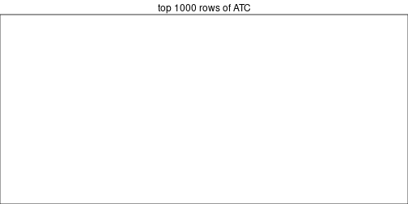

```
#> Error in h(simpleError(msg, call)) : 
#>   error in evaluating the argument 'object' in selecting a method for function 'draw': no applicable method for 'height' applied to an object of class "list"
```

Top rows on each node:


```r
top_rows_overlap(res_rh, method = "upset")
```


### UMAP plot

UMAP plot which shows how samples are separated.


<script>
$( function() {
	$( '#tabs-dimension-reduction-by-depth' ).tabs();
} );
</script>
<div id='tabs-dimension-reduction-by-depth'>
<ul>
<li><a href='#tab-dimension-reduction-by-depth-1'>n_signatures ≥ 1141</a></li>
<li><a href='#tab-dimension-reduction-by-depth-2'>n_signatures ≥ 1212</a></li>
<li><a href='#tab-dimension-reduction-by-depth-3'>n_signatures ≥ 1801</a></li>
<li><a href='#tab-dimension-reduction-by-depth-4'>n_signatures ≥ 2274</a></li>
<li><a href='#tab-dimension-reduction-by-depth-5'>n_signatures ≥ 2544</a></li>
<li><a href='#tab-dimension-reduction-by-depth-6'>n_signatures ≥ 2840</a></li>
<li><a href='#tab-dimension-reduction-by-depth-7'>n_signatures ≥ 3199</a></li>
<li><a href='#tab-dimension-reduction-by-depth-8'>n_signatures ≥ 3659</a></li>
<li><a href='#tab-dimension-reduction-by-depth-9'>n_signatures ≥ 4193</a></li>
<li><a href='#tab-dimension-reduction-by-depth-10'>n_signatures ≥ 4789</a></li>
<li><a href='#tab-dimension-reduction-by-depth-11'>n_signatures ≥ 5590</a></li>
<li><a href='#tab-dimension-reduction-by-depth-12'>n_signatures ≥ 6551</a></li>
<li><a href='#tab-dimension-reduction-by-depth-13'>n_signatures ≥ 8085</a></li>
<li><a href='#tab-dimension-reduction-by-depth-14'>n_signatures ≥ 9931</a></li>
<li><a href='#tab-dimension-reduction-by-depth-15'>n_signatures ≥ 26826</a></li>
<li><a href='#tab-dimension-reduction-by-depth-16'>n_signatures ≥ 36795</a></li>
<li><a href='#tab-dimension-reduction-by-depth-17'>n_signatures ≥ 40190</a></li>
</ul>
<div id='tab-dimension-reduction-by-depth-1'>
<pre><code class="r">par(mfrow = c(1, 2))
dimension_reduction(res_rh, merge_node = merge_node_param(min_n_signatures = 1141),
    method = &quot;UMAP&quot;, top_value_method = &quot;SD&quot;, top_n = 40000, scale_rows = FALSE)
dimension_reduction(res_rh, merge_node = merge_node_param(min_n_signatures = 1141),
    method = &quot;UMAP&quot;, top_value_method = &quot;ATC&quot;, top_n = 40000, scale_rows = TRUE)
</code></pre>

<p></p>

</div>
<div id='tab-dimension-reduction-by-depth-2'>
<pre><code class="r">par(mfrow = c(1, 2))
dimension_reduction(res_rh, merge_node = merge_node_param(min_n_signatures = 1212),
    method = &quot;UMAP&quot;, top_value_method = &quot;SD&quot;, top_n = 40000, scale_rows = FALSE)
dimension_reduction(res_rh, merge_node = merge_node_param(min_n_signatures = 1212),
    method = &quot;UMAP&quot;, top_value_method = &quot;ATC&quot;, top_n = 40000, scale_rows = TRUE)
</code></pre>

<p></p>

</div>
<div id='tab-dimension-reduction-by-depth-3'>
<pre><code class="r">par(mfrow = c(1, 2))
dimension_reduction(res_rh, merge_node = merge_node_param(min_n_signatures = 1801),
    method = &quot;UMAP&quot;, top_value_method = &quot;SD&quot;, top_n = 40000, scale_rows = FALSE)
dimension_reduction(res_rh, merge_node = merge_node_param(min_n_signatures = 1801),
    method = &quot;UMAP&quot;, top_value_method = &quot;ATC&quot;, top_n = 40000, scale_rows = TRUE)
</code></pre>

<p></p>

</div>
<div id='tab-dimension-reduction-by-depth-4'>
<pre><code class="r">par(mfrow = c(1, 2))
dimension_reduction(res_rh, merge_node = merge_node_param(min_n_signatures = 2274),
    method = &quot;UMAP&quot;, top_value_method = &quot;SD&quot;, top_n = 40000, scale_rows = FALSE)
dimension_reduction(res_rh, merge_node = merge_node_param(min_n_signatures = 2274),
    method = &quot;UMAP&quot;, top_value_method = &quot;ATC&quot;, top_n = 40000, scale_rows = TRUE)
</code></pre>

<p></p>

</div>
<div id='tab-dimension-reduction-by-depth-5'>
<pre><code class="r">par(mfrow = c(1, 2))
dimension_reduction(res_rh, merge_node = merge_node_param(min_n_signatures = 2544),
    method = &quot;UMAP&quot;, top_value_method = &quot;SD&quot;, top_n = 40000, scale_rows = FALSE)
dimension_reduction(res_rh, merge_node = merge_node_param(min_n_signatures = 2544),
    method = &quot;UMAP&quot;, top_value_method = &quot;ATC&quot;, top_n = 40000, scale_rows = TRUE)
</code></pre>

<p></p>

</div>
<div id='tab-dimension-reduction-by-depth-6'>
<pre><code class="r">par(mfrow = c(1, 2))
dimension_reduction(res_rh, merge_node = merge_node_param(min_n_signatures = 2840),
    method = &quot;UMAP&quot;, top_value_method = &quot;SD&quot;, top_n = 40000, scale_rows = FALSE)
dimension_reduction(res_rh, merge_node = merge_node_param(min_n_signatures = 2840),
    method = &quot;UMAP&quot;, top_value_method = &quot;ATC&quot;, top_n = 40000, scale_rows = TRUE)
</code></pre>

<p></p>

</div>
<div id='tab-dimension-reduction-by-depth-7'>
<pre><code class="r">par(mfrow = c(1, 2))
dimension_reduction(res_rh, merge_node = merge_node_param(min_n_signatures = 3199),
    method = &quot;UMAP&quot;, top_value_method = &quot;SD&quot;, top_n = 40000, scale_rows = FALSE)
dimension_reduction(res_rh, merge_node = merge_node_param(min_n_signatures = 3199),
    method = &quot;UMAP&quot;, top_value_method = &quot;ATC&quot;, top_n = 40000, scale_rows = TRUE)
</code></pre>

<p></p>

</div>
<div id='tab-dimension-reduction-by-depth-8'>
<pre><code class="r">par(mfrow = c(1, 2))
dimension_reduction(res_rh, merge_node = merge_node_param(min_n_signatures = 3659),
    method = &quot;UMAP&quot;, top_value_method = &quot;SD&quot;, top_n = 40000, scale_rows = FALSE)
dimension_reduction(res_rh, merge_node = merge_node_param(min_n_signatures = 3659),
    method = &quot;UMAP&quot;, top_value_method = &quot;ATC&quot;, top_n = 40000, scale_rows = TRUE)
</code></pre>

<p></p>

</div>
<div id='tab-dimension-reduction-by-depth-9'>
<pre><code class="r">par(mfrow = c(1, 2))
dimension_reduction(res_rh, merge_node = merge_node_param(min_n_signatures = 4193),
    method = &quot;UMAP&quot;, top_value_method = &quot;SD&quot;, top_n = 40000, scale_rows = FALSE)
dimension_reduction(res_rh, merge_node = merge_node_param(min_n_signatures = 4193),
    method = &quot;UMAP&quot;, top_value_method = &quot;ATC&quot;, top_n = 40000, scale_rows = TRUE)
</code></pre>

<p></p>

</div>
<div id='tab-dimension-reduction-by-depth-10'>
<pre><code class="r">par(mfrow = c(1, 2))
dimension_reduction(res_rh, merge_node = merge_node_param(min_n_signatures = 4789),
    method = &quot;UMAP&quot;, top_value_method = &quot;SD&quot;, top_n = 40000, scale_rows = FALSE)
dimension_reduction(res_rh, merge_node = merge_node_param(min_n_signatures = 4789),
    method = &quot;UMAP&quot;, top_value_method = &quot;ATC&quot;, top_n = 40000, scale_rows = TRUE)
</code></pre>

<p></p>

</div>
<div id='tab-dimension-reduction-by-depth-11'>
<pre><code class="r">par(mfrow = c(1, 2))
dimension_reduction(res_rh, merge_node = merge_node_param(min_n_signatures = 5590),
    method = &quot;UMAP&quot;, top_value_method = &quot;SD&quot;, top_n = 40000, scale_rows = FALSE)
dimension_reduction(res_rh, merge_node = merge_node_param(min_n_signatures = 5590),
    method = &quot;UMAP&quot;, top_value_method = &quot;ATC&quot;, top_n = 40000, scale_rows = TRUE)
</code></pre>

<p></p>

</div>
<div id='tab-dimension-reduction-by-depth-12'>
<pre><code class="r">par(mfrow = c(1, 2))
dimension_reduction(res_rh, merge_node = merge_node_param(min_n_signatures = 6551),
    method = &quot;UMAP&quot;, top_value_method = &quot;SD&quot;, top_n = 40000, scale_rows = FALSE)
dimension_reduction(res_rh, merge_node = merge_node_param(min_n_signatures = 6551),
    method = &quot;UMAP&quot;, top_value_method = &quot;ATC&quot;, top_n = 40000, scale_rows = TRUE)
</code></pre>

<p></p>

</div>
<div id='tab-dimension-reduction-by-depth-13'>
<pre><code class="r">par(mfrow = c(1, 2))
dimension_reduction(res_rh, merge_node = merge_node_param(min_n_signatures = 8085),
    method = &quot;UMAP&quot;, top_value_method = &quot;SD&quot;, top_n = 40000, scale_rows = FALSE)
dimension_reduction(res_rh, merge_node = merge_node_param(min_n_signatures = 8085),
    method = &quot;UMAP&quot;, top_value_method = &quot;ATC&quot;, top_n = 40000, scale_rows = TRUE)
</code></pre>

<p></p>

</div>
<div id='tab-dimension-reduction-by-depth-14'>
<pre><code class="r">par(mfrow = c(1, 2))
dimension_reduction(res_rh, merge_node = merge_node_param(min_n_signatures = 9931),
    method = &quot;UMAP&quot;, top_value_method = &quot;SD&quot;, top_n = 40000, scale_rows = FALSE)
dimension_reduction(res_rh, merge_node = merge_node_param(min_n_signatures = 9931),
    method = &quot;UMAP&quot;, top_value_method = &quot;ATC&quot;, top_n = 40000, scale_rows = TRUE)
</code></pre>

<p></p>

</div>
<div id='tab-dimension-reduction-by-depth-15'>
<pre><code class="r">par(mfrow = c(1, 2))
dimension_reduction(res_rh, merge_node = merge_node_param(min_n_signatures = 26826),
    method = &quot;UMAP&quot;, top_value_method = &quot;SD&quot;, top_n = 40000, scale_rows = FALSE)
dimension_reduction(res_rh, merge_node = merge_node_param(min_n_signatures = 26826),
    method = &quot;UMAP&quot;, top_value_method = &quot;ATC&quot;, top_n = 40000, scale_rows = TRUE)
</code></pre>

<p></p>

</div>
<div id='tab-dimension-reduction-by-depth-16'>
<pre><code class="r">par(mfrow = c(1, 2))
dimension_reduction(res_rh, merge_node = merge_node_param(min_n_signatures = 36795),
    method = &quot;UMAP&quot;, top_value_method = &quot;SD&quot;, top_n = 40000, scale_rows = FALSE)
dimension_reduction(res_rh, merge_node = merge_node_param(min_n_signatures = 36795),
    method = &quot;UMAP&quot;, top_value_method = &quot;ATC&quot;, top_n = 40000, scale_rows = TRUE)
</code></pre>

<p></p>

</div>
<div id='tab-dimension-reduction-by-depth-17'>
<pre><code class="r">par(mfrow = c(1, 2))
dimension_reduction(res_rh, merge_node = merge_node_param(min_n_signatures = 40190),
    method = &quot;UMAP&quot;, top_value_method = &quot;SD&quot;, top_n = 40000, scale_rows = FALSE)
dimension_reduction(res_rh, merge_node = merge_node_param(min_n_signatures = 40190),
    method = &quot;UMAP&quot;, top_value_method = &quot;ATC&quot;, top_n = 40000, scale_rows = TRUE)
</code></pre>

<p></p>

</div>
</div>


### Signature heatmap

Signatures on the heatmap are the union of all signatures found on every node
on the hierarchy. The number of k-means on rows are automatically selected by the function.


<script>
$( function() {
	$( '#tabs-get-signatures-from-hierarchical-partition' ).tabs();
} );
</script>
<div id='tabs-get-signatures-from-hierarchical-partition'>
<ul>
<li><a href='#tab-get-signatures-from-hierarchical-partition-1'>n_signatures ≥ 1141</a></li>
<li><a href='#tab-get-signatures-from-hierarchical-partition-2'>n_signatures ≥ 1212</a></li>
<li><a href='#tab-get-signatures-from-hierarchical-partition-3'>n_signatures ≥ 1801</a></li>
<li><a href='#tab-get-signatures-from-hierarchical-partition-4'>n_signatures ≥ 2274</a></li>
<li><a href='#tab-get-signatures-from-hierarchical-partition-5'>n_signatures ≥ 2544</a></li>
<li><a href='#tab-get-signatures-from-hierarchical-partition-6'>n_signatures ≥ 2840</a></li>
<li><a href='#tab-get-signatures-from-hierarchical-partition-7'>n_signatures ≥ 3199</a></li>
<li><a href='#tab-get-signatures-from-hierarchical-partition-8'>n_signatures ≥ 3659</a></li>
<li><a href='#tab-get-signatures-from-hierarchical-partition-9'>n_signatures ≥ 4193</a></li>
<li><a href='#tab-get-signatures-from-hierarchical-partition-10'>n_signatures ≥ 4789</a></li>
<li><a href='#tab-get-signatures-from-hierarchical-partition-11'>n_signatures ≥ 5590</a></li>
<li><a href='#tab-get-signatures-from-hierarchical-partition-12'>n_signatures ≥ 6551</a></li>
<li><a href='#tab-get-signatures-from-hierarchical-partition-13'>n_signatures ≥ 8085</a></li>
<li><a href='#tab-get-signatures-from-hierarchical-partition-14'>n_signatures ≥ 9931</a></li>
<li><a href='#tab-get-signatures-from-hierarchical-partition-15'>n_signatures ≥ 26826</a></li>
<li><a href='#tab-get-signatures-from-hierarchical-partition-16'>n_signatures ≥ 36795</a></li>
<li><a href='#tab-get-signatures-from-hierarchical-partition-17'>n_signatures ≥ 40190</a></li>
</ul>
<div id='tab-get-signatures-from-hierarchical-partition-1'>
<pre><code class="r">get_signatures(res_rh, merge_node = merge_node_param(min_n_signatures = 1141))
</code></pre>

<p>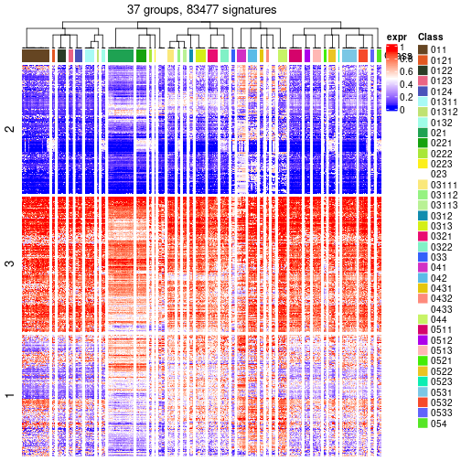</p>

</div>
<div id='tab-get-signatures-from-hierarchical-partition-2'>
<pre><code class="r">get_signatures(res_rh, merge_node = merge_node_param(min_n_signatures = 1212))
</code></pre>

<p>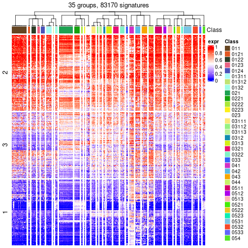</p>

</div>
<div id='tab-get-signatures-from-hierarchical-partition-3'>
<pre><code class="r">get_signatures(res_rh, merge_node = merge_node_param(min_n_signatures = 1801))
</code></pre>

<p></p>

</div>
<div id='tab-get-signatures-from-hierarchical-partition-4'>
<pre><code class="r">get_signatures(res_rh, merge_node = merge_node_param(min_n_signatures = 2274))
</code></pre>

<p></p>

</div>
<div id='tab-get-signatures-from-hierarchical-partition-5'>
<pre><code class="r">get_signatures(res_rh, merge_node = merge_node_param(min_n_signatures = 2544))
</code></pre>

<p></p>

</div>
<div id='tab-get-signatures-from-hierarchical-partition-6'>
<pre><code class="r">get_signatures(res_rh, merge_node = merge_node_param(min_n_signatures = 2840))
</code></pre>

<p></p>

</div>
<div id='tab-get-signatures-from-hierarchical-partition-7'>
<pre><code class="r">get_signatures(res_rh, merge_node = merge_node_param(min_n_signatures = 3199))
</code></pre>

<p></p>

</div>
<div id='tab-get-signatures-from-hierarchical-partition-8'>
<pre><code class="r">get_signatures(res_rh, merge_node = merge_node_param(min_n_signatures = 3659))
</code></pre>

<p></p>

</div>
<div id='tab-get-signatures-from-hierarchical-partition-9'>
<pre><code class="r">get_signatures(res_rh, merge_node = merge_node_param(min_n_signatures = 4193))
</code></pre>

<p></p>

</div>
<div id='tab-get-signatures-from-hierarchical-partition-10'>
<pre><code class="r">get_signatures(res_rh, merge_node = merge_node_param(min_n_signatures = 4789))
</code></pre>

<p></p>

</div>
<div id='tab-get-signatures-from-hierarchical-partition-11'>
<pre><code class="r">get_signatures(res_rh, merge_node = merge_node_param(min_n_signatures = 5590))
</code></pre>

<p></p>

</div>
<div id='tab-get-signatures-from-hierarchical-partition-12'>
<pre><code class="r">get_signatures(res_rh, merge_node = merge_node_param(min_n_signatures = 6551))
</code></pre>

<p></p>

</div>
<div id='tab-get-signatures-from-hierarchical-partition-13'>
<pre><code class="r">get_signatures(res_rh, merge_node = merge_node_param(min_n_signatures = 8085))
</code></pre>

<p></p>

</div>
<div id='tab-get-signatures-from-hierarchical-partition-14'>
<pre><code class="r">get_signatures(res_rh, merge_node = merge_node_param(min_n_signatures = 9931))
</code></pre>

<p></p>

</div>
<div id='tab-get-signatures-from-hierarchical-partition-15'>
<pre><code class="r">get_signatures(res_rh, merge_node = merge_node_param(min_n_signatures = 26826))
</code></pre>

<p></p>

</div>
<div id='tab-get-signatures-from-hierarchical-partition-16'>
<pre><code class="r">get_signatures(res_rh, merge_node = merge_node_param(min_n_signatures = 36795))
</code></pre>

<p></p>

</div>
<div id='tab-get-signatures-from-hierarchical-partition-17'>
<pre><code class="r">get_signatures(res_rh, merge_node = merge_node_param(min_n_signatures = 40190))
</code></pre>

<p></p>

</div>
</div>


Compare signatures from different nodes:


```r
compare_signatures(res_rh, verbose = FALSE)
```


If there are too many signatures, `top_signatures = ...` can be set to only show the 
signatures with the highest FDRs. Note it only works on every node and the final signatures
are the union of all signatures of all nodes.


```r
# code only for demonstration
# e.g. to show the top 500 most significant rows on each node.
tb = get_signature(res_rh, top_signatures = 500)
```


## Results for each node


---------------------------------------------------


### Node0


Child nodes: 
                [Node01](#Node01)
        ,
                [Node02](#Node02)
        ,
                [Node03](#Node03)
        ,
                [Node04](#Node04)
        ,
                [Node05](#Node05)
        .


The object with results only for a single top-value method and a single partitioning method 
can be extracted as:

```r
res = res_rh["0"]
```

A summary of `res` and all the functions that can be applied to it:

```r
res
```

```
#> A 'ConsensusPartition' object with k = 2, 3, 4, 5, 6, 7, 8.
#>   On a matrix with 30000 rows and 321 columns.
#>   Top rows (1000) are extracted by 'ATC' method.
#>   Subgroups are detected by 'skmeans' method.
#>   Performed in total 350 partitions by row resampling.
#>   Best k for subgroups seems to be 7.
#> 
#> Following methods can be applied to this 'ConsensusPartition' object:
#>  [1] "cola_report"             "collect_classes"         "collect_plots"          
#>  [4] "collect_stats"           "colnames"                "compare_partitions"     
#>  [7] "compare_signatures"      "consensus_heatmap"       "dimension_reduction"    
#> [10] "functional_enrichment"   "get_anno_col"            "get_anno"               
#> [13] "get_classes"             "get_consensus"           "get_matrix"             
#> [16] "get_membership"          "get_param"               "get_signatures"         
#> [19] "get_stats"               "is_best_k"               "is_stable_k"            
#> [22] "membership_heatmap"      "ncol"                    "nrow"                   
#> [25] "plot_ecdf"               "predict_classes"         "rownames"               
#> [28] "select_partition_number" "show"                    "suggest_best_k"         
#> [31] "test_to_known_factors"   "top_rows_heatmap"
```

`collect_plots()` function collects all the plots made from `res` for all `k` (number of subgroups)
into one single page to provide an easy and fast comparison between different `k`.

```r
collect_plots(res)
```


The plots are:

- The first row: a plot of the eCDF (empirical cumulative distribution
  function) curves of the consensus matrix for each `k` and the heatmap of
  predicted classes for each `k`.
- The second row: heatmaps of the consensus matrix for each `k`.
- The third row: heatmaps of the membership matrix for each `k`.
- The fouth row: heatmaps of the signatures for each `k`.

All the plots in panels can be made by individual functions and they are
plotted later in this section.

`select_partition_number()` produces several plots showing different
statistics for choosing "optimized" `k`. There are following statistics:

- eCDF curves of the consensus matrix for each `k`;
- 1-PAC. [The PAC score](https://en.wikipedia.org/wiki/Consensus_clustering#Over-interpretation_potential_of_consensus_clustering)
  measures the proportion of the ambiguous subgrouping.
- Mean silhouette score.
- Concordance. The mean probability of fiting the consensus subgroup labels in all
  partitions.
- Area increased. Denote $A_k$ as the area under the eCDF curve for current
  `k`, the area increased is defined as $A_k - A_{k-1}$.
- Rand index. The percent of pairs of samples that are both in a same cluster
  or both are not in a same cluster in the partition of k and k-1.
- Jaccard index. The ratio of pairs of samples are both in a same cluster in
  the partition of k and k-1 and the pairs of samples are both in a same
  cluster in the partition k or k-1.

The detailed explanations of these statistics can be found in [the _cola_
vignette](https://jokergoo.github.io/cola_vignettes/cola.html#toc_13).

Generally speaking, higher 1-PAC score, higher mean silhouette score or higher
concordance corresponds to better partition. Rand index and Jaccard index
measure how similar the current partition is compared to partition with `k-1`.
If they are too similar, we won't accept `k` is better than `k-1`.

```r
select_partition_number(res)
```


The numeric values for all these statistics can be obtained by `get_stats()`.

```r
get_stats(res)
```

```
#>   k 1-PAC mean_silhouette concordance area_increased  Rand Jaccard
#> 2 2 1.000           0.993       0.997         0.5020 0.498   0.498
#> 3 3 1.000           0.993       0.997         0.3154 0.740   0.526
#> 4 4 1.000           0.971       0.987         0.1092 0.838   0.579
#> 5 5 1.000           0.988       0.995         0.0820 0.842   0.502
#> 6 6 0.913           0.836       0.925         0.0454 0.946   0.751
#> 7 7 0.948           0.887       0.946         0.0314 0.943   0.695
#> 8 8 0.895           0.785       0.895         0.0144 0.971   0.811
```

`suggest_best_k()` suggests the best $k$ based on these statistics. The rules are as follows:

- All $k$ with Jaccard index larger than 0.95 are removed because increasing
  $k$ does not provide enough extra information. If all $k$ are removed, it is
  marked as no subgroup is detected.
- For all $k$ with 1-PAC score larger than 0.9, the maximal $k$ is taken as
  the best $k$, and other $k$ are marked as optional $k$.
- If it does not fit the second rule. The $k$ with the maximal vote of the
  highest 1-PAC score, highest mean silhouette, and highest concordance is
  taken as the best $k$.

```r
suggest_best_k(res)
```

```
#> [1] 7
#> attr(,"optional")
#> [1] 2 3 4 5 6
```

There is also optional best $k$ = 2 3 4 5 6 that is worth to check.

Following is the table of the partitions (You need to click the **show/hide
code output** link to see it). The membership matrix (columns with name `p*`)
is inferred by
[`clue::cl_consensus()`](https://www.rdocumentation.org/link/cl_consensus?package=clue)
function with the `SE` method. Basically the value in the membership matrix
represents the probability to belong to a certain group. The finall subgroup
label for an item is determined with the group with highest probability it
belongs to.

In `get_classes()` function, the entropy is calculated from the membership
matrix and the silhouette score is calculated from the consensus matrix.


<script>
$( function() {
	$( '#tabs-node-0-get-classes' ).tabs();
} );
</script>
<div id='tabs-node-0-get-classes'>
<ul>
<li><a href='#tab-node-0-get-classes-1'>k = 2</a></li>
<li><a href='#tab-node-0-get-classes-2'>k = 3</a></li>
<li><a href='#tab-node-0-get-classes-3'>k = 4</a></li>
<li><a href='#tab-node-0-get-classes-4'>k = 5</a></li>
<li><a href='#tab-node-0-get-classes-5'>k = 6</a></li>
<li><a href='#tab-node-0-get-classes-6'>k = 7</a></li>
<li><a href='#tab-node-0-get-classes-7'>k = 8</a></li>
</ul>

<div id='tab-node-0-get-classes-1'>
<p><a id='tab-node-0-get-classes-1-a' style='color:#0366d6' href='#'>show/hide code output</a></p>
<pre><code class="r">cbind(get_classes(res, k = 2), get_membership(res, k = 2))
</code></pre>

<pre><code>#&gt;                 class entropy silhouette   p1   p2
#&gt; TCGA.SX.A7SM.01     2   0.000      0.998 0.00 1.00
#&gt; TCGA.IA.A83W.01     1   0.000      0.996 1.00 0.00
#&gt; TCGA.B1.A656.01     2   0.000      0.998 0.00 1.00
#&gt; TCGA.4A.A93X.01     2   0.000      0.998 0.00 1.00
#&gt; TCGA.G7.A8LC.01     1   0.722      0.752 0.80 0.20
#&gt; TCGA.SX.A7SS.01     1   0.000      0.996 1.00 0.00
#&gt; TCGA.B9.A69E.01     2   0.000      0.998 0.00 1.00
#&gt; TCGA.BQ.5878.01     1   0.000      0.996 1.00 0.00
#&gt; TCGA.DW.5561.01     1   0.000      0.996 1.00 0.00
#&gt; TCGA.PJ.A8JU.01     2   0.000      0.998 0.00 1.00
#&gt; TCGA.EV.5901.01     1   0.000      0.996 1.00 0.00
#&gt; TCGA.SX.A7SR.01     1   0.000      0.996 1.00 0.00
#&gt; TCGA.BQ.5894.01     2   0.000      0.998 0.00 1.00
#&gt; TCGA.KV.A6GE.01     1   0.000      0.996 1.00 0.00
#&gt; TCGA.BQ.5882.01     2   0.000      0.998 0.00 1.00
#&gt; TCGA.SX.A7SQ.01     1   0.000      0.996 1.00 0.00
#&gt; TCGA.F9.A7Q0.01     2   0.000      0.998 0.00 1.00
#&gt; TCGA.IZ.A6M8.01     1   0.855      0.615 0.72 0.28
#&gt; TCGA.B1.A654.01     1   0.000      0.996 1.00 0.00
#&gt; TCGA.B3.8121.01     2   0.000      0.998 0.00 1.00
#&gt; TCGA.MH.A856.01     1   0.000      0.996 1.00 0.00
#&gt; TCGA.G7.A4TM.01     1   0.000      0.996 1.00 0.00
#&gt; TCGA.IZ.8196.01     1   0.000      0.996 1.00 0.00
#&gt; TCGA.B9.A5W7.01     1   0.000      0.996 1.00 0.00
#&gt; TCGA.B9.5156.01     1   0.000      0.996 1.00 0.00
#&gt; TCGA.A4.A7UZ.01     2   0.000      0.998 0.00 1.00
#&gt; TCGA.Y8.A897.01     1   0.000      0.996 1.00 0.00
#&gt; TCGA.SX.A7SP.01     1   0.000      0.996 1.00 0.00
#&gt; TCGA.Y8.A8RZ.01     1   0.000      0.996 1.00 0.00
#&gt; TCGA.A4.A5XZ.01     1   0.000      0.996 1.00 0.00
#&gt; TCGA.Y8.A898.01     1   0.402      0.913 0.92 0.08
#&gt; TCGA.BQ.5893.01     2   0.000      0.998 0.00 1.00
#&gt; TCGA.SX.A7SU.01     1   0.000      0.996 1.00 0.00
#&gt; TCGA.IZ.8195.01     1   0.000      0.996 1.00 0.00
#&gt; TCGA.GL.8500.01     1   0.000      0.996 1.00 0.00
#&gt; TCGA.EV.5902.01     1   0.000      0.996 1.00 0.00
#&gt; TCGA.J7.A8I2.01     2   0.000      0.998 0.00 1.00
#&gt; TCGA.A4.8516.01     1   0.000      0.996 1.00 0.00
#&gt; TCGA.A4.8312.01     2   0.000      0.998 0.00 1.00
#&gt; TCGA.BQ.5880.01     2   0.000      0.998 0.00 1.00
#&gt; TCGA.Y8.A8RY.01     1   0.000      0.996 1.00 0.00
#&gt; TCGA.SX.A7SN.01     1   0.000      0.996 1.00 0.00
#&gt; TCGA.MH.A854.01     1   0.000      0.996 1.00 0.00
#&gt; TCGA.A4.8517.01     1   0.000      0.996 1.00 0.00
#&gt; TCGA.GL.A9DD.01     2   0.000      0.998 0.00 1.00
#&gt; TCGA.A4.8630.01     1   0.000      0.996 1.00 0.00
#&gt; TCGA.4A.A93W.01     1   0.000      0.996 1.00 0.00
#&gt; TCGA.SX.A7SO.01     1   0.000      0.996 1.00 0.00
#&gt; TCGA.GL.A9DC.01     1   0.000      0.996 1.00 0.00
#&gt; TCGA.A4.8515.01     1   0.000      0.996 1.00 0.00
#&gt; TCGA.IZ.A6M9.01     1   0.000      0.996 1.00 0.00
#&gt; TCGA.BQ.5880.11     2   0.000      0.998 0.00 1.00
#&gt; TCGA.B1.A657.01     1   0.000      0.996 1.00 0.00
#&gt; TCGA.G7.A8LD.01     2   0.881      0.568 0.30 0.70
#&gt; TCGA.Y8.A8S1.01     2   0.000      0.998 0.00 1.00
#&gt; TCGA.IA.A83S.01     2   0.000      0.998 0.00 1.00
#&gt; TCGA.Y8.A8S0.01     1   0.000      0.996 1.00 0.00
#&gt; TCGA.BQ.5884.11     2   0.000      0.998 0.00 1.00
#&gt; TCGA.B1.A655.01     2   0.000      0.998 0.00 1.00
#&gt; TCGA.BQ.5877.11     2   0.000      0.998 0.00 1.00
#&gt; TCGA.EV.5903.01     2   0.000      0.998 0.00 1.00
#&gt; TCGA.J7.8537.01     2   0.000      0.998 0.00 1.00
#&gt; TCGA.A4.A6HP.01     1   0.000      0.996 1.00 0.00
#&gt; TCGA.BQ.5890.01     2   0.000      0.998 0.00 1.00
#&gt; TCGA.Y8.A896.01     2   0.000      0.998 0.00 1.00
#&gt; TCGA.BQ.5888.01     2   0.000      0.998 0.00 1.00
#&gt; TCGA.BQ.5879.01     2   0.000      0.998 0.00 1.00
#&gt; TCGA.GL.A9DE.01     2   0.000      0.998 0.00 1.00
#&gt; TCGA.G7.A8LB.01     1   0.000      0.996 1.00 0.00
#&gt; TCGA.IA.A83T.01     2   0.000      0.998 0.00 1.00
#&gt; TCGA.IA.A83V.01     2   0.000      0.998 0.00 1.00
#&gt; TCGA.BQ.5876.11     2   0.000      0.998 0.00 1.00
#&gt; TCGA.BQ.5885.11     2   0.000      0.998 0.00 1.00
#&gt; TCGA.KV.A6GD.01     2   0.000      0.998 0.00 1.00
#&gt; TCGA.SX.A7SL.01     1   0.000      0.996 1.00 0.00
#&gt; TCGA.B9.A8YI.01     2   0.000      0.998 0.00 1.00
#&gt; TCGA.B9.A8YH.01     1   0.000      0.996 1.00 0.00
#&gt; TCGA.4A.A93Y.01     2   0.000      0.998 0.00 1.00
#&gt; TCGA.BQ.5886.01     1   0.327      0.935 0.94 0.06
#&gt; TCGA.A4.A5Y0.01     1   0.000      0.996 1.00 0.00
#&gt; TCGA.A4.8098.01     1   0.000      0.996 1.00 0.00
#&gt; TCGA.MH.A857.01     2   0.000      0.998 0.00 1.00
#&gt; TCGA.BQ.5889.11     2   0.000      0.998 0.00 1.00
#&gt; TCGA.DW.5560.01     1   0.000      0.996 1.00 0.00
#&gt; TCGA.F9.A8NY.01     2   0.000      0.998 0.00 1.00
#&gt; TCGA.BQ.5894.11     2   0.000      0.998 0.00 1.00
#&gt; TCGA.BQ.5891.11     2   0.000      0.998 0.00 1.00
#&gt; TCGA.G7.A8LE.01     1   0.000      0.996 1.00 0.00
#&gt; TCGA.SX.A71W.01     1   0.000      0.996 1.00 0.00
#&gt; TCGA.Y8.A894.01     1   0.000      0.996 1.00 0.00
#&gt; TCGA.WN.A9G9.01     2   0.000      0.998 0.00 1.00
#&gt; TCGA.A4.8310.01     1   0.000      0.996 1.00 0.00
#&gt; TCGA.A4.8518.01     2   0.000      0.998 0.00 1.00
#&gt; TCGA.BQ.5881.11     2   0.000      0.998 0.00 1.00
#&gt; TCGA.BQ.5893.11     2   0.000      0.998 0.00 1.00
#&gt; TCGA.A4.8311.01     1   0.000      0.996 1.00 0.00
#&gt; TCGA.BQ.5891.01     2   0.000      0.998 0.00 1.00
#&gt; TCGA.Y8.A895.01     1   0.000      0.996 1.00 0.00
#&gt; TCGA.BQ.5876.01     2   0.000      0.998 0.00 1.00
#&gt; TCGA.MH.A855.01     2   0.000      0.998 0.00 1.00
#&gt; TCGA.P4.AAVO.01     2   0.000      0.998 0.00 1.00
#&gt; TCGA.BQ.5886.11     2   0.000      0.998 0.00 1.00
#&gt; TCGA.2Z.A9JS.01     1   0.000      0.996 1.00 0.00
#&gt; TCGA.BQ.5888.11     2   0.000      0.998 0.00 1.00
#&gt; TCGA.2Z.A9J8.01     1   0.000      0.996 1.00 0.00
#&gt; TCGA.KV.A74V.01     1   0.000      0.996 1.00 0.00
#&gt; TCGA.A4.A5Y1.01     1   0.000      0.996 1.00 0.00
#&gt; TCGA.BQ.5875.01     2   0.000      0.998 0.00 1.00
#&gt; TCGA.UZ.A9PZ.01     1   0.000      0.996 1.00 0.00
#&gt; TCGA.Q2.A5QZ.01     2   0.000      0.998 0.00 1.00
#&gt; TCGA.P4.A5E8.01     2   0.000      0.998 0.00 1.00
#&gt; TCGA.B9.5155.01     1   0.000      0.996 1.00 0.00
#&gt; TCGA.B9.A5W9.01     1   0.000      0.996 1.00 0.00
#&gt; TCGA.5P.A9K4.01     1   0.000      0.996 1.00 0.00
#&gt; TCGA.P4.A5E7.01     1   0.000      0.996 1.00 0.00
#&gt; TCGA.PJ.A5Z9.01     1   0.000      0.996 1.00 0.00
#&gt; TCGA.5P.A9K8.01     2   0.000      0.998 0.00 1.00
#&gt; TCGA.5P.A9KF.01     1   0.000      0.996 1.00 0.00
#&gt; TCGA.P4.AAVK.01     2   0.000      0.998 0.00 1.00
#&gt; TCGA.2Z.A9JM.01     1   0.000      0.996 1.00 0.00
#&gt; TCGA.A4.A48D.01     2   0.000      0.998 0.00 1.00
#&gt; TCGA.BQ.5889.01     2   0.000      0.998 0.00 1.00
#&gt; TCGA.2Z.A9JD.01     1   0.000      0.996 1.00 0.00
#&gt; TCGA.5P.A9K2.01     1   0.000      0.996 1.00 0.00
#&gt; TCGA.2Z.A9JO.01     2   0.000      0.998 0.00 1.00
#&gt; TCGA.5P.A9K9.01     2   0.000      0.998 0.00 1.00
#&gt; TCGA.UZ.A9PV.01     1   0.000      0.996 1.00 0.00
#&gt; TCGA.SX.A71V.01     1   0.000      0.996 1.00 0.00
#&gt; TCGA.BQ.5892.11     2   0.000      0.998 0.00 1.00
#&gt; TCGA.UZ.A9Q0.01     1   0.000      0.996 1.00 0.00
#&gt; TCGA.UZ.A9PX.01     1   0.000      0.996 1.00 0.00
#&gt; TCGA.UZ.A9PR.01     1   0.000      0.996 1.00 0.00
#&gt; TCGA.IA.A40X.01     1   0.000      0.996 1.00 0.00
#&gt; TCGA.5P.A9JW.01     2   0.000      0.998 0.00 1.00
#&gt; TCGA.IA.A40Y.01     2   0.000      0.998 0.00 1.00
#&gt; TCGA.BQ.5883.11     2   0.000      0.998 0.00 1.00
#&gt; TCGA.BQ.5878.11     2   0.000      0.998 0.00 1.00
#&gt; TCGA.P4.A5EA.01     2   0.000      0.998 0.00 1.00
#&gt; TCGA.5P.A9KE.01     2   0.000      0.998 0.00 1.00
#&gt; TCGA.5P.A9K3.01     2   0.000      0.998 0.00 1.00
#&gt; TCGA.B1.A47N.01     1   0.000      0.996 1.00 0.00
#&gt; TCGA.5P.A9KA.01     1   0.000      0.996 1.00 0.00
#&gt; TCGA.BQ.5879.11     2   0.000      0.998 0.00 1.00
#&gt; TCGA.P4.A5ED.01     2   0.000      0.998 0.00 1.00
#&gt; TCGA.A4.A772.01     1   0.000      0.996 1.00 0.00
#&gt; TCGA.B1.A47O.01     2   0.000      0.998 0.00 1.00
#&gt; TCGA.IA.A40U.01     1   0.000      0.996 1.00 0.00
#&gt; TCGA.2Z.A9JE.01     1   0.000      0.996 1.00 0.00
#&gt; TCGA.B9.A44B.01     2   0.000      0.998 0.00 1.00
#&gt; TCGA.AT.A5NU.01     1   0.000      0.996 1.00 0.00
#&gt; TCGA.BQ.5882.11     2   0.000      0.998 0.00 1.00
#&gt; TCGA.BQ.5877.01     2   0.000      0.998 0.00 1.00
#&gt; TCGA.DW.7963.01     2   0.000      0.998 0.00 1.00
#&gt; TCGA.2Z.A9JL.01     1   0.000      0.996 1.00 0.00
#&gt; TCGA.2Z.A9JQ.01     1   0.000      0.996 1.00 0.00
#&gt; TCGA.2Z.A9JK.01     2   0.000      0.998 0.00 1.00
#&gt; TCGA.UZ.A9PU.01     1   0.000      0.996 1.00 0.00
#&gt; TCGA.P4.A5EB.01     1   0.000      0.996 1.00 0.00
#&gt; TCGA.BQ.5892.01     2   0.000      0.998 0.00 1.00
#&gt; TCGA.B1.A47M.11     2   0.000      0.998 0.00 1.00
#&gt; TCGA.2Z.A9J9.01     2   0.000      0.998 0.00 1.00
#&gt; TCGA.UZ.A9PS.05     2   0.000      0.998 0.00 1.00
#&gt; TCGA.P4.AAVM.01     1   0.000      0.996 1.00 0.00
#&gt; TCGA.PJ.A5Z8.01     2   0.000      0.998 0.00 1.00
#&gt; TCGA.5P.A9JZ.01     1   0.000      0.996 1.00 0.00
#&gt; TCGA.2Z.A9JG.01     1   0.000      0.996 1.00 0.00
#&gt; TCGA.BQ.5884.01     2   0.000      0.998 0.00 1.00
#&gt; TCGA.2Z.A9JI.01     2   0.000      0.998 0.00 1.00
#&gt; TCGA.BQ.5890.11     2   0.000      0.998 0.00 1.00
#&gt; TCGA.BQ.5881.01     2   0.000      0.998 0.00 1.00
#&gt; TCGA.UZ.A9PP.01     1   0.000      0.996 1.00 0.00
#&gt; TCGA.5P.A9JU.01     2   0.000      0.998 0.00 1.00
#&gt; TCGA.2Z.A9JN.01     2   0.000      0.998 0.00 1.00
#&gt; TCGA.UZ.A9PS.01     1   0.000      0.996 1.00 0.00
#&gt; TCGA.BQ.5875.11     2   0.000      0.998 0.00 1.00
#&gt; TCGA.5P.A9JY.01     1   0.000      0.996 1.00 0.00
#&gt; TCGA.B9.A5W8.01     2   0.000      0.998 0.00 1.00
#&gt; TCGA.F9.A4JJ.01     2   0.000      0.998 0.00 1.00
#&gt; TCGA.BQ.5883.01     2   0.000      0.998 0.00 1.00
#&gt; TCGA.5P.A9K0.01     1   0.000      0.996 1.00 0.00
#&gt; TCGA.P4.AAVL.01     1   0.000      0.996 1.00 0.00
#&gt; TCGA.B1.5398.01     2   0.000      0.998 0.00 1.00
#&gt; TCGA.5P.A9K6.01     1   0.000      0.996 1.00 0.00
#&gt; TCGA.UZ.A9PQ.01     2   0.000      0.998 0.00 1.00
#&gt; TCGA.P4.A5E6.01     1   0.000      0.996 1.00 0.00
#&gt; TCGA.BQ.5885.01     1   0.000      0.996 1.00 0.00
#&gt; TCGA.UZ.A9Q1.01     2   0.000      0.998 0.00 1.00
#&gt; TCGA.2Z.A9JP.01     1   0.000      0.996 1.00 0.00
#&gt; TCGA.5P.A9KC.01     2   0.000      0.998 0.00 1.00
#&gt; TCGA.5P.A9KH.01     2   0.000      0.998 0.00 1.00
#&gt; TCGA.2Z.A9JR.01     1   0.000      0.996 1.00 0.00
#&gt; TCGA.GL.A59T.01     1   0.000      0.996 1.00 0.00
#&gt; TCGA.5P.A9JV.01     2   0.000      0.998 0.00 1.00
#&gt; TCGA.WN.AB4C.01     2   0.000      0.998 0.00 1.00
#&gt; TCGA.SX.A71R.01     1   0.000      0.996 1.00 0.00
#&gt; TCGA.A4.A5DU.01     1   0.000      0.996 1.00 0.00
#&gt; TCGA.B1.A47M.01     1   0.000      0.996 1.00 0.00
#&gt; TCGA.2Z.A9JJ.01     2   0.000      0.998 0.00 1.00
#&gt; TCGA.2Z.A9JT.01     2   0.242      0.957 0.04 0.96
#&gt; TCGA.GL.A4EM.01     2   0.000      0.998 0.00 1.00
#&gt; TCGA.HE.7129.01     1   0.000      0.996 1.00 0.00
#&gt; TCGA.HE.7128.01     2   0.000      0.998 0.00 1.00
#&gt; TCGA.HE.A5NL.01     1   0.000      0.996 1.00 0.00
#&gt; TCGA.G7.7502.01     1   0.000      0.996 1.00 0.00
#&gt; TCGA.BQ.7059.01     2   0.000      0.998 0.00 1.00
#&gt; TCGA.DZ.6134.11     2   0.000      0.998 0.00 1.00
#&gt; TCGA.HE.A5NJ.01     1   0.000      0.996 1.00 0.00
#&gt; TCGA.BQ.7053.11     2   0.000      0.998 0.00 1.00
#&gt; TCGA.GL.6846.11     2   0.000      0.998 0.00 1.00
#&gt; TCGA.GL.6846.01     1   0.141      0.976 0.98 0.02
#&gt; TCGA.DW.7839.01     1   0.000      0.996 1.00 0.00
#&gt; TCGA.DW.7841.01     1   0.000      0.996 1.00 0.00
#&gt; TCGA.BQ.7049.01     2   0.000      0.998 0.00 1.00
#&gt; TCGA.G7.6793.01     2   0.000      0.998 0.00 1.00
#&gt; TCGA.BQ.7051.01     1   0.000      0.996 1.00 0.00
#&gt; TCGA.BQ.7045.01     1   0.000      0.996 1.00 0.00
#&gt; TCGA.HE.A5NF.01     2   0.000      0.998 0.00 1.00
#&gt; TCGA.A4.7996.01     1   0.000      0.996 1.00 0.00
#&gt; TCGA.BQ.7046.01     1   0.000      0.996 1.00 0.00
#&gt; TCGA.DZ.6132.11     2   0.000      0.998 0.00 1.00
#&gt; TCGA.G7.7501.01     1   0.000      0.996 1.00 0.00
#&gt; TCGA.O9.A75Z.01     1   0.000      0.996 1.00 0.00
#&gt; TCGA.DW.7834.01     1   0.000      0.996 1.00 0.00
#&gt; TCGA.DZ.6133.01     1   0.000      0.996 1.00 0.00
#&gt; TCGA.A4.A4ZT.01     1   0.000      0.996 1.00 0.00
#&gt; TCGA.BQ.7060.01     1   0.242      0.956 0.96 0.04
#&gt; TCGA.G7.6792.01     1   0.000      0.996 1.00 0.00
#&gt; TCGA.HE.7130.01     2   0.000      0.998 0.00 1.00
#&gt; TCGA.GL.7773.01     1   0.000      0.996 1.00 0.00
#&gt; TCGA.DZ.6133.11     2   0.000      0.998 0.00 1.00
#&gt; TCGA.B1.7332.01     1   0.000      0.996 1.00 0.00
#&gt; TCGA.BQ.7053.01     2   0.000      0.998 0.00 1.00
#&gt; TCGA.DZ.6131.01     2   0.000      0.998 0.00 1.00
#&gt; TCGA.BQ.7062.01     2   0.000      0.998 0.00 1.00
#&gt; TCGA.BQ.7046.11     2   0.000      0.998 0.00 1.00
#&gt; TCGA.A4.7288.01     1   0.000      0.996 1.00 0.00
#&gt; TCGA.DZ.6131.11     2   0.000      0.998 0.00 1.00
#&gt; TCGA.BQ.7062.11     2   0.000      0.998 0.00 1.00
#&gt; TCGA.BQ.7061.01     2   0.000      0.998 0.00 1.00
#&gt; TCGA.A4.7286.01     1   0.000      0.996 1.00 0.00
#&gt; TCGA.G7.6797.01     1   0.000      0.996 1.00 0.00
#&gt; TCGA.BQ.7058.01     2   0.000      0.998 0.00 1.00
#&gt; TCGA.G7.6795.01     1   0.000      0.996 1.00 0.00
#&gt; TCGA.HE.A5NH.01     1   0.000      0.996 1.00 0.00
#&gt; TCGA.MH.A55W.01     1   0.000      0.996 1.00 0.00
#&gt; TCGA.G7.6790.01     1   0.000      0.996 1.00 0.00
#&gt; TCGA.MH.A560.01     2   0.000      0.998 0.00 1.00
#&gt; TCGA.A4.7997.01     1   0.000      0.996 1.00 0.00
#&gt; TCGA.MH.A561.01     1   0.000      0.996 1.00 0.00
#&gt; TCGA.BQ.7056.11     2   0.000      0.998 0.00 1.00
#&gt; TCGA.B9.7268.01     1   0.000      0.996 1.00 0.00
#&gt; TCGA.BQ.7055.11     2   0.000      0.998 0.00 1.00
#&gt; TCGA.HE.A5NI.01     1   0.000      0.996 1.00 0.00
#&gt; TCGA.GL.7966.01     2   0.000      0.998 0.00 1.00
#&gt; TCGA.BQ.7059.11     2   0.000      0.998 0.00 1.00
#&gt; TCGA.A4.A57E.01     1   0.000      0.996 1.00 0.00
#&gt; TCGA.A4.7288.11     2   0.000      0.998 0.00 1.00
#&gt; TCGA.AL.A5DJ.01     2   0.000      0.998 0.00 1.00
#&gt; TCGA.G7.6796.01     2   0.000      0.998 0.00 1.00
#&gt; TCGA.DW.7837.01     1   0.000      0.996 1.00 0.00
#&gt; TCGA.BQ.7051.11     2   0.000      0.998 0.00 1.00
#&gt; TCGA.BQ.7048.01     2   0.000      0.998 0.00 1.00
#&gt; TCGA.F9.A7VF.01     1   0.000      0.996 1.00 0.00
#&gt; TCGA.BQ.7049.11     2   0.000      0.998 0.00 1.00
#&gt; TCGA.DZ.6134.01     2   0.000      0.998 0.00 1.00
#&gt; TCGA.BQ.5887.01     2   0.000      0.998 0.00 1.00
#&gt; TCGA.DZ.6135.01     1   0.000      0.996 1.00 0.00
#&gt; TCGA.MH.A55Z.01     1   0.000      0.996 1.00 0.00
#&gt; TCGA.A4.7915.01     2   0.000      0.998 0.00 1.00
#&gt; TCGA.BQ.7048.11     2   0.000      0.998 0.00 1.00
#&gt; TCGA.HE.A5NK.01     2   0.000      0.998 0.00 1.00
#&gt; TCGA.G7.6789.01     2   0.000      0.998 0.00 1.00
#&gt; TCGA.AL.7173.01     2   0.000      0.998 0.00 1.00
#&gt; TCGA.SX.A71S.01     1   0.000      0.996 1.00 0.00
#&gt; TCGA.BQ.7061.11     2   0.000      0.998 0.00 1.00
#&gt; TCGA.DW.7840.01     1   0.000      0.996 1.00 0.00
#&gt; TCGA.GL.A59R.01     1   0.000      0.996 1.00 0.00
#&gt; TCGA.BQ.7050.11     2   0.000      0.998 0.00 1.00
#&gt; TCGA.BQ.7058.11     2   0.000      0.998 0.00 1.00
#&gt; TCGA.DW.7838.01     2   0.000      0.998 0.00 1.00
#&gt; TCGA.SX.A71U.01     1   0.000      0.996 1.00 0.00
#&gt; TCGA.DZ.6135.11     2   0.000      0.998 0.00 1.00
#&gt; TCGA.BQ.7044.11     2   0.000      0.998 0.00 1.00
#&gt; TCGA.V9.A7HT.01     2   0.000      0.998 0.00 1.00
#&gt; TCGA.DW.7842.01     1   0.000      0.996 1.00 0.00
#&gt; TCGA.BQ.7050.01     1   0.000      0.996 1.00 0.00
#&gt; TCGA.BQ.7055.01     2   0.000      0.998 0.00 1.00
#&gt; TCGA.J7.6720.01     1   0.000      0.996 1.00 0.00
#&gt; TCGA.BQ.7060.11     2   0.000      0.998 0.00 1.00
#&gt; TCGA.BQ.7044.01     1   0.000      0.996 1.00 0.00
#&gt; TCGA.DZ.6132.01     2   0.000      0.998 0.00 1.00
#&gt; TCGA.DW.7836.01     1   0.000      0.996 1.00 0.00
#&gt; TCGA.A4.7828.01     2   0.000      0.998 0.00 1.00
#&gt; TCGA.BQ.5887.11     2   0.000      0.998 0.00 1.00
#&gt; TCGA.B3.A6W5.01     1   0.000      0.996 1.00 0.00
#&gt; TCGA.MH.A562.01     1   0.000      0.996 1.00 0.00
#&gt; TCGA.A4.7734.01     1   0.000      0.996 1.00 0.00
#&gt; TCGA.BQ.7045.11     2   0.000      0.998 0.00 1.00
#&gt; TCGA.A4.7584.01     1   0.000      0.996 1.00 0.00
#&gt; TCGA.BQ.7056.01     1   0.000      0.996 1.00 0.00
#&gt; TCGA.A4.7287.01     2   0.000      0.998 0.00 1.00
#&gt; TCGA.UZ.A9PJ.01     1   0.000      0.996 1.00 0.00
#&gt; TCGA.2Z.A9J1.01     1   0.000      0.996 1.00 0.00
#&gt; TCGA.UN.AAZ9.01     1   0.000      0.996 1.00 0.00
#&gt; TCGA.UZ.A9PO.01     2   0.000      0.998 0.00 1.00
#&gt; TCGA.UZ.A9PL.01     1   0.000      0.996 1.00 0.00
#&gt; TCGA.A4.7732.11     2   0.000      0.998 0.00 1.00
#&gt; TCGA.A4.7732.01     1   0.000      0.996 1.00 0.00
#&gt; TCGA.2Z.A9J2.01     2   0.000      0.998 0.00 1.00
#&gt; TCGA.2Z.A9J3.01     1   0.000      0.996 1.00 0.00
#&gt; TCGA.2Z.A9J6.01     1   0.000      0.996 1.00 0.00
#&gt; TCGA.F9.A97G.01     2   0.000      0.998 0.00 1.00
#&gt; TCGA.UZ.A9PM.01     2   0.000      0.998 0.00 1.00
#&gt; TCGA.A4.7585.11     2   0.000      0.998 0.00 1.00
#&gt; TCGA.2K.A9WE.01     2   0.000      0.998 0.00 1.00
#&gt; TCGA.A4.7583.01     1   0.000      0.996 1.00 0.00
#&gt; TCGA.UZ.A9PK.01     1   0.000      0.996 1.00 0.00
#&gt; TCGA.UZ.A9PN.01     2   0.000      0.998 0.00 1.00
#&gt; TCGA.2Z.A9J7.01     1   0.000      0.996 1.00 0.00
#&gt; TCGA.2Z.A9J5.01     1   0.000      0.996 1.00 0.00
#&gt; TCGA.A4.7585.01     2   0.000      0.998 0.00 1.00
</code></pre>

<script>
$('#tab-node-0-get-classes-1-a').parent().next().next().hide();
$('#tab-node-0-get-classes-1-a').click(function(){
  $('#tab-node-0-get-classes-1-a').parent().next().next().toggle();
  return(false);
});
</script>
</div>

<div id='tab-node-0-get-classes-2'>
<p><a id='tab-node-0-get-classes-2-a' style='color:#0366d6' href='#'>show/hide code output</a></p>
<pre><code class="r">cbind(get_classes(res, k = 3), get_membership(res, k = 3))
</code></pre>

<pre><code>#&gt;                 class entropy silhouette   p1   p2   p3
#&gt; TCGA.SX.A7SM.01     3  0.0000      0.996 0.00 0.00 1.00
#&gt; TCGA.IA.A83W.01     1  0.0000      0.998 1.00 0.00 0.00
#&gt; TCGA.B1.A656.01     3  0.0000      0.996 0.00 0.00 1.00
#&gt; TCGA.4A.A93X.01     3  0.0000      0.996 0.00 0.00 1.00
#&gt; TCGA.G7.A8LC.01     3  0.0000      0.996 0.00 0.00 1.00
#&gt; TCGA.SX.A7SS.01     1  0.0000      0.998 1.00 0.00 0.00
#&gt; TCGA.B9.A69E.01     3  0.0000      0.996 0.00 0.00 1.00
#&gt; TCGA.BQ.5878.01     1  0.0000      0.998 1.00 0.00 0.00
#&gt; TCGA.DW.5561.01     1  0.0000      0.998 1.00 0.00 0.00
#&gt; TCGA.PJ.A8JU.01     3  0.0000      0.996 0.00 0.00 1.00
#&gt; TCGA.EV.5901.01     1  0.0000      0.998 1.00 0.00 0.00
#&gt; TCGA.SX.A7SR.01     1  0.0000      0.998 1.00 0.00 0.00
#&gt; TCGA.BQ.5894.01     3  0.0000      0.996 0.00 0.00 1.00
#&gt; TCGA.KV.A6GE.01     1  0.0000      0.998 1.00 0.00 0.00
#&gt; TCGA.BQ.5882.01     3  0.0000      0.996 0.00 0.00 1.00
#&gt; TCGA.SX.A7SQ.01     1  0.0000      0.998 1.00 0.00 0.00
#&gt; TCGA.F9.A7Q0.01     3  0.4291      0.782 0.00 0.18 0.82
#&gt; TCGA.IZ.A6M8.01     3  0.0000      0.996 0.00 0.00 1.00
#&gt; TCGA.B1.A654.01     1  0.0000      0.998 1.00 0.00 0.00
#&gt; TCGA.B3.8121.01     2  0.0892      0.982 0.00 0.98 0.02
#&gt; TCGA.MH.A856.01     1  0.0000      0.998 1.00 0.00 0.00
#&gt; TCGA.G7.A4TM.01     1  0.0000      0.998 1.00 0.00 0.00
#&gt; TCGA.IZ.8196.01     1  0.0000      0.998 1.00 0.00 0.00
#&gt; TCGA.B9.A5W7.01     1  0.0000      0.998 1.00 0.00 0.00
#&gt; TCGA.B9.5156.01     1  0.0000      0.998 1.00 0.00 0.00
#&gt; TCGA.A4.A7UZ.01     3  0.0000      0.996 0.00 0.00 1.00
#&gt; TCGA.Y8.A897.01     1  0.0000      0.998 1.00 0.00 0.00
#&gt; TCGA.SX.A7SP.01     3  0.0000      0.996 0.00 0.00 1.00
#&gt; TCGA.Y8.A8RZ.01     3  0.0000      0.996 0.00 0.00 1.00
#&gt; TCGA.A4.A5XZ.01     1  0.0000      0.998 1.00 0.00 0.00
#&gt; TCGA.Y8.A898.01     3  0.0000      0.996 0.00 0.00 1.00
#&gt; TCGA.BQ.5893.01     3  0.0000      0.996 0.00 0.00 1.00
#&gt; TCGA.SX.A7SU.01     1  0.0000      0.998 1.00 0.00 0.00
#&gt; TCGA.IZ.8195.01     3  0.0000      0.996 0.00 0.00 1.00
#&gt; TCGA.GL.8500.01     1  0.0000      0.998 1.00 0.00 0.00
#&gt; TCGA.EV.5902.01     1  0.0000      0.998 1.00 0.00 0.00
#&gt; TCGA.J7.A8I2.01     2  0.0000      0.997 0.00 1.00 0.00
#&gt; TCGA.A4.8516.01     1  0.0000      0.998 1.00 0.00 0.00
#&gt; TCGA.A4.8312.01     2  0.0000      0.997 0.00 1.00 0.00
#&gt; TCGA.BQ.5880.01     3  0.0000      0.996 0.00 0.00 1.00
#&gt; TCGA.Y8.A8RY.01     1  0.0000      0.998 1.00 0.00 0.00
#&gt; TCGA.SX.A7SN.01     1  0.0000      0.998 1.00 0.00 0.00
#&gt; TCGA.MH.A854.01     1  0.0000      0.998 1.00 0.00 0.00
#&gt; TCGA.A4.8517.01     1  0.0000      0.998 1.00 0.00 0.00
#&gt; TCGA.GL.A9DD.01     2  0.0892      0.982 0.00 0.98 0.02
#&gt; TCGA.A4.8630.01     1  0.0000      0.998 1.00 0.00 0.00
#&gt; TCGA.4A.A93W.01     1  0.0000      0.998 1.00 0.00 0.00
#&gt; TCGA.SX.A7SO.01     1  0.5216      0.648 0.74 0.00 0.26
#&gt; TCGA.GL.A9DC.01     1  0.0000      0.998 1.00 0.00 0.00
#&gt; TCGA.A4.8515.01     1  0.0000      0.998 1.00 0.00 0.00
#&gt; TCGA.IZ.A6M9.01     1  0.0000      0.998 1.00 0.00 0.00
#&gt; TCGA.BQ.5880.11     2  0.0000      0.997 0.00 1.00 0.00
#&gt; TCGA.B1.A657.01     1  0.0000      0.998 1.00 0.00 0.00
#&gt; TCGA.G7.A8LD.01     3  0.0000      0.996 0.00 0.00 1.00
#&gt; TCGA.Y8.A8S1.01     2  0.0000      0.997 0.00 1.00 0.00
#&gt; TCGA.IA.A83S.01     3  0.0000      0.996 0.00 0.00 1.00
#&gt; TCGA.Y8.A8S0.01     1  0.0000      0.998 1.00 0.00 0.00
#&gt; TCGA.BQ.5884.11     2  0.0000      0.997 0.00 1.00 0.00
#&gt; TCGA.B1.A655.01     2  0.0892      0.982 0.00 0.98 0.02
#&gt; TCGA.BQ.5877.11     2  0.0000      0.997 0.00 1.00 0.00
#&gt; TCGA.EV.5903.01     3  0.0000      0.996 0.00 0.00 1.00
#&gt; TCGA.J7.8537.01     3  0.0000      0.996 0.00 0.00 1.00
#&gt; TCGA.A4.A6HP.01     1  0.0000      0.998 1.00 0.00 0.00
#&gt; TCGA.BQ.5890.01     3  0.0000      0.996 0.00 0.00 1.00
#&gt; TCGA.Y8.A896.01     2  0.0892      0.982 0.00 0.98 0.02
#&gt; TCGA.BQ.5888.01     2  0.0000      0.997 0.00 1.00 0.00
#&gt; TCGA.BQ.5879.01     3  0.0000      0.996 0.00 0.00 1.00
#&gt; TCGA.GL.A9DE.01     3  0.0000      0.996 0.00 0.00 1.00
#&gt; TCGA.G7.A8LB.01     1  0.0000      0.998 1.00 0.00 0.00
#&gt; TCGA.IA.A83T.01     3  0.0000      0.996 0.00 0.00 1.00
#&gt; TCGA.IA.A83V.01     2  0.0892      0.982 0.00 0.98 0.02
#&gt; TCGA.BQ.5876.11     2  0.0000      0.997 0.00 1.00 0.00
#&gt; TCGA.BQ.5885.11     2  0.0000      0.997 0.00 1.00 0.00
#&gt; TCGA.KV.A6GD.01     2  0.0000      0.997 0.00 1.00 0.00
#&gt; TCGA.SX.A7SL.01     1  0.0000      0.998 1.00 0.00 0.00
#&gt; TCGA.B9.A8YI.01     3  0.0000      0.996 0.00 0.00 1.00
#&gt; TCGA.B9.A8YH.01     1  0.0000      0.998 1.00 0.00 0.00
#&gt; TCGA.4A.A93Y.01     2  0.0000      0.997 0.00 1.00 0.00
#&gt; TCGA.BQ.5886.01     3  0.0000      0.996 0.00 0.00 1.00
#&gt; TCGA.A4.A5Y0.01     3  0.0000      0.996 0.00 0.00 1.00
#&gt; TCGA.A4.8098.01     3  0.0000      0.996 0.00 0.00 1.00
#&gt; TCGA.MH.A857.01     2  0.0000      0.997 0.00 1.00 0.00
#&gt; TCGA.BQ.5889.11     2  0.0000      0.997 0.00 1.00 0.00
#&gt; TCGA.DW.5560.01     1  0.0000      0.998 1.00 0.00 0.00
#&gt; TCGA.F9.A8NY.01     3  0.0000      0.996 0.00 0.00 1.00
#&gt; TCGA.BQ.5894.11     2  0.0000      0.997 0.00 1.00 0.00
#&gt; TCGA.BQ.5891.11     2  0.0000      0.997 0.00 1.00 0.00
#&gt; TCGA.G7.A8LE.01     1  0.0000      0.998 1.00 0.00 0.00
#&gt; TCGA.SX.A71W.01     1  0.0000      0.998 1.00 0.00 0.00
#&gt; TCGA.Y8.A894.01     1  0.0000      0.998 1.00 0.00 0.00
#&gt; TCGA.WN.A9G9.01     2  0.0000      0.997 0.00 1.00 0.00
#&gt; TCGA.A4.8310.01     3  0.2066      0.930 0.06 0.00 0.94
#&gt; TCGA.A4.8518.01     3  0.0000      0.996 0.00 0.00 1.00
#&gt; TCGA.BQ.5881.11     2  0.0000      0.997 0.00 1.00 0.00
#&gt; TCGA.BQ.5893.11     2  0.0000      0.997 0.00 1.00 0.00
#&gt; TCGA.A4.8311.01     1  0.0000      0.998 1.00 0.00 0.00
#&gt; TCGA.BQ.5891.01     3  0.0000      0.996 0.00 0.00 1.00
#&gt; TCGA.Y8.A895.01     1  0.0000      0.998 1.00 0.00 0.00
#&gt; TCGA.BQ.5876.01     3  0.0000      0.996 0.00 0.00 1.00
#&gt; TCGA.MH.A855.01     3  0.0000      0.996 0.00 0.00 1.00
#&gt; TCGA.P4.AAVO.01     3  0.0000      0.996 0.00 0.00 1.00
#&gt; TCGA.BQ.5886.11     2  0.0000      0.997 0.00 1.00 0.00
#&gt; TCGA.2Z.A9JS.01     1  0.0000      0.998 1.00 0.00 0.00
#&gt; TCGA.BQ.5888.11     2  0.0000      0.997 0.00 1.00 0.00
#&gt; TCGA.2Z.A9J8.01     1  0.0000      0.998 1.00 0.00 0.00
#&gt; TCGA.KV.A74V.01     1  0.0000      0.998 1.00 0.00 0.00
#&gt; TCGA.A4.A5Y1.01     3  0.0000      0.996 0.00 0.00 1.00
#&gt; TCGA.BQ.5875.01     3  0.0000      0.996 0.00 0.00 1.00
#&gt; TCGA.UZ.A9PZ.01     1  0.0000      0.998 1.00 0.00 0.00
#&gt; TCGA.Q2.A5QZ.01     3  0.0000      0.996 0.00 0.00 1.00
#&gt; TCGA.P4.A5E8.01     3  0.0000      0.996 0.00 0.00 1.00
#&gt; TCGA.B9.5155.01     1  0.0000      0.998 1.00 0.00 0.00
#&gt; TCGA.B9.A5W9.01     3  0.0000      0.996 0.00 0.00 1.00
#&gt; TCGA.5P.A9K4.01     1  0.0000      0.998 1.00 0.00 0.00
#&gt; TCGA.P4.A5E7.01     1  0.0000      0.998 1.00 0.00 0.00
#&gt; TCGA.PJ.A5Z9.01     1  0.0000      0.998 1.00 0.00 0.00
#&gt; TCGA.5P.A9K8.01     2  0.0000      0.997 0.00 1.00 0.00
#&gt; TCGA.5P.A9KF.01     1  0.0000      0.998 1.00 0.00 0.00
#&gt; TCGA.P4.AAVK.01     3  0.0000      0.996 0.00 0.00 1.00
#&gt; TCGA.2Z.A9JM.01     1  0.0000      0.998 1.00 0.00 0.00
#&gt; TCGA.A4.A48D.01     3  0.0000      0.996 0.00 0.00 1.00
#&gt; TCGA.BQ.5889.01     2  0.0000      0.997 0.00 1.00 0.00
#&gt; TCGA.2Z.A9JD.01     1  0.0000      0.998 1.00 0.00 0.00
#&gt; TCGA.5P.A9K2.01     1  0.0000      0.998 1.00 0.00 0.00
#&gt; TCGA.2Z.A9JO.01     3  0.0000      0.996 0.00 0.00 1.00
#&gt; TCGA.5P.A9K9.01     3  0.0000      0.996 0.00 0.00 1.00
#&gt; TCGA.UZ.A9PV.01     1  0.0000      0.998 1.00 0.00 0.00
#&gt; TCGA.SX.A71V.01     1  0.0000      0.998 1.00 0.00 0.00
#&gt; TCGA.BQ.5892.11     2  0.0000      0.997 0.00 1.00 0.00
#&gt; TCGA.UZ.A9Q0.01     1  0.0000      0.998 1.00 0.00 0.00
#&gt; TCGA.UZ.A9PX.01     1  0.0000      0.998 1.00 0.00 0.00
#&gt; TCGA.UZ.A9PR.01     1  0.0000      0.998 1.00 0.00 0.00
#&gt; TCGA.IA.A40X.01     3  0.0000      0.996 0.00 0.00 1.00
#&gt; TCGA.5P.A9JW.01     3  0.0000      0.996 0.00 0.00 1.00
#&gt; TCGA.IA.A40Y.01     3  0.0000      0.996 0.00 0.00 1.00
#&gt; TCGA.BQ.5883.11     2  0.0000      0.997 0.00 1.00 0.00
#&gt; TCGA.BQ.5878.11     2  0.0000      0.997 0.00 1.00 0.00
#&gt; TCGA.P4.A5EA.01     3  0.0000      0.996 0.00 0.00 1.00
#&gt; TCGA.5P.A9KE.01     3  0.0000      0.996 0.00 0.00 1.00
#&gt; TCGA.5P.A9K3.01     3  0.0000      0.996 0.00 0.00 1.00
#&gt; TCGA.B1.A47N.01     1  0.0000      0.998 1.00 0.00 0.00
#&gt; TCGA.5P.A9KA.01     3  0.0000      0.996 0.00 0.00 1.00
#&gt; TCGA.BQ.5879.11     2  0.0000      0.997 0.00 1.00 0.00
#&gt; TCGA.P4.A5ED.01     2  0.0000      0.997 0.00 1.00 0.00
#&gt; TCGA.A4.A772.01     1  0.0000      0.998 1.00 0.00 0.00
#&gt; TCGA.B1.A47O.01     3  0.0000      0.996 0.00 0.00 1.00
#&gt; TCGA.IA.A40U.01     1  0.0000      0.998 1.00 0.00 0.00
#&gt; TCGA.2Z.A9JE.01     1  0.0000      0.998 1.00 0.00 0.00
#&gt; TCGA.B9.A44B.01     3  0.0000      0.996 0.00 0.00 1.00
#&gt; TCGA.AT.A5NU.01     1  0.0000      0.998 1.00 0.00 0.00
#&gt; TCGA.BQ.5882.11     2  0.0000      0.997 0.00 1.00 0.00
#&gt; TCGA.BQ.5877.01     3  0.0000      0.996 0.00 0.00 1.00
#&gt; TCGA.DW.7963.01     3  0.0000      0.996 0.00 0.00 1.00
#&gt; TCGA.2Z.A9JL.01     1  0.0000      0.998 1.00 0.00 0.00
#&gt; TCGA.2Z.A9JQ.01     1  0.0000      0.998 1.00 0.00 0.00
#&gt; TCGA.2Z.A9JK.01     2  0.0892      0.982 0.00 0.98 0.02
#&gt; TCGA.UZ.A9PU.01     1  0.0000      0.998 1.00 0.00 0.00
#&gt; TCGA.P4.A5EB.01     1  0.0000      0.998 1.00 0.00 0.00
#&gt; TCGA.BQ.5892.01     3  0.0000      0.996 0.00 0.00 1.00
#&gt; TCGA.B1.A47M.11     2  0.0000      0.997 0.00 1.00 0.00
#&gt; TCGA.2Z.A9J9.01     2  0.0000      0.997 0.00 1.00 0.00
#&gt; TCGA.UZ.A9PS.05     3  0.0000      0.996 0.00 0.00 1.00
#&gt; TCGA.P4.AAVM.01     1  0.0000      0.998 1.00 0.00 0.00
#&gt; TCGA.PJ.A5Z8.01     3  0.0000      0.996 0.00 0.00 1.00
#&gt; TCGA.5P.A9JZ.01     1  0.0000      0.998 1.00 0.00 0.00
#&gt; TCGA.2Z.A9JG.01     3  0.0000      0.996 0.00 0.00 1.00
#&gt; TCGA.BQ.5884.01     2  0.0000      0.997 0.00 1.00 0.00
#&gt; TCGA.2Z.A9JI.01     3  0.0000      0.996 0.00 0.00 1.00
#&gt; TCGA.BQ.5890.11     2  0.0000      0.997 0.00 1.00 0.00
#&gt; TCGA.BQ.5881.01     3  0.0000      0.996 0.00 0.00 1.00
#&gt; TCGA.UZ.A9PP.01     1  0.0000      0.998 1.00 0.00 0.00
#&gt; TCGA.5P.A9JU.01     3  0.0000      0.996 0.00 0.00 1.00
#&gt; TCGA.2Z.A9JN.01     2  0.0000      0.997 0.00 1.00 0.00
#&gt; TCGA.UZ.A9PS.01     1  0.0000      0.998 1.00 0.00 0.00
#&gt; TCGA.BQ.5875.11     2  0.0000      0.997 0.00 1.00 0.00
#&gt; TCGA.5P.A9JY.01     1  0.0000      0.998 1.00 0.00 0.00
#&gt; TCGA.B9.A5W8.01     3  0.0000      0.996 0.00 0.00 1.00
#&gt; TCGA.F9.A4JJ.01     3  0.0000      0.996 0.00 0.00 1.00
#&gt; TCGA.BQ.5883.01     2  0.0000      0.997 0.00 1.00 0.00
#&gt; TCGA.5P.A9K0.01     3  0.0000      0.996 0.00 0.00 1.00
#&gt; TCGA.P4.AAVL.01     1  0.0000      0.998 1.00 0.00 0.00
#&gt; TCGA.B1.5398.01     2  0.0892      0.982 0.00 0.98 0.02
#&gt; TCGA.5P.A9K6.01     1  0.0000      0.998 1.00 0.00 0.00
#&gt; TCGA.UZ.A9PQ.01     3  0.0000      0.996 0.00 0.00 1.00
#&gt; TCGA.P4.A5E6.01     1  0.0000      0.998 1.00 0.00 0.00
#&gt; TCGA.BQ.5885.01     3  0.0000      0.996 0.00 0.00 1.00
#&gt; TCGA.UZ.A9Q1.01     3  0.0000      0.996 0.00 0.00 1.00
#&gt; TCGA.2Z.A9JP.01     3  0.0000      0.996 0.00 0.00 1.00
#&gt; TCGA.5P.A9KC.01     3  0.0000      0.996 0.00 0.00 1.00
#&gt; TCGA.5P.A9KH.01     2  0.0000      0.997 0.00 1.00 0.00
#&gt; TCGA.2Z.A9JR.01     1  0.0000      0.998 1.00 0.00 0.00
#&gt; TCGA.GL.A59T.01     1  0.0000      0.998 1.00 0.00 0.00
#&gt; TCGA.5P.A9JV.01     2  0.0000      0.997 0.00 1.00 0.00
#&gt; TCGA.WN.AB4C.01     2  0.0000      0.997 0.00 1.00 0.00
#&gt; TCGA.SX.A71R.01     1  0.0000      0.998 1.00 0.00 0.00
#&gt; TCGA.A4.A5DU.01     1  0.0000      0.998 1.00 0.00 0.00
#&gt; TCGA.B1.A47M.01     1  0.0000      0.998 1.00 0.00 0.00
#&gt; TCGA.2Z.A9JJ.01     3  0.1529      0.956 0.00 0.04 0.96
#&gt; TCGA.2Z.A9JT.01     3  0.0000      0.996 0.00 0.00 1.00
#&gt; TCGA.GL.A4EM.01     3  0.0000      0.996 0.00 0.00 1.00
#&gt; TCGA.HE.7129.01     1  0.0000      0.998 1.00 0.00 0.00
#&gt; TCGA.HE.7128.01     3  0.0000      0.996 0.00 0.00 1.00
#&gt; TCGA.HE.A5NL.01     1  0.0892      0.977 0.98 0.00 0.02
#&gt; TCGA.G7.7502.01     3  0.0000      0.996 0.00 0.00 1.00
#&gt; TCGA.BQ.7059.01     2  0.0892      0.982 0.00 0.98 0.02
#&gt; TCGA.DZ.6134.11     2  0.0000      0.997 0.00 1.00 0.00
#&gt; TCGA.HE.A5NJ.01     1  0.0000      0.998 1.00 0.00 0.00
#&gt; TCGA.BQ.7053.11     2  0.0000      0.997 0.00 1.00 0.00
#&gt; TCGA.GL.6846.11     2  0.0000      0.997 0.00 1.00 0.00
#&gt; TCGA.GL.6846.01     3  0.0000      0.996 0.00 0.00 1.00
#&gt; TCGA.DW.7839.01     1  0.0000      0.998 1.00 0.00 0.00
#&gt; TCGA.DW.7841.01     3  0.0892      0.974 0.02 0.00 0.98
#&gt; TCGA.BQ.7049.01     2  0.0892      0.982 0.00 0.98 0.02
#&gt; TCGA.G7.6793.01     3  0.0000      0.996 0.00 0.00 1.00
#&gt; TCGA.BQ.7051.01     1  0.0000      0.998 1.00 0.00 0.00
#&gt; TCGA.BQ.7045.01     3  0.0000      0.996 0.00 0.00 1.00
#&gt; TCGA.HE.A5NF.01     2  0.0892      0.982 0.00 0.98 0.02
#&gt; TCGA.A4.7996.01     3  0.0000      0.996 0.00 0.00 1.00
#&gt; TCGA.BQ.7046.01     3  0.0000      0.996 0.00 0.00 1.00
#&gt; TCGA.DZ.6132.11     2  0.0000      0.997 0.00 1.00 0.00
#&gt; TCGA.G7.7501.01     3  0.0000      0.996 0.00 0.00 1.00
#&gt; TCGA.O9.A75Z.01     1  0.0000      0.998 1.00 0.00 0.00
#&gt; TCGA.DW.7834.01     1  0.0000      0.998 1.00 0.00 0.00
#&gt; TCGA.DZ.6133.01     1  0.0000      0.998 1.00 0.00 0.00
#&gt; TCGA.A4.A4ZT.01     1  0.0000      0.998 1.00 0.00 0.00
#&gt; TCGA.BQ.7060.01     3  0.0000      0.996 0.00 0.00 1.00
#&gt; TCGA.G7.6792.01     1  0.0000      0.998 1.00 0.00 0.00
#&gt; TCGA.HE.7130.01     2  0.0000      0.997 0.00 1.00 0.00
#&gt; TCGA.GL.7773.01     1  0.0000      0.998 1.00 0.00 0.00
#&gt; TCGA.DZ.6133.11     2  0.0000      0.997 0.00 1.00 0.00
#&gt; TCGA.B1.7332.01     1  0.0000      0.998 1.00 0.00 0.00
#&gt; TCGA.BQ.7053.01     3  0.0000      0.996 0.00 0.00 1.00
#&gt; TCGA.DZ.6131.01     2  0.0000      0.997 0.00 1.00 0.00
#&gt; TCGA.BQ.7062.01     3  0.0000      0.996 0.00 0.00 1.00
#&gt; TCGA.BQ.7046.11     2  0.0000      0.997 0.00 1.00 0.00
#&gt; TCGA.A4.7288.01     1  0.0000      0.998 1.00 0.00 0.00
#&gt; TCGA.DZ.6131.11     2  0.0000      0.997 0.00 1.00 0.00
#&gt; TCGA.BQ.7062.11     2  0.0000      0.997 0.00 1.00 0.00
#&gt; TCGA.BQ.7061.01     3  0.0000      0.996 0.00 0.00 1.00
#&gt; TCGA.A4.7286.01     3  0.0000      0.996 0.00 0.00 1.00
#&gt; TCGA.G7.6797.01     1  0.0000      0.998 1.00 0.00 0.00
#&gt; TCGA.BQ.7058.01     3  0.0000      0.996 0.00 0.00 1.00
#&gt; TCGA.G7.6795.01     1  0.0000      0.998 1.00 0.00 0.00
#&gt; TCGA.HE.A5NH.01     1  0.0000      0.998 1.00 0.00 0.00
#&gt; TCGA.MH.A55W.01     1  0.0000      0.998 1.00 0.00 0.00
#&gt; TCGA.G7.6790.01     1  0.0000      0.998 1.00 0.00 0.00
#&gt; TCGA.MH.A560.01     3  0.0000      0.996 0.00 0.00 1.00
#&gt; TCGA.A4.7997.01     1  0.0000      0.998 1.00 0.00 0.00
#&gt; TCGA.MH.A561.01     1  0.0000      0.998 1.00 0.00 0.00
#&gt; TCGA.BQ.7056.11     2  0.0000      0.997 0.00 1.00 0.00
#&gt; TCGA.B9.7268.01     1  0.0000      0.998 1.00 0.00 0.00
#&gt; TCGA.BQ.7055.11     2  0.0000      0.997 0.00 1.00 0.00
#&gt; TCGA.HE.A5NI.01     1  0.0000      0.998 1.00 0.00 0.00
#&gt; TCGA.GL.7966.01     3  0.0000      0.996 0.00 0.00 1.00
#&gt; TCGA.BQ.7059.11     2  0.0000      0.997 0.00 1.00 0.00
#&gt; TCGA.A4.A57E.01     3  0.0000      0.996 0.00 0.00 1.00
#&gt; TCGA.A4.7288.11     2  0.0000      0.997 0.00 1.00 0.00
#&gt; TCGA.AL.A5DJ.01     3  0.0000      0.996 0.00 0.00 1.00
#&gt; TCGA.G7.6796.01     2  0.0892      0.982 0.00 0.98 0.02
#&gt; TCGA.DW.7837.01     1  0.0000      0.998 1.00 0.00 0.00
#&gt; TCGA.BQ.7051.11     2  0.0000      0.997 0.00 1.00 0.00
#&gt; TCGA.BQ.7048.01     3  0.0000      0.996 0.00 0.00 1.00
#&gt; TCGA.F9.A7VF.01     1  0.0000      0.998 1.00 0.00 0.00
#&gt; TCGA.BQ.7049.11     2  0.0000      0.997 0.00 1.00 0.00
#&gt; TCGA.DZ.6134.01     3  0.0000      0.996 0.00 0.00 1.00
#&gt; TCGA.BQ.5887.01     3  0.0000      0.996 0.00 0.00 1.00
#&gt; TCGA.DZ.6135.01     1  0.0000      0.998 1.00 0.00 0.00
#&gt; TCGA.MH.A55Z.01     1  0.0000      0.998 1.00 0.00 0.00
#&gt; TCGA.A4.7915.01     3  0.0000      0.996 0.00 0.00 1.00
#&gt; TCGA.BQ.7048.11     2  0.0000      0.997 0.00 1.00 0.00
#&gt; TCGA.HE.A5NK.01     2  0.0892      0.982 0.00 0.98 0.02
#&gt; TCGA.G7.6789.01     3  0.0000      0.996 0.00 0.00 1.00
#&gt; TCGA.AL.7173.01     3  0.0000      0.996 0.00 0.00 1.00
#&gt; TCGA.SX.A71S.01     1  0.0000      0.998 1.00 0.00 0.00
#&gt; TCGA.BQ.7061.11     2  0.0000      0.997 0.00 1.00 0.00
#&gt; TCGA.DW.7840.01     1  0.0000      0.998 1.00 0.00 0.00
#&gt; TCGA.GL.A59R.01     1  0.0000      0.998 1.00 0.00 0.00
#&gt; TCGA.BQ.7050.11     2  0.0000      0.997 0.00 1.00 0.00
#&gt; TCGA.BQ.7058.11     2  0.0000      0.997 0.00 1.00 0.00
#&gt; TCGA.DW.7838.01     2  0.0000      0.997 0.00 1.00 0.00
#&gt; TCGA.SX.A71U.01     1  0.0000      0.998 1.00 0.00 0.00
#&gt; TCGA.DZ.6135.11     2  0.0000      0.997 0.00 1.00 0.00
#&gt; TCGA.BQ.7044.11     2  0.0000      0.997 0.00 1.00 0.00
#&gt; TCGA.V9.A7HT.01     3  0.0000      0.996 0.00 0.00 1.00
#&gt; TCGA.DW.7842.01     1  0.0000      0.998 1.00 0.00 0.00
#&gt; TCGA.BQ.7050.01     3  0.0000      0.996 0.00 0.00 1.00
#&gt; TCGA.BQ.7055.01     2  0.0000      0.997 0.00 1.00 0.00
#&gt; TCGA.J7.6720.01     1  0.0000      0.998 1.00 0.00 0.00
#&gt; TCGA.BQ.7060.11     2  0.0000      0.997 0.00 1.00 0.00
#&gt; TCGA.BQ.7044.01     3  0.0000      0.996 0.00 0.00 1.00
#&gt; TCGA.DZ.6132.01     2  0.0892      0.982 0.00 0.98 0.02
#&gt; TCGA.DW.7836.01     1  0.0000      0.998 1.00 0.00 0.00
#&gt; TCGA.A4.7828.01     2  0.0000      0.997 0.00 1.00 0.00
#&gt; TCGA.BQ.5887.11     2  0.0000      0.997 0.00 1.00 0.00
#&gt; TCGA.B3.A6W5.01     1  0.0000      0.998 1.00 0.00 0.00
#&gt; TCGA.MH.A562.01     1  0.0000      0.998 1.00 0.00 0.00
#&gt; TCGA.A4.7734.01     1  0.0000      0.998 1.00 0.00 0.00
#&gt; TCGA.BQ.7045.11     2  0.0000      0.997 0.00 1.00 0.00
#&gt; TCGA.A4.7584.01     1  0.0000      0.998 1.00 0.00 0.00
#&gt; TCGA.BQ.7056.01     3  0.0000      0.996 0.00 0.00 1.00
#&gt; TCGA.A4.7287.01     2  0.0000      0.997 0.00 1.00 0.00
#&gt; TCGA.UZ.A9PJ.01     1  0.0000      0.998 1.00 0.00 0.00
#&gt; TCGA.2Z.A9J1.01     1  0.0000      0.998 1.00 0.00 0.00
#&gt; TCGA.UN.AAZ9.01     3  0.0000      0.996 0.00 0.00 1.00
#&gt; TCGA.UZ.A9PO.01     3  0.0000      0.996 0.00 0.00 1.00
#&gt; TCGA.UZ.A9PL.01     1  0.0000      0.998 1.00 0.00 0.00
#&gt; TCGA.A4.7732.11     2  0.0000      0.997 0.00 1.00 0.00
#&gt; TCGA.A4.7732.01     1  0.0000      0.998 1.00 0.00 0.00
#&gt; TCGA.2Z.A9J2.01     3  0.0000      0.996 0.00 0.00 1.00
#&gt; TCGA.2Z.A9J3.01     1  0.0000      0.998 1.00 0.00 0.00
#&gt; TCGA.2Z.A9J6.01     1  0.0000      0.998 1.00 0.00 0.00
#&gt; TCGA.F9.A97G.01     3  0.0000      0.996 0.00 0.00 1.00
#&gt; TCGA.UZ.A9PM.01     3  0.0000      0.996 0.00 0.00 1.00
#&gt; TCGA.A4.7585.11     2  0.0000      0.997 0.00 1.00 0.00
#&gt; TCGA.2K.A9WE.01     2  0.0000      0.997 0.00 1.00 0.00
#&gt; TCGA.A4.7583.01     3  0.0000      0.996 0.00 0.00 1.00
#&gt; TCGA.UZ.A9PK.01     1  0.0000      0.998 1.00 0.00 0.00
#&gt; TCGA.UZ.A9PN.01     2  0.0000      0.997 0.00 1.00 0.00
#&gt; TCGA.2Z.A9J7.01     1  0.0000      0.998 1.00 0.00 0.00
#&gt; TCGA.2Z.A9J5.01     3  0.0000      0.996 0.00 0.00 1.00
#&gt; TCGA.A4.7585.01     3  0.4291      0.781 0.00 0.18 0.82
</code></pre>

<script>
$('#tab-node-0-get-classes-2-a').parent().next().next().hide();
$('#tab-node-0-get-classes-2-a').click(function(){
  $('#tab-node-0-get-classes-2-a').parent().next().next().toggle();
  return(false);
});
</script>
</div>

<div id='tab-node-0-get-classes-3'>
<p><a id='tab-node-0-get-classes-3-a' style='color:#0366d6' href='#'>show/hide code output</a></p>
<pre><code class="r">cbind(get_classes(res, k = 4), get_membership(res, k = 4))
</code></pre>

<pre><code>#&gt;                 class entropy silhouette   p1   p2   p3   p4
#&gt; TCGA.SX.A7SM.01     4  0.0000      0.992 0.00 0.00 0.00 1.00
#&gt; TCGA.IA.A83W.01     1  0.1211      0.962 0.96 0.00 0.04 0.00
#&gt; TCGA.B1.A656.01     4  0.0000      0.992 0.00 0.00 0.00 1.00
#&gt; TCGA.4A.A93X.01     4  0.0000      0.992 0.00 0.00 0.00 1.00
#&gt; TCGA.G7.A8LC.01     3  0.0000      0.984 0.00 0.00 1.00 0.00
#&gt; TCGA.SX.A7SS.01     1  0.0000      0.990 1.00 0.00 0.00 0.00
#&gt; TCGA.B9.A69E.01     3  0.0000      0.984 0.00 0.00 1.00 0.00
#&gt; TCGA.BQ.5878.01     1  0.0000      0.990 1.00 0.00 0.00 0.00
#&gt; TCGA.DW.5561.01     1  0.0000      0.990 1.00 0.00 0.00 0.00
#&gt; TCGA.PJ.A8JU.01     3  0.0000      0.984 0.00 0.00 1.00 0.00
#&gt; TCGA.EV.5901.01     3  0.1211      0.944 0.04 0.00 0.96 0.00
#&gt; TCGA.SX.A7SR.01     1  0.1211      0.962 0.96 0.00 0.04 0.00
#&gt; TCGA.BQ.5894.01     4  0.0000      0.992 0.00 0.00 0.00 1.00
#&gt; TCGA.KV.A6GE.01     1  0.0000      0.990 1.00 0.00 0.00 0.00
#&gt; TCGA.BQ.5882.01     4  0.0000      0.992 0.00 0.00 0.00 1.00
#&gt; TCGA.SX.A7SQ.01     1  0.0000      0.990 1.00 0.00 0.00 0.00
#&gt; TCGA.F9.A7Q0.01     3  0.0000      0.984 0.00 0.00 1.00 0.00
#&gt; TCGA.IZ.A6M8.01     3  0.0000      0.984 0.00 0.00 1.00 0.00
#&gt; TCGA.B1.A654.01     1  0.0000      0.990 1.00 0.00 0.00 0.00
#&gt; TCGA.B3.8121.01     3  0.1211      0.959 0.00 0.04 0.96 0.00
#&gt; TCGA.MH.A856.01     1  0.1211      0.962 0.96 0.00 0.04 0.00
#&gt; TCGA.G7.A4TM.01     1  0.0000      0.990 1.00 0.00 0.00 0.00
#&gt; TCGA.IZ.8196.01     1  0.0000      0.990 1.00 0.00 0.00 0.00
#&gt; TCGA.B9.A5W7.01     1  0.0000      0.990 1.00 0.00 0.00 0.00
#&gt; TCGA.B9.5156.01     3  0.0000      0.984 0.00 0.00 1.00 0.00
#&gt; TCGA.A4.A7UZ.01     3  0.0000      0.984 0.00 0.00 1.00 0.00
#&gt; TCGA.Y8.A897.01     3  0.0000      0.984 0.00 0.00 1.00 0.00
#&gt; TCGA.SX.A7SP.01     3  0.0000      0.984 0.00 0.00 1.00 0.00
#&gt; TCGA.Y8.A8RZ.01     4  0.1211      0.958 0.00 0.00 0.04 0.96
#&gt; TCGA.A4.A5XZ.01     1  0.1211      0.962 0.96 0.00 0.04 0.00
#&gt; TCGA.Y8.A898.01     3  0.0000      0.984 0.00 0.00 1.00 0.00
#&gt; TCGA.BQ.5893.01     4  0.0000      0.992 0.00 0.00 0.00 1.00
#&gt; TCGA.SX.A7SU.01     1  0.0000      0.990 1.00 0.00 0.00 0.00
#&gt; TCGA.IZ.8195.01     4  0.0000      0.992 0.00 0.00 0.00 1.00
#&gt; TCGA.GL.8500.01     1  0.0000      0.990 1.00 0.00 0.00 0.00
#&gt; TCGA.EV.5902.01     1  0.0000      0.990 1.00 0.00 0.00 0.00
#&gt; TCGA.J7.A8I2.01     2  0.0000      0.973 0.00 1.00 0.00 0.00
#&gt; TCGA.A4.8516.01     1  0.0000      0.990 1.00 0.00 0.00 0.00
#&gt; TCGA.A4.8312.01     2  0.0000      0.973 0.00 1.00 0.00 0.00
#&gt; TCGA.BQ.5880.01     3  0.0000      0.984 0.00 0.00 1.00 0.00
#&gt; TCGA.Y8.A8RY.01     1  0.0000      0.990 1.00 0.00 0.00 0.00
#&gt; TCGA.SX.A7SN.01     1  0.0000      0.990 1.00 0.00 0.00 0.00
#&gt; TCGA.MH.A854.01     1  0.0000      0.990 1.00 0.00 0.00 0.00
#&gt; TCGA.A4.8517.01     1  0.1211      0.962 0.96 0.00 0.04 0.00
#&gt; TCGA.GL.A9DD.01     3  0.1211      0.959 0.00 0.04 0.96 0.00
#&gt; TCGA.A4.8630.01     1  0.0000      0.990 1.00 0.00 0.00 0.00
#&gt; TCGA.4A.A93W.01     1  0.0000      0.990 1.00 0.00 0.00 0.00
#&gt; TCGA.SX.A7SO.01     3  0.0000      0.984 0.00 0.00 1.00 0.00
#&gt; TCGA.GL.A9DC.01     1  0.0000      0.990 1.00 0.00 0.00 0.00
#&gt; TCGA.A4.8515.01     1  0.0000      0.990 1.00 0.00 0.00 0.00
#&gt; TCGA.IZ.A6M9.01     1  0.0000      0.990 1.00 0.00 0.00 0.00
#&gt; TCGA.BQ.5880.11     2  0.0000      0.973 0.00 1.00 0.00 0.00
#&gt; TCGA.B1.A657.01     3  0.0000      0.984 0.00 0.00 1.00 0.00
#&gt; TCGA.G7.A8LD.01     4  0.0000      0.992 0.00 0.00 0.00 1.00
#&gt; TCGA.Y8.A8S1.01     2  0.3172      0.803 0.00 0.84 0.16 0.00
#&gt; TCGA.IA.A83S.01     3  0.0000      0.984 0.00 0.00 1.00 0.00
#&gt; TCGA.Y8.A8S0.01     1  0.0000      0.990 1.00 0.00 0.00 0.00
#&gt; TCGA.BQ.5884.11     2  0.0000      0.973 0.00 1.00 0.00 0.00
#&gt; TCGA.B1.A655.01     3  0.0000      0.984 0.00 0.00 1.00 0.00
#&gt; TCGA.BQ.5877.11     2  0.0000      0.973 0.00 1.00 0.00 0.00
#&gt; TCGA.EV.5903.01     3  0.0000      0.984 0.00 0.00 1.00 0.00
#&gt; TCGA.J7.8537.01     4  0.0000      0.992 0.00 0.00 0.00 1.00
#&gt; TCGA.A4.A6HP.01     1  0.2011      0.921 0.92 0.00 0.08 0.00
#&gt; TCGA.BQ.5890.01     4  0.0000      0.992 0.00 0.00 0.00 1.00
#&gt; TCGA.Y8.A896.01     3  0.1211      0.959 0.00 0.04 0.96 0.00
#&gt; TCGA.BQ.5888.01     2  0.0000      0.973 0.00 1.00 0.00 0.00
#&gt; TCGA.BQ.5879.01     4  0.0000      0.992 0.00 0.00 0.00 1.00
#&gt; TCGA.GL.A9DE.01     4  0.0000      0.992 0.00 0.00 0.00 1.00
#&gt; TCGA.G7.A8LB.01     1  0.0000      0.990 1.00 0.00 0.00 0.00
#&gt; TCGA.IA.A83T.01     3  0.0000      0.984 0.00 0.00 1.00 0.00
#&gt; TCGA.IA.A83V.01     3  0.0000      0.984 0.00 0.00 1.00 0.00
#&gt; TCGA.BQ.5876.11     2  0.0000      0.973 0.00 1.00 0.00 0.00
#&gt; TCGA.BQ.5885.11     2  0.0000      0.973 0.00 1.00 0.00 0.00
#&gt; TCGA.KV.A6GD.01     3  0.1211      0.959 0.00 0.04 0.96 0.00
#&gt; TCGA.SX.A7SL.01     1  0.0000      0.990 1.00 0.00 0.00 0.00
#&gt; TCGA.B9.A8YI.01     4  0.0000      0.992 0.00 0.00 0.00 1.00
#&gt; TCGA.B9.A8YH.01     1  0.0000      0.990 1.00 0.00 0.00 0.00
#&gt; TCGA.4A.A93Y.01     2  0.0000      0.973 0.00 1.00 0.00 0.00
#&gt; TCGA.BQ.5886.01     3  0.0000      0.984 0.00 0.00 1.00 0.00
#&gt; TCGA.A4.A5Y0.01     4  0.1211      0.958 0.00 0.00 0.04 0.96
#&gt; TCGA.A4.8098.01     4  0.1211      0.958 0.00 0.00 0.04 0.96
#&gt; TCGA.MH.A857.01     2  0.0000      0.973 0.00 1.00 0.00 0.00
#&gt; TCGA.BQ.5889.11     2  0.0000      0.973 0.00 1.00 0.00 0.00
#&gt; TCGA.DW.5560.01     1  0.0000      0.990 1.00 0.00 0.00 0.00
#&gt; TCGA.F9.A8NY.01     4  0.0000      0.992 0.00 0.00 0.00 1.00
#&gt; TCGA.BQ.5894.11     2  0.0000      0.973 0.00 1.00 0.00 0.00
#&gt; TCGA.BQ.5891.11     2  0.0000      0.973 0.00 1.00 0.00 0.00
#&gt; TCGA.G7.A8LE.01     1  0.0000      0.990 1.00 0.00 0.00 0.00
#&gt; TCGA.SX.A71W.01     1  0.0000      0.990 1.00 0.00 0.00 0.00
#&gt; TCGA.Y8.A894.01     1  0.0000      0.990 1.00 0.00 0.00 0.00
#&gt; TCGA.WN.A9G9.01     2  0.1637      0.914 0.00 0.94 0.06 0.00
#&gt; TCGA.A4.8310.01     1  0.1211      0.962 0.96 0.00 0.04 0.00
#&gt; TCGA.A4.8518.01     3  0.0000      0.984 0.00 0.00 1.00 0.00
#&gt; TCGA.BQ.5881.11     2  0.0000      0.973 0.00 1.00 0.00 0.00
#&gt; TCGA.BQ.5893.11     2  0.0000      0.973 0.00 1.00 0.00 0.00
#&gt; TCGA.A4.8311.01     1  0.0000      0.990 1.00 0.00 0.00 0.00
#&gt; TCGA.BQ.5891.01     4  0.0000      0.992 0.00 0.00 0.00 1.00
#&gt; TCGA.Y8.A895.01     1  0.0000      0.990 1.00 0.00 0.00 0.00
#&gt; TCGA.BQ.5876.01     4  0.2647      0.861 0.00 0.00 0.12 0.88
#&gt; TCGA.MH.A855.01     3  0.0000      0.984 0.00 0.00 1.00 0.00
#&gt; TCGA.P4.AAVO.01     4  0.0000      0.992 0.00 0.00 0.00 1.00
#&gt; TCGA.BQ.5886.11     2  0.0000      0.973 0.00 1.00 0.00 0.00
#&gt; TCGA.2Z.A9JS.01     1  0.0000      0.990 1.00 0.00 0.00 0.00
#&gt; TCGA.BQ.5888.11     2  0.0000      0.973 0.00 1.00 0.00 0.00
#&gt; TCGA.2Z.A9J8.01     1  0.0000      0.990 1.00 0.00 0.00 0.00
#&gt; TCGA.KV.A74V.01     1  0.0000      0.990 1.00 0.00 0.00 0.00
#&gt; TCGA.A4.A5Y1.01     4  0.0000      0.992 0.00 0.00 0.00 1.00
#&gt; TCGA.BQ.5875.01     4  0.0000      0.992 0.00 0.00 0.00 1.00
#&gt; TCGA.UZ.A9PZ.01     1  0.0000      0.990 1.00 0.00 0.00 0.00
#&gt; TCGA.Q2.A5QZ.01     4  0.0000      0.992 0.00 0.00 0.00 1.00
#&gt; TCGA.P4.A5E8.01     4  0.0000      0.992 0.00 0.00 0.00 1.00
#&gt; TCGA.B9.5155.01     1  0.0000      0.990 1.00 0.00 0.00 0.00
#&gt; TCGA.B9.A5W9.01     4  0.0000      0.992 0.00 0.00 0.00 1.00
#&gt; TCGA.5P.A9K4.01     1  0.0000      0.990 1.00 0.00 0.00 0.00
#&gt; TCGA.P4.A5E7.01     3  0.0000      0.984 0.00 0.00 1.00 0.00
#&gt; TCGA.PJ.A5Z9.01     1  0.0000      0.990 1.00 0.00 0.00 0.00
#&gt; TCGA.5P.A9K8.01     2  0.0000      0.973 0.00 1.00 0.00 0.00
#&gt; TCGA.5P.A9KF.01     1  0.0000      0.990 1.00 0.00 0.00 0.00
#&gt; TCGA.P4.AAVK.01     4  0.0000      0.992 0.00 0.00 0.00 1.00
#&gt; TCGA.2Z.A9JM.01     3  0.0000      0.984 0.00 0.00 1.00 0.00
#&gt; TCGA.A4.A48D.01     3  0.0000      0.984 0.00 0.00 1.00 0.00
#&gt; TCGA.BQ.5889.01     2  0.0000      0.973 0.00 1.00 0.00 0.00
#&gt; TCGA.2Z.A9JD.01     3  0.0000      0.984 0.00 0.00 1.00 0.00
#&gt; TCGA.5P.A9K2.01     1  0.0000      0.990 1.00 0.00 0.00 0.00
#&gt; TCGA.2Z.A9JO.01     3  0.1211      0.955 0.00 0.00 0.96 0.04
#&gt; TCGA.5P.A9K9.01     4  0.0000      0.992 0.00 0.00 0.00 1.00
#&gt; TCGA.UZ.A9PV.01     1  0.0000      0.990 1.00 0.00 0.00 0.00
#&gt; TCGA.SX.A71V.01     1  0.0000      0.990 1.00 0.00 0.00 0.00
#&gt; TCGA.BQ.5892.11     2  0.0000      0.973 0.00 1.00 0.00 0.00
#&gt; TCGA.UZ.A9Q0.01     1  0.0000      0.990 1.00 0.00 0.00 0.00
#&gt; TCGA.UZ.A9PX.01     1  0.0000      0.990 1.00 0.00 0.00 0.00
#&gt; TCGA.UZ.A9PR.01     1  0.0000      0.990 1.00 0.00 0.00 0.00
#&gt; TCGA.IA.A40X.01     3  0.0000      0.984 0.00 0.00 1.00 0.00
#&gt; TCGA.5P.A9JW.01     3  0.0000      0.984 0.00 0.00 1.00 0.00
#&gt; TCGA.IA.A40Y.01     4  0.0000      0.992 0.00 0.00 0.00 1.00
#&gt; TCGA.BQ.5883.11     2  0.0000      0.973 0.00 1.00 0.00 0.00
#&gt; TCGA.BQ.5878.11     2  0.0000      0.973 0.00 1.00 0.00 0.00
#&gt; TCGA.P4.A5EA.01     4  0.0000      0.992 0.00 0.00 0.00 1.00
#&gt; TCGA.5P.A9KE.01     3  0.0000      0.984 0.00 0.00 1.00 0.00
#&gt; TCGA.5P.A9K3.01     4  0.0000      0.992 0.00 0.00 0.00 1.00
#&gt; TCGA.B1.A47N.01     1  0.0000      0.990 1.00 0.00 0.00 0.00
#&gt; TCGA.5P.A9KA.01     3  0.0000      0.984 0.00 0.00 1.00 0.00
#&gt; TCGA.BQ.5879.11     2  0.0000      0.973 0.00 1.00 0.00 0.00
#&gt; TCGA.P4.A5ED.01     2  0.0000      0.973 0.00 1.00 0.00 0.00
#&gt; TCGA.A4.A772.01     1  0.1211      0.962 0.96 0.00 0.04 0.00
#&gt; TCGA.B1.A47O.01     3  0.0000      0.984 0.00 0.00 1.00 0.00
#&gt; TCGA.IA.A40U.01     1  0.1211      0.962 0.96 0.00 0.04 0.00
#&gt; TCGA.2Z.A9JE.01     1  0.0000      0.990 1.00 0.00 0.00 0.00
#&gt; TCGA.B9.A44B.01     4  0.0000      0.992 0.00 0.00 0.00 1.00
#&gt; TCGA.AT.A5NU.01     1  0.0000      0.990 1.00 0.00 0.00 0.00
#&gt; TCGA.BQ.5882.11     2  0.0000      0.973 0.00 1.00 0.00 0.00
#&gt; TCGA.BQ.5877.01     4  0.0000      0.992 0.00 0.00 0.00 1.00
#&gt; TCGA.DW.7963.01     3  0.0000      0.984 0.00 0.00 1.00 0.00
#&gt; TCGA.2Z.A9JL.01     1  0.0000      0.990 1.00 0.00 0.00 0.00
#&gt; TCGA.2Z.A9JQ.01     1  0.0000      0.990 1.00 0.00 0.00 0.00
#&gt; TCGA.2Z.A9JK.01     3  0.1211      0.959 0.00 0.04 0.96 0.00
#&gt; TCGA.UZ.A9PU.01     1  0.0000      0.990 1.00 0.00 0.00 0.00
#&gt; TCGA.P4.A5EB.01     1  0.0000      0.990 1.00 0.00 0.00 0.00
#&gt; TCGA.BQ.5892.01     3  0.0000      0.984 0.00 0.00 1.00 0.00
#&gt; TCGA.B1.A47M.11     2  0.0000      0.973 0.00 1.00 0.00 0.00
#&gt; TCGA.2Z.A9J9.01     2  0.0000      0.973 0.00 1.00 0.00 0.00
#&gt; TCGA.UZ.A9PS.05     3  0.1211      0.955 0.00 0.00 0.96 0.04
#&gt; TCGA.P4.AAVM.01     1  0.1211      0.962 0.96 0.00 0.04 0.00
#&gt; TCGA.PJ.A5Z8.01     3  0.1211      0.959 0.00 0.04 0.96 0.00
#&gt; TCGA.5P.A9JZ.01     3  0.0000      0.984 0.00 0.00 1.00 0.00
#&gt; TCGA.2Z.A9JG.01     4  0.0000      0.992 0.00 0.00 0.00 1.00
#&gt; TCGA.BQ.5884.01     2  0.2345      0.871 0.00 0.90 0.10 0.00
#&gt; TCGA.2Z.A9JI.01     4  0.0000      0.992 0.00 0.00 0.00 1.00
#&gt; TCGA.BQ.5890.11     2  0.0000      0.973 0.00 1.00 0.00 0.00
#&gt; TCGA.BQ.5881.01     3  0.0000      0.984 0.00 0.00 1.00 0.00
#&gt; TCGA.UZ.A9PP.01     1  0.0000      0.990 1.00 0.00 0.00 0.00
#&gt; TCGA.5P.A9JU.01     4  0.0000      0.992 0.00 0.00 0.00 1.00
#&gt; TCGA.2Z.A9JN.01     2  0.0000      0.973 0.00 1.00 0.00 0.00
#&gt; TCGA.UZ.A9PS.01     1  0.0000      0.990 1.00 0.00 0.00 0.00
#&gt; TCGA.BQ.5875.11     2  0.0000      0.973 0.00 1.00 0.00 0.00
#&gt; TCGA.5P.A9JY.01     1  0.0000      0.990 1.00 0.00 0.00 0.00
#&gt; TCGA.B9.A5W8.01     3  0.0000      0.984 0.00 0.00 1.00 0.00
#&gt; TCGA.F9.A4JJ.01     4  0.0000      0.992 0.00 0.00 0.00 1.00
#&gt; TCGA.BQ.5883.01     2  0.0000      0.973 0.00 1.00 0.00 0.00
#&gt; TCGA.5P.A9K0.01     4  0.1211      0.958 0.00 0.00 0.04 0.96
#&gt; TCGA.P4.AAVL.01     1  0.0000      0.990 1.00 0.00 0.00 0.00
#&gt; TCGA.B1.5398.01     3  0.1211      0.959 0.00 0.04 0.96 0.00
#&gt; TCGA.5P.A9K6.01     3  0.0000      0.984 0.00 0.00 1.00 0.00
#&gt; TCGA.UZ.A9PQ.01     4  0.0000      0.992 0.00 0.00 0.00 1.00
#&gt; TCGA.P4.A5E6.01     1  0.1211      0.962 0.96 0.00 0.04 0.00
#&gt; TCGA.BQ.5885.01     3  0.0000      0.984 0.00 0.00 1.00 0.00
#&gt; TCGA.UZ.A9Q1.01     4  0.0000      0.992 0.00 0.00 0.00 1.00
#&gt; TCGA.2Z.A9JP.01     3  0.0000      0.984 0.00 0.00 1.00 0.00
#&gt; TCGA.5P.A9KC.01     3  0.1211      0.959 0.00 0.04 0.96 0.00
#&gt; TCGA.5P.A9KH.01     2  0.0000      0.973 0.00 1.00 0.00 0.00
#&gt; TCGA.2Z.A9JR.01     1  0.1637      0.943 0.94 0.00 0.06 0.00
#&gt; TCGA.GL.A59T.01     1  0.2647      0.874 0.88 0.00 0.12 0.00
#&gt; TCGA.5P.A9JV.01     2  0.0000      0.973 0.00 1.00 0.00 0.00
#&gt; TCGA.WN.AB4C.01     3  0.2345      0.896 0.00 0.10 0.90 0.00
#&gt; TCGA.SX.A71R.01     1  0.0000      0.990 1.00 0.00 0.00 0.00
#&gt; TCGA.A4.A5DU.01     1  0.0000      0.990 1.00 0.00 0.00 0.00
#&gt; TCGA.B1.A47M.01     1  0.1211      0.962 0.96 0.00 0.04 0.00
#&gt; TCGA.2Z.A9JJ.01     3  0.0000      0.984 0.00 0.00 1.00 0.00
#&gt; TCGA.2Z.A9JT.01     3  0.0000      0.984 0.00 0.00 1.00 0.00
#&gt; TCGA.GL.A4EM.01     3  0.1211      0.959 0.00 0.04 0.96 0.00
#&gt; TCGA.HE.7129.01     1  0.0000      0.990 1.00 0.00 0.00 0.00
#&gt; TCGA.HE.7128.01     3  0.0000      0.984 0.00 0.00 1.00 0.00
#&gt; TCGA.HE.A5NL.01     3  0.0000      0.984 0.00 0.00 1.00 0.00
#&gt; TCGA.G7.7502.01     3  0.0000      0.984 0.00 0.00 1.00 0.00
#&gt; TCGA.BQ.7059.01     3  0.1211      0.959 0.00 0.04 0.96 0.00
#&gt; TCGA.DZ.6134.11     2  0.0000      0.973 0.00 1.00 0.00 0.00
#&gt; TCGA.HE.A5NJ.01     1  0.0000      0.990 1.00 0.00 0.00 0.00
#&gt; TCGA.BQ.7053.11     2  0.0000      0.973 0.00 1.00 0.00 0.00
#&gt; TCGA.GL.6846.11     2  0.0000      0.973 0.00 1.00 0.00 0.00
#&gt; TCGA.GL.6846.01     4  0.0000      0.992 0.00 0.00 0.00 1.00
#&gt; TCGA.DW.7839.01     1  0.0000      0.990 1.00 0.00 0.00 0.00
#&gt; TCGA.DW.7841.01     3  0.0000      0.984 0.00 0.00 1.00 0.00
#&gt; TCGA.BQ.7049.01     3  0.1211      0.959 0.00 0.04 0.96 0.00
#&gt; TCGA.G7.6793.01     4  0.0000      0.992 0.00 0.00 0.00 1.00
#&gt; TCGA.BQ.7051.01     1  0.0000      0.990 1.00 0.00 0.00 0.00
#&gt; TCGA.BQ.7045.01     3  0.0000      0.984 0.00 0.00 1.00 0.00
#&gt; TCGA.HE.A5NF.01     3  0.1211      0.959 0.00 0.04 0.96 0.00
#&gt; TCGA.A4.7996.01     3  0.0000      0.984 0.00 0.00 1.00 0.00
#&gt; TCGA.BQ.7046.01     3  0.0000      0.984 0.00 0.00 1.00 0.00
#&gt; TCGA.DZ.6132.11     2  0.0000      0.973 0.00 1.00 0.00 0.00
#&gt; TCGA.G7.7501.01     3  0.0000      0.984 0.00 0.00 1.00 0.00
#&gt; TCGA.O9.A75Z.01     1  0.0000      0.990 1.00 0.00 0.00 0.00
#&gt; TCGA.DW.7834.01     3  0.0000      0.984 0.00 0.00 1.00 0.00
#&gt; TCGA.DZ.6133.01     1  0.0000      0.990 1.00 0.00 0.00 0.00
#&gt; TCGA.A4.A4ZT.01     1  0.0000      0.990 1.00 0.00 0.00 0.00
#&gt; TCGA.BQ.7060.01     3  0.0000      0.984 0.00 0.00 1.00 0.00
#&gt; TCGA.G7.6792.01     3  0.0000      0.984 0.00 0.00 1.00 0.00
#&gt; TCGA.HE.7130.01     2  0.4790      0.401 0.00 0.62 0.38 0.00
#&gt; TCGA.GL.7773.01     1  0.1211      0.962 0.96 0.00 0.04 0.00
#&gt; TCGA.DZ.6133.11     2  0.0000      0.973 0.00 1.00 0.00 0.00
#&gt; TCGA.B1.7332.01     1  0.0000      0.990 1.00 0.00 0.00 0.00
#&gt; TCGA.BQ.7053.01     3  0.0000      0.984 0.00 0.00 1.00 0.00
#&gt; TCGA.DZ.6131.01     2  0.4948      0.225 0.00 0.56 0.44 0.00
#&gt; TCGA.BQ.7062.01     3  0.0000      0.984 0.00 0.00 1.00 0.00
#&gt; TCGA.BQ.7046.11     2  0.0000      0.973 0.00 1.00 0.00 0.00
#&gt; TCGA.A4.7288.01     1  0.0707      0.974 0.98 0.00 0.00 0.02
#&gt; TCGA.DZ.6131.11     2  0.0000      0.973 0.00 1.00 0.00 0.00
#&gt; TCGA.BQ.7062.11     2  0.0000      0.973 0.00 1.00 0.00 0.00
#&gt; TCGA.BQ.7061.01     4  0.0000      0.992 0.00 0.00 0.00 1.00
#&gt; TCGA.A4.7286.01     3  0.0000      0.984 0.00 0.00 1.00 0.00
#&gt; TCGA.G7.6797.01     1  0.0000      0.990 1.00 0.00 0.00 0.00
#&gt; TCGA.BQ.7058.01     4  0.0000      0.992 0.00 0.00 0.00 1.00
#&gt; TCGA.G7.6795.01     1  0.1211      0.962 0.96 0.00 0.04 0.00
#&gt; TCGA.HE.A5NH.01     1  0.0000      0.990 1.00 0.00 0.00 0.00
#&gt; TCGA.MH.A55W.01     1  0.1211      0.962 0.96 0.00 0.04 0.00
#&gt; TCGA.G7.6790.01     3  0.0707      0.965 0.02 0.00 0.98 0.00
#&gt; TCGA.MH.A560.01     3  0.0000      0.984 0.00 0.00 1.00 0.00
#&gt; TCGA.A4.7997.01     1  0.0000      0.990 1.00 0.00 0.00 0.00
#&gt; TCGA.MH.A561.01     1  0.0000      0.990 1.00 0.00 0.00 0.00
#&gt; TCGA.BQ.7056.11     2  0.0000      0.973 0.00 1.00 0.00 0.00
#&gt; TCGA.B9.7268.01     1  0.0000      0.990 1.00 0.00 0.00 0.00
#&gt; TCGA.BQ.7055.11     2  0.0000      0.973 0.00 1.00 0.00 0.00
#&gt; TCGA.HE.A5NI.01     1  0.0000      0.990 1.00 0.00 0.00 0.00
#&gt; TCGA.GL.7966.01     4  0.0000      0.992 0.00 0.00 0.00 1.00
#&gt; TCGA.BQ.7059.11     2  0.0000      0.973 0.00 1.00 0.00 0.00
#&gt; TCGA.A4.A57E.01     3  0.0000      0.984 0.00 0.00 1.00 0.00
#&gt; TCGA.A4.7288.11     2  0.0000      0.973 0.00 1.00 0.00 0.00
#&gt; TCGA.AL.A5DJ.01     4  0.0000      0.992 0.00 0.00 0.00 1.00
#&gt; TCGA.G7.6796.01     3  0.1211      0.959 0.00 0.04 0.96 0.00
#&gt; TCGA.DW.7837.01     1  0.2011      0.921 0.92 0.00 0.08 0.00
#&gt; TCGA.BQ.7051.11     2  0.0000      0.973 0.00 1.00 0.00 0.00
#&gt; TCGA.BQ.7048.01     4  0.0000      0.992 0.00 0.00 0.00 1.00
#&gt; TCGA.F9.A7VF.01     1  0.0000      0.990 1.00 0.00 0.00 0.00
#&gt; TCGA.BQ.7049.11     2  0.0000      0.973 0.00 1.00 0.00 0.00
#&gt; TCGA.DZ.6134.01     3  0.0000      0.984 0.00 0.00 1.00 0.00
#&gt; TCGA.BQ.5887.01     4  0.0000      0.992 0.00 0.00 0.00 1.00
#&gt; TCGA.DZ.6135.01     1  0.0000      0.990 1.00 0.00 0.00 0.00
#&gt; TCGA.MH.A55Z.01     1  0.0000      0.990 1.00 0.00 0.00 0.00
#&gt; TCGA.A4.7915.01     4  0.0000      0.992 0.00 0.00 0.00 1.00
#&gt; TCGA.BQ.7048.11     2  0.0000      0.973 0.00 1.00 0.00 0.00
#&gt; TCGA.HE.A5NK.01     3  0.1211      0.959 0.00 0.04 0.96 0.00
#&gt; TCGA.G7.6789.01     4  0.0000      0.992 0.00 0.00 0.00 1.00
#&gt; TCGA.AL.7173.01     3  0.0000      0.984 0.00 0.00 1.00 0.00
#&gt; TCGA.SX.A71S.01     1  0.0000      0.990 1.00 0.00 0.00 0.00
#&gt; TCGA.BQ.7061.11     2  0.0000      0.973 0.00 1.00 0.00 0.00
#&gt; TCGA.DW.7840.01     1  0.0000      0.990 1.00 0.00 0.00 0.00
#&gt; TCGA.GL.A59R.01     1  0.0000      0.990 1.00 0.00 0.00 0.00
#&gt; TCGA.BQ.7050.11     2  0.0000      0.973 0.00 1.00 0.00 0.00
#&gt; TCGA.BQ.7058.11     2  0.0000      0.973 0.00 1.00 0.00 0.00
#&gt; TCGA.DW.7838.01     3  0.1211      0.959 0.00 0.04 0.96 0.00
#&gt; TCGA.SX.A71U.01     1  0.0000      0.990 1.00 0.00 0.00 0.00
#&gt; TCGA.DZ.6135.11     2  0.0000      0.973 0.00 1.00 0.00 0.00
#&gt; TCGA.BQ.7044.11     2  0.0000      0.973 0.00 1.00 0.00 0.00
#&gt; TCGA.V9.A7HT.01     3  0.0000      0.984 0.00 0.00 1.00 0.00
#&gt; TCGA.DW.7842.01     1  0.0000      0.990 1.00 0.00 0.00 0.00
#&gt; TCGA.BQ.7050.01     3  0.0000      0.984 0.00 0.00 1.00 0.00
#&gt; TCGA.BQ.7055.01     2  0.0000      0.973 0.00 1.00 0.00 0.00
#&gt; TCGA.J7.6720.01     1  0.1211      0.962 0.96 0.00 0.04 0.00
#&gt; TCGA.BQ.7060.11     2  0.0000      0.973 0.00 1.00 0.00 0.00
#&gt; TCGA.BQ.7044.01     4  0.0000      0.992 0.00 0.00 0.00 1.00
#&gt; TCGA.DZ.6132.01     3  0.1211      0.959 0.00 0.04 0.96 0.00
#&gt; TCGA.DW.7836.01     1  0.0000      0.990 1.00 0.00 0.00 0.00
#&gt; TCGA.A4.7828.01     2  0.0000      0.973 0.00 1.00 0.00 0.00
#&gt; TCGA.BQ.5887.11     2  0.0000      0.973 0.00 1.00 0.00 0.00
#&gt; TCGA.B3.A6W5.01     1  0.0000      0.990 1.00 0.00 0.00 0.00
#&gt; TCGA.MH.A562.01     3  0.0000      0.984 0.00 0.00 1.00 0.00
#&gt; TCGA.A4.7734.01     1  0.0000      0.990 1.00 0.00 0.00 0.00
#&gt; TCGA.BQ.7045.11     2  0.0000      0.973 0.00 1.00 0.00 0.00
#&gt; TCGA.A4.7584.01     1  0.0000      0.990 1.00 0.00 0.00 0.00
#&gt; TCGA.BQ.7056.01     4  0.1211      0.958 0.00 0.00 0.04 0.96
#&gt; TCGA.A4.7287.01     2  0.4624      0.496 0.00 0.66 0.34 0.00
#&gt; TCGA.UZ.A9PJ.01     1  0.0000      0.990 1.00 0.00 0.00 0.00
#&gt; TCGA.2Z.A9J1.01     3  0.0000      0.984 0.00 0.00 1.00 0.00
#&gt; TCGA.UN.AAZ9.01     3  0.0000      0.984 0.00 0.00 1.00 0.00
#&gt; TCGA.UZ.A9PO.01     3  0.0000      0.984 0.00 0.00 1.00 0.00
#&gt; TCGA.UZ.A9PL.01     1  0.0000      0.990 1.00 0.00 0.00 0.00
#&gt; TCGA.A4.7732.11     2  0.0000      0.973 0.00 1.00 0.00 0.00
#&gt; TCGA.A4.7732.01     1  0.0000      0.990 1.00 0.00 0.00 0.00
#&gt; TCGA.2Z.A9J2.01     3  0.0000      0.984 0.00 0.00 1.00 0.00
#&gt; TCGA.2Z.A9J3.01     1  0.0000      0.990 1.00 0.00 0.00 0.00
#&gt; TCGA.2Z.A9J6.01     1  0.1211      0.962 0.96 0.00 0.04 0.00
#&gt; TCGA.F9.A97G.01     3  0.4624      0.499 0.00 0.00 0.66 0.34
#&gt; TCGA.UZ.A9PM.01     3  0.0000      0.984 0.00 0.00 1.00 0.00
#&gt; TCGA.A4.7585.11     2  0.0000      0.973 0.00 1.00 0.00 0.00
#&gt; TCGA.2K.A9WE.01     2  0.2011      0.893 0.00 0.92 0.08 0.00
#&gt; TCGA.A4.7583.01     4  0.1211      0.958 0.00 0.00 0.04 0.96
#&gt; TCGA.UZ.A9PK.01     1  0.0000      0.990 1.00 0.00 0.00 0.00
#&gt; TCGA.UZ.A9PN.01     3  0.1211      0.959 0.00 0.04 0.96 0.00
#&gt; TCGA.2Z.A9J7.01     1  0.0000      0.990 1.00 0.00 0.00 0.00
#&gt; TCGA.2Z.A9J5.01     3  0.0000      0.984 0.00 0.00 1.00 0.00
#&gt; TCGA.A4.7585.01     3  0.1211      0.959 0.00 0.04 0.96 0.00
</code></pre>

<script>
$('#tab-node-0-get-classes-3-a').parent().next().next().hide();
$('#tab-node-0-get-classes-3-a').click(function(){
  $('#tab-node-0-get-classes-3-a').parent().next().next().toggle();
  return(false);
});
</script>
</div>

<div id='tab-node-0-get-classes-4'>
<p><a id='tab-node-0-get-classes-4-a' style='color:#0366d6' href='#'>show/hide code output</a></p>
<pre><code class="r">cbind(get_classes(res, k = 5), get_membership(res, k = 5))
</code></pre>

<pre><code>#&gt;                 class entropy silhouette   p1   p2   p3   p4   p5
#&gt; TCGA.SX.A7SM.01     4  0.0000      0.996 0.00 0.00 0.00 1.00 0.00
#&gt; TCGA.IA.A83W.01     5  0.0000      0.992 0.00 0.00 0.00 0.00 1.00
#&gt; TCGA.B1.A656.01     3  0.3895      0.527 0.00 0.00 0.68 0.32 0.00
#&gt; TCGA.4A.A93X.01     4  0.0000      0.996 0.00 0.00 0.00 1.00 0.00
#&gt; TCGA.G7.A8LC.01     5  0.0000      0.992 0.00 0.00 0.00 0.00 1.00
#&gt; TCGA.SX.A7SS.01     1  0.0000      0.999 1.00 0.00 0.00 0.00 0.00
#&gt; TCGA.B9.A69E.01     3  0.0000      0.987 0.00 0.00 1.00 0.00 0.00
#&gt; TCGA.BQ.5878.01     1  0.0000      0.999 1.00 0.00 0.00 0.00 0.00
#&gt; TCGA.DW.5561.01     1  0.0000      0.999 1.00 0.00 0.00 0.00 0.00
#&gt; TCGA.PJ.A8JU.01     3  0.0000      0.987 0.00 0.00 1.00 0.00 0.00
#&gt; TCGA.EV.5901.01     5  0.0000      0.992 0.00 0.00 0.00 0.00 1.00
#&gt; TCGA.SX.A7SR.01     5  0.0000      0.992 0.00 0.00 0.00 0.00 1.00
#&gt; TCGA.BQ.5894.01     4  0.0000      0.996 0.00 0.00 0.00 1.00 0.00
#&gt; TCGA.KV.A6GE.01     1  0.0000      0.999 1.00 0.00 0.00 0.00 0.00
#&gt; TCGA.BQ.5882.01     4  0.0000      0.996 0.00 0.00 0.00 1.00 0.00
#&gt; TCGA.SX.A7SQ.01     1  0.0000      0.999 1.00 0.00 0.00 0.00 0.00
#&gt; TCGA.F9.A7Q0.01     3  0.0000      0.987 0.00 0.00 1.00 0.00 0.00
#&gt; TCGA.IZ.A6M8.01     5  0.0000      0.992 0.00 0.00 0.00 0.00 1.00
#&gt; TCGA.B1.A654.01     1  0.0000      0.999 1.00 0.00 0.00 0.00 0.00
#&gt; TCGA.B3.8121.01     3  0.0000      0.987 0.00 0.00 1.00 0.00 0.00
#&gt; TCGA.MH.A856.01     5  0.0000      0.992 0.00 0.00 0.00 0.00 1.00
#&gt; TCGA.G7.A4TM.01     1  0.0000      0.999 1.00 0.00 0.00 0.00 0.00
#&gt; TCGA.IZ.8196.01     1  0.0000      0.999 1.00 0.00 0.00 0.00 0.00
#&gt; TCGA.B9.A5W7.01     1  0.0000      0.999 1.00 0.00 0.00 0.00 0.00
#&gt; TCGA.B9.5156.01     5  0.0000      0.992 0.00 0.00 0.00 0.00 1.00
#&gt; TCGA.A4.A7UZ.01     3  0.0000      0.987 0.00 0.00 1.00 0.00 0.00
#&gt; TCGA.Y8.A897.01     5  0.0000      0.992 0.00 0.00 0.00 0.00 1.00
#&gt; TCGA.SX.A7SP.01     5  0.0000      0.992 0.00 0.00 0.00 0.00 1.00
#&gt; TCGA.Y8.A8RZ.01     5  0.0000      0.992 0.00 0.00 0.00 0.00 1.00
#&gt; TCGA.A4.A5XZ.01     5  0.0000      0.992 0.00 0.00 0.00 0.00 1.00
#&gt; TCGA.Y8.A898.01     5  0.0000      0.992 0.00 0.00 0.00 0.00 1.00
#&gt; TCGA.BQ.5893.01     4  0.0000      0.996 0.00 0.00 0.00 1.00 0.00
#&gt; TCGA.SX.A7SU.01     1  0.0000      0.999 1.00 0.00 0.00 0.00 0.00
#&gt; TCGA.IZ.8195.01     4  0.0000      0.996 0.00 0.00 0.00 1.00 0.00
#&gt; TCGA.GL.8500.01     1  0.0000      0.999 1.00 0.00 0.00 0.00 0.00
#&gt; TCGA.EV.5902.01     1  0.0000      0.999 1.00 0.00 0.00 0.00 0.00
#&gt; TCGA.J7.A8I2.01     3  0.3895      0.529 0.00 0.32 0.68 0.00 0.00
#&gt; TCGA.A4.8516.01     1  0.0000      0.999 1.00 0.00 0.00 0.00 0.00
#&gt; TCGA.A4.8312.01     2  0.0000      1.000 0.00 1.00 0.00 0.00 0.00
#&gt; TCGA.BQ.5880.01     3  0.0000      0.987 0.00 0.00 1.00 0.00 0.00
#&gt; TCGA.Y8.A8RY.01     5  0.0000      0.992 0.00 0.00 0.00 0.00 1.00
#&gt; TCGA.SX.A7SN.01     5  0.0000      0.992 0.00 0.00 0.00 0.00 1.00
#&gt; TCGA.MH.A854.01     1  0.0000      0.999 1.00 0.00 0.00 0.00 0.00
#&gt; TCGA.A4.8517.01     5  0.0000      0.992 0.00 0.00 0.00 0.00 1.00
#&gt; TCGA.GL.A9DD.01     3  0.0000      0.987 0.00 0.00 1.00 0.00 0.00
#&gt; TCGA.A4.8630.01     1  0.0000      0.999 1.00 0.00 0.00 0.00 0.00
#&gt; TCGA.4A.A93W.01     1  0.0000      0.999 1.00 0.00 0.00 0.00 0.00
#&gt; TCGA.SX.A7SO.01     5  0.0000      0.992 0.00 0.00 0.00 0.00 1.00
#&gt; TCGA.GL.A9DC.01     1  0.0000      0.999 1.00 0.00 0.00 0.00 0.00
#&gt; TCGA.A4.8515.01     1  0.0000      0.999 1.00 0.00 0.00 0.00 0.00
#&gt; TCGA.IZ.A6M9.01     1  0.0000      0.999 1.00 0.00 0.00 0.00 0.00
#&gt; TCGA.BQ.5880.11     2  0.0000      1.000 0.00 1.00 0.00 0.00 0.00
#&gt; TCGA.B1.A657.01     5  0.0000      0.992 0.00 0.00 0.00 0.00 1.00
#&gt; TCGA.G7.A8LD.01     4  0.0000      0.996 0.00 0.00 0.00 1.00 0.00
#&gt; TCGA.Y8.A8S1.01     3  0.0000      0.987 0.00 0.00 1.00 0.00 0.00
#&gt; TCGA.IA.A83S.01     3  0.1043      0.942 0.00 0.00 0.96 0.00 0.04
#&gt; TCGA.Y8.A8S0.01     1  0.0000      0.999 1.00 0.00 0.00 0.00 0.00
#&gt; TCGA.BQ.5884.11     2  0.0000      1.000 0.00 1.00 0.00 0.00 0.00
#&gt; TCGA.B1.A655.01     3  0.0000      0.987 0.00 0.00 1.00 0.00 0.00
#&gt; TCGA.BQ.5877.11     2  0.0000      1.000 0.00 1.00 0.00 0.00 0.00
#&gt; TCGA.EV.5903.01     5  0.0000      0.992 0.00 0.00 0.00 0.00 1.00
#&gt; TCGA.J7.8537.01     4  0.2732      0.806 0.00 0.00 0.16 0.84 0.00
#&gt; TCGA.A4.A6HP.01     5  0.0000      0.992 0.00 0.00 0.00 0.00 1.00
#&gt; TCGA.BQ.5890.01     4  0.0000      0.996 0.00 0.00 0.00 1.00 0.00
#&gt; TCGA.Y8.A896.01     3  0.0000      0.987 0.00 0.00 1.00 0.00 0.00
#&gt; TCGA.BQ.5888.01     3  0.0000      0.987 0.00 0.00 1.00 0.00 0.00
#&gt; TCGA.BQ.5879.01     4  0.0000      0.996 0.00 0.00 0.00 1.00 0.00
#&gt; TCGA.GL.A9DE.01     4  0.0000      0.996 0.00 0.00 0.00 1.00 0.00
#&gt; TCGA.G7.A8LB.01     1  0.0000      0.999 1.00 0.00 0.00 0.00 0.00
#&gt; TCGA.IA.A83T.01     3  0.0000      0.987 0.00 0.00 1.00 0.00 0.00
#&gt; TCGA.IA.A83V.01     3  0.0000      0.987 0.00 0.00 1.00 0.00 0.00
#&gt; TCGA.BQ.5876.11     2  0.0000      1.000 0.00 1.00 0.00 0.00 0.00
#&gt; TCGA.BQ.5885.11     2  0.0000      1.000 0.00 1.00 0.00 0.00 0.00
#&gt; TCGA.KV.A6GD.01     3  0.0000      0.987 0.00 0.00 1.00 0.00 0.00
#&gt; TCGA.SX.A7SL.01     1  0.0000      0.999 1.00 0.00 0.00 0.00 0.00
#&gt; TCGA.B9.A8YI.01     4  0.0000      0.996 0.00 0.00 0.00 1.00 0.00
#&gt; TCGA.B9.A8YH.01     1  0.0000      0.999 1.00 0.00 0.00 0.00 0.00
#&gt; TCGA.4A.A93Y.01     3  0.0000      0.987 0.00 0.00 1.00 0.00 0.00
#&gt; TCGA.BQ.5886.01     5  0.0000      0.992 0.00 0.00 0.00 0.00 1.00
#&gt; TCGA.A4.A5Y0.01     5  0.0000      0.992 0.00 0.00 0.00 0.00 1.00
#&gt; TCGA.A4.8098.01     5  0.0000      0.992 0.00 0.00 0.00 0.00 1.00
#&gt; TCGA.MH.A857.01     2  0.0000      1.000 0.00 1.00 0.00 0.00 0.00
#&gt; TCGA.BQ.5889.11     2  0.0000      1.000 0.00 1.00 0.00 0.00 0.00
#&gt; TCGA.DW.5560.01     5  0.2516      0.827 0.14 0.00 0.00 0.00 0.86
#&gt; TCGA.F9.A8NY.01     4  0.0000      0.996 0.00 0.00 0.00 1.00 0.00
#&gt; TCGA.BQ.5894.11     2  0.0000      1.000 0.00 1.00 0.00 0.00 0.00
#&gt; TCGA.BQ.5891.11     2  0.0000      1.000 0.00 1.00 0.00 0.00 0.00
#&gt; TCGA.G7.A8LE.01     1  0.0000      0.999 1.00 0.00 0.00 0.00 0.00
#&gt; TCGA.SX.A71W.01     1  0.0000      0.999 1.00 0.00 0.00 0.00 0.00
#&gt; TCGA.Y8.A894.01     1  0.0000      0.999 1.00 0.00 0.00 0.00 0.00
#&gt; TCGA.WN.A9G9.01     3  0.0000      0.987 0.00 0.00 1.00 0.00 0.00
#&gt; TCGA.A4.8310.01     5  0.0000      0.992 0.00 0.00 0.00 0.00 1.00
#&gt; TCGA.A4.8518.01     3  0.0000      0.987 0.00 0.00 1.00 0.00 0.00
#&gt; TCGA.BQ.5881.11     2  0.0000      1.000 0.00 1.00 0.00 0.00 0.00
#&gt; TCGA.BQ.5893.11     2  0.0000      1.000 0.00 1.00 0.00 0.00 0.00
#&gt; TCGA.A4.8311.01     1  0.0000      0.999 1.00 0.00 0.00 0.00 0.00
#&gt; TCGA.BQ.5891.01     4  0.0000      0.996 0.00 0.00 0.00 1.00 0.00
#&gt; TCGA.Y8.A895.01     1  0.0000      0.999 1.00 0.00 0.00 0.00 0.00
#&gt; TCGA.BQ.5876.01     3  0.1410      0.927 0.00 0.00 0.94 0.06 0.00
#&gt; TCGA.MH.A855.01     3  0.0000      0.987 0.00 0.00 1.00 0.00 0.00
#&gt; TCGA.P4.AAVO.01     4  0.0000      0.996 0.00 0.00 0.00 1.00 0.00
#&gt; TCGA.BQ.5886.11     2  0.0000      1.000 0.00 1.00 0.00 0.00 0.00
#&gt; TCGA.2Z.A9JS.01     1  0.0000      0.999 1.00 0.00 0.00 0.00 0.00
#&gt; TCGA.BQ.5888.11     2  0.0000      1.000 0.00 1.00 0.00 0.00 0.00
#&gt; TCGA.2Z.A9J8.01     5  0.0609      0.971 0.02 0.00 0.00 0.00 0.98
#&gt; TCGA.KV.A74V.01     1  0.0000      0.999 1.00 0.00 0.00 0.00 0.00
#&gt; TCGA.A4.A5Y1.01     4  0.0000      0.996 0.00 0.00 0.00 1.00 0.00
#&gt; TCGA.BQ.5875.01     4  0.0000      0.996 0.00 0.00 0.00 1.00 0.00
#&gt; TCGA.UZ.A9PZ.01     1  0.0000      0.999 1.00 0.00 0.00 0.00 0.00
#&gt; TCGA.Q2.A5QZ.01     4  0.0000      0.996 0.00 0.00 0.00 1.00 0.00
#&gt; TCGA.P4.A5E8.01     4  0.0000      0.996 0.00 0.00 0.00 1.00 0.00
#&gt; TCGA.B9.5155.01     1  0.0000      0.999 1.00 0.00 0.00 0.00 0.00
#&gt; TCGA.B9.A5W9.01     4  0.0000      0.996 0.00 0.00 0.00 1.00 0.00
#&gt; TCGA.5P.A9K4.01     1  0.0000      0.999 1.00 0.00 0.00 0.00 0.00
#&gt; TCGA.P4.A5E7.01     5  0.0000      0.992 0.00 0.00 0.00 0.00 1.00
#&gt; TCGA.PJ.A5Z9.01     1  0.0000      0.999 1.00 0.00 0.00 0.00 0.00
#&gt; TCGA.5P.A9K8.01     2  0.0000      1.000 0.00 1.00 0.00 0.00 0.00
#&gt; TCGA.5P.A9KF.01     1  0.0000      0.999 1.00 0.00 0.00 0.00 0.00
#&gt; TCGA.P4.AAVK.01     4  0.0000      0.996 0.00 0.00 0.00 1.00 0.00
#&gt; TCGA.2Z.A9JM.01     5  0.0000      0.992 0.00 0.00 0.00 0.00 1.00
#&gt; TCGA.A4.A48D.01     3  0.0000      0.987 0.00 0.00 1.00 0.00 0.00
#&gt; TCGA.BQ.5889.01     3  0.0000      0.987 0.00 0.00 1.00 0.00 0.00
#&gt; TCGA.2Z.A9JD.01     5  0.0000      0.992 0.00 0.00 0.00 0.00 1.00
#&gt; TCGA.5P.A9K2.01     1  0.0000      0.999 1.00 0.00 0.00 0.00 0.00
#&gt; TCGA.2Z.A9JO.01     3  0.0000      0.987 0.00 0.00 1.00 0.00 0.00
#&gt; TCGA.5P.A9K9.01     4  0.0000      0.996 0.00 0.00 0.00 1.00 0.00
#&gt; TCGA.UZ.A9PV.01     1  0.0000      0.999 1.00 0.00 0.00 0.00 0.00
#&gt; TCGA.SX.A71V.01     5  0.0000      0.992 0.00 0.00 0.00 0.00 1.00
#&gt; TCGA.BQ.5892.11     2  0.0000      1.000 0.00 1.00 0.00 0.00 0.00
#&gt; TCGA.UZ.A9Q0.01     1  0.0000      0.999 1.00 0.00 0.00 0.00 0.00
#&gt; TCGA.UZ.A9PX.01     1  0.0000      0.999 1.00 0.00 0.00 0.00 0.00
#&gt; TCGA.UZ.A9PR.01     1  0.0000      0.999 1.00 0.00 0.00 0.00 0.00
#&gt; TCGA.IA.A40X.01     5  0.0000      0.992 0.00 0.00 0.00 0.00 1.00
#&gt; TCGA.5P.A9JW.01     3  0.0000      0.987 0.00 0.00 1.00 0.00 0.00
#&gt; TCGA.IA.A40Y.01     4  0.0000      0.996 0.00 0.00 0.00 1.00 0.00
#&gt; TCGA.BQ.5883.11     2  0.0000      1.000 0.00 1.00 0.00 0.00 0.00
#&gt; TCGA.BQ.5878.11     2  0.0000      1.000 0.00 1.00 0.00 0.00 0.00
#&gt; TCGA.P4.A5EA.01     4  0.0000      0.996 0.00 0.00 0.00 1.00 0.00
#&gt; TCGA.5P.A9KE.01     5  0.2929      0.781 0.00 0.00 0.18 0.00 0.82
#&gt; TCGA.5P.A9K3.01     4  0.0000      0.996 0.00 0.00 0.00 1.00 0.00
#&gt; TCGA.B1.A47N.01     1  0.0000      0.999 1.00 0.00 0.00 0.00 0.00
#&gt; TCGA.5P.A9KA.01     5  0.0000      0.992 0.00 0.00 0.00 0.00 1.00
#&gt; TCGA.BQ.5879.11     2  0.0000      1.000 0.00 1.00 0.00 0.00 0.00
#&gt; TCGA.P4.A5ED.01     2  0.0000      1.000 0.00 1.00 0.00 0.00 0.00
#&gt; TCGA.A4.A772.01     5  0.0000      0.992 0.00 0.00 0.00 0.00 1.00
#&gt; TCGA.B1.A47O.01     3  0.0000      0.987 0.00 0.00 1.00 0.00 0.00
#&gt; TCGA.IA.A40U.01     5  0.0000      0.992 0.00 0.00 0.00 0.00 1.00
#&gt; TCGA.2Z.A9JE.01     1  0.0000      0.999 1.00 0.00 0.00 0.00 0.00
#&gt; TCGA.B9.A44B.01     4  0.0000      0.996 0.00 0.00 0.00 1.00 0.00
#&gt; TCGA.AT.A5NU.01     1  0.0000      0.999 1.00 0.00 0.00 0.00 0.00
#&gt; TCGA.BQ.5882.11     2  0.0000      1.000 0.00 1.00 0.00 0.00 0.00
#&gt; TCGA.BQ.5877.01     4  0.0000      0.996 0.00 0.00 0.00 1.00 0.00
#&gt; TCGA.DW.7963.01     5  0.3424      0.687 0.00 0.00 0.24 0.00 0.76
#&gt; TCGA.2Z.A9JL.01     5  0.0000      0.992 0.00 0.00 0.00 0.00 1.00
#&gt; TCGA.2Z.A9JQ.01     1  0.0000      0.999 1.00 0.00 0.00 0.00 0.00
#&gt; TCGA.2Z.A9JK.01     3  0.0000      0.987 0.00 0.00 1.00 0.00 0.00
#&gt; TCGA.UZ.A9PU.01     1  0.0000      0.999 1.00 0.00 0.00 0.00 0.00
#&gt; TCGA.P4.A5EB.01     1  0.0000      0.999 1.00 0.00 0.00 0.00 0.00
#&gt; TCGA.BQ.5892.01     3  0.0000      0.987 0.00 0.00 1.00 0.00 0.00
#&gt; TCGA.B1.A47M.11     2  0.0000      1.000 0.00 1.00 0.00 0.00 0.00
#&gt; TCGA.2Z.A9J9.01     2  0.0000      1.000 0.00 1.00 0.00 0.00 0.00
#&gt; TCGA.UZ.A9PS.05     3  0.0000      0.987 0.00 0.00 1.00 0.00 0.00
#&gt; TCGA.P4.AAVM.01     5  0.0000      0.992 0.00 0.00 0.00 0.00 1.00
#&gt; TCGA.PJ.A5Z8.01     3  0.0000      0.987 0.00 0.00 1.00 0.00 0.00
#&gt; TCGA.5P.A9JZ.01     5  0.0000      0.992 0.00 0.00 0.00 0.00 1.00
#&gt; TCGA.2Z.A9JG.01     4  0.0000      0.996 0.00 0.00 0.00 1.00 0.00
#&gt; TCGA.BQ.5884.01     3  0.0000      0.987 0.00 0.00 1.00 0.00 0.00
#&gt; TCGA.2Z.A9JI.01     4  0.0000      0.996 0.00 0.00 0.00 1.00 0.00
#&gt; TCGA.BQ.5890.11     2  0.0000      1.000 0.00 1.00 0.00 0.00 0.00
#&gt; TCGA.BQ.5881.01     5  0.0000      0.992 0.00 0.00 0.00 0.00 1.00
#&gt; TCGA.UZ.A9PP.01     1  0.0000      0.999 1.00 0.00 0.00 0.00 0.00
#&gt; TCGA.5P.A9JU.01     4  0.0000      0.996 0.00 0.00 0.00 1.00 0.00
#&gt; TCGA.2Z.A9JN.01     2  0.0000      1.000 0.00 1.00 0.00 0.00 0.00
#&gt; TCGA.UZ.A9PS.01     5  0.0609      0.971 0.02 0.00 0.00 0.00 0.98
#&gt; TCGA.BQ.5875.11     2  0.0000      1.000 0.00 1.00 0.00 0.00 0.00
#&gt; TCGA.5P.A9JY.01     1  0.0000      0.999 1.00 0.00 0.00 0.00 0.00
#&gt; TCGA.B9.A5W8.01     3  0.0000      0.987 0.00 0.00 1.00 0.00 0.00
#&gt; TCGA.F9.A4JJ.01     4  0.0000      0.996 0.00 0.00 0.00 1.00 0.00
#&gt; TCGA.BQ.5883.01     2  0.0000      1.000 0.00 1.00 0.00 0.00 0.00
#&gt; TCGA.5P.A9K0.01     5  0.0000      0.992 0.00 0.00 0.00 0.00 1.00
#&gt; TCGA.P4.AAVL.01     1  0.0000      0.999 1.00 0.00 0.00 0.00 0.00
#&gt; TCGA.B1.5398.01     3  0.0000      0.987 0.00 0.00 1.00 0.00 0.00
#&gt; TCGA.5P.A9K6.01     5  0.0000      0.992 0.00 0.00 0.00 0.00 1.00
#&gt; TCGA.UZ.A9PQ.01     4  0.0000      0.996 0.00 0.00 0.00 1.00 0.00
#&gt; TCGA.P4.A5E6.01     5  0.0000      0.992 0.00 0.00 0.00 0.00 1.00
#&gt; TCGA.BQ.5885.01     5  0.0000      0.992 0.00 0.00 0.00 0.00 1.00
#&gt; TCGA.UZ.A9Q1.01     4  0.0000      0.996 0.00 0.00 0.00 1.00 0.00
#&gt; TCGA.2Z.A9JP.01     5  0.0000      0.992 0.00 0.00 0.00 0.00 1.00
#&gt; TCGA.5P.A9KC.01     3  0.0000      0.987 0.00 0.00 1.00 0.00 0.00
#&gt; TCGA.5P.A9KH.01     2  0.0000      1.000 0.00 1.00 0.00 0.00 0.00
#&gt; TCGA.2Z.A9JR.01     5  0.0000      0.992 0.00 0.00 0.00 0.00 1.00
#&gt; TCGA.GL.A59T.01     5  0.0000      0.992 0.00 0.00 0.00 0.00 1.00
#&gt; TCGA.5P.A9JV.01     2  0.0000      1.000 0.00 1.00 0.00 0.00 0.00
#&gt; TCGA.WN.AB4C.01     3  0.0000      0.987 0.00 0.00 1.00 0.00 0.00
#&gt; TCGA.SX.A71R.01     1  0.0000      0.999 1.00 0.00 0.00 0.00 0.00
#&gt; TCGA.A4.A5DU.01     1  0.0000      0.999 1.00 0.00 0.00 0.00 0.00
#&gt; TCGA.B1.A47M.01     5  0.0000      0.992 0.00 0.00 0.00 0.00 1.00
#&gt; TCGA.2Z.A9JJ.01     5  0.0000      0.992 0.00 0.00 0.00 0.00 1.00
#&gt; TCGA.2Z.A9JT.01     5  0.0000      0.992 0.00 0.00 0.00 0.00 1.00
#&gt; TCGA.GL.A4EM.01     3  0.0000      0.987 0.00 0.00 1.00 0.00 0.00
#&gt; TCGA.HE.7129.01     1  0.0000      0.999 1.00 0.00 0.00 0.00 0.00
#&gt; TCGA.HE.7128.01     3  0.0000      0.987 0.00 0.00 1.00 0.00 0.00
#&gt; TCGA.HE.A5NL.01     5  0.0000      0.992 0.00 0.00 0.00 0.00 1.00
#&gt; TCGA.G7.7502.01     5  0.0000      0.992 0.00 0.00 0.00 0.00 1.00
#&gt; TCGA.BQ.7059.01     3  0.0000      0.987 0.00 0.00 1.00 0.00 0.00
#&gt; TCGA.DZ.6134.11     2  0.0000      1.000 0.00 1.00 0.00 0.00 0.00
#&gt; TCGA.HE.A5NJ.01     1  0.0000      0.999 1.00 0.00 0.00 0.00 0.00
#&gt; TCGA.BQ.7053.11     2  0.0000      1.000 0.00 1.00 0.00 0.00 0.00
#&gt; TCGA.GL.6846.11     2  0.0000      1.000 0.00 1.00 0.00 0.00 0.00
#&gt; TCGA.GL.6846.01     4  0.0000      0.996 0.00 0.00 0.00 1.00 0.00
#&gt; TCGA.DW.7839.01     1  0.0000      0.999 1.00 0.00 0.00 0.00 0.00
#&gt; TCGA.DW.7841.01     5  0.0000      0.992 0.00 0.00 0.00 0.00 1.00
#&gt; TCGA.BQ.7049.01     3  0.0000      0.987 0.00 0.00 1.00 0.00 0.00
#&gt; TCGA.G7.6793.01     4  0.0000      0.996 0.00 0.00 0.00 1.00 0.00
#&gt; TCGA.BQ.7051.01     1  0.0000      0.999 1.00 0.00 0.00 0.00 0.00
#&gt; TCGA.BQ.7045.01     5  0.0000      0.992 0.00 0.00 0.00 0.00 1.00
#&gt; TCGA.HE.A5NF.01     3  0.0000      0.987 0.00 0.00 1.00 0.00 0.00
#&gt; TCGA.A4.7996.01     5  0.0000      0.992 0.00 0.00 0.00 0.00 1.00
#&gt; TCGA.BQ.7046.01     5  0.0000      0.992 0.00 0.00 0.00 0.00 1.00
#&gt; TCGA.DZ.6132.11     2  0.0000      1.000 0.00 1.00 0.00 0.00 0.00
#&gt; TCGA.G7.7501.01     5  0.0000      0.992 0.00 0.00 0.00 0.00 1.00
#&gt; TCGA.O9.A75Z.01     1  0.0000      0.999 1.00 0.00 0.00 0.00 0.00
#&gt; TCGA.DW.7834.01     5  0.0000      0.992 0.00 0.00 0.00 0.00 1.00
#&gt; TCGA.DZ.6133.01     1  0.0000      0.999 1.00 0.00 0.00 0.00 0.00
#&gt; TCGA.A4.A4ZT.01     1  0.0000      0.999 1.00 0.00 0.00 0.00 0.00
#&gt; TCGA.BQ.7060.01     5  0.0000      0.992 0.00 0.00 0.00 0.00 1.00
#&gt; TCGA.G7.6792.01     5  0.0000      0.992 0.00 0.00 0.00 0.00 1.00
#&gt; TCGA.HE.7130.01     3  0.0000      0.987 0.00 0.00 1.00 0.00 0.00
#&gt; TCGA.GL.7773.01     5  0.0000      0.992 0.00 0.00 0.00 0.00 1.00
#&gt; TCGA.DZ.6133.11     2  0.0000      1.000 0.00 1.00 0.00 0.00 0.00
#&gt; TCGA.B1.7332.01     1  0.0000      0.999 1.00 0.00 0.00 0.00 0.00
#&gt; TCGA.BQ.7053.01     5  0.0000      0.992 0.00 0.00 0.00 0.00 1.00
#&gt; TCGA.DZ.6131.01     3  0.0000      0.987 0.00 0.00 1.00 0.00 0.00
#&gt; TCGA.BQ.7062.01     5  0.0000      0.992 0.00 0.00 0.00 0.00 1.00
#&gt; TCGA.BQ.7046.11     2  0.0000      1.000 0.00 1.00 0.00 0.00 0.00
#&gt; TCGA.A4.7288.01     5  0.0000      0.992 0.00 0.00 0.00 0.00 1.00
#&gt; TCGA.DZ.6131.11     2  0.0000      1.000 0.00 1.00 0.00 0.00 0.00
#&gt; TCGA.BQ.7062.11     2  0.0000      1.000 0.00 1.00 0.00 0.00 0.00
#&gt; TCGA.BQ.7061.01     4  0.0000      0.996 0.00 0.00 0.00 1.00 0.00
#&gt; TCGA.A4.7286.01     5  0.0000      0.992 0.00 0.00 0.00 0.00 1.00
#&gt; TCGA.G7.6797.01     1  0.0000      0.999 1.00 0.00 0.00 0.00 0.00
#&gt; TCGA.BQ.7058.01     4  0.0000      0.996 0.00 0.00 0.00 1.00 0.00
#&gt; TCGA.G7.6795.01     5  0.0000      0.992 0.00 0.00 0.00 0.00 1.00
#&gt; TCGA.HE.A5NH.01     1  0.0000      0.999 1.00 0.00 0.00 0.00 0.00
#&gt; TCGA.MH.A55W.01     5  0.0000      0.992 0.00 0.00 0.00 0.00 1.00
#&gt; TCGA.G7.6790.01     5  0.0000      0.992 0.00 0.00 0.00 0.00 1.00
#&gt; TCGA.MH.A560.01     3  0.0000      0.987 0.00 0.00 1.00 0.00 0.00
#&gt; TCGA.A4.7997.01     5  0.0000      0.992 0.00 0.00 0.00 0.00 1.00
#&gt; TCGA.MH.A561.01     5  0.0000      0.992 0.00 0.00 0.00 0.00 1.00
#&gt; TCGA.BQ.7056.11     2  0.0000      1.000 0.00 1.00 0.00 0.00 0.00
#&gt; TCGA.B9.7268.01     1  0.0000      0.999 1.00 0.00 0.00 0.00 0.00
#&gt; TCGA.BQ.7055.11     2  0.0000      1.000 0.00 1.00 0.00 0.00 0.00
#&gt; TCGA.HE.A5NI.01     1  0.0000      0.999 1.00 0.00 0.00 0.00 0.00
#&gt; TCGA.GL.7966.01     4  0.0000      0.996 0.00 0.00 0.00 1.00 0.00
#&gt; TCGA.BQ.7059.11     2  0.0000      1.000 0.00 1.00 0.00 0.00 0.00
#&gt; TCGA.A4.A57E.01     5  0.0000      0.992 0.00 0.00 0.00 0.00 1.00
#&gt; TCGA.A4.7288.11     2  0.0000      1.000 0.00 1.00 0.00 0.00 0.00
#&gt; TCGA.AL.A5DJ.01     4  0.0000      0.996 0.00 0.00 0.00 1.00 0.00
#&gt; TCGA.G7.6796.01     3  0.0000      0.987 0.00 0.00 1.00 0.00 0.00
#&gt; TCGA.DW.7837.01     5  0.0000      0.992 0.00 0.00 0.00 0.00 1.00
#&gt; TCGA.BQ.7051.11     2  0.0000      1.000 0.00 1.00 0.00 0.00 0.00
#&gt; TCGA.BQ.7048.01     4  0.0000      0.996 0.00 0.00 0.00 1.00 0.00
#&gt; TCGA.F9.A7VF.01     1  0.0000      0.999 1.00 0.00 0.00 0.00 0.00
#&gt; TCGA.BQ.7049.11     2  0.0000      1.000 0.00 1.00 0.00 0.00 0.00
#&gt; TCGA.DZ.6134.01     3  0.0000      0.987 0.00 0.00 1.00 0.00 0.00
#&gt; TCGA.BQ.5887.01     4  0.0000      0.996 0.00 0.00 0.00 1.00 0.00
#&gt; TCGA.DZ.6135.01     1  0.0000      0.999 1.00 0.00 0.00 0.00 0.00
#&gt; TCGA.MH.A55Z.01     1  0.0000      0.999 1.00 0.00 0.00 0.00 0.00
#&gt; TCGA.A4.7915.01     4  0.0000      0.996 0.00 0.00 0.00 1.00 0.00
#&gt; TCGA.BQ.7048.11     2  0.0000      1.000 0.00 1.00 0.00 0.00 0.00
#&gt; TCGA.HE.A5NK.01     3  0.0000      0.987 0.00 0.00 1.00 0.00 0.00
#&gt; TCGA.G7.6789.01     4  0.0000      0.996 0.00 0.00 0.00 1.00 0.00
#&gt; TCGA.AL.7173.01     3  0.0000      0.987 0.00 0.00 1.00 0.00 0.00
#&gt; TCGA.SX.A71S.01     1  0.0000      0.999 1.00 0.00 0.00 0.00 0.00
#&gt; TCGA.BQ.7061.11     2  0.0000      1.000 0.00 1.00 0.00 0.00 0.00
#&gt; TCGA.DW.7840.01     1  0.0000      0.999 1.00 0.00 0.00 0.00 0.00
#&gt; TCGA.GL.A59R.01     1  0.0000      0.999 1.00 0.00 0.00 0.00 0.00
#&gt; TCGA.BQ.7050.11     2  0.0000      1.000 0.00 1.00 0.00 0.00 0.00
#&gt; TCGA.BQ.7058.11     2  0.0000      1.000 0.00 1.00 0.00 0.00 0.00
#&gt; TCGA.DW.7838.01     3  0.0000      0.987 0.00 0.00 1.00 0.00 0.00
#&gt; TCGA.SX.A71U.01     5  0.0000      0.992 0.00 0.00 0.00 0.00 1.00
#&gt; TCGA.DZ.6135.11     2  0.0000      1.000 0.00 1.00 0.00 0.00 0.00
#&gt; TCGA.BQ.7044.11     2  0.0000      1.000 0.00 1.00 0.00 0.00 0.00
#&gt; TCGA.V9.A7HT.01     3  0.0000      0.987 0.00 0.00 1.00 0.00 0.00
#&gt; TCGA.DW.7842.01     1  0.0000      0.999 1.00 0.00 0.00 0.00 0.00
#&gt; TCGA.BQ.7050.01     5  0.0000      0.992 0.00 0.00 0.00 0.00 1.00
#&gt; TCGA.BQ.7055.01     2  0.0000      1.000 0.00 1.00 0.00 0.00 0.00
#&gt; TCGA.J7.6720.01     5  0.0000      0.992 0.00 0.00 0.00 0.00 1.00
#&gt; TCGA.BQ.7060.11     2  0.0000      1.000 0.00 1.00 0.00 0.00 0.00
#&gt; TCGA.BQ.7044.01     4  0.0000      0.996 0.00 0.00 0.00 1.00 0.00
#&gt; TCGA.DZ.6132.01     3  0.0000      0.987 0.00 0.00 1.00 0.00 0.00
#&gt; TCGA.DW.7836.01     1  0.0000      0.999 1.00 0.00 0.00 0.00 0.00
#&gt; TCGA.A4.7828.01     2  0.0000      1.000 0.00 1.00 0.00 0.00 0.00
#&gt; TCGA.BQ.5887.11     2  0.0000      1.000 0.00 1.00 0.00 0.00 0.00
#&gt; TCGA.B3.A6W5.01     1  0.2020      0.878 0.90 0.00 0.00 0.00 0.10
#&gt; TCGA.MH.A562.01     5  0.0000      0.992 0.00 0.00 0.00 0.00 1.00
#&gt; TCGA.A4.7734.01     1  0.0000      0.999 1.00 0.00 0.00 0.00 0.00
#&gt; TCGA.BQ.7045.11     2  0.0000      1.000 0.00 1.00 0.00 0.00 0.00
#&gt; TCGA.A4.7584.01     5  0.0000      0.992 0.00 0.00 0.00 0.00 1.00
#&gt; TCGA.BQ.7056.01     5  0.0000      0.992 0.00 0.00 0.00 0.00 1.00
#&gt; TCGA.A4.7287.01     3  0.0000      0.987 0.00 0.00 1.00 0.00 0.00
#&gt; TCGA.UZ.A9PJ.01     1  0.0000      0.999 1.00 0.00 0.00 0.00 0.00
#&gt; TCGA.2Z.A9J1.01     5  0.0000      0.992 0.00 0.00 0.00 0.00 1.00
#&gt; TCGA.UN.AAZ9.01     5  0.0000      0.992 0.00 0.00 0.00 0.00 1.00
#&gt; TCGA.UZ.A9PO.01     3  0.0000      0.987 0.00 0.00 1.00 0.00 0.00
#&gt; TCGA.UZ.A9PL.01     1  0.0000      0.999 1.00 0.00 0.00 0.00 0.00
#&gt; TCGA.A4.7732.11     2  0.0000      1.000 0.00 1.00 0.00 0.00 0.00
#&gt; TCGA.A4.7732.01     1  0.0000      0.999 1.00 0.00 0.00 0.00 0.00
#&gt; TCGA.2Z.A9J2.01     3  0.0000      0.987 0.00 0.00 1.00 0.00 0.00
#&gt; TCGA.2Z.A9J3.01     1  0.0000      0.999 1.00 0.00 0.00 0.00 0.00
#&gt; TCGA.2Z.A9J6.01     5  0.0000      0.992 0.00 0.00 0.00 0.00 1.00
#&gt; TCGA.F9.A97G.01     3  0.0000      0.987 0.00 0.00 1.00 0.00 0.00
#&gt; TCGA.UZ.A9PM.01     3  0.0000      0.987 0.00 0.00 1.00 0.00 0.00
#&gt; TCGA.A4.7585.11     2  0.0000      1.000 0.00 1.00 0.00 0.00 0.00
#&gt; TCGA.2K.A9WE.01     3  0.0000      0.987 0.00 0.00 1.00 0.00 0.00
#&gt; TCGA.A4.7583.01     5  0.0000      0.992 0.00 0.00 0.00 0.00 1.00
#&gt; TCGA.UZ.A9PK.01     1  0.0000      0.999 1.00 0.00 0.00 0.00 0.00
#&gt; TCGA.UZ.A9PN.01     3  0.0000      0.987 0.00 0.00 1.00 0.00 0.00
#&gt; TCGA.2Z.A9J7.01     1  0.0000      0.999 1.00 0.00 0.00 0.00 0.00
#&gt; TCGA.2Z.A9J5.01     5  0.0000      0.992 0.00 0.00 0.00 0.00 1.00
#&gt; TCGA.A4.7585.01     3  0.0000      0.987 0.00 0.00 1.00 0.00 0.00
</code></pre>

<script>
$('#tab-node-0-get-classes-4-a').parent().next().next().hide();
$('#tab-node-0-get-classes-4-a').click(function(){
  $('#tab-node-0-get-classes-4-a').parent().next().next().toggle();
  return(false);
});
</script>
</div>

<div id='tab-node-0-get-classes-5'>
<p><a id='tab-node-0-get-classes-5-a' style='color:#0366d6' href='#'>show/hide code output</a></p>
<pre><code class="r">cbind(get_classes(res, k = 6), get_membership(res, k = 6))
</code></pre>

<pre><code>#&gt;                 class entropy silhouette   p1   p2   p3   p4   p5   p6
#&gt; TCGA.SX.A7SM.01     4  0.0000    0.98355 0.00 0.00 0.00 1.00 0.00 0.00
#&gt; TCGA.IA.A83W.01     5  0.0000    0.85385 0.00 0.00 0.00 0.00 1.00 0.00
#&gt; TCGA.B1.A656.01     4  0.3409    0.56488 0.00 0.00 0.30 0.70 0.00 0.00
#&gt; TCGA.4A.A93X.01     4  0.0000    0.98355 0.00 0.00 0.00 1.00 0.00 0.00
#&gt; TCGA.G7.A8LC.01     5  0.3851    0.52209 0.00 0.00 0.00 0.00 0.54 0.46
#&gt; TCGA.SX.A7SS.01     1  0.0000    0.91089 1.00 0.00 0.00 0.00 0.00 0.00
#&gt; TCGA.B9.A69E.01     3  0.0000    0.96912 0.00 0.00 1.00 0.00 0.00 0.00
#&gt; TCGA.BQ.5878.01     1  0.0000    0.91089 1.00 0.00 0.00 0.00 0.00 0.00
#&gt; TCGA.DW.5561.01     6  0.3828    0.44778 0.44 0.00 0.00 0.00 0.00 0.56
#&gt; TCGA.PJ.A8JU.01     3  0.3647    0.50918 0.00 0.00 0.64 0.00 0.00 0.36
#&gt; TCGA.EV.5901.01     5  0.0000    0.85385 0.00 0.00 0.00 0.00 1.00 0.00
#&gt; TCGA.SX.A7SR.01     6  0.1267    0.61135 0.00 0.00 0.00 0.00 0.06 0.94
#&gt; TCGA.BQ.5894.01     4  0.0000    0.98355 0.00 0.00 0.00 1.00 0.00 0.00
#&gt; TCGA.KV.A6GE.01     1  0.2048    0.76726 0.88 0.00 0.00 0.00 0.00 0.12
#&gt; TCGA.BQ.5882.01     4  0.0000    0.98355 0.00 0.00 0.00 1.00 0.00 0.00
#&gt; TCGA.SX.A7SQ.01     1  0.0000    0.91089 1.00 0.00 0.00 0.00 0.00 0.00
#&gt; TCGA.F9.A7Q0.01     3  0.2631    0.74301 0.00 0.00 0.82 0.00 0.18 0.00
#&gt; TCGA.IZ.A6M8.01     5  0.0000    0.85385 0.00 0.00 0.00 0.00 1.00 0.00
#&gt; TCGA.B1.A654.01     1  0.3198    0.51108 0.74 0.00 0.00 0.00 0.00 0.26
#&gt; TCGA.B3.8121.01     3  0.0000    0.96912 0.00 0.00 1.00 0.00 0.00 0.00
#&gt; TCGA.MH.A856.01     5  0.0000    0.85385 0.00 0.00 0.00 0.00 1.00 0.00
#&gt; TCGA.G7.A4TM.01     1  0.0547    0.88779 0.98 0.00 0.00 0.00 0.02 0.00
#&gt; TCGA.IZ.8196.01     1  0.0000    0.91089 1.00 0.00 0.00 0.00 0.00 0.00
#&gt; TCGA.B9.A5W7.01     1  0.1814    0.78340 0.90 0.00 0.00 0.00 0.10 0.00
#&gt; TCGA.B9.5156.01     5  0.0000    0.85385 0.00 0.00 0.00 0.00 1.00 0.00
#&gt; TCGA.A4.A7UZ.01     3  0.0000    0.96912 0.00 0.00 1.00 0.00 0.00 0.00
#&gt; TCGA.Y8.A897.01     5  0.0000    0.85385 0.00 0.00 0.00 0.00 1.00 0.00
#&gt; TCGA.SX.A7SP.01     5  0.3309    0.70920 0.00 0.00 0.00 0.00 0.72 0.28
#&gt; TCGA.Y8.A8RZ.01     6  0.0000    0.64216 0.00 0.00 0.00 0.00 0.00 1.00
#&gt; TCGA.A4.A5XZ.01     6  0.1267    0.61135 0.00 0.00 0.00 0.00 0.06 0.94
#&gt; TCGA.Y8.A898.01     5  0.0000    0.85385 0.00 0.00 0.00 0.00 1.00 0.00
#&gt; TCGA.BQ.5893.01     4  0.0000    0.98355 0.00 0.00 0.00 1.00 0.00 0.00
#&gt; TCGA.SX.A7SU.01     1  0.0000    0.91089 1.00 0.00 0.00 0.00 0.00 0.00
#&gt; TCGA.IZ.8195.01     4  0.0000    0.98355 0.00 0.00 0.00 1.00 0.00 0.00
#&gt; TCGA.GL.8500.01     1  0.0000    0.91089 1.00 0.00 0.00 0.00 0.00 0.00
#&gt; TCGA.EV.5902.01     6  0.3828    0.44778 0.44 0.00 0.00 0.00 0.00 0.56
#&gt; TCGA.J7.A8I2.01     3  0.3797    0.27916 0.00 0.42 0.58 0.00 0.00 0.00
#&gt; TCGA.A4.8516.01     1  0.0000    0.91089 1.00 0.00 0.00 0.00 0.00 0.00
#&gt; TCGA.A4.8312.01     2  0.0000    1.00000 0.00 1.00 0.00 0.00 0.00 0.00
#&gt; TCGA.BQ.5880.01     3  0.0000    0.96912 0.00 0.00 1.00 0.00 0.00 0.00
#&gt; TCGA.Y8.A8RY.01     5  0.0000    0.85385 0.00 0.00 0.00 0.00 1.00 0.00
#&gt; TCGA.SX.A7SN.01     5  0.0547    0.83859 0.02 0.00 0.00 0.00 0.98 0.00
#&gt; TCGA.MH.A854.01     1  0.0000    0.91089 1.00 0.00 0.00 0.00 0.00 0.00
#&gt; TCGA.A4.8517.01     6  0.3828   -0.34955 0.00 0.00 0.00 0.00 0.44 0.56
#&gt; TCGA.GL.A9DD.01     3  0.0000    0.96912 0.00 0.00 1.00 0.00 0.00 0.00
#&gt; TCGA.A4.8630.01     1  0.3851   -0.16398 0.54 0.00 0.00 0.00 0.00 0.46
#&gt; TCGA.4A.A93W.01     1  0.0000    0.91089 1.00 0.00 0.00 0.00 0.00 0.00
#&gt; TCGA.SX.A7SO.01     5  0.3409    0.69413 0.00 0.00 0.00 0.00 0.70 0.30
#&gt; TCGA.GL.A9DC.01     1  0.0000    0.91089 1.00 0.00 0.00 0.00 0.00 0.00
#&gt; TCGA.A4.8515.01     1  0.0000    0.91089 1.00 0.00 0.00 0.00 0.00 0.00
#&gt; TCGA.IZ.A6M9.01     6  0.3828    0.44778 0.44 0.00 0.00 0.00 0.00 0.56
#&gt; TCGA.BQ.5880.11     2  0.0000    1.00000 0.00 1.00 0.00 0.00 0.00 0.00
#&gt; TCGA.B1.A657.01     5  0.0000    0.85385 0.00 0.00 0.00 0.00 1.00 0.00
#&gt; TCGA.G7.A8LD.01     4  0.0000    0.98355 0.00 0.00 0.00 1.00 0.00 0.00
#&gt; TCGA.Y8.A8S1.01     3  0.0000    0.96912 0.00 0.00 1.00 0.00 0.00 0.00
#&gt; TCGA.IA.A83S.01     5  0.3756    0.40863 0.00 0.00 0.40 0.00 0.60 0.00
#&gt; TCGA.Y8.A8S0.01     1  0.3851   -0.16398 0.54 0.00 0.00 0.00 0.00 0.46
#&gt; TCGA.BQ.5884.11     2  0.0000    1.00000 0.00 1.00 0.00 0.00 0.00 0.00
#&gt; TCGA.B1.A655.01     3  0.0000    0.96912 0.00 0.00 1.00 0.00 0.00 0.00
#&gt; TCGA.BQ.5877.11     2  0.0000    1.00000 0.00 1.00 0.00 0.00 0.00 0.00
#&gt; TCGA.EV.5903.01     5  0.0000    0.85385 0.00 0.00 0.00 0.00 1.00 0.00
#&gt; TCGA.J7.8537.01     4  0.0937    0.94164 0.00 0.00 0.04 0.96 0.00 0.00
#&gt; TCGA.A4.A6HP.01     5  0.0000    0.85385 0.00 0.00 0.00 0.00 1.00 0.00
#&gt; TCGA.BQ.5890.01     4  0.0000    0.98355 0.00 0.00 0.00 1.00 0.00 0.00
#&gt; TCGA.Y8.A896.01     3  0.0000    0.96912 0.00 0.00 1.00 0.00 0.00 0.00
#&gt; TCGA.BQ.5888.01     3  0.0000    0.96912 0.00 0.00 1.00 0.00 0.00 0.00
#&gt; TCGA.BQ.5879.01     4  0.0000    0.98355 0.00 0.00 0.00 1.00 0.00 0.00
#&gt; TCGA.GL.A9DE.01     4  0.0000    0.98355 0.00 0.00 0.00 1.00 0.00 0.00
#&gt; TCGA.G7.A8LB.01     1  0.0000    0.91089 1.00 0.00 0.00 0.00 0.00 0.00
#&gt; TCGA.IA.A83T.01     3  0.0000    0.96912 0.00 0.00 1.00 0.00 0.00 0.00
#&gt; TCGA.IA.A83V.01     3  0.0000    0.96912 0.00 0.00 1.00 0.00 0.00 0.00
#&gt; TCGA.BQ.5876.11     2  0.0000    1.00000 0.00 1.00 0.00 0.00 0.00 0.00
#&gt; TCGA.BQ.5885.11     2  0.0000    1.00000 0.00 1.00 0.00 0.00 0.00 0.00
#&gt; TCGA.KV.A6GD.01     3  0.0000    0.96912 0.00 0.00 1.00 0.00 0.00 0.00
#&gt; TCGA.SX.A7SL.01     6  0.3828    0.44778 0.44 0.00 0.00 0.00 0.00 0.56
#&gt; TCGA.B9.A8YI.01     4  0.0000    0.98355 0.00 0.00 0.00 1.00 0.00 0.00
#&gt; TCGA.B9.A8YH.01     1  0.0000    0.91089 1.00 0.00 0.00 0.00 0.00 0.00
#&gt; TCGA.4A.A93Y.01     3  0.0000    0.96912 0.00 0.00 1.00 0.00 0.00 0.00
#&gt; TCGA.BQ.5886.01     5  0.3706    0.61942 0.00 0.00 0.00 0.00 0.62 0.38
#&gt; TCGA.A4.A5Y0.01     6  0.0000    0.64216 0.00 0.00 0.00 0.00 0.00 1.00
#&gt; TCGA.A4.8098.01     6  0.0000    0.64216 0.00 0.00 0.00 0.00 0.00 1.00
#&gt; TCGA.MH.A857.01     2  0.0000    1.00000 0.00 1.00 0.00 0.00 0.00 0.00
#&gt; TCGA.BQ.5889.11     2  0.0000    1.00000 0.00 1.00 0.00 0.00 0.00 0.00
#&gt; TCGA.DW.5560.01     5  0.3756    0.27495 0.40 0.00 0.00 0.00 0.60 0.00
#&gt; TCGA.F9.A8NY.01     4  0.0000    0.98355 0.00 0.00 0.00 1.00 0.00 0.00
#&gt; TCGA.BQ.5894.11     2  0.0000    1.00000 0.00 1.00 0.00 0.00 0.00 0.00
#&gt; TCGA.BQ.5891.11     2  0.0000    1.00000 0.00 1.00 0.00 0.00 0.00 0.00
#&gt; TCGA.G7.A8LE.01     1  0.0000    0.91089 1.00 0.00 0.00 0.00 0.00 0.00
#&gt; TCGA.SX.A71W.01     6  0.3828    0.44778 0.44 0.00 0.00 0.00 0.00 0.56
#&gt; TCGA.Y8.A894.01     6  0.3828    0.44778 0.44 0.00 0.00 0.00 0.00 0.56
#&gt; TCGA.WN.A9G9.01     3  0.0000    0.96912 0.00 0.00 1.00 0.00 0.00 0.00
#&gt; TCGA.A4.8310.01     6  0.0000    0.64216 0.00 0.00 0.00 0.00 0.00 1.00
#&gt; TCGA.A4.8518.01     3  0.0000    0.96912 0.00 0.00 1.00 0.00 0.00 0.00
#&gt; TCGA.BQ.5881.11     2  0.0000    1.00000 0.00 1.00 0.00 0.00 0.00 0.00
#&gt; TCGA.BQ.5893.11     2  0.0000    1.00000 0.00 1.00 0.00 0.00 0.00 0.00
#&gt; TCGA.A4.8311.01     1  0.0000    0.91089 1.00 0.00 0.00 0.00 0.00 0.00
#&gt; TCGA.BQ.5891.01     4  0.0000    0.98355 0.00 0.00 0.00 1.00 0.00 0.00
#&gt; TCGA.Y8.A895.01     1  0.0000    0.91089 1.00 0.00 0.00 0.00 0.00 0.00
#&gt; TCGA.BQ.5876.01     3  0.2941    0.70866 0.00 0.00 0.78 0.22 0.00 0.00
#&gt; TCGA.MH.A855.01     3  0.3578    0.53838 0.00 0.00 0.66 0.00 0.00 0.34
#&gt; TCGA.P4.AAVO.01     4  0.0000    0.98355 0.00 0.00 0.00 1.00 0.00 0.00
#&gt; TCGA.BQ.5886.11     2  0.0000    1.00000 0.00 1.00 0.00 0.00 0.00 0.00
#&gt; TCGA.2Z.A9JS.01     1  0.0000    0.91089 1.00 0.00 0.00 0.00 0.00 0.00
#&gt; TCGA.BQ.5888.11     2  0.0000    1.00000 0.00 1.00 0.00 0.00 0.00 0.00
#&gt; TCGA.2Z.A9J8.01     6  0.1092    0.64299 0.02 0.00 0.00 0.00 0.02 0.96
#&gt; TCGA.KV.A74V.01     6  0.3851    0.39470 0.46 0.00 0.00 0.00 0.00 0.54
#&gt; TCGA.A4.A5Y1.01     4  0.1814    0.89644 0.00 0.00 0.00 0.90 0.00 0.10
#&gt; TCGA.BQ.5875.01     4  0.0000    0.98355 0.00 0.00 0.00 1.00 0.00 0.00
#&gt; TCGA.UZ.A9PZ.01     1  0.0000    0.91089 1.00 0.00 0.00 0.00 0.00 0.00
#&gt; TCGA.Q2.A5QZ.01     4  0.0000    0.98355 0.00 0.00 0.00 1.00 0.00 0.00
#&gt; TCGA.P4.A5E8.01     4  0.0000    0.98355 0.00 0.00 0.00 1.00 0.00 0.00
#&gt; TCGA.B9.5155.01     1  0.3864   -0.23557 0.52 0.00 0.00 0.00 0.00 0.48
#&gt; TCGA.B9.A5W9.01     4  0.2048    0.87571 0.00 0.00 0.00 0.88 0.00 0.12
#&gt; TCGA.5P.A9K4.01     1  0.3797   -0.00993 0.58 0.00 0.00 0.00 0.00 0.42
#&gt; TCGA.P4.A5E7.01     5  0.0000    0.85385 0.00 0.00 0.00 0.00 1.00 0.00
#&gt; TCGA.PJ.A5Z9.01     6  0.3828    0.44778 0.44 0.00 0.00 0.00 0.00 0.56
#&gt; TCGA.5P.A9K8.01     2  0.0000    1.00000 0.00 1.00 0.00 0.00 0.00 0.00
#&gt; TCGA.5P.A9KF.01     1  0.0000    0.91089 1.00 0.00 0.00 0.00 0.00 0.00
#&gt; TCGA.P4.AAVK.01     4  0.0000    0.98355 0.00 0.00 0.00 1.00 0.00 0.00
#&gt; TCGA.2Z.A9JM.01     5  0.0000    0.85385 0.00 0.00 0.00 0.00 1.00 0.00
#&gt; TCGA.A4.A48D.01     3  0.0000    0.96912 0.00 0.00 1.00 0.00 0.00 0.00
#&gt; TCGA.BQ.5889.01     3  0.0000    0.96912 0.00 0.00 1.00 0.00 0.00 0.00
#&gt; TCGA.2Z.A9JD.01     5  0.0000    0.85385 0.00 0.00 0.00 0.00 1.00 0.00
#&gt; TCGA.5P.A9K2.01     1  0.0000    0.91089 1.00 0.00 0.00 0.00 0.00 0.00
#&gt; TCGA.2Z.A9JO.01     3  0.0000    0.96912 0.00 0.00 1.00 0.00 0.00 0.00
#&gt; TCGA.5P.A9K9.01     4  0.0000    0.98355 0.00 0.00 0.00 1.00 0.00 0.00
#&gt; TCGA.UZ.A9PV.01     1  0.0000    0.91089 1.00 0.00 0.00 0.00 0.00 0.00
#&gt; TCGA.SX.A71V.01     6  0.4890    0.58090 0.18 0.00 0.00 0.00 0.16 0.66
#&gt; TCGA.BQ.5892.11     2  0.0000    1.00000 0.00 1.00 0.00 0.00 0.00 0.00
#&gt; TCGA.UZ.A9Q0.01     1  0.0000    0.91089 1.00 0.00 0.00 0.00 0.00 0.00
#&gt; TCGA.UZ.A9PX.01     1  0.0000    0.91089 1.00 0.00 0.00 0.00 0.00 0.00
#&gt; TCGA.UZ.A9PR.01     1  0.0000    0.91089 1.00 0.00 0.00 0.00 0.00 0.00
#&gt; TCGA.IA.A40X.01     5  0.3828    0.55186 0.00 0.00 0.00 0.00 0.56 0.44
#&gt; TCGA.5P.A9JW.01     3  0.0000    0.96912 0.00 0.00 1.00 0.00 0.00 0.00
#&gt; TCGA.IA.A40Y.01     4  0.0000    0.98355 0.00 0.00 0.00 1.00 0.00 0.00
#&gt; TCGA.BQ.5883.11     2  0.0000    1.00000 0.00 1.00 0.00 0.00 0.00 0.00
#&gt; TCGA.BQ.5878.11     2  0.0000    1.00000 0.00 1.00 0.00 0.00 0.00 0.00
#&gt; TCGA.P4.A5EA.01     4  0.0000    0.98355 0.00 0.00 0.00 1.00 0.00 0.00
#&gt; TCGA.5P.A9KE.01     5  0.3647    0.49478 0.00 0.00 0.36 0.00 0.64 0.00
#&gt; TCGA.5P.A9K3.01     4  0.0000    0.98355 0.00 0.00 0.00 1.00 0.00 0.00
#&gt; TCGA.B1.A47N.01     1  0.3198    0.51108 0.74 0.00 0.00 0.00 0.00 0.26
#&gt; TCGA.5P.A9KA.01     5  0.0000    0.85385 0.00 0.00 0.00 0.00 1.00 0.00
#&gt; TCGA.BQ.5879.11     2  0.0000    1.00000 0.00 1.00 0.00 0.00 0.00 0.00
#&gt; TCGA.P4.A5ED.01     2  0.0000    1.00000 0.00 1.00 0.00 0.00 0.00 0.00
#&gt; TCGA.A4.A772.01     5  0.0000    0.85385 0.00 0.00 0.00 0.00 1.00 0.00
#&gt; TCGA.B1.A47O.01     3  0.0000    0.96912 0.00 0.00 1.00 0.00 0.00 0.00
#&gt; TCGA.IA.A40U.01     5  0.3756    0.58822 0.00 0.00 0.00 0.00 0.60 0.40
#&gt; TCGA.2Z.A9JE.01     1  0.0000    0.91089 1.00 0.00 0.00 0.00 0.00 0.00
#&gt; TCGA.B9.A44B.01     4  0.0000    0.98355 0.00 0.00 0.00 1.00 0.00 0.00
#&gt; TCGA.AT.A5NU.01     6  0.3828    0.44778 0.44 0.00 0.00 0.00 0.00 0.56
#&gt; TCGA.BQ.5882.11     2  0.0000    1.00000 0.00 1.00 0.00 0.00 0.00 0.00
#&gt; TCGA.BQ.5877.01     4  0.0000    0.98355 0.00 0.00 0.00 1.00 0.00 0.00
#&gt; TCGA.DW.7963.01     5  0.3409    0.59765 0.00 0.00 0.30 0.00 0.70 0.00
#&gt; TCGA.2Z.A9JL.01     5  0.0000    0.85385 0.00 0.00 0.00 0.00 1.00 0.00
#&gt; TCGA.2Z.A9JQ.01     1  0.0000    0.91089 1.00 0.00 0.00 0.00 0.00 0.00
#&gt; TCGA.2Z.A9JK.01     3  0.0000    0.96912 0.00 0.00 1.00 0.00 0.00 0.00
#&gt; TCGA.UZ.A9PU.01     1  0.0000    0.91089 1.00 0.00 0.00 0.00 0.00 0.00
#&gt; TCGA.P4.A5EB.01     6  0.3828    0.44778 0.44 0.00 0.00 0.00 0.00 0.56
#&gt; TCGA.BQ.5892.01     3  0.0000    0.96912 0.00 0.00 1.00 0.00 0.00 0.00
#&gt; TCGA.B1.A47M.11     2  0.0000    1.00000 0.00 1.00 0.00 0.00 0.00 0.00
#&gt; TCGA.2Z.A9J9.01     2  0.0000    1.00000 0.00 1.00 0.00 0.00 0.00 0.00
#&gt; TCGA.UZ.A9PS.05     3  0.0000    0.96912 0.00 0.00 1.00 0.00 0.00 0.00
#&gt; TCGA.P4.AAVM.01     5  0.3499    0.67681 0.00 0.00 0.00 0.00 0.68 0.32
#&gt; TCGA.PJ.A5Z8.01     3  0.0000    0.96912 0.00 0.00 1.00 0.00 0.00 0.00
#&gt; TCGA.5P.A9JZ.01     5  0.0000    0.85385 0.00 0.00 0.00 0.00 1.00 0.00
#&gt; TCGA.2Z.A9JG.01     6  0.2793    0.49023 0.00 0.00 0.00 0.20 0.00 0.80
#&gt; TCGA.BQ.5884.01     3  0.0000    0.96912 0.00 0.00 1.00 0.00 0.00 0.00
#&gt; TCGA.2Z.A9JI.01     4  0.0000    0.98355 0.00 0.00 0.00 1.00 0.00 0.00
#&gt; TCGA.BQ.5890.11     2  0.0000    1.00000 0.00 1.00 0.00 0.00 0.00 0.00
#&gt; TCGA.BQ.5881.01     5  0.3309    0.70920 0.00 0.00 0.00 0.00 0.72 0.28
#&gt; TCGA.UZ.A9PP.01     1  0.0000    0.91089 1.00 0.00 0.00 0.00 0.00 0.00
#&gt; TCGA.5P.A9JU.01     4  0.0000    0.98355 0.00 0.00 0.00 1.00 0.00 0.00
#&gt; TCGA.2Z.A9JN.01     2  0.0000    1.00000 0.00 1.00 0.00 0.00 0.00 0.00
#&gt; TCGA.UZ.A9PS.01     6  0.0000    0.64216 0.00 0.00 0.00 0.00 0.00 1.00
#&gt; TCGA.BQ.5875.11     2  0.0000    1.00000 0.00 1.00 0.00 0.00 0.00 0.00
#&gt; TCGA.5P.A9JY.01     1  0.0000    0.91089 1.00 0.00 0.00 0.00 0.00 0.00
#&gt; TCGA.B9.A5W8.01     3  0.0000    0.96912 0.00 0.00 1.00 0.00 0.00 0.00
#&gt; TCGA.F9.A4JJ.01     4  0.0000    0.98355 0.00 0.00 0.00 1.00 0.00 0.00
#&gt; TCGA.BQ.5883.01     2  0.0000    1.00000 0.00 1.00 0.00 0.00 0.00 0.00
#&gt; TCGA.5P.A9K0.01     6  0.5037   -0.25764 0.00 0.00 0.00 0.08 0.38 0.54
#&gt; TCGA.P4.AAVL.01     1  0.0000    0.91089 1.00 0.00 0.00 0.00 0.00 0.00
#&gt; TCGA.B1.5398.01     3  0.0000    0.96912 0.00 0.00 1.00 0.00 0.00 0.00
#&gt; TCGA.5P.A9K6.01     5  0.0000    0.85385 0.00 0.00 0.00 0.00 1.00 0.00
#&gt; TCGA.UZ.A9PQ.01     4  0.0000    0.98355 0.00 0.00 0.00 1.00 0.00 0.00
#&gt; TCGA.P4.A5E6.01     6  0.0000    0.64216 0.00 0.00 0.00 0.00 0.00 1.00
#&gt; TCGA.BQ.5885.01     5  0.3309    0.70920 0.00 0.00 0.00 0.00 0.72 0.28
#&gt; TCGA.UZ.A9Q1.01     4  0.0000    0.98355 0.00 0.00 0.00 1.00 0.00 0.00
#&gt; TCGA.2Z.A9JP.01     5  0.3828    0.55186 0.00 0.00 0.00 0.00 0.56 0.44
#&gt; TCGA.5P.A9KC.01     3  0.0000    0.96912 0.00 0.00 1.00 0.00 0.00 0.00
#&gt; TCGA.5P.A9KH.01     2  0.0000    1.00000 0.00 1.00 0.00 0.00 0.00 0.00
#&gt; TCGA.2Z.A9JR.01     5  0.0000    0.85385 0.00 0.00 0.00 0.00 1.00 0.00
#&gt; TCGA.GL.A59T.01     5  0.0000    0.85385 0.00 0.00 0.00 0.00 1.00 0.00
#&gt; TCGA.5P.A9JV.01     2  0.0000    1.00000 0.00 1.00 0.00 0.00 0.00 0.00
#&gt; TCGA.WN.AB4C.01     3  0.0000    0.96912 0.00 0.00 1.00 0.00 0.00 0.00
#&gt; TCGA.SX.A71R.01     1  0.0000    0.91089 1.00 0.00 0.00 0.00 0.00 0.00
#&gt; TCGA.A4.A5DU.01     1  0.0000    0.91089 1.00 0.00 0.00 0.00 0.00 0.00
#&gt; TCGA.B1.A47M.01     5  0.0000    0.85385 0.00 0.00 0.00 0.00 1.00 0.00
#&gt; TCGA.2Z.A9JJ.01     5  0.0000    0.85385 0.00 0.00 0.00 0.00 1.00 0.00
#&gt; TCGA.2Z.A9JT.01     5  0.3706    0.61942 0.00 0.00 0.00 0.00 0.62 0.38
#&gt; TCGA.GL.A4EM.01     3  0.0000    0.96912 0.00 0.00 1.00 0.00 0.00 0.00
#&gt; TCGA.HE.7129.01     1  0.0000    0.91089 1.00 0.00 0.00 0.00 0.00 0.00
#&gt; TCGA.HE.7128.01     3  0.0000    0.96912 0.00 0.00 1.00 0.00 0.00 0.00
#&gt; TCGA.HE.A5NL.01     5  0.0000    0.85385 0.00 0.00 0.00 0.00 1.00 0.00
#&gt; TCGA.G7.7502.01     5  0.3706    0.61942 0.00 0.00 0.00 0.00 0.62 0.38
#&gt; TCGA.BQ.7059.01     3  0.0000    0.96912 0.00 0.00 1.00 0.00 0.00 0.00
#&gt; TCGA.DZ.6134.11     2  0.0000    1.00000 0.00 1.00 0.00 0.00 0.00 0.00
#&gt; TCGA.HE.A5NJ.01     6  0.0547    0.65049 0.02 0.00 0.00 0.00 0.00 0.98
#&gt; TCGA.BQ.7053.11     2  0.0000    1.00000 0.00 1.00 0.00 0.00 0.00 0.00
#&gt; TCGA.GL.6846.11     2  0.0000    1.00000 0.00 1.00 0.00 0.00 0.00 0.00
#&gt; TCGA.GL.6846.01     4  0.1814    0.89644 0.00 0.00 0.00 0.90 0.00 0.10
#&gt; TCGA.DW.7839.01     1  0.0000    0.91089 1.00 0.00 0.00 0.00 0.00 0.00
#&gt; TCGA.DW.7841.01     5  0.0000    0.85385 0.00 0.00 0.00 0.00 1.00 0.00
#&gt; TCGA.BQ.7049.01     3  0.0000    0.96912 0.00 0.00 1.00 0.00 0.00 0.00
#&gt; TCGA.G7.6793.01     4  0.0000    0.98355 0.00 0.00 0.00 1.00 0.00 0.00
#&gt; TCGA.BQ.7051.01     6  0.3797    0.46718 0.42 0.00 0.00 0.00 0.00 0.58
#&gt; TCGA.BQ.7045.01     5  0.0000    0.85385 0.00 0.00 0.00 0.00 1.00 0.00
#&gt; TCGA.HE.A5NF.01     3  0.0000    0.96912 0.00 0.00 1.00 0.00 0.00 0.00
#&gt; TCGA.A4.7996.01     5  0.3706    0.61942 0.00 0.00 0.00 0.00 0.62 0.38
#&gt; TCGA.BQ.7046.01     5  0.3309    0.70920 0.00 0.00 0.00 0.00 0.72 0.28
#&gt; TCGA.DZ.6132.11     2  0.0000    1.00000 0.00 1.00 0.00 0.00 0.00 0.00
#&gt; TCGA.G7.7501.01     5  0.3869    0.45193 0.00 0.00 0.00 0.00 0.50 0.50
#&gt; TCGA.O9.A75Z.01     1  0.3309    0.50132 0.72 0.00 0.00 0.00 0.28 0.00
#&gt; TCGA.DW.7834.01     5  0.0000    0.85385 0.00 0.00 0.00 0.00 1.00 0.00
#&gt; TCGA.DZ.6133.01     1  0.0000    0.91089 1.00 0.00 0.00 0.00 0.00 0.00
#&gt; TCGA.A4.A4ZT.01     6  0.3828    0.44778 0.44 0.00 0.00 0.00 0.00 0.56
#&gt; TCGA.BQ.7060.01     5  0.0000    0.85385 0.00 0.00 0.00 0.00 1.00 0.00
#&gt; TCGA.G7.6792.01     5  0.0000    0.85385 0.00 0.00 0.00 0.00 1.00 0.00
#&gt; TCGA.HE.7130.01     3  0.0000    0.96912 0.00 0.00 1.00 0.00 0.00 0.00
#&gt; TCGA.GL.7773.01     5  0.0000    0.85385 0.00 0.00 0.00 0.00 1.00 0.00
#&gt; TCGA.DZ.6133.11     2  0.0000    1.00000 0.00 1.00 0.00 0.00 0.00 0.00
#&gt; TCGA.B1.7332.01     6  0.3828    0.44778 0.44 0.00 0.00 0.00 0.00 0.56
#&gt; TCGA.BQ.7053.01     5  0.3409    0.69413 0.00 0.00 0.00 0.00 0.70 0.30
#&gt; TCGA.DZ.6131.01     3  0.0000    0.96912 0.00 0.00 1.00 0.00 0.00 0.00
#&gt; TCGA.BQ.7062.01     5  0.3156    0.71797 0.00 0.00 0.18 0.00 0.80 0.02
#&gt; TCGA.BQ.7046.11     2  0.0000    1.00000 0.00 1.00 0.00 0.00 0.00 0.00
#&gt; TCGA.A4.7288.01     6  0.0000    0.64216 0.00 0.00 0.00 0.00 0.00 1.00
#&gt; TCGA.DZ.6131.11     2  0.0000    1.00000 0.00 1.00 0.00 0.00 0.00 0.00
#&gt; TCGA.BQ.7062.11     2  0.0000    1.00000 0.00 1.00 0.00 0.00 0.00 0.00
#&gt; TCGA.BQ.7061.01     4  0.0000    0.98355 0.00 0.00 0.00 1.00 0.00 0.00
#&gt; TCGA.A4.7286.01     5  0.3309    0.70920 0.00 0.00 0.00 0.00 0.72 0.28
#&gt; TCGA.G7.6797.01     6  0.3828    0.44778 0.44 0.00 0.00 0.00 0.00 0.56
#&gt; TCGA.BQ.7058.01     4  0.0000    0.98355 0.00 0.00 0.00 1.00 0.00 0.00
#&gt; TCGA.G7.6795.01     5  0.1556    0.78971 0.00 0.00 0.00 0.00 0.92 0.08
#&gt; TCGA.HE.A5NH.01     1  0.3309    0.50132 0.72 0.00 0.00 0.00 0.28 0.00
#&gt; TCGA.MH.A55W.01     6  0.2048    0.57403 0.00 0.00 0.00 0.00 0.12 0.88
#&gt; TCGA.G7.6790.01     5  0.0000    0.85385 0.00 0.00 0.00 0.00 1.00 0.00
#&gt; TCGA.MH.A560.01     3  0.0000    0.96912 0.00 0.00 1.00 0.00 0.00 0.00
#&gt; TCGA.A4.7997.01     5  0.0000    0.85385 0.00 0.00 0.00 0.00 1.00 0.00
#&gt; TCGA.MH.A561.01     6  0.3828    0.23575 0.00 0.00 0.00 0.00 0.44 0.56
#&gt; TCGA.BQ.7056.11     2  0.0000    1.00000 0.00 1.00 0.00 0.00 0.00 0.00
#&gt; TCGA.B9.7268.01     1  0.0000    0.91089 1.00 0.00 0.00 0.00 0.00 0.00
#&gt; TCGA.BQ.7055.11     2  0.0000    1.00000 0.00 1.00 0.00 0.00 0.00 0.00
#&gt; TCGA.HE.A5NI.01     6  0.3828    0.44778 0.44 0.00 0.00 0.00 0.00 0.56
#&gt; TCGA.GL.7966.01     4  0.0000    0.98355 0.00 0.00 0.00 1.00 0.00 0.00
#&gt; TCGA.BQ.7059.11     2  0.0000    1.00000 0.00 1.00 0.00 0.00 0.00 0.00
#&gt; TCGA.A4.A57E.01     5  0.3409    0.69413 0.00 0.00 0.00 0.00 0.70 0.30
#&gt; TCGA.A4.7288.11     2  0.0000    1.00000 0.00 1.00 0.00 0.00 0.00 0.00
#&gt; TCGA.AL.A5DJ.01     4  0.0000    0.98355 0.00 0.00 0.00 1.00 0.00 0.00
#&gt; TCGA.G7.6796.01     3  0.0000    0.96912 0.00 0.00 1.00 0.00 0.00 0.00
#&gt; TCGA.DW.7837.01     5  0.0000    0.85385 0.00 0.00 0.00 0.00 1.00 0.00
#&gt; TCGA.BQ.7051.11     2  0.0000    1.00000 0.00 1.00 0.00 0.00 0.00 0.00
#&gt; TCGA.BQ.7048.01     4  0.0000    0.98355 0.00 0.00 0.00 1.00 0.00 0.00
#&gt; TCGA.F9.A7VF.01     1  0.0000    0.91089 1.00 0.00 0.00 0.00 0.00 0.00
#&gt; TCGA.BQ.7049.11     2  0.0000    1.00000 0.00 1.00 0.00 0.00 0.00 0.00
#&gt; TCGA.DZ.6134.01     3  0.0000    0.96912 0.00 0.00 1.00 0.00 0.00 0.00
#&gt; TCGA.BQ.5887.01     4  0.0000    0.98355 0.00 0.00 0.00 1.00 0.00 0.00
#&gt; TCGA.DZ.6135.01     1  0.3797   -0.01256 0.58 0.00 0.00 0.00 0.00 0.42
#&gt; TCGA.MH.A55Z.01     1  0.0000    0.91089 1.00 0.00 0.00 0.00 0.00 0.00
#&gt; TCGA.A4.7915.01     4  0.0000    0.98355 0.00 0.00 0.00 1.00 0.00 0.00
#&gt; TCGA.BQ.7048.11     2  0.0000    1.00000 0.00 1.00 0.00 0.00 0.00 0.00
#&gt; TCGA.HE.A5NK.01     3  0.0000    0.96912 0.00 0.00 1.00 0.00 0.00 0.00
#&gt; TCGA.G7.6789.01     4  0.0000    0.98355 0.00 0.00 0.00 1.00 0.00 0.00
#&gt; TCGA.AL.7173.01     3  0.0000    0.96912 0.00 0.00 1.00 0.00 0.00 0.00
#&gt; TCGA.SX.A71S.01     1  0.0000    0.91089 1.00 0.00 0.00 0.00 0.00 0.00
#&gt; TCGA.BQ.7061.11     2  0.0000    1.00000 0.00 1.00 0.00 0.00 0.00 0.00
#&gt; TCGA.DW.7840.01     1  0.0000    0.91089 1.00 0.00 0.00 0.00 0.00 0.00
#&gt; TCGA.GL.A59R.01     1  0.0000    0.91089 1.00 0.00 0.00 0.00 0.00 0.00
#&gt; TCGA.BQ.7050.11     2  0.0000    1.00000 0.00 1.00 0.00 0.00 0.00 0.00
#&gt; TCGA.BQ.7058.11     2  0.0000    1.00000 0.00 1.00 0.00 0.00 0.00 0.00
#&gt; TCGA.DW.7838.01     3  0.0000    0.96912 0.00 0.00 1.00 0.00 0.00 0.00
#&gt; TCGA.SX.A71U.01     5  0.0000    0.85385 0.00 0.00 0.00 0.00 1.00 0.00
#&gt; TCGA.DZ.6135.11     2  0.0000    1.00000 0.00 1.00 0.00 0.00 0.00 0.00
#&gt; TCGA.BQ.7044.11     2  0.0000    1.00000 0.00 1.00 0.00 0.00 0.00 0.00
#&gt; TCGA.V9.A7HT.01     3  0.0000    0.96912 0.00 0.00 1.00 0.00 0.00 0.00
#&gt; TCGA.DW.7842.01     1  0.0000    0.91089 1.00 0.00 0.00 0.00 0.00 0.00
#&gt; TCGA.BQ.7050.01     5  0.3409    0.69413 0.00 0.00 0.00 0.00 0.70 0.30
#&gt; TCGA.BQ.7055.01     2  0.0000    1.00000 0.00 1.00 0.00 0.00 0.00 0.00
#&gt; TCGA.J7.6720.01     5  0.0000    0.85385 0.00 0.00 0.00 0.00 1.00 0.00
#&gt; TCGA.BQ.7060.11     2  0.0000    1.00000 0.00 1.00 0.00 0.00 0.00 0.00
#&gt; TCGA.BQ.7044.01     4  0.0000    0.98355 0.00 0.00 0.00 1.00 0.00 0.00
#&gt; TCGA.DZ.6132.01     3  0.0000    0.96912 0.00 0.00 1.00 0.00 0.00 0.00
#&gt; TCGA.DW.7836.01     1  0.0000    0.91089 1.00 0.00 0.00 0.00 0.00 0.00
#&gt; TCGA.A4.7828.01     2  0.0000    1.00000 0.00 1.00 0.00 0.00 0.00 0.00
#&gt; TCGA.BQ.5887.11     2  0.0000    1.00000 0.00 1.00 0.00 0.00 0.00 0.00
#&gt; TCGA.B3.A6W5.01     6  0.3647    0.51680 0.36 0.00 0.00 0.00 0.00 0.64
#&gt; TCGA.MH.A562.01     5  0.0000    0.85385 0.00 0.00 0.00 0.00 1.00 0.00
#&gt; TCGA.A4.7734.01     1  0.1556    0.81135 0.92 0.00 0.00 0.00 0.08 0.00
#&gt; TCGA.BQ.7045.11     2  0.0000    1.00000 0.00 1.00 0.00 0.00 0.00 0.00
#&gt; TCGA.A4.7584.01     5  0.0547    0.83834 0.02 0.00 0.00 0.00 0.98 0.00
#&gt; TCGA.BQ.7056.01     6  0.0000    0.64216 0.00 0.00 0.00 0.00 0.00 1.00
#&gt; TCGA.A4.7287.01     3  0.0000    0.96912 0.00 0.00 1.00 0.00 0.00 0.00
#&gt; TCGA.UZ.A9PJ.01     1  0.0000    0.91089 1.00 0.00 0.00 0.00 0.00 0.00
#&gt; TCGA.2Z.A9J1.01     5  0.0000    0.85385 0.00 0.00 0.00 0.00 1.00 0.00
#&gt; TCGA.UN.AAZ9.01     5  0.3851    0.52209 0.00 0.00 0.00 0.00 0.54 0.46
#&gt; TCGA.UZ.A9PO.01     3  0.1267    0.91359 0.00 0.00 0.94 0.00 0.00 0.06
#&gt; TCGA.UZ.A9PL.01     1  0.0000    0.91089 1.00 0.00 0.00 0.00 0.00 0.00
#&gt; TCGA.A4.7732.11     2  0.0000    1.00000 0.00 1.00 0.00 0.00 0.00 0.00
#&gt; TCGA.A4.7732.01     1  0.0000    0.91089 1.00 0.00 0.00 0.00 0.00 0.00
#&gt; TCGA.2Z.A9J2.01     3  0.0000    0.96912 0.00 0.00 1.00 0.00 0.00 0.00
#&gt; TCGA.2Z.A9J3.01     1  0.0000    0.91089 1.00 0.00 0.00 0.00 0.00 0.00
#&gt; TCGA.2Z.A9J6.01     5  0.0000    0.85385 0.00 0.00 0.00 0.00 1.00 0.00
#&gt; TCGA.F9.A97G.01     3  0.0000    0.96912 0.00 0.00 1.00 0.00 0.00 0.00
#&gt; TCGA.UZ.A9PM.01     3  0.0000    0.96912 0.00 0.00 1.00 0.00 0.00 0.00
#&gt; TCGA.A4.7585.11     2  0.0000    1.00000 0.00 1.00 0.00 0.00 0.00 0.00
#&gt; TCGA.2K.A9WE.01     3  0.0000    0.96912 0.00 0.00 1.00 0.00 0.00 0.00
#&gt; TCGA.A4.7583.01     6  0.0937    0.62099 0.00 0.00 0.00 0.04 0.00 0.96
#&gt; TCGA.UZ.A9PK.01     1  0.0000    0.91089 1.00 0.00 0.00 0.00 0.00 0.00
#&gt; TCGA.UZ.A9PN.01     3  0.0000    0.96912 0.00 0.00 1.00 0.00 0.00 0.00
#&gt; TCGA.2Z.A9J7.01     1  0.2941    0.59594 0.78 0.00 0.00 0.00 0.00 0.22
#&gt; TCGA.2Z.A9J5.01     5  0.0000    0.85385 0.00 0.00 0.00 0.00 1.00 0.00
#&gt; TCGA.A4.7585.01     3  0.0000    0.96912 0.00 0.00 1.00 0.00 0.00 0.00
</code></pre>

<script>
$('#tab-node-0-get-classes-5-a').parent().next().next().hide();
$('#tab-node-0-get-classes-5-a').click(function(){
  $('#tab-node-0-get-classes-5-a').parent().next().next().toggle();
  return(false);
});
</script>
</div>

<div id='tab-node-0-get-classes-6'>
<p><a id='tab-node-0-get-classes-6-a' style='color:#0366d6' href='#'>show/hide code output</a></p>
<pre><code class="r">cbind(get_classes(res, k = 7), get_membership(res, k = 7))
</code></pre>

<pre><code>#&gt;                 class entropy silhouette   p1  p2   p3   p4   p5   p6   p7
#&gt; TCGA.SX.A7SM.01     4  0.0000      0.974 0.00 0.0 0.00 1.00 0.00 0.00 0.00
#&gt; TCGA.IA.A83W.01     5  0.0000      0.952 0.00 0.0 0.00 0.00 1.00 0.00 0.00
#&gt; TCGA.B1.A656.01     4  0.2708      0.704 0.00 0.0 0.22 0.78 0.00 0.00 0.00
#&gt; TCGA.4A.A93X.01     4  0.0000      0.974 0.00 0.0 0.00 1.00 0.00 0.00 0.00
#&gt; TCGA.G7.A8LC.01     7  0.0504      0.817 0.00 0.0 0.00 0.00 0.00 0.02 0.98
#&gt; TCGA.SX.A7SS.01     1  0.0000      0.937 1.00 0.0 0.00 0.00 0.00 0.00 0.00
#&gt; TCGA.B9.A69E.01     3  0.0000      0.958 0.00 0.0 1.00 0.00 0.00 0.00 0.00
#&gt; TCGA.BQ.5878.01     1  0.3294      0.461 0.66 0.0 0.00 0.00 0.00 0.34 0.00
#&gt; TCGA.DW.5561.01     6  0.1664      0.867 0.06 0.0 0.00 0.00 0.02 0.92 0.00
#&gt; TCGA.PJ.A8JU.01     7  0.0000      0.820 0.00 0.0 0.00 0.00 0.00 0.00 1.00
#&gt; TCGA.EV.5901.01     5  0.0000      0.952 0.00 0.0 0.00 0.00 1.00 0.00 0.00
#&gt; TCGA.SX.A7SR.01     6  0.5401     -0.127 0.00 0.0 0.00 0.00 0.20 0.44 0.36
#&gt; TCGA.BQ.5894.01     4  0.0000      0.974 0.00 0.0 0.00 1.00 0.00 0.00 0.00
#&gt; TCGA.KV.A6GE.01     6  0.3388      0.726 0.20 0.0 0.00 0.00 0.04 0.76 0.00
#&gt; TCGA.BQ.5882.01     4  0.0000      0.974 0.00 0.0 0.00 1.00 0.00 0.00 0.00
#&gt; TCGA.SX.A7SQ.01     1  0.0000      0.937 1.00 0.0 0.00 0.00 0.00 0.00 0.00
#&gt; TCGA.F9.A7Q0.01     3  0.2259      0.798 0.00 0.0 0.84 0.00 0.00 0.00 0.16
#&gt; TCGA.IZ.A6M8.01     5  0.2422      0.759 0.00 0.0 0.00 0.00 0.82 0.00 0.18
#&gt; TCGA.B1.A654.01     6  0.1166      0.884 0.06 0.0 0.00 0.00 0.00 0.94 0.00
#&gt; TCGA.B3.8121.01     3  0.0000      0.958 0.00 0.0 1.00 0.00 0.00 0.00 0.00
#&gt; TCGA.MH.A856.01     5  0.0000      0.952 0.00 0.0 0.00 0.00 1.00 0.00 0.00
#&gt; TCGA.G7.A4TM.01     1  0.0863      0.912 0.96 0.0 0.00 0.00 0.04 0.00 0.00
#&gt; TCGA.IZ.8196.01     1  0.0000      0.937 1.00 0.0 0.00 0.00 0.00 0.00 0.00
#&gt; TCGA.B9.A5W7.01     1  0.1166      0.896 0.94 0.0 0.00 0.00 0.06 0.00 0.00
#&gt; TCGA.B9.5156.01     5  0.0504      0.949 0.00 0.0 0.00 0.00 0.98 0.00 0.02
#&gt; TCGA.A4.A7UZ.01     3  0.2572      0.745 0.00 0.0 0.80 0.00 0.00 0.00 0.20
#&gt; TCGA.Y8.A897.01     5  0.0504      0.949 0.00 0.0 0.00 0.00 0.98 0.00 0.02
#&gt; TCGA.SX.A7SP.01     7  0.3459      0.407 0.00 0.0 0.00 0.00 0.40 0.00 0.60
#&gt; TCGA.Y8.A8RZ.01     7  0.0863      0.813 0.00 0.0 0.00 0.00 0.00 0.04 0.96
#&gt; TCGA.A4.A5XZ.01     7  0.5207      0.324 0.00 0.0 0.00 0.00 0.16 0.36 0.48
#&gt; TCGA.Y8.A898.01     5  0.0863      0.936 0.00 0.0 0.00 0.00 0.96 0.00 0.04
#&gt; TCGA.BQ.5893.01     4  0.0000      0.974 0.00 0.0 0.00 1.00 0.00 0.00 0.00
#&gt; TCGA.SX.A7SU.01     1  0.0504      0.926 0.98 0.0 0.00 0.00 0.02 0.00 0.00
#&gt; TCGA.IZ.8195.01     4  0.0504      0.961 0.00 0.0 0.00 0.98 0.00 0.02 0.00
#&gt; TCGA.GL.8500.01     1  0.0000      0.937 1.00 0.0 0.00 0.00 0.00 0.00 0.00
#&gt; TCGA.EV.5902.01     6  0.0863      0.888 0.04 0.0 0.00 0.00 0.00 0.96 0.00
#&gt; TCGA.J7.A8I2.01     3  0.3459      0.340 0.00 0.4 0.60 0.00 0.00 0.00 0.00
#&gt; TCGA.A4.8516.01     1  0.0000      0.937 1.00 0.0 0.00 0.00 0.00 0.00 0.00
#&gt; TCGA.A4.8312.01     2  0.0000      1.000 0.00 1.0 0.00 0.00 0.00 0.00 0.00
#&gt; TCGA.BQ.5880.01     3  0.0000      0.958 0.00 0.0 1.00 0.00 0.00 0.00 0.00
#&gt; TCGA.Y8.A8RY.01     5  0.0000      0.952 0.00 0.0 0.00 0.00 1.00 0.00 0.00
#&gt; TCGA.SX.A7SN.01     5  0.0000      0.952 0.00 0.0 0.00 0.00 1.00 0.00 0.00
#&gt; TCGA.MH.A854.01     1  0.0504      0.926 0.98 0.0 0.00 0.00 0.02 0.00 0.00
#&gt; TCGA.A4.8517.01     7  0.1006      0.814 0.00 0.0 0.00 0.00 0.02 0.02 0.96
#&gt; TCGA.GL.A9DD.01     3  0.0000      0.958 0.00 0.0 1.00 0.00 0.00 0.00 0.00
#&gt; TCGA.A4.8630.01     6  0.1166      0.884 0.06 0.0 0.00 0.00 0.00 0.94 0.00
#&gt; TCGA.4A.A93W.01     1  0.0000      0.937 1.00 0.0 0.00 0.00 0.00 0.00 0.00
#&gt; TCGA.SX.A7SO.01     7  0.1433      0.812 0.00 0.0 0.00 0.00 0.08 0.00 0.92
#&gt; TCGA.GL.A9DC.01     1  0.3413      0.362 0.62 0.0 0.00 0.00 0.00 0.38 0.00
#&gt; TCGA.A4.8515.01     1  0.0504      0.928 0.98 0.0 0.00 0.00 0.00 0.02 0.00
#&gt; TCGA.IZ.A6M9.01     6  0.0504      0.879 0.02 0.0 0.00 0.00 0.00 0.98 0.00
#&gt; TCGA.BQ.5880.11     2  0.0000      1.000 0.00 1.0 0.00 0.00 0.00 0.00 0.00
#&gt; TCGA.B1.A657.01     5  0.0504      0.949 0.00 0.0 0.00 0.00 0.98 0.00 0.02
#&gt; TCGA.G7.A8LD.01     4  0.0000      0.974 0.00 0.0 0.00 1.00 0.00 0.00 0.00
#&gt; TCGA.Y8.A8S1.01     3  0.0000      0.958 0.00 0.0 1.00 0.00 0.00 0.00 0.00
#&gt; TCGA.IA.A83S.01     3  0.5164      0.275 0.00 0.0 0.54 0.00 0.26 0.00 0.20
#&gt; TCGA.Y8.A8S0.01     6  0.1166      0.884 0.06 0.0 0.00 0.00 0.00 0.94 0.00
#&gt; TCGA.BQ.5884.11     2  0.0000      1.000 0.00 1.0 0.00 0.00 0.00 0.00 0.00
#&gt; TCGA.B1.A655.01     3  0.0000      0.958 0.00 0.0 1.00 0.00 0.00 0.00 0.00
#&gt; TCGA.BQ.5877.11     2  0.0000      1.000 0.00 1.0 0.00 0.00 0.00 0.00 0.00
#&gt; TCGA.EV.5903.01     5  0.0504      0.949 0.00 0.0 0.00 0.00 0.98 0.00 0.02
#&gt; TCGA.J7.8537.01     4  0.1166      0.913 0.00 0.0 0.06 0.94 0.00 0.00 0.00
#&gt; TCGA.A4.A6HP.01     5  0.0000      0.952 0.00 0.0 0.00 0.00 1.00 0.00 0.00
#&gt; TCGA.BQ.5890.01     4  0.0000      0.974 0.00 0.0 0.00 1.00 0.00 0.00 0.00
#&gt; TCGA.Y8.A896.01     3  0.0000      0.958 0.00 0.0 1.00 0.00 0.00 0.00 0.00
#&gt; TCGA.BQ.5888.01     3  0.0000      0.958 0.00 0.0 1.00 0.00 0.00 0.00 0.00
#&gt; TCGA.BQ.5879.01     4  0.0000      0.974 0.00 0.0 0.00 1.00 0.00 0.00 0.00
#&gt; TCGA.GL.A9DE.01     4  0.0000      0.974 0.00 0.0 0.00 1.00 0.00 0.00 0.00
#&gt; TCGA.G7.A8LB.01     6  0.3413      0.404 0.38 0.0 0.00 0.00 0.00 0.62 0.00
#&gt; TCGA.IA.A83T.01     3  0.0000      0.958 0.00 0.0 1.00 0.00 0.00 0.00 0.00
#&gt; TCGA.IA.A83V.01     3  0.0000      0.958 0.00 0.0 1.00 0.00 0.00 0.00 0.00
#&gt; TCGA.BQ.5876.11     2  0.0000      1.000 0.00 1.0 0.00 0.00 0.00 0.00 0.00
#&gt; TCGA.BQ.5885.11     2  0.0000      1.000 0.00 1.0 0.00 0.00 0.00 0.00 0.00
#&gt; TCGA.KV.A6GD.01     3  0.0000      0.958 0.00 0.0 1.00 0.00 0.00 0.00 0.00
#&gt; TCGA.SX.A7SL.01     6  0.0863      0.888 0.04 0.0 0.00 0.00 0.00 0.96 0.00
#&gt; TCGA.B9.A8YI.01     4  0.0000      0.974 0.00 0.0 0.00 1.00 0.00 0.00 0.00
#&gt; TCGA.B9.A8YH.01     1  0.0000      0.937 1.00 0.0 0.00 0.00 0.00 0.00 0.00
#&gt; TCGA.4A.A93Y.01     3  0.0000      0.958 0.00 0.0 1.00 0.00 0.00 0.00 0.00
#&gt; TCGA.BQ.5886.01     7  0.0504      0.820 0.00 0.0 0.00 0.00 0.02 0.00 0.98
#&gt; TCGA.A4.A5Y0.01     7  0.1166      0.806 0.00 0.0 0.00 0.00 0.00 0.06 0.94
#&gt; TCGA.A4.8098.01     7  0.1166      0.806 0.00 0.0 0.00 0.00 0.00 0.06 0.94
#&gt; TCGA.MH.A857.01     2  0.0000      1.000 0.00 1.0 0.00 0.00 0.00 0.00 0.00
#&gt; TCGA.BQ.5889.11     2  0.0000      1.000 0.00 1.0 0.00 0.00 0.00 0.00 0.00
#&gt; TCGA.DW.5560.01     1  0.3358      0.452 0.64 0.0 0.00 0.00 0.36 0.00 0.00
#&gt; TCGA.F9.A8NY.01     4  0.0000      0.974 0.00 0.0 0.00 1.00 0.00 0.00 0.00
#&gt; TCGA.BQ.5894.11     2  0.0000      1.000 0.00 1.0 0.00 0.00 0.00 0.00 0.00
#&gt; TCGA.BQ.5891.11     2  0.0000      1.000 0.00 1.0 0.00 0.00 0.00 0.00 0.00
#&gt; TCGA.G7.A8LE.01     1  0.0000      0.937 1.00 0.0 0.00 0.00 0.00 0.00 0.00
#&gt; TCGA.SX.A71W.01     6  0.0863      0.888 0.04 0.0 0.00 0.00 0.00 0.96 0.00
#&gt; TCGA.Y8.A894.01     6  0.0863      0.888 0.04 0.0 0.00 0.00 0.00 0.96 0.00
#&gt; TCGA.WN.A9G9.01     3  0.0000      0.958 0.00 0.0 1.00 0.00 0.00 0.00 0.00
#&gt; TCGA.A4.8310.01     7  0.3139      0.542 0.00 0.0 0.00 0.00 0.00 0.30 0.70
#&gt; TCGA.A4.8518.01     3  0.0000      0.958 0.00 0.0 1.00 0.00 0.00 0.00 0.00
#&gt; TCGA.BQ.5881.11     2  0.0000      1.000 0.00 1.0 0.00 0.00 0.00 0.00 0.00
#&gt; TCGA.BQ.5893.11     2  0.0000      1.000 0.00 1.0 0.00 0.00 0.00 0.00 0.00
#&gt; TCGA.A4.8311.01     1  0.0504      0.928 0.98 0.0 0.00 0.00 0.00 0.02 0.00
#&gt; TCGA.BQ.5891.01     4  0.0000      0.974 0.00 0.0 0.00 1.00 0.00 0.00 0.00
#&gt; TCGA.Y8.A895.01     1  0.0000      0.937 1.00 0.0 0.00 0.00 0.00 0.00 0.00
#&gt; TCGA.BQ.5876.01     3  0.3413      0.387 0.00 0.0 0.62 0.38 0.00 0.00 0.00
#&gt; TCGA.MH.A855.01     7  0.0000      0.820 0.00 0.0 0.00 0.00 0.00 0.00 1.00
#&gt; TCGA.P4.AAVO.01     4  0.0000      0.974 0.00 0.0 0.00 1.00 0.00 0.00 0.00
#&gt; TCGA.BQ.5886.11     2  0.0000      1.000 0.00 1.0 0.00 0.00 0.00 0.00 0.00
#&gt; TCGA.2Z.A9JS.01     6  0.2422      0.781 0.18 0.0 0.00 0.00 0.00 0.82 0.00
#&gt; TCGA.BQ.5888.11     2  0.0000      1.000 0.00 1.0 0.00 0.00 0.00 0.00 0.00
#&gt; TCGA.2Z.A9J8.01     6  0.1363      0.844 0.00 0.0 0.00 0.00 0.02 0.94 0.04
#&gt; TCGA.KV.A74V.01     6  0.0863      0.888 0.04 0.0 0.00 0.00 0.00 0.96 0.00
#&gt; TCGA.A4.A5Y1.01     4  0.1928      0.893 0.00 0.0 0.00 0.90 0.00 0.02 0.08
#&gt; TCGA.BQ.5875.01     4  0.0000      0.974 0.00 0.0 0.00 1.00 0.00 0.00 0.00
#&gt; TCGA.UZ.A9PZ.01     1  0.0000      0.937 1.00 0.0 0.00 0.00 0.00 0.00 0.00
#&gt; TCGA.Q2.A5QZ.01     4  0.0000      0.974 0.00 0.0 0.00 1.00 0.00 0.00 0.00
#&gt; TCGA.P4.A5E8.01     4  0.0000      0.974 0.00 0.0 0.00 1.00 0.00 0.00 0.00
#&gt; TCGA.B9.5155.01     6  0.1166      0.884 0.06 0.0 0.00 0.00 0.00 0.94 0.00
#&gt; TCGA.B9.A5W9.01     4  0.2278      0.874 0.00 0.0 0.00 0.88 0.00 0.04 0.08
#&gt; TCGA.5P.A9K4.01     6  0.1166      0.884 0.06 0.0 0.00 0.00 0.00 0.94 0.00
#&gt; TCGA.P4.A5E7.01     5  0.0504      0.949 0.00 0.0 0.00 0.00 0.98 0.00 0.02
#&gt; TCGA.PJ.A5Z9.01     6  0.0863      0.888 0.04 0.0 0.00 0.00 0.00 0.96 0.00
#&gt; TCGA.5P.A9K8.01     2  0.0000      1.000 0.00 1.0 0.00 0.00 0.00 0.00 0.00
#&gt; TCGA.5P.A9KF.01     1  0.0000      0.937 1.00 0.0 0.00 0.00 0.00 0.00 0.00
#&gt; TCGA.P4.AAVK.01     4  0.0000      0.974 0.00 0.0 0.00 1.00 0.00 0.00 0.00
#&gt; TCGA.2Z.A9JM.01     5  0.0504      0.949 0.00 0.0 0.00 0.00 0.98 0.00 0.02
#&gt; TCGA.A4.A48D.01     3  0.0000      0.958 0.00 0.0 1.00 0.00 0.00 0.00 0.00
#&gt; TCGA.BQ.5889.01     3  0.0000      0.958 0.00 0.0 1.00 0.00 0.00 0.00 0.00
#&gt; TCGA.2Z.A9JD.01     5  0.0504      0.949 0.00 0.0 0.00 0.00 0.98 0.00 0.02
#&gt; TCGA.5P.A9K2.01     1  0.0504      0.928 0.98 0.0 0.00 0.00 0.00 0.02 0.00
#&gt; TCGA.2Z.A9JO.01     3  0.0000      0.958 0.00 0.0 1.00 0.00 0.00 0.00 0.00
#&gt; TCGA.5P.A9K9.01     4  0.0000      0.974 0.00 0.0 0.00 1.00 0.00 0.00 0.00
#&gt; TCGA.UZ.A9PV.01     1  0.3496      0.251 0.58 0.0 0.00 0.00 0.00 0.42 0.00
#&gt; TCGA.SX.A71V.01     6  0.0504      0.868 0.00 0.0 0.00 0.00 0.02 0.98 0.00
#&gt; TCGA.BQ.5892.11     2  0.0000      1.000 0.00 1.0 0.00 0.00 0.00 0.00 0.00
#&gt; TCGA.UZ.A9Q0.01     1  0.0000      0.937 1.00 0.0 0.00 0.00 0.00 0.00 0.00
#&gt; TCGA.UZ.A9PX.01     1  0.0000      0.937 1.00 0.0 0.00 0.00 0.00 0.00 0.00
#&gt; TCGA.UZ.A9PR.01     1  0.0000      0.937 1.00 0.0 0.00 0.00 0.00 0.00 0.00
#&gt; TCGA.IA.A40X.01     7  0.0000      0.820 0.00 0.0 0.00 0.00 0.00 0.00 1.00
#&gt; TCGA.5P.A9JW.01     3  0.0863      0.926 0.00 0.0 0.96 0.00 0.00 0.00 0.04
#&gt; TCGA.IA.A40Y.01     4  0.0000      0.974 0.00 0.0 0.00 1.00 0.00 0.00 0.00
#&gt; TCGA.BQ.5883.11     2  0.0000      1.000 0.00 1.0 0.00 0.00 0.00 0.00 0.00
#&gt; TCGA.BQ.5878.11     2  0.0000      1.000 0.00 1.0 0.00 0.00 0.00 0.00 0.00
#&gt; TCGA.P4.A5EA.01     4  0.0000      0.974 0.00 0.0 0.00 1.00 0.00 0.00 0.00
#&gt; TCGA.5P.A9KE.01     7  0.5490      0.298 0.00 0.0 0.24 0.00 0.32 0.00 0.44
#&gt; TCGA.5P.A9K3.01     4  0.0000      0.974 0.00 0.0 0.00 1.00 0.00 0.00 0.00
#&gt; TCGA.B1.A47N.01     6  0.1166      0.884 0.06 0.0 0.00 0.00 0.00 0.94 0.00
#&gt; TCGA.5P.A9KA.01     5  0.0504      0.949 0.00 0.0 0.00 0.00 0.98 0.00 0.02
#&gt; TCGA.BQ.5879.11     2  0.0000      1.000 0.00 1.0 0.00 0.00 0.00 0.00 0.00
#&gt; TCGA.P4.A5ED.01     2  0.0000      1.000 0.00 1.0 0.00 0.00 0.00 0.00 0.00
#&gt; TCGA.A4.A772.01     5  0.0000      0.952 0.00 0.0 0.00 0.00 1.00 0.00 0.00
#&gt; TCGA.B1.A47O.01     3  0.0000      0.958 0.00 0.0 1.00 0.00 0.00 0.00 0.00
#&gt; TCGA.IA.A40U.01     7  0.4070      0.570 0.00 0.0 0.00 0.00 0.34 0.04 0.62
#&gt; TCGA.2Z.A9JE.01     1  0.0000      0.937 1.00 0.0 0.00 0.00 0.00 0.00 0.00
#&gt; TCGA.B9.A44B.01     4  0.0000      0.974 0.00 0.0 0.00 1.00 0.00 0.00 0.00
#&gt; TCGA.AT.A5NU.01     6  0.0863      0.888 0.04 0.0 0.00 0.00 0.00 0.96 0.00
#&gt; TCGA.BQ.5882.11     2  0.0000      1.000 0.00 1.0 0.00 0.00 0.00 0.00 0.00
#&gt; TCGA.BQ.5877.01     4  0.0000      0.974 0.00 0.0 0.00 1.00 0.00 0.00 0.00
#&gt; TCGA.DW.7963.01     5  0.4478      0.514 0.00 0.0 0.14 0.00 0.66 0.00 0.20
#&gt; TCGA.2Z.A9JL.01     5  0.1671      0.832 0.10 0.0 0.00 0.00 0.90 0.00 0.00
#&gt; TCGA.2Z.A9JQ.01     1  0.0000      0.937 1.00 0.0 0.00 0.00 0.00 0.00 0.00
#&gt; TCGA.2Z.A9JK.01     3  0.0000      0.958 0.00 0.0 1.00 0.00 0.00 0.00 0.00
#&gt; TCGA.UZ.A9PU.01     1  0.0000      0.937 1.00 0.0 0.00 0.00 0.00 0.00 0.00
#&gt; TCGA.P4.A5EB.01     6  0.1363      0.878 0.04 0.0 0.00 0.00 0.02 0.94 0.00
#&gt; TCGA.BQ.5892.01     3  0.0000      0.958 0.00 0.0 1.00 0.00 0.00 0.00 0.00
#&gt; TCGA.B1.A47M.11     2  0.0000      1.000 0.00 1.0 0.00 0.00 0.00 0.00 0.00
#&gt; TCGA.2Z.A9J9.01     2  0.0000      1.000 0.00 1.0 0.00 0.00 0.00 0.00 0.00
#&gt; TCGA.UZ.A9PS.05     3  0.0000      0.958 0.00 0.0 1.00 0.00 0.00 0.00 0.00
#&gt; TCGA.P4.AAVM.01     7  0.1433      0.812 0.00 0.0 0.00 0.00 0.08 0.00 0.92
#&gt; TCGA.PJ.A5Z8.01     3  0.0000      0.958 0.00 0.0 1.00 0.00 0.00 0.00 0.00
#&gt; TCGA.5P.A9JZ.01     5  0.0504      0.949 0.00 0.0 0.00 0.00 0.98 0.00 0.02
#&gt; TCGA.2Z.A9JG.01     4  0.4381      0.367 0.00 0.0 0.00 0.58 0.00 0.06 0.36
#&gt; TCGA.BQ.5884.01     3  0.0000      0.958 0.00 0.0 1.00 0.00 0.00 0.00 0.00
#&gt; TCGA.2Z.A9JI.01     4  0.0000      0.974 0.00 0.0 0.00 1.00 0.00 0.00 0.00
#&gt; TCGA.BQ.5890.11     2  0.0000      1.000 0.00 1.0 0.00 0.00 0.00 0.00 0.00
#&gt; TCGA.BQ.5881.01     7  0.3047      0.631 0.00 0.0 0.00 0.00 0.28 0.00 0.72
#&gt; TCGA.UZ.A9PP.01     1  0.0504      0.926 0.98 0.0 0.00 0.00 0.02 0.00 0.00
#&gt; TCGA.5P.A9JU.01     4  0.0000      0.974 0.00 0.0 0.00 1.00 0.00 0.00 0.00
#&gt; TCGA.2Z.A9JN.01     2  0.0000      1.000 0.00 1.0 0.00 0.00 0.00 0.00 0.00
#&gt; TCGA.UZ.A9PS.01     6  0.0000      0.866 0.00 0.0 0.00 0.00 0.00 1.00 0.00
#&gt; TCGA.BQ.5875.11     2  0.0000      1.000 0.00 1.0 0.00 0.00 0.00 0.00 0.00
#&gt; TCGA.5P.A9JY.01     1  0.0504      0.928 0.98 0.0 0.00 0.00 0.00 0.02 0.00
#&gt; TCGA.B9.A5W8.01     3  0.0000      0.958 0.00 0.0 1.00 0.00 0.00 0.00 0.00
#&gt; TCGA.F9.A4JJ.01     4  0.0000      0.974 0.00 0.0 0.00 1.00 0.00 0.00 0.00
#&gt; TCGA.BQ.5883.01     2  0.0000      1.000 0.00 1.0 0.00 0.00 0.00 0.00 0.00
#&gt; TCGA.5P.A9K0.01     7  0.0863      0.813 0.00 0.0 0.00 0.00 0.00 0.04 0.96
#&gt; TCGA.P4.AAVL.01     1  0.1166      0.897 0.94 0.0 0.00 0.00 0.00 0.06 0.00
#&gt; TCGA.B1.5398.01     3  0.0000      0.958 0.00 0.0 1.00 0.00 0.00 0.00 0.00
#&gt; TCGA.5P.A9K6.01     5  0.0504      0.949 0.00 0.0 0.00 0.00 0.98 0.00 0.02
#&gt; TCGA.UZ.A9PQ.01     4  0.0000      0.974 0.00 0.0 0.00 1.00 0.00 0.00 0.00
#&gt; TCGA.P4.A5E6.01     7  0.3358      0.434 0.00 0.0 0.00 0.00 0.00 0.36 0.64
#&gt; TCGA.BQ.5885.01     7  0.3525      0.300 0.00 0.0 0.00 0.00 0.44 0.00 0.56
#&gt; TCGA.UZ.A9Q1.01     4  0.0863      0.945 0.00 0.0 0.00 0.96 0.00 0.00 0.04
#&gt; TCGA.2Z.A9JP.01     7  0.0000      0.820 0.00 0.0 0.00 0.00 0.00 0.00 1.00
#&gt; TCGA.5P.A9KC.01     3  0.0000      0.958 0.00 0.0 1.00 0.00 0.00 0.00 0.00
#&gt; TCGA.5P.A9KH.01     2  0.0000      1.000 0.00 1.0 0.00 0.00 0.00 0.00 0.00
#&gt; TCGA.2Z.A9JR.01     5  0.0000      0.952 0.00 0.0 0.00 0.00 1.00 0.00 0.00
#&gt; TCGA.GL.A59T.01     5  0.0000      0.952 0.00 0.0 0.00 0.00 1.00 0.00 0.00
#&gt; TCGA.5P.A9JV.01     2  0.0000      1.000 0.00 1.0 0.00 0.00 0.00 0.00 0.00
#&gt; TCGA.WN.AB4C.01     3  0.0000      0.958 0.00 0.0 1.00 0.00 0.00 0.00 0.00
#&gt; TCGA.SX.A71R.01     1  0.0000      0.937 1.00 0.0 0.00 0.00 0.00 0.00 0.00
#&gt; TCGA.A4.A5DU.01     1  0.0504      0.928 0.98 0.0 0.00 0.00 0.00 0.02 0.00
#&gt; TCGA.B1.A47M.01     5  0.0000      0.952 0.00 0.0 0.00 0.00 1.00 0.00 0.00
#&gt; TCGA.2Z.A9JJ.01     5  0.0863      0.936 0.00 0.0 0.00 0.00 0.96 0.00 0.04
#&gt; TCGA.2Z.A9JT.01     7  0.0000      0.820 0.00 0.0 0.00 0.00 0.00 0.00 1.00
#&gt; TCGA.GL.A4EM.01     3  0.0000      0.958 0.00 0.0 1.00 0.00 0.00 0.00 0.00
#&gt; TCGA.HE.7129.01     6  0.2259      0.803 0.16 0.0 0.00 0.00 0.00 0.84 0.00
#&gt; TCGA.HE.7128.01     3  0.0000      0.958 0.00 0.0 1.00 0.00 0.00 0.00 0.00
#&gt; TCGA.HE.A5NL.01     5  0.0504      0.949 0.00 0.0 0.00 0.00 0.98 0.00 0.02
#&gt; TCGA.G7.7502.01     7  0.2422      0.740 0.00 0.0 0.00 0.00 0.18 0.00 0.82
#&gt; TCGA.BQ.7059.01     3  0.0000      0.958 0.00 0.0 1.00 0.00 0.00 0.00 0.00
#&gt; TCGA.DZ.6134.11     2  0.0000      1.000 0.00 1.0 0.00 0.00 0.00 0.00 0.00
#&gt; TCGA.HE.A5NJ.01     6  0.0000      0.866 0.00 0.0 0.00 0.00 0.00 1.00 0.00
#&gt; TCGA.BQ.7053.11     2  0.0000      1.000 0.00 1.0 0.00 0.00 0.00 0.00 0.00
#&gt; TCGA.GL.6846.11     2  0.0000      1.000 0.00 1.0 0.00 0.00 0.00 0.00 0.00
#&gt; TCGA.GL.6846.01     4  0.1928      0.893 0.00 0.0 0.00 0.90 0.00 0.02 0.08
#&gt; TCGA.DW.7839.01     1  0.3358      0.418 0.64 0.0 0.00 0.00 0.00 0.36 0.00
#&gt; TCGA.DW.7841.01     5  0.0504      0.949 0.00 0.0 0.00 0.00 0.98 0.00 0.02
#&gt; TCGA.BQ.7049.01     3  0.0000      0.958 0.00 0.0 1.00 0.00 0.00 0.00 0.00
#&gt; TCGA.G7.6793.01     4  0.0000      0.974 0.00 0.0 0.00 1.00 0.00 0.00 0.00
#&gt; TCGA.BQ.7051.01     6  0.0504      0.879 0.02 0.0 0.00 0.00 0.00 0.98 0.00
#&gt; TCGA.BQ.7045.01     5  0.0863      0.936 0.00 0.0 0.00 0.00 0.96 0.00 0.04
#&gt; TCGA.HE.A5NF.01     3  0.0000      0.958 0.00 0.0 1.00 0.00 0.00 0.00 0.00
#&gt; TCGA.A4.7996.01     7  0.2906      0.743 0.00 0.0 0.00 0.00 0.18 0.02 0.80
#&gt; TCGA.BQ.7046.01     7  0.3221      0.571 0.00 0.0 0.00 0.00 0.32 0.00 0.68
#&gt; TCGA.DZ.6132.11     2  0.0000      1.000 0.00 1.0 0.00 0.00 0.00 0.00 0.00
#&gt; TCGA.G7.7501.01     7  0.0504      0.817 0.00 0.0 0.00 0.00 0.00 0.02 0.98
#&gt; TCGA.O9.A75Z.01     1  0.1671      0.858 0.90 0.0 0.00 0.00 0.10 0.00 0.00
#&gt; TCGA.DW.7834.01     5  0.0000      0.952 0.00 0.0 0.00 0.00 1.00 0.00 0.00
#&gt; TCGA.DZ.6133.01     1  0.0000      0.937 1.00 0.0 0.00 0.00 0.00 0.00 0.00
#&gt; TCGA.A4.A4ZT.01     6  0.1006      0.880 0.02 0.0 0.00 0.00 0.02 0.96 0.00
#&gt; TCGA.BQ.7060.01     5  0.1166      0.917 0.00 0.0 0.00 0.00 0.94 0.00 0.06
#&gt; TCGA.G7.6792.01     5  0.0000      0.952 0.00 0.0 0.00 0.00 1.00 0.00 0.00
#&gt; TCGA.HE.7130.01     3  0.0000      0.958 0.00 0.0 1.00 0.00 0.00 0.00 0.00
#&gt; TCGA.GL.7773.01     5  0.0000      0.952 0.00 0.0 0.00 0.00 1.00 0.00 0.00
#&gt; TCGA.DZ.6133.11     2  0.0000      1.000 0.00 1.0 0.00 0.00 0.00 0.00 0.00
#&gt; TCGA.B1.7332.01     6  0.1006      0.880 0.02 0.0 0.00 0.00 0.02 0.96 0.00
#&gt; TCGA.BQ.7053.01     7  0.1433      0.812 0.00 0.0 0.00 0.00 0.08 0.00 0.92
#&gt; TCGA.DZ.6131.01     3  0.0000      0.958 0.00 0.0 1.00 0.00 0.00 0.00 0.00
#&gt; TCGA.BQ.7062.01     5  0.3047      0.575 0.00 0.0 0.00 0.00 0.72 0.00 0.28
#&gt; TCGA.BQ.7046.11     2  0.0000      1.000 0.00 1.0 0.00 0.00 0.00 0.00 0.00
#&gt; TCGA.A4.7288.01     7  0.3413      0.392 0.00 0.0 0.00 0.00 0.00 0.38 0.62
#&gt; TCGA.DZ.6131.11     2  0.0000      1.000 0.00 1.0 0.00 0.00 0.00 0.00 0.00
#&gt; TCGA.BQ.7062.11     2  0.0000      1.000 0.00 1.0 0.00 0.00 0.00 0.00 0.00
#&gt; TCGA.BQ.7061.01     4  0.0000      0.974 0.00 0.0 0.00 1.00 0.00 0.00 0.00
#&gt; TCGA.A4.7286.01     7  0.3221      0.571 0.00 0.0 0.00 0.00 0.32 0.00 0.68
#&gt; TCGA.G7.6797.01     6  0.0863      0.888 0.04 0.0 0.00 0.00 0.00 0.96 0.00
#&gt; TCGA.BQ.7058.01     4  0.0000      0.974 0.00 0.0 0.00 1.00 0.00 0.00 0.00
#&gt; TCGA.G7.6795.01     5  0.0504      0.937 0.00 0.0 0.00 0.00 0.98 0.02 0.00
#&gt; TCGA.HE.A5NH.01     1  0.1433      0.878 0.92 0.0 0.00 0.00 0.08 0.00 0.00
#&gt; TCGA.MH.A55W.01     6  0.5233      0.136 0.00 0.0 0.00 0.00 0.20 0.52 0.28
#&gt; TCGA.G7.6790.01     5  0.0000      0.952 0.00 0.0 0.00 0.00 1.00 0.00 0.00
#&gt; TCGA.MH.A560.01     3  0.0863      0.926 0.00 0.0 0.96 0.00 0.00 0.00 0.04
#&gt; TCGA.A4.7997.01     5  0.0000      0.952 0.00 0.0 0.00 0.00 1.00 0.00 0.00
#&gt; TCGA.MH.A561.01     6  0.3413      0.394 0.00 0.0 0.00 0.00 0.38 0.62 0.00
#&gt; TCGA.BQ.7056.11     2  0.0000      1.000 0.00 1.0 0.00 0.00 0.00 0.00 0.00
#&gt; TCGA.B9.7268.01     6  0.3496      0.290 0.42 0.0 0.00 0.00 0.00 0.58 0.00
#&gt; TCGA.BQ.7055.11     2  0.0000      1.000 0.00 1.0 0.00 0.00 0.00 0.00 0.00
#&gt; TCGA.HE.A5NI.01     6  0.0863      0.888 0.04 0.0 0.00 0.00 0.00 0.96 0.00
#&gt; TCGA.GL.7966.01     4  0.0000      0.974 0.00 0.0 0.00 1.00 0.00 0.00 0.00
#&gt; TCGA.BQ.7059.11     2  0.0000      1.000 0.00 1.0 0.00 0.00 0.00 0.00 0.00
#&gt; TCGA.A4.A57E.01     7  0.1433      0.812 0.00 0.0 0.00 0.00 0.08 0.00 0.92
#&gt; TCGA.A4.7288.11     2  0.0000      1.000 0.00 1.0 0.00 0.00 0.00 0.00 0.00
#&gt; TCGA.AL.A5DJ.01     4  0.0000      0.974 0.00 0.0 0.00 1.00 0.00 0.00 0.00
#&gt; TCGA.G7.6796.01     3  0.0000      0.958 0.00 0.0 1.00 0.00 0.00 0.00 0.00
#&gt; TCGA.DW.7837.01     5  0.0000      0.952 0.00 0.0 0.00 0.00 1.00 0.00 0.00
#&gt; TCGA.BQ.7051.11     2  0.0000      1.000 0.00 1.0 0.00 0.00 0.00 0.00 0.00
#&gt; TCGA.BQ.7048.01     4  0.0000      0.974 0.00 0.0 0.00 1.00 0.00 0.00 0.00
#&gt; TCGA.F9.A7VF.01     1  0.0863      0.915 0.96 0.0 0.00 0.00 0.00 0.04 0.00
#&gt; TCGA.BQ.7049.11     2  0.0000      1.000 0.00 1.0 0.00 0.00 0.00 0.00 0.00
#&gt; TCGA.DZ.6134.01     3  0.0000      0.958 0.00 0.0 1.00 0.00 0.00 0.00 0.00
#&gt; TCGA.BQ.5887.01     4  0.0000      0.974 0.00 0.0 0.00 1.00 0.00 0.00 0.00
#&gt; TCGA.DZ.6135.01     6  0.2569      0.805 0.14 0.0 0.00 0.00 0.02 0.84 0.00
#&gt; TCGA.MH.A55Z.01     1  0.0504      0.926 0.98 0.0 0.00 0.00 0.02 0.00 0.00
#&gt; TCGA.A4.7915.01     4  0.0000      0.974 0.00 0.0 0.00 1.00 0.00 0.00 0.00
#&gt; TCGA.BQ.7048.11     2  0.0000      1.000 0.00 1.0 0.00 0.00 0.00 0.00 0.00
#&gt; TCGA.HE.A5NK.01     3  0.0000      0.958 0.00 0.0 1.00 0.00 0.00 0.00 0.00
#&gt; TCGA.G7.6789.01     4  0.0000      0.974 0.00 0.0 0.00 1.00 0.00 0.00 0.00
#&gt; TCGA.AL.7173.01     3  0.1671      0.868 0.00 0.0 0.90 0.00 0.00 0.00 0.10
#&gt; TCGA.SX.A71S.01     1  0.1166      0.897 0.94 0.0 0.00 0.00 0.00 0.06 0.00
#&gt; TCGA.BQ.7061.11     2  0.0000      1.000 0.00 1.0 0.00 0.00 0.00 0.00 0.00
#&gt; TCGA.DW.7840.01     1  0.0504      0.926 0.98 0.0 0.00 0.00 0.02 0.00 0.00
#&gt; TCGA.GL.A59R.01     1  0.0863      0.914 0.96 0.0 0.00 0.00 0.00 0.04 0.00
#&gt; TCGA.BQ.7050.11     2  0.0000      1.000 0.00 1.0 0.00 0.00 0.00 0.00 0.00
#&gt; TCGA.BQ.7058.11     2  0.0000      1.000 0.00 1.0 0.00 0.00 0.00 0.00 0.00
#&gt; TCGA.DW.7838.01     3  0.0000      0.958 0.00 0.0 1.00 0.00 0.00 0.00 0.00
#&gt; TCGA.SX.A71U.01     5  0.0000      0.952 0.00 0.0 0.00 0.00 1.00 0.00 0.00
#&gt; TCGA.DZ.6135.11     2  0.0000      1.000 0.00 1.0 0.00 0.00 0.00 0.00 0.00
#&gt; TCGA.BQ.7044.11     2  0.0000      1.000 0.00 1.0 0.00 0.00 0.00 0.00 0.00
#&gt; TCGA.V9.A7HT.01     3  0.0000      0.958 0.00 0.0 1.00 0.00 0.00 0.00 0.00
#&gt; TCGA.DW.7842.01     1  0.0000      0.937 1.00 0.0 0.00 0.00 0.00 0.00 0.00
#&gt; TCGA.BQ.7050.01     7  0.1433      0.812 0.00 0.0 0.00 0.00 0.08 0.00 0.92
#&gt; TCGA.BQ.7055.01     2  0.0000      1.000 0.00 1.0 0.00 0.00 0.00 0.00 0.00
#&gt; TCGA.J7.6720.01     5  0.0000      0.952 0.00 0.0 0.00 0.00 1.00 0.00 0.00
#&gt; TCGA.BQ.7060.11     2  0.0000      1.000 0.00 1.0 0.00 0.00 0.00 0.00 0.00
#&gt; TCGA.BQ.7044.01     4  0.0504      0.961 0.00 0.0 0.00 0.98 0.00 0.02 0.00
#&gt; TCGA.DZ.6132.01     3  0.0000      0.958 0.00 0.0 1.00 0.00 0.00 0.00 0.00
#&gt; TCGA.DW.7836.01     1  0.0000      0.937 1.00 0.0 0.00 0.00 0.00 0.00 0.00
#&gt; TCGA.A4.7828.01     2  0.0000      1.000 0.00 1.0 0.00 0.00 0.00 0.00 0.00
#&gt; TCGA.BQ.5887.11     2  0.0000      1.000 0.00 1.0 0.00 0.00 0.00 0.00 0.00
#&gt; TCGA.B3.A6W5.01     6  0.0504      0.868 0.00 0.0 0.00 0.00 0.02 0.98 0.00
#&gt; TCGA.MH.A562.01     5  0.0000      0.952 0.00 0.0 0.00 0.00 1.00 0.00 0.00
#&gt; TCGA.A4.7734.01     1  0.1166      0.896 0.94 0.0 0.00 0.00 0.06 0.00 0.00
#&gt; TCGA.BQ.7045.11     2  0.0000      1.000 0.00 1.0 0.00 0.00 0.00 0.00 0.00
#&gt; TCGA.A4.7584.01     5  0.3139      0.542 0.30 0.0 0.00 0.00 0.70 0.00 0.00
#&gt; TCGA.BQ.7056.01     7  0.0863      0.813 0.00 0.0 0.00 0.00 0.00 0.04 0.96
#&gt; TCGA.A4.7287.01     3  0.0000      0.958 0.00 0.0 1.00 0.00 0.00 0.00 0.00
#&gt; TCGA.UZ.A9PJ.01     1  0.0000      0.937 1.00 0.0 0.00 0.00 0.00 0.00 0.00
#&gt; TCGA.2Z.A9J1.01     5  0.0504      0.949 0.00 0.0 0.00 0.00 0.98 0.00 0.02
#&gt; TCGA.UN.AAZ9.01     7  0.0504      0.817 0.00 0.0 0.00 0.00 0.00 0.02 0.98
#&gt; TCGA.UZ.A9PO.01     7  0.2259      0.709 0.00 0.0 0.16 0.00 0.00 0.00 0.84
#&gt; TCGA.UZ.A9PL.01     1  0.0000      0.937 1.00 0.0 0.00 0.00 0.00 0.00 0.00
#&gt; TCGA.A4.7732.11     2  0.0000      1.000 0.00 1.0 0.00 0.00 0.00 0.00 0.00
#&gt; TCGA.A4.7732.01     1  0.0000      0.937 1.00 0.0 0.00 0.00 0.00 0.00 0.00
#&gt; TCGA.2Z.A9J2.01     3  0.2945      0.651 0.00 0.0 0.74 0.00 0.00 0.00 0.26
#&gt; TCGA.2Z.A9J3.01     1  0.0000      0.937 1.00 0.0 0.00 0.00 0.00 0.00 0.00
#&gt; TCGA.2Z.A9J6.01     5  0.0000      0.952 0.00 0.0 0.00 0.00 1.00 0.00 0.00
#&gt; TCGA.F9.A97G.01     3  0.0000      0.958 0.00 0.0 1.00 0.00 0.00 0.00 0.00
#&gt; TCGA.UZ.A9PM.01     3  0.0504      0.941 0.00 0.0 0.98 0.00 0.00 0.00 0.02
#&gt; TCGA.A4.7585.11     2  0.0000      1.000 0.00 1.0 0.00 0.00 0.00 0.00 0.00
#&gt; TCGA.2K.A9WE.01     3  0.0000      0.958 0.00 0.0 1.00 0.00 0.00 0.00 0.00
#&gt; TCGA.A4.7583.01     7  0.1166      0.806 0.00 0.0 0.00 0.00 0.00 0.06 0.94
#&gt; TCGA.UZ.A9PK.01     1  0.2572      0.849 0.86 0.0 0.00 0.00 0.08 0.06 0.00
#&gt; TCGA.UZ.A9PN.01     3  0.0000      0.958 0.00 0.0 1.00 0.00 0.00 0.00 0.00
#&gt; TCGA.2Z.A9J7.01     6  0.1166      0.884 0.06 0.0 0.00 0.00 0.00 0.94 0.00
#&gt; TCGA.2Z.A9J5.01     5  0.0863      0.936 0.00 0.0 0.00 0.00 0.96 0.00 0.04
#&gt; TCGA.A4.7585.01     3  0.0000      0.958 0.00 0.0 1.00 0.00 0.00 0.00 0.00
</code></pre>

<script>
$('#tab-node-0-get-classes-6-a').parent().next().next().hide();
$('#tab-node-0-get-classes-6-a').click(function(){
  $('#tab-node-0-get-classes-6-a').parent().next().next().toggle();
  return(false);
});
</script>
</div>

<div id='tab-node-0-get-classes-7'>
<p><a id='tab-node-0-get-classes-7-a' style='color:#0366d6' href='#'>show/hide code output</a></p>
<pre><code class="r">cbind(get_classes(res, k = 8), get_membership(res, k = 8))
</code></pre>

<pre><code>#&gt;                 class entropy silhouette   p1  p2   p3   p4   p5   p6   p7   p8
#&gt; TCGA.SX.A7SM.01     4  0.0471     0.9373 0.00 0.0 0.00 0.98 0.00 0.00 0.00 0.02
#&gt; TCGA.IA.A83W.01     5  0.0000     0.8142 0.00 0.0 0.00 0.00 1.00 0.00 0.00 0.00
#&gt; TCGA.B1.A656.01     4  0.2547     0.7806 0.00 0.0 0.12 0.84 0.00 0.00 0.00 0.04
#&gt; TCGA.4A.A93X.01     4  0.0471     0.9373 0.00 0.0 0.00 0.98 0.00 0.00 0.00 0.02
#&gt; TCGA.G7.A8LC.01     7  0.3142     0.1790 0.00 0.0 0.00 0.00 0.00 0.00 0.64 0.36
#&gt; TCGA.SX.A7SS.01     1  0.0471     0.8744 0.98 0.0 0.00 0.00 0.00 0.02 0.00 0.00
#&gt; TCGA.B9.A69E.01     3  0.0941     0.9124 0.00 0.0 0.96 0.00 0.00 0.00 0.02 0.02
#&gt; TCGA.BQ.5878.01     1  0.3193     0.4390 0.62 0.0 0.00 0.00 0.00 0.38 0.00 0.00
#&gt; TCGA.DW.5561.01     6  0.3675     0.7022 0.02 0.0 0.00 0.00 0.14 0.76 0.00 0.08
#&gt; TCGA.PJ.A8JU.01     7  0.1765     0.6166 0.00 0.0 0.00 0.00 0.00 0.00 0.88 0.12
#&gt; TCGA.EV.5901.01     5  0.0471     0.8126 0.00 0.0 0.00 0.00 0.98 0.00 0.02 0.00
#&gt; TCGA.SX.A7SR.01     6  0.6043    -0.1241 0.00 0.0 0.00 0.00 0.28 0.34 0.06 0.32
#&gt; TCGA.BQ.5894.01     4  0.0808     0.9198 0.00 0.0 0.00 0.96 0.00 0.00 0.00 0.04
#&gt; TCGA.KV.A6GE.01     6  0.4407     0.1983 0.04 0.0 0.00 0.00 0.46 0.48 0.00 0.02
#&gt; TCGA.BQ.5882.01     4  0.0808     0.9198 0.00 0.0 0.00 0.96 0.00 0.00 0.00 0.04
#&gt; TCGA.SX.A7SQ.01     1  0.0000     0.8791 1.00 0.0 0.00 0.00 0.00 0.00 0.00 0.00
#&gt; TCGA.F9.A7Q0.01     7  0.4106     0.4820 0.00 0.0 0.30 0.00 0.02 0.00 0.64 0.04
#&gt; TCGA.IZ.A6M8.01     7  0.3095     0.5588 0.00 0.0 0.00 0.00 0.24 0.00 0.74 0.02
#&gt; TCGA.B1.A654.01     6  0.0808     0.8360 0.04 0.0 0.00 0.00 0.00 0.96 0.00 0.00
#&gt; TCGA.B3.8121.01     3  0.0471     0.9218 0.00 0.0 0.98 0.00 0.00 0.00 0.00 0.02
#&gt; TCGA.MH.A856.01     5  0.0000     0.8142 0.00 0.0 0.00 0.00 1.00 0.00 0.00 0.00
#&gt; TCGA.G7.A4TM.01     1  0.2852     0.6157 0.72 0.0 0.00 0.00 0.28 0.00 0.00 0.00
#&gt; TCGA.IZ.8196.01     1  0.0000     0.8791 1.00 0.0 0.00 0.00 0.00 0.00 0.00 0.00
#&gt; TCGA.B9.A5W7.01     1  0.2938     0.5833 0.70 0.0 0.00 0.00 0.30 0.00 0.00 0.00
#&gt; TCGA.B9.5156.01     5  0.2114     0.7591 0.00 0.0 0.00 0.00 0.84 0.00 0.16 0.00
#&gt; TCGA.A4.A7UZ.01     7  0.3095     0.5583 0.00 0.0 0.24 0.00 0.00 0.00 0.74 0.02
#&gt; TCGA.Y8.A897.01     5  0.1563     0.7921 0.00 0.0 0.00 0.00 0.90 0.00 0.10 0.00
#&gt; TCGA.SX.A7SP.01     7  0.1341     0.6906 0.00 0.0 0.00 0.00 0.08 0.00 0.92 0.00
#&gt; TCGA.Y8.A8RZ.01     8  0.2756     0.7297 0.00 0.0 0.00 0.00 0.00 0.00 0.26 0.74
#&gt; TCGA.A4.A5XZ.01     8  0.6323     0.3137 0.00 0.0 0.00 0.00 0.26 0.24 0.12 0.38
#&gt; TCGA.Y8.A898.01     5  0.3618     0.4163 0.00 0.0 0.00 0.00 0.60 0.00 0.38 0.02
#&gt; TCGA.BQ.5893.01     4  0.0000     0.9380 0.00 0.0 0.00 1.00 0.00 0.00 0.00 0.00
#&gt; TCGA.SX.A7SU.01     1  0.0000     0.8791 1.00 0.0 0.00 0.00 0.00 0.00 0.00 0.00
#&gt; TCGA.IZ.8195.01     4  0.2650     0.7030 0.00 0.0 0.00 0.76 0.00 0.00 0.00 0.24
#&gt; TCGA.GL.8500.01     1  0.0000     0.8791 1.00 0.0 0.00 0.00 0.00 0.00 0.00 0.00
#&gt; TCGA.EV.5902.01     6  0.0471     0.8435 0.02 0.0 0.00 0.00 0.00 0.98 0.00 0.00
#&gt; TCGA.J7.A8I2.01     3  0.4760     0.4952 0.00 0.2 0.62 0.00 0.00 0.02 0.00 0.16
#&gt; TCGA.A4.8516.01     1  0.0000     0.8791 1.00 0.0 0.00 0.00 0.00 0.00 0.00 0.00
#&gt; TCGA.A4.8312.01     2  0.0000     1.0000 0.00 1.0 0.00 0.00 0.00 0.00 0.00 0.00
#&gt; TCGA.BQ.5880.01     3  0.1607     0.8935 0.00 0.0 0.92 0.00 0.00 0.00 0.04 0.04
#&gt; TCGA.Y8.A8RY.01     5  0.0471     0.8048 0.00 0.0 0.00 0.00 0.98 0.00 0.00 0.02
#&gt; TCGA.SX.A7SN.01     5  0.0471     0.8035 0.02 0.0 0.00 0.00 0.98 0.00 0.00 0.00
#&gt; TCGA.MH.A854.01     1  0.2406     0.7159 0.80 0.0 0.00 0.00 0.20 0.00 0.00 0.00
#&gt; TCGA.A4.8517.01     8  0.4658     0.4242 0.00 0.0 0.00 0.00 0.12 0.00 0.38 0.50
#&gt; TCGA.GL.A9DD.01     3  0.0471     0.9218 0.00 0.0 0.98 0.00 0.00 0.00 0.00 0.02
#&gt; TCGA.A4.8630.01     6  0.0471     0.8435 0.02 0.0 0.00 0.00 0.00 0.98 0.00 0.00
#&gt; TCGA.4A.A93W.01     1  0.0000     0.8791 1.00 0.0 0.00 0.00 0.00 0.00 0.00 0.00
#&gt; TCGA.SX.A7SO.01     7  0.3856     0.4651 0.00 0.0 0.00 0.00 0.10 0.00 0.70 0.20
#&gt; TCGA.GL.A9DC.01     1  0.3142     0.4804 0.64 0.0 0.00 0.00 0.00 0.36 0.00 0.00
#&gt; TCGA.A4.8515.01     1  0.1563     0.8332 0.90 0.0 0.00 0.00 0.00 0.10 0.00 0.00
#&gt; TCGA.IZ.A6M9.01     6  0.0941     0.8401 0.02 0.0 0.00 0.00 0.00 0.96 0.00 0.02
#&gt; TCGA.BQ.5880.11     2  0.0000     1.0000 0.00 1.0 0.00 0.00 0.00 0.00 0.00 0.00
#&gt; TCGA.B1.A657.01     5  0.2114     0.7591 0.00 0.0 0.00 0.00 0.84 0.00 0.16 0.00
#&gt; TCGA.G7.A8LD.01     4  0.0471     0.9373 0.00 0.0 0.00 0.98 0.00 0.00 0.00 0.02
#&gt; TCGA.Y8.A8S1.01     3  0.0471     0.9170 0.00 0.0 0.98 0.00 0.00 0.00 0.00 0.02
#&gt; TCGA.IA.A83S.01     7  0.3444     0.6315 0.00 0.0 0.14 0.00 0.06 0.00 0.78 0.02
#&gt; TCGA.Y8.A8S0.01     6  0.0471     0.8435 0.02 0.0 0.00 0.00 0.00 0.98 0.00 0.00
#&gt; TCGA.BQ.5884.11     2  0.0000     1.0000 0.00 1.0 0.00 0.00 0.00 0.00 0.00 0.00
#&gt; TCGA.B1.A655.01     3  0.0471     0.9218 0.00 0.0 0.98 0.00 0.00 0.00 0.00 0.02
#&gt; TCGA.BQ.5877.11     2  0.0000     1.0000 0.00 1.0 0.00 0.00 0.00 0.00 0.00 0.00
#&gt; TCGA.EV.5903.01     5  0.2650     0.6716 0.00 0.0 0.00 0.00 0.76 0.00 0.24 0.00
#&gt; TCGA.J7.8537.01     4  0.1275     0.9038 0.00 0.0 0.02 0.94 0.00 0.00 0.00 0.04
#&gt; TCGA.A4.A6HP.01     5  0.0000     0.8142 0.00 0.0 0.00 0.00 1.00 0.00 0.00 0.00
#&gt; TCGA.BQ.5890.01     4  0.0471     0.9373 0.00 0.0 0.00 0.98 0.00 0.00 0.00 0.02
#&gt; TCGA.Y8.A896.01     3  0.0471     0.9218 0.00 0.0 0.98 0.00 0.00 0.00 0.00 0.02
#&gt; TCGA.BQ.5888.01     3  0.0000     0.9224 0.00 0.0 1.00 0.00 0.00 0.00 0.00 0.00
#&gt; TCGA.BQ.5879.01     4  0.0000     0.9380 0.00 0.0 0.00 1.00 0.00 0.00 0.00 0.00
#&gt; TCGA.GL.A9DE.01     4  0.0471     0.9373 0.00 0.0 0.00 0.98 0.00 0.00 0.00 0.02
#&gt; TCGA.G7.A8LB.01     6  0.3193     0.2879 0.38 0.0 0.00 0.00 0.00 0.62 0.00 0.00
#&gt; TCGA.IA.A83T.01     3  0.1275     0.9069 0.00 0.0 0.94 0.00 0.00 0.00 0.04 0.02
#&gt; TCGA.IA.A83V.01     3  0.0471     0.9218 0.00 0.0 0.98 0.00 0.00 0.00 0.00 0.02
#&gt; TCGA.BQ.5876.11     2  0.0000     1.0000 0.00 1.0 0.00 0.00 0.00 0.00 0.00 0.00
#&gt; TCGA.BQ.5885.11     2  0.0000     1.0000 0.00 1.0 0.00 0.00 0.00 0.00 0.00 0.00
#&gt; TCGA.KV.A6GD.01     3  0.0000     0.9224 0.00 0.0 1.00 0.00 0.00 0.00 0.00 0.00
#&gt; TCGA.SX.A7SL.01     6  0.0471     0.8435 0.02 0.0 0.00 0.00 0.00 0.98 0.00 0.00
#&gt; TCGA.B9.A8YI.01     4  0.0471     0.9373 0.00 0.0 0.00 0.98 0.00 0.00 0.00 0.02
#&gt; TCGA.B9.A8YH.01     1  0.0000     0.8791 1.00 0.0 0.00 0.00 0.00 0.00 0.00 0.00
#&gt; TCGA.4A.A93Y.01     3  0.0000     0.9224 0.00 0.0 1.00 0.00 0.00 0.00 0.00 0.00
#&gt; TCGA.BQ.5886.01     7  0.0471     0.6956 0.00 0.0 0.00 0.00 0.02 0.00 0.98 0.00
#&gt; TCGA.A4.A5Y0.01     8  0.2756     0.7297 0.00 0.0 0.00 0.00 0.00 0.00 0.26 0.74
#&gt; TCGA.A4.8098.01     8  0.2756     0.7297 0.00 0.0 0.00 0.00 0.00 0.00 0.26 0.74
#&gt; TCGA.MH.A857.01     2  0.0000     1.0000 0.00 1.0 0.00 0.00 0.00 0.00 0.00 0.00
#&gt; TCGA.BQ.5889.11     2  0.0000     1.0000 0.00 1.0 0.00 0.00 0.00 0.00 0.00 0.00
#&gt; TCGA.DW.5560.01     5  0.3333    -0.0796 0.50 0.0 0.00 0.00 0.50 0.00 0.00 0.00
#&gt; TCGA.F9.A8NY.01     4  0.0000     0.9380 0.00 0.0 0.00 1.00 0.00 0.00 0.00 0.00
#&gt; TCGA.BQ.5894.11     2  0.0000     1.0000 0.00 1.0 0.00 0.00 0.00 0.00 0.00 0.00
#&gt; TCGA.BQ.5891.11     2  0.0000     1.0000 0.00 1.0 0.00 0.00 0.00 0.00 0.00 0.00
#&gt; TCGA.G7.A8LE.01     1  0.0000     0.8791 1.00 0.0 0.00 0.00 0.00 0.00 0.00 0.00
#&gt; TCGA.SX.A71W.01     6  0.0941     0.8401 0.02 0.0 0.00 0.00 0.00 0.96 0.00 0.02
#&gt; TCGA.Y8.A894.01     6  0.0808     0.8360 0.04 0.0 0.00 0.00 0.00 0.96 0.00 0.00
#&gt; TCGA.WN.A9G9.01     3  0.0000     0.9224 0.00 0.0 1.00 0.00 0.00 0.00 0.00 0.00
#&gt; TCGA.A4.8310.01     8  0.3434     0.7086 0.00 0.0 0.00 0.00 0.00 0.10 0.14 0.76
#&gt; TCGA.A4.8518.01     3  0.1557     0.8940 0.00 0.0 0.92 0.00 0.00 0.00 0.06 0.02
#&gt; TCGA.BQ.5881.11     2  0.0000     1.0000 0.00 1.0 0.00 0.00 0.00 0.00 0.00 0.00
#&gt; TCGA.BQ.5893.11     2  0.0000     1.0000 0.00 1.0 0.00 0.00 0.00 0.00 0.00 0.00
#&gt; TCGA.A4.8311.01     1  0.1563     0.8332 0.90 0.0 0.00 0.00 0.00 0.10 0.00 0.00
#&gt; TCGA.BQ.5891.01     4  0.0471     0.9373 0.00 0.0 0.00 0.98 0.00 0.00 0.00 0.02
#&gt; TCGA.Y8.A895.01     1  0.0471     0.8744 0.98 0.0 0.00 0.00 0.00 0.02 0.00 0.00
#&gt; TCGA.BQ.5876.01     4  0.4028     0.5003 0.00 0.0 0.28 0.66 0.00 0.00 0.02 0.04
#&gt; TCGA.MH.A855.01     7  0.2025     0.6282 0.00 0.0 0.02 0.00 0.00 0.00 0.88 0.10
#&gt; TCGA.P4.AAVO.01     4  0.0471     0.9373 0.00 0.0 0.00 0.98 0.00 0.00 0.00 0.02
#&gt; TCGA.BQ.5886.11     2  0.0000     1.0000 0.00 1.0 0.00 0.00 0.00 0.00 0.00 0.00
#&gt; TCGA.2Z.A9JS.01     6  0.1091     0.8159 0.06 0.0 0.00 0.00 0.00 0.94 0.00 0.00
#&gt; TCGA.BQ.5888.11     2  0.0000     1.0000 0.00 1.0 0.00 0.00 0.00 0.00 0.00 0.00
#&gt; TCGA.2Z.A9J8.01     6  0.3594     0.5635 0.00 0.0 0.00 0.00 0.04 0.68 0.00 0.28
#&gt; TCGA.KV.A74V.01     6  0.0941     0.8401 0.02 0.0 0.00 0.00 0.00 0.96 0.00 0.02
#&gt; TCGA.A4.A5Y1.01     4  0.3272     0.3416 0.00 0.0 0.00 0.58 0.00 0.00 0.00 0.42
#&gt; TCGA.BQ.5875.01     4  0.0000     0.9380 0.00 0.0 0.00 1.00 0.00 0.00 0.00 0.00
#&gt; TCGA.UZ.A9PZ.01     1  0.0000     0.8791 1.00 0.0 0.00 0.00 0.00 0.00 0.00 0.00
#&gt; TCGA.Q2.A5QZ.01     4  0.0000     0.9380 0.00 0.0 0.00 1.00 0.00 0.00 0.00 0.00
#&gt; TCGA.P4.A5E8.01     4  0.0000     0.9380 0.00 0.0 0.00 1.00 0.00 0.00 0.00 0.00
#&gt; TCGA.B9.5155.01     6  0.0471     0.8435 0.02 0.0 0.00 0.00 0.00 0.98 0.00 0.00
#&gt; TCGA.B9.A5W9.01     8  0.3318    -0.0306 0.00 0.0 0.00 0.46 0.00 0.00 0.00 0.54
#&gt; TCGA.5P.A9K4.01     6  0.0471     0.8435 0.02 0.0 0.00 0.00 0.00 0.98 0.00 0.00
#&gt; TCGA.P4.A5E7.01     5  0.1947     0.7733 0.00 0.0 0.00 0.00 0.86 0.00 0.14 0.00
#&gt; TCGA.PJ.A5Z9.01     6  0.0471     0.8435 0.02 0.0 0.00 0.00 0.00 0.98 0.00 0.00
#&gt; TCGA.5P.A9K8.01     2  0.0000     1.0000 0.00 1.0 0.00 0.00 0.00 0.00 0.00 0.00
#&gt; TCGA.5P.A9KF.01     1  0.0471     0.8744 0.98 0.0 0.00 0.00 0.00 0.02 0.00 0.00
#&gt; TCGA.P4.AAVK.01     4  0.0000     0.9380 0.00 0.0 0.00 1.00 0.00 0.00 0.00 0.00
#&gt; TCGA.2Z.A9JM.01     5  0.1947     0.7733 0.00 0.0 0.00 0.00 0.86 0.00 0.14 0.00
#&gt; TCGA.A4.A48D.01     3  0.2719     0.7620 0.00 0.0 0.80 0.00 0.00 0.00 0.18 0.02
#&gt; TCGA.BQ.5889.01     3  0.0000     0.9224 0.00 0.0 1.00 0.00 0.00 0.00 0.00 0.00
#&gt; TCGA.2Z.A9JD.01     5  0.1947     0.7733 0.00 0.0 0.00 0.00 0.86 0.00 0.14 0.00
#&gt; TCGA.5P.A9K2.01     1  0.1765     0.8182 0.88 0.0 0.00 0.00 0.00 0.12 0.00 0.00
#&gt; TCGA.2Z.A9JO.01     3  0.2348     0.8674 0.00 0.0 0.88 0.02 0.00 0.00 0.06 0.04
#&gt; TCGA.5P.A9K9.01     4  0.0471     0.9373 0.00 0.0 0.00 0.98 0.00 0.00 0.00 0.02
#&gt; TCGA.UZ.A9PV.01     1  0.3318     0.2186 0.54 0.0 0.00 0.00 0.00 0.46 0.00 0.00
#&gt; TCGA.SX.A71V.01     6  0.2623     0.7635 0.00 0.0 0.00 0.00 0.10 0.84 0.00 0.06
#&gt; TCGA.BQ.5892.11     2  0.0000     1.0000 0.00 1.0 0.00 0.00 0.00 0.00 0.00 0.00
#&gt; TCGA.UZ.A9Q0.01     1  0.0471     0.8739 0.98 0.0 0.00 0.00 0.00 0.02 0.00 0.00
#&gt; TCGA.UZ.A9PX.01     1  0.0000     0.8791 1.00 0.0 0.00 0.00 0.00 0.00 0.00 0.00
#&gt; TCGA.UZ.A9PR.01     1  0.0000     0.8791 1.00 0.0 0.00 0.00 0.00 0.00 0.00 0.00
#&gt; TCGA.IA.A40X.01     7  0.3237     0.0914 0.00 0.0 0.00 0.00 0.00 0.00 0.60 0.40
#&gt; TCGA.5P.A9JW.01     3  0.3992     0.1334 0.00 0.0 0.52 0.00 0.00 0.00 0.44 0.04
#&gt; TCGA.IA.A40Y.01     4  0.0471     0.9373 0.00 0.0 0.00 0.98 0.00 0.00 0.00 0.02
#&gt; TCGA.BQ.5883.11     2  0.0000     1.0000 0.00 1.0 0.00 0.00 0.00 0.00 0.00 0.00
#&gt; TCGA.BQ.5878.11     2  0.0000     1.0000 0.00 1.0 0.00 0.00 0.00 0.00 0.00 0.00
#&gt; TCGA.P4.A5EA.01     4  0.0808     0.9198 0.00 0.0 0.00 0.96 0.00 0.00 0.00 0.04
#&gt; TCGA.5P.A9KE.01     7  0.3078     0.6570 0.00 0.0 0.10 0.00 0.06 0.00 0.82 0.02
#&gt; TCGA.5P.A9K3.01     4  0.0000     0.9380 0.00 0.0 0.00 1.00 0.00 0.00 0.00 0.00
#&gt; TCGA.B1.A47N.01     6  0.0471     0.8435 0.02 0.0 0.00 0.00 0.00 0.98 0.00 0.00
#&gt; TCGA.5P.A9KA.01     5  0.3015     0.5588 0.00 0.0 0.00 0.00 0.68 0.00 0.32 0.00
#&gt; TCGA.BQ.5879.11     2  0.0000     1.0000 0.00 1.0 0.00 0.00 0.00 0.00 0.00 0.00
#&gt; TCGA.P4.A5ED.01     2  0.0000     1.0000 0.00 1.0 0.00 0.00 0.00 0.00 0.00 0.00
#&gt; TCGA.A4.A772.01     5  0.0000     0.8142 0.00 0.0 0.00 0.00 1.00 0.00 0.00 0.00
#&gt; TCGA.B1.A47O.01     3  0.1607     0.8935 0.00 0.0 0.92 0.00 0.00 0.00 0.04 0.04
#&gt; TCGA.IA.A40U.01     5  0.4998    -0.0446 0.00 0.0 0.00 0.00 0.50 0.00 0.24 0.26
#&gt; TCGA.2Z.A9JE.01     1  0.0000     0.8791 1.00 0.0 0.00 0.00 0.00 0.00 0.00 0.00
#&gt; TCGA.B9.A44B.01     4  0.0471     0.9373 0.00 0.0 0.00 0.98 0.00 0.00 0.00 0.02
#&gt; TCGA.AT.A5NU.01     6  0.0471     0.8435 0.02 0.0 0.00 0.00 0.00 0.98 0.00 0.00
#&gt; TCGA.BQ.5882.11     2  0.0000     1.0000 0.00 1.0 0.00 0.00 0.00 0.00 0.00 0.00
#&gt; TCGA.BQ.5877.01     4  0.0000     0.9380 0.00 0.0 0.00 1.00 0.00 0.00 0.00 0.00
#&gt; TCGA.DW.7963.01     7  0.3523     0.6385 0.00 0.0 0.10 0.00 0.10 0.00 0.78 0.02
#&gt; TCGA.2Z.A9JL.01     5  0.0808     0.7905 0.04 0.0 0.00 0.00 0.96 0.00 0.00 0.00
#&gt; TCGA.2Z.A9JQ.01     1  0.0000     0.8791 1.00 0.0 0.00 0.00 0.00 0.00 0.00 0.00
#&gt; TCGA.2Z.A9JK.01     3  0.0000     0.9224 0.00 0.0 1.00 0.00 0.00 0.00 0.00 0.00
#&gt; TCGA.UZ.A9PU.01     1  0.0000     0.8791 1.00 0.0 0.00 0.00 0.00 0.00 0.00 0.00
#&gt; TCGA.P4.A5EB.01     6  0.3619     0.6811 0.00 0.0 0.00 0.00 0.12 0.74 0.00 0.14
#&gt; TCGA.BQ.5892.01     3  0.1887     0.8805 0.00 0.0 0.90 0.00 0.00 0.00 0.06 0.04
#&gt; TCGA.B1.A47M.11     2  0.0000     1.0000 0.00 1.0 0.00 0.00 0.00 0.00 0.00 0.00
#&gt; TCGA.2Z.A9J9.01     2  0.0000     1.0000 0.00 1.0 0.00 0.00 0.00 0.00 0.00 0.00
#&gt; TCGA.UZ.A9PS.05     3  0.1275     0.9024 0.00 0.0 0.94 0.00 0.00 0.00 0.02 0.04
#&gt; TCGA.P4.AAVM.01     7  0.4730     0.1581 0.00 0.0 0.00 0.00 0.18 0.00 0.56 0.26
#&gt; TCGA.PJ.A5Z8.01     3  0.0000     0.9224 0.00 0.0 1.00 0.00 0.00 0.00 0.00 0.00
#&gt; TCGA.5P.A9JZ.01     5  0.1765     0.7837 0.00 0.0 0.00 0.00 0.88 0.00 0.12 0.00
#&gt; TCGA.2Z.A9JG.01     8  0.3170     0.5840 0.00 0.0 0.00 0.20 0.00 0.00 0.04 0.76
#&gt; TCGA.BQ.5884.01     3  0.0000     0.9224 0.00 0.0 1.00 0.00 0.00 0.00 0.00 0.00
#&gt; TCGA.2Z.A9JI.01     4  0.0808     0.9198 0.00 0.0 0.00 0.96 0.00 0.00 0.00 0.04
#&gt; TCGA.BQ.5890.11     2  0.0000     1.0000 0.00 1.0 0.00 0.00 0.00 0.00 0.00 0.00
#&gt; TCGA.BQ.5881.01     7  0.0808     0.6990 0.00 0.0 0.00 0.00 0.04 0.00 0.96 0.00
#&gt; TCGA.UZ.A9PP.01     1  0.1563     0.8097 0.90 0.0 0.00 0.00 0.10 0.00 0.00 0.00
#&gt; TCGA.5P.A9JU.01     4  0.0471     0.9373 0.00 0.0 0.00 0.98 0.00 0.00 0.00 0.02
#&gt; TCGA.2Z.A9JN.01     2  0.0000     1.0000 0.00 1.0 0.00 0.00 0.00 0.00 0.00 0.00
#&gt; TCGA.UZ.A9PS.01     6  0.3015     0.5322 0.00 0.0 0.00 0.00 0.00 0.68 0.00 0.32
#&gt; TCGA.BQ.5875.11     2  0.0000     1.0000 0.00 1.0 0.00 0.00 0.00 0.00 0.00 0.00
#&gt; TCGA.5P.A9JY.01     1  0.1563     0.8332 0.90 0.0 0.00 0.00 0.00 0.10 0.00 0.00
#&gt; TCGA.B9.A5W8.01     3  0.0471     0.9218 0.00 0.0 0.98 0.00 0.00 0.00 0.00 0.02
#&gt; TCGA.F9.A4JJ.01     4  0.0000     0.9380 0.00 0.0 0.00 1.00 0.00 0.00 0.00 0.00
#&gt; TCGA.BQ.5883.01     2  0.0000     1.0000 0.00 1.0 0.00 0.00 0.00 0.00 0.00 0.00
#&gt; TCGA.5P.A9K0.01     8  0.2852     0.7036 0.00 0.0 0.00 0.00 0.00 0.00 0.28 0.72
#&gt; TCGA.P4.AAVL.01     1  0.2114     0.7833 0.84 0.0 0.00 0.00 0.00 0.16 0.00 0.00
#&gt; TCGA.B1.5398.01     3  0.0000     0.9224 0.00 0.0 1.00 0.00 0.00 0.00 0.00 0.00
#&gt; TCGA.5P.A9K6.01     5  0.1947     0.7733 0.00 0.0 0.00 0.00 0.86 0.00 0.14 0.00
#&gt; TCGA.UZ.A9PQ.01     4  0.0471     0.9373 0.00 0.0 0.00 0.98 0.00 0.00 0.00 0.02
#&gt; TCGA.P4.A5E6.01     8  0.3450     0.6980 0.00 0.0 0.00 0.00 0.00 0.12 0.12 0.76
#&gt; TCGA.BQ.5885.01     7  0.1341     0.6903 0.00 0.0 0.00 0.00 0.08 0.00 0.92 0.00
#&gt; TCGA.UZ.A9Q1.01     4  0.0808     0.9224 0.00 0.0 0.00 0.96 0.00 0.00 0.00 0.04
#&gt; TCGA.2Z.A9JP.01     7  0.3083     0.2690 0.00 0.0 0.00 0.00 0.00 0.00 0.66 0.34
#&gt; TCGA.5P.A9KC.01     3  0.0471     0.9170 0.00 0.0 0.98 0.00 0.00 0.00 0.00 0.02
#&gt; TCGA.5P.A9KH.01     2  0.0000     1.0000 0.00 1.0 0.00 0.00 0.00 0.00 0.00 0.00
#&gt; TCGA.2Z.A9JR.01     5  0.0000     0.8142 0.00 0.0 0.00 0.00 1.00 0.00 0.00 0.00
#&gt; TCGA.GL.A59T.01     5  0.0000     0.8142 0.00 0.0 0.00 0.00 1.00 0.00 0.00 0.00
#&gt; TCGA.5P.A9JV.01     2  0.0000     1.0000 0.00 1.0 0.00 0.00 0.00 0.00 0.00 0.00
#&gt; TCGA.WN.AB4C.01     3  0.0000     0.9224 0.00 0.0 1.00 0.00 0.00 0.00 0.00 0.00
#&gt; TCGA.SX.A71R.01     1  0.0000     0.8791 1.00 0.0 0.00 0.00 0.00 0.00 0.00 0.00
#&gt; TCGA.A4.A5DU.01     1  0.2267     0.7615 0.82 0.0 0.00 0.00 0.00 0.18 0.00 0.00
#&gt; TCGA.B1.A47M.01     5  0.0000     0.8142 0.00 0.0 0.00 0.00 1.00 0.00 0.00 0.00
#&gt; TCGA.2Z.A9JJ.01     5  0.3992     0.2776 0.00 0.0 0.00 0.00 0.52 0.00 0.44 0.04
#&gt; TCGA.2Z.A9JT.01     7  0.0471     0.6956 0.00 0.0 0.00 0.00 0.02 0.00 0.98 0.00
#&gt; TCGA.GL.A4EM.01     3  0.0808     0.9086 0.00 0.0 0.96 0.00 0.00 0.00 0.00 0.04
#&gt; TCGA.HE.7129.01     6  0.1765     0.7590 0.12 0.0 0.00 0.00 0.00 0.88 0.00 0.00
#&gt; TCGA.HE.7128.01     3  0.0471     0.9218 0.00 0.0 0.98 0.00 0.00 0.00 0.00 0.02
#&gt; TCGA.HE.A5NL.01     5  0.2114     0.7591 0.00 0.0 0.00 0.00 0.84 0.00 0.16 0.00
#&gt; TCGA.G7.7502.01     7  0.1275     0.6952 0.00 0.0 0.00 0.00 0.04 0.00 0.94 0.02
#&gt; TCGA.BQ.7059.01     3  0.0471     0.9218 0.00 0.0 0.98 0.00 0.00 0.00 0.00 0.02
#&gt; TCGA.DZ.6134.11     2  0.0000     1.0000 0.00 1.0 0.00 0.00 0.00 0.00 0.00 0.00
#&gt; TCGA.HE.A5NJ.01     6  0.2267     0.7132 0.00 0.0 0.00 0.00 0.00 0.82 0.00 0.18
#&gt; TCGA.BQ.7053.11     2  0.0000     1.0000 0.00 1.0 0.00 0.00 0.00 0.00 0.00 0.00
#&gt; TCGA.GL.6846.11     2  0.0000     1.0000 0.00 1.0 0.00 0.00 0.00 0.00 0.00 0.00
#&gt; TCGA.GL.6846.01     4  0.3237     0.3945 0.00 0.0 0.00 0.60 0.00 0.00 0.00 0.40
#&gt; TCGA.DW.7839.01     1  0.3237     0.3986 0.60 0.0 0.00 0.00 0.00 0.40 0.00 0.00
#&gt; TCGA.DW.7841.01     5  0.2534     0.6973 0.00 0.0 0.00 0.00 0.78 0.00 0.22 0.00
#&gt; TCGA.BQ.7049.01     3  0.0471     0.9218 0.00 0.0 0.98 0.00 0.00 0.00 0.00 0.02
#&gt; TCGA.G7.6793.01     4  0.0471     0.9302 0.00 0.0 0.00 0.98 0.00 0.00 0.00 0.02
#&gt; TCGA.BQ.7051.01     6  0.0471     0.8344 0.00 0.0 0.00 0.00 0.00 0.98 0.00 0.02
#&gt; TCGA.BQ.7045.01     5  0.3142     0.4890 0.00 0.0 0.00 0.00 0.64 0.00 0.36 0.00
#&gt; TCGA.HE.A5NF.01     3  0.0471     0.9218 0.00 0.0 0.98 0.00 0.00 0.00 0.00 0.02
#&gt; TCGA.A4.7996.01     7  0.1607     0.6888 0.00 0.0 0.00 0.00 0.04 0.00 0.92 0.04
#&gt; TCGA.BQ.7046.01     7  0.0808     0.6990 0.00 0.0 0.00 0.00 0.04 0.00 0.96 0.00
#&gt; TCGA.DZ.6132.11     2  0.0000     1.0000 0.00 1.0 0.00 0.00 0.00 0.00 0.00 0.00
#&gt; TCGA.G7.7501.01     7  0.3299    -0.0600 0.00 0.0 0.00 0.00 0.00 0.00 0.56 0.44
#&gt; TCGA.O9.A75Z.01     1  0.3193     0.4208 0.62 0.0 0.00 0.00 0.38 0.00 0.00 0.00
#&gt; TCGA.DW.7834.01     5  0.1563     0.7928 0.00 0.0 0.00 0.00 0.90 0.00 0.10 0.00
#&gt; TCGA.DZ.6133.01     1  0.0000     0.8791 1.00 0.0 0.00 0.00 0.00 0.00 0.00 0.00
#&gt; TCGA.A4.A4ZT.01     6  0.1557     0.8107 0.00 0.0 0.00 0.00 0.06 0.92 0.00 0.02
#&gt; TCGA.BQ.7060.01     7  0.3237     0.2013 0.00 0.0 0.00 0.00 0.40 0.00 0.60 0.00
#&gt; TCGA.G7.6792.01     5  0.0808     0.8094 0.00 0.0 0.00 0.00 0.96 0.00 0.04 0.00
#&gt; TCGA.HE.7130.01     3  0.2569     0.7875 0.00 0.0 0.82 0.00 0.00 0.02 0.00 0.16
#&gt; TCGA.GL.7773.01     5  0.0000     0.8142 0.00 0.0 0.00 0.00 1.00 0.00 0.00 0.00
#&gt; TCGA.DZ.6133.11     2  0.0000     1.0000 0.00 1.0 0.00 0.00 0.00 0.00 0.00 0.00
#&gt; TCGA.B1.7332.01     6  0.0941     0.8311 0.00 0.0 0.00 0.00 0.02 0.96 0.00 0.02
#&gt; TCGA.BQ.7053.01     7  0.0941     0.6892 0.00 0.0 0.00 0.00 0.02 0.00 0.96 0.02
#&gt; TCGA.DZ.6131.01     3  0.0000     0.9224 0.00 0.0 1.00 0.00 0.00 0.00 0.00 0.00
#&gt; TCGA.BQ.7062.01     7  0.3021     0.6310 0.00 0.0 0.02 0.00 0.16 0.00 0.80 0.02
#&gt; TCGA.BQ.7046.11     2  0.0000     1.0000 0.00 1.0 0.00 0.00 0.00 0.00 0.00 0.00
#&gt; TCGA.A4.7288.01     8  0.3450     0.6980 0.00 0.0 0.00 0.00 0.00 0.12 0.12 0.76
#&gt; TCGA.DZ.6131.11     2  0.0000     1.0000 0.00 1.0 0.00 0.00 0.00 0.00 0.00 0.00
#&gt; TCGA.BQ.7062.11     2  0.0000     1.0000 0.00 1.0 0.00 0.00 0.00 0.00 0.00 0.00
#&gt; TCGA.BQ.7061.01     4  0.0000     0.9380 0.00 0.0 0.00 1.00 0.00 0.00 0.00 0.00
#&gt; TCGA.A4.7286.01     7  0.1091     0.6953 0.00 0.0 0.00 0.00 0.06 0.00 0.94 0.00
#&gt; TCGA.G7.6797.01     6  0.0471     0.8435 0.02 0.0 0.00 0.00 0.00 0.98 0.00 0.00
#&gt; TCGA.BQ.7058.01     4  0.0471     0.9373 0.00 0.0 0.00 0.98 0.00 0.00 0.00 0.02
#&gt; TCGA.G7.6795.01     5  0.0941     0.7930 0.00 0.0 0.00 0.00 0.96 0.02 0.00 0.02
#&gt; TCGA.HE.A5NH.01     1  0.3237     0.3734 0.60 0.0 0.00 0.00 0.40 0.00 0.00 0.00
#&gt; TCGA.MH.A55W.01     5  0.6050    -0.2620 0.00 0.0 0.00 0.00 0.34 0.30 0.06 0.30
#&gt; TCGA.G7.6790.01     5  0.0000     0.8142 0.00 0.0 0.00 0.00 1.00 0.00 0.00 0.00
#&gt; TCGA.MH.A560.01     3  0.4004     0.0607 0.00 0.0 0.50 0.00 0.00 0.00 0.46 0.04
#&gt; TCGA.A4.7997.01     5  0.0000     0.8142 0.00 0.0 0.00 0.00 1.00 0.00 0.00 0.00
#&gt; TCGA.MH.A561.01     5  0.4050     0.2320 0.00 0.0 0.00 0.00 0.60 0.34 0.00 0.06
#&gt; TCGA.BQ.7056.11     2  0.0000     1.0000 0.00 1.0 0.00 0.00 0.00 0.00 0.00 0.00
#&gt; TCGA.B9.7268.01     6  0.3237     0.2330 0.40 0.0 0.00 0.00 0.00 0.60 0.00 0.00
#&gt; TCGA.BQ.7055.11     2  0.0000     1.0000 0.00 1.0 0.00 0.00 0.00 0.00 0.00 0.00
#&gt; TCGA.HE.A5NI.01     6  0.0941     0.8311 0.00 0.0 0.00 0.00 0.02 0.96 0.00 0.02
#&gt; TCGA.GL.7966.01     4  0.0000     0.9380 0.00 0.0 0.00 1.00 0.00 0.00 0.00 0.00
#&gt; TCGA.BQ.7059.11     2  0.0000     1.0000 0.00 1.0 0.00 0.00 0.00 0.00 0.00 0.00
#&gt; TCGA.A4.A57E.01     7  0.3299     0.5430 0.00 0.0 0.00 0.00 0.06 0.00 0.76 0.18
#&gt; TCGA.A4.7288.11     2  0.0000     1.0000 0.00 1.0 0.00 0.00 0.00 0.00 0.00 0.00
#&gt; TCGA.AL.A5DJ.01     4  0.0471     0.9373 0.00 0.0 0.00 0.98 0.00 0.00 0.00 0.02
#&gt; TCGA.G7.6796.01     3  0.0471     0.9218 0.00 0.0 0.98 0.00 0.00 0.00 0.00 0.02
#&gt; TCGA.DW.7837.01     5  0.0000     0.8142 0.00 0.0 0.00 0.00 1.00 0.00 0.00 0.00
#&gt; TCGA.BQ.7051.11     2  0.0000     1.0000 0.00 1.0 0.00 0.00 0.00 0.00 0.00 0.00
#&gt; TCGA.BQ.7048.01     4  0.0808     0.9198 0.00 0.0 0.00 0.96 0.00 0.00 0.00 0.04
#&gt; TCGA.F9.A7VF.01     1  0.2267     0.7615 0.82 0.0 0.00 0.00 0.00 0.18 0.00 0.00
#&gt; TCGA.BQ.7049.11     2  0.0000     1.0000 0.00 1.0 0.00 0.00 0.00 0.00 0.00 0.00
#&gt; TCGA.DZ.6134.01     3  0.1804     0.8785 0.00 0.0 0.90 0.00 0.00 0.00 0.08 0.02
#&gt; TCGA.BQ.5887.01     4  0.0808     0.9198 0.00 0.0 0.00 0.96 0.00 0.00 0.00 0.04
#&gt; TCGA.DZ.6135.01     6  0.4415     0.4966 0.06 0.0 0.00 0.00 0.32 0.60 0.00 0.02
#&gt; TCGA.MH.A55Z.01     1  0.0000     0.8791 1.00 0.0 0.00 0.00 0.00 0.00 0.00 0.00
#&gt; TCGA.A4.7915.01     4  0.0000     0.9380 0.00 0.0 0.00 1.00 0.00 0.00 0.00 0.00
#&gt; TCGA.BQ.7048.11     2  0.0000     1.0000 0.00 1.0 0.00 0.00 0.00 0.00 0.00 0.00
#&gt; TCGA.HE.A5NK.01     3  0.0000     0.9224 0.00 0.0 1.00 0.00 0.00 0.00 0.00 0.00
#&gt; TCGA.G7.6789.01     4  0.0471     0.9373 0.00 0.0 0.00 0.98 0.00 0.00 0.00 0.02
#&gt; TCGA.AL.7173.01     7  0.3374     0.4956 0.00 0.0 0.30 0.00 0.00 0.00 0.68 0.02
#&gt; TCGA.SX.A71S.01     1  0.2534     0.7112 0.78 0.0 0.00 0.00 0.00 0.22 0.00 0.00
#&gt; TCGA.BQ.7061.11     2  0.0000     1.0000 0.00 1.0 0.00 0.00 0.00 0.00 0.00 0.00
#&gt; TCGA.DW.7840.01     1  0.0471     0.8659 0.98 0.0 0.00 0.00 0.02 0.00 0.00 0.00
#&gt; TCGA.GL.A59R.01     1  0.1765     0.8165 0.88 0.0 0.00 0.00 0.00 0.12 0.00 0.00
#&gt; TCGA.BQ.7050.11     2  0.0000     1.0000 0.00 1.0 0.00 0.00 0.00 0.00 0.00 0.00
#&gt; TCGA.BQ.7058.11     2  0.0000     1.0000 0.00 1.0 0.00 0.00 0.00 0.00 0.00 0.00
#&gt; TCGA.DW.7838.01     3  0.0471     0.9218 0.00 0.0 0.98 0.00 0.00 0.00 0.00 0.02
#&gt; TCGA.SX.A71U.01     5  0.0471     0.8048 0.00 0.0 0.00 0.00 0.98 0.00 0.00 0.02
#&gt; TCGA.DZ.6135.11     2  0.0000     1.0000 0.00 1.0 0.00 0.00 0.00 0.00 0.00 0.00
#&gt; TCGA.BQ.7044.11     2  0.0000     1.0000 0.00 1.0 0.00 0.00 0.00 0.00 0.00 0.00
#&gt; TCGA.V9.A7HT.01     3  0.2025     0.8599 0.00 0.0 0.88 0.00 0.00 0.00 0.10 0.02
#&gt; TCGA.DW.7842.01     1  0.0000     0.8791 1.00 0.0 0.00 0.00 0.00 0.00 0.00 0.00
#&gt; TCGA.BQ.7050.01     7  0.2623     0.6338 0.00 0.0 0.00 0.00 0.06 0.00 0.84 0.10
#&gt; TCGA.BQ.7055.01     2  0.0000     1.0000 0.00 1.0 0.00 0.00 0.00 0.00 0.00 0.00
#&gt; TCGA.J7.6720.01     5  0.0000     0.8142 0.00 0.0 0.00 0.00 1.00 0.00 0.00 0.00
#&gt; TCGA.BQ.7060.11     2  0.0000     1.0000 0.00 1.0 0.00 0.00 0.00 0.00 0.00 0.00
#&gt; TCGA.BQ.7044.01     4  0.2650     0.7030 0.00 0.0 0.00 0.76 0.00 0.00 0.00 0.24
#&gt; TCGA.DZ.6132.01     3  0.0471     0.9218 0.00 0.0 0.98 0.00 0.00 0.00 0.00 0.02
#&gt; TCGA.DW.7836.01     1  0.0000     0.8791 1.00 0.0 0.00 0.00 0.00 0.00 0.00 0.00
#&gt; TCGA.A4.7828.01     2  0.0000     1.0000 0.00 1.0 0.00 0.00 0.00 0.00 0.00 0.00
#&gt; TCGA.BQ.5887.11     2  0.0000     1.0000 0.00 1.0 0.00 0.00 0.00 0.00 0.00 0.00
#&gt; TCGA.B3.A6W5.01     6  0.2648     0.7667 0.00 0.0 0.00 0.00 0.08 0.84 0.00 0.08
#&gt; TCGA.MH.A562.01     5  0.0471     0.8126 0.00 0.0 0.00 0.00 0.98 0.00 0.02 0.00
#&gt; TCGA.A4.7734.01     1  0.2938     0.5835 0.70 0.0 0.00 0.00 0.30 0.00 0.00 0.00
#&gt; TCGA.BQ.7045.11     2  0.0000     1.0000 0.00 1.0 0.00 0.00 0.00 0.00 0.00 0.00
#&gt; TCGA.A4.7584.01     5  0.1947     0.6988 0.14 0.0 0.00 0.00 0.86 0.00 0.00 0.00
#&gt; TCGA.BQ.7056.01     8  0.2756     0.7297 0.00 0.0 0.00 0.00 0.00 0.00 0.26 0.74
#&gt; TCGA.A4.7287.01     3  0.2569     0.7875 0.00 0.0 0.82 0.00 0.00 0.02 0.00 0.16
#&gt; TCGA.UZ.A9PJ.01     1  0.0000     0.8791 1.00 0.0 0.00 0.00 0.00 0.00 0.00 0.00
#&gt; TCGA.2Z.A9J1.01     5  0.1947     0.7733 0.00 0.0 0.00 0.00 0.86 0.00 0.14 0.00
#&gt; TCGA.UN.AAZ9.01     7  0.3142     0.1790 0.00 0.0 0.00 0.00 0.00 0.00 0.64 0.36
#&gt; TCGA.UZ.A9PO.01     7  0.2994     0.5685 0.00 0.0 0.14 0.00 0.00 0.00 0.80 0.06
#&gt; TCGA.UZ.A9PL.01     1  0.0471     0.8739 0.98 0.0 0.00 0.00 0.00 0.02 0.00 0.00
#&gt; TCGA.A4.7732.11     2  0.0000     1.0000 0.00 1.0 0.00 0.00 0.00 0.00 0.00 0.00
#&gt; TCGA.A4.7732.01     1  0.0000     0.8791 1.00 0.0 0.00 0.00 0.00 0.00 0.00 0.00
#&gt; TCGA.2Z.A9J2.01     7  0.3404     0.5468 0.00 0.0 0.24 0.00 0.00 0.00 0.72 0.04
#&gt; TCGA.2Z.A9J3.01     1  0.0000     0.8791 1.00 0.0 0.00 0.00 0.00 0.00 0.00 0.00
#&gt; TCGA.2Z.A9J6.01     5  0.0000     0.8142 0.00 0.0 0.00 0.00 1.00 0.00 0.00 0.00
#&gt; TCGA.F9.A97G.01     3  0.1741     0.8914 0.00 0.0 0.92 0.02 0.00 0.00 0.02 0.04
#&gt; TCGA.UZ.A9PM.01     3  0.4077     0.2425 0.00 0.0 0.56 0.00 0.02 0.00 0.40 0.02
#&gt; TCGA.A4.7585.11     2  0.0000     1.0000 0.00 1.0 0.00 0.00 0.00 0.00 0.00 0.00
#&gt; TCGA.2K.A9WE.01     3  0.0000     0.9224 0.00 0.0 1.00 0.00 0.00 0.00 0.00 0.00
#&gt; TCGA.A4.7583.01     8  0.2756     0.7297 0.00 0.0 0.00 0.00 0.00 0.00 0.26 0.74
#&gt; TCGA.UZ.A9PK.01     5  0.5305     0.1744 0.28 0.0 0.00 0.00 0.50 0.20 0.00 0.02
#&gt; TCGA.UZ.A9PN.01     3  0.0471     0.9218 0.00 0.0 0.98 0.00 0.00 0.00 0.00 0.02
#&gt; TCGA.2Z.A9J7.01     6  0.0471     0.8435 0.02 0.0 0.00 0.00 0.00 0.98 0.00 0.00
#&gt; TCGA.2Z.A9J5.01     5  0.3658     0.3761 0.00 0.0 0.00 0.00 0.58 0.00 0.40 0.02
#&gt; TCGA.A4.7585.01     3  0.0471     0.9170 0.00 0.0 0.98 0.00 0.00 0.00 0.00 0.02
</code></pre>

<script>
$('#tab-node-0-get-classes-7-a').parent().next().next().hide();
$('#tab-node-0-get-classes-7-a').click(function(){
  $('#tab-node-0-get-classes-7-a').parent().next().next().toggle();
  return(false);
});
</script>
</div>
</div>

Heatmaps for the consensus matrix. It visualizes the probability of two
samples to be in a same group.


<script>
$( function() {
	$( '#tabs-node-0-consensus-heatmap' ).tabs();
} );
</script>
<div id='tabs-node-0-consensus-heatmap'>
<ul>
<li><a href='#tab-node-0-consensus-heatmap-1'>k = 2</a></li>
<li><a href='#tab-node-0-consensus-heatmap-2'>k = 3</a></li>
<li><a href='#tab-node-0-consensus-heatmap-3'>k = 4</a></li>
<li><a href='#tab-node-0-consensus-heatmap-4'>k = 5</a></li>
<li><a href='#tab-node-0-consensus-heatmap-5'>k = 6</a></li>
<li><a href='#tab-node-0-consensus-heatmap-6'>k = 7</a></li>
<li><a href='#tab-node-0-consensus-heatmap-7'>k = 8</a></li>
</ul>
<div id='tab-node-0-consensus-heatmap-1'>
<pre><code class="r">consensus_heatmap(res, k = 2)
</code></pre>

<p></p>

</div>
<div id='tab-node-0-consensus-heatmap-2'>
<pre><code class="r">consensus_heatmap(res, k = 3)
</code></pre>

<p></p>

</div>
<div id='tab-node-0-consensus-heatmap-3'>
<pre><code class="r">consensus_heatmap(res, k = 4)
</code></pre>

<p></p>

</div>
<div id='tab-node-0-consensus-heatmap-4'>
<pre><code class="r">consensus_heatmap(res, k = 5)
</code></pre>

<p></p>

</div>
<div id='tab-node-0-consensus-heatmap-5'>
<pre><code class="r">consensus_heatmap(res, k = 6)
</code></pre>

<p></p>

</div>
<div id='tab-node-0-consensus-heatmap-6'>
<pre><code class="r">consensus_heatmap(res, k = 7)
</code></pre>

<p></p>

</div>
<div id='tab-node-0-consensus-heatmap-7'>
<pre><code class="r">consensus_heatmap(res, k = 8)
</code></pre>

<p></p>

</div>
</div>

Heatmaps for the membership of samples in all partitions to see how consistent they are:


<script>
$( function() {
	$( '#tabs-node-0-membership-heatmap' ).tabs();
} );
</script>
<div id='tabs-node-0-membership-heatmap'>
<ul>
<li><a href='#tab-node-0-membership-heatmap-1'>k = 2</a></li>
<li><a href='#tab-node-0-membership-heatmap-2'>k = 3</a></li>
<li><a href='#tab-node-0-membership-heatmap-3'>k = 4</a></li>
<li><a href='#tab-node-0-membership-heatmap-4'>k = 5</a></li>
<li><a href='#tab-node-0-membership-heatmap-5'>k = 6</a></li>
<li><a href='#tab-node-0-membership-heatmap-6'>k = 7</a></li>
<li><a href='#tab-node-0-membership-heatmap-7'>k = 8</a></li>
</ul>
<div id='tab-node-0-membership-heatmap-1'>
<pre><code class="r">membership_heatmap(res, k = 2)
</code></pre>

<p></p>

</div>
<div id='tab-node-0-membership-heatmap-2'>
<pre><code class="r">membership_heatmap(res, k = 3)
</code></pre>

<p></p>

</div>
<div id='tab-node-0-membership-heatmap-3'>
<pre><code class="r">membership_heatmap(res, k = 4)
</code></pre>

<p></p>

</div>
<div id='tab-node-0-membership-heatmap-4'>
<pre><code class="r">membership_heatmap(res, k = 5)
</code></pre>

<p></p>

</div>
<div id='tab-node-0-membership-heatmap-5'>
<pre><code class="r">membership_heatmap(res, k = 6)
</code></pre>

<p></p>

</div>
<div id='tab-node-0-membership-heatmap-6'>
<pre><code class="r">membership_heatmap(res, k = 7)
</code></pre>

<p></p>

</div>
<div id='tab-node-0-membership-heatmap-7'>
<pre><code class="r">membership_heatmap(res, k = 8)
</code></pre>

<p></p>

</div>
</div>

As soon as the classes for columns are determined, the signatures
that are significantly different between subgroups can be looked for. 
Following are the heatmaps for signatures.


<script>
$( function() {
	$( '#tabs-node-0-get-signatures' ).tabs();
} );
</script>
<div id='tabs-node-0-get-signatures'>
<ul>
<li><a href='#tab-node-0-get-signatures-1'>k = 2</a></li>
<li><a href='#tab-node-0-get-signatures-2'>k = 3</a></li>
<li><a href='#tab-node-0-get-signatures-3'>k = 4</a></li>
<li><a href='#tab-node-0-get-signatures-4'>k = 5</a></li>
<li><a href='#tab-node-0-get-signatures-5'>k = 6</a></li>
<li><a href='#tab-node-0-get-signatures-6'>k = 7</a></li>
<li><a href='#tab-node-0-get-signatures-7'>k = 8</a></li>
</ul>
<div id='tab-node-0-get-signatures-1'>
<pre><code class="r">get_signatures(res, k = 2)
</code></pre>

<p></p>

</div>
<div id='tab-node-0-get-signatures-2'>
<pre><code class="r">get_signatures(res, k = 3)
</code></pre>

<p>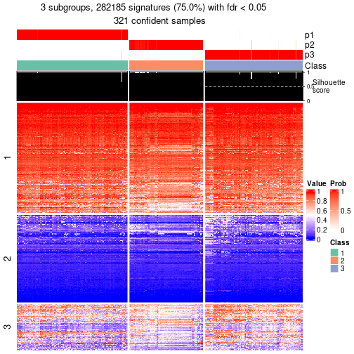</p>

</div>
<div id='tab-node-0-get-signatures-3'>
<pre><code class="r">get_signatures(res, k = 4)
</code></pre>

<p></p>

</div>
<div id='tab-node-0-get-signatures-4'>
<pre><code class="r">get_signatures(res, k = 5)
</code></pre>

<p></p>

</div>
<div id='tab-node-0-get-signatures-5'>
<pre><code class="r">get_signatures(res, k = 6)
</code></pre>

<p></p>

</div>
<div id='tab-node-0-get-signatures-6'>
<pre><code class="r">get_signatures(res, k = 7)
</code></pre>

<p></p>

</div>
<div id='tab-node-0-get-signatures-7'>
<pre><code class="r">get_signatures(res, k = 8)
</code></pre>

<p></p>

</div>
</div>


Compare the overlap of signatures from different k:

```r
compare_signatures(res)
```


`get_signature()` returns a data frame invisibly. To get the list of signatures, the function
call should be assigned to a variable explicitly. In following code, if `plot` argument is set
to `FALSE`, no heatmap is plotted while only the differential analysis is performed.

```r
# code only for demonstration
tb = get_signature(res, k = ..., plot = FALSE)
```

An example of the output of `tb` is:

```
#>   which_row         fdr    mean_1    mean_2 scaled_mean_1 scaled_mean_2 km
#> 1        38 0.042760348  8.373488  9.131774    -0.5533452     0.5164555  1
#> 2        40 0.018707592  7.106213  8.469186    -0.6173731     0.5762149  1
#> 3        55 0.019134737 10.221463 11.207825    -0.6159697     0.5749050  1
#> 4        59 0.006059896  5.921854  7.869574    -0.6899429     0.6439467  1
#> 5        60 0.018055526  8.928898 10.211722    -0.6204761     0.5791110  1
#> 6        98 0.009384629 15.714769 14.887706     0.6635654    -0.6193277  2
...
```

The columns in `tb` are:

1. `which_row`: row indices corresponding to the input matrix.
2. `fdr`: FDR for the differential test. 
3. `mean_x`: The mean value in group x.
4. `scaled_mean_x`: The mean value in group x after rows are scaled.
5. `km`: Row groups if k-means clustering is applied to rows (which is done by automatically selecting number of clusters).

If there are too many signatures, `top_signatures = ...` can be set to only show the 
signatures with the highest FDRs:

```r
# code only for demonstration
# e.g. to show the top 500 most significant rows
tb = get_signature(res, k = ..., top_signatures = 500)
```

If the signatures are defined as these which are uniquely high in current group, `diff_method` argument
can be set to `"uniquely_high_in_one_group"`:

```r
# code only for demonstration
tb = get_signature(res, k = ..., diff_method = "uniquely_high_in_one_group")
```


UMAP plot which shows how samples are separated.


<script>
$( function() {
	$( '#tabs-node-0-dimension-reduction' ).tabs();
} );
</script>
<div id='tabs-node-0-dimension-reduction'>
<ul>
<li><a href='#tab-node-0-dimension-reduction-1'>k = 2</a></li>
<li><a href='#tab-node-0-dimension-reduction-2'>k = 3</a></li>
<li><a href='#tab-node-0-dimension-reduction-3'>k = 4</a></li>
<li><a href='#tab-node-0-dimension-reduction-4'>k = 5</a></li>
<li><a href='#tab-node-0-dimension-reduction-5'>k = 6</a></li>
<li><a href='#tab-node-0-dimension-reduction-6'>k = 7</a></li>
<li><a href='#tab-node-0-dimension-reduction-7'>k = 8</a></li>
</ul>
<div id='tab-node-0-dimension-reduction-1'>
<pre><code class="r">dimension_reduction(res, k = 2, method = &quot;UMAP&quot;)
</code></pre>

<p></p>

</div>
<div id='tab-node-0-dimension-reduction-2'>
<pre><code class="r">dimension_reduction(res, k = 3, method = &quot;UMAP&quot;)
</code></pre>

<p></p>

</div>
<div id='tab-node-0-dimension-reduction-3'>
<pre><code class="r">dimension_reduction(res, k = 4, method = &quot;UMAP&quot;)
</code></pre>

<p></p>

</div>
<div id='tab-node-0-dimension-reduction-4'>
<pre><code class="r">dimension_reduction(res, k = 5, method = &quot;UMAP&quot;)
</code></pre>

<p></p>

</div>
<div id='tab-node-0-dimension-reduction-5'>
<pre><code class="r">dimension_reduction(res, k = 6, method = &quot;UMAP&quot;)
</code></pre>

<p></p>

</div>
<div id='tab-node-0-dimension-reduction-6'>
<pre><code class="r">dimension_reduction(res, k = 7, method = &quot;UMAP&quot;)
</code></pre>

<p></p>

</div>
<div id='tab-node-0-dimension-reduction-7'>
<pre><code class="r">dimension_reduction(res, k = 8, method = &quot;UMAP&quot;)
</code></pre>

<p></p>

</div>
</div>


Following heatmap shows how subgroups are split when increasing `k`:

```r
collect_classes(res)
```


If matrix rows can be associated to genes, consider to use `functional_enrichment(res,
...)` to perform function enrichment for the signature genes. See [this vignette](https://jokergoo.github.io/cola_vignettes/functional_enrichment.html) for more detailed explanations.


 

---------------------------------------------------


### Node01


Parent node: [Node0](#Node0).
Child nodes: 
                Node011-leaf
        ,
                [Node012](#Node012)
        ,
                [Node013](#Node013)
        ,
                Node021-leaf
        ,
                [Node022](#Node022)
        ,
                Node023-leaf
        ,
                [Node031](#Node031)
        ,
                [Node032](#Node032)
        ,
                Node033-leaf
        ,
                Node041-leaf
        ,
                Node042-leaf
        ,
                [Node043](#Node043)
        ,
                Node044-leaf
        ,
                [Node051](#Node051)
        ,
                [Node052](#Node052)
        ,
                [Node053](#Node053)
        ,
                Node054-leaf
        .


The object with results only for a single top-value method and a single partitioning method 
can be extracted as:

```r
res = res_rh["01"]
```

A summary of `res` and all the functions that can be applied to it:

```r
res
```

```
#> A 'ConsensusPartition' object with k = 2, 3, 4, 5, 6, 7, 8.
#>   On a matrix with 30000 rows and 79 columns.
#>   Top rows (1000) are extracted by 'SD' method.
#>   Subgroups are detected by 'skmeans' method.
#>   Performed in total 350 partitions by row resampling.
#>   Best k for subgroups seems to be 3.
#> 
#> Following methods can be applied to this 'ConsensusPartition' object:
#>  [1] "cola_report"             "collect_classes"         "collect_plots"          
#>  [4] "collect_stats"           "colnames"                "compare_partitions"     
#>  [7] "compare_signatures"      "consensus_heatmap"       "dimension_reduction"    
#> [10] "functional_enrichment"   "get_anno_col"            "get_anno"               
#> [13] "get_classes"             "get_consensus"           "get_matrix"             
#> [16] "get_membership"          "get_param"               "get_signatures"         
#> [19] "get_stats"               "is_best_k"               "is_stable_k"            
#> [22] "membership_heatmap"      "ncol"                    "nrow"                   
#> [25] "plot_ecdf"               "predict_classes"         "rownames"               
#> [28] "select_partition_number" "show"                    "suggest_best_k"         
#> [31] "test_to_known_factors"   "top_rows_heatmap"
```

`collect_plots()` function collects all the plots made from `res` for all `k` (number of subgroups)
into one single page to provide an easy and fast comparison between different `k`.

```r
collect_plots(res)
```


The plots are:

- The first row: a plot of the eCDF (empirical cumulative distribution
  function) curves of the consensus matrix for each `k` and the heatmap of
  predicted classes for each `k`.
- The second row: heatmaps of the consensus matrix for each `k`.
- The third row: heatmaps of the membership matrix for each `k`.
- The fouth row: heatmaps of the signatures for each `k`.

All the plots in panels can be made by individual functions and they are
plotted later in this section.

`select_partition_number()` produces several plots showing different
statistics for choosing "optimized" `k`. There are following statistics:

- eCDF curves of the consensus matrix for each `k`;
- 1-PAC. [The PAC score](https://en.wikipedia.org/wiki/Consensus_clustering#Over-interpretation_potential_of_consensus_clustering)
  measures the proportion of the ambiguous subgrouping.
- Mean silhouette score.
- Concordance. The mean probability of fiting the consensus subgroup labels in all
  partitions.
- Area increased. Denote $A_k$ as the area under the eCDF curve for current
  `k`, the area increased is defined as $A_k - A_{k-1}$.
- Rand index. The percent of pairs of samples that are both in a same cluster
  or both are not in a same cluster in the partition of k and k-1.
- Jaccard index. The ratio of pairs of samples are both in a same cluster in
  the partition of k and k-1 and the pairs of samples are both in a same
  cluster in the partition k or k-1.

The detailed explanations of these statistics can be found in [the _cola_
vignette](https://jokergoo.github.io/cola_vignettes/cola.html#toc_13).

Generally speaking, higher 1-PAC score, higher mean silhouette score or higher
concordance corresponds to better partition. Rand index and Jaccard index
measure how similar the current partition is compared to partition with `k-1`.
If they are too similar, we won't accept `k` is better than `k-1`.

```r
select_partition_number(res)
```


The numeric values for all these statistics can be obtained by `get_stats()`.

```r
get_stats(res)
```

```
#>   k 1-PAC mean_silhouette concordance area_increased  Rand Jaccard
#> 2 2 1.000           0.968       0.987         0.5015 0.498   0.498
#> 3 3 1.000           0.961       0.981         0.3149 0.763   0.559
#> 4 4 0.619           0.653       0.807         0.1153 0.919   0.768
#> 5 5 0.572           0.389       0.638         0.0609 0.890   0.640
#> 6 6 0.573           0.446       0.665         0.0376 0.902   0.630
#> 7 7 0.550           0.387       0.614         0.0252 0.931   0.717
#> 8 8 0.571           0.248       0.583         0.0180 0.935   0.714
```

`suggest_best_k()` suggests the best $k$ based on these statistics. The rules are as follows:

- All $k$ with Jaccard index larger than 0.95 are removed because increasing
  $k$ does not provide enough extra information. If all $k$ are removed, it is
  marked as no subgroup is detected.
- For all $k$ with 1-PAC score larger than 0.9, the maximal $k$ is taken as
  the best $k$, and other $k$ are marked as optional $k$.
- If it does not fit the second rule. The $k$ with the maximal vote of the
  highest 1-PAC score, highest mean silhouette, and highest concordance is
  taken as the best $k$.

```r
suggest_best_k(res)
```

```
#> [1] 3
#> attr(,"optional")
#> [1] 2
```

There is also optional best $k$ = 2 that is worth to check.

Following is the table of the partitions (You need to click the **show/hide
code output** link to see it). The membership matrix (columns with name `p*`)
is inferred by
[`clue::cl_consensus()`](https://www.rdocumentation.org/link/cl_consensus?package=clue)
function with the `SE` method. Basically the value in the membership matrix
represents the probability to belong to a certain group. The finall subgroup
label for an item is determined with the group with highest probability it
belongs to.

In `get_classes()` function, the entropy is calculated from the membership
matrix and the silhouette score is calculated from the consensus matrix.


<script>
$( function() {
	$( '#tabs-node-01-get-classes' ).tabs();
} );
</script>
<div id='tabs-node-01-get-classes'>
<ul>
<li><a href='#tab-node-01-get-classes-1'>k = 2</a></li>
<li><a href='#tab-node-01-get-classes-2'>k = 3</a></li>
<li><a href='#tab-node-01-get-classes-3'>k = 4</a></li>
<li><a href='#tab-node-01-get-classes-4'>k = 5</a></li>
<li><a href='#tab-node-01-get-classes-5'>k = 6</a></li>
<li><a href='#tab-node-01-get-classes-6'>k = 7</a></li>
<li><a href='#tab-node-01-get-classes-7'>k = 8</a></li>
</ul>

<div id='tab-node-01-get-classes-1'>
<p><a id='tab-node-01-get-classes-1-a' style='color:#0366d6' href='#'>show/hide code output</a></p>
<pre><code class="r">cbind(get_classes(res, k = 2), get_membership(res, k = 2))
</code></pre>

<pre><code>#&gt;                 class entropy silhouette   p1   p2
#&gt; TCGA.SX.A7SS.01     1   0.000      0.978 1.00 0.00
#&gt; TCGA.BQ.5878.01     1   0.000      0.978 1.00 0.00
#&gt; TCGA.DW.5561.01     2   0.000      0.994 0.00 1.00
#&gt; TCGA.KV.A6GE.01     1   0.000      0.978 1.00 0.00
#&gt; TCGA.SX.A7SQ.01     2   0.000      0.994 0.00 1.00
#&gt; TCGA.B1.A654.01     2   0.000      0.994 0.00 1.00
#&gt; TCGA.G7.A4TM.01     2   0.000      0.994 0.00 1.00
#&gt; TCGA.IZ.8196.01     2   0.000      0.994 0.00 1.00
#&gt; TCGA.B9.A5W7.01     2   0.000      0.994 0.00 1.00
#&gt; TCGA.SX.A7SU.01     2   0.000      0.994 0.00 1.00
#&gt; TCGA.GL.8500.01     2   0.000      0.994 0.00 1.00
#&gt; TCGA.EV.5902.01     1   0.855      0.613 0.72 0.28
#&gt; TCGA.A4.8516.01     2   0.000      0.994 0.00 1.00
#&gt; TCGA.MH.A854.01     2   0.000      0.994 0.00 1.00
#&gt; TCGA.A4.8630.01     1   0.000      0.978 1.00 0.00
#&gt; TCGA.4A.A93W.01     2   0.000      0.994 0.00 1.00
#&gt; TCGA.GL.A9DC.01     2   0.000      0.994 0.00 1.00
#&gt; TCGA.A4.8515.01     1   0.000      0.978 1.00 0.00
#&gt; TCGA.IZ.A6M9.01     1   0.000      0.978 1.00 0.00
#&gt; TCGA.Y8.A8S0.01     1   0.000      0.978 1.00 0.00
#&gt; TCGA.G7.A8LB.01     1   0.000      0.978 1.00 0.00
#&gt; TCGA.SX.A7SL.01     1   0.000      0.978 1.00 0.00
#&gt; TCGA.B9.A8YH.01     2   0.000      0.994 0.00 1.00
#&gt; TCGA.G7.A8LE.01     2   0.000      0.994 0.00 1.00
#&gt; TCGA.SX.A71W.01     1   0.000      0.978 1.00 0.00
#&gt; TCGA.Y8.A894.01     2   0.000      0.994 0.00 1.00
#&gt; TCGA.A4.8311.01     1   0.000      0.978 1.00 0.00
#&gt; TCGA.Y8.A895.01     1   0.000      0.978 1.00 0.00
#&gt; TCGA.2Z.A9JS.01     1   0.000      0.978 1.00 0.00
#&gt; TCGA.KV.A74V.01     1   0.000      0.978 1.00 0.00
#&gt; TCGA.UZ.A9PZ.01     2   0.000      0.994 0.00 1.00
#&gt; TCGA.B9.5155.01     1   0.000      0.978 1.00 0.00
#&gt; TCGA.5P.A9K4.01     1   0.000      0.978 1.00 0.00
#&gt; TCGA.PJ.A5Z9.01     1   0.000      0.978 1.00 0.00
#&gt; TCGA.5P.A9KF.01     1   0.141      0.960 0.98 0.02
#&gt; TCGA.5P.A9K2.01     1   0.000      0.978 1.00 0.00
#&gt; TCGA.UZ.A9PV.01     1   0.000      0.978 1.00 0.00
#&gt; TCGA.UZ.A9Q0.01     1   0.000      0.978 1.00 0.00
#&gt; TCGA.UZ.A9PX.01     2   0.000      0.994 0.00 1.00
#&gt; TCGA.UZ.A9PR.01     2   0.000      0.994 0.00 1.00
#&gt; TCGA.B1.A47N.01     2   0.000      0.994 0.00 1.00
#&gt; TCGA.2Z.A9JE.01     2   0.000      0.994 0.00 1.00
#&gt; TCGA.AT.A5NU.01     1   0.000      0.978 1.00 0.00
#&gt; TCGA.2Z.A9JQ.01     2   0.000      0.994 0.00 1.00
#&gt; TCGA.UZ.A9PU.01     1   0.995      0.160 0.54 0.46
#&gt; TCGA.P4.A5EB.01     1   0.000      0.978 1.00 0.00
#&gt; TCGA.UZ.A9PP.01     2   0.000      0.994 0.00 1.00
#&gt; TCGA.5P.A9JY.01     1   0.000      0.978 1.00 0.00
#&gt; TCGA.P4.AAVL.01     2   0.000      0.994 0.00 1.00
#&gt; TCGA.SX.A71R.01     2   0.000      0.994 0.00 1.00
#&gt; TCGA.A4.A5DU.01     2   0.000      0.994 0.00 1.00
#&gt; TCGA.HE.7129.01     1   0.000      0.978 1.00 0.00
#&gt; TCGA.HE.A5NJ.01     1   0.000      0.978 1.00 0.00
#&gt; TCGA.DW.7839.01     2   0.000      0.994 0.00 1.00
#&gt; TCGA.BQ.7051.01     1   0.000      0.978 1.00 0.00
#&gt; TCGA.O9.A75Z.01     2   0.000      0.994 0.00 1.00
#&gt; TCGA.DZ.6133.01     2   0.000      0.994 0.00 1.00
#&gt; TCGA.A4.A4ZT.01     1   0.000      0.978 1.00 0.00
#&gt; TCGA.B1.7332.01     1   0.000      0.978 1.00 0.00
#&gt; TCGA.G7.6797.01     1   0.000      0.978 1.00 0.00
#&gt; TCGA.HE.A5NH.01     2   0.000      0.994 0.00 1.00
#&gt; TCGA.B9.7268.01     1   0.000      0.978 1.00 0.00
#&gt; TCGA.HE.A5NI.01     1   0.000      0.978 1.00 0.00
#&gt; TCGA.F9.A7VF.01     1   0.000      0.978 1.00 0.00
#&gt; TCGA.DZ.6135.01     2   0.000      0.994 0.00 1.00
#&gt; TCGA.MH.A55Z.01     2   0.000      0.994 0.00 1.00
#&gt; TCGA.SX.A71S.01     2   0.000      0.994 0.00 1.00
#&gt; TCGA.DW.7840.01     2   0.000      0.994 0.00 1.00
#&gt; TCGA.GL.A59R.01     2   0.000      0.994 0.00 1.00
#&gt; TCGA.DW.7842.01     2   0.000      0.994 0.00 1.00
#&gt; TCGA.DW.7836.01     2   0.000      0.994 0.00 1.00
#&gt; TCGA.B3.A6W5.01     2   0.680      0.778 0.18 0.82
#&gt; TCGA.A4.7734.01     2   0.000      0.994 0.00 1.00
#&gt; TCGA.UZ.A9PJ.01     2   0.000      0.994 0.00 1.00
#&gt; TCGA.UZ.A9PL.01     2   0.000      0.994 0.00 1.00
#&gt; TCGA.A4.7732.01     2   0.000      0.994 0.00 1.00
#&gt; TCGA.2Z.A9J3.01     2   0.000      0.994 0.00 1.00
#&gt; TCGA.UZ.A9PK.01     1   0.000      0.978 1.00 0.00
#&gt; TCGA.2Z.A9J7.01     2   0.327      0.933 0.06 0.94
</code></pre>

<script>
$('#tab-node-01-get-classes-1-a').parent().next().next().hide();
$('#tab-node-01-get-classes-1-a').click(function(){
  $('#tab-node-01-get-classes-1-a').parent().next().next().toggle();
  return(false);
});
</script>
</div>

<div id='tab-node-01-get-classes-2'>
<p><a id='tab-node-01-get-classes-2-a' style='color:#0366d6' href='#'>show/hide code output</a></p>
<pre><code class="r">cbind(get_classes(res, k = 3), get_membership(res, k = 3))
</code></pre>

<pre><code>#&gt;                 class entropy silhouette   p1   p2   p3
#&gt; TCGA.SX.A7SS.01     1  0.0000      0.987 1.00 0.00 0.00
#&gt; TCGA.BQ.5878.01     1  0.0000      0.987 1.00 0.00 0.00
#&gt; TCGA.DW.5561.01     3  0.0000      0.973 0.00 0.00 1.00
#&gt; TCGA.KV.A6GE.01     1  0.0892      0.975 0.98 0.02 0.00
#&gt; TCGA.SX.A7SQ.01     3  0.0000      0.973 0.00 0.00 1.00
#&gt; TCGA.B1.A654.01     3  0.0000      0.973 0.00 0.00 1.00
#&gt; TCGA.G7.A4TM.01     3  0.0000      0.973 0.00 0.00 1.00
#&gt; TCGA.IZ.8196.01     2  0.0892      0.977 0.00 0.98 0.02
#&gt; TCGA.B9.A5W7.01     3  0.0000      0.973 0.00 0.00 1.00
#&gt; TCGA.SX.A7SU.01     3  0.0000      0.973 0.00 0.00 1.00
#&gt; TCGA.GL.8500.01     2  0.0000      0.976 0.00 1.00 0.00
#&gt; TCGA.EV.5902.01     2  0.0000      0.976 0.00 1.00 0.00
#&gt; TCGA.A4.8516.01     2  0.0892      0.977 0.00 0.98 0.02
#&gt; TCGA.MH.A854.01     2  0.1529      0.968 0.00 0.96 0.04
#&gt; TCGA.A4.8630.01     1  0.0000      0.987 1.00 0.00 0.00
#&gt; TCGA.4A.A93W.01     3  0.0000      0.973 0.00 0.00 1.00
#&gt; TCGA.GL.A9DC.01     2  0.0000      0.976 0.00 1.00 0.00
#&gt; TCGA.A4.8515.01     1  0.0892      0.975 0.98 0.02 0.00
#&gt; TCGA.IZ.A6M9.01     1  0.0000      0.987 1.00 0.00 0.00
#&gt; TCGA.Y8.A8S0.01     1  0.0000      0.987 1.00 0.00 0.00
#&gt; TCGA.G7.A8LB.01     1  0.0000      0.987 1.00 0.00 0.00
#&gt; TCGA.SX.A7SL.01     1  0.0000      0.987 1.00 0.00 0.00
#&gt; TCGA.B9.A8YH.01     2  0.1529      0.968 0.00 0.96 0.04
#&gt; TCGA.G7.A8LE.01     3  0.6244      0.157 0.00 0.44 0.56
#&gt; TCGA.SX.A71W.01     1  0.0000      0.987 1.00 0.00 0.00
#&gt; TCGA.Y8.A894.01     2  0.0892      0.977 0.00 0.98 0.02
#&gt; TCGA.A4.8311.01     1  0.0000      0.987 1.00 0.00 0.00
#&gt; TCGA.Y8.A895.01     1  0.0892      0.975 0.98 0.02 0.00
#&gt; TCGA.2Z.A9JS.01     1  0.0000      0.987 1.00 0.00 0.00
#&gt; TCGA.KV.A74V.01     1  0.0000      0.987 1.00 0.00 0.00
#&gt; TCGA.UZ.A9PZ.01     2  0.0892      0.974 0.00 0.98 0.02
#&gt; TCGA.B9.5155.01     1  0.0000      0.987 1.00 0.00 0.00
#&gt; TCGA.5P.A9K4.01     1  0.0000      0.987 1.00 0.00 0.00
#&gt; TCGA.PJ.A5Z9.01     1  0.0000      0.987 1.00 0.00 0.00
#&gt; TCGA.5P.A9KF.01     2  0.0000      0.976 0.00 1.00 0.00
#&gt; TCGA.5P.A9K2.01     1  0.0000      0.987 1.00 0.00 0.00
#&gt; TCGA.UZ.A9PV.01     1  0.0000      0.987 1.00 0.00 0.00
#&gt; TCGA.UZ.A9Q0.01     1  0.0892      0.975 0.98 0.02 0.00
#&gt; TCGA.UZ.A9PX.01     2  0.0000      0.976 0.00 1.00 0.00
#&gt; TCGA.UZ.A9PR.01     2  0.0892      0.977 0.00 0.98 0.02
#&gt; TCGA.B1.A47N.01     3  0.0000      0.973 0.00 0.00 1.00
#&gt; TCGA.2Z.A9JE.01     2  0.2537      0.933 0.00 0.92 0.08
#&gt; TCGA.AT.A5NU.01     1  0.0000      0.987 1.00 0.00 0.00
#&gt; TCGA.2Z.A9JQ.01     2  0.0892      0.977 0.00 0.98 0.02
#&gt; TCGA.UZ.A9PU.01     2  0.0000      0.976 0.00 1.00 0.00
#&gt; TCGA.P4.A5EB.01     2  0.0000      0.976 0.00 1.00 0.00
#&gt; TCGA.UZ.A9PP.01     3  0.0000      0.973 0.00 0.00 1.00
#&gt; TCGA.5P.A9JY.01     1  0.0000      0.987 1.00 0.00 0.00
#&gt; TCGA.P4.AAVL.01     2  0.0892      0.970 0.00 0.98 0.02
#&gt; TCGA.SX.A71R.01     2  0.0892      0.974 0.00 0.98 0.02
#&gt; TCGA.A4.A5DU.01     3  0.0000      0.973 0.00 0.00 1.00
#&gt; TCGA.HE.7129.01     1  0.0000      0.987 1.00 0.00 0.00
#&gt; TCGA.HE.A5NJ.01     1  0.0000      0.987 1.00 0.00 0.00
#&gt; TCGA.DW.7839.01     3  0.0000      0.973 0.00 0.00 1.00
#&gt; TCGA.BQ.7051.01     1  0.0892      0.975 0.98 0.02 0.00
#&gt; TCGA.O9.A75Z.01     3  0.0000      0.973 0.00 0.00 1.00
#&gt; TCGA.DZ.6133.01     2  0.0892      0.974 0.00 0.98 0.02
#&gt; TCGA.A4.A4ZT.01     1  0.0000      0.987 1.00 0.00 0.00
#&gt; TCGA.B1.7332.01     1  0.0000      0.987 1.00 0.00 0.00
#&gt; TCGA.G7.6797.01     1  0.0000      0.987 1.00 0.00 0.00
#&gt; TCGA.HE.A5NH.01     2  0.0892      0.977 0.00 0.98 0.02
#&gt; TCGA.B9.7268.01     1  0.0000      0.987 1.00 0.00 0.00
#&gt; TCGA.HE.A5NI.01     1  0.0892      0.975 0.98 0.02 0.00
#&gt; TCGA.F9.A7VF.01     1  0.0000      0.987 1.00 0.00 0.00
#&gt; TCGA.DZ.6135.01     2  0.0000      0.976 0.00 1.00 0.00
#&gt; TCGA.MH.A55Z.01     2  0.0892      0.977 0.00 0.98 0.02
#&gt; TCGA.SX.A71S.01     2  0.1529      0.968 0.00 0.96 0.04
#&gt; TCGA.DW.7840.01     2  0.4002      0.835 0.00 0.84 0.16
#&gt; TCGA.GL.A59R.01     2  0.1529      0.968 0.00 0.96 0.04
#&gt; TCGA.DW.7842.01     3  0.0000      0.973 0.00 0.00 1.00
#&gt; TCGA.DW.7836.01     3  0.0000      0.973 0.00 0.00 1.00
#&gt; TCGA.B3.A6W5.01     1  0.7398      0.630 0.70 0.18 0.12
#&gt; TCGA.A4.7734.01     3  0.0000      0.973 0.00 0.00 1.00
#&gt; TCGA.UZ.A9PJ.01     3  0.0000      0.973 0.00 0.00 1.00
#&gt; TCGA.UZ.A9PL.01     2  0.0000      0.976 0.00 1.00 0.00
#&gt; TCGA.A4.7732.01     3  0.0000      0.973 0.00 0.00 1.00
#&gt; TCGA.2Z.A9J3.01     2  0.0000      0.976 0.00 1.00 0.00
#&gt; TCGA.UZ.A9PK.01     1  0.0000      0.987 1.00 0.00 0.00
#&gt; TCGA.2Z.A9J7.01     3  0.0892      0.952 0.02 0.00 0.98
</code></pre>

<script>
$('#tab-node-01-get-classes-2-a').parent().next().next().hide();
$('#tab-node-01-get-classes-2-a').click(function(){
  $('#tab-node-01-get-classes-2-a').parent().next().next().toggle();
  return(false);
});
</script>
</div>

<div id='tab-node-01-get-classes-3'>
<p><a id='tab-node-01-get-classes-3-a' style='color:#0366d6' href='#'>show/hide code output</a></p>
<pre><code class="r">cbind(get_classes(res, k = 4), get_membership(res, k = 4))
</code></pre>

<pre><code>#&gt;                 class entropy silhouette   p1   p2   p3   p4
#&gt; TCGA.SX.A7SS.01     1  0.4491     0.6123 0.80 0.06 0.00 0.14
#&gt; TCGA.BQ.5878.01     1  0.3172     0.6496 0.84 0.00 0.00 0.16
#&gt; TCGA.DW.5561.01     3  0.3400     0.8364 0.00 0.00 0.82 0.18
#&gt; TCGA.KV.A6GE.01     1  0.4948    -0.0306 0.56 0.00 0.00 0.44
#&gt; TCGA.SX.A7SQ.01     3  0.1211     0.8732 0.00 0.00 0.96 0.04
#&gt; TCGA.B1.A654.01     3  0.4079     0.8298 0.00 0.02 0.80 0.18
#&gt; TCGA.G7.A4TM.01     3  0.1211     0.8782 0.00 0.00 0.96 0.04
#&gt; TCGA.IZ.8196.01     2  0.4292     0.8174 0.00 0.82 0.08 0.10
#&gt; TCGA.B9.A5W7.01     3  0.2345     0.8543 0.00 0.00 0.90 0.10
#&gt; TCGA.SX.A7SU.01     3  0.0707     0.8787 0.00 0.00 0.98 0.02
#&gt; TCGA.GL.8500.01     2  0.2335     0.8286 0.00 0.92 0.02 0.06
#&gt; TCGA.EV.5902.01     2  0.4894     0.7790 0.10 0.78 0.00 0.12
#&gt; TCGA.A4.8516.01     2  0.1913     0.8422 0.00 0.94 0.02 0.04
#&gt; TCGA.MH.A854.01     2  0.5291     0.7632 0.00 0.74 0.08 0.18
#&gt; TCGA.A4.8630.01     1  0.3610     0.6178 0.80 0.00 0.00 0.20
#&gt; TCGA.4A.A93W.01     3  0.3037     0.8639 0.00 0.02 0.88 0.10
#&gt; TCGA.GL.A9DC.01     2  0.2647     0.8363 0.00 0.88 0.00 0.12
#&gt; TCGA.A4.8515.01     1  0.3198     0.6450 0.88 0.04 0.00 0.08
#&gt; TCGA.IZ.A6M9.01     1  0.4406     0.4771 0.70 0.00 0.00 0.30
#&gt; TCGA.Y8.A8S0.01     1  0.4134     0.5801 0.74 0.00 0.00 0.26
#&gt; TCGA.G7.A8LB.01     1  0.0707     0.7150 0.98 0.00 0.00 0.02
#&gt; TCGA.SX.A7SL.01     1  0.3801     0.6073 0.78 0.00 0.00 0.22
#&gt; TCGA.B9.A8YH.01     2  0.3611     0.8280 0.00 0.86 0.08 0.06
#&gt; TCGA.G7.A8LE.01     2  0.7610     0.0676 0.00 0.40 0.40 0.20
#&gt; TCGA.SX.A71W.01     4  0.4977     0.1713 0.46 0.00 0.00 0.54
#&gt; TCGA.Y8.A894.01     2  0.4079     0.7978 0.00 0.80 0.02 0.18
#&gt; TCGA.A4.8311.01     1  0.2647     0.7033 0.88 0.00 0.00 0.12
#&gt; TCGA.Y8.A895.01     1  0.3037     0.6440 0.88 0.02 0.00 0.10
#&gt; TCGA.2Z.A9JS.01     1  0.3975     0.5815 0.76 0.00 0.00 0.24
#&gt; TCGA.KV.A74V.01     4  0.4994     0.2666 0.48 0.00 0.00 0.52
#&gt; TCGA.UZ.A9PZ.01     2  0.3030     0.8347 0.02 0.90 0.02 0.06
#&gt; TCGA.B9.5155.01     1  0.1211     0.7193 0.96 0.00 0.00 0.04
#&gt; TCGA.5P.A9K4.01     4  0.4977     0.3290 0.46 0.00 0.00 0.54
#&gt; TCGA.PJ.A5Z9.01     1  0.4977    -0.1822 0.54 0.00 0.00 0.46
#&gt; TCGA.5P.A9KF.01     2  0.3935     0.7823 0.10 0.84 0.00 0.06
#&gt; TCGA.5P.A9K2.01     1  0.2345     0.7065 0.90 0.00 0.00 0.10
#&gt; TCGA.UZ.A9PV.01     1  0.1211     0.7035 0.96 0.00 0.00 0.04
#&gt; TCGA.UZ.A9Q0.01     1  0.2706     0.6642 0.90 0.02 0.00 0.08
#&gt; TCGA.UZ.A9PX.01     2  0.1913     0.8340 0.00 0.94 0.02 0.04
#&gt; TCGA.UZ.A9PR.01     2  0.2335     0.8412 0.00 0.92 0.02 0.06
#&gt; TCGA.B1.A47N.01     3  0.3400     0.8256 0.00 0.00 0.82 0.18
#&gt; TCGA.2Z.A9JE.01     2  0.6840     0.5814 0.00 0.60 0.22 0.18
#&gt; TCGA.AT.A5NU.01     1  0.2345     0.6999 0.90 0.00 0.00 0.10
#&gt; TCGA.2Z.A9JQ.01     2  0.4332     0.8012 0.00 0.80 0.04 0.16
#&gt; TCGA.UZ.A9PU.01     2  0.3611     0.8049 0.06 0.86 0.00 0.08
#&gt; TCGA.P4.A5EB.01     2  0.3247     0.8136 0.06 0.88 0.00 0.06
#&gt; TCGA.UZ.A9PP.01     3  0.1637     0.8723 0.00 0.00 0.94 0.06
#&gt; TCGA.5P.A9JY.01     1  0.0000     0.7108 1.00 0.00 0.00 0.00
#&gt; TCGA.P4.AAVL.01     2  0.7744     0.4408 0.02 0.48 0.14 0.36
#&gt; TCGA.SX.A71R.01     2  0.1637     0.8401 0.00 0.94 0.00 0.06
#&gt; TCGA.A4.A5DU.01     3  0.4713     0.6545 0.00 0.00 0.64 0.36
#&gt; TCGA.HE.7129.01     1  0.4406     0.4970 0.70 0.00 0.00 0.30
#&gt; TCGA.HE.A5NJ.01     4  0.4907     0.3909 0.42 0.00 0.00 0.58
#&gt; TCGA.DW.7839.01     3  0.6449     0.6691 0.00 0.14 0.64 0.22
#&gt; TCGA.BQ.7051.01     1  0.1637     0.6921 0.94 0.00 0.00 0.06
#&gt; TCGA.O9.A75Z.01     3  0.0000     0.8791 0.00 0.00 1.00 0.00
#&gt; TCGA.DZ.6133.01     2  0.2011     0.8374 0.00 0.92 0.00 0.08
#&gt; TCGA.A4.A4ZT.01     4  0.4948     0.3975 0.44 0.00 0.00 0.56
#&gt; TCGA.B1.7332.01     4  0.4277     0.4734 0.28 0.00 0.00 0.72
#&gt; TCGA.G7.6797.01     1  0.4713     0.2601 0.64 0.00 0.00 0.36
#&gt; TCGA.HE.A5NH.01     2  0.1913     0.8410 0.00 0.94 0.02 0.04
#&gt; TCGA.B9.7268.01     1  0.2921     0.7084 0.86 0.00 0.00 0.14
#&gt; TCGA.HE.A5NI.01     1  0.3853     0.6655 0.82 0.02 0.00 0.16
#&gt; TCGA.F9.A7VF.01     1  0.1211     0.7134 0.96 0.00 0.00 0.04
#&gt; TCGA.DZ.6135.01     2  0.2706     0.8341 0.00 0.90 0.02 0.08
#&gt; TCGA.MH.A55Z.01     2  0.2411     0.8415 0.00 0.92 0.04 0.04
#&gt; TCGA.SX.A71S.01     2  0.5147     0.7636 0.00 0.74 0.06 0.20
#&gt; TCGA.DW.7840.01     2  0.6382     0.4987 0.00 0.58 0.34 0.08
#&gt; TCGA.GL.A59R.01     2  0.5077     0.7771 0.00 0.76 0.08 0.16
#&gt; TCGA.DW.7842.01     3  0.0707     0.8796 0.00 0.00 0.98 0.02
#&gt; TCGA.DW.7836.01     3  0.5383     0.7488 0.00 0.10 0.74 0.16
#&gt; TCGA.B3.A6W5.01     4  0.5241     0.4172 0.14 0.04 0.04 0.78
#&gt; TCGA.A4.7734.01     3  0.3525     0.8453 0.00 0.04 0.86 0.10
#&gt; TCGA.UZ.A9PJ.01     3  0.0000     0.8791 0.00 0.00 1.00 0.00
#&gt; TCGA.UZ.A9PL.01     2  0.3886     0.8116 0.04 0.86 0.02 0.08
#&gt; TCGA.A4.7732.01     3  0.2706     0.8567 0.00 0.02 0.90 0.08
#&gt; TCGA.2Z.A9J3.01     2  0.1913     0.8340 0.00 0.94 0.02 0.04
#&gt; TCGA.UZ.A9PK.01     1  0.4948    -0.0721 0.56 0.00 0.00 0.44
#&gt; TCGA.2Z.A9J7.01     4  0.4994    -0.4206 0.00 0.00 0.48 0.52
</code></pre>

<script>
$('#tab-node-01-get-classes-3-a').parent().next().next().hide();
$('#tab-node-01-get-classes-3-a').click(function(){
  $('#tab-node-01-get-classes-3-a').parent().next().next().toggle();
  return(false);
});
</script>
</div>

<div id='tab-node-01-get-classes-4'>
<p><a id='tab-node-01-get-classes-4-a' style='color:#0366d6' href='#'>show/hide code output</a></p>
<pre><code class="r">cbind(get_classes(res, k = 5), get_membership(res, k = 5))
</code></pre>

<pre><code>#&gt;                 class entropy silhouette   p1   p2   p3   p4   p5
#&gt; TCGA.SX.A7SS.01     1  0.5648    0.52427 0.68 0.02 0.00 0.14 0.16
#&gt; TCGA.BQ.5878.01     1  0.5934    0.44890 0.62 0.02 0.00 0.26 0.10
#&gt; TCGA.DW.5561.01     3  0.4552    0.73278 0.00 0.02 0.78 0.10 0.10
#&gt; TCGA.KV.A6GE.01     4  0.6200    0.37374 0.28 0.00 0.00 0.54 0.18
#&gt; TCGA.SX.A7SQ.01     3  0.4312    0.73968 0.00 0.16 0.78 0.04 0.02
#&gt; TCGA.B1.A654.01     3  0.6700    0.41616 0.00 0.38 0.46 0.14 0.02
#&gt; TCGA.G7.A4TM.01     3  0.4420    0.78937 0.00 0.08 0.80 0.04 0.08
#&gt; TCGA.IZ.8196.01     2  0.3561    0.19399 0.00 0.74 0.00 0.00 0.26
#&gt; TCGA.B9.A5W7.01     3  0.2616    0.77172 0.00 0.00 0.88 0.02 0.10
#&gt; TCGA.SX.A7SU.01     3  0.2012    0.79973 0.00 0.06 0.92 0.02 0.00
#&gt; TCGA.GL.8500.01     5  0.4262    0.48368 0.00 0.44 0.00 0.00 0.56
#&gt; TCGA.EV.5902.01     2  0.5236    0.15510 0.04 0.72 0.00 0.06 0.18
#&gt; TCGA.A4.8516.01     2  0.4126   -0.06357 0.00 0.62 0.00 0.00 0.38
#&gt; TCGA.MH.A854.01     2  0.3348    0.40190 0.00 0.86 0.02 0.08 0.04
#&gt; TCGA.A4.8630.01     1  0.3291    0.64577 0.84 0.00 0.00 0.12 0.04
#&gt; TCGA.4A.A93W.01     3  0.4263    0.72436 0.00 0.18 0.76 0.06 0.00
#&gt; TCGA.GL.A9DC.01     2  0.3852    0.21485 0.00 0.76 0.00 0.02 0.22
#&gt; TCGA.A4.8515.01     1  0.5130    0.49713 0.68 0.00 0.00 0.10 0.22
#&gt; TCGA.IZ.A6M9.01     1  0.5425    0.38609 0.60 0.00 0.00 0.32 0.08
#&gt; TCGA.Y8.A8S0.01     1  0.4075    0.61053 0.78 0.00 0.00 0.16 0.06
#&gt; TCGA.G7.A8LB.01     1  0.2616    0.67270 0.88 0.00 0.00 0.10 0.02
#&gt; TCGA.SX.A7SL.01     1  0.5727    0.31338 0.56 0.00 0.00 0.34 0.10
#&gt; TCGA.B9.A8YH.01     2  0.5534    0.05757 0.00 0.58 0.02 0.04 0.36
#&gt; TCGA.G7.A8LE.01     2  0.5574    0.24521 0.00 0.66 0.24 0.08 0.02
#&gt; TCGA.SX.A71W.01     4  0.5345    0.11073 0.46 0.00 0.02 0.50 0.02
#&gt; TCGA.Y8.A894.01     2  0.3106    0.31901 0.00 0.84 0.00 0.02 0.14
#&gt; TCGA.A4.8311.01     1  0.2754    0.65798 0.88 0.00 0.00 0.04 0.08
#&gt; TCGA.Y8.A895.01     1  0.2732    0.62222 0.84 0.00 0.00 0.00 0.16
#&gt; TCGA.2Z.A9JS.01     1  0.4644    0.44856 0.68 0.00 0.00 0.28 0.04
#&gt; TCGA.KV.A74V.01     4  0.4748    0.48463 0.30 0.00 0.00 0.66 0.04
#&gt; TCGA.UZ.A9PZ.01     2  0.6094   -0.23787 0.08 0.54 0.00 0.02 0.36
#&gt; TCGA.B9.5155.01     1  0.2797    0.68210 0.88 0.00 0.00 0.06 0.06
#&gt; TCGA.5P.A9K4.01     4  0.4433    0.51441 0.20 0.00 0.00 0.74 0.06
#&gt; TCGA.PJ.A5Z9.01     4  0.4829    0.20150 0.48 0.00 0.00 0.50 0.02
#&gt; TCGA.5P.A9KF.01     5  0.6263    0.50974 0.10 0.34 0.00 0.02 0.54
#&gt; TCGA.5P.A9K2.01     1  0.3390    0.66446 0.84 0.00 0.00 0.10 0.06
#&gt; TCGA.UZ.A9PV.01     1  0.1648    0.68021 0.94 0.00 0.00 0.02 0.04
#&gt; TCGA.UZ.A9Q0.01     1  0.5013    0.52784 0.68 0.00 0.00 0.08 0.24
#&gt; TCGA.UZ.A9PX.01     2  0.4307   -0.44461 0.00 0.50 0.00 0.00 0.50
#&gt; TCGA.UZ.A9PR.01     2  0.4798   -0.31188 0.00 0.54 0.02 0.00 0.44
#&gt; TCGA.B1.A47N.01     3  0.6200    0.48281 0.00 0.02 0.56 0.32 0.10
#&gt; TCGA.2Z.A9JE.01     2  0.1648    0.40936 0.00 0.94 0.04 0.00 0.02
#&gt; TCGA.AT.A5NU.01     1  0.1732    0.67276 0.92 0.00 0.00 0.08 0.00
#&gt; TCGA.2Z.A9JQ.01     2  0.1216    0.40507 0.00 0.96 0.00 0.02 0.02
#&gt; TCGA.UZ.A9PU.01     5  0.4854    0.57087 0.06 0.26 0.00 0.00 0.68
#&gt; TCGA.P4.A5EB.01     5  0.4360    0.57303 0.00 0.30 0.00 0.02 0.68
#&gt; TCGA.UZ.A9PP.01     3  0.0609    0.78990 0.00 0.00 0.98 0.00 0.02
#&gt; TCGA.5P.A9JY.01     1  0.1732    0.66503 0.92 0.00 0.00 0.00 0.08
#&gt; TCGA.P4.AAVL.01     5  0.8058    0.18835 0.00 0.34 0.10 0.22 0.34
#&gt; TCGA.SX.A71R.01     2  0.4816    0.12184 0.00 0.68 0.02 0.02 0.28
#&gt; TCGA.A4.A5DU.01     3  0.6604    0.59780 0.00 0.06 0.60 0.22 0.12
#&gt; TCGA.HE.7129.01     1  0.4182    0.16068 0.60 0.00 0.00 0.40 0.00
#&gt; TCGA.HE.A5NJ.01     4  0.3852    0.53299 0.22 0.00 0.00 0.76 0.02
#&gt; TCGA.DW.7839.01     2  0.6037    0.09317 0.00 0.62 0.24 0.12 0.02
#&gt; TCGA.BQ.7051.01     1  0.2873    0.66008 0.86 0.00 0.00 0.02 0.12
#&gt; TCGA.O9.A75Z.01     3  0.1732    0.79511 0.00 0.08 0.92 0.00 0.00
#&gt; TCGA.DZ.6133.01     2  0.3852    0.25774 0.00 0.76 0.00 0.02 0.22
#&gt; TCGA.A4.A4ZT.01     4  0.4644    0.50553 0.28 0.00 0.00 0.68 0.04
#&gt; TCGA.B1.7332.01     4  0.5062    0.50817 0.08 0.08 0.00 0.76 0.08
#&gt; TCGA.G7.6797.01     4  0.5694    0.00666 0.46 0.00 0.00 0.46 0.08
#&gt; TCGA.HE.A5NH.01     2  0.4060   -0.04092 0.00 0.64 0.00 0.00 0.36
#&gt; TCGA.B9.7268.01     1  0.3561    0.49374 0.74 0.00 0.00 0.26 0.00
#&gt; TCGA.HE.A5NI.01     1  0.5895   -0.11901 0.46 0.00 0.00 0.44 0.10
#&gt; TCGA.F9.A7VF.01     1  0.2438    0.67242 0.90 0.00 0.00 0.04 0.06
#&gt; TCGA.DZ.6135.01     5  0.4287    0.42320 0.00 0.46 0.00 0.00 0.54
#&gt; TCGA.MH.A55Z.01     2  0.5173   -0.21308 0.00 0.50 0.04 0.00 0.46
#&gt; TCGA.SX.A71S.01     2  0.1410    0.40965 0.00 0.94 0.00 0.06 0.00
#&gt; TCGA.DW.7840.01     2  0.7514    0.16682 0.00 0.46 0.26 0.06 0.22
#&gt; TCGA.GL.A59R.01     2  0.2077    0.41269 0.00 0.92 0.00 0.04 0.04
#&gt; TCGA.DW.7842.01     3  0.0609    0.79080 0.00 0.00 0.98 0.00 0.02
#&gt; TCGA.DW.7836.01     2  0.6313   -0.35585 0.00 0.46 0.44 0.06 0.04
#&gt; TCGA.B3.A6W5.01     4  0.3946    0.45996 0.00 0.12 0.00 0.80 0.08
#&gt; TCGA.A4.7734.01     3  0.5232    0.54876 0.00 0.34 0.60 0.06 0.00
#&gt; TCGA.UZ.A9PJ.01     3  0.2610    0.79137 0.00 0.06 0.90 0.02 0.02
#&gt; TCGA.UZ.A9PL.01     5  0.4767    0.50735 0.00 0.42 0.00 0.02 0.56
#&gt; TCGA.A4.7732.01     3  0.5055    0.74630 0.00 0.16 0.74 0.06 0.04
#&gt; TCGA.2Z.A9J3.01     2  0.4287   -0.34928 0.00 0.54 0.00 0.00 0.46
#&gt; TCGA.UZ.A9PK.01     4  0.5173    0.07374 0.46 0.00 0.00 0.50 0.04
#&gt; TCGA.2Z.A9J7.01     4  0.6855   -0.21189 0.00 0.04 0.36 0.48 0.12
</code></pre>

<script>
$('#tab-node-01-get-classes-4-a').parent().next().next().hide();
$('#tab-node-01-get-classes-4-a').click(function(){
  $('#tab-node-01-get-classes-4-a').parent().next().next().toggle();
  return(false);
});
</script>
</div>

<div id='tab-node-01-get-classes-5'>
<p><a id='tab-node-01-get-classes-5-a' style='color:#0366d6' href='#'>show/hide code output</a></p>
<pre><code class="r">cbind(get_classes(res, k = 6), get_membership(res, k = 6))
</code></pre>

<pre><code>#&gt;                 class entropy silhouette   p1   p2   p3   p4   p5   p6
#&gt; TCGA.SX.A7SS.01     1   0.608     0.3716 0.56 0.00 0.16 0.24 0.04 0.00
#&gt; TCGA.BQ.5878.01     1   0.696     0.2111 0.48 0.04 0.14 0.30 0.04 0.00
#&gt; TCGA.DW.5561.01     6   0.375     0.6512 0.00 0.14 0.00 0.08 0.00 0.78
#&gt; TCGA.KV.A6GE.01     1   0.651    -0.0497 0.42 0.02 0.10 0.42 0.04 0.00
#&gt; TCGA.SX.A7SQ.01     6   0.383     0.6341 0.00 0.20 0.02 0.00 0.02 0.76
#&gt; TCGA.B1.A654.01     2   0.453     0.1495 0.00 0.58 0.00 0.04 0.00 0.38
#&gt; TCGA.G7.A4TM.01     6   0.296     0.7048 0.00 0.12 0.04 0.00 0.00 0.84
#&gt; TCGA.IZ.8196.01     5   0.502     0.3301 0.00 0.28 0.04 0.00 0.64 0.04
#&gt; TCGA.B9.A5W7.01     6   0.163     0.7070 0.00 0.02 0.02 0.02 0.00 0.94
#&gt; TCGA.SX.A7SU.01     6   0.209     0.7086 0.00 0.08 0.02 0.00 0.00 0.90
#&gt; TCGA.GL.8500.01     5   0.368     0.6303 0.02 0.02 0.18 0.00 0.78 0.00
#&gt; TCGA.EV.5902.01     5   0.675     0.3826 0.06 0.22 0.12 0.04 0.56 0.00
#&gt; TCGA.A4.8516.01     5   0.675     0.5101 0.00 0.08 0.12 0.04 0.58 0.18
#&gt; TCGA.MH.A854.01     2   0.484     0.4689 0.00 0.62 0.04 0.00 0.32 0.02
#&gt; TCGA.A4.8630.01     1   0.279     0.5645 0.84 0.00 0.02 0.14 0.00 0.00
#&gt; TCGA.4A.A93W.01     6   0.506     0.3133 0.00 0.40 0.04 0.02 0.00 0.54
#&gt; TCGA.GL.A9DC.01     5   0.446     0.3917 0.00 0.28 0.06 0.00 0.66 0.00
#&gt; TCGA.A4.8515.01     1   0.646     0.4194 0.56 0.02 0.26 0.08 0.08 0.00
#&gt; TCGA.IZ.A6M9.01     1   0.519     0.1256 0.54 0.00 0.10 0.36 0.00 0.00
#&gt; TCGA.Y8.A8S0.01     1   0.557     0.3966 0.64 0.04 0.14 0.18 0.00 0.00
#&gt; TCGA.G7.A8LB.01     1   0.472     0.5483 0.68 0.00 0.14 0.18 0.00 0.00
#&gt; TCGA.SX.A7SL.01     1   0.616     0.3718 0.50 0.00 0.20 0.28 0.02 0.00
#&gt; TCGA.B9.A8YH.01     5   0.627     0.4114 0.00 0.24 0.08 0.00 0.56 0.12
#&gt; TCGA.G7.A8LE.01     2   0.519     0.5046 0.00 0.68 0.04 0.00 0.10 0.18
#&gt; TCGA.SX.A71W.01     4   0.624     0.2987 0.28 0.04 0.16 0.52 0.00 0.00
#&gt; TCGA.Y8.A894.01     2   0.506     0.3355 0.00 0.54 0.02 0.00 0.40 0.04
#&gt; TCGA.A4.8311.01     1   0.426     0.5609 0.76 0.02 0.14 0.08 0.00 0.00
#&gt; TCGA.Y8.A895.01     1   0.418     0.5513 0.76 0.00 0.16 0.06 0.02 0.00
#&gt; TCGA.2Z.A9JS.01     1   0.487     0.3575 0.60 0.00 0.08 0.32 0.00 0.00
#&gt; TCGA.KV.A74V.01     4   0.480     0.2899 0.30 0.00 0.08 0.62 0.00 0.00
#&gt; TCGA.UZ.A9PZ.01     5   0.671     0.5309 0.06 0.14 0.12 0.04 0.62 0.02
#&gt; TCGA.B9.5155.01     1   0.375     0.5522 0.78 0.00 0.08 0.14 0.00 0.00
#&gt; TCGA.5P.A9K4.01     4   0.481     0.4838 0.24 0.04 0.04 0.68 0.00 0.00
#&gt; TCGA.PJ.A5Z9.01     4   0.448     0.3129 0.36 0.00 0.04 0.60 0.00 0.00
#&gt; TCGA.5P.A9KF.01     5   0.611     0.5489 0.08 0.06 0.18 0.04 0.64 0.00
#&gt; TCGA.5P.A9K2.01     1   0.420     0.5182 0.74 0.00 0.12 0.14 0.00 0.00
#&gt; TCGA.UZ.A9PV.01     1   0.235     0.5691 0.88 0.00 0.10 0.02 0.00 0.00
#&gt; TCGA.UZ.A9Q0.01     1   0.571     0.4490 0.62 0.02 0.26 0.06 0.04 0.00
#&gt; TCGA.UZ.A9PX.01     5   0.148     0.6270 0.00 0.04 0.02 0.00 0.94 0.00
#&gt; TCGA.UZ.A9PR.01     5   0.428     0.6024 0.00 0.06 0.08 0.00 0.78 0.08
#&gt; TCGA.B1.A47N.01     6   0.727     0.3976 0.02 0.12 0.14 0.24 0.00 0.48
#&gt; TCGA.2Z.A9JE.01     2   0.600     0.4470 0.00 0.54 0.04 0.02 0.34 0.06
#&gt; TCGA.AT.A5NU.01     1   0.327     0.5855 0.82 0.00 0.06 0.12 0.00 0.00
#&gt; TCGA.2Z.A9JQ.01     2   0.425     0.2485 0.00 0.58 0.02 0.00 0.40 0.00
#&gt; TCGA.UZ.A9PU.01     5   0.527     0.5647 0.06 0.06 0.22 0.00 0.66 0.00
#&gt; TCGA.P4.A5EB.01     5   0.478     0.5975 0.08 0.02 0.14 0.02 0.74 0.00
#&gt; TCGA.UZ.A9PP.01     6   0.219     0.7028 0.00 0.06 0.04 0.00 0.00 0.90
#&gt; TCGA.5P.A9JY.01     1   0.245     0.5785 0.84 0.00 0.16 0.00 0.00 0.00
#&gt; TCGA.P4.AAVL.01     5   0.773     0.3529 0.00 0.14 0.24 0.20 0.40 0.02
#&gt; TCGA.SX.A71R.01     5   0.433     0.5230 0.00 0.22 0.04 0.00 0.72 0.02
#&gt; TCGA.A4.A5DU.01     6   0.609     0.3202 0.00 0.06 0.08 0.38 0.00 0.48
#&gt; TCGA.HE.7129.01     1   0.523     0.2663 0.52 0.00 0.10 0.38 0.00 0.00
#&gt; TCGA.HE.A5NJ.01     4   0.498     0.4634 0.22 0.04 0.06 0.68 0.00 0.00
#&gt; TCGA.DW.7839.01     2   0.468     0.3268 0.00 0.66 0.00 0.04 0.02 0.28
#&gt; TCGA.BQ.7051.01     1   0.410     0.5811 0.80 0.02 0.10 0.06 0.02 0.00
#&gt; TCGA.O9.A75Z.01     6   0.308     0.6154 0.00 0.24 0.00 0.00 0.00 0.76
#&gt; TCGA.DZ.6133.01     5   0.623     0.5068 0.00 0.22 0.10 0.06 0.60 0.02
#&gt; TCGA.A4.A4ZT.01     4   0.346     0.4881 0.22 0.00 0.02 0.76 0.00 0.00
#&gt; TCGA.B1.7332.01     4   0.431     0.5062 0.12 0.10 0.00 0.76 0.02 0.00
#&gt; TCGA.G7.6797.01     4   0.659     0.2091 0.34 0.04 0.12 0.48 0.02 0.00
#&gt; TCGA.HE.A5NH.01     5   0.235     0.5956 0.00 0.10 0.02 0.00 0.88 0.00
#&gt; TCGA.B9.7268.01     1   0.470     0.4544 0.60 0.00 0.06 0.34 0.00 0.00
#&gt; TCGA.HE.A5NI.01     1   0.624     0.3299 0.56 0.02 0.10 0.28 0.04 0.00
#&gt; TCGA.F9.A7VF.01     1   0.335     0.5569 0.80 0.00 0.16 0.04 0.00 0.00
#&gt; TCGA.DZ.6135.01     5   0.370     0.6079 0.00 0.06 0.08 0.00 0.82 0.04
#&gt; TCGA.MH.A55Z.01     5   0.668     0.4420 0.00 0.22 0.10 0.02 0.56 0.10
#&gt; TCGA.SX.A71S.01     2   0.408     0.4520 0.00 0.64 0.00 0.00 0.34 0.02
#&gt; TCGA.DW.7840.01     5   0.716     0.0388 0.00 0.28 0.08 0.00 0.36 0.28
#&gt; TCGA.GL.A59R.01     2   0.473     0.3478 0.00 0.56 0.02 0.00 0.40 0.02
#&gt; TCGA.DW.7842.01     6   0.127     0.7089 0.00 0.00 0.06 0.00 0.00 0.94
#&gt; TCGA.DW.7836.01     2   0.408     0.2263 0.00 0.64 0.02 0.00 0.00 0.34
#&gt; TCGA.B3.A6W5.01     4   0.447     0.4477 0.00 0.12 0.06 0.76 0.00 0.06
#&gt; TCGA.A4.7734.01     2   0.376     0.1346 0.00 0.60 0.00 0.00 0.00 0.40
#&gt; TCGA.UZ.A9PJ.01     6   0.438     0.6643 0.00 0.12 0.04 0.02 0.04 0.78
#&gt; TCGA.UZ.A9PL.01     5   0.520     0.5682 0.00 0.04 0.22 0.04 0.68 0.02
#&gt; TCGA.A4.7732.01     6   0.392     0.5769 0.00 0.30 0.02 0.00 0.00 0.68
#&gt; TCGA.2Z.A9J3.01     5   0.187     0.6237 0.00 0.04 0.04 0.00 0.92 0.00
#&gt; TCGA.UZ.A9PK.01     4   0.504     0.2512 0.38 0.00 0.08 0.54 0.00 0.00
#&gt; TCGA.2Z.A9J7.01     4   0.776    -0.1071 0.04 0.14 0.12 0.38 0.00 0.32
</code></pre>

<script>
$('#tab-node-01-get-classes-5-a').parent().next().next().hide();
$('#tab-node-01-get-classes-5-a').click(function(){
  $('#tab-node-01-get-classes-5-a').parent().next().next().toggle();
  return(false);
});
</script>
</div>

<div id='tab-node-01-get-classes-6'>
<p><a id='tab-node-01-get-classes-6-a' style='color:#0366d6' href='#'>show/hide code output</a></p>
<pre><code class="r">cbind(get_classes(res, k = 7), get_membership(res, k = 7))
</code></pre>

<pre><code>#&gt;                 class entropy silhouette   p1   p2   p3   p4   p5   p6   p7
#&gt; TCGA.SX.A7SS.01     1   0.736    0.35248 0.44 0.12 0.00 0.16 0.08 0.00 0.20
#&gt; TCGA.BQ.5878.01     1   0.715   -0.03708 0.40 0.04 0.02 0.28 0.04 0.00 0.22
#&gt; TCGA.DW.5561.01     6   0.589    0.52183 0.00 0.06 0.10 0.10 0.00 0.64 0.10
#&gt; TCGA.KV.A6GE.01     4   0.517    0.48952 0.20 0.08 0.02 0.66 0.00 0.00 0.04
#&gt; TCGA.SX.A7SQ.01     6   0.534    0.48097 0.00 0.06 0.28 0.00 0.04 0.60 0.02
#&gt; TCGA.B1.A654.01     3   0.459    0.35035 0.00 0.00 0.68 0.00 0.04 0.22 0.06
#&gt; TCGA.G7.A4TM.01     6   0.383    0.54550 0.00 0.04 0.12 0.00 0.00 0.78 0.06
#&gt; TCGA.IZ.8196.01     5   0.470    0.35770 0.00 0.04 0.24 0.00 0.66 0.06 0.00
#&gt; TCGA.B9.A5W7.01     6   0.377    0.58171 0.00 0.06 0.02 0.00 0.02 0.80 0.10
#&gt; TCGA.SX.A7SU.01     6   0.357    0.59693 0.00 0.04 0.16 0.00 0.00 0.78 0.02
#&gt; TCGA.GL.8500.01     5   0.478    0.53404 0.00 0.22 0.04 0.04 0.68 0.00 0.02
#&gt; TCGA.EV.5902.01     5   0.818    0.33590 0.06 0.14 0.14 0.12 0.42 0.00 0.12
#&gt; TCGA.A4.8516.01     5   0.680    0.49802 0.00 0.18 0.10 0.04 0.56 0.08 0.04
#&gt; TCGA.MH.A854.01     5   0.572    0.00845 0.00 0.10 0.42 0.00 0.44 0.02 0.02
#&gt; TCGA.A4.8630.01     1   0.410    0.57455 0.76 0.04 0.00 0.10 0.00 0.00 0.10
#&gt; TCGA.4A.A93W.01     3   0.397   -0.17101 0.00 0.00 0.54 0.00 0.00 0.44 0.02
#&gt; TCGA.GL.A9DC.01     5   0.476    0.40232 0.00 0.18 0.20 0.00 0.62 0.00 0.00
#&gt; TCGA.A4.8515.01     1   0.738    0.34098 0.42 0.02 0.04 0.12 0.12 0.00 0.28
#&gt; TCGA.IZ.A6M9.01     1   0.545    0.20410 0.54 0.02 0.00 0.28 0.00 0.00 0.16
#&gt; TCGA.Y8.A8S0.01     1   0.523    0.14877 0.52 0.00 0.00 0.20 0.00 0.00 0.28
#&gt; TCGA.G7.A8LB.01     1   0.499    0.52913 0.66 0.04 0.00 0.16 0.00 0.00 0.14
#&gt; TCGA.SX.A7SL.01     1   0.737    0.22748 0.44 0.10 0.04 0.24 0.02 0.00 0.16
#&gt; TCGA.B9.A8YH.01     5   0.598    0.44539 0.00 0.18 0.14 0.00 0.56 0.12 0.00
#&gt; TCGA.G7.A8LE.01     3   0.364    0.49969 0.00 0.00 0.72 0.00 0.24 0.04 0.00
#&gt; TCGA.SX.A71W.01     7   0.704    0.03037 0.30 0.04 0.02 0.28 0.00 0.02 0.34
#&gt; TCGA.Y8.A894.01     3   0.584    0.15410 0.00 0.12 0.46 0.00 0.38 0.02 0.02
#&gt; TCGA.A4.8311.01     1   0.345    0.54986 0.78 0.00 0.00 0.08 0.00 0.00 0.14
#&gt; TCGA.Y8.A895.01     1   0.464    0.56442 0.74 0.04 0.00 0.06 0.04 0.00 0.12
#&gt; TCGA.2Z.A9JS.01     1   0.573    0.31299 0.58 0.08 0.00 0.20 0.00 0.00 0.14
#&gt; TCGA.KV.A74V.01     4   0.388    0.51135 0.14 0.04 0.02 0.78 0.00 0.00 0.02
#&gt; TCGA.UZ.A9PZ.01     5   0.848    0.31164 0.08 0.28 0.08 0.06 0.34 0.02 0.14
#&gt; TCGA.B9.5155.01     1   0.368    0.59045 0.78 0.02 0.00 0.06 0.00 0.00 0.14
#&gt; TCGA.5P.A9K4.01     4   0.599    0.01960 0.18 0.00 0.08 0.54 0.00 0.00 0.20
#&gt; TCGA.PJ.A5Z9.01     4   0.375    0.53962 0.34 0.00 0.02 0.64 0.00 0.00 0.00
#&gt; TCGA.5P.A9KF.01     5   0.680    0.39683 0.08 0.24 0.00 0.08 0.50 0.00 0.10
#&gt; TCGA.5P.A9K2.01     1   0.306    0.57473 0.84 0.02 0.00 0.08 0.00 0.00 0.06
#&gt; TCGA.UZ.A9PV.01     1   0.193    0.60706 0.90 0.00 0.00 0.02 0.00 0.00 0.08
#&gt; TCGA.UZ.A9Q0.01     1   0.586    0.44600 0.50 0.04 0.00 0.06 0.04 0.00 0.36
#&gt; TCGA.UZ.A9PX.01     5   0.117    0.55133 0.00 0.06 0.00 0.00 0.94 0.00 0.00
#&gt; TCGA.UZ.A9PR.01     5   0.526    0.47063 0.00 0.14 0.06 0.00 0.64 0.16 0.00
#&gt; TCGA.B1.A47N.01     6   0.809    0.22921 0.02 0.08 0.14 0.12 0.02 0.42 0.20
#&gt; TCGA.2Z.A9JE.01     3   0.553    0.35873 0.00 0.06 0.54 0.00 0.34 0.04 0.02
#&gt; TCGA.AT.A5NU.01     1   0.367    0.56909 0.76 0.00 0.00 0.14 0.00 0.00 0.10
#&gt; TCGA.2Z.A9JQ.01     5   0.625   -0.04414 0.00 0.14 0.40 0.00 0.40 0.04 0.02
#&gt; TCGA.UZ.A9PU.01     5   0.627    0.46232 0.00 0.18 0.00 0.12 0.56 0.02 0.12
#&gt; TCGA.P4.A5EB.01     5   0.543    0.50774 0.02 0.12 0.02 0.04 0.68 0.00 0.12
#&gt; TCGA.UZ.A9PP.01     6   0.411    0.57646 0.00 0.04 0.24 0.00 0.00 0.70 0.02
#&gt; TCGA.5P.A9JY.01     1   0.277    0.61089 0.86 0.00 0.02 0.04 0.00 0.00 0.08
#&gt; TCGA.P4.AAVL.01     5   0.938    0.06721 0.06 0.18 0.18 0.12 0.22 0.20 0.04
#&gt; TCGA.SX.A71R.01     5   0.433    0.46670 0.00 0.04 0.18 0.00 0.72 0.06 0.00
#&gt; TCGA.A4.A5DU.01     6   0.682    0.25488 0.00 0.12 0.04 0.28 0.00 0.46 0.10
#&gt; TCGA.HE.7129.01     4   0.485    0.43461 0.32 0.00 0.00 0.56 0.00 0.00 0.12
#&gt; TCGA.HE.A5NJ.01     4   0.450    0.32523 0.16 0.00 0.00 0.66 0.00 0.00 0.18
#&gt; TCGA.DW.7839.01     3   0.326    0.52880 0.00 0.00 0.80 0.00 0.12 0.08 0.00
#&gt; TCGA.BQ.7051.01     1   0.600    0.53772 0.60 0.12 0.00 0.06 0.04 0.00 0.18
#&gt; TCGA.O9.A75Z.01     6   0.336    0.39289 0.00 0.00 0.36 0.00 0.00 0.64 0.00
#&gt; TCGA.DZ.6133.01     5   0.651    0.43088 0.00 0.26 0.06 0.06 0.54 0.06 0.02
#&gt; TCGA.A4.A4ZT.01     4   0.339    0.55029 0.18 0.02 0.00 0.78 0.00 0.00 0.02
#&gt; TCGA.B1.7332.01     4   0.502    0.44195 0.12 0.10 0.10 0.68 0.00 0.00 0.00
#&gt; TCGA.G7.6797.01     4   0.580    0.29021 0.38 0.08 0.00 0.48 0.02 0.00 0.04
#&gt; TCGA.HE.A5NH.01     5   0.300    0.49970 0.00 0.04 0.10 0.00 0.84 0.02 0.00
#&gt; TCGA.B9.7268.01     1   0.387    0.57090 0.74 0.00 0.00 0.12 0.00 0.00 0.14
#&gt; TCGA.HE.A5NI.01     4   0.678    0.36112 0.30 0.06 0.00 0.46 0.10 0.00 0.08
#&gt; TCGA.F9.A7VF.01     1   0.283    0.58800 0.84 0.00 0.00 0.08 0.00 0.00 0.08
#&gt; TCGA.DZ.6135.01     5   0.416    0.53326 0.00 0.14 0.06 0.00 0.76 0.02 0.02
#&gt; TCGA.MH.A55Z.01     5   0.645    0.47478 0.00 0.22 0.10 0.00 0.54 0.10 0.04
#&gt; TCGA.SX.A71S.01     3   0.355    0.14936 0.00 0.00 0.54 0.00 0.46 0.00 0.00
#&gt; TCGA.DW.7840.01     5   0.715    0.13277 0.00 0.10 0.18 0.00 0.40 0.28 0.04
#&gt; TCGA.GL.A59R.01     5   0.579    0.09198 0.00 0.10 0.40 0.00 0.44 0.06 0.00
#&gt; TCGA.DW.7842.01     6   0.447    0.57930 0.00 0.06 0.20 0.00 0.00 0.70 0.04
#&gt; TCGA.DW.7836.01     3   0.503    0.27232 0.00 0.04 0.58 0.00 0.06 0.32 0.00
#&gt; TCGA.B3.A6W5.01     4   0.631    0.24659 0.04 0.10 0.06 0.66 0.06 0.04 0.04
#&gt; TCGA.A4.7734.01     3   0.421    0.22199 0.00 0.02 0.62 0.00 0.02 0.34 0.00
#&gt; TCGA.UZ.A9PJ.01     6   0.485    0.57460 0.00 0.04 0.18 0.00 0.04 0.70 0.04
#&gt; TCGA.UZ.A9PL.01     5   0.620    0.49877 0.02 0.20 0.06 0.08 0.60 0.00 0.04
#&gt; TCGA.A4.7732.01     6   0.539    0.31578 0.00 0.04 0.24 0.00 0.08 0.62 0.02
#&gt; TCGA.2Z.A9J3.01     5   0.186    0.54562 0.00 0.04 0.02 0.00 0.92 0.00 0.02
#&gt; TCGA.UZ.A9PK.01     4   0.573    0.34007 0.34 0.04 0.02 0.52 0.00 0.00 0.08
#&gt; TCGA.2Z.A9J7.01     7   0.781    0.16246 0.02 0.04 0.16 0.30 0.00 0.16 0.32
</code></pre>

<script>
$('#tab-node-01-get-classes-6-a').parent().next().next().hide();
$('#tab-node-01-get-classes-6-a').click(function(){
  $('#tab-node-01-get-classes-6-a').parent().next().next().toggle();
  return(false);
});
</script>
</div>

<div id='tab-node-01-get-classes-7'>
<p><a id='tab-node-01-get-classes-7-a' style='color:#0366d6' href='#'>show/hide code output</a></p>
<pre><code class="r">cbind(get_classes(res, k = 8), get_membership(res, k = 8))
</code></pre>

<pre><code>#&gt;                 class entropy silhouette   p1   p2   p3   p4   p5   p6   p7   p8
#&gt; TCGA.SX.A7SS.01     1   0.782   0.257648 0.42 0.04 0.02 0.24 0.08 0.02 0.08 0.10
#&gt; TCGA.BQ.5878.01     1   0.644  -0.018010 0.42 0.06 0.02 0.36 0.04 0.00 0.10 0.00
#&gt; TCGA.DW.5561.01     8   0.599   0.005644 0.00 0.00 0.18 0.08 0.00 0.36 0.00 0.38
#&gt; TCGA.KV.A6GE.01     4   0.648   0.438008 0.10 0.08 0.00 0.56 0.04 0.00 0.06 0.16
#&gt; TCGA.SX.A7SQ.01     6   0.458   0.611148 0.00 0.04 0.16 0.00 0.00 0.70 0.02 0.08
#&gt; TCGA.B1.A654.01     3   0.517   0.185421 0.00 0.02 0.62 0.00 0.02 0.24 0.02 0.08
#&gt; TCGA.G7.A4TM.01     6   0.559   0.476226 0.00 0.04 0.18 0.00 0.00 0.56 0.02 0.20
#&gt; TCGA.IZ.8196.01     5   0.589   0.223336 0.00 0.14 0.28 0.00 0.50 0.06 0.00 0.02
#&gt; TCGA.B9.A5W7.01     6   0.475   0.295894 0.00 0.04 0.02 0.04 0.00 0.62 0.00 0.28
#&gt; TCGA.SX.A7SU.01     6   0.281   0.661902 0.00 0.02 0.10 0.00 0.00 0.84 0.00 0.04
#&gt; TCGA.GL.8500.01     5   0.429   0.058443 0.00 0.12 0.00 0.06 0.74 0.02 0.00 0.06
#&gt; TCGA.EV.5902.01     5   0.735  -0.233367 0.08 0.18 0.24 0.00 0.38 0.00 0.10 0.02
#&gt; TCGA.A4.8516.01     8   0.731  -0.414644 0.00 0.10 0.10 0.06 0.34 0.02 0.02 0.36
#&gt; TCGA.MH.A854.01     3   0.550   0.213824 0.00 0.08 0.54 0.00 0.30 0.02 0.00 0.06
#&gt; TCGA.A4.8630.01     1   0.343   0.510618 0.74 0.00 0.00 0.20 0.00 0.00 0.06 0.00
#&gt; TCGA.4A.A93W.01     6   0.285   0.568220 0.00 0.00 0.28 0.00 0.00 0.72 0.00 0.00
#&gt; TCGA.GL.A9DC.01     5   0.449   0.190785 0.00 0.08 0.28 0.00 0.62 0.00 0.00 0.02
#&gt; TCGA.A4.8515.01     1   0.794   0.276191 0.42 0.14 0.02 0.08 0.12 0.00 0.14 0.08
#&gt; TCGA.IZ.A6M9.01     1   0.526   0.295190 0.50 0.00 0.00 0.18 0.00 0.00 0.30 0.02
#&gt; TCGA.Y8.A8S0.01     1   0.553   0.375964 0.54 0.02 0.00 0.12 0.00 0.00 0.28 0.04
#&gt; TCGA.G7.A8LB.01     1   0.500   0.483987 0.70 0.08 0.00 0.10 0.02 0.00 0.08 0.02
#&gt; TCGA.SX.A7SL.01     1   0.698   0.194293 0.38 0.12 0.00 0.26 0.02 0.00 0.20 0.02
#&gt; TCGA.B9.A8YH.01     5   0.718   0.101073 0.00 0.14 0.20 0.00 0.44 0.08 0.02 0.12
#&gt; TCGA.G7.A8LE.01     3   0.409   0.423535 0.00 0.04 0.78 0.00 0.06 0.08 0.02 0.02
#&gt; TCGA.SX.A71W.01     1   0.655   0.130203 0.42 0.02 0.00 0.20 0.00 0.00 0.24 0.12
#&gt; TCGA.Y8.A894.01     3   0.494   0.132099 0.00 0.04 0.56 0.02 0.34 0.00 0.00 0.04
#&gt; TCGA.A4.8311.01     1   0.502   0.446549 0.66 0.02 0.00 0.16 0.00 0.00 0.10 0.06
#&gt; TCGA.Y8.A895.01     1   0.594   0.455108 0.64 0.02 0.00 0.06 0.08 0.02 0.12 0.06
#&gt; TCGA.2Z.A9JS.01     1   0.586   0.365778 0.50 0.04 0.02 0.24 0.00 0.00 0.20 0.00
#&gt; TCGA.KV.A74V.01     4   0.457   0.506811 0.12 0.04 0.00 0.72 0.00 0.00 0.04 0.08
#&gt; TCGA.UZ.A9PZ.01     2   0.670   0.000000 0.02 0.40 0.12 0.06 0.36 0.00 0.02 0.02
#&gt; TCGA.B9.5155.01     1   0.361   0.515382 0.74 0.00 0.02 0.20 0.00 0.00 0.04 0.00
#&gt; TCGA.5P.A9K4.01     4   0.632   0.254482 0.20 0.00 0.04 0.36 0.00 0.00 0.36 0.04
#&gt; TCGA.PJ.A5Z9.01     4   0.387   0.409701 0.22 0.02 0.00 0.72 0.00 0.00 0.02 0.02
#&gt; TCGA.5P.A9KF.01     5   0.779  -0.257335 0.12 0.20 0.06 0.08 0.42 0.00 0.10 0.02
#&gt; TCGA.5P.A9K2.01     1   0.419   0.508819 0.66 0.00 0.00 0.20 0.00 0.00 0.14 0.00
#&gt; TCGA.UZ.A9PV.01     1   0.202   0.530191 0.88 0.00 0.00 0.02 0.00 0.00 0.10 0.00
#&gt; TCGA.UZ.A9Q0.01     1   0.671   0.389789 0.54 0.06 0.00 0.10 0.06 0.00 0.16 0.08
#&gt; TCGA.UZ.A9PX.01     5   0.189   0.238325 0.00 0.04 0.00 0.00 0.90 0.00 0.00 0.06
#&gt; TCGA.UZ.A9PR.01     5   0.473   0.214822 0.00 0.22 0.06 0.02 0.66 0.04 0.00 0.00
#&gt; TCGA.B1.A47N.01     8   0.764  -0.155823 0.06 0.00 0.12 0.12 0.00 0.16 0.12 0.42
#&gt; TCGA.2Z.A9JE.01     3   0.752   0.074672 0.00 0.18 0.32 0.00 0.26 0.16 0.02 0.06
#&gt; TCGA.AT.A5NU.01     1   0.373   0.477386 0.72 0.00 0.00 0.22 0.00 0.02 0.04 0.00
#&gt; TCGA.2Z.A9JQ.01     5   0.526   0.013637 0.00 0.06 0.40 0.00 0.48 0.02 0.00 0.04
#&gt; TCGA.UZ.A9PU.01     5   0.567  -0.062159 0.02 0.16 0.00 0.02 0.60 0.00 0.04 0.16
#&gt; TCGA.P4.A5EB.01     5   0.489   0.055050 0.04 0.08 0.00 0.08 0.72 0.00 0.02 0.06
#&gt; TCGA.UZ.A9PP.01     6   0.248   0.646256 0.00 0.00 0.10 0.02 0.00 0.86 0.00 0.02
#&gt; TCGA.5P.A9JY.01     1   0.436   0.492291 0.70 0.04 0.00 0.04 0.00 0.02 0.20 0.00
#&gt; TCGA.P4.AAVL.01     5   0.732  -0.095215 0.00 0.08 0.12 0.20 0.44 0.00 0.04 0.12
#&gt; TCGA.SX.A71R.01     5   0.692  -0.024750 0.00 0.28 0.12 0.00 0.44 0.06 0.04 0.06
#&gt; TCGA.A4.A5DU.01     8   0.745   0.035174 0.00 0.04 0.16 0.26 0.00 0.24 0.02 0.28
#&gt; TCGA.HE.7129.01     1   0.607   0.006505 0.40 0.02 0.00 0.38 0.00 0.02 0.16 0.02
#&gt; TCGA.HE.A5NJ.01     4   0.473   0.402158 0.18 0.00 0.00 0.56 0.00 0.00 0.26 0.00
#&gt; TCGA.DW.7839.01     3   0.363   0.379215 0.00 0.02 0.78 0.02 0.04 0.14 0.00 0.00
#&gt; TCGA.BQ.7051.01     1   0.441   0.508415 0.74 0.02 0.02 0.10 0.02 0.00 0.10 0.00
#&gt; TCGA.O9.A75Z.01     6   0.406   0.648753 0.00 0.02 0.20 0.00 0.00 0.72 0.02 0.04
#&gt; TCGA.DZ.6133.01     5   0.725   0.037271 0.00 0.20 0.20 0.08 0.42 0.00 0.04 0.06
#&gt; TCGA.A4.A4ZT.01     4   0.240   0.503587 0.14 0.02 0.00 0.84 0.00 0.00 0.00 0.00
#&gt; TCGA.B1.7332.01     4   0.512   0.334684 0.06 0.02 0.10 0.70 0.00 0.00 0.06 0.06
#&gt; TCGA.G7.6797.01     4   0.710  -0.003189 0.32 0.10 0.04 0.40 0.02 0.00 0.10 0.02
#&gt; TCGA.HE.A5NH.01     5   0.383   0.294554 0.00 0.08 0.16 0.00 0.74 0.02 0.00 0.00
#&gt; TCGA.B9.7268.01     1   0.451   0.479046 0.68 0.04 0.00 0.16 0.00 0.00 0.12 0.00
#&gt; TCGA.HE.A5NI.01     4   0.612   0.030235 0.32 0.02 0.00 0.48 0.10 0.02 0.06 0.00
#&gt; TCGA.F9.A7VF.01     1   0.447   0.501094 0.66 0.00 0.00 0.12 0.00 0.00 0.20 0.02
#&gt; TCGA.DZ.6135.01     5   0.332   0.194326 0.00 0.04 0.12 0.00 0.80 0.00 0.00 0.04
#&gt; TCGA.MH.A55Z.01     5   0.670   0.038522 0.00 0.28 0.08 0.00 0.46 0.06 0.02 0.10
#&gt; TCGA.SX.A71S.01     3   0.301   0.288362 0.00 0.00 0.68 0.00 0.32 0.00 0.00 0.00
#&gt; TCGA.DW.7840.01     5   0.788   0.008211 0.00 0.16 0.24 0.00 0.28 0.14 0.02 0.16
#&gt; TCGA.GL.A59R.01     3   0.492   0.045498 0.00 0.10 0.50 0.00 0.38 0.00 0.02 0.00
#&gt; TCGA.DW.7842.01     6   0.259   0.637706 0.00 0.02 0.04 0.00 0.00 0.86 0.00 0.08
#&gt; TCGA.DW.7836.01     3   0.548   0.272145 0.00 0.02 0.64 0.00 0.04 0.18 0.06 0.06
#&gt; TCGA.B3.A6W5.01     4   0.550   0.004570 0.00 0.06 0.14 0.62 0.00 0.00 0.04 0.14
#&gt; TCGA.A4.7734.01     3   0.408  -0.035964 0.00 0.02 0.56 0.00 0.00 0.40 0.02 0.00
#&gt; TCGA.UZ.A9PJ.01     6   0.340   0.600886 0.00 0.06 0.06 0.00 0.04 0.82 0.00 0.02
#&gt; TCGA.UZ.A9PL.01     5   0.538  -0.000133 0.00 0.12 0.04 0.02 0.64 0.00 0.02 0.16
#&gt; TCGA.A4.7732.01     6   0.608   0.411462 0.00 0.04 0.28 0.00 0.02 0.50 0.02 0.14
#&gt; TCGA.2Z.A9J3.01     5   0.281   0.208237 0.00 0.04 0.10 0.00 0.84 0.00 0.00 0.02
#&gt; TCGA.UZ.A9PK.01     4   0.583   0.295414 0.26 0.02 0.00 0.50 0.00 0.00 0.18 0.04
#&gt; TCGA.2Z.A9J7.01     7   0.803   0.000000 0.00 0.08 0.24 0.14 0.00 0.10 0.32 0.12
</code></pre>

<script>
$('#tab-node-01-get-classes-7-a').parent().next().next().hide();
$('#tab-node-01-get-classes-7-a').click(function(){
  $('#tab-node-01-get-classes-7-a').parent().next().next().toggle();
  return(false);
});
</script>
</div>
</div>

Heatmaps for the consensus matrix. It visualizes the probability of two
samples to be in a same group.


<script>
$( function() {
	$( '#tabs-node-01-consensus-heatmap' ).tabs();
} );
</script>
<div id='tabs-node-01-consensus-heatmap'>
<ul>
<li><a href='#tab-node-01-consensus-heatmap-1'>k = 2</a></li>
<li><a href='#tab-node-01-consensus-heatmap-2'>k = 3</a></li>
<li><a href='#tab-node-01-consensus-heatmap-3'>k = 4</a></li>
<li><a href='#tab-node-01-consensus-heatmap-4'>k = 5</a></li>
<li><a href='#tab-node-01-consensus-heatmap-5'>k = 6</a></li>
<li><a href='#tab-node-01-consensus-heatmap-6'>k = 7</a></li>
<li><a href='#tab-node-01-consensus-heatmap-7'>k = 8</a></li>
</ul>
<div id='tab-node-01-consensus-heatmap-1'>
<pre><code class="r">consensus_heatmap(res, k = 2)
</code></pre>

<p></p>

</div>
<div id='tab-node-01-consensus-heatmap-2'>
<pre><code class="r">consensus_heatmap(res, k = 3)
</code></pre>

<p></p>

</div>
<div id='tab-node-01-consensus-heatmap-3'>
<pre><code class="r">consensus_heatmap(res, k = 4)
</code></pre>

<p></p>

</div>
<div id='tab-node-01-consensus-heatmap-4'>
<pre><code class="r">consensus_heatmap(res, k = 5)
</code></pre>

<p></p>

</div>
<div id='tab-node-01-consensus-heatmap-5'>
<pre><code class="r">consensus_heatmap(res, k = 6)
</code></pre>

<p></p>

</div>
<div id='tab-node-01-consensus-heatmap-6'>
<pre><code class="r">consensus_heatmap(res, k = 7)
</code></pre>

<p></p>

</div>
<div id='tab-node-01-consensus-heatmap-7'>
<pre><code class="r">consensus_heatmap(res, k = 8)
</code></pre>

<p></p>

</div>
</div>

Heatmaps for the membership of samples in all partitions to see how consistent they are:


<script>
$( function() {
	$( '#tabs-node-01-membership-heatmap' ).tabs();
} );
</script>
<div id='tabs-node-01-membership-heatmap'>
<ul>
<li><a href='#tab-node-01-membership-heatmap-1'>k = 2</a></li>
<li><a href='#tab-node-01-membership-heatmap-2'>k = 3</a></li>
<li><a href='#tab-node-01-membership-heatmap-3'>k = 4</a></li>
<li><a href='#tab-node-01-membership-heatmap-4'>k = 5</a></li>
<li><a href='#tab-node-01-membership-heatmap-5'>k = 6</a></li>
<li><a href='#tab-node-01-membership-heatmap-6'>k = 7</a></li>
<li><a href='#tab-node-01-membership-heatmap-7'>k = 8</a></li>
</ul>
<div id='tab-node-01-membership-heatmap-1'>
<pre><code class="r">membership_heatmap(res, k = 2)
</code></pre>

<p></p>

</div>
<div id='tab-node-01-membership-heatmap-2'>
<pre><code class="r">membership_heatmap(res, k = 3)
</code></pre>

<p></p>

</div>
<div id='tab-node-01-membership-heatmap-3'>
<pre><code class="r">membership_heatmap(res, k = 4)
</code></pre>

<p></p>

</div>
<div id='tab-node-01-membership-heatmap-4'>
<pre><code class="r">membership_heatmap(res, k = 5)
</code></pre>

<p></p>

</div>
<div id='tab-node-01-membership-heatmap-5'>
<pre><code class="r">membership_heatmap(res, k = 6)
</code></pre>

<p></p>

</div>
<div id='tab-node-01-membership-heatmap-6'>
<pre><code class="r">membership_heatmap(res, k = 7)
</code></pre>

<p></p>

</div>
<div id='tab-node-01-membership-heatmap-7'>
<pre><code class="r">membership_heatmap(res, k = 8)
</code></pre>

<p></p>

</div>
</div>

As soon as the classes for columns are determined, the signatures
that are significantly different between subgroups can be looked for. 
Following are the heatmaps for signatures.


<script>
$( function() {
	$( '#tabs-node-01-get-signatures' ).tabs();
} );
</script>
<div id='tabs-node-01-get-signatures'>
<ul>
<li><a href='#tab-node-01-get-signatures-1'>k = 2</a></li>
<li><a href='#tab-node-01-get-signatures-2'>k = 3</a></li>
<li><a href='#tab-node-01-get-signatures-3'>k = 4</a></li>
<li><a href='#tab-node-01-get-signatures-4'>k = 5</a></li>
<li><a href='#tab-node-01-get-signatures-5'>k = 6</a></li>
<li><a href='#tab-node-01-get-signatures-6'>k = 7</a></li>
<li><a href='#tab-node-01-get-signatures-7'>k = 8</a></li>
</ul>
<div id='tab-node-01-get-signatures-1'>
<pre><code class="r">get_signatures(res, k = 2)
</code></pre>

<p></p>

</div>
<div id='tab-node-01-get-signatures-2'>
<pre><code class="r">get_signatures(res, k = 3)
</code></pre>

<p></p>

</div>
<div id='tab-node-01-get-signatures-3'>
<pre><code class="r">get_signatures(res, k = 4)
</code></pre>

<p></p>

</div>
<div id='tab-node-01-get-signatures-4'>
<pre><code class="r">get_signatures(res, k = 5)
</code></pre>

<p></p>

</div>
<div id='tab-node-01-get-signatures-5'>
<pre><code class="r">get_signatures(res, k = 6)
</code></pre>

<p></p>

</div>
<div id='tab-node-01-get-signatures-6'>
<pre><code class="r">get_signatures(res, k = 7)
</code></pre>

<p></p>

</div>
<div id='tab-node-01-get-signatures-7'>
<pre><code class="r">get_signatures(res, k = 8)
</code></pre>

<p></p>

</div>
</div>


Compare the overlap of signatures from different k:

```r
compare_signatures(res)
```


`get_signature()` returns a data frame invisibly. To get the list of signatures, the function
call should be assigned to a variable explicitly. In following code, if `plot` argument is set
to `FALSE`, no heatmap is plotted while only the differential analysis is performed.

```r
# code only for demonstration
tb = get_signature(res, k = ..., plot = FALSE)
```

An example of the output of `tb` is:

```
#>   which_row         fdr    mean_1    mean_2 scaled_mean_1 scaled_mean_2 km
#> 1        38 0.042760348  8.373488  9.131774    -0.5533452     0.5164555  1
#> 2        40 0.018707592  7.106213  8.469186    -0.6173731     0.5762149  1
#> 3        55 0.019134737 10.221463 11.207825    -0.6159697     0.5749050  1
#> 4        59 0.006059896  5.921854  7.869574    -0.6899429     0.6439467  1
#> 5        60 0.018055526  8.928898 10.211722    -0.6204761     0.5791110  1
#> 6        98 0.009384629 15.714769 14.887706     0.6635654    -0.6193277  2
...
```

The columns in `tb` are:

1. `which_row`: row indices corresponding to the input matrix.
2. `fdr`: FDR for the differential test. 
3. `mean_x`: The mean value in group x.
4. `scaled_mean_x`: The mean value in group x after rows are scaled.
5. `km`: Row groups if k-means clustering is applied to rows (which is done by automatically selecting number of clusters).

If there are too many signatures, `top_signatures = ...` can be set to only show the 
signatures with the highest FDRs:

```r
# code only for demonstration
# e.g. to show the top 500 most significant rows
tb = get_signature(res, k = ..., top_signatures = 500)
```

If the signatures are defined as these which are uniquely high in current group, `diff_method` argument
can be set to `"uniquely_high_in_one_group"`:

```r
# code only for demonstration
tb = get_signature(res, k = ..., diff_method = "uniquely_high_in_one_group")
```


UMAP plot which shows how samples are separated.


<script>
$( function() {
	$( '#tabs-node-01-dimension-reduction' ).tabs();
} );
</script>
<div id='tabs-node-01-dimension-reduction'>
<ul>
<li><a href='#tab-node-01-dimension-reduction-1'>k = 2</a></li>
<li><a href='#tab-node-01-dimension-reduction-2'>k = 3</a></li>
<li><a href='#tab-node-01-dimension-reduction-3'>k = 4</a></li>
<li><a href='#tab-node-01-dimension-reduction-4'>k = 5</a></li>
<li><a href='#tab-node-01-dimension-reduction-5'>k = 6</a></li>
<li><a href='#tab-node-01-dimension-reduction-6'>k = 7</a></li>
<li><a href='#tab-node-01-dimension-reduction-7'>k = 8</a></li>
</ul>
<div id='tab-node-01-dimension-reduction-1'>
<pre><code class="r">dimension_reduction(res, k = 2, method = &quot;UMAP&quot;)
</code></pre>

<p></p>

</div>
<div id='tab-node-01-dimension-reduction-2'>
<pre><code class="r">dimension_reduction(res, k = 3, method = &quot;UMAP&quot;)
</code></pre>

<p></p>

</div>
<div id='tab-node-01-dimension-reduction-3'>
<pre><code class="r">dimension_reduction(res, k = 4, method = &quot;UMAP&quot;)
</code></pre>

<p></p>

</div>
<div id='tab-node-01-dimension-reduction-4'>
<pre><code class="r">dimension_reduction(res, k = 5, method = &quot;UMAP&quot;)
</code></pre>

<p></p>

</div>
<div id='tab-node-01-dimension-reduction-5'>
<pre><code class="r">dimension_reduction(res, k = 6, method = &quot;UMAP&quot;)
</code></pre>

<p></p>

</div>
<div id='tab-node-01-dimension-reduction-6'>
<pre><code class="r">dimension_reduction(res, k = 7, method = &quot;UMAP&quot;)
</code></pre>

<p></p>

</div>
<div id='tab-node-01-dimension-reduction-7'>
<pre><code class="r">dimension_reduction(res, k = 8, method = &quot;UMAP&quot;)
</code></pre>

<p></p>

</div>
</div>


Following heatmap shows how subgroups are split when increasing `k`:

```r
collect_classes(res)
```


If matrix rows can be associated to genes, consider to use `functional_enrichment(res,
...)` to perform function enrichment for the signature genes. See [this vignette](https://jokergoo.github.io/cola_vignettes/functional_enrichment.html) for more detailed explanations.


 

---------------------------------------------------


### Node012


Parent node: [Node01](#Node01).
Child nodes: 
                Node0121-leaf
        ,
                Node0122-leaf
        ,
                Node0123-leaf
        ,
                Node0124-leaf
        ,
                [Node0131](#Node0131)
        ,
                Node0132-leaf
        ,
                Node0221-leaf
        ,
                Node0222-leaf
        ,
                Node0223-leaf
        ,
                [Node0311](#Node0311)
        ,
                Node0312-leaf
        ,
                Node0313-leaf
        ,
                Node0321-leaf
        ,
                Node0322-leaf
        ,
                Node0431-leaf
        ,
                Node0432-leaf
        ,
                Node0433-leaf
        ,
                Node0511-leaf
        ,
                Node0512-leaf
        ,
                Node0513-leaf
        ,
                Node0521-leaf
        ,
                Node0522-leaf
        ,
                Node0523-leaf
        ,
                Node0531-leaf
        ,
                Node0532-leaf
        ,
                Node0533-leaf
        .


The object with results only for a single top-value method and a single partitioning method 
can be extracted as:

```r
res = res_rh["012"]
```

A summary of `res` and all the functions that can be applied to it:

```r
res
```

```
#> A 'ConsensusPartition' object with k = 2, 3, 4, 5, 6, 7, 8.
#>   On a matrix with 30000 rows and 27 columns.
#>   Top rows (1000) are extracted by 'ATC' method.
#>   Subgroups are detected by 'kmeans' method.
#>   Performed in total 350 partitions by row resampling.
#>   Best k for subgroups seems to be 8.
#> 
#> Following methods can be applied to this 'ConsensusPartition' object:
#>  [1] "cola_report"             "collect_classes"         "collect_plots"          
#>  [4] "collect_stats"           "colnames"                "compare_partitions"     
#>  [7] "compare_signatures"      "consensus_heatmap"       "dimension_reduction"    
#> [10] "functional_enrichment"   "get_anno_col"            "get_anno"               
#> [13] "get_classes"             "get_consensus"           "get_matrix"             
#> [16] "get_membership"          "get_param"               "get_signatures"         
#> [19] "get_stats"               "is_best_k"               "is_stable_k"            
#> [22] "membership_heatmap"      "ncol"                    "nrow"                   
#> [25] "plot_ecdf"               "predict_classes"         "rownames"               
#> [28] "select_partition_number" "show"                    "suggest_best_k"         
#> [31] "test_to_known_factors"   "top_rows_heatmap"
```

`collect_plots()` function collects all the plots made from `res` for all `k` (number of subgroups)
into one single page to provide an easy and fast comparison between different `k`.

```r
collect_plots(res)
```


The plots are:

- The first row: a plot of the eCDF (empirical cumulative distribution
  function) curves of the consensus matrix for each `k` and the heatmap of
  predicted classes for each `k`.
- The second row: heatmaps of the consensus matrix for each `k`.
- The third row: heatmaps of the membership matrix for each `k`.
- The fouth row: heatmaps of the signatures for each `k`.

All the plots in panels can be made by individual functions and they are
plotted later in this section.

`select_partition_number()` produces several plots showing different
statistics for choosing "optimized" `k`. There are following statistics:

- eCDF curves of the consensus matrix for each `k`;
- 1-PAC. [The PAC score](https://en.wikipedia.org/wiki/Consensus_clustering#Over-interpretation_potential_of_consensus_clustering)
  measures the proportion of the ambiguous subgrouping.
- Mean silhouette score.
- Concordance. The mean probability of fiting the consensus subgroup labels in all
  partitions.
- Area increased. Denote $A_k$ as the area under the eCDF curve for current
  `k`, the area increased is defined as $A_k - A_{k-1}$.
- Rand index. The percent of pairs of samples that are both in a same cluster
  or both are not in a same cluster in the partition of k and k-1.
- Jaccard index. The ratio of pairs of samples are both in a same cluster in
  the partition of k and k-1 and the pairs of samples are both in a same
  cluster in the partition k or k-1.

The detailed explanations of these statistics can be found in [the _cola_
vignette](https://jokergoo.github.io/cola_vignettes/cola.html#toc_13).

Generally speaking, higher 1-PAC score, higher mean silhouette score or higher
concordance corresponds to better partition. Rand index and Jaccard index
measure how similar the current partition is compared to partition with `k-1`.
If they are too similar, we won't accept `k` is better than `k-1`.

```r
select_partition_number(res)
```


The numeric values for all these statistics can be obtained by `get_stats()`.

```r
get_stats(res)
```

```
#>   k 1-PAC mean_silhouette concordance area_increased  Rand Jaccard
#> 2 2 1.000           1.000       1.000         0.2628 0.738   0.738
#> 3 3 0.628           0.775       0.893         1.1566 0.658   0.537
#> 4 4 0.687           0.966       0.919         0.2511 0.772   0.481
#> 5 5 0.812           0.865       0.813         0.0684 1.000   1.000
#> 6 6 0.893           0.841       0.901         0.0628 0.957   0.831
#> 7 7 0.930           0.813       0.880         0.0233 0.966   0.842
#> 8 8 0.923           0.774       0.881         0.0177 0.966   0.818
```

`suggest_best_k()` suggests the best $k$ based on these statistics. The rules are as follows:

- All $k$ with Jaccard index larger than 0.95 are removed because increasing
  $k$ does not provide enough extra information. If all $k$ are removed, it is
  marked as no subgroup is detected.
- For all $k$ with 1-PAC score larger than 0.9, the maximal $k$ is taken as
  the best $k$, and other $k$ are marked as optional $k$.
- If it does not fit the second rule. The $k$ with the maximal vote of the
  highest 1-PAC score, highest mean silhouette, and highest concordance is
  taken as the best $k$.

```r
suggest_best_k(res)
```

```
#> [1] 8
#> attr(,"optional")
#> [1] 2 7
```

There is also optional best $k$ = 2 7 that is worth to check.

Following is the table of the partitions (You need to click the **show/hide
code output** link to see it). The membership matrix (columns with name `p*`)
is inferred by
[`clue::cl_consensus()`](https://www.rdocumentation.org/link/cl_consensus?package=clue)
function with the `SE` method. Basically the value in the membership matrix
represents the probability to belong to a certain group. The finall subgroup
label for an item is determined with the group with highest probability it
belongs to.

In `get_classes()` function, the entropy is calculated from the membership
matrix and the silhouette score is calculated from the consensus matrix.


<script>
$( function() {
	$( '#tabs-node-012-get-classes' ).tabs();
} );
</script>
<div id='tabs-node-012-get-classes'>
<ul>
<li><a href='#tab-node-012-get-classes-1'>k = 2</a></li>
<li><a href='#tab-node-012-get-classes-2'>k = 3</a></li>
<li><a href='#tab-node-012-get-classes-3'>k = 4</a></li>
<li><a href='#tab-node-012-get-classes-4'>k = 5</a></li>
<li><a href='#tab-node-012-get-classes-5'>k = 6</a></li>
<li><a href='#tab-node-012-get-classes-6'>k = 7</a></li>
<li><a href='#tab-node-012-get-classes-7'>k = 8</a></li>
</ul>

<div id='tab-node-012-get-classes-1'>
<p><a id='tab-node-012-get-classes-1-a' style='color:#0366d6' href='#'>show/hide code output</a></p>
<pre><code class="r">cbind(get_classes(res, k = 2), get_membership(res, k = 2))
</code></pre>

<pre><code>#&gt;                 class entropy silhouette p1 p2
#&gt; TCGA.IZ.8196.01     2       0          1  0  1
#&gt; TCGA.GL.8500.01     2       0          1  0  1
#&gt; TCGA.EV.5902.01     2       0          1  0  1
#&gt; TCGA.A4.8516.01     2       0          1  0  1
#&gt; TCGA.MH.A854.01     1       0          1  1  0
#&gt; TCGA.GL.A9DC.01     1       0          1  1  0
#&gt; TCGA.B9.A8YH.01     2       0          1  0  1
#&gt; TCGA.Y8.A894.01     1       0          1  1  0
#&gt; TCGA.UZ.A9PZ.01     2       0          1  0  1
#&gt; TCGA.5P.A9KF.01     2       0          1  0  1
#&gt; TCGA.UZ.A9PX.01     2       0          1  0  1
#&gt; TCGA.UZ.A9PR.01     2       0          1  0  1
#&gt; TCGA.2Z.A9JE.01     2       0          1  0  1
#&gt; TCGA.2Z.A9JQ.01     2       0          1  0  1
#&gt; TCGA.UZ.A9PU.01     2       0          1  0  1
#&gt; TCGA.P4.A5EB.01     2       0          1  0  1
#&gt; TCGA.P4.AAVL.01     2       0          1  0  1
#&gt; TCGA.SX.A71R.01     2       0          1  0  1
#&gt; TCGA.DZ.6133.01     2       0          1  0  1
#&gt; TCGA.HE.A5NH.01     2       0          1  0  1
#&gt; TCGA.DZ.6135.01     2       0          1  0  1
#&gt; TCGA.MH.A55Z.01     2       0          1  0  1
#&gt; TCGA.SX.A71S.01     1       0          1  1  0
#&gt; TCGA.DW.7840.01     2       0          1  0  1
#&gt; TCGA.GL.A59R.01     2       0          1  0  1
#&gt; TCGA.UZ.A9PL.01     2       0          1  0  1
#&gt; TCGA.2Z.A9J3.01     2       0          1  0  1
</code></pre>

<script>
$('#tab-node-012-get-classes-1-a').parent().next().next().hide();
$('#tab-node-012-get-classes-1-a').click(function(){
  $('#tab-node-012-get-classes-1-a').parent().next().next().toggle();
  return(false);
});
</script>
</div>

<div id='tab-node-012-get-classes-2'>
<p><a id='tab-node-012-get-classes-2-a' style='color:#0366d6' href='#'>show/hide code output</a></p>
<pre><code class="r">cbind(get_classes(res, k = 3), get_membership(res, k = 3))
</code></pre>

<pre><code>#&gt;                 class entropy silhouette   p1   p2   p3
#&gt; TCGA.IZ.8196.01     3   0.207      0.793 0.00 0.06 0.94
#&gt; TCGA.GL.8500.01     2   0.455      0.692 0.00 0.80 0.20
#&gt; TCGA.EV.5902.01     3   0.207      0.793 0.00 0.06 0.94
#&gt; TCGA.A4.8516.01     2   0.000      0.874 0.00 1.00 0.00
#&gt; TCGA.MH.A854.01     1   0.000      0.976 1.00 0.00 0.00
#&gt; TCGA.GL.A9DC.01     1   0.000      0.976 1.00 0.00 0.00
#&gt; TCGA.B9.A8YH.01     2   0.000      0.874 0.00 1.00 0.00
#&gt; TCGA.Y8.A894.01     1   0.207      0.976 0.94 0.00 0.06
#&gt; TCGA.UZ.A9PZ.01     2   0.000      0.874 0.00 1.00 0.00
#&gt; TCGA.5P.A9KF.01     2   0.000      0.874 0.00 1.00 0.00
#&gt; TCGA.UZ.A9PX.01     2   0.000      0.874 0.00 1.00 0.00
#&gt; TCGA.UZ.A9PR.01     2   0.000      0.874 0.00 1.00 0.00
#&gt; TCGA.2Z.A9JE.01     3   0.207      0.793 0.00 0.06 0.94
#&gt; TCGA.2Z.A9JQ.01     3   0.207      0.793 0.00 0.06 0.94
#&gt; TCGA.UZ.A9PU.01     2   0.000      0.874 0.00 1.00 0.00
#&gt; TCGA.P4.A5EB.01     2   0.571      0.484 0.00 0.68 0.32
#&gt; TCGA.P4.AAVL.01     2   0.571      0.484 0.00 0.68 0.32
#&gt; TCGA.SX.A71R.01     2   0.000      0.874 0.00 1.00 0.00
#&gt; TCGA.DZ.6133.01     2   0.000      0.874 0.00 1.00 0.00
#&gt; TCGA.HE.A5NH.01     2   0.334      0.783 0.00 0.88 0.12
#&gt; TCGA.DZ.6135.01     3   0.604      0.505 0.00 0.38 0.62
#&gt; TCGA.MH.A55Z.01     2   0.000      0.874 0.00 1.00 0.00
#&gt; TCGA.SX.A71S.01     1   0.207      0.976 0.94 0.00 0.06
#&gt; TCGA.DW.7840.01     3   0.624      0.343 0.00 0.44 0.56
#&gt; TCGA.GL.A59R.01     3   0.207      0.793 0.00 0.06 0.94
#&gt; TCGA.UZ.A9PL.01     3   0.595      0.542 0.00 0.36 0.64
#&gt; TCGA.2Z.A9J3.01     2   0.571      0.484 0.00 0.68 0.32
</code></pre>

<script>
$('#tab-node-012-get-classes-2-a').parent().next().next().hide();
$('#tab-node-012-get-classes-2-a').click(function(){
  $('#tab-node-012-get-classes-2-a').parent().next().next().toggle();
  return(false);
});
</script>
</div>

<div id='tab-node-012-get-classes-3'>
<p><a id='tab-node-012-get-classes-3-a' style='color:#0366d6' href='#'>show/hide code output</a></p>
<pre><code class="r">cbind(get_classes(res, k = 4), get_membership(res, k = 4))
</code></pre>

<pre><code>#&gt;                 class entropy silhouette   p1   p2   p3   p4
#&gt; TCGA.IZ.8196.01     3  0.2345      0.977 0.00 0.00 0.90 0.10
#&gt; TCGA.GL.8500.01     4  0.1913      0.939 0.00 0.04 0.02 0.94
#&gt; TCGA.EV.5902.01     3  0.2335      0.903 0.00 0.02 0.92 0.06
#&gt; TCGA.A4.8516.01     2  0.2921      0.995 0.00 0.86 0.00 0.14
#&gt; TCGA.MH.A854.01     1  0.0000      0.944 1.00 0.00 0.00 0.00
#&gt; TCGA.GL.A9DC.01     1  0.0000      0.944 1.00 0.00 0.00 0.00
#&gt; TCGA.B9.A8YH.01     2  0.2921      0.995 0.00 0.86 0.00 0.14
#&gt; TCGA.Y8.A894.01     1  0.3198      0.944 0.88 0.08 0.04 0.00
#&gt; TCGA.UZ.A9PZ.01     2  0.2921      0.995 0.00 0.86 0.00 0.14
#&gt; TCGA.5P.A9KF.01     2  0.2921      0.995 0.00 0.86 0.00 0.14
#&gt; TCGA.UZ.A9PX.01     2  0.2921      0.995 0.00 0.86 0.00 0.14
#&gt; TCGA.UZ.A9PR.01     2  0.2921      0.995 0.00 0.86 0.00 0.14
#&gt; TCGA.2Z.A9JE.01     3  0.2345      0.977 0.00 0.00 0.90 0.10
#&gt; TCGA.2Z.A9JQ.01     3  0.2345      0.977 0.00 0.00 0.90 0.10
#&gt; TCGA.UZ.A9PU.01     2  0.2921      0.995 0.00 0.86 0.00 0.14
#&gt; TCGA.P4.A5EB.01     4  0.1411      0.950 0.00 0.02 0.02 0.96
#&gt; TCGA.P4.AAVL.01     4  0.1411      0.961 0.00 0.02 0.02 0.96
#&gt; TCGA.SX.A71R.01     2  0.2921      0.995 0.00 0.86 0.00 0.14
#&gt; TCGA.DZ.6133.01     2  0.2345      0.951 0.00 0.90 0.00 0.10
#&gt; TCGA.HE.A5NH.01     4  0.2011      0.914 0.00 0.08 0.00 0.92
#&gt; TCGA.DZ.6135.01     4  0.0000      0.955 0.00 0.00 0.00 1.00
#&gt; TCGA.MH.A55Z.01     2  0.2921      0.995 0.00 0.86 0.00 0.14
#&gt; TCGA.SX.A71S.01     1  0.3198      0.944 0.88 0.08 0.04 0.00
#&gt; TCGA.DW.7840.01     4  0.0707      0.953 0.00 0.00 0.02 0.98
#&gt; TCGA.GL.A59R.01     3  0.2345      0.977 0.00 0.00 0.90 0.10
#&gt; TCGA.UZ.A9PL.01     4  0.0707      0.953 0.00 0.00 0.02 0.98
#&gt; TCGA.2Z.A9J3.01     4  0.1411      0.961 0.00 0.02 0.02 0.96
</code></pre>

<script>
$('#tab-node-012-get-classes-3-a').parent().next().next().hide();
$('#tab-node-012-get-classes-3-a').click(function(){
  $('#tab-node-012-get-classes-3-a').parent().next().next().toggle();
  return(false);
});
</script>
</div>

<div id='tab-node-012-get-classes-4'>
<p><a id='tab-node-012-get-classes-4-a' style='color:#0366d6' href='#'>show/hide code output</a></p>
<pre><code class="r">cbind(get_classes(res, k = 5), get_membership(res, k = 5))
</code></pre>

<pre><code>#&gt;                 class entropy silhouette   p1   p2   p3   p4   p5
#&gt; TCGA.IZ.8196.01     3  0.2732      0.815 0.00 0.00 0.84 0.16 0.00
#&gt; TCGA.GL.8500.01     4  0.3037      0.757 0.04 0.10 0.00 0.86 0.00
#&gt; TCGA.EV.5902.01     3  0.3868      0.786 0.14 0.00 0.80 0.06 0.00
#&gt; TCGA.A4.8516.01     2  0.0000      0.986 0.00 1.00 0.00 0.00 0.00
#&gt; TCGA.MH.A854.01     5  0.0000      0.872 0.00 0.00 0.00 0.00 1.00
#&gt; TCGA.GL.A9DC.01     5  0.0000      0.872 0.00 0.00 0.00 0.00 1.00
#&gt; TCGA.B9.A8YH.01     2  0.0000      0.986 0.00 1.00 0.00 0.00 0.00
#&gt; TCGA.Y8.A894.01     5  0.3561      0.868 0.26 0.00 0.00 0.00 0.74
#&gt; TCGA.UZ.A9PZ.01     2  0.0000      0.986 0.00 1.00 0.00 0.00 0.00
#&gt; TCGA.5P.A9KF.01     2  0.0000      0.986 0.00 1.00 0.00 0.00 0.00
#&gt; TCGA.UZ.A9PX.01     2  0.0000      0.986 0.00 1.00 0.00 0.00 0.00
#&gt; TCGA.UZ.A9PR.01     2  0.0000      0.986 0.00 1.00 0.00 0.00 0.00
#&gt; TCGA.2Z.A9JE.01     3  0.0609      0.914 0.00 0.00 0.98 0.02 0.00
#&gt; TCGA.2Z.A9JQ.01     3  0.0609      0.914 0.00 0.00 0.98 0.02 0.00
#&gt; TCGA.UZ.A9PU.01     2  0.0000      0.986 0.00 1.00 0.00 0.00 0.00
#&gt; TCGA.P4.A5EB.01     4  0.2754      0.764 0.04 0.08 0.00 0.88 0.00
#&gt; TCGA.P4.AAVL.01     4  0.6205      0.669 0.44 0.08 0.02 0.46 0.00
#&gt; TCGA.SX.A71R.01     2  0.0000      0.986 0.00 1.00 0.00 0.00 0.00
#&gt; TCGA.DZ.6133.01     2  0.2873      0.862 0.12 0.86 0.00 0.02 0.00
#&gt; TCGA.HE.A5NH.01     4  0.2516      0.751 0.00 0.14 0.00 0.86 0.00
#&gt; TCGA.DZ.6135.01     4  0.3390      0.771 0.06 0.06 0.02 0.86 0.00
#&gt; TCGA.MH.A55Z.01     2  0.0000      0.986 0.00 1.00 0.00 0.00 0.00
#&gt; TCGA.SX.A71S.01     5  0.3999      0.868 0.24 0.00 0.00 0.02 0.74
#&gt; TCGA.DW.7840.01     4  0.2797      0.755 0.00 0.06 0.06 0.88 0.00
#&gt; TCGA.GL.A59R.01     3  0.0609      0.914 0.00 0.00 0.98 0.02 0.00
#&gt; TCGA.UZ.A9PL.01     4  0.6313      0.661 0.44 0.06 0.04 0.46 0.00
#&gt; TCGA.2Z.A9J3.01     4  0.6205      0.669 0.44 0.08 0.02 0.46 0.00
</code></pre>

<script>
$('#tab-node-012-get-classes-4-a').parent().next().next().hide();
$('#tab-node-012-get-classes-4-a').click(function(){
  $('#tab-node-012-get-classes-4-a').parent().next().next().toggle();
  return(false);
});
</script>
</div>

<div id='tab-node-012-get-classes-5'>
<p><a id='tab-node-012-get-classes-5-a' style='color:#0366d6' href='#'>show/hide code output</a></p>
<pre><code class="r">cbind(get_classes(res, k = 6), get_membership(res, k = 6))
</code></pre>

<pre><code>#&gt;                 class entropy silhouette   p1   p2   p3   p4  p5   p6
#&gt; TCGA.IZ.8196.01     3   0.376      0.459 0.00 0.00 0.60 0.00 0.0 0.40
#&gt; TCGA.GL.8500.01     6   0.473      0.702 0.10 0.00 0.00 0.24 0.0 0.66
#&gt; TCGA.EV.5902.01     3   0.359      0.707 0.00 0.00 0.74 0.24 0.0 0.02
#&gt; TCGA.A4.8516.01     2   0.000      0.962 0.00 1.00 0.00 0.00 0.0 0.00
#&gt; TCGA.MH.A854.01     5   0.000      0.951 0.00 0.00 0.00 0.00 1.0 0.00
#&gt; TCGA.GL.A9DC.01     5   0.000      0.951 0.00 0.00 0.00 0.00 1.0 0.00
#&gt; TCGA.B9.A8YH.01     2   0.000      0.962 0.00 1.00 0.00 0.00 0.0 0.00
#&gt; TCGA.Y8.A894.01     5   0.219      0.947 0.06 0.00 0.00 0.04 0.9 0.00
#&gt; TCGA.UZ.A9PZ.01     2   0.000      0.962 0.00 1.00 0.00 0.00 0.0 0.00
#&gt; TCGA.5P.A9KF.01     2   0.000      0.962 0.00 1.00 0.00 0.00 0.0 0.00
#&gt; TCGA.UZ.A9PX.01     2   0.000      0.962 0.00 1.00 0.00 0.00 0.0 0.00
#&gt; TCGA.UZ.A9PR.01     2   0.000      0.962 0.00 1.00 0.00 0.00 0.0 0.00
#&gt; TCGA.2Z.A9JE.01     3   0.000      0.845 0.00 0.00 1.00 0.00 0.0 0.00
#&gt; TCGA.2Z.A9JQ.01     3   0.000      0.845 0.00 0.00 1.00 0.00 0.0 0.00
#&gt; TCGA.UZ.A9PU.01     2   0.000      0.962 0.00 1.00 0.00 0.00 0.0 0.00
#&gt; TCGA.P4.A5EB.01     6   0.473      0.702 0.10 0.00 0.00 0.24 0.0 0.66
#&gt; TCGA.P4.AAVL.01     1   0.127      0.963 0.94 0.00 0.00 0.00 0.0 0.06
#&gt; TCGA.SX.A71R.01     2   0.000      0.962 0.00 1.00 0.00 0.00 0.0 0.00
#&gt; TCGA.DZ.6133.01     2   0.371      0.561 0.00 0.62 0.00 0.38 0.0 0.00
#&gt; TCGA.HE.A5NH.01     6   0.148      0.665 0.04 0.02 0.00 0.00 0.0 0.94
#&gt; TCGA.DZ.6135.01     6   0.541      0.413 0.38 0.00 0.00 0.12 0.0 0.50
#&gt; TCGA.MH.A55Z.01     2   0.000      0.962 0.00 1.00 0.00 0.00 0.0 0.00
#&gt; TCGA.SX.A71S.01     5   0.219      0.947 0.04 0.00 0.00 0.06 0.9 0.00
#&gt; TCGA.DW.7840.01     6   0.148      0.663 0.04 0.00 0.02 0.00 0.0 0.94
#&gt; TCGA.GL.A59R.01     3   0.000      0.845 0.00 0.00 1.00 0.00 0.0 0.00
#&gt; TCGA.UZ.A9PL.01     1   0.127      0.963 0.94 0.00 0.00 0.00 0.0 0.06
#&gt; TCGA.2Z.A9J3.01     1   0.279      0.925 0.86 0.00 0.00 0.08 0.0 0.06
</code></pre>

<script>
$('#tab-node-012-get-classes-5-a').parent().next().next().hide();
$('#tab-node-012-get-classes-5-a').click(function(){
  $('#tab-node-012-get-classes-5-a').parent().next().next().toggle();
  return(false);
});
</script>
</div>

<div id='tab-node-012-get-classes-6'>
<p><a id='tab-node-012-get-classes-6-a' style='color:#0366d6' href='#'>show/hide code output</a></p>
<pre><code class="r">cbind(get_classes(res, k = 7), get_membership(res, k = 7))
</code></pre>

<pre><code>#&gt;                 class entropy silhouette   p1   p2   p3   p4   p5   p6   p7
#&gt; TCGA.IZ.8196.01     7  0.4003      0.459 0.00 0.00 0.32 0.00 0.00 0.04 0.64
#&gt; TCGA.GL.8500.01     6  0.0000      0.753 0.00 0.00 0.00 0.00 0.00 1.00 0.00
#&gt; TCGA.EV.5902.01     3  0.5092      0.541 0.22 0.00 0.56 0.00 0.00 0.00 0.22
#&gt; TCGA.A4.8516.01     2  0.0504      0.942 0.00 0.98 0.00 0.02 0.00 0.00 0.00
#&gt; TCGA.MH.A854.01     5  0.0504      0.839 0.00 0.00 0.00 0.00 0.98 0.00 0.02
#&gt; TCGA.GL.A9DC.01     5  0.0000      0.839 0.00 0.00 0.00 0.00 1.00 0.00 0.00
#&gt; TCGA.B9.A8YH.01     2  0.0504      0.938 0.00 0.98 0.00 0.00 0.00 0.00 0.02
#&gt; TCGA.Y8.A894.01     5  0.3047      0.844 0.28 0.00 0.00 0.00 0.72 0.00 0.00
#&gt; TCGA.UZ.A9PZ.01     2  0.0504      0.938 0.00 0.98 0.00 0.00 0.00 0.00 0.02
#&gt; TCGA.5P.A9KF.01     2  0.0504      0.938 0.00 0.98 0.00 0.00 0.00 0.00 0.02
#&gt; TCGA.UZ.A9PX.01     2  0.0000      0.942 0.00 1.00 0.00 0.00 0.00 0.00 0.00
#&gt; TCGA.UZ.A9PR.01     2  0.0000      0.942 0.00 1.00 0.00 0.00 0.00 0.00 0.00
#&gt; TCGA.2Z.A9JE.01     3  0.0000      0.860 0.00 0.00 1.00 0.00 0.00 0.00 0.00
#&gt; TCGA.2Z.A9JQ.01     3  0.0000      0.860 0.00 0.00 1.00 0.00 0.00 0.00 0.00
#&gt; TCGA.UZ.A9PU.01     2  0.0504      0.942 0.00 0.98 0.00 0.02 0.00 0.00 0.00
#&gt; TCGA.P4.A5EB.01     6  0.0000      0.753 0.00 0.00 0.00 0.00 0.00 1.00 0.00
#&gt; TCGA.P4.AAVL.01     4  0.0863      0.921 0.00 0.00 0.00 0.96 0.00 0.04 0.00
#&gt; TCGA.SX.A71R.01     2  0.0504      0.942 0.00 0.98 0.00 0.02 0.00 0.00 0.00
#&gt; TCGA.DZ.6133.01     2  0.4622      0.467 0.38 0.56 0.00 0.02 0.00 0.00 0.04
#&gt; TCGA.HE.A5NH.01     7  0.3927      0.699 0.00 0.00 0.00 0.04 0.00 0.30 0.66
#&gt; TCGA.DZ.6135.01     6  0.4795      0.450 0.08 0.00 0.00 0.28 0.00 0.62 0.02
#&gt; TCGA.MH.A55Z.01     2  0.0504      0.942 0.00 0.98 0.00 0.02 0.00 0.00 0.00
#&gt; TCGA.SX.A71S.01     5  0.3047      0.844 0.28 0.00 0.00 0.00 0.72 0.00 0.00
#&gt; TCGA.DW.7840.01     7  0.3927      0.699 0.00 0.00 0.00 0.04 0.00 0.30 0.66
#&gt; TCGA.GL.A59R.01     3  0.0000      0.860 0.00 0.00 1.00 0.00 0.00 0.00 0.00
#&gt; TCGA.UZ.A9PL.01     4  0.2278      0.889 0.08 0.00 0.00 0.88 0.00 0.04 0.00
#&gt; TCGA.2Z.A9J3.01     4  0.2563      0.895 0.04 0.00 0.00 0.88 0.00 0.04 0.04
</code></pre>

<script>
$('#tab-node-012-get-classes-6-a').parent().next().next().hide();
$('#tab-node-012-get-classes-6-a').click(function(){
  $('#tab-node-012-get-classes-6-a').parent().next().next().toggle();
  return(false);
});
</script>
</div>

<div id='tab-node-012-get-classes-7'>
<p><a id='tab-node-012-get-classes-7-a' style='color:#0366d6' href='#'>show/hide code output</a></p>
<pre><code class="r">cbind(get_classes(res, k = 8), get_membership(res, k = 8))
</code></pre>

<pre><code>#&gt;                 class entropy silhouette   p1   p2   p3   p4   p5   p6   p7   p8
#&gt; TCGA.IZ.8196.01     7  0.3015      0.474 0.00 0.00 0.32 0.00 0.00 0.00 0.68 0.00
#&gt; TCGA.GL.8500.01     6  0.2348      0.706 0.02 0.00 0.00 0.04 0.00 0.88 0.00 0.06
#&gt; TCGA.EV.5902.01     8  0.2938      0.000 0.00 0.00 0.30 0.00 0.00 0.00 0.00 0.70
#&gt; TCGA.A4.8516.01     2  0.0000      0.978 0.00 1.00 0.00 0.00 0.00 0.00 0.00 0.00
#&gt; TCGA.MH.A854.01     5  0.4664      0.758 0.10 0.00 0.00 0.00 0.68 0.00 0.14 0.08
#&gt; TCGA.GL.A9DC.01     5  0.4615      0.758 0.08 0.00 0.00 0.00 0.68 0.00 0.16 0.08
#&gt; TCGA.B9.A8YH.01     2  0.0941      0.957 0.00 0.96 0.00 0.00 0.00 0.00 0.02 0.02
#&gt; TCGA.Y8.A894.01     5  0.1741      0.740 0.02 0.00 0.00 0.00 0.92 0.02 0.00 0.04
#&gt; TCGA.UZ.A9PZ.01     2  0.0941      0.957 0.00 0.96 0.00 0.00 0.00 0.00 0.02 0.02
#&gt; TCGA.5P.A9KF.01     2  0.1275      0.939 0.00 0.94 0.00 0.00 0.00 0.00 0.04 0.02
#&gt; TCGA.UZ.A9PX.01     2  0.0000      0.978 0.00 1.00 0.00 0.00 0.00 0.00 0.00 0.00
#&gt; TCGA.UZ.A9PR.01     2  0.0000      0.978 0.00 1.00 0.00 0.00 0.00 0.00 0.00 0.00
#&gt; TCGA.2Z.A9JE.01     3  0.1091      0.923 0.06 0.00 0.94 0.00 0.00 0.00 0.00 0.00
#&gt; TCGA.2Z.A9JQ.01     3  0.0000      0.962 0.00 0.00 1.00 0.00 0.00 0.00 0.00 0.00
#&gt; TCGA.UZ.A9PU.01     2  0.0000      0.978 0.00 1.00 0.00 0.00 0.00 0.00 0.00 0.00
#&gt; TCGA.P4.A5EB.01     6  0.0808      0.723 0.00 0.00 0.00 0.04 0.00 0.96 0.00 0.00
#&gt; TCGA.P4.AAVL.01     4  0.0000      0.888 0.00 0.00 0.00 1.00 0.00 0.00 0.00 0.00
#&gt; TCGA.SX.A71R.01     2  0.0000      0.978 0.00 1.00 0.00 0.00 0.00 0.00 0.00 0.00
#&gt; TCGA.DZ.6133.01     1  0.2756      0.000 0.74 0.26 0.00 0.00 0.00 0.00 0.00 0.00
#&gt; TCGA.HE.A5NH.01     7  0.3637      0.696 0.00 0.02 0.00 0.02 0.00 0.26 0.70 0.00
#&gt; TCGA.DZ.6135.01     6  0.4847      0.442 0.00 0.00 0.00 0.30 0.00 0.58 0.08 0.04
#&gt; TCGA.MH.A55Z.01     2  0.0000      0.978 0.00 1.00 0.00 0.00 0.00 0.00 0.00 0.00
#&gt; TCGA.SX.A71S.01     5  0.1408      0.740 0.02 0.00 0.00 0.00 0.94 0.02 0.02 0.00
#&gt; TCGA.DW.7840.01     7  0.3637      0.707 0.00 0.00 0.02 0.02 0.00 0.26 0.70 0.00
#&gt; TCGA.GL.A59R.01     3  0.0000      0.962 0.00 0.00 1.00 0.00 0.00 0.00 0.00 0.00
#&gt; TCGA.UZ.A9PL.01     4  0.1887      0.847 0.00 0.00 0.00 0.90 0.00 0.00 0.06 0.04
#&gt; TCGA.2Z.A9J3.01     4  0.2348      0.844 0.04 0.00 0.00 0.88 0.00 0.00 0.02 0.06
</code></pre>

<script>
$('#tab-node-012-get-classes-7-a').parent().next().next().hide();
$('#tab-node-012-get-classes-7-a').click(function(){
  $('#tab-node-012-get-classes-7-a').parent().next().next().toggle();
  return(false);
});
</script>
</div>
</div>

Heatmaps for the consensus matrix. It visualizes the probability of two
samples to be in a same group.


<script>
$( function() {
	$( '#tabs-node-012-consensus-heatmap' ).tabs();
} );
</script>
<div id='tabs-node-012-consensus-heatmap'>
<ul>
<li><a href='#tab-node-012-consensus-heatmap-1'>k = 2</a></li>
<li><a href='#tab-node-012-consensus-heatmap-2'>k = 3</a></li>
<li><a href='#tab-node-012-consensus-heatmap-3'>k = 4</a></li>
<li><a href='#tab-node-012-consensus-heatmap-4'>k = 5</a></li>
<li><a href='#tab-node-012-consensus-heatmap-5'>k = 6</a></li>
<li><a href='#tab-node-012-consensus-heatmap-6'>k = 7</a></li>
<li><a href='#tab-node-012-consensus-heatmap-7'>k = 8</a></li>
</ul>
<div id='tab-node-012-consensus-heatmap-1'>
<pre><code class="r">consensus_heatmap(res, k = 2)
</code></pre>

<p></p>

</div>
<div id='tab-node-012-consensus-heatmap-2'>
<pre><code class="r">consensus_heatmap(res, k = 3)
</code></pre>

<p></p>

</div>
<div id='tab-node-012-consensus-heatmap-3'>
<pre><code class="r">consensus_heatmap(res, k = 4)
</code></pre>

<p></p>

</div>
<div id='tab-node-012-consensus-heatmap-4'>
<pre><code class="r">consensus_heatmap(res, k = 5)
</code></pre>

<p></p>

</div>
<div id='tab-node-012-consensus-heatmap-5'>
<pre><code class="r">consensus_heatmap(res, k = 6)
</code></pre>

<p></p>

</div>
<div id='tab-node-012-consensus-heatmap-6'>
<pre><code class="r">consensus_heatmap(res, k = 7)
</code></pre>

<p></p>

</div>
<div id='tab-node-012-consensus-heatmap-7'>
<pre><code class="r">consensus_heatmap(res, k = 8)
</code></pre>

<p></p>

</div>
</div>

Heatmaps for the membership of samples in all partitions to see how consistent they are:


<script>
$( function() {
	$( '#tabs-node-012-membership-heatmap' ).tabs();
} );
</script>
<div id='tabs-node-012-membership-heatmap'>
<ul>
<li><a href='#tab-node-012-membership-heatmap-1'>k = 2</a></li>
<li><a href='#tab-node-012-membership-heatmap-2'>k = 3</a></li>
<li><a href='#tab-node-012-membership-heatmap-3'>k = 4</a></li>
<li><a href='#tab-node-012-membership-heatmap-4'>k = 5</a></li>
<li><a href='#tab-node-012-membership-heatmap-5'>k = 6</a></li>
<li><a href='#tab-node-012-membership-heatmap-6'>k = 7</a></li>
<li><a href='#tab-node-012-membership-heatmap-7'>k = 8</a></li>
</ul>
<div id='tab-node-012-membership-heatmap-1'>
<pre><code class="r">membership_heatmap(res, k = 2)
</code></pre>

<p></p>

</div>
<div id='tab-node-012-membership-heatmap-2'>
<pre><code class="r">membership_heatmap(res, k = 3)
</code></pre>

<p></p>

</div>
<div id='tab-node-012-membership-heatmap-3'>
<pre><code class="r">membership_heatmap(res, k = 4)
</code></pre>

<p></p>

</div>
<div id='tab-node-012-membership-heatmap-4'>
<pre><code class="r">membership_heatmap(res, k = 5)
</code></pre>

<p></p>

</div>
<div id='tab-node-012-membership-heatmap-5'>
<pre><code class="r">membership_heatmap(res, k = 6)
</code></pre>

<p></p>

</div>
<div id='tab-node-012-membership-heatmap-6'>
<pre><code class="r">membership_heatmap(res, k = 7)
</code></pre>

<p></p>

</div>
<div id='tab-node-012-membership-heatmap-7'>
<pre><code class="r">membership_heatmap(res, k = 8)
</code></pre>

<p></p>

</div>
</div>

As soon as the classes for columns are determined, the signatures
that are significantly different between subgroups can be looked for. 
Following are the heatmaps for signatures.


<script>
$( function() {
	$( '#tabs-node-012-get-signatures' ).tabs();
} );
</script>
<div id='tabs-node-012-get-signatures'>
<ul>
<li><a href='#tab-node-012-get-signatures-1'>k = 2</a></li>
<li><a href='#tab-node-012-get-signatures-2'>k = 3</a></li>
<li><a href='#tab-node-012-get-signatures-3'>k = 4</a></li>
<li><a href='#tab-node-012-get-signatures-4'>k = 5</a></li>
<li><a href='#tab-node-012-get-signatures-5'>k = 6</a></li>
<li><a href='#tab-node-012-get-signatures-6'>k = 7</a></li>
<li><a href='#tab-node-012-get-signatures-7'>k = 8</a></li>
</ul>
<div id='tab-node-012-get-signatures-1'>
<pre><code class="r">get_signatures(res, k = 2)
</code></pre>

<p></p>

</div>
<div id='tab-node-012-get-signatures-2'>
<pre><code class="r">get_signatures(res, k = 3)
</code></pre>

<p></p>

</div>
<div id='tab-node-012-get-signatures-3'>
<pre><code class="r">get_signatures(res, k = 4)
</code></pre>

<p></p>

</div>
<div id='tab-node-012-get-signatures-4'>
<pre><code class="r">get_signatures(res, k = 5)
</code></pre>

<p></p>

</div>
<div id='tab-node-012-get-signatures-5'>
<pre><code class="r">get_signatures(res, k = 6)
</code></pre>

<p></p>

</div>
<div id='tab-node-012-get-signatures-6'>
<pre><code class="r">get_signatures(res, k = 7)
</code></pre>

<p></p>

</div>
<div id='tab-node-012-get-signatures-7'>
<pre><code class="r">get_signatures(res, k = 8)
</code></pre>

<p></p>

</div>
</div>


Compare the overlap of signatures from different k:

```r
compare_signatures(res)
```


`get_signature()` returns a data frame invisibly. To get the list of signatures, the function
call should be assigned to a variable explicitly. In following code, if `plot` argument is set
to `FALSE`, no heatmap is plotted while only the differential analysis is performed.

```r
# code only for demonstration
tb = get_signature(res, k = ..., plot = FALSE)
```

An example of the output of `tb` is:

```
#>   which_row         fdr    mean_1    mean_2 scaled_mean_1 scaled_mean_2 km
#> 1        38 0.042760348  8.373488  9.131774    -0.5533452     0.5164555  1
#> 2        40 0.018707592  7.106213  8.469186    -0.6173731     0.5762149  1
#> 3        55 0.019134737 10.221463 11.207825    -0.6159697     0.5749050  1
#> 4        59 0.006059896  5.921854  7.869574    -0.6899429     0.6439467  1
#> 5        60 0.018055526  8.928898 10.211722    -0.6204761     0.5791110  1
#> 6        98 0.009384629 15.714769 14.887706     0.6635654    -0.6193277  2
...
```

The columns in `tb` are:

1. `which_row`: row indices corresponding to the input matrix.
2. `fdr`: FDR for the differential test. 
3. `mean_x`: The mean value in group x.
4. `scaled_mean_x`: The mean value in group x after rows are scaled.
5. `km`: Row groups if k-means clustering is applied to rows (which is done by automatically selecting number of clusters).

If there are too many signatures, `top_signatures = ...` can be set to only show the 
signatures with the highest FDRs:

```r
# code only for demonstration
# e.g. to show the top 500 most significant rows
tb = get_signature(res, k = ..., top_signatures = 500)
```

If the signatures are defined as these which are uniquely high in current group, `diff_method` argument
can be set to `"uniquely_high_in_one_group"`:

```r
# code only for demonstration
tb = get_signature(res, k = ..., diff_method = "uniquely_high_in_one_group")
```


UMAP plot which shows how samples are separated.


<script>
$( function() {
	$( '#tabs-node-012-dimension-reduction' ).tabs();
} );
</script>
<div id='tabs-node-012-dimension-reduction'>
<ul>
<li><a href='#tab-node-012-dimension-reduction-1'>k = 2</a></li>
<li><a href='#tab-node-012-dimension-reduction-2'>k = 3</a></li>
<li><a href='#tab-node-012-dimension-reduction-3'>k = 4</a></li>
<li><a href='#tab-node-012-dimension-reduction-4'>k = 5</a></li>
<li><a href='#tab-node-012-dimension-reduction-5'>k = 6</a></li>
<li><a href='#tab-node-012-dimension-reduction-6'>k = 7</a></li>
<li><a href='#tab-node-012-dimension-reduction-7'>k = 8</a></li>
</ul>
<div id='tab-node-012-dimension-reduction-1'>
<pre><code class="r">dimension_reduction(res, k = 2, method = &quot;UMAP&quot;)
</code></pre>

<p></p>

</div>
<div id='tab-node-012-dimension-reduction-2'>
<pre><code class="r">dimension_reduction(res, k = 3, method = &quot;UMAP&quot;)
</code></pre>

<p></p>

</div>
<div id='tab-node-012-dimension-reduction-3'>
<pre><code class="r">dimension_reduction(res, k = 4, method = &quot;UMAP&quot;)
</code></pre>

<p></p>

</div>
<div id='tab-node-012-dimension-reduction-4'>
<pre><code class="r">dimension_reduction(res, k = 5, method = &quot;UMAP&quot;)
</code></pre>

<p></p>

</div>
<div id='tab-node-012-dimension-reduction-5'>
<pre><code class="r">dimension_reduction(res, k = 6, method = &quot;UMAP&quot;)
</code></pre>

<p>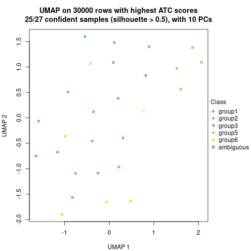</p>

</div>
<div id='tab-node-012-dimension-reduction-6'>
<pre><code class="r">dimension_reduction(res, k = 7, method = &quot;UMAP&quot;)
</code></pre>

<p></p>

</div>
<div id='tab-node-012-dimension-reduction-7'>
<pre><code class="r">dimension_reduction(res, k = 8, method = &quot;UMAP&quot;)
</code></pre>

<p></p>

</div>
</div>


Following heatmap shows how subgroups are split when increasing `k`:

```r
collect_classes(res)
```


If matrix rows can be associated to genes, consider to use `functional_enrichment(res,
...)` to perform function enrichment for the signature genes. See [this vignette](https://jokergoo.github.io/cola_vignettes/functional_enrichment.html) for more detailed explanations.


 

---------------------------------------------------


### Node013


Parent node: [Node01](#Node01).
Child nodes: 
                Node0121-leaf
        ,
                Node0122-leaf
        ,
                Node0123-leaf
        ,
                Node0124-leaf
        ,
                [Node0131](#Node0131)
        ,
                Node0132-leaf
        ,
                Node0221-leaf
        ,
                Node0222-leaf
        ,
                Node0223-leaf
        ,
                [Node0311](#Node0311)
        ,
                Node0312-leaf
        ,
                Node0313-leaf
        ,
                Node0321-leaf
        ,
                Node0322-leaf
        ,
                Node0431-leaf
        ,
                Node0432-leaf
        ,
                Node0433-leaf
        ,
                Node0511-leaf
        ,
                Node0512-leaf
        ,
                Node0513-leaf
        ,
                Node0521-leaf
        ,
                Node0522-leaf
        ,
                Node0523-leaf
        ,
                Node0531-leaf
        ,
                Node0532-leaf
        ,
                Node0533-leaf
        .


The object with results only for a single top-value method and a single partitioning method 
can be extracted as:

```r
res = res_rh["013"]
```

A summary of `res` and all the functions that can be applied to it:

```r
res
```

```
#> A 'ConsensusPartition' object with k = 2, 3, 4, 5, 6, 7, 8.
#>   On a matrix with 30000 rows and 19 columns.
#>   Top rows (1000) are extracted by 'ATC' method.
#>   Subgroups are detected by 'kmeans' method.
#>   Performed in total 350 partitions by row resampling.
#>   Best k for subgroups seems to be 2.
#> 
#> Following methods can be applied to this 'ConsensusPartition' object:
#>  [1] "cola_report"             "collect_classes"         "collect_plots"          
#>  [4] "collect_stats"           "colnames"                "compare_partitions"     
#>  [7] "compare_signatures"      "consensus_heatmap"       "dimension_reduction"    
#> [10] "functional_enrichment"   "get_anno_col"            "get_anno"               
#> [13] "get_classes"             "get_consensus"           "get_matrix"             
#> [16] "get_membership"          "get_param"               "get_signatures"         
#> [19] "get_stats"               "is_best_k"               "is_stable_k"            
#> [22] "membership_heatmap"      "ncol"                    "nrow"                   
#> [25] "plot_ecdf"               "predict_classes"         "rownames"               
#> [28] "select_partition_number" "show"                    "suggest_best_k"         
#> [31] "test_to_known_factors"   "top_rows_heatmap"
```

`collect_plots()` function collects all the plots made from `res` for all `k` (number of subgroups)
into one single page to provide an easy and fast comparison between different `k`.

```r
collect_plots(res)
```


The plots are:

- The first row: a plot of the eCDF (empirical cumulative distribution
  function) curves of the consensus matrix for each `k` and the heatmap of
  predicted classes for each `k`.
- The second row: heatmaps of the consensus matrix for each `k`.
- The third row: heatmaps of the membership matrix for each `k`.
- The fouth row: heatmaps of the signatures for each `k`.

All the plots in panels can be made by individual functions and they are
plotted later in this section.

`select_partition_number()` produces several plots showing different
statistics for choosing "optimized" `k`. There are following statistics:

- eCDF curves of the consensus matrix for each `k`;
- 1-PAC. [The PAC score](https://en.wikipedia.org/wiki/Consensus_clustering#Over-interpretation_potential_of_consensus_clustering)
  measures the proportion of the ambiguous subgrouping.
- Mean silhouette score.
- Concordance. The mean probability of fiting the consensus subgroup labels in all
  partitions.
- Area increased. Denote $A_k$ as the area under the eCDF curve for current
  `k`, the area increased is defined as $A_k - A_{k-1}$.
- Rand index. The percent of pairs of samples that are both in a same cluster
  or both are not in a same cluster in the partition of k and k-1.
- Jaccard index. The ratio of pairs of samples are both in a same cluster in
  the partition of k and k-1 and the pairs of samples are both in a same
  cluster in the partition k or k-1.

The detailed explanations of these statistics can be found in [the _cola_
vignette](https://jokergoo.github.io/cola_vignettes/cola.html#toc_13).

Generally speaking, higher 1-PAC score, higher mean silhouette score or higher
concordance corresponds to better partition. Rand index and Jaccard index
measure how similar the current partition is compared to partition with `k-1`.
If they are too similar, we won't accept `k` is better than `k-1`.

```r
select_partition_number(res)
```


The numeric values for all these statistics can be obtained by `get_stats()`.

```r
get_stats(res)
```

```
#>   k 1-PAC mean_silhouette concordance area_increased  Rand Jaccard
#> 2 2 1.000           1.000       1.000         0.4099 0.591   0.591
#> 3 3 0.731           0.971       0.924         0.4540 0.766   0.604
#> 4 4 0.789           0.695       0.766         0.2035 0.977   0.934
#> 5 5 0.789           0.801       0.818         0.0758 0.836   0.525
#> 6 6 0.731           0.804       0.832         0.0532 0.965   0.818
#> 7 7 0.778           0.455       0.699         0.0468 0.906   0.543
#> 8 8 0.842           0.778       0.876         0.0303 0.930   0.586
```

`suggest_best_k()` suggests the best $k$ based on these statistics. The rules are as follows:

- All $k$ with Jaccard index larger than 0.95 are removed because increasing
  $k$ does not provide enough extra information. If all $k$ are removed, it is
  marked as no subgroup is detected.
- For all $k$ with 1-PAC score larger than 0.9, the maximal $k$ is taken as
  the best $k$, and other $k$ are marked as optional $k$.
- If it does not fit the second rule. The $k$ with the maximal vote of the
  highest 1-PAC score, highest mean silhouette, and highest concordance is
  taken as the best $k$.

```r
suggest_best_k(res)
```

```
#> [1] 2
```


Following is the table of the partitions (You need to click the **show/hide
code output** link to see it). The membership matrix (columns with name `p*`)
is inferred by
[`clue::cl_consensus()`](https://www.rdocumentation.org/link/cl_consensus?package=clue)
function with the `SE` method. Basically the value in the membership matrix
represents the probability to belong to a certain group. The finall subgroup
label for an item is determined with the group with highest probability it
belongs to.

In `get_classes()` function, the entropy is calculated from the membership
matrix and the silhouette score is calculated from the consensus matrix.


<script>
$( function() {
	$( '#tabs-node-013-get-classes' ).tabs();
} );
</script>
<div id='tabs-node-013-get-classes'>
<ul>
<li><a href='#tab-node-013-get-classes-1'>k = 2</a></li>
<li><a href='#tab-node-013-get-classes-2'>k = 3</a></li>
<li><a href='#tab-node-013-get-classes-3'>k = 4</a></li>
<li><a href='#tab-node-013-get-classes-4'>k = 5</a></li>
<li><a href='#tab-node-013-get-classes-5'>k = 6</a></li>
<li><a href='#tab-node-013-get-classes-6'>k = 7</a></li>
<li><a href='#tab-node-013-get-classes-7'>k = 8</a></li>
</ul>

<div id='tab-node-013-get-classes-1'>
<p><a id='tab-node-013-get-classes-1-a' style='color:#0366d6' href='#'>show/hide code output</a></p>
<pre><code class="r">cbind(get_classes(res, k = 2), get_membership(res, k = 2))
</code></pre>

<pre><code>#&gt;                 class entropy silhouette p1 p2
#&gt; TCGA.DW.5561.01     1       0          1  1  0
#&gt; TCGA.SX.A7SQ.01     1       0          1  1  0
#&gt; TCGA.B1.A654.01     2       0          1  0  1
#&gt; TCGA.G7.A4TM.01     1       0          1  1  0
#&gt; TCGA.B9.A5W7.01     1       0          1  1  0
#&gt; TCGA.SX.A7SU.01     1       0          1  1  0
#&gt; TCGA.4A.A93W.01     2       0          1  0  1
#&gt; TCGA.G7.A8LE.01     1       0          1  1  0
#&gt; TCGA.B1.A47N.01     1       0          1  1  0
#&gt; TCGA.UZ.A9PP.01     1       0          1  1  0
#&gt; TCGA.A4.A5DU.01     2       0          1  0  1
#&gt; TCGA.DW.7839.01     2       0          1  0  1
#&gt; TCGA.O9.A75Z.01     1       0          1  1  0
#&gt; TCGA.DW.7842.01     1       0          1  1  0
#&gt; TCGA.DW.7836.01     1       0          1  1  0
#&gt; TCGA.A4.7734.01     2       0          1  0  1
#&gt; TCGA.UZ.A9PJ.01     1       0          1  1  0
#&gt; TCGA.A4.7732.01     1       0          1  1  0
#&gt; TCGA.2Z.A9J7.01     1       0          1  1  0
</code></pre>

<script>
$('#tab-node-013-get-classes-1-a').parent().next().next().hide();
$('#tab-node-013-get-classes-1-a').click(function(){
  $('#tab-node-013-get-classes-1-a').parent().next().next().toggle();
  return(false);
});
</script>
</div>

<div id='tab-node-013-get-classes-2'>
<p><a id='tab-node-013-get-classes-2-a' style='color:#0366d6' href='#'>show/hide code output</a></p>
<pre><code class="r">cbind(get_classes(res, k = 3), get_membership(res, k = 3))
</code></pre>

<pre><code>#&gt;                 class entropy silhouette   p1   p2   p3
#&gt; TCGA.DW.5561.01     3   0.502      1.000 0.24 0.00 0.76
#&gt; TCGA.SX.A7SQ.01     1   0.000      1.000 1.00 0.00 0.00
#&gt; TCGA.B1.A654.01     2   0.502      0.860 0.00 0.76 0.24
#&gt; TCGA.G7.A4TM.01     1   0.000      1.000 1.00 0.00 0.00
#&gt; TCGA.B9.A5W7.01     1   0.000      1.000 1.00 0.00 0.00
#&gt; TCGA.SX.A7SU.01     1   0.000      1.000 1.00 0.00 0.00
#&gt; TCGA.4A.A93W.01     2   0.000      0.909 0.00 1.00 0.00
#&gt; TCGA.G7.A8LE.01     3   0.502      1.000 0.24 0.00 0.76
#&gt; TCGA.B1.A47N.01     3   0.502      1.000 0.24 0.00 0.76
#&gt; TCGA.UZ.A9PP.01     1   0.000      1.000 1.00 0.00 0.00
#&gt; TCGA.A4.A5DU.01     2   0.000      0.909 0.00 1.00 0.00
#&gt; TCGA.DW.7839.01     2   0.502      0.860 0.00 0.76 0.24
#&gt; TCGA.O9.A75Z.01     1   0.000      1.000 1.00 0.00 0.00
#&gt; TCGA.DW.7842.01     1   0.000      1.000 1.00 0.00 0.00
#&gt; TCGA.DW.7836.01     1   0.000      1.000 1.00 0.00 0.00
#&gt; TCGA.A4.7734.01     2   0.000      0.909 0.00 1.00 0.00
#&gt; TCGA.UZ.A9PJ.01     1   0.000      1.000 1.00 0.00 0.00
#&gt; TCGA.A4.7732.01     1   0.000      1.000 1.00 0.00 0.00
#&gt; TCGA.2Z.A9J7.01     3   0.502      1.000 0.24 0.00 0.76
</code></pre>

<script>
$('#tab-node-013-get-classes-2-a').parent().next().next().hide();
$('#tab-node-013-get-classes-2-a').click(function(){
  $('#tab-node-013-get-classes-2-a').parent().next().next().toggle();
  return(false);
});
</script>
</div>

<div id='tab-node-013-get-classes-3'>
<p><a id='tab-node-013-get-classes-3-a' style='color:#0366d6' href='#'>show/hide code output</a></p>
<pre><code class="r">cbind(get_classes(res, k = 4), get_membership(res, k = 4))
</code></pre>

<pre><code>#&gt;                 class entropy silhouette   p1   p2   p3   p4
#&gt; TCGA.DW.5561.01     4  0.5535      1.000 0.02 0.00 0.42 0.56
#&gt; TCGA.SX.A7SQ.01     1  0.4907      0.758 0.58 0.00 0.00 0.42
#&gt; TCGA.B1.A654.01     2  0.4277      0.819 0.00 0.72 0.28 0.00
#&gt; TCGA.G7.A4TM.01     1  0.0707      0.752 0.98 0.00 0.00 0.02
#&gt; TCGA.B9.A5W7.01     1  0.4907      0.758 0.58 0.00 0.00 0.42
#&gt; TCGA.SX.A7SU.01     1  0.4907      0.758 0.58 0.00 0.00 0.42
#&gt; TCGA.4A.A93W.01     2  0.0000      0.880 0.00 1.00 0.00 0.00
#&gt; TCGA.G7.A8LE.01     3  0.5535     -0.339 0.02 0.00 0.56 0.42
#&gt; TCGA.B1.A47N.01     4  0.5535      1.000 0.02 0.00 0.42 0.56
#&gt; TCGA.UZ.A9PP.01     1  0.4907      0.758 0.58 0.00 0.00 0.42
#&gt; TCGA.A4.A5DU.01     2  0.0707      0.878 0.00 0.98 0.00 0.02
#&gt; TCGA.DW.7839.01     2  0.4277      0.819 0.00 0.72 0.28 0.00
#&gt; TCGA.O9.A75Z.01     1  0.0707      0.739 0.98 0.00 0.02 0.00
#&gt; TCGA.DW.7842.01     1  0.0707      0.739 0.98 0.00 0.02 0.00
#&gt; TCGA.DW.7836.01     1  0.0707      0.739 0.98 0.00 0.02 0.00
#&gt; TCGA.A4.7734.01     2  0.0000      0.880 0.00 1.00 0.00 0.00
#&gt; TCGA.UZ.A9PJ.01     1  0.4907      0.758 0.58 0.00 0.00 0.42
#&gt; TCGA.A4.7732.01     1  0.0707      0.752 0.98 0.00 0.00 0.02
#&gt; TCGA.2Z.A9J7.01     3  0.5487     -0.250 0.02 0.00 0.58 0.40
</code></pre>

<script>
$('#tab-node-013-get-classes-3-a').parent().next().next().hide();
$('#tab-node-013-get-classes-3-a').click(function(){
  $('#tab-node-013-get-classes-3-a').parent().next().next().toggle();
  return(false);
});
</script>
</div>

<div id='tab-node-013-get-classes-4'>
<p><a id='tab-node-013-get-classes-4-a' style='color:#0366d6' href='#'>show/hide code output</a></p>
<pre><code class="r">cbind(get_classes(res, k = 5), get_membership(res, k = 5))
</code></pre>

<pre><code>#&gt;                 class entropy silhouette   p1   p2   p3   p4   p5
#&gt; TCGA.DW.5561.01     4   0.000      0.717 0.00 0.00 0.00 1.00 0.00
#&gt; TCGA.SX.A7SQ.01     1   0.389      0.987 0.68 0.00 0.00 0.00 0.32
#&gt; TCGA.B1.A654.01     2   0.000      0.689 0.00 1.00 0.00 0.00 0.00
#&gt; TCGA.G7.A4TM.01     5   0.201      0.907 0.06 0.00 0.02 0.00 0.92
#&gt; TCGA.B9.A5W7.01     1   0.446      0.980 0.66 0.00 0.02 0.00 0.32
#&gt; TCGA.SX.A7SU.01     1   0.389      0.987 0.68 0.00 0.00 0.00 0.32
#&gt; TCGA.4A.A93W.01     2   0.596      0.785 0.26 0.58 0.16 0.00 0.00
#&gt; TCGA.G7.A8LE.01     3   0.430      0.000 0.00 0.00 0.52 0.48 0.00
#&gt; TCGA.B1.A47N.01     4   0.000      0.717 0.00 0.00 0.00 1.00 0.00
#&gt; TCGA.UZ.A9PP.01     1   0.446      0.980 0.66 0.00 0.02 0.00 0.32
#&gt; TCGA.A4.A5DU.01     2   0.603      0.781 0.20 0.58 0.22 0.00 0.00
#&gt; TCGA.DW.7839.01     2   0.000      0.689 0.00 1.00 0.00 0.00 0.00
#&gt; TCGA.O9.A75Z.01     5   0.000      0.942 0.00 0.00 0.00 0.00 1.00
#&gt; TCGA.DW.7842.01     5   0.000      0.942 0.00 0.00 0.00 0.00 1.00
#&gt; TCGA.DW.7836.01     5   0.000      0.942 0.00 0.00 0.00 0.00 1.00
#&gt; TCGA.A4.7734.01     2   0.585      0.790 0.24 0.60 0.16 0.00 0.00
#&gt; TCGA.UZ.A9PJ.01     1   0.389      0.987 0.68 0.00 0.00 0.00 0.32
#&gt; TCGA.A4.7732.01     5   0.201      0.907 0.06 0.00 0.02 0.00 0.92
#&gt; TCGA.2Z.A9J7.01     4   0.473      0.488 0.06 0.00 0.24 0.70 0.00
</code></pre>

<script>
$('#tab-node-013-get-classes-4-a').parent().next().next().hide();
$('#tab-node-013-get-classes-4-a').click(function(){
  $('#tab-node-013-get-classes-4-a').parent().next().next().toggle();
  return(false);
});
</script>
</div>

<div id='tab-node-013-get-classes-5'>
<p><a id='tab-node-013-get-classes-5-a' style='color:#0366d6' href='#'>show/hide code output</a></p>
<pre><code class="r">cbind(get_classes(res, k = 6), get_membership(res, k = 6))
</code></pre>

<pre><code>#&gt;                 class entropy silhouette   p1   p2   p3   p4   p5   p6
#&gt; TCGA.DW.5561.01     4   0.294      0.730 0.00 0.00 0.22 0.78 0.00 0.00
#&gt; TCGA.SX.A7SQ.01     1   0.263      0.988 0.82 0.00 0.00 0.00 0.18 0.00
#&gt; TCGA.B1.A654.01     6   0.000      1.000 0.00 0.00 0.00 0.00 0.00 1.00
#&gt; TCGA.G7.A4TM.01     5   0.235      0.791 0.10 0.02 0.00 0.00 0.88 0.00
#&gt; TCGA.B9.A5W7.01     1   0.316      0.982 0.80 0.02 0.00 0.00 0.18 0.00
#&gt; TCGA.SX.A7SU.01     1   0.263      0.988 0.82 0.00 0.00 0.00 0.18 0.00
#&gt; TCGA.4A.A93W.01     2   0.358      0.863 0.00 0.66 0.00 0.00 0.00 0.34
#&gt; TCGA.G7.A8LE.01     3   0.181      0.000 0.00 0.00 0.90 0.10 0.00 0.00
#&gt; TCGA.B1.A47N.01     4   0.294      0.730 0.00 0.00 0.22 0.78 0.00 0.00
#&gt; TCGA.UZ.A9PP.01     1   0.316      0.982 0.80 0.02 0.00 0.00 0.18 0.00
#&gt; TCGA.A4.A5DU.01     2   0.677      0.707 0.12 0.44 0.10 0.00 0.00 0.34
#&gt; TCGA.DW.7839.01     6   0.000      1.000 0.00 0.00 0.00 0.00 0.00 1.00
#&gt; TCGA.O9.A75Z.01     5   0.279      0.789 0.00 0.20 0.00 0.00 0.80 0.00
#&gt; TCGA.DW.7842.01     5   0.000      0.819 0.00 0.00 0.00 0.00 1.00 0.00
#&gt; TCGA.DW.7836.01     5   0.294      0.779 0.00 0.22 0.00 0.00 0.78 0.00
#&gt; TCGA.A4.7734.01     2   0.358      0.863 0.00 0.66 0.00 0.00 0.00 0.34
#&gt; TCGA.UZ.A9PJ.01     1   0.263      0.988 0.82 0.00 0.00 0.00 0.18 0.00
#&gt; TCGA.A4.7732.01     5   0.235      0.791 0.10 0.02 0.00 0.00 0.88 0.00
#&gt; TCGA.2Z.A9J7.01     4   0.304      0.483 0.06 0.10 0.00 0.84 0.00 0.00
</code></pre>

<script>
$('#tab-node-013-get-classes-5-a').parent().next().next().hide();
$('#tab-node-013-get-classes-5-a').click(function(){
  $('#tab-node-013-get-classes-5-a').parent().next().next().toggle();
  return(false);
});
</script>
</div>

<div id='tab-node-013-get-classes-6'>
<p><a id='tab-node-013-get-classes-6-a' style='color:#0366d6' href='#'>show/hide code output</a></p>
<pre><code class="r">cbind(get_classes(res, k = 7), get_membership(res, k = 7))
</code></pre>

<pre><code>#&gt;                 class entropy silhouette   p1   p2   p3   p4   p5   p6   p7
#&gt; TCGA.DW.5561.01     4  0.5232      0.689 0.00 0.00 0.16 0.46 0.38 0.00 0.00
#&gt; TCGA.SX.A7SQ.01     1  0.0504      0.934 0.98 0.00 0.00 0.00 0.02 0.00 0.00
#&gt; TCGA.B1.A654.01     6  0.0000      1.000 0.00 0.00 0.00 0.00 0.00 1.00 0.00
#&gt; TCGA.G7.A4TM.01     7  0.4787      0.249 0.12 0.00 0.00 0.00 0.30 0.00 0.58
#&gt; TCGA.B9.A5W7.01     1  0.2016      0.909 0.90 0.00 0.00 0.00 0.04 0.00 0.06
#&gt; TCGA.SX.A7SU.01     1  0.0000      0.935 1.00 0.00 0.00 0.00 0.00 0.00 0.00
#&gt; TCGA.4A.A93W.01     2  0.5631     -0.362 0.00 0.36 0.00 0.00 0.00 0.30 0.34
#&gt; TCGA.G7.A8LE.01     3  0.0000      0.000 0.00 0.00 1.00 0.00 0.00 0.00 0.00
#&gt; TCGA.B1.A47N.01     4  0.5232      0.689 0.00 0.00 0.16 0.46 0.38 0.00 0.00
#&gt; TCGA.UZ.A9PP.01     1  0.2313      0.900 0.88 0.00 0.00 0.00 0.06 0.00 0.06
#&gt; TCGA.A4.A5DU.01     7  0.6815     -0.268 0.00 0.14 0.00 0.00 0.20 0.30 0.36
#&gt; TCGA.DW.7839.01     6  0.0000      1.000 0.00 0.00 0.00 0.00 0.00 1.00 0.00
#&gt; TCGA.O9.A75Z.01     2  0.4418      0.274 0.08 0.62 0.00 0.00 0.00 0.00 0.30
#&gt; TCGA.DW.7842.01     7  0.5825      0.150 0.08 0.10 0.00 0.00 0.30 0.00 0.52
#&gt; TCGA.DW.7836.01     2  0.5281      0.287 0.08 0.60 0.00 0.00 0.06 0.00 0.26
#&gt; TCGA.A4.7734.01     7  0.5631     -0.275 0.00 0.30 0.00 0.00 0.00 0.34 0.36
#&gt; TCGA.UZ.A9PJ.01     1  0.0504      0.934 0.98 0.00 0.00 0.00 0.02 0.00 0.00
#&gt; TCGA.A4.7732.01     7  0.4787      0.249 0.12 0.00 0.00 0.00 0.30 0.00 0.58
#&gt; TCGA.2Z.A9J7.01     4  0.0000      0.357 0.00 0.00 0.00 1.00 0.00 0.00 0.00
</code></pre>

<script>
$('#tab-node-013-get-classes-6-a').parent().next().next().hide();
$('#tab-node-013-get-classes-6-a').click(function(){
  $('#tab-node-013-get-classes-6-a').parent().next().next().toggle();
  return(false);
});
</script>
</div>

<div id='tab-node-013-get-classes-7'>
<p><a id='tab-node-013-get-classes-7-a' style='color:#0366d6' href='#'>show/hide code output</a></p>
<pre><code class="r">cbind(get_classes(res, k = 8), get_membership(res, k = 8))
</code></pre>

<pre><code>#&gt;                 class entropy silhouette   p1   p2   p3   p4   p5   p6   p7   p8
#&gt; TCGA.DW.5561.01     4  0.1275      0.934 0.00 0.02 0.00 0.94 0.00 0.00 0.00 0.04
#&gt; TCGA.SX.A7SQ.01     1  0.1275      0.939 0.94 0.00 0.00 0.00 0.04 0.00 0.00 0.02
#&gt; TCGA.B1.A654.01     6  0.0000      0.973 0.00 0.00 0.00 0.00 0.00 1.00 0.00 0.00
#&gt; TCGA.G7.A4TM.01     7  0.1091      0.871 0.06 0.00 0.00 0.00 0.00 0.00 0.94 0.00
#&gt; TCGA.B9.A5W7.01     1  0.0808      0.940 0.96 0.00 0.00 0.00 0.00 0.00 0.04 0.00
#&gt; TCGA.SX.A7SU.01     1  0.0000      0.946 1.00 0.00 0.00 0.00 0.00 0.00 0.00 0.00
#&gt; TCGA.4A.A93W.01     8  0.3015      0.759 0.00 0.00 0.00 0.00 0.00 0.32 0.00 0.68
#&gt; TCGA.G7.A8LE.01     3  0.1091      0.000 0.00 0.00 0.94 0.06 0.00 0.00 0.00 0.00
#&gt; TCGA.B1.A47N.01     4  0.0000      0.934 0.00 0.00 0.00 1.00 0.00 0.00 0.00 0.00
#&gt; TCGA.UZ.A9PP.01     1  0.1275      0.931 0.94 0.00 0.00 0.00 0.02 0.00 0.04 0.00
#&gt; TCGA.A4.A5DU.01     8  0.7175      0.591 0.00 0.06 0.06 0.00 0.16 0.32 0.04 0.36
#&gt; TCGA.DW.7839.01     6  0.0471      0.973 0.00 0.02 0.00 0.00 0.00 0.98 0.00 0.00
#&gt; TCGA.O9.A75Z.01     2  0.3879      0.860 0.00 0.74 0.00 0.00 0.02 0.00 0.14 0.10
#&gt; TCGA.DW.7842.01     7  0.3385      0.711 0.00 0.08 0.00 0.00 0.00 0.00 0.76 0.16
#&gt; TCGA.DW.7836.01     2  0.1563      0.859 0.00 0.90 0.00 0.00 0.00 0.00 0.10 0.00
#&gt; TCGA.A4.7734.01     8  0.3618      0.747 0.00 0.00 0.00 0.00 0.00 0.38 0.02 0.60
#&gt; TCGA.UZ.A9PJ.01     1  0.1275      0.939 0.94 0.00 0.00 0.00 0.04 0.00 0.00 0.02
#&gt; TCGA.A4.7732.01     7  0.1091      0.871 0.06 0.00 0.00 0.00 0.00 0.00 0.94 0.00
#&gt; TCGA.2Z.A9J7.01     5  0.2650      0.000 0.00 0.00 0.00 0.24 0.76 0.00 0.00 0.00
</code></pre>

<script>
$('#tab-node-013-get-classes-7-a').parent().next().next().hide();
$('#tab-node-013-get-classes-7-a').click(function(){
  $('#tab-node-013-get-classes-7-a').parent().next().next().toggle();
  return(false);
});
</script>
</div>
</div>

Heatmaps for the consensus matrix. It visualizes the probability of two
samples to be in a same group.


<script>
$( function() {
	$( '#tabs-node-013-consensus-heatmap' ).tabs();
} );
</script>
<div id='tabs-node-013-consensus-heatmap'>
<ul>
<li><a href='#tab-node-013-consensus-heatmap-1'>k = 2</a></li>
<li><a href='#tab-node-013-consensus-heatmap-2'>k = 3</a></li>
<li><a href='#tab-node-013-consensus-heatmap-3'>k = 4</a></li>
<li><a href='#tab-node-013-consensus-heatmap-4'>k = 5</a></li>
<li><a href='#tab-node-013-consensus-heatmap-5'>k = 6</a></li>
<li><a href='#tab-node-013-consensus-heatmap-6'>k = 7</a></li>
<li><a href='#tab-node-013-consensus-heatmap-7'>k = 8</a></li>
</ul>
<div id='tab-node-013-consensus-heatmap-1'>
<pre><code class="r">consensus_heatmap(res, k = 2)
</code></pre>

<p></p>

</div>
<div id='tab-node-013-consensus-heatmap-2'>
<pre><code class="r">consensus_heatmap(res, k = 3)
</code></pre>

<p></p>

</div>
<div id='tab-node-013-consensus-heatmap-3'>
<pre><code class="r">consensus_heatmap(res, k = 4)
</code></pre>

<p></p>

</div>
<div id='tab-node-013-consensus-heatmap-4'>
<pre><code class="r">consensus_heatmap(res, k = 5)
</code></pre>

<p></p>

</div>
<div id='tab-node-013-consensus-heatmap-5'>
<pre><code class="r">consensus_heatmap(res, k = 6)
</code></pre>

<p></p>

</div>
<div id='tab-node-013-consensus-heatmap-6'>
<pre><code class="r">consensus_heatmap(res, k = 7)
</code></pre>

<p></p>

</div>
<div id='tab-node-013-consensus-heatmap-7'>
<pre><code class="r">consensus_heatmap(res, k = 8)
</code></pre>

<p></p>

</div>
</div>

Heatmaps for the membership of samples in all partitions to see how consistent they are:


<script>
$( function() {
	$( '#tabs-node-013-membership-heatmap' ).tabs();
} );
</script>
<div id='tabs-node-013-membership-heatmap'>
<ul>
<li><a href='#tab-node-013-membership-heatmap-1'>k = 2</a></li>
<li><a href='#tab-node-013-membership-heatmap-2'>k = 3</a></li>
<li><a href='#tab-node-013-membership-heatmap-3'>k = 4</a></li>
<li><a href='#tab-node-013-membership-heatmap-4'>k = 5</a></li>
<li><a href='#tab-node-013-membership-heatmap-5'>k = 6</a></li>
<li><a href='#tab-node-013-membership-heatmap-6'>k = 7</a></li>
<li><a href='#tab-node-013-membership-heatmap-7'>k = 8</a></li>
</ul>
<div id='tab-node-013-membership-heatmap-1'>
<pre><code class="r">membership_heatmap(res, k = 2)
</code></pre>

<p></p>

</div>
<div id='tab-node-013-membership-heatmap-2'>
<pre><code class="r">membership_heatmap(res, k = 3)
</code></pre>

<p></p>

</div>
<div id='tab-node-013-membership-heatmap-3'>
<pre><code class="r">membership_heatmap(res, k = 4)
</code></pre>

<p></p>

</div>
<div id='tab-node-013-membership-heatmap-4'>
<pre><code class="r">membership_heatmap(res, k = 5)
</code></pre>

<p></p>

</div>
<div id='tab-node-013-membership-heatmap-5'>
<pre><code class="r">membership_heatmap(res, k = 6)
</code></pre>

<p></p>

</div>
<div id='tab-node-013-membership-heatmap-6'>
<pre><code class="r">membership_heatmap(res, k = 7)
</code></pre>

<p></p>

</div>
<div id='tab-node-013-membership-heatmap-7'>
<pre><code class="r">membership_heatmap(res, k = 8)
</code></pre>

<p></p>

</div>
</div>

As soon as the classes for columns are determined, the signatures
that are significantly different between subgroups can be looked for. 
Following are the heatmaps for signatures.


<script>
$( function() {
	$( '#tabs-node-013-get-signatures' ).tabs();
} );
</script>
<div id='tabs-node-013-get-signatures'>
<ul>
<li><a href='#tab-node-013-get-signatures-1'>k = 2</a></li>
<li><a href='#tab-node-013-get-signatures-2'>k = 3</a></li>
<li><a href='#tab-node-013-get-signatures-3'>k = 4</a></li>
<li><a href='#tab-node-013-get-signatures-4'>k = 5</a></li>
<li><a href='#tab-node-013-get-signatures-5'>k = 6</a></li>
<li><a href='#tab-node-013-get-signatures-6'>k = 7</a></li>
<li><a href='#tab-node-013-get-signatures-7'>k = 8</a></li>
</ul>
<div id='tab-node-013-get-signatures-1'>
<pre><code class="r">get_signatures(res, k = 2)
</code></pre>

<p></p>

</div>
<div id='tab-node-013-get-signatures-2'>
<pre><code class="r">get_signatures(res, k = 3)
</code></pre>

<p></p>

</div>
<div id='tab-node-013-get-signatures-3'>
<pre><code class="r">get_signatures(res, k = 4)
</code></pre>

<p></p>

</div>
<div id='tab-node-013-get-signatures-4'>
<pre><code class="r">get_signatures(res, k = 5)
</code></pre>

<p></p>

</div>
<div id='tab-node-013-get-signatures-5'>
<pre><code class="r">get_signatures(res, k = 6)
</code></pre>

<p></p>

</div>
<div id='tab-node-013-get-signatures-6'>
<pre><code class="r">get_signatures(res, k = 7)
</code></pre>

<p></p>

</div>
<div id='tab-node-013-get-signatures-7'>
<pre><code class="r">get_signatures(res, k = 8)
</code></pre>

<p></p>

</div>
</div>


Compare the overlap of signatures from different k:

```r
compare_signatures(res)
```


`get_signature()` returns a data frame invisibly. To get the list of signatures, the function
call should be assigned to a variable explicitly. In following code, if `plot` argument is set
to `FALSE`, no heatmap is plotted while only the differential analysis is performed.

```r
# code only for demonstration
tb = get_signature(res, k = ..., plot = FALSE)
```

An example of the output of `tb` is:

```
#>   which_row         fdr    mean_1    mean_2 scaled_mean_1 scaled_mean_2 km
#> 1        38 0.042760348  8.373488  9.131774    -0.5533452     0.5164555  1
#> 2        40 0.018707592  7.106213  8.469186    -0.6173731     0.5762149  1
#> 3        55 0.019134737 10.221463 11.207825    -0.6159697     0.5749050  1
#> 4        59 0.006059896  5.921854  7.869574    -0.6899429     0.6439467  1
#> 5        60 0.018055526  8.928898 10.211722    -0.6204761     0.5791110  1
#> 6        98 0.009384629 15.714769 14.887706     0.6635654    -0.6193277  2
...
```

The columns in `tb` are:

1. `which_row`: row indices corresponding to the input matrix.
2. `fdr`: FDR for the differential test. 
3. `mean_x`: The mean value in group x.
4. `scaled_mean_x`: The mean value in group x after rows are scaled.
5. `km`: Row groups if k-means clustering is applied to rows (which is done by automatically selecting number of clusters).

If there are too many signatures, `top_signatures = ...` can be set to only show the 
signatures with the highest FDRs:

```r
# code only for demonstration
# e.g. to show the top 500 most significant rows
tb = get_signature(res, k = ..., top_signatures = 500)
```

If the signatures are defined as these which are uniquely high in current group, `diff_method` argument
can be set to `"uniquely_high_in_one_group"`:

```r
# code only for demonstration
tb = get_signature(res, k = ..., diff_method = "uniquely_high_in_one_group")
```


UMAP plot which shows how samples are separated.


<script>
$( function() {
	$( '#tabs-node-013-dimension-reduction' ).tabs();
} );
</script>
<div id='tabs-node-013-dimension-reduction'>
<ul>
<li><a href='#tab-node-013-dimension-reduction-1'>k = 2</a></li>
<li><a href='#tab-node-013-dimension-reduction-2'>k = 3</a></li>
<li><a href='#tab-node-013-dimension-reduction-3'>k = 4</a></li>
<li><a href='#tab-node-013-dimension-reduction-4'>k = 5</a></li>
<li><a href='#tab-node-013-dimension-reduction-5'>k = 6</a></li>
<li><a href='#tab-node-013-dimension-reduction-6'>k = 7</a></li>
<li><a href='#tab-node-013-dimension-reduction-7'>k = 8</a></li>
</ul>
<div id='tab-node-013-dimension-reduction-1'>
<pre><code class="r">dimension_reduction(res, k = 2, method = &quot;UMAP&quot;)
</code></pre>

<p></p>

</div>
<div id='tab-node-013-dimension-reduction-2'>
<pre><code class="r">dimension_reduction(res, k = 3, method = &quot;UMAP&quot;)
</code></pre>

<p></p>

</div>
<div id='tab-node-013-dimension-reduction-3'>
<pre><code class="r">dimension_reduction(res, k = 4, method = &quot;UMAP&quot;)
</code></pre>

<p></p>

</div>
<div id='tab-node-013-dimension-reduction-4'>
<pre><code class="r">dimension_reduction(res, k = 5, method = &quot;UMAP&quot;)
</code></pre>

<p></p>

</div>
<div id='tab-node-013-dimension-reduction-5'>
<pre><code class="r">dimension_reduction(res, k = 6, method = &quot;UMAP&quot;)
</code></pre>

<p></p>

</div>
<div id='tab-node-013-dimension-reduction-6'>
<pre><code class="r">dimension_reduction(res, k = 7, method = &quot;UMAP&quot;)
</code></pre>

<p></p>

</div>
<div id='tab-node-013-dimension-reduction-7'>
<pre><code class="r">dimension_reduction(res, k = 8, method = &quot;UMAP&quot;)
</code></pre>

<p>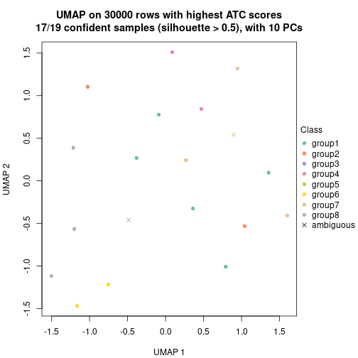</p>

</div>
</div>


Following heatmap shows how subgroups are split when increasing `k`:

```r
collect_classes(res)
```


If matrix rows can be associated to genes, consider to use `functional_enrichment(res,
...)` to perform function enrichment for the signature genes. See [this vignette](https://jokergoo.github.io/cola_vignettes/functional_enrichment.html) for more detailed explanations.


 

---------------------------------------------------


### Node0131


Parent node: [Node013](#Node013).
Child nodes: 
                Node01311-leaf
        ,
                Node01312-leaf
        ,
                Node03111-leaf
        ,
                Node03112-leaf
        ,
                Node03113-leaf
        .


The object with results only for a single top-value method and a single partitioning method 
can be extracted as:

```r
res = res_rh["0131"]
```

A summary of `res` and all the functions that can be applied to it:

```r
res
```

```
#> A 'ConsensusPartition' object with k = 2, 3, 4, 5, 6, 7, 8.
#>   On a matrix with 30000 rows and 14 columns.
#>   Top rows (1000) are extracted by 'ATC' method.
#>   Subgroups are detected by 'kmeans' method.
#>   Performed in total 350 partitions by row resampling.
#>   Best k for subgroups seems to be 8.
#> 
#> Following methods can be applied to this 'ConsensusPartition' object:
#>  [1] "cola_report"             "collect_classes"         "collect_plots"          
#>  [4] "collect_stats"           "colnames"                "compare_partitions"     
#>  [7] "compare_signatures"      "consensus_heatmap"       "dimension_reduction"    
#> [10] "functional_enrichment"   "get_anno_col"            "get_anno"               
#> [13] "get_classes"             "get_consensus"           "get_matrix"             
#> [16] "get_membership"          "get_param"               "get_signatures"         
#> [19] "get_stats"               "is_best_k"               "is_stable_k"            
#> [22] "membership_heatmap"      "ncol"                    "nrow"                   
#> [25] "plot_ecdf"               "predict_classes"         "rownames"               
#> [28] "select_partition_number" "show"                    "suggest_best_k"         
#> [31] "test_to_known_factors"   "top_rows_heatmap"
```

`collect_plots()` function collects all the plots made from `res` for all `k` (number of subgroups)
into one single page to provide an easy and fast comparison between different `k`.

```r
collect_plots(res)
```


The plots are:

- The first row: a plot of the eCDF (empirical cumulative distribution
  function) curves of the consensus matrix for each `k` and the heatmap of
  predicted classes for each `k`.
- The second row: heatmaps of the consensus matrix for each `k`.
- The third row: heatmaps of the membership matrix for each `k`.
- The fouth row: heatmaps of the signatures for each `k`.

All the plots in panels can be made by individual functions and they are
plotted later in this section.

`select_partition_number()` produces several plots showing different
statistics for choosing "optimized" `k`. There are following statistics:

- eCDF curves of the consensus matrix for each `k`;
- 1-PAC. [The PAC score](https://en.wikipedia.org/wiki/Consensus_clustering#Over-interpretation_potential_of_consensus_clustering)
  measures the proportion of the ambiguous subgrouping.
- Mean silhouette score.
- Concordance. The mean probability of fiting the consensus subgroup labels in all
  partitions.
- Area increased. Denote $A_k$ as the area under the eCDF curve for current
  `k`, the area increased is defined as $A_k - A_{k-1}$.
- Rand index. The percent of pairs of samples that are both in a same cluster
  or both are not in a same cluster in the partition of k and k-1.
- Jaccard index. The ratio of pairs of samples are both in a same cluster in
  the partition of k and k-1 and the pairs of samples are both in a same
  cluster in the partition k or k-1.

The detailed explanations of these statistics can be found in [the _cola_
vignette](https://jokergoo.github.io/cola_vignettes/cola.html#toc_13).

Generally speaking, higher 1-PAC score, higher mean silhouette score or higher
concordance corresponds to better partition. Rand index and Jaccard index
measure how similar the current partition is compared to partition with `k-1`.
If they are too similar, we won't accept `k` is better than `k-1`.

```r
select_partition_number(res)
```


The numeric values for all these statistics can be obtained by `get_stats()`.

```r
get_stats(res)
```

```
#>   k 1-PAC mean_silhouette concordance area_increased  Rand Jaccard
#> 2 2 1.000           1.000       1.000         0.2645 0.736   0.736
#> 3 3 0.923           0.867       0.959         0.5273 0.857   0.809
#> 4 4 0.615           0.796       0.924         0.5457 0.593   0.403
#> 5 5 0.692           0.756       0.971         0.1411 0.934   0.806
#> 6 6 1.000           0.705       0.991         0.0926 0.945   0.800
#> 7 7 0.912           0.626       0.983         0.0590 0.956   0.800
#> 8 8 1.000           0.553       0.980         0.0514 0.956   0.750
```

`suggest_best_k()` suggests the best $k$ based on these statistics. The rules are as follows:

- All $k$ with Jaccard index larger than 0.95 are removed because increasing
  $k$ does not provide enough extra information. If all $k$ are removed, it is
  marked as no subgroup is detected.
- For all $k$ with 1-PAC score larger than 0.9, the maximal $k$ is taken as
  the best $k$, and other $k$ are marked as optional $k$.
- If it does not fit the second rule. The $k$ with the maximal vote of the
  highest 1-PAC score, highest mean silhouette, and highest concordance is
  taken as the best $k$.

```r
suggest_best_k(res)
```

```
#> [1] 8
#> attr(,"optional")
#> [1] 2 3 6 7
```

There is also optional best $k$ = 2 3 6 7 that is worth to check.

Following is the table of the partitions (You need to click the **show/hide
code output** link to see it). The membership matrix (columns with name `p*`)
is inferred by
[`clue::cl_consensus()`](https://www.rdocumentation.org/link/cl_consensus?package=clue)
function with the `SE` method. Basically the value in the membership matrix
represents the probability to belong to a certain group. The finall subgroup
label for an item is determined with the group with highest probability it
belongs to.

In `get_classes()` function, the entropy is calculated from the membership
matrix and the silhouette score is calculated from the consensus matrix.


<script>
$( function() {
	$( '#tabs-node-0131-get-classes' ).tabs();
} );
</script>
<div id='tabs-node-0131-get-classes'>
<ul>
<li><a href='#tab-node-0131-get-classes-1'>k = 2</a></li>
<li><a href='#tab-node-0131-get-classes-2'>k = 3</a></li>
<li><a href='#tab-node-0131-get-classes-3'>k = 4</a></li>
<li><a href='#tab-node-0131-get-classes-4'>k = 5</a></li>
<li><a href='#tab-node-0131-get-classes-5'>k = 6</a></li>
<li><a href='#tab-node-0131-get-classes-6'>k = 7</a></li>
<li><a href='#tab-node-0131-get-classes-7'>k = 8</a></li>
</ul>

<div id='tab-node-0131-get-classes-1'>
<p><a id='tab-node-0131-get-classes-1-a' style='color:#0366d6' href='#'>show/hide code output</a></p>
<pre><code class="r">cbind(get_classes(res, k = 2), get_membership(res, k = 2))
</code></pre>

<pre><code>#&gt;                 class entropy silhouette p1 p2
#&gt; TCGA.DW.5561.01     2       0          1  0  1
#&gt; TCGA.SX.A7SQ.01     1       0          1  1  0
#&gt; TCGA.G7.A4TM.01     1       0          1  1  0
#&gt; TCGA.B9.A5W7.01     1       0          1  1  0
#&gt; TCGA.SX.A7SU.01     1       0          1  1  0
#&gt; TCGA.G7.A8LE.01     1       0          1  1  0
#&gt; TCGA.B1.A47N.01     1       0          1  1  0
#&gt; TCGA.UZ.A9PP.01     1       0          1  1  0
#&gt; TCGA.O9.A75Z.01     1       0          1  1  0
#&gt; TCGA.DW.7842.01     1       0          1  1  0
#&gt; TCGA.DW.7836.01     1       0          1  1  0
#&gt; TCGA.UZ.A9PJ.01     1       0          1  1  0
#&gt; TCGA.A4.7732.01     1       0          1  1  0
#&gt; TCGA.2Z.A9J7.01     2       0          1  0  1
</code></pre>

<script>
$('#tab-node-0131-get-classes-1-a').parent().next().next().hide();
$('#tab-node-0131-get-classes-1-a').click(function(){
  $('#tab-node-0131-get-classes-1-a').parent().next().next().toggle();
  return(false);
});
</script>
</div>

<div id='tab-node-0131-get-classes-2'>
<p><a id='tab-node-0131-get-classes-2-a' style='color:#0366d6' href='#'>show/hide code output</a></p>
<pre><code class="r">cbind(get_classes(res, k = 3), get_membership(res, k = 3))
</code></pre>

<pre><code>#&gt;                 class entropy silhouette   p1   p2   p3
#&gt; TCGA.DW.5561.01     2   0.000      0.812 0.00 1.00 0.00
#&gt; TCGA.SX.A7SQ.01     1   0.254      0.950 0.92 0.00 0.08
#&gt; TCGA.G7.A4TM.01     1   0.000      0.959 1.00 0.00 0.00
#&gt; TCGA.B9.A5W7.01     1   0.000      0.959 1.00 0.00 0.00
#&gt; TCGA.SX.A7SU.01     1   0.254      0.950 0.92 0.00 0.08
#&gt; TCGA.G7.A8LE.01     1   0.000      0.959 1.00 0.00 0.00
#&gt; TCGA.B1.A47N.01     2   0.296      0.820 0.10 0.90 0.00
#&gt; TCGA.UZ.A9PP.01     1   0.254      0.950 0.92 0.00 0.08
#&gt; TCGA.O9.A75Z.01     1   0.000      0.959 1.00 0.00 0.00
#&gt; TCGA.DW.7842.01     1   0.000      0.959 1.00 0.00 0.00
#&gt; TCGA.DW.7836.01     1   0.254      0.950 0.92 0.00 0.08
#&gt; TCGA.UZ.A9PJ.01     1   0.254      0.950 0.92 0.00 0.08
#&gt; TCGA.A4.7732.01     1   0.000      0.959 1.00 0.00 0.00
#&gt; TCGA.2Z.A9J7.01     3   0.254      0.000 0.00 0.08 0.92
</code></pre>

<script>
$('#tab-node-0131-get-classes-2-a').parent().next().next().hide();
$('#tab-node-0131-get-classes-2-a').click(function(){
  $('#tab-node-0131-get-classes-2-a').parent().next().next().toggle();
  return(false);
});
</script>
</div>

<div id='tab-node-0131-get-classes-3'>
<p><a id='tab-node-0131-get-classes-3-a' style='color:#0366d6' href='#'>show/hide code output</a></p>
<pre><code class="r">cbind(get_classes(res, k = 4), get_membership(res, k = 4))
</code></pre>

<pre><code>#&gt;                 class entropy silhouette   p1 p2 p3   p4
#&gt; TCGA.DW.5561.01     2   0.000      0.000 0.00  1  0 0.00
#&gt; TCGA.SX.A7SQ.01     4   0.000      1.000 0.00  0  0 1.00
#&gt; TCGA.G7.A4TM.01     1   0.361      0.915 0.80  0  0 0.20
#&gt; TCGA.B9.A5W7.01     1   0.361      0.915 0.80  0  0 0.20
#&gt; TCGA.SX.A7SU.01     4   0.000      1.000 0.00  0  0 1.00
#&gt; TCGA.G7.A8LE.01     1   0.164      0.838 0.94  0  0 0.06
#&gt; TCGA.B1.A47N.01     1   0.000      0.771 1.00  0  0 0.00
#&gt; TCGA.UZ.A9PP.01     4   0.000      1.000 0.00  0  0 1.00
#&gt; TCGA.O9.A75Z.01     1   0.361      0.915 0.80  0  0 0.20
#&gt; TCGA.DW.7842.01     1   0.317      0.905 0.84  0  0 0.16
#&gt; TCGA.DW.7836.01     4   0.000      1.000 0.00  0  0 1.00
#&gt; TCGA.UZ.A9PJ.01     4   0.000      1.000 0.00  0  0 1.00
#&gt; TCGA.A4.7732.01     1   0.398      0.880 0.76  0  0 0.24
#&gt; TCGA.2Z.A9J7.01     3   0.000      0.000 0.00  0  1 0.00
</code></pre>

<script>
$('#tab-node-0131-get-classes-3-a').parent().next().next().hide();
$('#tab-node-0131-get-classes-3-a').click(function(){
  $('#tab-node-0131-get-classes-3-a').parent().next().next().toggle();
  return(false);
});
</script>
</div>

<div id='tab-node-0131-get-classes-4'>
<p><a id='tab-node-0131-get-classes-4-a' style='color:#0366d6' href='#'>show/hide code output</a></p>
<pre><code class="r">cbind(get_classes(res, k = 5), get_membership(res, k = 5))
</code></pre>

<pre><code>#&gt;                 class entropy silhouette  p1 p2 p3  p4 p5
#&gt; TCGA.DW.5561.01     2   0.000      0.000 0.0  1  0 0.0  0
#&gt; TCGA.SX.A7SQ.01     4   0.000      1.000 0.0  0  0 1.0  0
#&gt; TCGA.G7.A4TM.01     1   0.202      0.949 0.9  0  0 0.1  0
#&gt; TCGA.B9.A5W7.01     1   0.202      0.949 0.9  0  0 0.1  0
#&gt; TCGA.SX.A7SU.01     4   0.000      1.000 0.0  0  0 1.0  0
#&gt; TCGA.G7.A8LE.01     1   0.000      0.894 1.0  0  0 0.0  0
#&gt; TCGA.B1.A47N.01     5   0.000      0.000 0.0  0  0 0.0  1
#&gt; TCGA.UZ.A9PP.01     4   0.000      1.000 0.0  0  0 1.0  0
#&gt; TCGA.O9.A75Z.01     1   0.202      0.949 0.9  0  0 0.1  0
#&gt; TCGA.DW.7842.01     1   0.000      0.894 1.0  0  0 0.0  0
#&gt; TCGA.DW.7836.01     4   0.000      1.000 0.0  0  0 1.0  0
#&gt; TCGA.UZ.A9PJ.01     4   0.000      1.000 0.0  0  0 1.0  0
#&gt; TCGA.A4.7732.01     1   0.202      0.949 0.9  0  0 0.1  0
#&gt; TCGA.2Z.A9J7.01     3   0.000      0.000 0.0  0  1 0.0  0
</code></pre>

<script>
$('#tab-node-0131-get-classes-4-a').parent().next().next().hide();
$('#tab-node-0131-get-classes-4-a').click(function(){
  $('#tab-node-0131-get-classes-4-a').parent().next().next().toggle();
  return(false);
});
</script>
</div>

<div id='tab-node-0131-get-classes-5'>
<p><a id='tab-node-0131-get-classes-5-a' style='color:#0366d6' href='#'>show/hide code output</a></p>
<pre><code class="r">cbind(get_classes(res, k = 6), get_membership(res, k = 6))
</code></pre>

<pre><code>#&gt;                 class entropy silhouette   p1 p2 p3   p4 p5   p6
#&gt; TCGA.DW.5561.01     2  0.0000      0.000 0.00  1  0 0.00  0 0.00
#&gt; TCGA.SX.A7SQ.01     4  0.0000      1.000 0.00  0  0 1.00  0 0.00
#&gt; TCGA.G7.A4TM.01     1  0.0547      0.985 0.98  0  0 0.02  0 0.00
#&gt; TCGA.B9.A5W7.01     1  0.0547      0.985 0.98  0  0 0.02  0 0.00
#&gt; TCGA.SX.A7SU.01     4  0.0000      1.000 0.00  0  0 1.00  0 0.00
#&gt; TCGA.G7.A8LE.01     6  0.0000      0.000 0.00  0  0 0.00  0 1.00
#&gt; TCGA.B1.A47N.01     5  0.0000      0.000 0.00  0  0 0.00  1 0.00
#&gt; TCGA.UZ.A9PP.01     4  0.0000      1.000 0.00  0  0 1.00  0 0.00
#&gt; TCGA.O9.A75Z.01     1  0.0547      0.985 0.98  0  0 0.02  0 0.00
#&gt; TCGA.DW.7842.01     1  0.0937      0.937 0.96  0  0 0.00  0 0.04
#&gt; TCGA.DW.7836.01     4  0.0000      1.000 0.00  0  0 1.00  0 0.00
#&gt; TCGA.UZ.A9PJ.01     4  0.0000      1.000 0.00  0  0 1.00  0 0.00
#&gt; TCGA.A4.7732.01     1  0.0547      0.985 0.98  0  0 0.02  0 0.00
#&gt; TCGA.2Z.A9J7.01     3  0.0000      0.000 0.00  0  1 0.00  0 0.00
</code></pre>

<script>
$('#tab-node-0131-get-classes-5-a').parent().next().next().hide();
$('#tab-node-0131-get-classes-5-a').click(function(){
  $('#tab-node-0131-get-classes-5-a').parent().next().next().toggle();
  return(false);
});
</script>
</div>

<div id='tab-node-0131-get-classes-6'>
<p><a id='tab-node-0131-get-classes-6-a' style='color:#0366d6' href='#'>show/hide code output</a></p>
<pre><code class="r">cbind(get_classes(res, k = 7), get_membership(res, k = 7))
</code></pre>

<pre><code>#&gt;                 class entropy silhouette   p1 p2 p3   p4 p5 p6   p7
#&gt; TCGA.DW.5561.01     2   0.000      0.000 0.00  1  0 0.00  0  0 0.00
#&gt; TCGA.SX.A7SQ.01     4   0.000      0.972 0.00  0  0 1.00  0  0 0.00
#&gt; TCGA.G7.A4TM.01     1   0.000      1.000 1.00  0  0 0.00  0  0 0.00
#&gt; TCGA.B9.A5W7.01     1   0.000      1.000 1.00  0  0 0.00  0  0 0.00
#&gt; TCGA.SX.A7SU.01     4   0.000      0.972 0.00  0  0 1.00  0  0 0.00
#&gt; TCGA.G7.A8LE.01     6   0.000      0.000 0.00  0  0 0.00  0  1 0.00
#&gt; TCGA.B1.A47N.01     5   0.000      0.000 0.00  0  0 0.00  1  0 0.00
#&gt; TCGA.UZ.A9PP.01     4   0.189      0.881 0.00  0  0 0.88  0  0 0.12
#&gt; TCGA.O9.A75Z.01     1   0.000      1.000 1.00  0  0 0.00  0  0 0.00
#&gt; TCGA.DW.7842.01     7   0.189      0.000 0.12  0  0 0.00  0  0 0.88
#&gt; TCGA.DW.7836.01     4   0.000      0.972 0.00  0  0 1.00  0  0 0.00
#&gt; TCGA.UZ.A9PJ.01     4   0.000      0.972 0.00  0  0 1.00  0  0 0.00
#&gt; TCGA.A4.7732.01     1   0.000      1.000 1.00  0  0 0.00  0  0 0.00
#&gt; TCGA.2Z.A9J7.01     3   0.000      0.000 0.00  0  1 0.00  0  0 0.00
</code></pre>

<script>
$('#tab-node-0131-get-classes-6-a').parent().next().next().hide();
$('#tab-node-0131-get-classes-6-a').click(function(){
  $('#tab-node-0131-get-classes-6-a').parent().next().next().toggle();
  return(false);
});
</script>
</div>

<div id='tab-node-0131-get-classes-7'>
<p><a id='tab-node-0131-get-classes-7-a' style='color:#0366d6' href='#'>show/hide code output</a></p>
<pre><code class="r">cbind(get_classes(res, k = 8), get_membership(res, k = 8))
</code></pre>

<pre><code>#&gt;                 class entropy silhouette   p1 p2 p3   p4 p5 p6   p7   p8
#&gt; TCGA.DW.5561.01     2  0.0000      0.000 0.00  1  0 0.00  0  0 0.00 0.00
#&gt; TCGA.SX.A7SQ.01     4  0.0000      0.980 0.00  0  0 1.00  0  0 0.00 0.00
#&gt; TCGA.G7.A4TM.01     1  0.0000      0.974 1.00  0  0 0.00  0  0 0.00 0.00
#&gt; TCGA.B9.A5W7.01     1  0.0808      0.955 0.96  0  0 0.00  0  0 0.00 0.04
#&gt; TCGA.SX.A7SU.01     4  0.0000      0.980 0.00  0  0 1.00  0  0 0.00 0.00
#&gt; TCGA.G7.A8LE.01     6  0.0000      0.000 0.00  0  0 0.00  0  1 0.00 0.00
#&gt; TCGA.B1.A47N.01     5  0.0000      0.000 0.00  0  0 0.00  1  0 0.00 0.00
#&gt; TCGA.UZ.A9PP.01     8  0.1341      0.000 0.00  0  0 0.08  0  0 0.00 0.92
#&gt; TCGA.O9.A75Z.01     1  0.0808      0.955 0.96  0  0 0.00  0  0 0.00 0.04
#&gt; TCGA.DW.7842.01     7  0.1091      0.000 0.06  0  0 0.00  0  0 0.94 0.00
#&gt; TCGA.DW.7836.01     4  0.0000      0.980 0.00  0  0 1.00  0  0 0.00 0.00
#&gt; TCGA.UZ.A9PJ.01     4  0.1091      0.939 0.00  0  0 0.94  0  0 0.06 0.00
#&gt; TCGA.A4.7732.01     1  0.0000      0.974 1.00  0  0 0.00  0  0 0.00 0.00
#&gt; TCGA.2Z.A9J7.01     3  0.0000      0.000 0.00  0  1 0.00  0  0 0.00 0.00
</code></pre>

<script>
$('#tab-node-0131-get-classes-7-a').parent().next().next().hide();
$('#tab-node-0131-get-classes-7-a').click(function(){
  $('#tab-node-0131-get-classes-7-a').parent().next().next().toggle();
  return(false);
});
</script>
</div>
</div>

Heatmaps for the consensus matrix. It visualizes the probability of two
samples to be in a same group.


<script>
$( function() {
	$( '#tabs-node-0131-consensus-heatmap' ).tabs();
} );
</script>
<div id='tabs-node-0131-consensus-heatmap'>
<ul>
<li><a href='#tab-node-0131-consensus-heatmap-1'>k = 2</a></li>
<li><a href='#tab-node-0131-consensus-heatmap-2'>k = 3</a></li>
<li><a href='#tab-node-0131-consensus-heatmap-3'>k = 4</a></li>
<li><a href='#tab-node-0131-consensus-heatmap-4'>k = 5</a></li>
<li><a href='#tab-node-0131-consensus-heatmap-5'>k = 6</a></li>
<li><a href='#tab-node-0131-consensus-heatmap-6'>k = 7</a></li>
<li><a href='#tab-node-0131-consensus-heatmap-7'>k = 8</a></li>
</ul>
<div id='tab-node-0131-consensus-heatmap-1'>
<pre><code class="r">consensus_heatmap(res, k = 2)
</code></pre>

<p>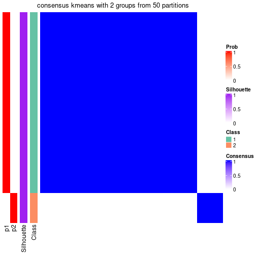</p>

</div>
<div id='tab-node-0131-consensus-heatmap-2'>
<pre><code class="r">consensus_heatmap(res, k = 3)
</code></pre>

<p>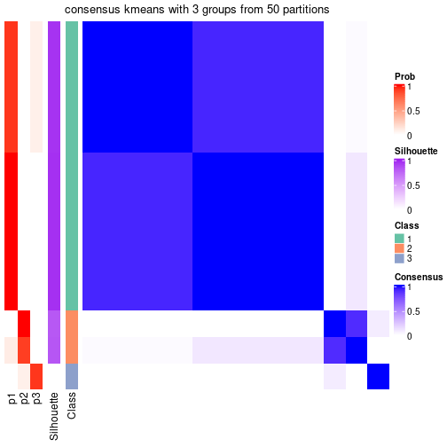</p>

</div>
<div id='tab-node-0131-consensus-heatmap-3'>
<pre><code class="r">consensus_heatmap(res, k = 4)
</code></pre>

<p></p>

</div>
<div id='tab-node-0131-consensus-heatmap-4'>
<pre><code class="r">consensus_heatmap(res, k = 5)
</code></pre>

<p></p>

</div>
<div id='tab-node-0131-consensus-heatmap-5'>
<pre><code class="r">consensus_heatmap(res, k = 6)
</code></pre>

<p></p>

</div>
<div id='tab-node-0131-consensus-heatmap-6'>
<pre><code class="r">consensus_heatmap(res, k = 7)
</code></pre>

<p></p>

</div>
<div id='tab-node-0131-consensus-heatmap-7'>
<pre><code class="r">consensus_heatmap(res, k = 8)
</code></pre>

<p></p>

</div>
</div>

Heatmaps for the membership of samples in all partitions to see how consistent they are:


<script>
$( function() {
	$( '#tabs-node-0131-membership-heatmap' ).tabs();
} );
</script>
<div id='tabs-node-0131-membership-heatmap'>
<ul>
<li><a href='#tab-node-0131-membership-heatmap-1'>k = 2</a></li>
<li><a href='#tab-node-0131-membership-heatmap-2'>k = 3</a></li>
<li><a href='#tab-node-0131-membership-heatmap-3'>k = 4</a></li>
<li><a href='#tab-node-0131-membership-heatmap-4'>k = 5</a></li>
<li><a href='#tab-node-0131-membership-heatmap-5'>k = 6</a></li>
<li><a href='#tab-node-0131-membership-heatmap-6'>k = 7</a></li>
<li><a href='#tab-node-0131-membership-heatmap-7'>k = 8</a></li>
</ul>
<div id='tab-node-0131-membership-heatmap-1'>
<pre><code class="r">membership_heatmap(res, k = 2)
</code></pre>

<p></p>

</div>
<div id='tab-node-0131-membership-heatmap-2'>
<pre><code class="r">membership_heatmap(res, k = 3)
</code></pre>

<p></p>

</div>
<div id='tab-node-0131-membership-heatmap-3'>
<pre><code class="r">membership_heatmap(res, k = 4)
</code></pre>

<p></p>

</div>
<div id='tab-node-0131-membership-heatmap-4'>
<pre><code class="r">membership_heatmap(res, k = 5)
</code></pre>

<p></p>

</div>
<div id='tab-node-0131-membership-heatmap-5'>
<pre><code class="r">membership_heatmap(res, k = 6)
</code></pre>

<p></p>

</div>
<div id='tab-node-0131-membership-heatmap-6'>
<pre><code class="r">membership_heatmap(res, k = 7)
</code></pre>

<p></p>

</div>
<div id='tab-node-0131-membership-heatmap-7'>
<pre><code class="r">membership_heatmap(res, k = 8)
</code></pre>

<p></p>

</div>
</div>

As soon as the classes for columns are determined, the signatures
that are significantly different between subgroups can be looked for. 
Following are the heatmaps for signatures.


<script>
$( function() {
	$( '#tabs-node-0131-get-signatures' ).tabs();
} );
</script>
<div id='tabs-node-0131-get-signatures'>
<ul>
<li><a href='#tab-node-0131-get-signatures-1'>k = 2</a></li>
<li><a href='#tab-node-0131-get-signatures-2'>k = 3</a></li>
<li><a href='#tab-node-0131-get-signatures-3'>k = 4</a></li>
<li><a href='#tab-node-0131-get-signatures-4'>k = 5</a></li>
<li><a href='#tab-node-0131-get-signatures-5'>k = 6</a></li>
<li><a href='#tab-node-0131-get-signatures-6'>k = 7</a></li>
<li><a href='#tab-node-0131-get-signatures-7'>k = 8</a></li>
</ul>
<div id='tab-node-0131-get-signatures-1'>
<pre><code class="r">get_signatures(res, k = 2)
</code></pre>

<p></p>

</div>
<div id='tab-node-0131-get-signatures-2'>
<pre><code class="r">get_signatures(res, k = 3)
</code></pre>

<p></p>

</div>
<div id='tab-node-0131-get-signatures-3'>
<pre><code class="r">get_signatures(res, k = 4)
</code></pre>

<p></p>

</div>
<div id='tab-node-0131-get-signatures-4'>
<pre><code class="r">get_signatures(res, k = 5)
</code></pre>

<p></p>

</div>
<div id='tab-node-0131-get-signatures-5'>
<pre><code class="r">get_signatures(res, k = 6)
</code></pre>

<p></p>

</div>
<div id='tab-node-0131-get-signatures-6'>
<pre><code class="r">get_signatures(res, k = 7)
</code></pre>

<p></p>

</div>
<div id='tab-node-0131-get-signatures-7'>
<pre><code class="r">get_signatures(res, k = 8)
</code></pre>

<p></p>

</div>
</div>


Compare the overlap of signatures from different k:

```r
compare_signatures(res)
```


`get_signature()` returns a data frame invisibly. To get the list of signatures, the function
call should be assigned to a variable explicitly. In following code, if `plot` argument is set
to `FALSE`, no heatmap is plotted while only the differential analysis is performed.

```r
# code only for demonstration
tb = get_signature(res, k = ..., plot = FALSE)
```

An example of the output of `tb` is:

```
#>   which_row         fdr    mean_1    mean_2 scaled_mean_1 scaled_mean_2 km
#> 1        38 0.042760348  8.373488  9.131774    -0.5533452     0.5164555  1
#> 2        40 0.018707592  7.106213  8.469186    -0.6173731     0.5762149  1
#> 3        55 0.019134737 10.221463 11.207825    -0.6159697     0.5749050  1
#> 4        59 0.006059896  5.921854  7.869574    -0.6899429     0.6439467  1
#> 5        60 0.018055526  8.928898 10.211722    -0.6204761     0.5791110  1
#> 6        98 0.009384629 15.714769 14.887706     0.6635654    -0.6193277  2
...
```

The columns in `tb` are:

1. `which_row`: row indices corresponding to the input matrix.
2. `fdr`: FDR for the differential test. 
3. `mean_x`: The mean value in group x.
4. `scaled_mean_x`: The mean value in group x after rows are scaled.
5. `km`: Row groups if k-means clustering is applied to rows (which is done by automatically selecting number of clusters).

If there are too many signatures, `top_signatures = ...` can be set to only show the 
signatures with the highest FDRs:

```r
# code only for demonstration
# e.g. to show the top 500 most significant rows
tb = get_signature(res, k = ..., top_signatures = 500)
```

If the signatures are defined as these which are uniquely high in current group, `diff_method` argument
can be set to `"uniquely_high_in_one_group"`:

```r
# code only for demonstration
tb = get_signature(res, k = ..., diff_method = "uniquely_high_in_one_group")
```


UMAP plot which shows how samples are separated.


<script>
$( function() {
	$( '#tabs-node-0131-dimension-reduction' ).tabs();
} );
</script>
<div id='tabs-node-0131-dimension-reduction'>
<ul>
<li><a href='#tab-node-0131-dimension-reduction-1'>k = 2</a></li>
<li><a href='#tab-node-0131-dimension-reduction-2'>k = 3</a></li>
<li><a href='#tab-node-0131-dimension-reduction-3'>k = 4</a></li>
<li><a href='#tab-node-0131-dimension-reduction-4'>k = 5</a></li>
<li><a href='#tab-node-0131-dimension-reduction-5'>k = 6</a></li>
<li><a href='#tab-node-0131-dimension-reduction-6'>k = 7</a></li>
<li><a href='#tab-node-0131-dimension-reduction-7'>k = 8</a></li>
</ul>
<div id='tab-node-0131-dimension-reduction-1'>
<pre><code class="r">dimension_reduction(res, k = 2, method = &quot;UMAP&quot;)
</code></pre>

<p></p>

</div>
<div id='tab-node-0131-dimension-reduction-2'>
<pre><code class="r">dimension_reduction(res, k = 3, method = &quot;UMAP&quot;)
</code></pre>

<p></p>

</div>
<div id='tab-node-0131-dimension-reduction-3'>
<pre><code class="r">dimension_reduction(res, k = 4, method = &quot;UMAP&quot;)
</code></pre>

<p></p>

</div>
<div id='tab-node-0131-dimension-reduction-4'>
<pre><code class="r">dimension_reduction(res, k = 5, method = &quot;UMAP&quot;)
</code></pre>

<p></p>

</div>
<div id='tab-node-0131-dimension-reduction-5'>
<pre><code class="r">dimension_reduction(res, k = 6, method = &quot;UMAP&quot;)
</code></pre>

<p></p>

</div>
<div id='tab-node-0131-dimension-reduction-6'>
<pre><code class="r">dimension_reduction(res, k = 7, method = &quot;UMAP&quot;)
</code></pre>

<p></p>

</div>
<div id='tab-node-0131-dimension-reduction-7'>
<pre><code class="r">dimension_reduction(res, k = 8, method = &quot;UMAP&quot;)
</code></pre>

<p></p>

</div>
</div>


Following heatmap shows how subgroups are split when increasing `k`:

```r
collect_classes(res)
```


If matrix rows can be associated to genes, consider to use `functional_enrichment(res,
...)` to perform function enrichment for the signature genes. See [this vignette](https://jokergoo.github.io/cola_vignettes/functional_enrichment.html) for more detailed explanations.


 

---------------------------------------------------


### Node02


Parent node: [Node0](#Node0).
Child nodes: 
                Node011-leaf
        ,
                [Node012](#Node012)
        ,
                [Node013](#Node013)
        ,
                Node021-leaf
        ,
                [Node022](#Node022)
        ,
                Node023-leaf
        ,
                [Node031](#Node031)
        ,
                [Node032](#Node032)
        ,
                Node033-leaf
        ,
                Node041-leaf
        ,
                Node042-leaf
        ,
                [Node043](#Node043)
        ,
                Node044-leaf
        ,
                [Node051](#Node051)
        ,
                [Node052](#Node052)
        ,
                [Node053](#Node053)
        ,
                Node054-leaf
        .


The object with results only for a single top-value method and a single partitioning method 
can be extracted as:

```r
res = res_rh["02"]
```

A summary of `res` and all the functions that can be applied to it:

```r
res
```

```
#> A 'ConsensusPartition' object with k = 2, 3, 4, 5, 6, 7, 8.
#>   On a matrix with 30000 rows and 56 columns.
#>   Top rows (1000) are extracted by 'SD' method.
#>   Subgroups are detected by 'skmeans' method.
#>   Performed in total 350 partitions by row resampling.
#>   Best k for subgroups seems to be 3.
#> 
#> Following methods can be applied to this 'ConsensusPartition' object:
#>  [1] "cola_report"             "collect_classes"         "collect_plots"          
#>  [4] "collect_stats"           "colnames"                "compare_partitions"     
#>  [7] "compare_signatures"      "consensus_heatmap"       "dimension_reduction"    
#> [10] "functional_enrichment"   "get_anno_col"            "get_anno"               
#> [13] "get_classes"             "get_consensus"           "get_matrix"             
#> [16] "get_membership"          "get_param"               "get_signatures"         
#> [19] "get_stats"               "is_best_k"               "is_stable_k"            
#> [22] "membership_heatmap"      "ncol"                    "nrow"                   
#> [25] "plot_ecdf"               "predict_classes"         "rownames"               
#> [28] "select_partition_number" "show"                    "suggest_best_k"         
#> [31] "test_to_known_factors"   "top_rows_heatmap"
```

`collect_plots()` function collects all the plots made from `res` for all `k` (number of subgroups)
into one single page to provide an easy and fast comparison between different `k`.

```r
collect_plots(res)
```


The plots are:

- The first row: a plot of the eCDF (empirical cumulative distribution
  function) curves of the consensus matrix for each `k` and the heatmap of
  predicted classes for each `k`.
- The second row: heatmaps of the consensus matrix for each `k`.
- The third row: heatmaps of the membership matrix for each `k`.
- The fouth row: heatmaps of the signatures for each `k`.

All the plots in panels can be made by individual functions and they are
plotted later in this section.

`select_partition_number()` produces several plots showing different
statistics for choosing "optimized" `k`. There are following statistics:

- eCDF curves of the consensus matrix for each `k`;
- 1-PAC. [The PAC score](https://en.wikipedia.org/wiki/Consensus_clustering#Over-interpretation_potential_of_consensus_clustering)
  measures the proportion of the ambiguous subgrouping.
- Mean silhouette score.
- Concordance. The mean probability of fiting the consensus subgroup labels in all
  partitions.
- Area increased. Denote $A_k$ as the area under the eCDF curve for current
  `k`, the area increased is defined as $A_k - A_{k-1}$.
- Rand index. The percent of pairs of samples that are both in a same cluster
  or both are not in a same cluster in the partition of k and k-1.
- Jaccard index. The ratio of pairs of samples are both in a same cluster in
  the partition of k and k-1 and the pairs of samples are both in a same
  cluster in the partition k or k-1.

The detailed explanations of these statistics can be found in [the _cola_
vignette](https://jokergoo.github.io/cola_vignettes/cola.html#toc_13).

Generally speaking, higher 1-PAC score, higher mean silhouette score or higher
concordance corresponds to better partition. Rand index and Jaccard index
measure how similar the current partition is compared to partition with `k-1`.
If they are too similar, we won't accept `k` is better than `k-1`.

```r
select_partition_number(res)
```


The numeric values for all these statistics can be obtained by `get_stats()`.

```r
get_stats(res)
```

```
#>   k 1-PAC mean_silhouette concordance area_increased  Rand Jaccard
#> 2 2 1.000           1.000       1.000        0.43109 0.569   0.569
#> 3 3 1.000           0.970       0.990        0.36191 0.839   0.717
#> 4 4 0.856           0.723       0.872        0.08140 0.968   0.921
#> 5 5 0.790           0.829       0.898        0.05735 0.919   0.795
#> 6 6 0.689           0.831       0.890        0.04112 0.977   0.930
#> 7 7 0.636           0.769       0.846        0.06272 0.997   0.991
#> 8 8 0.635           0.779       0.854        0.00397 0.997   0.991
```

`suggest_best_k()` suggests the best $k$ based on these statistics. The rules are as follows:

- All $k$ with Jaccard index larger than 0.95 are removed because increasing
  $k$ does not provide enough extra information. If all $k$ are removed, it is
  marked as no subgroup is detected.
- For all $k$ with 1-PAC score larger than 0.9, the maximal $k$ is taken as
  the best $k$, and other $k$ are marked as optional $k$.
- If it does not fit the second rule. The $k$ with the maximal vote of the
  highest 1-PAC score, highest mean silhouette, and highest concordance is
  taken as the best $k$.

```r
suggest_best_k(res)
```

```
#> [1] 3
#> attr(,"optional")
#> [1] 2
```

There is also optional best $k$ = 2 that is worth to check.

Following is the table of the partitions (You need to click the **show/hide
code output** link to see it). The membership matrix (columns with name `p*`)
is inferred by
[`clue::cl_consensus()`](https://www.rdocumentation.org/link/cl_consensus?package=clue)
function with the `SE` method. Basically the value in the membership matrix
represents the probability to belong to a certain group. The finall subgroup
label for an item is determined with the group with highest probability it
belongs to.

In `get_classes()` function, the entropy is calculated from the membership
matrix and the silhouette score is calculated from the consensus matrix.


<script>
$( function() {
	$( '#tabs-node-02-get-classes' ).tabs();
} );
</script>
<div id='tabs-node-02-get-classes'>
<ul>
<li><a href='#tab-node-02-get-classes-1'>k = 2</a></li>
<li><a href='#tab-node-02-get-classes-2'>k = 3</a></li>
<li><a href='#tab-node-02-get-classes-3'>k = 4</a></li>
<li><a href='#tab-node-02-get-classes-4'>k = 5</a></li>
<li><a href='#tab-node-02-get-classes-5'>k = 6</a></li>
<li><a href='#tab-node-02-get-classes-6'>k = 7</a></li>
<li><a href='#tab-node-02-get-classes-7'>k = 8</a></li>
</ul>

<div id='tab-node-02-get-classes-1'>
<p><a id='tab-node-02-get-classes-1-a' style='color:#0366d6' href='#'>show/hide code output</a></p>
<pre><code class="r">cbind(get_classes(res, k = 2), get_membership(res, k = 2))
</code></pre>

<pre><code>#&gt;                 class entropy silhouette p1 p2
#&gt; TCGA.A4.8312.01     1       0          1  1  0
#&gt; TCGA.BQ.5880.11     1       0          1  1  0
#&gt; TCGA.BQ.5884.11     2       0          1  0  1
#&gt; TCGA.BQ.5877.11     1       0          1  1  0
#&gt; TCGA.BQ.5876.11     1       0          1  1  0
#&gt; TCGA.BQ.5885.11     1       0          1  1  0
#&gt; TCGA.MH.A857.01     1       0          1  1  0
#&gt; TCGA.BQ.5889.11     1       0          1  1  0
#&gt; TCGA.BQ.5894.11     1       0          1  1  0
#&gt; TCGA.BQ.5891.11     2       0          1  0  1
#&gt; TCGA.BQ.5881.11     1       0          1  1  0
#&gt; TCGA.BQ.5893.11     1       0          1  1  0
#&gt; TCGA.BQ.5886.11     1       0          1  1  0
#&gt; TCGA.BQ.5888.11     2       0          1  0  1
#&gt; TCGA.5P.A9K8.01     2       0          1  0  1
#&gt; TCGA.BQ.5892.11     1       0          1  1  0
#&gt; TCGA.BQ.5883.11     2       0          1  0  1
#&gt; TCGA.BQ.5878.11     2       0          1  0  1
#&gt; TCGA.BQ.5879.11     2       0          1  0  1
#&gt; TCGA.P4.A5ED.01     1       0          1  1  0
#&gt; TCGA.BQ.5882.11     1       0          1  1  0
#&gt; TCGA.B1.A47M.11     1       0          1  1  0
#&gt; TCGA.2Z.A9J9.01     1       0          1  1  0
#&gt; TCGA.BQ.5890.11     1       0          1  1  0
#&gt; TCGA.2Z.A9JN.01     2       0          1  0  1
#&gt; TCGA.BQ.5875.11     2       0          1  0  1
#&gt; TCGA.BQ.5883.01     2       0          1  0  1
#&gt; TCGA.5P.A9KH.01     1       0          1  1  0
#&gt; TCGA.5P.A9JV.01     1       0          1  1  0
#&gt; TCGA.DZ.6134.11     1       0          1  1  0
#&gt; TCGA.BQ.7053.11     2       0          1  0  1
#&gt; TCGA.GL.6846.11     1       0          1  1  0
#&gt; TCGA.DZ.6132.11     1       0          1  1  0
#&gt; TCGA.DZ.6133.11     2       0          1  0  1
#&gt; TCGA.BQ.7046.11     1       0          1  1  0
#&gt; TCGA.DZ.6131.11     1       0          1  1  0
#&gt; TCGA.BQ.7062.11     1       0          1  1  0
#&gt; TCGA.BQ.7056.11     2       0          1  0  1
#&gt; TCGA.BQ.7055.11     1       0          1  1  0
#&gt; TCGA.BQ.7059.11     1       0          1  1  0
#&gt; TCGA.A4.7288.11     2       0          1  0  1
#&gt; TCGA.BQ.7051.11     1       0          1  1  0
#&gt; TCGA.BQ.7049.11     1       0          1  1  0
#&gt; TCGA.BQ.7048.11     1       0          1  1  0
#&gt; TCGA.BQ.7061.11     2       0          1  0  1
#&gt; TCGA.BQ.7050.11     2       0          1  0  1
#&gt; TCGA.BQ.7058.11     1       0          1  1  0
#&gt; TCGA.DZ.6135.11     1       0          1  1  0
#&gt; TCGA.BQ.7044.11     1       0          1  1  0
#&gt; TCGA.BQ.7055.01     1       0          1  1  0
#&gt; TCGA.BQ.7060.11     1       0          1  1  0
#&gt; TCGA.A4.7828.01     2       0          1  0  1
#&gt; TCGA.BQ.5887.11     1       0          1  1  0
#&gt; TCGA.BQ.7045.11     1       0          1  1  0
#&gt; TCGA.A4.7732.11     1       0          1  1  0
#&gt; TCGA.A4.7585.11     1       0          1  1  0
</code></pre>

<script>
$('#tab-node-02-get-classes-1-a').parent().next().next().hide();
$('#tab-node-02-get-classes-1-a').click(function(){
  $('#tab-node-02-get-classes-1-a').parent().next().next().toggle();
  return(false);
});
</script>
</div>

<div id='tab-node-02-get-classes-2'>
<p><a id='tab-node-02-get-classes-2-a' style='color:#0366d6' href='#'>show/hide code output</a></p>
<pre><code class="r">cbind(get_classes(res, k = 3), get_membership(res, k = 3))
</code></pre>

<pre><code>#&gt;                 class entropy silhouette   p1 p2   p3
#&gt; TCGA.A4.8312.01     3   0.000      0.920 0.00  0 1.00
#&gt; TCGA.BQ.5880.11     1   0.000      0.995 1.00  0 0.00
#&gt; TCGA.BQ.5884.11     2   0.000      1.000 0.00  1 0.00
#&gt; TCGA.BQ.5877.11     1   0.000      0.995 1.00  0 0.00
#&gt; TCGA.BQ.5876.11     1   0.000      0.995 1.00  0 0.00
#&gt; TCGA.BQ.5885.11     1   0.000      0.995 1.00  0 0.00
#&gt; TCGA.MH.A857.01     3   0.624      0.200 0.44  0 0.56
#&gt; TCGA.BQ.5889.11     1   0.000      0.995 1.00  0 0.00
#&gt; TCGA.BQ.5894.11     1   0.000      0.995 1.00  0 0.00
#&gt; TCGA.BQ.5891.11     2   0.000      1.000 0.00  1 0.00
#&gt; TCGA.BQ.5881.11     1   0.000      0.995 1.00  0 0.00
#&gt; TCGA.BQ.5893.11     1   0.000      0.995 1.00  0 0.00
#&gt; TCGA.BQ.5886.11     1   0.000      0.995 1.00  0 0.00
#&gt; TCGA.BQ.5888.11     2   0.000      1.000 0.00  1 0.00
#&gt; TCGA.5P.A9K8.01     2   0.000      1.000 0.00  1 0.00
#&gt; TCGA.BQ.5892.11     1   0.000      0.995 1.00  0 0.00
#&gt; TCGA.BQ.5883.11     2   0.000      1.000 0.00  1 0.00
#&gt; TCGA.BQ.5878.11     2   0.000      1.000 0.00  1 0.00
#&gt; TCGA.BQ.5879.11     2   0.000      1.000 0.00  1 0.00
#&gt; TCGA.P4.A5ED.01     3   0.000      0.920 0.00  0 1.00
#&gt; TCGA.BQ.5882.11     1   0.000      0.995 1.00  0 0.00
#&gt; TCGA.B1.A47M.11     3   0.000      0.920 0.00  0 1.00
#&gt; TCGA.2Z.A9J9.01     3   0.000      0.920 0.00  0 1.00
#&gt; TCGA.BQ.5890.11     1   0.000      0.995 1.00  0 0.00
#&gt; TCGA.2Z.A9JN.01     2   0.000      1.000 0.00  1 0.00
#&gt; TCGA.BQ.5875.11     2   0.000      1.000 0.00  1 0.00
#&gt; TCGA.BQ.5883.01     2   0.000      1.000 0.00  1 0.00
#&gt; TCGA.5P.A9KH.01     3   0.000      0.920 0.00  0 1.00
#&gt; TCGA.5P.A9JV.01     3   0.000      0.920 0.00  0 1.00
#&gt; TCGA.DZ.6134.11     1   0.000      0.995 1.00  0 0.00
#&gt; TCGA.BQ.7053.11     2   0.000      1.000 0.00  1 0.00
#&gt; TCGA.GL.6846.11     1   0.000      0.995 1.00  0 0.00
#&gt; TCGA.DZ.6132.11     1   0.000      0.995 1.00  0 0.00
#&gt; TCGA.DZ.6133.11     2   0.000      1.000 0.00  1 0.00
#&gt; TCGA.BQ.7046.11     1   0.000      0.995 1.00  0 0.00
#&gt; TCGA.DZ.6131.11     1   0.000      0.995 1.00  0 0.00
#&gt; TCGA.BQ.7062.11     1   0.000      0.995 1.00  0 0.00
#&gt; TCGA.BQ.7056.11     2   0.000      1.000 0.00  1 0.00
#&gt; TCGA.BQ.7055.11     1   0.000      0.995 1.00  0 0.00
#&gt; TCGA.BQ.7059.11     1   0.000      0.995 1.00  0 0.00
#&gt; TCGA.A4.7288.11     2   0.000      1.000 0.00  1 0.00
#&gt; TCGA.BQ.7051.11     1   0.000      0.995 1.00  0 0.00
#&gt; TCGA.BQ.7049.11     1   0.000      0.995 1.00  0 0.00
#&gt; TCGA.BQ.7048.11     1   0.000      0.995 1.00  0 0.00
#&gt; TCGA.BQ.7061.11     2   0.000      1.000 0.00  1 0.00
#&gt; TCGA.BQ.7050.11     2   0.000      1.000 0.00  1 0.00
#&gt; TCGA.BQ.7058.11     1   0.000      0.995 1.00  0 0.00
#&gt; TCGA.DZ.6135.11     1   0.000      0.995 1.00  0 0.00
#&gt; TCGA.BQ.7044.11     1   0.000      0.995 1.00  0 0.00
#&gt; TCGA.BQ.7055.01     3   0.000      0.920 0.00  0 1.00
#&gt; TCGA.BQ.7060.11     1   0.000      0.995 1.00  0 0.00
#&gt; TCGA.A4.7828.01     2   0.000      1.000 0.00  1 0.00
#&gt; TCGA.BQ.5887.11     1   0.000      0.995 1.00  0 0.00
#&gt; TCGA.BQ.7045.11     1   0.369      0.824 0.86  0 0.14
#&gt; TCGA.A4.7732.11     1   0.000      0.995 1.00  0 0.00
#&gt; TCGA.A4.7585.11     1   0.000      0.995 1.00  0 0.00
</code></pre>

<script>
$('#tab-node-02-get-classes-2-a').parent().next().next().hide();
$('#tab-node-02-get-classes-2-a').click(function(){
  $('#tab-node-02-get-classes-2-a').parent().next().next().toggle();
  return(false);
});
</script>
</div>

<div id='tab-node-02-get-classes-3'>
<p><a id='tab-node-02-get-classes-3-a' style='color:#0366d6' href='#'>show/hide code output</a></p>
<pre><code class="r">cbind(get_classes(res, k = 4), get_membership(res, k = 4))
</code></pre>

<pre><code>#&gt;                 class entropy silhouette   p1   p2   p3   p4
#&gt; TCGA.A4.8312.01     3  0.5000    -0.8452 0.00 0.00 0.50 0.50
#&gt; TCGA.BQ.5880.11     1  0.0000     0.9383 1.00 0.00 0.00 0.00
#&gt; TCGA.BQ.5884.11     2  0.0000     0.9452 0.00 1.00 0.00 0.00
#&gt; TCGA.BQ.5877.11     1  0.4855     0.3284 0.60 0.00 0.40 0.00
#&gt; TCGA.BQ.5876.11     1  0.0000     0.9383 1.00 0.00 0.00 0.00
#&gt; TCGA.BQ.5885.11     1  0.0000     0.9383 1.00 0.00 0.00 0.00
#&gt; TCGA.MH.A857.01     3  0.4472     0.1417 0.22 0.00 0.76 0.02
#&gt; TCGA.BQ.5889.11     1  0.0000     0.9383 1.00 0.00 0.00 0.00
#&gt; TCGA.BQ.5894.11     1  0.0000     0.9383 1.00 0.00 0.00 0.00
#&gt; TCGA.BQ.5891.11     2  0.0000     0.9452 0.00 1.00 0.00 0.00
#&gt; TCGA.BQ.5881.11     1  0.0000     0.9383 1.00 0.00 0.00 0.00
#&gt; TCGA.BQ.5893.11     1  0.0000     0.9383 1.00 0.00 0.00 0.00
#&gt; TCGA.BQ.5886.11     1  0.0000     0.9383 1.00 0.00 0.00 0.00
#&gt; TCGA.BQ.5888.11     2  0.0000     0.9452 0.00 1.00 0.00 0.00
#&gt; TCGA.5P.A9K8.01     2  0.0000     0.9452 0.00 1.00 0.00 0.00
#&gt; TCGA.BQ.5892.11     1  0.0000     0.9383 1.00 0.00 0.00 0.00
#&gt; TCGA.BQ.5883.11     2  0.0000     0.9452 0.00 1.00 0.00 0.00
#&gt; TCGA.BQ.5878.11     2  0.0000     0.9452 0.00 1.00 0.00 0.00
#&gt; TCGA.BQ.5879.11     2  0.0000     0.9452 0.00 1.00 0.00 0.00
#&gt; TCGA.P4.A5ED.01     4  0.5000     0.7213 0.00 0.00 0.50 0.50
#&gt; TCGA.BQ.5882.11     1  0.0000     0.9383 1.00 0.00 0.00 0.00
#&gt; TCGA.B1.A47M.11     3  0.0000    -0.1280 0.00 0.00 1.00 0.00
#&gt; TCGA.2Z.A9J9.01     4  0.5000     0.7213 0.00 0.00 0.50 0.50
#&gt; TCGA.BQ.5890.11     1  0.2011     0.8688 0.92 0.00 0.08 0.00
#&gt; TCGA.2Z.A9JN.01     2  0.4522     0.6963 0.00 0.68 0.00 0.32
#&gt; TCGA.BQ.5875.11     2  0.0000     0.9452 0.00 1.00 0.00 0.00
#&gt; TCGA.BQ.5883.01     2  0.4522     0.6963 0.00 0.68 0.00 0.32
#&gt; TCGA.5P.A9KH.01     4  0.6150     0.4881 0.06 0.00 0.36 0.58
#&gt; TCGA.5P.A9JV.01     3  0.4994    -0.7891 0.00 0.00 0.52 0.48
#&gt; TCGA.DZ.6134.11     1  0.0000     0.9383 1.00 0.00 0.00 0.00
#&gt; TCGA.BQ.7053.11     2  0.0000     0.9452 0.00 1.00 0.00 0.00
#&gt; TCGA.GL.6846.11     1  0.0000     0.9383 1.00 0.00 0.00 0.00
#&gt; TCGA.DZ.6132.11     1  0.2011     0.8695 0.92 0.00 0.08 0.00
#&gt; TCGA.DZ.6133.11     2  0.0000     0.9452 0.00 1.00 0.00 0.00
#&gt; TCGA.BQ.7046.11     1  0.0000     0.9383 1.00 0.00 0.00 0.00
#&gt; TCGA.DZ.6131.11     1  0.0000     0.9383 1.00 0.00 0.00 0.00
#&gt; TCGA.BQ.7062.11     1  0.4977     0.1953 0.54 0.00 0.46 0.00
#&gt; TCGA.BQ.7056.11     2  0.0000     0.9452 0.00 1.00 0.00 0.00
#&gt; TCGA.BQ.7055.11     1  0.1211     0.9063 0.96 0.00 0.04 0.00
#&gt; TCGA.BQ.7059.11     1  0.0000     0.9383 1.00 0.00 0.00 0.00
#&gt; TCGA.A4.7288.11     2  0.0000     0.9452 0.00 1.00 0.00 0.00
#&gt; TCGA.BQ.7051.11     1  0.0000     0.9383 1.00 0.00 0.00 0.00
#&gt; TCGA.BQ.7049.11     1  0.0000     0.9383 1.00 0.00 0.00 0.00
#&gt; TCGA.BQ.7048.11     1  0.0000     0.9383 1.00 0.00 0.00 0.00
#&gt; TCGA.BQ.7061.11     2  0.0000     0.9452 0.00 1.00 0.00 0.00
#&gt; TCGA.BQ.7050.11     2  0.0000     0.9452 0.00 1.00 0.00 0.00
#&gt; TCGA.BQ.7058.11     1  0.0000     0.9383 1.00 0.00 0.00 0.00
#&gt; TCGA.DZ.6135.11     1  0.0000     0.9383 1.00 0.00 0.00 0.00
#&gt; TCGA.BQ.7044.11     1  0.0000     0.9383 1.00 0.00 0.00 0.00
#&gt; TCGA.BQ.7055.01     3  0.4948    -0.7671 0.00 0.00 0.56 0.44
#&gt; TCGA.BQ.7060.11     1  0.0707     0.9230 0.98 0.00 0.02 0.00
#&gt; TCGA.A4.7828.01     2  0.4522     0.6963 0.00 0.68 0.00 0.32
#&gt; TCGA.BQ.5887.11     1  0.0000     0.9383 1.00 0.00 0.00 0.00
#&gt; TCGA.BQ.7045.11     3  0.4977    -0.1314 0.46 0.00 0.54 0.00
#&gt; TCGA.A4.7732.11     1  0.5000     0.0818 0.50 0.00 0.50 0.00
#&gt; TCGA.A4.7585.11     1  0.0000     0.9383 1.00 0.00 0.00 0.00
</code></pre>

<script>
$('#tab-node-02-get-classes-3-a').parent().next().next().hide();
$('#tab-node-02-get-classes-3-a').click(function(){
  $('#tab-node-02-get-classes-3-a').parent().next().next().toggle();
  return(false);
});
</script>
</div>

<div id='tab-node-02-get-classes-4'>
<p><a id='tab-node-02-get-classes-4-a' style='color:#0366d6' href='#'>show/hide code output</a></p>
<pre><code class="r">cbind(get_classes(res, k = 5), get_membership(res, k = 5))
</code></pre>

<pre><code>#&gt;                 class entropy silhouette   p1   p2   p3   p4   p5
#&gt; TCGA.A4.8312.01     4  0.0609    0.91775 0.00 0.00 0.00 0.98 0.02
#&gt; TCGA.BQ.5880.11     1  0.0609    0.90821 0.98 0.00 0.02 0.00 0.00
#&gt; TCGA.BQ.5884.11     2  0.0000    0.98934 0.00 1.00 0.00 0.00 0.00
#&gt; TCGA.BQ.5877.11     1  0.4182   -0.00642 0.60 0.00 0.40 0.00 0.00
#&gt; TCGA.BQ.5876.11     1  0.1043    0.90231 0.96 0.00 0.04 0.00 0.00
#&gt; TCGA.BQ.5885.11     1  0.1410    0.89608 0.94 0.00 0.06 0.00 0.00
#&gt; TCGA.MH.A857.01     3  0.5444    0.63008 0.18 0.00 0.66 0.16 0.00
#&gt; TCGA.BQ.5889.11     1  0.1410    0.88969 0.94 0.00 0.06 0.00 0.00
#&gt; TCGA.BQ.5894.11     1  0.0609    0.90821 0.98 0.00 0.02 0.00 0.00
#&gt; TCGA.BQ.5891.11     2  0.0000    0.98934 0.00 1.00 0.00 0.00 0.00
#&gt; TCGA.BQ.5881.11     1  0.0000    0.91281 1.00 0.00 0.00 0.00 0.00
#&gt; TCGA.BQ.5893.11     1  0.1410    0.90310 0.94 0.00 0.06 0.00 0.00
#&gt; TCGA.BQ.5886.11     1  0.1410    0.89608 0.94 0.00 0.06 0.00 0.00
#&gt; TCGA.BQ.5888.11     2  0.0000    0.98934 0.00 1.00 0.00 0.00 0.00
#&gt; TCGA.5P.A9K8.01     2  0.0609    0.96934 0.00 0.98 0.00 0.00 0.02
#&gt; TCGA.BQ.5892.11     1  0.0000    0.91281 1.00 0.00 0.00 0.00 0.00
#&gt; TCGA.BQ.5883.11     2  0.0609    0.96934 0.00 0.98 0.00 0.00 0.02
#&gt; TCGA.BQ.5878.11     2  0.0000    0.98934 0.00 1.00 0.00 0.00 0.00
#&gt; TCGA.BQ.5879.11     2  0.0000    0.98934 0.00 1.00 0.00 0.00 0.00
#&gt; TCGA.P4.A5ED.01     4  0.0609    0.91775 0.00 0.00 0.00 0.98 0.02
#&gt; TCGA.BQ.5882.11     1  0.0609    0.91039 0.98 0.00 0.02 0.00 0.00
#&gt; TCGA.B1.A47M.11     3  0.3796    0.10557 0.00 0.00 0.70 0.30 0.00
#&gt; TCGA.2Z.A9J9.01     4  0.0000    0.91785 0.00 0.00 0.00 1.00 0.00
#&gt; TCGA.BQ.5890.11     1  0.3513    0.72698 0.80 0.00 0.18 0.02 0.00
#&gt; TCGA.2Z.A9JN.01     5  0.4126    0.65218 0.00 0.38 0.00 0.00 0.62
#&gt; TCGA.BQ.5875.11     2  0.0000    0.98934 0.00 1.00 0.00 0.00 0.00
#&gt; TCGA.BQ.5883.01     5  0.4126    0.65218 0.00 0.38 0.00 0.00 0.62
#&gt; TCGA.5P.A9KH.01     5  0.7589   -0.41015 0.04 0.00 0.32 0.30 0.34
#&gt; TCGA.5P.A9JV.01     4  0.1732    0.89698 0.00 0.00 0.08 0.92 0.00
#&gt; TCGA.DZ.6134.11     1  0.2012    0.88304 0.92 0.00 0.06 0.02 0.00
#&gt; TCGA.BQ.7053.11     2  0.0000    0.98934 0.00 1.00 0.00 0.00 0.00
#&gt; TCGA.GL.6846.11     1  0.0000    0.91281 1.00 0.00 0.00 0.00 0.00
#&gt; TCGA.DZ.6132.11     1  0.2516    0.83626 0.86 0.00 0.14 0.00 0.00
#&gt; TCGA.DZ.6133.11     2  0.0000    0.98934 0.00 1.00 0.00 0.00 0.00
#&gt; TCGA.BQ.7046.11     1  0.0000    0.91281 1.00 0.00 0.00 0.00 0.00
#&gt; TCGA.DZ.6131.11     1  0.0609    0.90821 0.98 0.00 0.02 0.00 0.00
#&gt; TCGA.BQ.7062.11     3  0.4060    0.62322 0.36 0.00 0.64 0.00 0.00
#&gt; TCGA.BQ.7056.11     2  0.0000    0.98934 0.00 1.00 0.00 0.00 0.00
#&gt; TCGA.BQ.7055.11     1  0.2516    0.82418 0.86 0.00 0.14 0.00 0.00
#&gt; TCGA.BQ.7059.11     1  0.1410    0.89608 0.94 0.00 0.06 0.00 0.00
#&gt; TCGA.A4.7288.11     2  0.0000    0.98934 0.00 1.00 0.00 0.00 0.00
#&gt; TCGA.BQ.7051.11     1  0.0609    0.91023 0.98 0.00 0.02 0.00 0.00
#&gt; TCGA.BQ.7049.11     1  0.1410    0.89715 0.94 0.00 0.06 0.00 0.00
#&gt; TCGA.BQ.7048.11     1  0.0000    0.91281 1.00 0.00 0.00 0.00 0.00
#&gt; TCGA.BQ.7061.11     2  0.1410    0.91730 0.00 0.94 0.00 0.00 0.06
#&gt; TCGA.BQ.7050.11     2  0.0000    0.98934 0.00 1.00 0.00 0.00 0.00
#&gt; TCGA.BQ.7058.11     1  0.1410    0.90179 0.94 0.00 0.06 0.00 0.00
#&gt; TCGA.DZ.6135.11     1  0.1410    0.89608 0.94 0.00 0.06 0.00 0.00
#&gt; TCGA.BQ.7044.11     1  0.0000    0.91281 1.00 0.00 0.00 0.00 0.00
#&gt; TCGA.BQ.7055.01     4  0.4373    0.78759 0.00 0.00 0.16 0.76 0.08
#&gt; TCGA.BQ.7060.11     1  0.3274    0.69090 0.78 0.00 0.22 0.00 0.00
#&gt; TCGA.A4.7828.01     5  0.4126    0.65218 0.00 0.38 0.00 0.00 0.62
#&gt; TCGA.BQ.5887.11     1  0.0609    0.90821 0.98 0.00 0.02 0.00 0.00
#&gt; TCGA.BQ.7045.11     3  0.4728    0.72753 0.24 0.00 0.70 0.06 0.00
#&gt; TCGA.A4.7732.11     3  0.3796    0.72433 0.30 0.00 0.70 0.00 0.00
#&gt; TCGA.A4.7585.11     1  0.1043    0.90231 0.96 0.00 0.04 0.00 0.00
</code></pre>

<script>
$('#tab-node-02-get-classes-4-a').parent().next().next().hide();
$('#tab-node-02-get-classes-4-a').click(function(){
  $('#tab-node-02-get-classes-4-a').parent().next().next().toggle();
  return(false);
});
</script>
</div>

<div id='tab-node-02-get-classes-5'>
<p><a id='tab-node-02-get-classes-5-a' style='color:#0366d6' href='#'>show/hide code output</a></p>
<pre><code class="r">cbind(get_classes(res, k = 6), get_membership(res, k = 6))
</code></pre>

<pre><code>#&gt;                 class entropy silhouette   p1   p2   p3   p4   p5   p6
#&gt; TCGA.A4.8312.01     4  0.3258      0.590 0.00 0.00 0.10 0.84 0.04 0.02
#&gt; TCGA.BQ.5880.11     1  0.2345      0.899 0.90 0.00 0.02 0.00 0.02 0.06
#&gt; TCGA.BQ.5884.11     2  0.0000      0.992 0.00 1.00 0.00 0.00 0.00 0.00
#&gt; TCGA.BQ.5877.11     3  0.4646      0.284 0.46 0.00 0.50 0.00 0.04 0.00
#&gt; TCGA.BQ.5876.11     1  0.2403      0.896 0.90 0.00 0.04 0.00 0.02 0.04
#&gt; TCGA.BQ.5885.11     1  0.1092      0.908 0.96 0.00 0.00 0.00 0.02 0.02
#&gt; TCGA.MH.A857.01     3  0.4877      0.637 0.14 0.00 0.74 0.06 0.02 0.04
#&gt; TCGA.BQ.5889.11     1  0.3103      0.887 0.86 0.00 0.04 0.00 0.06 0.04
#&gt; TCGA.BQ.5894.11     1  0.1865      0.893 0.92 0.00 0.04 0.00 0.04 0.00
#&gt; TCGA.BQ.5891.11     2  0.0000      0.992 0.00 1.00 0.00 0.00 0.00 0.00
#&gt; TCGA.BQ.5881.11     1  0.2020      0.898 0.92 0.00 0.04 0.00 0.02 0.02
#&gt; TCGA.BQ.5893.11     1  0.1092      0.907 0.96 0.00 0.02 0.00 0.00 0.02
#&gt; TCGA.BQ.5886.11     1  0.2403      0.898 0.90 0.00 0.04 0.00 0.02 0.04
#&gt; TCGA.BQ.5888.11     2  0.0000      0.992 0.00 1.00 0.00 0.00 0.00 0.00
#&gt; TCGA.5P.A9K8.01     2  0.0000      0.992 0.00 1.00 0.00 0.00 0.00 0.00
#&gt; TCGA.BQ.5892.11     1  0.0937      0.907 0.96 0.00 0.00 0.00 0.04 0.00
#&gt; TCGA.BQ.5883.11     2  0.0000      0.992 0.00 1.00 0.00 0.00 0.00 0.00
#&gt; TCGA.BQ.5878.11     2  0.0000      0.992 0.00 1.00 0.00 0.00 0.00 0.00
#&gt; TCGA.BQ.5879.11     2  0.0000      0.992 0.00 1.00 0.00 0.00 0.00 0.00
#&gt; TCGA.P4.A5ED.01     4  0.2190      0.651 0.00 0.00 0.04 0.90 0.00 0.06
#&gt; TCGA.BQ.5882.11     1  0.1480      0.908 0.94 0.00 0.02 0.00 0.04 0.00
#&gt; TCGA.B1.A47M.11     3  0.2581      0.348 0.00 0.00 0.86 0.12 0.02 0.00
#&gt; TCGA.2Z.A9J9.01     4  0.3697      0.614 0.00 0.00 0.08 0.82 0.04 0.06
#&gt; TCGA.BQ.5890.11     1  0.4475      0.618 0.70 0.00 0.20 0.00 0.00 0.10
#&gt; TCGA.2Z.A9JN.01     5  0.3076      1.000 0.00 0.24 0.00 0.00 0.76 0.00
#&gt; TCGA.BQ.5875.11     2  0.0000      0.992 0.00 1.00 0.00 0.00 0.00 0.00
#&gt; TCGA.BQ.5883.01     5  0.3076      1.000 0.00 0.24 0.00 0.00 0.76 0.00
#&gt; TCGA.5P.A9KH.01     6  0.0937      0.000 0.00 0.00 0.00 0.04 0.00 0.96
#&gt; TCGA.5P.A9JV.01     4  0.5480      0.546 0.00 0.00 0.10 0.66 0.06 0.18
#&gt; TCGA.DZ.6134.11     1  0.2725      0.892 0.88 0.00 0.02 0.00 0.04 0.06
#&gt; TCGA.BQ.7053.11     2  0.0000      0.992 0.00 1.00 0.00 0.00 0.00 0.00
#&gt; TCGA.GL.6846.11     1  0.1092      0.907 0.96 0.00 0.02 0.00 0.00 0.02
#&gt; TCGA.DZ.6132.11     1  0.3829      0.735 0.76 0.00 0.18 0.00 0.00 0.06
#&gt; TCGA.DZ.6133.11     2  0.0000      0.992 0.00 1.00 0.00 0.00 0.00 0.00
#&gt; TCGA.BQ.7046.11     1  0.1092      0.911 0.96 0.00 0.02 0.00 0.00 0.02
#&gt; TCGA.DZ.6131.11     1  0.2020      0.898 0.92 0.00 0.04 0.00 0.02 0.02
#&gt; TCGA.BQ.7062.11     3  0.3198      0.658 0.26 0.00 0.74 0.00 0.00 0.00
#&gt; TCGA.BQ.7056.11     2  0.0000      0.992 0.00 1.00 0.00 0.00 0.00 0.00
#&gt; TCGA.BQ.7055.11     1  0.3258      0.843 0.84 0.00 0.10 0.00 0.02 0.04
#&gt; TCGA.BQ.7059.11     1  0.2020      0.904 0.92 0.00 0.04 0.00 0.02 0.02
#&gt; TCGA.A4.7288.11     2  0.0000      0.992 0.00 1.00 0.00 0.00 0.00 0.00
#&gt; TCGA.BQ.7051.11     1  0.0937      0.908 0.96 0.00 0.00 0.00 0.00 0.04
#&gt; TCGA.BQ.7049.11     1  0.1807      0.898 0.92 0.00 0.02 0.00 0.06 0.00
#&gt; TCGA.BQ.7048.11     1  0.1092      0.908 0.96 0.00 0.02 0.00 0.02 0.00
#&gt; TCGA.BQ.7061.11     2  0.1556      0.882 0.00 0.92 0.00 0.00 0.08 0.00
#&gt; TCGA.BQ.7050.11     2  0.0000      0.992 0.00 1.00 0.00 0.00 0.00 0.00
#&gt; TCGA.BQ.7058.11     1  0.2725      0.888 0.88 0.00 0.04 0.00 0.02 0.06
#&gt; TCGA.DZ.6135.11     1  0.1092      0.910 0.96 0.00 0.00 0.00 0.02 0.02
#&gt; TCGA.BQ.7044.11     1  0.1865      0.896 0.92 0.00 0.04 0.00 0.00 0.04
#&gt; TCGA.BQ.7055.01     4  0.7186      0.375 0.02 0.00 0.22 0.50 0.12 0.14
#&gt; TCGA.BQ.7060.11     1  0.3854      0.815 0.80 0.00 0.12 0.00 0.04 0.04
#&gt; TCGA.A4.7828.01     5  0.3076      1.000 0.00 0.24 0.00 0.00 0.76 0.00
#&gt; TCGA.BQ.5887.11     1  0.0547      0.907 0.98 0.00 0.02 0.00 0.00 0.00
#&gt; TCGA.BQ.7045.11     3  0.3111      0.651 0.12 0.00 0.84 0.02 0.00 0.02
#&gt; TCGA.A4.7732.11     3  0.2793      0.687 0.20 0.00 0.80 0.00 0.00 0.00
#&gt; TCGA.A4.7585.11     1  0.1807      0.905 0.92 0.00 0.02 0.00 0.06 0.00
</code></pre>

<script>
$('#tab-node-02-get-classes-5-a').parent().next().next().hide();
$('#tab-node-02-get-classes-5-a').click(function(){
  $('#tab-node-02-get-classes-5-a').parent().next().next().toggle();
  return(false);
});
</script>
</div>

<div id='tab-node-02-get-classes-6'>
<p><a id='tab-node-02-get-classes-6-a' style='color:#0366d6' href='#'>show/hide code output</a></p>
<pre><code class="r">cbind(get_classes(res, k = 7), get_membership(res, k = 7))
</code></pre>

<pre><code>#&gt;                 class entropy silhouette   p1   p2   p3   p4   p5   p6   p7
#&gt; TCGA.A4.8312.01     4  0.2654      0.572 0.00 0.00 0.00 0.86 0.02 0.02 0.10
#&gt; TCGA.BQ.5880.11     1  0.2163      0.834 0.88 0.00 0.02 0.00 0.00 0.00 0.10
#&gt; TCGA.BQ.5884.11     2  0.0000      0.993 0.00 1.00 0.00 0.00 0.00 0.00 0.00
#&gt; TCGA.BQ.5877.11     3  0.5073      0.329 0.30 0.00 0.54 0.00 0.00 0.00 0.16
#&gt; TCGA.BQ.5876.11     1  0.4162      0.809 0.74 0.00 0.12 0.00 0.02 0.00 0.12
#&gt; TCGA.BQ.5885.11     1  0.2803      0.823 0.84 0.00 0.06 0.00 0.00 0.00 0.10
#&gt; TCGA.MH.A857.01     3  0.4044      0.452 0.00 0.00 0.76 0.04 0.02 0.02 0.16
#&gt; TCGA.BQ.5889.11     1  0.4708      0.725 0.64 0.00 0.08 0.00 0.00 0.02 0.26
#&gt; TCGA.BQ.5894.11     1  0.1671      0.831 0.90 0.00 0.00 0.00 0.00 0.00 0.10
#&gt; TCGA.BQ.5891.11     2  0.0000      0.993 0.00 1.00 0.00 0.00 0.00 0.00 0.00
#&gt; TCGA.BQ.5881.11     1  0.2722      0.831 0.84 0.00 0.04 0.00 0.00 0.00 0.12
#&gt; TCGA.BQ.5893.11     1  0.3086      0.795 0.80 0.00 0.04 0.00 0.00 0.00 0.16
#&gt; TCGA.BQ.5886.11     1  0.3061      0.805 0.84 0.00 0.06 0.00 0.02 0.00 0.08
#&gt; TCGA.BQ.5888.11     2  0.0000      0.993 0.00 1.00 0.00 0.00 0.00 0.00 0.00
#&gt; TCGA.5P.A9K8.01     2  0.0000      0.993 0.00 1.00 0.00 0.00 0.00 0.00 0.00
#&gt; TCGA.BQ.5892.11     1  0.2259      0.819 0.84 0.00 0.00 0.00 0.00 0.00 0.16
#&gt; TCGA.BQ.5883.11     2  0.0504      0.974 0.00 0.98 0.00 0.00 0.02 0.00 0.00
#&gt; TCGA.BQ.5878.11     2  0.0000      0.993 0.00 1.00 0.00 0.00 0.00 0.00 0.00
#&gt; TCGA.BQ.5879.11     2  0.0000      0.993 0.00 1.00 0.00 0.00 0.00 0.00 0.00
#&gt; TCGA.P4.A5ED.01     4  0.2654      0.508 0.00 0.00 0.02 0.86 0.02 0.00 0.10
#&gt; TCGA.BQ.5882.11     1  0.3526      0.789 0.76 0.00 0.06 0.00 0.00 0.00 0.18
#&gt; TCGA.B1.A47M.11     3  0.2421      0.537 0.00 0.00 0.88 0.02 0.00 0.02 0.08
#&gt; TCGA.2Z.A9J9.01     4  0.3149      0.586 0.00 0.00 0.00 0.84 0.04 0.06 0.06
#&gt; TCGA.BQ.5890.11     1  0.4502      0.675 0.66 0.00 0.16 0.00 0.00 0.00 0.18
#&gt; TCGA.2Z.A9JN.01     5  0.2081      1.000 0.00 0.14 0.00 0.00 0.86 0.00 0.00
#&gt; TCGA.BQ.5875.11     2  0.0000      0.993 0.00 1.00 0.00 0.00 0.00 0.00 0.00
#&gt; TCGA.BQ.5883.01     5  0.2081      1.000 0.00 0.14 0.00 0.00 0.86 0.00 0.00
#&gt; TCGA.5P.A9KH.01     6  0.1006      0.000 0.00 0.00 0.02 0.02 0.00 0.96 0.00
#&gt; TCGA.5P.A9JV.01     4  0.5686     -0.117 0.02 0.00 0.08 0.54 0.00 0.04 0.32
#&gt; TCGA.DZ.6134.11     1  0.3061      0.822 0.84 0.00 0.06 0.00 0.02 0.00 0.08
#&gt; TCGA.BQ.7053.11     2  0.0000      0.993 0.00 1.00 0.00 0.00 0.00 0.00 0.00
#&gt; TCGA.GL.6846.11     1  0.2804      0.823 0.86 0.00 0.06 0.00 0.00 0.02 0.06
#&gt; TCGA.DZ.6132.11     1  0.4671      0.753 0.68 0.00 0.14 0.00 0.02 0.00 0.16
#&gt; TCGA.DZ.6133.11     2  0.0000      0.993 0.00 1.00 0.00 0.00 0.00 0.00 0.00
#&gt; TCGA.BQ.7046.11     1  0.3772      0.821 0.80 0.00 0.06 0.00 0.02 0.02 0.10
#&gt; TCGA.DZ.6131.11     1  0.1006      0.836 0.96 0.00 0.02 0.00 0.00 0.02 0.00
#&gt; TCGA.BQ.7062.11     3  0.3208      0.613 0.12 0.00 0.82 0.00 0.02 0.00 0.04
#&gt; TCGA.BQ.7056.11     2  0.0000      0.993 0.00 1.00 0.00 0.00 0.00 0.00 0.00
#&gt; TCGA.BQ.7055.11     1  0.4698      0.635 0.62 0.00 0.14 0.00 0.00 0.00 0.24
#&gt; TCGA.BQ.7059.11     1  0.2313      0.807 0.88 0.00 0.06 0.00 0.00 0.00 0.06
#&gt; TCGA.A4.7288.11     2  0.0000      0.993 0.00 1.00 0.00 0.00 0.00 0.00 0.00
#&gt; TCGA.BQ.7051.11     1  0.3848      0.817 0.76 0.00 0.06 0.00 0.02 0.00 0.16
#&gt; TCGA.BQ.7049.11     1  0.3263      0.818 0.80 0.00 0.08 0.00 0.00 0.00 0.12
#&gt; TCGA.BQ.7048.11     1  0.3863      0.796 0.74 0.00 0.04 0.00 0.00 0.02 0.20
#&gt; TCGA.BQ.7061.11     2  0.1166      0.926 0.00 0.94 0.00 0.00 0.06 0.00 0.00
#&gt; TCGA.BQ.7050.11     2  0.0000      0.993 0.00 1.00 0.00 0.00 0.00 0.00 0.00
#&gt; TCGA.BQ.7058.11     1  0.3000      0.833 0.84 0.00 0.04 0.00 0.00 0.02 0.10
#&gt; TCGA.DZ.6135.11     1  0.2313      0.821 0.88 0.00 0.06 0.00 0.00 0.00 0.06
#&gt; TCGA.BQ.7044.11     1  0.2654      0.828 0.86 0.00 0.02 0.00 0.00 0.02 0.10
#&gt; TCGA.BQ.7055.01     7  0.6577      0.000 0.00 0.00 0.18 0.28 0.04 0.04 0.46
#&gt; TCGA.BQ.7060.11     1  0.5107      0.721 0.66 0.00 0.18 0.00 0.02 0.02 0.12
#&gt; TCGA.A4.7828.01     5  0.2081      1.000 0.00 0.14 0.00 0.00 0.86 0.00 0.00
#&gt; TCGA.BQ.5887.11     1  0.2864      0.829 0.84 0.00 0.02 0.00 0.00 0.02 0.12
#&gt; TCGA.BQ.7045.11     3  0.1363      0.668 0.04 0.00 0.94 0.00 0.00 0.00 0.02
#&gt; TCGA.A4.7732.11     3  0.2159      0.672 0.06 0.00 0.90 0.00 0.00 0.02 0.02
#&gt; TCGA.A4.7585.11     1  0.4500      0.753 0.68 0.00 0.08 0.00 0.00 0.02 0.22
</code></pre>

<script>
$('#tab-node-02-get-classes-6-a').parent().next().next().hide();
$('#tab-node-02-get-classes-6-a').click(function(){
  $('#tab-node-02-get-classes-6-a').parent().next().next().toggle();
  return(false);
});
</script>
</div>

<div id='tab-node-02-get-classes-7'>
<p><a id='tab-node-02-get-classes-7-a' style='color:#0366d6' href='#'>show/hide code output</a></p>
<pre><code class="r">cbind(get_classes(res, k = 8), get_membership(res, k = 8))
</code></pre>

<pre><code>#&gt;                 class entropy silhouette   p1   p2   p3   p4   p5   p6   p7   p8
#&gt; TCGA.A4.8312.01     4  0.3808      0.561 0.00 0.00 0.00 0.66 0.30 0.00 0.02 0.02
#&gt; TCGA.BQ.5880.11     1  0.2940      0.841 0.84 0.00 0.02 0.00 0.10 0.00 0.02 0.02
#&gt; TCGA.BQ.5884.11     2  0.0000      0.988 0.00 1.00 0.00 0.00 0.00 0.00 0.00 0.00
#&gt; TCGA.BQ.5877.11     3  0.4538      0.352 0.32 0.00 0.56 0.00 0.12 0.00 0.00 0.00
#&gt; TCGA.BQ.5876.11     1  0.1804      0.843 0.90 0.00 0.02 0.00 0.08 0.00 0.00 0.00
#&gt; TCGA.BQ.5885.11     1  0.2348      0.837 0.88 0.00 0.06 0.00 0.04 0.00 0.02 0.00
#&gt; TCGA.MH.A857.01     3  0.4906      0.445 0.02 0.00 0.66 0.00 0.18 0.04 0.10 0.00
#&gt; TCGA.BQ.5889.11     1  0.3431      0.760 0.74 0.00 0.06 0.00 0.20 0.00 0.00 0.00
#&gt; TCGA.BQ.5894.11     1  0.2265      0.843 0.88 0.00 0.02 0.00 0.08 0.00 0.02 0.00
#&gt; TCGA.BQ.5891.11     2  0.0000      0.988 0.00 1.00 0.00 0.00 0.00 0.00 0.00 0.00
#&gt; TCGA.BQ.5881.11     1  0.3169      0.838 0.78 0.00 0.02 0.00 0.18 0.00 0.02 0.00
#&gt; TCGA.BQ.5893.11     1  0.3002      0.839 0.82 0.00 0.04 0.00 0.12 0.00 0.02 0.00
#&gt; TCGA.BQ.5886.11     1  0.3503      0.827 0.78 0.00 0.08 0.00 0.12 0.00 0.02 0.00
#&gt; TCGA.BQ.5888.11     2  0.0000      0.988 0.00 1.00 0.00 0.00 0.00 0.00 0.00 0.00
#&gt; TCGA.5P.A9K8.01     2  0.0000      0.988 0.00 1.00 0.00 0.00 0.00 0.00 0.00 0.00
#&gt; TCGA.BQ.5892.11     1  0.1765      0.840 0.88 0.00 0.00 0.00 0.12 0.00 0.00 0.00
#&gt; TCGA.BQ.5883.11     2  0.0808      0.950 0.00 0.96 0.00 0.00 0.00 0.00 0.00 0.04
#&gt; TCGA.BQ.5878.11     2  0.0000      0.988 0.00 1.00 0.00 0.00 0.00 0.00 0.00 0.00
#&gt; TCGA.BQ.5879.11     2  0.0000      0.988 0.00 1.00 0.00 0.00 0.00 0.00 0.00 0.00
#&gt; TCGA.P4.A5ED.01     4  0.3178      0.434 0.00 0.00 0.00 0.80 0.04 0.00 0.14 0.02
#&gt; TCGA.BQ.5882.11     1  0.3198      0.787 0.72 0.00 0.02 0.00 0.26 0.00 0.00 0.00
#&gt; TCGA.B1.A47M.11     3  0.2807      0.597 0.02 0.00 0.86 0.04 0.02 0.00 0.06 0.00
#&gt; TCGA.2Z.A9J9.01     4  0.3720      0.562 0.00 0.00 0.00 0.78 0.12 0.02 0.06 0.02
#&gt; TCGA.BQ.5890.11     1  0.5180      0.572 0.60 0.00 0.18 0.00 0.06 0.00 0.16 0.00
#&gt; TCGA.2Z.A9JN.01     8  0.1563      1.000 0.00 0.10 0.00 0.00 0.00 0.00 0.00 0.90
#&gt; TCGA.BQ.5875.11     2  0.0000      0.988 0.00 1.00 0.00 0.00 0.00 0.00 0.00 0.00
#&gt; TCGA.BQ.5883.01     8  0.1563      1.000 0.00 0.10 0.00 0.00 0.00 0.00 0.00 0.90
#&gt; TCGA.5P.A9KH.01     6  0.0000      0.000 0.00 0.00 0.00 0.00 0.00 1.00 0.00 0.00
#&gt; TCGA.5P.A9JV.01     7  0.5843      0.119 0.02 0.00 0.00 0.40 0.08 0.04 0.44 0.02
#&gt; TCGA.DZ.6134.11     1  0.3687      0.792 0.78 0.00 0.08 0.00 0.08 0.00 0.06 0.00
#&gt; TCGA.BQ.7053.11     2  0.0000      0.988 0.00 1.00 0.00 0.00 0.00 0.00 0.00 0.00
#&gt; TCGA.GL.6846.11     1  0.1557      0.838 0.92 0.00 0.06 0.00 0.00 0.00 0.02 0.00
#&gt; TCGA.DZ.6132.11     1  0.5028      0.681 0.64 0.00 0.14 0.00 0.10 0.00 0.12 0.00
#&gt; TCGA.DZ.6133.11     2  0.0000      0.988 0.00 1.00 0.00 0.00 0.00 0.00 0.00 0.00
#&gt; TCGA.BQ.7046.11     1  0.1765      0.841 0.88 0.00 0.00 0.00 0.12 0.00 0.00 0.00
#&gt; TCGA.DZ.6131.11     1  0.1804      0.842 0.90 0.00 0.00 0.00 0.08 0.00 0.00 0.02
#&gt; TCGA.BQ.7062.11     3  0.3320      0.646 0.12 0.00 0.80 0.00 0.04 0.00 0.04 0.00
#&gt; TCGA.BQ.7056.11     2  0.0000      0.988 0.00 1.00 0.00 0.00 0.00 0.00 0.00 0.00
#&gt; TCGA.BQ.7055.11     1  0.4529      0.717 0.68 0.00 0.06 0.00 0.08 0.00 0.18 0.00
#&gt; TCGA.BQ.7059.11     1  0.2265      0.836 0.88 0.00 0.08 0.00 0.02 0.00 0.02 0.00
#&gt; TCGA.A4.7288.11     2  0.0000      0.988 0.00 1.00 0.00 0.00 0.00 0.00 0.00 0.00
#&gt; TCGA.BQ.7051.11     1  0.1341      0.840 0.92 0.00 0.00 0.00 0.08 0.00 0.00 0.00
#&gt; TCGA.BQ.7049.11     1  0.2591      0.838 0.86 0.00 0.04 0.00 0.08 0.00 0.00 0.02
#&gt; TCGA.BQ.7048.11     1  0.2114      0.834 0.84 0.00 0.00 0.00 0.16 0.00 0.00 0.00
#&gt; TCGA.BQ.7061.11     2  0.1563      0.877 0.00 0.90 0.00 0.00 0.00 0.00 0.00 0.10
#&gt; TCGA.BQ.7050.11     2  0.0000      0.988 0.00 1.00 0.00 0.00 0.00 0.00 0.00 0.00
#&gt; TCGA.BQ.7058.11     1  0.3078      0.820 0.82 0.00 0.02 0.00 0.10 0.00 0.06 0.00
#&gt; TCGA.DZ.6135.11     1  0.2348      0.846 0.88 0.00 0.04 0.00 0.06 0.00 0.02 0.00
#&gt; TCGA.BQ.7044.11     1  0.1557      0.844 0.92 0.00 0.00 0.00 0.06 0.00 0.02 0.00
#&gt; TCGA.BQ.7055.01     7  0.2674      0.334 0.00 0.00 0.06 0.04 0.00 0.04 0.86 0.00
#&gt; TCGA.BQ.7060.11     1  0.4946      0.594 0.62 0.00 0.22 0.00 0.10 0.00 0.06 0.00
#&gt; TCGA.A4.7828.01     8  0.1563      1.000 0.00 0.10 0.00 0.00 0.00 0.00 0.00 0.90
#&gt; TCGA.BQ.5887.11     1  0.1765      0.839 0.88 0.00 0.00 0.00 0.12 0.00 0.00 0.00
#&gt; TCGA.BQ.7045.11     3  0.2348      0.633 0.02 0.00 0.88 0.00 0.06 0.00 0.04 0.00
#&gt; TCGA.A4.7732.11     3  0.2025      0.677 0.10 0.00 0.88 0.00 0.00 0.00 0.02 0.00
#&gt; TCGA.A4.7585.11     1  0.3293      0.776 0.74 0.00 0.04 0.00 0.22 0.00 0.00 0.00
</code></pre>

<script>
$('#tab-node-02-get-classes-7-a').parent().next().next().hide();
$('#tab-node-02-get-classes-7-a').click(function(){
  $('#tab-node-02-get-classes-7-a').parent().next().next().toggle();
  return(false);
});
</script>
</div>
</div>

Heatmaps for the consensus matrix. It visualizes the probability of two
samples to be in a same group.


<script>
$( function() {
	$( '#tabs-node-02-consensus-heatmap' ).tabs();
} );
</script>
<div id='tabs-node-02-consensus-heatmap'>
<ul>
<li><a href='#tab-node-02-consensus-heatmap-1'>k = 2</a></li>
<li><a href='#tab-node-02-consensus-heatmap-2'>k = 3</a></li>
<li><a href='#tab-node-02-consensus-heatmap-3'>k = 4</a></li>
<li><a href='#tab-node-02-consensus-heatmap-4'>k = 5</a></li>
<li><a href='#tab-node-02-consensus-heatmap-5'>k = 6</a></li>
<li><a href='#tab-node-02-consensus-heatmap-6'>k = 7</a></li>
<li><a href='#tab-node-02-consensus-heatmap-7'>k = 8</a></li>
</ul>
<div id='tab-node-02-consensus-heatmap-1'>
<pre><code class="r">consensus_heatmap(res, k = 2)
</code></pre>

<p></p>

</div>
<div id='tab-node-02-consensus-heatmap-2'>
<pre><code class="r">consensus_heatmap(res, k = 3)
</code></pre>

<p></p>

</div>
<div id='tab-node-02-consensus-heatmap-3'>
<pre><code class="r">consensus_heatmap(res, k = 4)
</code></pre>

<p></p>

</div>
<div id='tab-node-02-consensus-heatmap-4'>
<pre><code class="r">consensus_heatmap(res, k = 5)
</code></pre>

<p>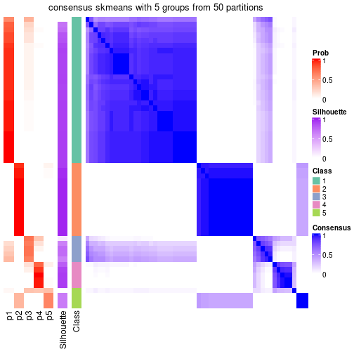</p>

</div>
<div id='tab-node-02-consensus-heatmap-5'>
<pre><code class="r">consensus_heatmap(res, k = 6)
</code></pre>

<p></p>

</div>
<div id='tab-node-02-consensus-heatmap-6'>
<pre><code class="r">consensus_heatmap(res, k = 7)
</code></pre>

<p></p>

</div>
<div id='tab-node-02-consensus-heatmap-7'>
<pre><code class="r">consensus_heatmap(res, k = 8)
</code></pre>

<p></p>

</div>
</div>

Heatmaps for the membership of samples in all partitions to see how consistent they are:


<script>
$( function() {
	$( '#tabs-node-02-membership-heatmap' ).tabs();
} );
</script>
<div id='tabs-node-02-membership-heatmap'>
<ul>
<li><a href='#tab-node-02-membership-heatmap-1'>k = 2</a></li>
<li><a href='#tab-node-02-membership-heatmap-2'>k = 3</a></li>
<li><a href='#tab-node-02-membership-heatmap-3'>k = 4</a></li>
<li><a href='#tab-node-02-membership-heatmap-4'>k = 5</a></li>
<li><a href='#tab-node-02-membership-heatmap-5'>k = 6</a></li>
<li><a href='#tab-node-02-membership-heatmap-6'>k = 7</a></li>
<li><a href='#tab-node-02-membership-heatmap-7'>k = 8</a></li>
</ul>
<div id='tab-node-02-membership-heatmap-1'>
<pre><code class="r">membership_heatmap(res, k = 2)
</code></pre>

<p></p>

</div>
<div id='tab-node-02-membership-heatmap-2'>
<pre><code class="r">membership_heatmap(res, k = 3)
</code></pre>

<p></p>

</div>
<div id='tab-node-02-membership-heatmap-3'>
<pre><code class="r">membership_heatmap(res, k = 4)
</code></pre>

<p></p>

</div>
<div id='tab-node-02-membership-heatmap-4'>
<pre><code class="r">membership_heatmap(res, k = 5)
</code></pre>

<p></p>

</div>
<div id='tab-node-02-membership-heatmap-5'>
<pre><code class="r">membership_heatmap(res, k = 6)
</code></pre>

<p></p>

</div>
<div id='tab-node-02-membership-heatmap-6'>
<pre><code class="r">membership_heatmap(res, k = 7)
</code></pre>

<p></p>

</div>
<div id='tab-node-02-membership-heatmap-7'>
<pre><code class="r">membership_heatmap(res, k = 8)
</code></pre>

<p></p>

</div>
</div>

As soon as the classes for columns are determined, the signatures
that are significantly different between subgroups can be looked for. 
Following are the heatmaps for signatures.


<script>
$( function() {
	$( '#tabs-node-02-get-signatures' ).tabs();
} );
</script>
<div id='tabs-node-02-get-signatures'>
<ul>
<li><a href='#tab-node-02-get-signatures-1'>k = 2</a></li>
<li><a href='#tab-node-02-get-signatures-2'>k = 3</a></li>
<li><a href='#tab-node-02-get-signatures-3'>k = 4</a></li>
<li><a href='#tab-node-02-get-signatures-4'>k = 5</a></li>
<li><a href='#tab-node-02-get-signatures-5'>k = 6</a></li>
<li><a href='#tab-node-02-get-signatures-6'>k = 7</a></li>
<li><a href='#tab-node-02-get-signatures-7'>k = 8</a></li>
</ul>
<div id='tab-node-02-get-signatures-1'>
<pre><code class="r">get_signatures(res, k = 2)
</code></pre>

<p></p>

</div>
<div id='tab-node-02-get-signatures-2'>
<pre><code class="r">get_signatures(res, k = 3)
</code></pre>

<p></p>

</div>
<div id='tab-node-02-get-signatures-3'>
<pre><code class="r">get_signatures(res, k = 4)
</code></pre>

<p></p>

</div>
<div id='tab-node-02-get-signatures-4'>
<pre><code class="r">get_signatures(res, k = 5)
</code></pre>

<p></p>

</div>
<div id='tab-node-02-get-signatures-5'>
<pre><code class="r">get_signatures(res, k = 6)
</code></pre>

<p></p>

</div>
<div id='tab-node-02-get-signatures-6'>
<pre><code class="r">get_signatures(res, k = 7)
</code></pre>

<p></p>

</div>
<div id='tab-node-02-get-signatures-7'>
<pre><code class="r">get_signatures(res, k = 8)
</code></pre>

<p></p>

</div>
</div>


Compare the overlap of signatures from different k:

```r
compare_signatures(res)
```


`get_signature()` returns a data frame invisibly. To get the list of signatures, the function
call should be assigned to a variable explicitly. In following code, if `plot` argument is set
to `FALSE`, no heatmap is plotted while only the differential analysis is performed.

```r
# code only for demonstration
tb = get_signature(res, k = ..., plot = FALSE)
```

An example of the output of `tb` is:

```
#>   which_row         fdr    mean_1    mean_2 scaled_mean_1 scaled_mean_2 km
#> 1        38 0.042760348  8.373488  9.131774    -0.5533452     0.5164555  1
#> 2        40 0.018707592  7.106213  8.469186    -0.6173731     0.5762149  1
#> 3        55 0.019134737 10.221463 11.207825    -0.6159697     0.5749050  1
#> 4        59 0.006059896  5.921854  7.869574    -0.6899429     0.6439467  1
#> 5        60 0.018055526  8.928898 10.211722    -0.6204761     0.5791110  1
#> 6        98 0.009384629 15.714769 14.887706     0.6635654    -0.6193277  2
...
```

The columns in `tb` are:

1. `which_row`: row indices corresponding to the input matrix.
2. `fdr`: FDR for the differential test. 
3. `mean_x`: The mean value in group x.
4. `scaled_mean_x`: The mean value in group x after rows are scaled.
5. `km`: Row groups if k-means clustering is applied to rows (which is done by automatically selecting number of clusters).

If there are too many signatures, `top_signatures = ...` can be set to only show the 
signatures with the highest FDRs:

```r
# code only for demonstration
# e.g. to show the top 500 most significant rows
tb = get_signature(res, k = ..., top_signatures = 500)
```

If the signatures are defined as these which are uniquely high in current group, `diff_method` argument
can be set to `"uniquely_high_in_one_group"`:

```r
# code only for demonstration
tb = get_signature(res, k = ..., diff_method = "uniquely_high_in_one_group")
```


UMAP plot which shows how samples are separated.


<script>
$( function() {
	$( '#tabs-node-02-dimension-reduction' ).tabs();
} );
</script>
<div id='tabs-node-02-dimension-reduction'>
<ul>
<li><a href='#tab-node-02-dimension-reduction-1'>k = 2</a></li>
<li><a href='#tab-node-02-dimension-reduction-2'>k = 3</a></li>
<li><a href='#tab-node-02-dimension-reduction-3'>k = 4</a></li>
<li><a href='#tab-node-02-dimension-reduction-4'>k = 5</a></li>
<li><a href='#tab-node-02-dimension-reduction-5'>k = 6</a></li>
<li><a href='#tab-node-02-dimension-reduction-6'>k = 7</a></li>
<li><a href='#tab-node-02-dimension-reduction-7'>k = 8</a></li>
</ul>
<div id='tab-node-02-dimension-reduction-1'>
<pre><code class="r">dimension_reduction(res, k = 2, method = &quot;UMAP&quot;)
</code></pre>

<p></p>

</div>
<div id='tab-node-02-dimension-reduction-2'>
<pre><code class="r">dimension_reduction(res, k = 3, method = &quot;UMAP&quot;)
</code></pre>

<p></p>

</div>
<div id='tab-node-02-dimension-reduction-3'>
<pre><code class="r">dimension_reduction(res, k = 4, method = &quot;UMAP&quot;)
</code></pre>

<p></p>

</div>
<div id='tab-node-02-dimension-reduction-4'>
<pre><code class="r">dimension_reduction(res, k = 5, method = &quot;UMAP&quot;)
</code></pre>

<p></p>

</div>
<div id='tab-node-02-dimension-reduction-5'>
<pre><code class="r">dimension_reduction(res, k = 6, method = &quot;UMAP&quot;)
</code></pre>

<p></p>

</div>
<div id='tab-node-02-dimension-reduction-6'>
<pre><code class="r">dimension_reduction(res, k = 7, method = &quot;UMAP&quot;)
</code></pre>

<p></p>

</div>
<div id='tab-node-02-dimension-reduction-7'>
<pre><code class="r">dimension_reduction(res, k = 8, method = &quot;UMAP&quot;)
</code></pre>

<p></p>

</div>
</div>


Following heatmap shows how subgroups are split when increasing `k`:

```r
collect_classes(res)
```


If matrix rows can be associated to genes, consider to use `functional_enrichment(res,
...)` to perform function enrichment for the signature genes. See [this vignette](https://jokergoo.github.io/cola_vignettes/functional_enrichment.html) for more detailed explanations.


 

---------------------------------------------------


### Node022


Parent node: [Node02](#Node02).
Child nodes: 
                Node0121-leaf
        ,
                Node0122-leaf
        ,
                Node0123-leaf
        ,
                Node0124-leaf
        ,
                [Node0131](#Node0131)
        ,
                Node0132-leaf
        ,
                Node0221-leaf
        ,
                Node0222-leaf
        ,
                Node0223-leaf
        ,
                [Node0311](#Node0311)
        ,
                Node0312-leaf
        ,
                Node0313-leaf
        ,
                Node0321-leaf
        ,
                Node0322-leaf
        ,
                Node0431-leaf
        ,
                Node0432-leaf
        ,
                Node0433-leaf
        ,
                Node0511-leaf
        ,
                Node0512-leaf
        ,
                Node0513-leaf
        ,
                Node0521-leaf
        ,
                Node0522-leaf
        ,
                Node0523-leaf
        ,
                Node0531-leaf
        ,
                Node0532-leaf
        ,
                Node0533-leaf
        .


The object with results only for a single top-value method and a single partitioning method 
can be extracted as:

```r
res = res_rh["022"]
```

A summary of `res` and all the functions that can be applied to it:

```r
res
```

```
#> A 'ConsensusPartition' object with k = 2, 3, 4, 5, 6, 7, 8.
#>   On a matrix with 30000 rows and 17 columns.
#>   Top rows (1000) are extracted by 'SD' method.
#>   Subgroups are detected by 'kmeans' method.
#>   Performed in total 350 partitions by row resampling.
#>   Best k for subgroups seems to be 4.
#> 
#> Following methods can be applied to this 'ConsensusPartition' object:
#>  [1] "cola_report"             "collect_classes"         "collect_plots"          
#>  [4] "collect_stats"           "colnames"                "compare_partitions"     
#>  [7] "compare_signatures"      "consensus_heatmap"       "dimension_reduction"    
#> [10] "functional_enrichment"   "get_anno_col"            "get_anno"               
#> [13] "get_classes"             "get_consensus"           "get_matrix"             
#> [16] "get_membership"          "get_param"               "get_signatures"         
#> [19] "get_stats"               "is_best_k"               "is_stable_k"            
#> [22] "membership_heatmap"      "ncol"                    "nrow"                   
#> [25] "plot_ecdf"               "predict_classes"         "rownames"               
#> [28] "select_partition_number" "show"                    "suggest_best_k"         
#> [31] "test_to_known_factors"   "top_rows_heatmap"
```

`collect_plots()` function collects all the plots made from `res` for all `k` (number of subgroups)
into one single page to provide an easy and fast comparison between different `k`.

```r
collect_plots(res)
```


The plots are:

- The first row: a plot of the eCDF (empirical cumulative distribution
  function) curves of the consensus matrix for each `k` and the heatmap of
  predicted classes for each `k`.
- The second row: heatmaps of the consensus matrix for each `k`.
- The third row: heatmaps of the membership matrix for each `k`.
- The fouth row: heatmaps of the signatures for each `k`.

All the plots in panels can be made by individual functions and they are
plotted later in this section.

`select_partition_number()` produces several plots showing different
statistics for choosing "optimized" `k`. There are following statistics:

- eCDF curves of the consensus matrix for each `k`;
- 1-PAC. [The PAC score](https://en.wikipedia.org/wiki/Consensus_clustering#Over-interpretation_potential_of_consensus_clustering)
  measures the proportion of the ambiguous subgrouping.
- Mean silhouette score.
- Concordance. The mean probability of fiting the consensus subgroup labels in all
  partitions.
- Area increased. Denote $A_k$ as the area under the eCDF curve for current
  `k`, the area increased is defined as $A_k - A_{k-1}$.
- Rand index. The percent of pairs of samples that are both in a same cluster
  or both are not in a same cluster in the partition of k and k-1.
- Jaccard index. The ratio of pairs of samples are both in a same cluster in
  the partition of k and k-1 and the pairs of samples are both in a same
  cluster in the partition k or k-1.

The detailed explanations of these statistics can be found in [the _cola_
vignette](https://jokergoo.github.io/cola_vignettes/cola.html#toc_13).

Generally speaking, higher 1-PAC score, higher mean silhouette score or higher
concordance corresponds to better partition. Rand index and Jaccard index
measure how similar the current partition is compared to partition with `k-1`.
If they are too similar, we won't accept `k` is better than `k-1`.

```r
select_partition_number(res)
```


The numeric values for all these statistics can be obtained by `get_stats()`.

```r
get_stats(res)
```

```
#>   k 1-PAC mean_silhouette concordance area_increased  Rand Jaccard
#> 2 2 0.779           0.897       0.951         0.3862 0.559   0.559
#> 3 3 0.904           0.979       0.985         0.2888 0.956   0.921
#> 4 4 0.838           0.855       0.959         0.2872 0.772   0.575
#> 5 5 0.721           0.766       0.938         0.1629 0.743   0.386
#> 6 6 0.743           0.612       0.835         0.0752 0.853   0.474
#> 7 7 0.838           0.670       0.868         0.0625 0.941   0.704
#> 8 8 0.831           0.607       0.852         0.0463 0.919   0.542
```

`suggest_best_k()` suggests the best $k$ based on these statistics. The rules are as follows:

- All $k$ with Jaccard index larger than 0.95 are removed because increasing
  $k$ does not provide enough extra information. If all $k$ are removed, it is
  marked as no subgroup is detected.
- For all $k$ with 1-PAC score larger than 0.9, the maximal $k$ is taken as
  the best $k$, and other $k$ are marked as optional $k$.
- If it does not fit the second rule. The $k$ with the maximal vote of the
  highest 1-PAC score, highest mean silhouette, and highest concordance is
  taken as the best $k$.

```r
suggest_best_k(res)
```

```
#> [1] 4
```


Following is the table of the partitions (You need to click the **show/hide
code output** link to see it). The membership matrix (columns with name `p*`)
is inferred by
[`clue::cl_consensus()`](https://www.rdocumentation.org/link/cl_consensus?package=clue)
function with the `SE` method. Basically the value in the membership matrix
represents the probability to belong to a certain group. The finall subgroup
label for an item is determined with the group with highest probability it
belongs to.

In `get_classes()` function, the entropy is calculated from the membership
matrix and the silhouette score is calculated from the consensus matrix.


<script>
$( function() {
	$( '#tabs-node-022-get-classes' ).tabs();
} );
</script>
<div id='tabs-node-022-get-classes'>
<ul>
<li><a href='#tab-node-022-get-classes-1'>k = 2</a></li>
<li><a href='#tab-node-022-get-classes-2'>k = 3</a></li>
<li><a href='#tab-node-022-get-classes-3'>k = 4</a></li>
<li><a href='#tab-node-022-get-classes-4'>k = 5</a></li>
<li><a href='#tab-node-022-get-classes-5'>k = 6</a></li>
<li><a href='#tab-node-022-get-classes-6'>k = 7</a></li>
<li><a href='#tab-node-022-get-classes-7'>k = 8</a></li>
</ul>

<div id='tab-node-022-get-classes-1'>
<p><a id='tab-node-022-get-classes-1-a' style='color:#0366d6' href='#'>show/hide code output</a></p>
<pre><code class="r">cbind(get_classes(res, k = 2), get_membership(res, k = 2))
</code></pre>

<pre><code>#&gt;                 class entropy silhouette   p1   p2
#&gt; TCGA.BQ.5884.11     1   0.000      1.000 1.00 0.00
#&gt; TCGA.BQ.5891.11     1   0.000      1.000 1.00 0.00
#&gt; TCGA.BQ.5888.11     1   0.000      1.000 1.00 0.00
#&gt; TCGA.5P.A9K8.01     2   0.981      0.457 0.42 0.58
#&gt; TCGA.BQ.5883.11     1   0.000      1.000 1.00 0.00
#&gt; TCGA.BQ.5878.11     1   0.000      1.000 1.00 0.00
#&gt; TCGA.BQ.5879.11     1   0.000      1.000 1.00 0.00
#&gt; TCGA.2Z.A9JN.01     2   0.000      0.777 0.00 1.00
#&gt; TCGA.BQ.5875.11     1   0.000      1.000 1.00 0.00
#&gt; TCGA.BQ.5883.01     2   0.000      0.777 0.00 1.00
#&gt; TCGA.BQ.7053.11     1   0.000      1.000 1.00 0.00
#&gt; TCGA.DZ.6133.11     1   0.000      1.000 1.00 0.00
#&gt; TCGA.BQ.7056.11     1   0.000      1.000 1.00 0.00
#&gt; TCGA.A4.7288.11     1   0.000      1.000 1.00 0.00
#&gt; TCGA.BQ.7061.11     2   0.981      0.457 0.42 0.58
#&gt; TCGA.BQ.7050.11     1   0.000      1.000 1.00 0.00
#&gt; TCGA.A4.7828.01     2   0.000      0.777 0.00 1.00
</code></pre>

<script>
$('#tab-node-022-get-classes-1-a').parent().next().next().hide();
$('#tab-node-022-get-classes-1-a').click(function(){
  $('#tab-node-022-get-classes-1-a').parent().next().next().toggle();
  return(false);
});
</script>
</div>

<div id='tab-node-022-get-classes-2'>
<p><a id='tab-node-022-get-classes-2-a' style='color:#0366d6' href='#'>show/hide code output</a></p>
<pre><code class="r">cbind(get_classes(res, k = 3), get_membership(res, k = 3))
</code></pre>

<pre><code>#&gt;                 class entropy silhouette   p1   p2   p3
#&gt; TCGA.BQ.5884.11     1  0.0892      0.978 0.98 0.00 0.02
#&gt; TCGA.BQ.5891.11     1  0.0000      0.980 1.00 0.00 0.00
#&gt; TCGA.BQ.5888.11     1  0.3340      0.862 0.88 0.00 0.12
#&gt; TCGA.5P.A9K8.01     3  0.0892      1.000 0.00 0.02 0.98
#&gt; TCGA.BQ.5883.11     1  0.0892      0.978 0.98 0.00 0.02
#&gt; TCGA.BQ.5878.11     1  0.0000      0.980 1.00 0.00 0.00
#&gt; TCGA.BQ.5879.11     1  0.0892      0.978 0.98 0.00 0.02
#&gt; TCGA.2Z.A9JN.01     2  0.0000      1.000 0.00 1.00 0.00
#&gt; TCGA.BQ.5875.11     1  0.0000      0.980 1.00 0.00 0.00
#&gt; TCGA.BQ.5883.01     2  0.0000      1.000 0.00 1.00 0.00
#&gt; TCGA.BQ.7053.11     1  0.0892      0.978 0.98 0.00 0.02
#&gt; TCGA.DZ.6133.11     1  0.0000      0.980 1.00 0.00 0.00
#&gt; TCGA.BQ.7056.11     1  0.0000      0.980 1.00 0.00 0.00
#&gt; TCGA.A4.7288.11     1  0.0000      0.980 1.00 0.00 0.00
#&gt; TCGA.BQ.7061.11     3  0.0892      1.000 0.00 0.02 0.98
#&gt; TCGA.BQ.7050.11     1  0.0892      0.978 0.98 0.00 0.02
#&gt; TCGA.A4.7828.01     2  0.0000      1.000 0.00 1.00 0.00
</code></pre>

<script>
$('#tab-node-022-get-classes-2-a').parent().next().next().hide();
$('#tab-node-022-get-classes-2-a').click(function(){
  $('#tab-node-022-get-classes-2-a').parent().next().next().toggle();
  return(false);
});
</script>
</div>

<div id='tab-node-022-get-classes-3'>
<p><a id='tab-node-022-get-classes-3-a' style='color:#0366d6' href='#'>show/hide code output</a></p>
<pre><code class="r">cbind(get_classes(res, k = 4), get_membership(res, k = 4))
</code></pre>

<pre><code>#&gt;                 class entropy silhouette   p1   p2   p3   p4
#&gt; TCGA.BQ.5884.11     1  0.0000      0.988 1.00 0.00 0.00 0.00
#&gt; TCGA.BQ.5891.11     3  0.4277      0.699 0.28 0.00 0.72 0.00
#&gt; TCGA.BQ.5888.11     3  0.0707      0.666 0.02 0.00 0.98 0.00
#&gt; TCGA.5P.A9K8.01     4  0.0000      0.000 0.00 0.00 0.00 1.00
#&gt; TCGA.BQ.5883.11     1  0.0000      0.988 1.00 0.00 0.00 0.00
#&gt; TCGA.BQ.5878.11     1  0.0707      0.985 0.98 0.00 0.02 0.00
#&gt; TCGA.BQ.5879.11     1  0.0000      0.988 1.00 0.00 0.00 0.00
#&gt; TCGA.2Z.A9JN.01     2  0.0000      0.990 0.00 1.00 0.00 0.00
#&gt; TCGA.BQ.5875.11     3  0.4277      0.699 0.28 0.00 0.72 0.00
#&gt; TCGA.BQ.5883.01     2  0.0000      0.990 0.00 1.00 0.00 0.00
#&gt; TCGA.BQ.7053.11     1  0.0000      0.988 1.00 0.00 0.00 0.00
#&gt; TCGA.DZ.6133.11     1  0.0707      0.985 0.98 0.00 0.02 0.00
#&gt; TCGA.BQ.7056.11     1  0.0707      0.985 0.98 0.00 0.02 0.00
#&gt; TCGA.A4.7288.11     1  0.0707      0.985 0.98 0.00 0.02 0.00
#&gt; TCGA.BQ.7061.11     3  0.0707      0.626 0.00 0.00 0.98 0.02
#&gt; TCGA.BQ.7050.11     1  0.0000      0.988 1.00 0.00 0.00 0.00
#&gt; TCGA.A4.7828.01     2  0.0707      0.980 0.00 0.98 0.02 0.00
</code></pre>

<script>
$('#tab-node-022-get-classes-3-a').parent().next().next().hide();
$('#tab-node-022-get-classes-3-a').click(function(){
  $('#tab-node-022-get-classes-3-a').parent().next().next().toggle();
  return(false);
});
</script>
</div>

<div id='tab-node-022-get-classes-4'>
<p><a id='tab-node-022-get-classes-4-a' style='color:#0366d6' href='#'>show/hide code output</a></p>
<pre><code class="r">cbind(get_classes(res, k = 5), get_membership(res, k = 5))
</code></pre>

<pre><code>#&gt;                 class entropy silhouette   p1   p2   p3 p4   p5
#&gt; TCGA.BQ.5884.11     1  0.0000      0.993 1.00 0.00 0.00  0 0.00
#&gt; TCGA.BQ.5891.11     3  0.0000      0.826 0.00 0.00 1.00  0 0.00
#&gt; TCGA.BQ.5888.11     3  0.0000      0.826 0.00 0.00 1.00  0 0.00
#&gt; TCGA.5P.A9K8.01     4  0.0000      0.000 0.00 0.00 0.00  1 0.00
#&gt; TCGA.BQ.5883.11     1  0.0000      0.993 1.00 0.00 0.00  0 0.00
#&gt; TCGA.BQ.5878.11     3  0.2280      0.849 0.12 0.00 0.88  0 0.00
#&gt; TCGA.BQ.5879.11     1  0.0609      0.972 0.98 0.00 0.02  0 0.00
#&gt; TCGA.2Z.A9JN.01     2  0.0000      0.913 0.00 1.00 0.00  0 0.00
#&gt; TCGA.BQ.5875.11     3  0.0000      0.826 0.00 0.00 1.00  0 0.00
#&gt; TCGA.BQ.5883.01     2  0.0000      0.913 0.00 1.00 0.00  0 0.00
#&gt; TCGA.BQ.7053.11     1  0.0000      0.993 1.00 0.00 0.00  0 0.00
#&gt; TCGA.DZ.6133.11     3  0.4227      0.411 0.42 0.00 0.58  0 0.00
#&gt; TCGA.BQ.7056.11     3  0.2280      0.849 0.12 0.00 0.88  0 0.00
#&gt; TCGA.A4.7288.11     3  0.2280      0.849 0.12 0.00 0.88  0 0.00
#&gt; TCGA.BQ.7061.11     5  0.1732      0.000 0.00 0.00 0.08  0 0.92
#&gt; TCGA.BQ.7050.11     1  0.0000      0.993 1.00 0.00 0.00  0 0.00
#&gt; TCGA.A4.7828.01     2  0.2929      0.810 0.00 0.82 0.00  0 0.18
</code></pre>

<script>
$('#tab-node-022-get-classes-4-a').parent().next().next().hide();
$('#tab-node-022-get-classes-4-a').click(function(){
  $('#tab-node-022-get-classes-4-a').parent().next().next().toggle();
  return(false);
});
</script>
</div>

<div id='tab-node-022-get-classes-5'>
<p><a id='tab-node-022-get-classes-5-a' style='color:#0366d6' href='#'>show/hide code output</a></p>
<pre><code class="r">cbind(get_classes(res, k = 6), get_membership(res, k = 6))
</code></pre>

<pre><code>#&gt;                 class entropy silhouette   p1   p2   p3 p4   p5   p6
#&gt; TCGA.BQ.5884.11     1  0.0547     0.8237 0.98 0.00 0.02  0 0.00 0.00
#&gt; TCGA.BQ.5891.11     6  0.4246     0.9577 0.02 0.00 0.40  0 0.00 0.58
#&gt; TCGA.BQ.5888.11     6  0.3797     0.9788 0.00 0.00 0.42  0 0.00 0.58
#&gt; TCGA.5P.A9K8.01     4  0.0000     0.0000 0.00 0.00 0.00  1 0.00 0.00
#&gt; TCGA.BQ.5883.11     1  0.0547     0.8237 0.98 0.00 0.02  0 0.00 0.00
#&gt; TCGA.BQ.5878.11     3  0.0000     0.6763 0.00 0.00 1.00  0 0.00 0.00
#&gt; TCGA.BQ.5879.11     3  0.3828     0.0156 0.44 0.00 0.56  0 0.00 0.00
#&gt; TCGA.2Z.A9JN.01     2  0.0000     0.8009 0.00 1.00 0.00  0 0.00 0.00
#&gt; TCGA.BQ.5875.11     6  0.3797     0.9788 0.00 0.00 0.42  0 0.00 0.58
#&gt; TCGA.BQ.5883.01     2  0.0000     0.8009 0.00 1.00 0.00  0 0.00 0.00
#&gt; TCGA.BQ.7053.11     1  0.0547     0.8237 0.98 0.00 0.02  0 0.00 0.00
#&gt; TCGA.DZ.6133.11     3  0.2793     0.6293 0.20 0.00 0.80  0 0.00 0.00
#&gt; TCGA.BQ.7056.11     3  0.0000     0.6763 0.00 0.00 1.00  0 0.00 0.00
#&gt; TCGA.A4.7288.11     3  0.0547     0.6889 0.02 0.00 0.98  0 0.00 0.00
#&gt; TCGA.BQ.7061.11     5  0.3797     0.0000 0.00 0.00 0.00  0 0.58 0.42
#&gt; TCGA.BQ.7050.11     1  0.3756     0.1751 0.60 0.00 0.40  0 0.00 0.00
#&gt; TCGA.A4.7828.01     2  0.3797     0.5550 0.00 0.58 0.00  0 0.42 0.00
</code></pre>

<script>
$('#tab-node-022-get-classes-5-a').parent().next().next().hide();
$('#tab-node-022-get-classes-5-a').click(function(){
  $('#tab-node-022-get-classes-5-a').parent().next().next().toggle();
  return(false);
});
</script>
</div>

<div id='tab-node-022-get-classes-6'>
<p><a id='tab-node-022-get-classes-6-a' style='color:#0366d6' href='#'>show/hide code output</a></p>
<pre><code class="r">cbind(get_classes(res, k = 7), get_membership(res, k = 7))
</code></pre>

<pre><code>#&gt;                 class entropy silhouette   p1   p2   p3   p4 p5   p6 p7
#&gt; TCGA.BQ.5884.11     1  0.0504      0.949 0.98 0.00 0.00 0.02  0 0.00  0
#&gt; TCGA.BQ.5891.11     6  0.3911      0.766 0.00 0.00 0.06 0.24  0 0.70  0
#&gt; TCGA.BQ.5888.11     6  0.1166      0.890 0.00 0.00 0.06 0.00  0 0.94  0
#&gt; TCGA.5P.A9K8.01     7  0.0000      0.000 0.00 0.00 0.00 0.00  0 0.00  1
#&gt; TCGA.BQ.5883.11     1  0.0863      0.934 0.96 0.00 0.00 0.04  0 0.00  0
#&gt; TCGA.BQ.5878.11     3  0.0504      0.763 0.00 0.00 0.98 0.00  0 0.02  0
#&gt; TCGA.BQ.5879.11     3  0.4429      0.670 0.12 0.00 0.66 0.22  0 0.00  0
#&gt; TCGA.2Z.A9JN.01     2  0.3558      0.751 0.00 0.52 0.00 0.48  0 0.00  0
#&gt; TCGA.BQ.5875.11     6  0.1166      0.890 0.00 0.00 0.06 0.00  0 0.94  0
#&gt; TCGA.BQ.5883.01     2  0.4487      0.751 0.00 0.52 0.00 0.42  0 0.06  0
#&gt; TCGA.BQ.7053.11     1  0.0863      0.941 0.96 0.00 0.00 0.04  0 0.00  0
#&gt; TCGA.DZ.6133.11     3  0.1006      0.765 0.02 0.00 0.96 0.02  0 0.00  0
#&gt; TCGA.BQ.7056.11     3  0.0504      0.763 0.00 0.00 0.98 0.00  0 0.02  0
#&gt; TCGA.A4.7288.11     3  0.2745      0.749 0.00 0.00 0.82 0.16  0 0.02  0
#&gt; TCGA.BQ.7061.11     5  0.0000      0.000 0.00 0.00 0.00 0.00  1 0.00  0
#&gt; TCGA.BQ.7050.11     3  0.5517      0.311 0.34 0.00 0.42 0.24  0 0.00  0
#&gt; TCGA.A4.7828.01     2  0.0000      0.499 0.00 1.00 0.00 0.00  0 0.00  0
</code></pre>

<script>
$('#tab-node-022-get-classes-6-a').parent().next().next().hide();
$('#tab-node-022-get-classes-6-a').click(function(){
  $('#tab-node-022-get-classes-6-a').parent().next().next().toggle();
  return(false);
});
</script>
</div>

<div id='tab-node-022-get-classes-7'>
<p><a id='tab-node-022-get-classes-7-a' style='color:#0366d6' href='#'>show/hide code output</a></p>
<pre><code class="r">cbind(get_classes(res, k = 8), get_membership(res, k = 8))
</code></pre>

<pre><code>#&gt;                 class entropy silhouette   p1   p2   p3   p4   p5   p6 p7   p8
#&gt; TCGA.BQ.5884.11     1  0.0808      0.869 0.96 0.00 0.00 0.00 0.00 0.00  0 0.04
#&gt; TCGA.BQ.5891.11     4  0.0471      0.000 0.00 0.00 0.02 0.98 0.00 0.00  0 0.00
#&gt; TCGA.BQ.5888.11     6  0.3942      0.847 0.00 0.00 0.02 0.34 0.02 0.62  0 0.00
#&gt; TCGA.5P.A9K8.01     7  0.0000      0.000 0.00 0.00 0.00 0.00 0.00 0.00  1 0.00
#&gt; TCGA.BQ.5883.11     1  0.0000      0.858 1.00 0.00 0.00 0.00 0.00 0.00  0 0.00
#&gt; TCGA.BQ.5878.11     3  0.0000      0.871 0.00 0.00 1.00 0.00 0.00 0.00  0 0.00
#&gt; TCGA.BQ.5879.11     8  0.3449      0.637 0.00 0.00 0.32 0.00 0.00 0.02  0 0.66
#&gt; TCGA.2Z.A9JN.01     2  0.0000      0.758 0.00 1.00 0.00 0.00 0.00 0.00  0 0.00
#&gt; TCGA.BQ.5875.11     6  0.5171      0.845 0.06 0.00 0.04 0.34 0.00 0.54  0 0.02
#&gt; TCGA.BQ.5883.01     2  0.0808      0.758 0.00 0.96 0.00 0.00 0.00 0.00  0 0.04
#&gt; TCGA.BQ.7053.11     1  0.3303      0.764 0.76 0.00 0.00 0.02 0.00 0.02  0 0.20
#&gt; TCGA.DZ.6133.11     3  0.2224      0.744 0.00 0.00 0.86 0.00 0.00 0.02  0 0.12
#&gt; TCGA.BQ.7056.11     3  0.0471      0.863 0.00 0.00 0.98 0.00 0.00 0.00  0 0.02
#&gt; TCGA.A4.7288.11     8  0.3333      0.431 0.00 0.00 0.50 0.00 0.00 0.00  0 0.50
#&gt; TCGA.BQ.7061.11     5  0.0000      0.000 0.00 0.00 0.00 0.00 1.00 0.00  0 0.00
#&gt; TCGA.BQ.7050.11     8  0.3054      0.587 0.08 0.00 0.12 0.00 0.00 0.00  0 0.80
#&gt; TCGA.A4.7828.01     2  0.4723      0.492 0.00 0.52 0.00 0.00 0.00 0.34  0 0.14
</code></pre>

<script>
$('#tab-node-022-get-classes-7-a').parent().next().next().hide();
$('#tab-node-022-get-classes-7-a').click(function(){
  $('#tab-node-022-get-classes-7-a').parent().next().next().toggle();
  return(false);
});
</script>
</div>
</div>

Heatmaps for the consensus matrix. It visualizes the probability of two
samples to be in a same group.


<script>
$( function() {
	$( '#tabs-node-022-consensus-heatmap' ).tabs();
} );
</script>
<div id='tabs-node-022-consensus-heatmap'>
<ul>
<li><a href='#tab-node-022-consensus-heatmap-1'>k = 2</a></li>
<li><a href='#tab-node-022-consensus-heatmap-2'>k = 3</a></li>
<li><a href='#tab-node-022-consensus-heatmap-3'>k = 4</a></li>
<li><a href='#tab-node-022-consensus-heatmap-4'>k = 5</a></li>
<li><a href='#tab-node-022-consensus-heatmap-5'>k = 6</a></li>
<li><a href='#tab-node-022-consensus-heatmap-6'>k = 7</a></li>
<li><a href='#tab-node-022-consensus-heatmap-7'>k = 8</a></li>
</ul>
<div id='tab-node-022-consensus-heatmap-1'>
<pre><code class="r">consensus_heatmap(res, k = 2)
</code></pre>

<p></p>

</div>
<div id='tab-node-022-consensus-heatmap-2'>
<pre><code class="r">consensus_heatmap(res, k = 3)
</code></pre>

<p></p>

</div>
<div id='tab-node-022-consensus-heatmap-3'>
<pre><code class="r">consensus_heatmap(res, k = 4)
</code></pre>

<p></p>

</div>
<div id='tab-node-022-consensus-heatmap-4'>
<pre><code class="r">consensus_heatmap(res, k = 5)
</code></pre>

<p></p>

</div>
<div id='tab-node-022-consensus-heatmap-5'>
<pre><code class="r">consensus_heatmap(res, k = 6)
</code></pre>

<p></p>

</div>
<div id='tab-node-022-consensus-heatmap-6'>
<pre><code class="r">consensus_heatmap(res, k = 7)
</code></pre>

<p></p>

</div>
<div id='tab-node-022-consensus-heatmap-7'>
<pre><code class="r">consensus_heatmap(res, k = 8)
</code></pre>

<p></p>

</div>
</div>

Heatmaps for the membership of samples in all partitions to see how consistent they are:


<script>
$( function() {
	$( '#tabs-node-022-membership-heatmap' ).tabs();
} );
</script>
<div id='tabs-node-022-membership-heatmap'>
<ul>
<li><a href='#tab-node-022-membership-heatmap-1'>k = 2</a></li>
<li><a href='#tab-node-022-membership-heatmap-2'>k = 3</a></li>
<li><a href='#tab-node-022-membership-heatmap-3'>k = 4</a></li>
<li><a href='#tab-node-022-membership-heatmap-4'>k = 5</a></li>
<li><a href='#tab-node-022-membership-heatmap-5'>k = 6</a></li>
<li><a href='#tab-node-022-membership-heatmap-6'>k = 7</a></li>
<li><a href='#tab-node-022-membership-heatmap-7'>k = 8</a></li>
</ul>
<div id='tab-node-022-membership-heatmap-1'>
<pre><code class="r">membership_heatmap(res, k = 2)
</code></pre>

<p></p>

</div>
<div id='tab-node-022-membership-heatmap-2'>
<pre><code class="r">membership_heatmap(res, k = 3)
</code></pre>

<p></p>

</div>
<div id='tab-node-022-membership-heatmap-3'>
<pre><code class="r">membership_heatmap(res, k = 4)
</code></pre>

<p></p>

</div>
<div id='tab-node-022-membership-heatmap-4'>
<pre><code class="r">membership_heatmap(res, k = 5)
</code></pre>

<p></p>

</div>
<div id='tab-node-022-membership-heatmap-5'>
<pre><code class="r">membership_heatmap(res, k = 6)
</code></pre>

<p></p>

</div>
<div id='tab-node-022-membership-heatmap-6'>
<pre><code class="r">membership_heatmap(res, k = 7)
</code></pre>

<p></p>

</div>
<div id='tab-node-022-membership-heatmap-7'>
<pre><code class="r">membership_heatmap(res, k = 8)
</code></pre>

<p></p>

</div>
</div>

As soon as the classes for columns are determined, the signatures
that are significantly different between subgroups can be looked for. 
Following are the heatmaps for signatures.


<script>
$( function() {
	$( '#tabs-node-022-get-signatures' ).tabs();
} );
</script>
<div id='tabs-node-022-get-signatures'>
<ul>
<li><a href='#tab-node-022-get-signatures-1'>k = 2</a></li>
<li><a href='#tab-node-022-get-signatures-2'>k = 3</a></li>
<li><a href='#tab-node-022-get-signatures-3'>k = 4</a></li>
<li><a href='#tab-node-022-get-signatures-4'>k = 5</a></li>
<li><a href='#tab-node-022-get-signatures-5'>k = 6</a></li>
<li><a href='#tab-node-022-get-signatures-6'>k = 7</a></li>
<li><a href='#tab-node-022-get-signatures-7'>k = 8</a></li>
</ul>
<div id='tab-node-022-get-signatures-1'>
<pre><code class="r">get_signatures(res, k = 2)
</code></pre>

<p></p>

</div>
<div id='tab-node-022-get-signatures-2'>
<pre><code class="r">get_signatures(res, k = 3)
</code></pre>

<p></p>

</div>
<div id='tab-node-022-get-signatures-3'>
<pre><code class="r">get_signatures(res, k = 4)
</code></pre>

<p></p>

</div>
<div id='tab-node-022-get-signatures-4'>
<pre><code class="r">get_signatures(res, k = 5)
</code></pre>

<p></p>

</div>
<div id='tab-node-022-get-signatures-5'>
<pre><code class="r">get_signatures(res, k = 6)
</code></pre>

<p></p>

</div>
<div id='tab-node-022-get-signatures-6'>
<pre><code class="r">get_signatures(res, k = 7)
</code></pre>

<p></p>

</div>
<div id='tab-node-022-get-signatures-7'>
<pre><code class="r">get_signatures(res, k = 8)
</code></pre>

<p></p>

</div>
</div>


Compare the overlap of signatures from different k:

```r
compare_signatures(res)
```


`get_signature()` returns a data frame invisibly. To get the list of signatures, the function
call should be assigned to a variable explicitly. In following code, if `plot` argument is set
to `FALSE`, no heatmap is plotted while only the differential analysis is performed.

```r
# code only for demonstration
tb = get_signature(res, k = ..., plot = FALSE)
```

An example of the output of `tb` is:

```
#>   which_row         fdr    mean_1    mean_2 scaled_mean_1 scaled_mean_2 km
#> 1        38 0.042760348  8.373488  9.131774    -0.5533452     0.5164555  1
#> 2        40 0.018707592  7.106213  8.469186    -0.6173731     0.5762149  1
#> 3        55 0.019134737 10.221463 11.207825    -0.6159697     0.5749050  1
#> 4        59 0.006059896  5.921854  7.869574    -0.6899429     0.6439467  1
#> 5        60 0.018055526  8.928898 10.211722    -0.6204761     0.5791110  1
#> 6        98 0.009384629 15.714769 14.887706     0.6635654    -0.6193277  2
...
```

The columns in `tb` are:

1. `which_row`: row indices corresponding to the input matrix.
2. `fdr`: FDR for the differential test. 
3. `mean_x`: The mean value in group x.
4. `scaled_mean_x`: The mean value in group x after rows are scaled.
5. `km`: Row groups if k-means clustering is applied to rows (which is done by automatically selecting number of clusters).

If there are too many signatures, `top_signatures = ...` can be set to only show the 
signatures with the highest FDRs:

```r
# code only for demonstration
# e.g. to show the top 500 most significant rows
tb = get_signature(res, k = ..., top_signatures = 500)
```

If the signatures are defined as these which are uniquely high in current group, `diff_method` argument
can be set to `"uniquely_high_in_one_group"`:

```r
# code only for demonstration
tb = get_signature(res, k = ..., diff_method = "uniquely_high_in_one_group")
```


UMAP plot which shows how samples are separated.


<script>
$( function() {
	$( '#tabs-node-022-dimension-reduction' ).tabs();
} );
</script>
<div id='tabs-node-022-dimension-reduction'>
<ul>
<li><a href='#tab-node-022-dimension-reduction-1'>k = 2</a></li>
<li><a href='#tab-node-022-dimension-reduction-2'>k = 3</a></li>
<li><a href='#tab-node-022-dimension-reduction-3'>k = 4</a></li>
<li><a href='#tab-node-022-dimension-reduction-4'>k = 5</a></li>
<li><a href='#tab-node-022-dimension-reduction-5'>k = 6</a></li>
<li><a href='#tab-node-022-dimension-reduction-6'>k = 7</a></li>
<li><a href='#tab-node-022-dimension-reduction-7'>k = 8</a></li>
</ul>
<div id='tab-node-022-dimension-reduction-1'>
<pre><code class="r">dimension_reduction(res, k = 2, method = &quot;UMAP&quot;)
</code></pre>

<p></p>

</div>
<div id='tab-node-022-dimension-reduction-2'>
<pre><code class="r">dimension_reduction(res, k = 3, method = &quot;UMAP&quot;)
</code></pre>

<p></p>

</div>
<div id='tab-node-022-dimension-reduction-3'>
<pre><code class="r">dimension_reduction(res, k = 4, method = &quot;UMAP&quot;)
</code></pre>

<p></p>

</div>
<div id='tab-node-022-dimension-reduction-4'>
<pre><code class="r">dimension_reduction(res, k = 5, method = &quot;UMAP&quot;)
</code></pre>

<p></p>

</div>
<div id='tab-node-022-dimension-reduction-5'>
<pre><code class="r">dimension_reduction(res, k = 6, method = &quot;UMAP&quot;)
</code></pre>

<p></p>

</div>
<div id='tab-node-022-dimension-reduction-6'>
<pre><code class="r">dimension_reduction(res, k = 7, method = &quot;UMAP&quot;)
</code></pre>

<p></p>

</div>
<div id='tab-node-022-dimension-reduction-7'>
<pre><code class="r">dimension_reduction(res, k = 8, method = &quot;UMAP&quot;)
</code></pre>

<p></p>

</div>
</div>


Following heatmap shows how subgroups are split when increasing `k`:

```r
collect_classes(res)
```


If matrix rows can be associated to genes, consider to use `functional_enrichment(res,
...)` to perform function enrichment for the signature genes. See [this vignette](https://jokergoo.github.io/cola_vignettes/functional_enrichment.html) for more detailed explanations.


 

---------------------------------------------------


### Node03


Parent node: [Node0](#Node0).
Child nodes: 
                Node011-leaf
        ,
                [Node012](#Node012)
        ,
                [Node013](#Node013)
        ,
                Node021-leaf
        ,
                [Node022](#Node022)
        ,
                Node023-leaf
        ,
                [Node031](#Node031)
        ,
                [Node032](#Node032)
        ,
                Node033-leaf
        ,
                Node041-leaf
        ,
                Node042-leaf
        ,
                [Node043](#Node043)
        ,
                Node044-leaf
        ,
                [Node051](#Node051)
        ,
                [Node052](#Node052)
        ,
                [Node053](#Node053)
        ,
                Node054-leaf
        .


The object with results only for a single top-value method and a single partitioning method 
can be extracted as:

```r
res = res_rh["03"]
```

A summary of `res` and all the functions that can be applied to it:

```r
res
```

```
#> A 'ConsensusPartition' object with k = 2, 3, 4, 5, 6, 7, 8.
#>   On a matrix with 30000 rows and 59 columns.
#>   Top rows (1000) are extracted by 'ATC' method.
#>   Subgroups are detected by 'kmeans' method.
#>   Performed in total 350 partitions by row resampling.
#>   Best k for subgroups seems to be 3.
#> 
#> Following methods can be applied to this 'ConsensusPartition' object:
#>  [1] "cola_report"             "collect_classes"         "collect_plots"          
#>  [4] "collect_stats"           "colnames"                "compare_partitions"     
#>  [7] "compare_signatures"      "consensus_heatmap"       "dimension_reduction"    
#> [10] "functional_enrichment"   "get_anno_col"            "get_anno"               
#> [13] "get_classes"             "get_consensus"           "get_matrix"             
#> [16] "get_membership"          "get_param"               "get_signatures"         
#> [19] "get_stats"               "is_best_k"               "is_stable_k"            
#> [22] "membership_heatmap"      "ncol"                    "nrow"                   
#> [25] "plot_ecdf"               "predict_classes"         "rownames"               
#> [28] "select_partition_number" "show"                    "suggest_best_k"         
#> [31] "test_to_known_factors"   "top_rows_heatmap"
```

`collect_plots()` function collects all the plots made from `res` for all `k` (number of subgroups)
into one single page to provide an easy and fast comparison between different `k`.

```r
collect_plots(res)
```

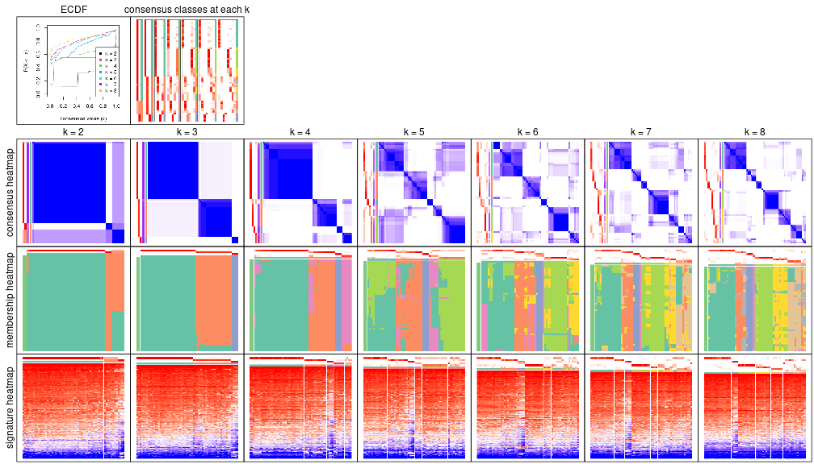

The plots are:

- The first row: a plot of the eCDF (empirical cumulative distribution
  function) curves of the consensus matrix for each `k` and the heatmap of
  predicted classes for each `k`.
- The second row: heatmaps of the consensus matrix for each `k`.
- The third row: heatmaps of the membership matrix for each `k`.
- The fouth row: heatmaps of the signatures for each `k`.

All the plots in panels can be made by individual functions and they are
plotted later in this section.

`select_partition_number()` produces several plots showing different
statistics for choosing "optimized" `k`. There are following statistics:

- eCDF curves of the consensus matrix for each `k`;
- 1-PAC. [The PAC score](https://en.wikipedia.org/wiki/Consensus_clustering#Over-interpretation_potential_of_consensus_clustering)
  measures the proportion of the ambiguous subgrouping.
- Mean silhouette score.
- Concordance. The mean probability of fiting the consensus subgroup labels in all
  partitions.
- Area increased. Denote $A_k$ as the area under the eCDF curve for current
  `k`, the area increased is defined as $A_k - A_{k-1}$.
- Rand index. The percent of pairs of samples that are both in a same cluster
  or both are not in a same cluster in the partition of k and k-1.
- Jaccard index. The ratio of pairs of samples are both in a same cluster in
  the partition of k and k-1 and the pairs of samples are both in a same
  cluster in the partition k or k-1.

The detailed explanations of these statistics can be found in [the _cola_
vignette](https://jokergoo.github.io/cola_vignettes/cola.html#toc_13).

Generally speaking, higher 1-PAC score, higher mean silhouette score or higher
concordance corresponds to better partition. Rand index and Jaccard index
measure how similar the current partition is compared to partition with `k-1`.
If they are too similar, we won't accept `k` is better than `k-1`.

```r
select_partition_number(res)
```


The numeric values for all these statistics can be obtained by `get_stats()`.

```r
get_stats(res)
```

```
#>   k 1-PAC mean_silhouette concordance area_increased  Rand Jaccard
#> 2 2 0.758           0.931       0.940         0.2495 0.670   0.670
#> 3 3 1.000           0.990       0.976         1.1196 0.646   0.519
#> 4 4 0.884           0.890       0.948         0.1773 0.944   0.875
#> 5 5 0.598           0.678       0.756         0.1572 0.841   0.593
#> 6 6 0.645           0.530       0.784         0.0909 0.893   0.618
#> 7 7 0.673           0.601       0.813         0.0278 0.911   0.635
#> 8 8 0.761           0.656       0.832         0.0382 0.948   0.731
```

`suggest_best_k()` suggests the best $k$ based on these statistics. The rules are as follows:

- All $k$ with Jaccard index larger than 0.95 are removed because increasing
  $k$ does not provide enough extra information. If all $k$ are removed, it is
  marked as no subgroup is detected.
- For all $k$ with 1-PAC score larger than 0.9, the maximal $k$ is taken as
  the best $k$, and other $k$ are marked as optional $k$.
- If it does not fit the second rule. The $k$ with the maximal vote of the
  highest 1-PAC score, highest mean silhouette, and highest concordance is
  taken as the best $k$.

```r
suggest_best_k(res)
```

```
#> [1] 3
```


Following is the table of the partitions (You need to click the **show/hide
code output** link to see it). The membership matrix (columns with name `p*`)
is inferred by
[`clue::cl_consensus()`](https://www.rdocumentation.org/link/cl_consensus?package=clue)
function with the `SE` method. Basically the value in the membership matrix
represents the probability to belong to a certain group. The finall subgroup
label for an item is determined with the group with highest probability it
belongs to.

In `get_classes()` function, the entropy is calculated from the membership
matrix and the silhouette score is calculated from the consensus matrix.


<script>
$( function() {
	$( '#tabs-node-03-get-classes' ).tabs();
} );
</script>
<div id='tabs-node-03-get-classes'>
<ul>
<li><a href='#tab-node-03-get-classes-1'>k = 2</a></li>
<li><a href='#tab-node-03-get-classes-2'>k = 3</a></li>
<li><a href='#tab-node-03-get-classes-3'>k = 4</a></li>
<li><a href='#tab-node-03-get-classes-4'>k = 5</a></li>
<li><a href='#tab-node-03-get-classes-5'>k = 6</a></li>
<li><a href='#tab-node-03-get-classes-6'>k = 7</a></li>
<li><a href='#tab-node-03-get-classes-7'>k = 8</a></li>
</ul>

<div id='tab-node-03-get-classes-1'>
<p><a id='tab-node-03-get-classes-1-a' style='color:#0366d6' href='#'>show/hide code output</a></p>
<pre><code class="r">cbind(get_classes(res, k = 2), get_membership(res, k = 2))
</code></pre>

<pre><code>#&gt;                 class entropy silhouette   p1   p2
#&gt; TCGA.B1.A656.01     1   0.000      0.994 1.00 0.00
#&gt; TCGA.B9.A69E.01     1   0.000      0.994 1.00 0.00
#&gt; TCGA.PJ.A8JU.01     1   0.000      0.994 1.00 0.00
#&gt; TCGA.F9.A7Q0.01     2   0.981      0.733 0.42 0.58
#&gt; TCGA.B3.8121.01     1   0.000      0.994 1.00 0.00
#&gt; TCGA.A4.A7UZ.01     2   0.981      0.733 0.42 0.58
#&gt; TCGA.J7.A8I2.01     2   0.000      0.669 0.00 1.00
#&gt; TCGA.BQ.5880.01     2   0.981      0.733 0.42 0.58
#&gt; TCGA.GL.A9DD.01     1   0.000      0.994 1.00 0.00
#&gt; TCGA.Y8.A8S1.01     1   0.000      0.994 1.00 0.00
#&gt; TCGA.IA.A83S.01     1   0.000      0.994 1.00 0.00
#&gt; TCGA.B1.A655.01     1   0.000      0.994 1.00 0.00
#&gt; TCGA.Y8.A896.01     1   0.000      0.994 1.00 0.00
#&gt; TCGA.BQ.5888.01     2   0.981      0.733 0.42 0.58
#&gt; TCGA.IA.A83T.01     1   0.000      0.994 1.00 0.00
#&gt; TCGA.IA.A83V.01     1   0.000      0.994 1.00 0.00
#&gt; TCGA.KV.A6GD.01     1   0.000      0.994 1.00 0.00
#&gt; TCGA.4A.A93Y.01     1   0.000      0.994 1.00 0.00
#&gt; TCGA.WN.A9G9.01     1   0.000      0.994 1.00 0.00
#&gt; TCGA.A4.8518.01     1   0.000      0.994 1.00 0.00
#&gt; TCGA.BQ.5876.01     1   0.000      0.994 1.00 0.00
#&gt; TCGA.MH.A855.01     1   0.000      0.994 1.00 0.00
#&gt; TCGA.A4.A48D.01     1   0.000      0.994 1.00 0.00
#&gt; TCGA.BQ.5889.01     1   0.000      0.994 1.00 0.00
#&gt; TCGA.2Z.A9JO.01     2   0.981      0.733 0.42 0.58
#&gt; TCGA.5P.A9JW.01     1   0.000      0.994 1.00 0.00
#&gt; TCGA.B1.A47O.01     1   0.000      0.994 1.00 0.00
#&gt; TCGA.2Z.A9JK.01     1   0.000      0.994 1.00 0.00
#&gt; TCGA.BQ.5892.01     1   0.000      0.994 1.00 0.00
#&gt; TCGA.UZ.A9PS.05     1   0.000      0.994 1.00 0.00
#&gt; TCGA.PJ.A5Z8.01     1   0.000      0.994 1.00 0.00
#&gt; TCGA.BQ.5884.01     1   0.000      0.994 1.00 0.00
#&gt; TCGA.B9.A5W8.01     1   0.000      0.994 1.00 0.00
#&gt; TCGA.B1.5398.01     1   0.000      0.994 1.00 0.00
#&gt; TCGA.5P.A9KC.01     1   0.000      0.994 1.00 0.00
#&gt; TCGA.WN.AB4C.01     2   0.981      0.733 0.42 0.58
#&gt; TCGA.GL.A4EM.01     1   0.000      0.994 1.00 0.00
#&gt; TCGA.HE.7128.01     1   0.000      0.994 1.00 0.00
#&gt; TCGA.BQ.7059.01     1   0.000      0.994 1.00 0.00
#&gt; TCGA.BQ.7049.01     1   0.000      0.994 1.00 0.00
#&gt; TCGA.HE.A5NF.01     1   0.000      0.994 1.00 0.00
#&gt; TCGA.HE.7130.01     2   0.000      0.669 0.00 1.00
#&gt; TCGA.DZ.6131.01     2   0.000      0.669 0.00 1.00
#&gt; TCGA.MH.A560.01     1   0.000      0.994 1.00 0.00
#&gt; TCGA.G7.6796.01     1   0.000      0.994 1.00 0.00
#&gt; TCGA.DZ.6134.01     1   0.000      0.994 1.00 0.00
#&gt; TCGA.HE.A5NK.01     1   0.000      0.994 1.00 0.00
#&gt; TCGA.AL.7173.01     1   0.000      0.994 1.00 0.00
#&gt; TCGA.DW.7838.01     1   0.000      0.994 1.00 0.00
#&gt; TCGA.V9.A7HT.01     1   0.000      0.994 1.00 0.00
#&gt; TCGA.DZ.6132.01     1   0.000      0.994 1.00 0.00
#&gt; TCGA.A4.7287.01     2   0.000      0.669 0.00 1.00
#&gt; TCGA.UZ.A9PO.01     1   0.000      0.994 1.00 0.00
#&gt; TCGA.2Z.A9J2.01     2   0.981      0.733 0.42 0.58
#&gt; TCGA.F9.A97G.01     1   0.000      0.994 1.00 0.00
#&gt; TCGA.UZ.A9PM.01     1   0.000      0.994 1.00 0.00
#&gt; TCGA.2K.A9WE.01     1   0.000      0.994 1.00 0.00
#&gt; TCGA.UZ.A9PN.01     1   0.680      0.654 0.82 0.18
#&gt; TCGA.A4.7585.01     2   0.981      0.733 0.42 0.58
</code></pre>

<script>
$('#tab-node-03-get-classes-1-a').parent().next().next().hide();
$('#tab-node-03-get-classes-1-a').click(function(){
  $('#tab-node-03-get-classes-1-a').parent().next().next().toggle();
  return(false);
});
</script>
</div>

<div id='tab-node-03-get-classes-2'>
<p><a id='tab-node-03-get-classes-2-a' style='color:#0366d6' href='#'>show/hide code output</a></p>
<pre><code class="r">cbind(get_classes(res, k = 3), get_membership(res, k = 3))
</code></pre>

<pre><code>#&gt;                 class entropy silhouette   p1   p2 p3
#&gt; TCGA.B1.A656.01     1   0.000      1.000 1.00 0.00  0
#&gt; TCGA.B9.A69E.01     1   0.000      1.000 1.00 0.00  0
#&gt; TCGA.PJ.A8JU.01     2   0.400      0.846 0.16 0.84  0
#&gt; TCGA.F9.A7Q0.01     2   0.000      0.901 0.00 1.00  0
#&gt; TCGA.B3.8121.01     1   0.000      1.000 1.00 0.00  0
#&gt; TCGA.A4.A7UZ.01     2   0.207      0.985 0.06 0.94  0
#&gt; TCGA.J7.A8I2.01     3   0.000      1.000 0.00 0.00  1
#&gt; TCGA.BQ.5880.01     2   0.207      0.985 0.06 0.94  0
#&gt; TCGA.GL.A9DD.01     1   0.000      1.000 1.00 0.00  0
#&gt; TCGA.Y8.A8S1.01     1   0.000      1.000 1.00 0.00  0
#&gt; TCGA.IA.A83S.01     1   0.000      1.000 1.00 0.00  0
#&gt; TCGA.B1.A655.01     2   0.207      0.985 0.06 0.94  0
#&gt; TCGA.Y8.A896.01     2   0.254      0.965 0.08 0.92  0
#&gt; TCGA.BQ.5888.01     2   0.207      0.985 0.06 0.94  0
#&gt; TCGA.IA.A83T.01     1   0.000      1.000 1.00 0.00  0
#&gt; TCGA.IA.A83V.01     2   0.254      0.965 0.08 0.92  0
#&gt; TCGA.KV.A6GD.01     1   0.000      1.000 1.00 0.00  0
#&gt; TCGA.4A.A93Y.01     2   0.207      0.985 0.06 0.94  0
#&gt; TCGA.WN.A9G9.01     1   0.000      1.000 1.00 0.00  0
#&gt; TCGA.A4.8518.01     2   0.207      0.985 0.06 0.94  0
#&gt; TCGA.BQ.5876.01     1   0.000      1.000 1.00 0.00  0
#&gt; TCGA.MH.A855.01     2   0.207      0.985 0.06 0.94  0
#&gt; TCGA.A4.A48D.01     1   0.000      1.000 1.00 0.00  0
#&gt; TCGA.BQ.5889.01     1   0.000      1.000 1.00 0.00  0
#&gt; TCGA.2Z.A9JO.01     2   0.207      0.985 0.06 0.94  0
#&gt; TCGA.5P.A9JW.01     1   0.000      1.000 1.00 0.00  0
#&gt; TCGA.B1.A47O.01     1   0.000      1.000 1.00 0.00  0
#&gt; TCGA.2Z.A9JK.01     2   0.207      0.985 0.06 0.94  0
#&gt; TCGA.BQ.5892.01     2   0.207      0.985 0.06 0.94  0
#&gt; TCGA.UZ.A9PS.05     1   0.000      1.000 1.00 0.00  0
#&gt; TCGA.PJ.A5Z8.01     1   0.000      1.000 1.00 0.00  0
#&gt; TCGA.BQ.5884.01     2   0.207      0.985 0.06 0.94  0
#&gt; TCGA.B9.A5W8.01     1   0.000      1.000 1.00 0.00  0
#&gt; TCGA.B1.5398.01     1   0.000      1.000 1.00 0.00  0
#&gt; TCGA.5P.A9KC.01     2   0.207      0.985 0.06 0.94  0
#&gt; TCGA.WN.AB4C.01     2   0.207      0.985 0.06 0.94  0
#&gt; TCGA.GL.A4EM.01     1   0.000      1.000 1.00 0.00  0
#&gt; TCGA.HE.7128.01     1   0.000      1.000 1.00 0.00  0
#&gt; TCGA.BQ.7059.01     1   0.000      1.000 1.00 0.00  0
#&gt; TCGA.BQ.7049.01     1   0.000      1.000 1.00 0.00  0
#&gt; TCGA.HE.A5NF.01     1   0.000      1.000 1.00 0.00  0
#&gt; TCGA.HE.7130.01     3   0.000      1.000 0.00 0.00  1
#&gt; TCGA.DZ.6131.01     3   0.000      1.000 0.00 0.00  1
#&gt; TCGA.MH.A560.01     1   0.000      1.000 1.00 0.00  0
#&gt; TCGA.G7.6796.01     2   0.254      0.965 0.08 0.92  0
#&gt; TCGA.DZ.6134.01     1   0.000      1.000 1.00 0.00  0
#&gt; TCGA.HE.A5NK.01     1   0.000      1.000 1.00 0.00  0
#&gt; TCGA.AL.7173.01     1   0.000      1.000 1.00 0.00  0
#&gt; TCGA.DW.7838.01     1   0.000      1.000 1.00 0.00  0
#&gt; TCGA.V9.A7HT.01     1   0.000      1.000 1.00 0.00  0
#&gt; TCGA.DZ.6132.01     1   0.000      1.000 1.00 0.00  0
#&gt; TCGA.A4.7287.01     3   0.000      1.000 0.00 0.00  1
#&gt; TCGA.UZ.A9PO.01     1   0.000      1.000 1.00 0.00  0
#&gt; TCGA.2Z.A9J2.01     2   0.207      0.985 0.06 0.94  0
#&gt; TCGA.F9.A97G.01     1   0.000      1.000 1.00 0.00  0
#&gt; TCGA.UZ.A9PM.01     2   0.207      0.985 0.06 0.94  0
#&gt; TCGA.2K.A9WE.01     1   0.000      1.000 1.00 0.00  0
#&gt; TCGA.UZ.A9PN.01     2   0.207      0.985 0.06 0.94  0
#&gt; TCGA.A4.7585.01     2   0.207      0.985 0.06 0.94  0
</code></pre>

<script>
$('#tab-node-03-get-classes-2-a').parent().next().next().hide();
$('#tab-node-03-get-classes-2-a').click(function(){
  $('#tab-node-03-get-classes-2-a').parent().next().next().toggle();
  return(false);
});
</script>
</div>

<div id='tab-node-03-get-classes-3'>
<p><a id='tab-node-03-get-classes-3-a' style='color:#0366d6' href='#'>show/hide code output</a></p>
<pre><code class="r">cbind(get_classes(res, k = 4), get_membership(res, k = 4))
</code></pre>

<pre><code>#&gt;                 class entropy silhouette   p1   p2 p3   p4
#&gt; TCGA.B1.A656.01     1  0.0000     0.9710 1.00 0.00  0 0.00
#&gt; TCGA.B9.A69E.01     1  0.0707     0.9605 0.98 0.00  0 0.02
#&gt; TCGA.PJ.A8JU.01     2  0.1411     0.8570 0.02 0.96  0 0.02
#&gt; TCGA.F9.A7Q0.01     4  0.0707     0.8822 0.00 0.02  0 0.98
#&gt; TCGA.B3.8121.01     1  0.2345     0.8853 0.90 0.00  0 0.10
#&gt; TCGA.A4.A7UZ.01     2  0.4713     0.3990 0.00 0.64  0 0.36
#&gt; TCGA.J7.A8I2.01     3  0.0000     1.0000 0.00 0.00  1 0.00
#&gt; TCGA.BQ.5880.01     2  0.0000     0.8782 0.00 1.00  0 0.00
#&gt; TCGA.GL.A9DD.01     1  0.0000     0.9710 1.00 0.00  0 0.00
#&gt; TCGA.Y8.A8S1.01     1  0.0707     0.9605 0.98 0.00  0 0.02
#&gt; TCGA.IA.A83S.01     1  0.0000     0.9710 1.00 0.00  0 0.00
#&gt; TCGA.B1.A655.01     2  0.0000     0.8782 0.00 1.00  0 0.00
#&gt; TCGA.Y8.A896.01     4  0.2345     0.9775 0.00 0.10  0 0.90
#&gt; TCGA.BQ.5888.01     4  0.2345     0.9775 0.00 0.10  0 0.90
#&gt; TCGA.IA.A83T.01     1  0.0000     0.9710 1.00 0.00  0 0.00
#&gt; TCGA.IA.A83V.01     4  0.2345     0.9775 0.00 0.10  0 0.90
#&gt; TCGA.KV.A6GD.01     1  0.2921     0.8412 0.86 0.00  0 0.14
#&gt; TCGA.4A.A93Y.01     2  0.2335     0.8449 0.02 0.92  0 0.06
#&gt; TCGA.WN.A9G9.01     1  0.0707     0.9605 0.98 0.00  0 0.02
#&gt; TCGA.A4.8518.01     4  0.2345     0.9775 0.00 0.10  0 0.90
#&gt; TCGA.BQ.5876.01     1  0.0000     0.9710 1.00 0.00  0 0.00
#&gt; TCGA.MH.A855.01     2  0.0707     0.8721 0.00 0.98  0 0.02
#&gt; TCGA.A4.A48D.01     1  0.0000     0.9710 1.00 0.00  0 0.00
#&gt; TCGA.BQ.5889.01     1  0.0000     0.9710 1.00 0.00  0 0.00
#&gt; TCGA.2Z.A9JO.01     2  0.0000     0.8782 0.00 1.00  0 0.00
#&gt; TCGA.5P.A9JW.01     1  0.0000     0.9710 1.00 0.00  0 0.00
#&gt; TCGA.B1.A47O.01     1  0.0000     0.9710 1.00 0.00  0 0.00
#&gt; TCGA.2Z.A9JK.01     2  0.5000    -0.0179 0.00 0.50  0 0.50
#&gt; TCGA.BQ.5892.01     2  0.0000     0.8782 0.00 1.00  0 0.00
#&gt; TCGA.UZ.A9PS.05     1  0.0707     0.9605 0.98 0.00  0 0.02
#&gt; TCGA.PJ.A5Z8.01     1  0.0000     0.9710 1.00 0.00  0 0.00
#&gt; TCGA.BQ.5884.01     2  0.2335     0.8449 0.02 0.92  0 0.06
#&gt; TCGA.B9.A5W8.01     1  0.0000     0.9710 1.00 0.00  0 0.00
#&gt; TCGA.B1.5398.01     1  0.0000     0.9710 1.00 0.00  0 0.00
#&gt; TCGA.5P.A9KC.01     2  0.0707     0.8673 0.00 0.98  0 0.02
#&gt; TCGA.WN.AB4C.01     2  0.0000     0.8782 0.00 1.00  0 0.00
#&gt; TCGA.GL.A4EM.01     1  0.0707     0.9605 0.98 0.00  0 0.02
#&gt; TCGA.HE.7128.01     1  0.0000     0.9710 1.00 0.00  0 0.00
#&gt; TCGA.BQ.7059.01     1  0.0000     0.9710 1.00 0.00  0 0.00
#&gt; TCGA.BQ.7049.01     1  0.4948     0.2573 0.56 0.00  0 0.44
#&gt; TCGA.HE.A5NF.01     1  0.0000     0.9710 1.00 0.00  0 0.00
#&gt; TCGA.HE.7130.01     3  0.0000     1.0000 0.00 0.00  1 0.00
#&gt; TCGA.DZ.6131.01     3  0.0000     1.0000 0.00 0.00  1 0.00
#&gt; TCGA.MH.A560.01     1  0.0000     0.9710 1.00 0.00  0 0.00
#&gt; TCGA.G7.6796.01     4  0.2345     0.9775 0.00 0.10  0 0.90
#&gt; TCGA.DZ.6134.01     1  0.0000     0.9710 1.00 0.00  0 0.00
#&gt; TCGA.HE.A5NK.01     1  0.0000     0.9710 1.00 0.00  0 0.00
#&gt; TCGA.AL.7173.01     1  0.0000     0.9710 1.00 0.00  0 0.00
#&gt; TCGA.DW.7838.01     1  0.2345     0.8853 0.90 0.00  0 0.10
#&gt; TCGA.V9.A7HT.01     1  0.0000     0.9710 1.00 0.00  0 0.00
#&gt; TCGA.DZ.6132.01     1  0.0000     0.9710 1.00 0.00  0 0.00
#&gt; TCGA.A4.7287.01     3  0.0000     1.0000 0.00 0.00  1 0.00
#&gt; TCGA.UZ.A9PO.01     1  0.0000     0.9710 1.00 0.00  0 0.00
#&gt; TCGA.2Z.A9J2.01     2  0.0000     0.8782 0.00 1.00  0 0.00
#&gt; TCGA.F9.A97G.01     1  0.0707     0.9605 0.98 0.00  0 0.02
#&gt; TCGA.UZ.A9PM.01     2  0.0707     0.8721 0.00 0.98  0 0.02
#&gt; TCGA.2K.A9WE.01     1  0.0000     0.9710 1.00 0.00  0 0.00
#&gt; TCGA.UZ.A9PN.01     2  0.4994     0.0649 0.00 0.52  0 0.48
#&gt; TCGA.A4.7585.01     2  0.0000     0.8782 0.00 1.00  0 0.00
</code></pre>

<script>
$('#tab-node-03-get-classes-3-a').parent().next().next().hide();
$('#tab-node-03-get-classes-3-a').click(function(){
  $('#tab-node-03-get-classes-3-a').parent().next().next().toggle();
  return(false);
});
</script>
</div>

<div id='tab-node-03-get-classes-4'>
<p><a id='tab-node-03-get-classes-4-a' style='color:#0366d6' href='#'>show/hide code output</a></p>
<pre><code class="r">cbind(get_classes(res, k = 5), get_membership(res, k = 5))
</code></pre>

<pre><code>#&gt;                 class entropy silhouette   p1   p2   p3   p4   p5
#&gt; TCGA.B1.A656.01     5  0.3796    0.86643 0.30 0.00 0.00 0.00 0.70
#&gt; TCGA.B9.A69E.01     1  0.4675    0.28467 0.60 0.00 0.00 0.02 0.38
#&gt; TCGA.PJ.A8JU.01     2  0.6613    0.56518 0.12 0.56 0.00 0.04 0.28
#&gt; TCGA.F9.A7Q0.01     4  0.0609    0.33178 0.02 0.00 0.00 0.98 0.00
#&gt; TCGA.B3.8121.01     1  0.0000    0.77627 1.00 0.00 0.00 0.00 0.00
#&gt; TCGA.A4.A7UZ.01     2  0.3796    0.57402 0.00 0.70 0.00 0.30 0.00
#&gt; TCGA.J7.A8I2.01     3  0.0000    0.99587 0.00 0.00 1.00 0.00 0.00
#&gt; TCGA.BQ.5880.01     2  0.0000    0.75582 0.00 1.00 0.00 0.00 0.00
#&gt; TCGA.GL.A9DD.01     1  0.2020    0.79189 0.90 0.00 0.00 0.00 0.10
#&gt; TCGA.Y8.A8S1.01     5  0.4252    0.53921 0.28 0.00 0.00 0.02 0.70
#&gt; TCGA.IA.A83S.01     1  0.0609    0.79310 0.98 0.00 0.00 0.00 0.02
#&gt; TCGA.B1.A655.01     2  0.2438    0.75652 0.00 0.90 0.00 0.04 0.06
#&gt; TCGA.Y8.A896.01     4  0.4287    0.71160 0.46 0.00 0.00 0.54 0.00
#&gt; TCGA.BQ.5888.01     4  0.5498    0.00473 0.08 0.34 0.00 0.58 0.00
#&gt; TCGA.IA.A83T.01     5  0.3796    0.86643 0.30 0.00 0.00 0.00 0.70
#&gt; TCGA.IA.A83V.01     4  0.4302    0.69727 0.48 0.00 0.00 0.52 0.00
#&gt; TCGA.KV.A6GD.01     1  0.0000    0.77627 1.00 0.00 0.00 0.00 0.00
#&gt; TCGA.4A.A93Y.01     2  0.7717    0.35384 0.28 0.40 0.00 0.06 0.26
#&gt; TCGA.WN.A9G9.01     5  0.3690    0.76711 0.20 0.00 0.00 0.02 0.78
#&gt; TCGA.A4.8518.01     4  0.5157    0.71456 0.44 0.04 0.00 0.52 0.00
#&gt; TCGA.BQ.5876.01     5  0.3796    0.86643 0.30 0.00 0.00 0.00 0.70
#&gt; TCGA.MH.A855.01     2  0.4500    0.72902 0.02 0.76 0.00 0.04 0.18
#&gt; TCGA.A4.A48D.01     1  0.3274    0.60812 0.78 0.00 0.00 0.00 0.22
#&gt; TCGA.BQ.5889.01     1  0.2012    0.78871 0.92 0.00 0.00 0.02 0.06
#&gt; TCGA.2Z.A9JO.01     2  0.1043    0.75374 0.00 0.96 0.00 0.00 0.04
#&gt; TCGA.5P.A9JW.01     5  0.3796    0.86643 0.30 0.00 0.00 0.00 0.70
#&gt; TCGA.B1.A47O.01     1  0.1732    0.80163 0.92 0.00 0.00 0.00 0.08
#&gt; TCGA.2Z.A9JK.01     2  0.7015    0.28684 0.08 0.46 0.00 0.38 0.08
#&gt; TCGA.BQ.5892.01     2  0.0000    0.75582 0.00 1.00 0.00 0.00 0.00
#&gt; TCGA.UZ.A9PS.05     5  0.3690    0.76711 0.20 0.00 0.00 0.02 0.78
#&gt; TCGA.PJ.A5Z8.01     5  0.3796    0.86643 0.30 0.00 0.00 0.00 0.70
#&gt; TCGA.BQ.5884.01     2  0.7763    0.34493 0.28 0.38 0.00 0.06 0.28
#&gt; TCGA.B9.A5W8.01     1  0.2020    0.79189 0.90 0.00 0.00 0.00 0.10
#&gt; TCGA.B1.5398.01     5  0.4360    0.85317 0.30 0.00 0.00 0.02 0.68
#&gt; TCGA.5P.A9KC.01     2  0.2280    0.74693 0.00 0.88 0.00 0.00 0.12
#&gt; TCGA.WN.AB4C.01     2  0.2438    0.75652 0.00 0.90 0.00 0.04 0.06
#&gt; TCGA.GL.A4EM.01     5  0.4540    0.63838 0.34 0.00 0.00 0.02 0.64
#&gt; TCGA.HE.7128.01     1  0.4262   -0.25756 0.56 0.00 0.00 0.00 0.44
#&gt; TCGA.BQ.7059.01     1  0.2020    0.79189 0.90 0.00 0.00 0.00 0.10
#&gt; TCGA.BQ.7049.01     1  0.2280    0.52239 0.88 0.00 0.00 0.12 0.00
#&gt; TCGA.HE.A5NF.01     1  0.0000    0.77627 1.00 0.00 0.00 0.00 0.00
#&gt; TCGA.HE.7130.01     3  0.0000    0.99587 0.00 0.00 1.00 0.00 0.00
#&gt; TCGA.DZ.6131.01     3  0.0609    0.98756 0.00 0.00 0.98 0.00 0.02
#&gt; TCGA.MH.A560.01     5  0.3796    0.86643 0.30 0.00 0.00 0.00 0.70
#&gt; TCGA.G7.6796.01     4  0.4302    0.69727 0.48 0.00 0.00 0.52 0.00
#&gt; TCGA.DZ.6134.01     1  0.4456    0.23136 0.66 0.00 0.00 0.02 0.32
#&gt; TCGA.HE.A5NK.01     5  0.3796    0.86643 0.30 0.00 0.00 0.00 0.70
#&gt; TCGA.AL.7173.01     1  0.1732    0.80163 0.92 0.00 0.00 0.00 0.08
#&gt; TCGA.DW.7838.01     1  0.0000    0.77627 1.00 0.00 0.00 0.00 0.00
#&gt; TCGA.V9.A7HT.01     5  0.3796    0.86643 0.30 0.00 0.00 0.00 0.70
#&gt; TCGA.DZ.6132.01     1  0.1732    0.80163 0.92 0.00 0.00 0.00 0.08
#&gt; TCGA.A4.7287.01     3  0.0000    0.99587 0.00 0.00 1.00 0.00 0.00
#&gt; TCGA.UZ.A9PO.01     5  0.3796    0.86643 0.30 0.00 0.00 0.00 0.70
#&gt; TCGA.2Z.A9J2.01     2  0.0000    0.75582 0.00 1.00 0.00 0.00 0.00
#&gt; TCGA.F9.A97G.01     5  0.4829   -0.27872 0.48 0.00 0.00 0.02 0.50
#&gt; TCGA.UZ.A9PM.01     2  0.4312    0.73224 0.02 0.78 0.00 0.04 0.16
#&gt; TCGA.2K.A9WE.01     5  0.3796    0.86643 0.30 0.00 0.00 0.00 0.70
#&gt; TCGA.UZ.A9PN.01     2  0.5351    0.44986 0.00 0.56 0.00 0.38 0.06
#&gt; TCGA.A4.7585.01     2  0.0000    0.75582 0.00 1.00 0.00 0.00 0.00
</code></pre>

<script>
$('#tab-node-03-get-classes-4-a').parent().next().next().hide();
$('#tab-node-03-get-classes-4-a').click(function(){
  $('#tab-node-03-get-classes-4-a').parent().next().next().toggle();
  return(false);
});
</script>
</div>

<div id='tab-node-03-get-classes-5'>
<p><a id='tab-node-03-get-classes-5-a' style='color:#0366d6' href='#'>show/hide code output</a></p>
<pre><code class="r">cbind(get_classes(res, k = 6), get_membership(res, k = 6))
</code></pre>

<pre><code>#&gt;                 class entropy silhouette   p1   p2   p3   p4   p5   p6
#&gt; TCGA.B1.A656.01     5  0.0000     0.8649 0.00 0.00 0.00 0.00 1.00 0.00
#&gt; TCGA.B9.A69E.01     6  0.5721     0.3651 0.24 0.00 0.00 0.00 0.24 0.52
#&gt; TCGA.PJ.A8JU.01     6  0.3045     0.5109 0.06 0.10 0.00 0.00 0.00 0.84
#&gt; TCGA.F9.A7Q0.01     4  0.3578     0.0000 0.00 0.00 0.34 0.66 0.00 0.00
#&gt; TCGA.B3.8121.01     1  0.0547     0.6592 0.98 0.00 0.00 0.00 0.02 0.00
#&gt; TCGA.A4.A7UZ.01     2  0.5862     0.3968 0.04 0.60 0.16 0.00 0.00 0.20
#&gt; TCGA.J7.A8I2.01     3  0.3578     0.6739 0.00 0.00 0.66 0.34 0.00 0.00
#&gt; TCGA.BQ.5880.01     2  0.0000     0.7444 0.00 1.00 0.00 0.00 0.00 0.00
#&gt; TCGA.GL.A9DD.01     1  0.3156     0.6668 0.80 0.00 0.00 0.00 0.18 0.02
#&gt; TCGA.Y8.A8S1.01     6  0.4806     0.1567 0.06 0.00 0.00 0.00 0.38 0.56
#&gt; TCGA.IA.A83S.01     1  0.2094     0.6770 0.90 0.00 0.00 0.00 0.08 0.02
#&gt; TCGA.B1.A655.01     2  0.2793     0.7262 0.00 0.80 0.00 0.00 0.00 0.20
#&gt; TCGA.Y8.A896.01     1  0.5618    -0.1400 0.50 0.00 0.34 0.00 0.00 0.16
#&gt; TCGA.BQ.5888.01     3  0.7595    -0.4438 0.20 0.20 0.34 0.00 0.00 0.26
#&gt; TCGA.IA.A83T.01     5  0.0000     0.8649 0.00 0.00 0.00 0.00 1.00 0.00
#&gt; TCGA.IA.A83V.01     1  0.5618    -0.1400 0.50 0.00 0.34 0.00 0.00 0.16
#&gt; TCGA.KV.A6GD.01     1  0.0547     0.6592 0.98 0.00 0.00 0.00 0.02 0.00
#&gt; TCGA.4A.A93Y.01     6  0.3045     0.5449 0.10 0.06 0.00 0.00 0.00 0.84
#&gt; TCGA.WN.A9G9.01     5  0.3797     0.3098 0.00 0.00 0.00 0.00 0.58 0.42
#&gt; TCGA.A4.8518.01     1  0.5618    -0.1400 0.50 0.00 0.34 0.00 0.00 0.16
#&gt; TCGA.BQ.5876.01     5  0.0000     0.8649 0.00 0.00 0.00 0.00 1.00 0.00
#&gt; TCGA.MH.A855.01     2  0.3797     0.5653 0.00 0.58 0.00 0.00 0.00 0.42
#&gt; TCGA.A4.A48D.01     1  0.3916     0.5412 0.68 0.00 0.00 0.00 0.30 0.02
#&gt; TCGA.BQ.5889.01     1  0.4244     0.5193 0.72 0.00 0.00 0.00 0.08 0.20
#&gt; TCGA.2Z.A9JO.01     2  0.1267     0.7473 0.00 0.94 0.00 0.00 0.00 0.06
#&gt; TCGA.5P.A9JW.01     5  0.0000     0.8649 0.00 0.00 0.00 0.00 1.00 0.00
#&gt; TCGA.B1.A47O.01     1  0.2981     0.6782 0.82 0.00 0.00 0.00 0.16 0.02
#&gt; TCGA.2Z.A9JK.01     6  0.7440    -0.3800 0.16 0.20 0.26 0.00 0.00 0.38
#&gt; TCGA.BQ.5892.01     2  0.1556     0.7514 0.00 0.92 0.00 0.00 0.00 0.08
#&gt; TCGA.UZ.A9PS.05     5  0.3706     0.3899 0.00 0.00 0.00 0.00 0.62 0.38
#&gt; TCGA.PJ.A5Z8.01     5  0.0000     0.8649 0.00 0.00 0.00 0.00 1.00 0.00
#&gt; TCGA.BQ.5884.01     6  0.3045     0.5449 0.10 0.06 0.00 0.00 0.00 0.84
#&gt; TCGA.B9.A5W8.01     1  0.2981     0.6782 0.82 0.00 0.00 0.00 0.16 0.02
#&gt; TCGA.B1.5398.01     5  0.2260     0.7467 0.00 0.00 0.00 0.00 0.86 0.14
#&gt; TCGA.5P.A9KC.01     2  0.2454     0.7001 0.00 0.84 0.00 0.00 0.00 0.16
#&gt; TCGA.WN.AB4C.01     2  0.2631     0.7331 0.00 0.82 0.00 0.00 0.00 0.18
#&gt; TCGA.GL.A4EM.01     5  0.4873     0.1399 0.06 0.00 0.00 0.00 0.52 0.42
#&gt; TCGA.HE.7128.01     1  0.4328     0.2596 0.52 0.00 0.00 0.00 0.46 0.02
#&gt; TCGA.BQ.7059.01     1  0.3156     0.6668 0.80 0.00 0.00 0.00 0.18 0.02
#&gt; TCGA.BQ.7049.01     1  0.0547     0.6592 0.98 0.00 0.00 0.00 0.02 0.00
#&gt; TCGA.HE.A5NF.01     1  0.1480     0.6679 0.94 0.00 0.00 0.00 0.04 0.02
#&gt; TCGA.HE.7130.01     3  0.3578     0.6739 0.00 0.00 0.66 0.34 0.00 0.00
#&gt; TCGA.DZ.6131.01     3  0.4078     0.6645 0.00 0.00 0.64 0.34 0.00 0.02
#&gt; TCGA.MH.A560.01     5  0.0000     0.8649 0.00 0.00 0.00 0.00 1.00 0.00
#&gt; TCGA.G7.6796.01     1  0.5618    -0.1400 0.50 0.00 0.34 0.00 0.00 0.16
#&gt; TCGA.DZ.6134.01     1  0.5371     0.2928 0.52 0.00 0.00 0.00 0.36 0.12
#&gt; TCGA.HE.A5NK.01     5  0.0000     0.8649 0.00 0.00 0.00 0.00 1.00 0.00
#&gt; TCGA.AL.7173.01     1  0.2981     0.6782 0.82 0.00 0.00 0.00 0.16 0.02
#&gt; TCGA.DW.7838.01     1  0.0547     0.6592 0.98 0.00 0.00 0.00 0.02 0.00
#&gt; TCGA.V9.A7HT.01     5  0.0000     0.8649 0.00 0.00 0.00 0.00 1.00 0.00
#&gt; TCGA.DZ.6132.01     1  0.2981     0.6782 0.82 0.00 0.00 0.00 0.16 0.02
#&gt; TCGA.A4.7287.01     3  0.3578     0.6739 0.00 0.00 0.66 0.34 0.00 0.00
#&gt; TCGA.UZ.A9PO.01     5  0.0000     0.8649 0.00 0.00 0.00 0.00 1.00 0.00
#&gt; TCGA.2Z.A9J2.01     2  0.0000     0.7444 0.00 1.00 0.00 0.00 0.00 0.00
#&gt; TCGA.F9.A97G.01     6  0.4680     0.5240 0.20 0.00 0.00 0.00 0.12 0.68
#&gt; TCGA.UZ.A9PM.01     2  0.4282     0.5419 0.02 0.56 0.00 0.00 0.00 0.42
#&gt; TCGA.2K.A9WE.01     5  0.0000     0.8649 0.00 0.00 0.00 0.00 1.00 0.00
#&gt; TCGA.UZ.A9PN.01     2  0.6520     0.0547 0.02 0.38 0.30 0.00 0.00 0.30
#&gt; TCGA.A4.7585.01     2  0.0000     0.7444 0.00 1.00 0.00 0.00 0.00 0.00
</code></pre>

<script>
$('#tab-node-03-get-classes-5-a').parent().next().next().hide();
$('#tab-node-03-get-classes-5-a').click(function(){
  $('#tab-node-03-get-classes-5-a').parent().next().next().toggle();
  return(false);
});
</script>
</div>

<div id='tab-node-03-get-classes-6'>
<p><a id='tab-node-03-get-classes-6-a' style='color:#0366d6' href='#'>show/hide code output</a></p>
<pre><code class="r">cbind(get_classes(res, k = 7), get_membership(res, k = 7))
</code></pre>

<pre><code>#&gt;                 class entropy silhouette   p1   p2   p3   p4   p5   p6   p7
#&gt; TCGA.B1.A656.01     5  0.0000     0.8513 0.00 0.00 0.00 0.00 1.00 0.00 0.00
#&gt; TCGA.B9.A69E.01     6  0.5128     0.3643 0.28 0.00 0.00 0.00 0.18 0.54 0.00
#&gt; TCGA.PJ.A8JU.01     6  0.1363     0.5414 0.00 0.04 0.00 0.02 0.00 0.94 0.00
#&gt; TCGA.F9.A7Q0.01     4  0.0863     0.0000 0.00 0.00 0.00 0.96 0.00 0.00 0.04
#&gt; TCGA.B3.8121.01     1  0.0863     0.7483 0.96 0.00 0.00 0.00 0.00 0.00 0.04
#&gt; TCGA.A4.A7UZ.01     7  0.3606     0.2296 0.00 0.30 0.00 0.00 0.00 0.02 0.68
#&gt; TCGA.J7.A8I2.01     3  0.0000     0.9569 0.00 0.00 1.00 0.00 0.00 0.00 0.00
#&gt; TCGA.BQ.5880.01     2  0.0863     0.7419 0.00 0.96 0.00 0.00 0.00 0.00 0.04
#&gt; TCGA.GL.A9DD.01     1  0.2163     0.8263 0.88 0.00 0.00 0.00 0.10 0.02 0.00
#&gt; TCGA.Y8.A8S1.01     6  0.4127     0.1718 0.04 0.00 0.00 0.00 0.36 0.60 0.00
#&gt; TCGA.IA.A83S.01     1  0.1006     0.8049 0.96 0.00 0.00 0.00 0.02 0.02 0.00
#&gt; TCGA.B1.A655.01     2  0.6035     0.1464 0.00 0.34 0.00 0.02 0.00 0.32 0.32
#&gt; TCGA.Y8.A896.01     7  0.3558     0.4102 0.48 0.00 0.00 0.00 0.00 0.00 0.52
#&gt; TCGA.BQ.5888.01     7  0.3263     0.4121 0.08 0.00 0.00 0.00 0.00 0.12 0.80
#&gt; TCGA.IA.A83T.01     5  0.0000     0.8513 0.00 0.00 0.00 0.00 1.00 0.00 0.00
#&gt; TCGA.IA.A83V.01     7  0.3558     0.4102 0.48 0.00 0.00 0.00 0.00 0.00 0.52
#&gt; TCGA.KV.A6GD.01     1  0.0863     0.7483 0.96 0.00 0.00 0.00 0.00 0.00 0.04
#&gt; TCGA.4A.A93Y.01     6  0.0504     0.5699 0.02 0.00 0.00 0.00 0.00 0.98 0.00
#&gt; TCGA.WN.A9G9.01     5  0.4266     0.1975 0.04 0.00 0.00 0.00 0.52 0.44 0.00
#&gt; TCGA.A4.8518.01     7  0.3558     0.4102 0.48 0.00 0.00 0.00 0.00 0.00 0.52
#&gt; TCGA.BQ.5876.01     5  0.0000     0.8513 0.00 0.00 0.00 0.00 1.00 0.00 0.00
#&gt; TCGA.MH.A855.01     6  0.5240     0.0532 0.00 0.14 0.00 0.02 0.00 0.58 0.26
#&gt; TCGA.A4.A48D.01     1  0.3417     0.6700 0.72 0.00 0.00 0.00 0.26 0.02 0.00
#&gt; TCGA.BQ.5889.01     1  0.3519     0.6520 0.74 0.00 0.00 0.00 0.04 0.22 0.00
#&gt; TCGA.2Z.A9JO.01     2  0.4162     0.5739 0.00 0.74 0.00 0.02 0.00 0.12 0.12
#&gt; TCGA.5P.A9JW.01     5  0.0000     0.8513 0.00 0.00 0.00 0.00 1.00 0.00 0.00
#&gt; TCGA.B1.A47O.01     1  0.2163     0.8263 0.88 0.00 0.00 0.00 0.10 0.02 0.00
#&gt; TCGA.2Z.A9JK.01     7  0.4033     0.3993 0.08 0.00 0.00 0.00 0.00 0.22 0.70
#&gt; TCGA.BQ.5892.01     2  0.2512     0.7103 0.00 0.86 0.00 0.00 0.00 0.04 0.10
#&gt; TCGA.UZ.A9PS.05     5  0.3294     0.4575 0.00 0.00 0.00 0.00 0.66 0.34 0.00
#&gt; TCGA.PJ.A5Z8.01     5  0.0000     0.8513 0.00 0.00 0.00 0.00 1.00 0.00 0.00
#&gt; TCGA.BQ.5884.01     6  0.1006     0.5666 0.02 0.02 0.00 0.00 0.00 0.96 0.00
#&gt; TCGA.B9.A5W8.01     1  0.2163     0.8263 0.88 0.00 0.00 0.00 0.10 0.02 0.00
#&gt; TCGA.B1.5398.01     5  0.2912     0.7152 0.04 0.00 0.00 0.00 0.82 0.14 0.00
#&gt; TCGA.5P.A9KC.01     2  0.3055     0.6462 0.00 0.82 0.00 0.02 0.00 0.14 0.02
#&gt; TCGA.WN.AB4C.01     7  0.6028    -0.3473 0.00 0.34 0.00 0.02 0.00 0.30 0.34
#&gt; TCGA.GL.A4EM.01     5  0.4266     0.1975 0.04 0.00 0.00 0.00 0.52 0.44 0.00
#&gt; TCGA.HE.7128.01     1  0.3909     0.4410 0.58 0.00 0.00 0.00 0.40 0.02 0.00
#&gt; TCGA.BQ.7059.01     1  0.2163     0.8263 0.88 0.00 0.00 0.00 0.10 0.02 0.00
#&gt; TCGA.BQ.7049.01     1  0.0863     0.7483 0.96 0.00 0.00 0.00 0.00 0.00 0.04
#&gt; TCGA.HE.A5NF.01     1  0.1006     0.8049 0.96 0.00 0.00 0.00 0.02 0.02 0.00
#&gt; TCGA.HE.7130.01     3  0.0000     0.9569 0.00 0.00 1.00 0.00 0.00 0.00 0.00
#&gt; TCGA.DZ.6131.01     3  0.2654     0.8628 0.00 0.00 0.86 0.02 0.00 0.02 0.10
#&gt; TCGA.MH.A560.01     5  0.0000     0.8513 0.00 0.00 0.00 0.00 1.00 0.00 0.00
#&gt; TCGA.G7.6796.01     7  0.3558     0.4102 0.48 0.00 0.00 0.00 0.00 0.00 0.52
#&gt; TCGA.DZ.6134.01     1  0.4930     0.4585 0.58 0.00 0.00 0.00 0.26 0.16 0.00
#&gt; TCGA.HE.A5NK.01     5  0.0000     0.8513 0.00 0.00 0.00 0.00 1.00 0.00 0.00
#&gt; TCGA.AL.7173.01     1  0.2163     0.8263 0.88 0.00 0.00 0.00 0.10 0.02 0.00
#&gt; TCGA.DW.7838.01     1  0.0863     0.7483 0.96 0.00 0.00 0.00 0.00 0.00 0.04
#&gt; TCGA.V9.A7HT.01     5  0.1166     0.8128 0.06 0.00 0.00 0.00 0.94 0.00 0.00
#&gt; TCGA.DZ.6132.01     1  0.1664     0.8202 0.92 0.00 0.00 0.00 0.06 0.02 0.00
#&gt; TCGA.A4.7287.01     3  0.0000     0.9569 0.00 0.00 1.00 0.00 0.00 0.00 0.00
#&gt; TCGA.UZ.A9PO.01     5  0.0000     0.8513 0.00 0.00 0.00 0.00 1.00 0.00 0.00
#&gt; TCGA.2Z.A9J2.01     2  0.0863     0.7419 0.00 0.96 0.00 0.00 0.00 0.00 0.04
#&gt; TCGA.F9.A97G.01     6  0.3867     0.5173 0.14 0.00 0.00 0.00 0.12 0.74 0.00
#&gt; TCGA.UZ.A9PM.01     7  0.5723     0.1367 0.00 0.20 0.00 0.02 0.00 0.30 0.48
#&gt; TCGA.2K.A9WE.01     5  0.0863     0.8275 0.04 0.00 0.00 0.00 0.96 0.00 0.00
#&gt; TCGA.UZ.A9PN.01     7  0.3052     0.3688 0.02 0.00 0.00 0.00 0.00 0.20 0.78
#&gt; TCGA.A4.7585.01     2  0.0863     0.7419 0.00 0.96 0.00 0.00 0.00 0.00 0.04
</code></pre>

<script>
$('#tab-node-03-get-classes-6-a').parent().next().next().hide();
$('#tab-node-03-get-classes-6-a').click(function(){
  $('#tab-node-03-get-classes-6-a').parent().next().next().toggle();
  return(false);
});
</script>
</div>

<div id='tab-node-03-get-classes-7'>
<p><a id='tab-node-03-get-classes-7-a' style='color:#0366d6' href='#'>show/hide code output</a></p>
<pre><code class="r">cbind(get_classes(res, k = 8), get_membership(res, k = 8))
</code></pre>

<pre><code>#&gt;                 class entropy silhouette   p1   p2   p3   p4   p5   p6   p7   p8
#&gt; TCGA.B1.A656.01     5  0.0000     0.9230 0.00 0.00 0.00 0.00 1.00 0.00 0.00 0.00
#&gt; TCGA.B9.A69E.01     6  0.2856     0.5793 0.20 0.00 0.00 0.00 0.00 0.78 0.00 0.02
#&gt; TCGA.PJ.A8JU.01     6  0.2725     0.5166 0.00 0.04 0.00 0.00 0.00 0.82 0.00 0.14
#&gt; TCGA.F9.A7Q0.01     4  0.0471     0.0000 0.00 0.00 0.00 0.98 0.00 0.00 0.02 0.00
#&gt; TCGA.B3.8121.01     1  0.1765     0.8246 0.88 0.00 0.00 0.00 0.00 0.00 0.12 0.00
#&gt; TCGA.A4.A7UZ.01     7  0.3449     0.4422 0.00 0.02 0.00 0.00 0.00 0.00 0.66 0.32
#&gt; TCGA.J7.A8I2.01     3  0.0000     0.9445 0.00 0.00 1.00 0.00 0.00 0.00 0.00 0.00
#&gt; TCGA.BQ.5880.01     2  0.3658     0.4459 0.00 0.58 0.00 0.02 0.00 0.00 0.00 0.40
#&gt; TCGA.GL.A9DD.01     1  0.0941     0.8851 0.96 0.00 0.00 0.00 0.02 0.00 0.00 0.02
#&gt; TCGA.Y8.A8S1.01     6  0.2025     0.7209 0.02 0.00 0.00 0.00 0.10 0.88 0.00 0.00
#&gt; TCGA.IA.A83S.01     1  0.0471     0.8823 0.98 0.00 0.00 0.00 0.00 0.00 0.00 0.02
#&gt; TCGA.B1.A655.01     2  0.4937     0.0720 0.00 0.64 0.00 0.00 0.00 0.10 0.08 0.18
#&gt; TCGA.Y8.A896.01     7  0.2114     0.7161 0.16 0.00 0.00 0.00 0.00 0.00 0.84 0.00
#&gt; TCGA.BQ.5888.01     7  0.2114     0.6302 0.00 0.00 0.00 0.00 0.00 0.00 0.84 0.16
#&gt; TCGA.IA.A83T.01     5  0.0000     0.9230 0.00 0.00 0.00 0.00 1.00 0.00 0.00 0.00
#&gt; TCGA.IA.A83V.01     7  0.2114     0.7161 0.16 0.00 0.00 0.00 0.00 0.00 0.84 0.00
#&gt; TCGA.KV.A6GD.01     1  0.2224     0.8180 0.86 0.00 0.00 0.00 0.00 0.00 0.12 0.02
#&gt; TCGA.4A.A93Y.01     6  0.0471     0.6852 0.00 0.00 0.00 0.00 0.00 0.98 0.00 0.02
#&gt; TCGA.WN.A9G9.01     6  0.3291     0.6506 0.02 0.00 0.00 0.00 0.28 0.70 0.00 0.00
#&gt; TCGA.A4.8518.01     7  0.2114     0.7161 0.16 0.00 0.00 0.00 0.00 0.00 0.84 0.00
#&gt; TCGA.BQ.5876.01     5  0.0808     0.8897 0.00 0.00 0.00 0.00 0.96 0.00 0.00 0.04
#&gt; TCGA.MH.A855.01     8  0.6294     0.2301 0.00 0.20 0.00 0.00 0.00 0.32 0.12 0.36
#&gt; TCGA.A4.A48D.01     1  0.1804     0.8460 0.90 0.00 0.00 0.00 0.08 0.00 0.00 0.02
#&gt; TCGA.BQ.5889.01     1  0.3808     0.5380 0.66 0.00 0.00 0.00 0.02 0.30 0.00 0.02
#&gt; TCGA.2Z.A9JO.01     2  0.0471     0.3453 0.00 0.98 0.00 0.00 0.00 0.02 0.00 0.00
#&gt; TCGA.5P.A9JW.01     5  0.0000     0.9230 0.00 0.00 0.00 0.00 1.00 0.00 0.00 0.00
#&gt; TCGA.B1.A47O.01     1  0.0471     0.8865 0.98 0.00 0.00 0.00 0.02 0.00 0.00 0.00
#&gt; TCGA.2Z.A9JK.01     7  0.3170     0.5560 0.00 0.00 0.00 0.00 0.00 0.04 0.76 0.20
#&gt; TCGA.BQ.5892.01     8  0.4004    -0.4707 0.00 0.46 0.00 0.00 0.00 0.04 0.00 0.50
#&gt; TCGA.UZ.A9PS.05     6  0.3808     0.5298 0.00 0.00 0.00 0.00 0.34 0.62 0.00 0.04
#&gt; TCGA.PJ.A5Z8.01     5  0.0000     0.9230 0.00 0.00 0.00 0.00 1.00 0.00 0.00 0.00
#&gt; TCGA.BQ.5884.01     6  0.1275     0.6601 0.00 0.02 0.00 0.00 0.00 0.94 0.00 0.04
#&gt; TCGA.B9.A5W8.01     1  0.0941     0.8851 0.96 0.00 0.00 0.00 0.02 0.00 0.00 0.02
#&gt; TCGA.B1.5398.01     5  0.3658     0.0775 0.02 0.00 0.00 0.00 0.58 0.40 0.00 0.00
#&gt; TCGA.5P.A9KC.01     2  0.4813     0.0829 0.00 0.44 0.00 0.00 0.00 0.14 0.00 0.42
#&gt; TCGA.WN.AB4C.01     2  0.4937     0.0720 0.00 0.64 0.00 0.00 0.00 0.10 0.08 0.18
#&gt; TCGA.GL.A4EM.01     6  0.3291     0.6506 0.02 0.00 0.00 0.00 0.28 0.70 0.00 0.00
#&gt; TCGA.HE.7128.01     1  0.2569     0.7566 0.82 0.00 0.00 0.00 0.16 0.00 0.00 0.02
#&gt; TCGA.BQ.7059.01     1  0.0941     0.8851 0.96 0.00 0.00 0.00 0.02 0.00 0.00 0.02
#&gt; TCGA.BQ.7049.01     1  0.2224     0.8180 0.86 0.00 0.00 0.00 0.00 0.00 0.12 0.02
#&gt; TCGA.HE.A5NF.01     1  0.0000     0.8825 1.00 0.00 0.00 0.00 0.00 0.00 0.00 0.00
#&gt; TCGA.HE.7130.01     3  0.0000     0.9445 0.00 0.00 1.00 0.00 0.00 0.00 0.00 0.00
#&gt; TCGA.DZ.6131.01     3  0.2859     0.8204 0.00 0.02 0.82 0.00 0.00 0.00 0.02 0.14
#&gt; TCGA.MH.A560.01     5  0.0000     0.9230 0.00 0.00 0.00 0.00 1.00 0.00 0.00 0.00
#&gt; TCGA.G7.6796.01     7  0.2114     0.7161 0.16 0.00 0.00 0.00 0.00 0.00 0.84 0.00
#&gt; TCGA.DZ.6134.01     1  0.3002     0.7707 0.82 0.00 0.00 0.00 0.04 0.12 0.00 0.02
#&gt; TCGA.HE.A5NK.01     5  0.0000     0.9230 0.00 0.00 0.00 0.00 1.00 0.00 0.00 0.00
#&gt; TCGA.AL.7173.01     1  0.0941     0.8853 0.96 0.00 0.00 0.00 0.02 0.00 0.00 0.02
#&gt; TCGA.DW.7838.01     1  0.1765     0.8246 0.88 0.00 0.00 0.00 0.00 0.00 0.12 0.00
#&gt; TCGA.V9.A7HT.01     5  0.2224     0.7625 0.12 0.00 0.00 0.00 0.86 0.00 0.00 0.02
#&gt; TCGA.DZ.6132.01     1  0.0941     0.8853 0.96 0.00 0.00 0.00 0.02 0.00 0.00 0.02
#&gt; TCGA.A4.7287.01     3  0.0000     0.9445 0.00 0.00 1.00 0.00 0.00 0.00 0.00 0.00
#&gt; TCGA.UZ.A9PO.01     5  0.0000     0.9230 0.00 0.00 0.00 0.00 1.00 0.00 0.00 0.00
#&gt; TCGA.2Z.A9J2.01     2  0.3658     0.4459 0.00 0.58 0.00 0.02 0.00 0.00 0.00 0.40
#&gt; TCGA.F9.A97G.01     6  0.0808     0.7045 0.04 0.00 0.00 0.00 0.00 0.96 0.00 0.00
#&gt; TCGA.UZ.A9PM.01     8  0.5425     0.2002 0.00 0.02 0.00 0.00 0.00 0.20 0.34 0.44
#&gt; TCGA.2K.A9WE.01     5  0.0000     0.9230 0.00 0.00 0.00 0.00 1.00 0.00 0.00 0.00
#&gt; TCGA.UZ.A9PN.01     7  0.2650     0.5827 0.00 0.00 0.00 0.00 0.00 0.00 0.76 0.24
#&gt; TCGA.A4.7585.01     2  0.3658     0.4459 0.00 0.58 0.00 0.02 0.00 0.00 0.00 0.40
</code></pre>

<script>
$('#tab-node-03-get-classes-7-a').parent().next().next().hide();
$('#tab-node-03-get-classes-7-a').click(function(){
  $('#tab-node-03-get-classes-7-a').parent().next().next().toggle();
  return(false);
});
</script>
</div>
</div>

Heatmaps for the consensus matrix. It visualizes the probability of two
samples to be in a same group.


<script>
$( function() {
	$( '#tabs-node-03-consensus-heatmap' ).tabs();
} );
</script>
<div id='tabs-node-03-consensus-heatmap'>
<ul>
<li><a href='#tab-node-03-consensus-heatmap-1'>k = 2</a></li>
<li><a href='#tab-node-03-consensus-heatmap-2'>k = 3</a></li>
<li><a href='#tab-node-03-consensus-heatmap-3'>k = 4</a></li>
<li><a href='#tab-node-03-consensus-heatmap-4'>k = 5</a></li>
<li><a href='#tab-node-03-consensus-heatmap-5'>k = 6</a></li>
<li><a href='#tab-node-03-consensus-heatmap-6'>k = 7</a></li>
<li><a href='#tab-node-03-consensus-heatmap-7'>k = 8</a></li>
</ul>
<div id='tab-node-03-consensus-heatmap-1'>
<pre><code class="r">consensus_heatmap(res, k = 2)
</code></pre>

<p></p>

</div>
<div id='tab-node-03-consensus-heatmap-2'>
<pre><code class="r">consensus_heatmap(res, k = 3)
</code></pre>

<p></p>

</div>
<div id='tab-node-03-consensus-heatmap-3'>
<pre><code class="r">consensus_heatmap(res, k = 4)
</code></pre>

<p></p>

</div>
<div id='tab-node-03-consensus-heatmap-4'>
<pre><code class="r">consensus_heatmap(res, k = 5)
</code></pre>

<p>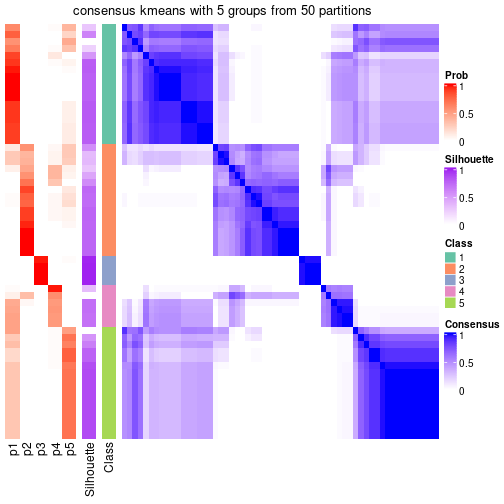</p>

</div>
<div id='tab-node-03-consensus-heatmap-5'>
<pre><code class="r">consensus_heatmap(res, k = 6)
</code></pre>

<p></p>

</div>
<div id='tab-node-03-consensus-heatmap-6'>
<pre><code class="r">consensus_heatmap(res, k = 7)
</code></pre>

<p></p>

</div>
<div id='tab-node-03-consensus-heatmap-7'>
<pre><code class="r">consensus_heatmap(res, k = 8)
</code></pre>

<p></p>

</div>
</div>

Heatmaps for the membership of samples in all partitions to see how consistent they are:


<script>
$( function() {
	$( '#tabs-node-03-membership-heatmap' ).tabs();
} );
</script>
<div id='tabs-node-03-membership-heatmap'>
<ul>
<li><a href='#tab-node-03-membership-heatmap-1'>k = 2</a></li>
<li><a href='#tab-node-03-membership-heatmap-2'>k = 3</a></li>
<li><a href='#tab-node-03-membership-heatmap-3'>k = 4</a></li>
<li><a href='#tab-node-03-membership-heatmap-4'>k = 5</a></li>
<li><a href='#tab-node-03-membership-heatmap-5'>k = 6</a></li>
<li><a href='#tab-node-03-membership-heatmap-6'>k = 7</a></li>
<li><a href='#tab-node-03-membership-heatmap-7'>k = 8</a></li>
</ul>
<div id='tab-node-03-membership-heatmap-1'>
<pre><code class="r">membership_heatmap(res, k = 2)
</code></pre>

<p></p>

</div>
<div id='tab-node-03-membership-heatmap-2'>
<pre><code class="r">membership_heatmap(res, k = 3)
</code></pre>

<p></p>

</div>
<div id='tab-node-03-membership-heatmap-3'>
<pre><code class="r">membership_heatmap(res, k = 4)
</code></pre>

<p></p>

</div>
<div id='tab-node-03-membership-heatmap-4'>
<pre><code class="r">membership_heatmap(res, k = 5)
</code></pre>

<p></p>

</div>
<div id='tab-node-03-membership-heatmap-5'>
<pre><code class="r">membership_heatmap(res, k = 6)
</code></pre>

<p></p>

</div>
<div id='tab-node-03-membership-heatmap-6'>
<pre><code class="r">membership_heatmap(res, k = 7)
</code></pre>

<p></p>

</div>
<div id='tab-node-03-membership-heatmap-7'>
<pre><code class="r">membership_heatmap(res, k = 8)
</code></pre>

<p></p>

</div>
</div>

As soon as the classes for columns are determined, the signatures
that are significantly different between subgroups can be looked for. 
Following are the heatmaps for signatures.


<script>
$( function() {
	$( '#tabs-node-03-get-signatures' ).tabs();
} );
</script>
<div id='tabs-node-03-get-signatures'>
<ul>
<li><a href='#tab-node-03-get-signatures-1'>k = 2</a></li>
<li><a href='#tab-node-03-get-signatures-2'>k = 3</a></li>
<li><a href='#tab-node-03-get-signatures-3'>k = 4</a></li>
<li><a href='#tab-node-03-get-signatures-4'>k = 5</a></li>
<li><a href='#tab-node-03-get-signatures-5'>k = 6</a></li>
<li><a href='#tab-node-03-get-signatures-6'>k = 7</a></li>
<li><a href='#tab-node-03-get-signatures-7'>k = 8</a></li>
</ul>
<div id='tab-node-03-get-signatures-1'>
<pre><code class="r">get_signatures(res, k = 2)
</code></pre>

<p></p>

</div>
<div id='tab-node-03-get-signatures-2'>
<pre><code class="r">get_signatures(res, k = 3)
</code></pre>

<p></p>

</div>
<div id='tab-node-03-get-signatures-3'>
<pre><code class="r">get_signatures(res, k = 4)
</code></pre>

<p></p>

</div>
<div id='tab-node-03-get-signatures-4'>
<pre><code class="r">get_signatures(res, k = 5)
</code></pre>

<p></p>

</div>
<div id='tab-node-03-get-signatures-5'>
<pre><code class="r">get_signatures(res, k = 6)
</code></pre>

<p></p>

</div>
<div id='tab-node-03-get-signatures-6'>
<pre><code class="r">get_signatures(res, k = 7)
</code></pre>

<p></p>

</div>
<div id='tab-node-03-get-signatures-7'>
<pre><code class="r">get_signatures(res, k = 8)
</code></pre>

<p></p>

</div>
</div>


Compare the overlap of signatures from different k:

```r
compare_signatures(res)
```


`get_signature()` returns a data frame invisibly. To get the list of signatures, the function
call should be assigned to a variable explicitly. In following code, if `plot` argument is set
to `FALSE`, no heatmap is plotted while only the differential analysis is performed.

```r
# code only for demonstration
tb = get_signature(res, k = ..., plot = FALSE)
```

An example of the output of `tb` is:

```
#>   which_row         fdr    mean_1    mean_2 scaled_mean_1 scaled_mean_2 km
#> 1        38 0.042760348  8.373488  9.131774    -0.5533452     0.5164555  1
#> 2        40 0.018707592  7.106213  8.469186    -0.6173731     0.5762149  1
#> 3        55 0.019134737 10.221463 11.207825    -0.6159697     0.5749050  1
#> 4        59 0.006059896  5.921854  7.869574    -0.6899429     0.6439467  1
#> 5        60 0.018055526  8.928898 10.211722    -0.6204761     0.5791110  1
#> 6        98 0.009384629 15.714769 14.887706     0.6635654    -0.6193277  2
...
```

The columns in `tb` are:

1. `which_row`: row indices corresponding to the input matrix.
2. `fdr`: FDR for the differential test. 
3. `mean_x`: The mean value in group x.
4. `scaled_mean_x`: The mean value in group x after rows are scaled.
5. `km`: Row groups if k-means clustering is applied to rows (which is done by automatically selecting number of clusters).

If there are too many signatures, `top_signatures = ...` can be set to only show the 
signatures with the highest FDRs:

```r
# code only for demonstration
# e.g. to show the top 500 most significant rows
tb = get_signature(res, k = ..., top_signatures = 500)
```

If the signatures are defined as these which are uniquely high in current group, `diff_method` argument
can be set to `"uniquely_high_in_one_group"`:

```r
# code only for demonstration
tb = get_signature(res, k = ..., diff_method = "uniquely_high_in_one_group")
```


UMAP plot which shows how samples are separated.


<script>
$( function() {
	$( '#tabs-node-03-dimension-reduction' ).tabs();
} );
</script>
<div id='tabs-node-03-dimension-reduction'>
<ul>
<li><a href='#tab-node-03-dimension-reduction-1'>k = 2</a></li>
<li><a href='#tab-node-03-dimension-reduction-2'>k = 3</a></li>
<li><a href='#tab-node-03-dimension-reduction-3'>k = 4</a></li>
<li><a href='#tab-node-03-dimension-reduction-4'>k = 5</a></li>
<li><a href='#tab-node-03-dimension-reduction-5'>k = 6</a></li>
<li><a href='#tab-node-03-dimension-reduction-6'>k = 7</a></li>
<li><a href='#tab-node-03-dimension-reduction-7'>k = 8</a></li>
</ul>
<div id='tab-node-03-dimension-reduction-1'>
<pre><code class="r">dimension_reduction(res, k = 2, method = &quot;UMAP&quot;)
</code></pre>

<p></p>

</div>
<div id='tab-node-03-dimension-reduction-2'>
<pre><code class="r">dimension_reduction(res, k = 3, method = &quot;UMAP&quot;)
</code></pre>

<p></p>

</div>
<div id='tab-node-03-dimension-reduction-3'>
<pre><code class="r">dimension_reduction(res, k = 4, method = &quot;UMAP&quot;)
</code></pre>

<p></p>

</div>
<div id='tab-node-03-dimension-reduction-4'>
<pre><code class="r">dimension_reduction(res, k = 5, method = &quot;UMAP&quot;)
</code></pre>

<p></p>

</div>
<div id='tab-node-03-dimension-reduction-5'>
<pre><code class="r">dimension_reduction(res, k = 6, method = &quot;UMAP&quot;)
</code></pre>

<p>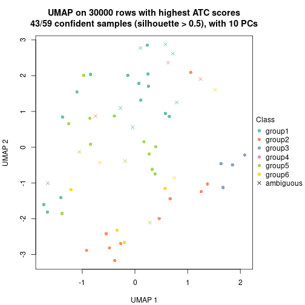</p>

</div>
<div id='tab-node-03-dimension-reduction-6'>
<pre><code class="r">dimension_reduction(res, k = 7, method = &quot;UMAP&quot;)
</code></pre>

<p></p>

</div>
<div id='tab-node-03-dimension-reduction-7'>
<pre><code class="r">dimension_reduction(res, k = 8, method = &quot;UMAP&quot;)
</code></pre>

<p>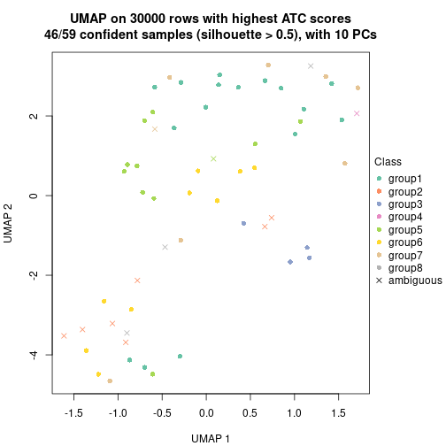</p>

</div>
</div>


Following heatmap shows how subgroups are split when increasing `k`:

```r
collect_classes(res)
```


If matrix rows can be associated to genes, consider to use `functional_enrichment(res,
...)` to perform function enrichment for the signature genes. See [this vignette](https://jokergoo.github.io/cola_vignettes/functional_enrichment.html) for more detailed explanations.


 

---------------------------------------------------


### Node031


Parent node: [Node03](#Node03).
Child nodes: 
                Node0121-leaf
        ,
                Node0122-leaf
        ,
                Node0123-leaf
        ,
                Node0124-leaf
        ,
                [Node0131](#Node0131)
        ,
                Node0132-leaf
        ,
                Node0221-leaf
        ,
                Node0222-leaf
        ,
                Node0223-leaf
        ,
                [Node0311](#Node0311)
        ,
                Node0312-leaf
        ,
                Node0313-leaf
        ,
                Node0321-leaf
        ,
                Node0322-leaf
        ,
                Node0431-leaf
        ,
                Node0432-leaf
        ,
                Node0433-leaf
        ,
                Node0511-leaf
        ,
                Node0512-leaf
        ,
                Node0513-leaf
        ,
                Node0521-leaf
        ,
                Node0522-leaf
        ,
                Node0523-leaf
        ,
                Node0531-leaf
        ,
                Node0532-leaf
        ,
                Node0533-leaf
        .


The object with results only for a single top-value method and a single partitioning method 
can be extracted as:

```r
res = res_rh["031"]
```

A summary of `res` and all the functions that can be applied to it:

```r
res
```

```
#> A 'ConsensusPartition' object with k = 2, 3, 4, 5, 6, 7, 8.
#>   On a matrix with 30000 rows and 33 columns.
#>   Top rows (1000) are extracted by 'ATC' method.
#>   Subgroups are detected by 'kmeans' method.
#>   Performed in total 350 partitions by row resampling.
#>   Best k for subgroups seems to be 3.
#> 
#> Following methods can be applied to this 'ConsensusPartition' object:
#>  [1] "cola_report"             "collect_classes"         "collect_plots"          
#>  [4] "collect_stats"           "colnames"                "compare_partitions"     
#>  [7] "compare_signatures"      "consensus_heatmap"       "dimension_reduction"    
#> [10] "functional_enrichment"   "get_anno_col"            "get_anno"               
#> [13] "get_classes"             "get_consensus"           "get_matrix"             
#> [16] "get_membership"          "get_param"               "get_signatures"         
#> [19] "get_stats"               "is_best_k"               "is_stable_k"            
#> [22] "membership_heatmap"      "ncol"                    "nrow"                   
#> [25] "plot_ecdf"               "predict_classes"         "rownames"               
#> [28] "select_partition_number" "show"                    "suggest_best_k"         
#> [31] "test_to_known_factors"   "top_rows_heatmap"
```

`collect_plots()` function collects all the plots made from `res` for all `k` (number of subgroups)
into one single page to provide an easy and fast comparison between different `k`.

```r
collect_plots(res)
```


The plots are:

- The first row: a plot of the eCDF (empirical cumulative distribution
  function) curves of the consensus matrix for each `k` and the heatmap of
  predicted classes for each `k`.
- The second row: heatmaps of the consensus matrix for each `k`.
- The third row: heatmaps of the membership matrix for each `k`.
- The fouth row: heatmaps of the signatures for each `k`.

All the plots in panels can be made by individual functions and they are
plotted later in this section.

`select_partition_number()` produces several plots showing different
statistics for choosing "optimized" `k`. There are following statistics:

- eCDF curves of the consensus matrix for each `k`;
- 1-PAC. [The PAC score](https://en.wikipedia.org/wiki/Consensus_clustering#Over-interpretation_potential_of_consensus_clustering)
  measures the proportion of the ambiguous subgrouping.
- Mean silhouette score.
- Concordance. The mean probability of fiting the consensus subgroup labels in all
  partitions.
- Area increased. Denote $A_k$ as the area under the eCDF curve for current
  `k`, the area increased is defined as $A_k - A_{k-1}$.
- Rand index. The percent of pairs of samples that are both in a same cluster
  or both are not in a same cluster in the partition of k and k-1.
- Jaccard index. The ratio of pairs of samples are both in a same cluster in
  the partition of k and k-1 and the pairs of samples are both in a same
  cluster in the partition k or k-1.

The detailed explanations of these statistics can be found in [the _cola_
vignette](https://jokergoo.github.io/cola_vignettes/cola.html#toc_13).

Generally speaking, higher 1-PAC score, higher mean silhouette score or higher
concordance corresponds to better partition. Rand index and Jaccard index
measure how similar the current partition is compared to partition with `k-1`.
If they are too similar, we won't accept `k` is better than `k-1`.

```r
select_partition_number(res)
```


The numeric values for all these statistics can be obtained by `get_stats()`.

```r
get_stats(res)
```

```
#>   k 1-PAC mean_silhouette concordance area_increased  Rand Jaccard
#> 2 2 1.000           0.997       0.998         0.3066 0.693   0.693
#> 3 3 1.000           0.963       0.988         0.9634 0.625   0.487
#> 4 4 0.750           0.869       0.910         0.1731 0.850   0.644
#> 5 5 0.746           0.750       0.857         0.0971 0.894   0.665
#> 6 6 0.720           0.794       0.826         0.0514 0.879   0.519
#> 7 7 0.761           0.792       0.839         0.0373 1.000   1.000
#> 8 8 0.718           0.699       0.796         0.0167 0.989   0.926
```

`suggest_best_k()` suggests the best $k$ based on these statistics. The rules are as follows:

- All $k$ with Jaccard index larger than 0.95 are removed because increasing
  $k$ does not provide enough extra information. If all $k$ are removed, it is
  marked as no subgroup is detected.
- For all $k$ with 1-PAC score larger than 0.9, the maximal $k$ is taken as
  the best $k$, and other $k$ are marked as optional $k$.
- If it does not fit the second rule. The $k$ with the maximal vote of the
  highest 1-PAC score, highest mean silhouette, and highest concordance is
  taken as the best $k$.

```r
suggest_best_k(res)
```

```
#> [1] 3
#> attr(,"optional")
#> [1] 2
```

There is also optional best $k$ = 2 that is worth to check.

Following is the table of the partitions (You need to click the **show/hide
code output** link to see it). The membership matrix (columns with name `p*`)
is inferred by
[`clue::cl_consensus()`](https://www.rdocumentation.org/link/cl_consensus?package=clue)
function with the `SE` method. Basically the value in the membership matrix
represents the probability to belong to a certain group. The finall subgroup
label for an item is determined with the group with highest probability it
belongs to.

In `get_classes()` function, the entropy is calculated from the membership
matrix and the silhouette score is calculated from the consensus matrix.


<script>
$( function() {
	$( '#tabs-node-031-get-classes' ).tabs();
} );
</script>
<div id='tabs-node-031-get-classes'>
<ul>
<li><a href='#tab-node-031-get-classes-1'>k = 2</a></li>
<li><a href='#tab-node-031-get-classes-2'>k = 3</a></li>
<li><a href='#tab-node-031-get-classes-3'>k = 4</a></li>
<li><a href='#tab-node-031-get-classes-4'>k = 5</a></li>
<li><a href='#tab-node-031-get-classes-5'>k = 6</a></li>
<li><a href='#tab-node-031-get-classes-6'>k = 7</a></li>
<li><a href='#tab-node-031-get-classes-7'>k = 8</a></li>
</ul>

<div id='tab-node-031-get-classes-1'>
<p><a id='tab-node-031-get-classes-1-a' style='color:#0366d6' href='#'>show/hide code output</a></p>
<pre><code class="r">cbind(get_classes(res, k = 2), get_membership(res, k = 2))
</code></pre>

<pre><code>#&gt;                 class entropy silhouette   p1   p2
#&gt; TCGA.B1.A656.01     2   0.000      0.992 0.00 1.00
#&gt; TCGA.B9.A69E.01     1   0.141      0.979 0.98 0.02
#&gt; TCGA.B3.8121.01     1   0.000      0.999 1.00 0.00
#&gt; TCGA.GL.A9DD.01     1   0.000      0.999 1.00 0.00
#&gt; TCGA.Y8.A8S1.01     1   0.000      0.999 1.00 0.00
#&gt; TCGA.IA.A83S.01     1   0.000      0.999 1.00 0.00
#&gt; TCGA.IA.A83T.01     1   0.000      0.999 1.00 0.00
#&gt; TCGA.KV.A6GD.01     1   0.000      0.999 1.00 0.00
#&gt; TCGA.WN.A9G9.01     1   0.000      0.999 1.00 0.00
#&gt; TCGA.BQ.5876.01     2   0.000      0.992 0.00 1.00
#&gt; TCGA.A4.A48D.01     1   0.000      0.999 1.00 0.00
#&gt; TCGA.BQ.5889.01     1   0.000      0.999 1.00 0.00
#&gt; TCGA.5P.A9JW.01     2   0.141      0.984 0.02 0.98
#&gt; TCGA.B1.A47O.01     1   0.000      0.999 1.00 0.00
#&gt; TCGA.UZ.A9PS.05     2   0.000      0.992 0.00 1.00
#&gt; TCGA.PJ.A5Z8.01     1   0.000      0.999 1.00 0.00
#&gt; TCGA.B9.A5W8.01     1   0.000      0.999 1.00 0.00
#&gt; TCGA.B1.5398.01     1   0.000      0.999 1.00 0.00
#&gt; TCGA.GL.A4EM.01     1   0.000      0.999 1.00 0.00
#&gt; TCGA.HE.7128.01     1   0.000      0.999 1.00 0.00
#&gt; TCGA.BQ.7059.01     1   0.000      0.999 1.00 0.00
#&gt; TCGA.BQ.7049.01     1   0.000      0.999 1.00 0.00
#&gt; TCGA.HE.A5NF.01     1   0.000      0.999 1.00 0.00
#&gt; TCGA.MH.A560.01     2   0.000      0.992 0.00 1.00
#&gt; TCGA.DZ.6134.01     1   0.000      0.999 1.00 0.00
#&gt; TCGA.HE.A5NK.01     1   0.000      0.999 1.00 0.00
#&gt; TCGA.AL.7173.01     1   0.000      0.999 1.00 0.00
#&gt; TCGA.DW.7838.01     1   0.000      0.999 1.00 0.00
#&gt; TCGA.V9.A7HT.01     1   0.000      0.999 1.00 0.00
#&gt; TCGA.DZ.6132.01     1   0.000      0.999 1.00 0.00
#&gt; TCGA.UZ.A9PO.01     2   0.141      0.984 0.02 0.98
#&gt; TCGA.F9.A97G.01     1   0.000      0.999 1.00 0.00
#&gt; TCGA.2K.A9WE.01     1   0.000      0.999 1.00 0.00
</code></pre>

<script>
$('#tab-node-031-get-classes-1-a').parent().next().next().hide();
$('#tab-node-031-get-classes-1-a').click(function(){
  $('#tab-node-031-get-classes-1-a').parent().next().next().toggle();
  return(false);
});
</script>
</div>

<div id='tab-node-031-get-classes-2'>
<p><a id='tab-node-031-get-classes-2-a' style='color:#0366d6' href='#'>show/hide code output</a></p>
<pre><code class="r">cbind(get_classes(res, k = 3), get_membership(res, k = 3))
</code></pre>

<pre><code>#&gt;                 class entropy silhouette  p1 p2  p3
#&gt; TCGA.B1.A656.01     2   0.000      1.000 0.0  1 0.0
#&gt; TCGA.B9.A69E.01     3   0.000      0.950 0.0  0 1.0
#&gt; TCGA.B3.8121.01     1   0.000      1.000 1.0  0 0.0
#&gt; TCGA.GL.A9DD.01     1   0.000      1.000 1.0  0 0.0
#&gt; TCGA.Y8.A8S1.01     3   0.000      0.950 0.0  0 1.0
#&gt; TCGA.IA.A83S.01     1   0.000      1.000 1.0  0 0.0
#&gt; TCGA.IA.A83T.01     3   0.000      0.950 0.0  0 1.0
#&gt; TCGA.KV.A6GD.01     1   0.000      1.000 1.0  0 0.0
#&gt; TCGA.WN.A9G9.01     3   0.000      0.950 0.0  0 1.0
#&gt; TCGA.BQ.5876.01     2   0.000      1.000 0.0  1 0.0
#&gt; TCGA.A4.A48D.01     3   0.000      0.950 0.0  0 1.0
#&gt; TCGA.BQ.5889.01     1   0.000      1.000 1.0  0 0.0
#&gt; TCGA.5P.A9JW.01     3   0.000      0.950 0.0  0 1.0
#&gt; TCGA.B1.A47O.01     1   0.000      1.000 1.0  0 0.0
#&gt; TCGA.UZ.A9PS.05     2   0.000      1.000 0.0  1 0.0
#&gt; TCGA.PJ.A5Z8.01     3   0.613      0.333 0.4  0 0.6
#&gt; TCGA.B9.A5W8.01     1   0.000      1.000 1.0  0 0.0
#&gt; TCGA.B1.5398.01     3   0.000      0.950 0.0  0 1.0
#&gt; TCGA.GL.A4EM.01     3   0.000      0.950 0.0  0 1.0
#&gt; TCGA.HE.7128.01     1   0.000      1.000 1.0  0 0.0
#&gt; TCGA.BQ.7059.01     1   0.000      1.000 1.0  0 0.0
#&gt; TCGA.BQ.7049.01     1   0.000      1.000 1.0  0 0.0
#&gt; TCGA.HE.A5NF.01     1   0.000      1.000 1.0  0 0.0
#&gt; TCGA.MH.A560.01     2   0.000      1.000 0.0  1 0.0
#&gt; TCGA.DZ.6134.01     3   0.000      0.950 0.0  0 1.0
#&gt; TCGA.HE.A5NK.01     1   0.000      1.000 1.0  0 0.0
#&gt; TCGA.AL.7173.01     1   0.000      1.000 1.0  0 0.0
#&gt; TCGA.DW.7838.01     1   0.000      1.000 1.0  0 0.0
#&gt; TCGA.V9.A7HT.01     1   0.000      1.000 1.0  0 0.0
#&gt; TCGA.DZ.6132.01     1   0.000      1.000 1.0  0 0.0
#&gt; TCGA.UZ.A9PO.01     3   0.000      0.950 0.0  0 1.0
#&gt; TCGA.F9.A97G.01     3   0.000      0.950 0.0  0 1.0
#&gt; TCGA.2K.A9WE.01     1   0.000      1.000 1.0  0 0.0
</code></pre>

<script>
$('#tab-node-031-get-classes-2-a').parent().next().next().hide();
$('#tab-node-031-get-classes-2-a').click(function(){
  $('#tab-node-031-get-classes-2-a').parent().next().next().toggle();
  return(false);
});
</script>
</div>

<div id='tab-node-031-get-classes-3'>
<p><a id='tab-node-031-get-classes-3-a' style='color:#0366d6' href='#'>show/hide code output</a></p>
<pre><code class="r">cbind(get_classes(res, k = 4), get_membership(res, k = 4))
</code></pre>

<pre><code>#&gt;                 class entropy silhouette   p1   p2   p3   p4
#&gt; TCGA.B1.A656.01     2  0.1913      0.959 0.00 0.94 0.02 0.04
#&gt; TCGA.B9.A69E.01     4  0.0000      0.968 0.00 0.00 0.00 1.00
#&gt; TCGA.B3.8121.01     1  0.0000      0.888 1.00 0.00 0.00 0.00
#&gt; TCGA.GL.A9DD.01     1  0.0000      0.888 1.00 0.00 0.00 0.00
#&gt; TCGA.Y8.A8S1.01     3  0.3975      0.736 0.00 0.00 0.76 0.24
#&gt; TCGA.IA.A83S.01     1  0.3975      0.833 0.76 0.00 0.24 0.00
#&gt; TCGA.IA.A83T.01     3  0.1637      0.809 0.00 0.00 0.94 0.06
#&gt; TCGA.KV.A6GD.01     1  0.3400      0.867 0.82 0.00 0.18 0.00
#&gt; TCGA.WN.A9G9.01     3  0.3975      0.736 0.00 0.00 0.76 0.24
#&gt; TCGA.BQ.5876.01     2  0.0000      0.981 0.00 1.00 0.00 0.00
#&gt; TCGA.A4.A48D.01     3  0.1637      0.809 0.00 0.00 0.94 0.06
#&gt; TCGA.BQ.5889.01     3  0.2921      0.735 0.14 0.00 0.86 0.00
#&gt; TCGA.5P.A9JW.01     4  0.0000      0.968 0.00 0.00 0.00 1.00
#&gt; TCGA.B1.A47O.01     1  0.0000      0.888 1.00 0.00 0.00 0.00
#&gt; TCGA.UZ.A9PS.05     2  0.0707      0.979 0.00 0.98 0.02 0.00
#&gt; TCGA.PJ.A5Z8.01     3  0.0707      0.804 0.02 0.00 0.98 0.00
#&gt; TCGA.B9.A5W8.01     1  0.3610      0.862 0.80 0.00 0.20 0.00
#&gt; TCGA.B1.5398.01     3  0.3975      0.736 0.00 0.00 0.76 0.24
#&gt; TCGA.GL.A4EM.01     4  0.1637      0.951 0.00 0.00 0.06 0.94
#&gt; TCGA.HE.7128.01     1  0.3610      0.862 0.80 0.00 0.20 0.00
#&gt; TCGA.BQ.7059.01     1  0.3610      0.862 0.80 0.00 0.20 0.00
#&gt; TCGA.BQ.7049.01     1  0.0000      0.888 1.00 0.00 0.00 0.00
#&gt; TCGA.HE.A5NF.01     1  0.0707      0.889 0.98 0.00 0.02 0.00
#&gt; TCGA.MH.A560.01     2  0.0000      0.981 0.00 1.00 0.00 0.00
#&gt; TCGA.DZ.6134.01     3  0.3801      0.761 0.00 0.00 0.78 0.22
#&gt; TCGA.HE.A5NK.01     1  0.3610      0.862 0.80 0.00 0.20 0.00
#&gt; TCGA.AL.7173.01     3  0.2011      0.770 0.08 0.00 0.92 0.00
#&gt; TCGA.DW.7838.01     1  0.0000      0.888 1.00 0.00 0.00 0.00
#&gt; TCGA.V9.A7HT.01     1  0.3975      0.833 0.76 0.00 0.24 0.00
#&gt; TCGA.DZ.6132.01     1  0.0000      0.888 1.00 0.00 0.00 0.00
#&gt; TCGA.UZ.A9PO.01     4  0.0000      0.968 0.00 0.00 0.00 1.00
#&gt; TCGA.F9.A97G.01     4  0.1637      0.951 0.00 0.00 0.06 0.94
#&gt; TCGA.2K.A9WE.01     1  0.0000      0.888 1.00 0.00 0.00 0.00
</code></pre>

<script>
$('#tab-node-031-get-classes-3-a').parent().next().next().hide();
$('#tab-node-031-get-classes-3-a').click(function(){
  $('#tab-node-031-get-classes-3-a').parent().next().next().toggle();
  return(false);
});
</script>
</div>

<div id='tab-node-031-get-classes-4'>
<p><a id='tab-node-031-get-classes-4-a' style='color:#0366d6' href='#'>show/hide code output</a></p>
<pre><code class="r">cbind(get_classes(res, k = 5), get_membership(res, k = 5))
</code></pre>

<pre><code>#&gt;                 class entropy silhouette   p1   p2   p3   p4   p5
#&gt; TCGA.B1.A656.01     2   0.252      0.841 0.00 0.86 0.00 0.14 0.00
#&gt; TCGA.B9.A69E.01     4   0.000      0.833 0.00 0.00 0.00 1.00 0.00
#&gt; TCGA.B3.8121.01     1   0.000      0.772 1.00 0.00 0.00 0.00 0.00
#&gt; TCGA.GL.A9DD.01     1   0.000      0.772 1.00 0.00 0.00 0.00 0.00
#&gt; TCGA.Y8.A8S1.01     5   0.208      0.815 0.00 0.00 0.04 0.04 0.92
#&gt; TCGA.IA.A83S.01     3   0.165      0.768 0.04 0.00 0.94 0.00 0.02
#&gt; TCGA.IA.A83T.01     3   0.342      0.748 0.00 0.00 0.76 0.00 0.24
#&gt; TCGA.KV.A6GD.01     1   0.446      0.658 0.66 0.00 0.32 0.00 0.02
#&gt; TCGA.WN.A9G9.01     5   0.208      0.815 0.00 0.00 0.04 0.04 0.92
#&gt; TCGA.BQ.5876.01     2   0.104      0.940 0.00 0.96 0.00 0.00 0.04
#&gt; TCGA.A4.A48D.01     3   0.293      0.790 0.00 0.00 0.82 0.00 0.18
#&gt; TCGA.BQ.5889.01     5   0.541      0.398 0.20 0.00 0.14 0.00 0.66
#&gt; TCGA.5P.A9JW.01     4   0.000      0.833 0.00 0.00 0.00 1.00 0.00
#&gt; TCGA.B1.A47O.01     1   0.000      0.772 1.00 0.00 0.00 0.00 0.00
#&gt; TCGA.UZ.A9PS.05     2   0.000      0.935 0.00 1.00 0.00 0.00 0.00
#&gt; TCGA.PJ.A5Z8.01     3   0.293      0.787 0.00 0.00 0.82 0.00 0.18
#&gt; TCGA.B9.A5W8.01     1   0.480      0.545 0.54 0.00 0.44 0.00 0.02
#&gt; TCGA.B1.5398.01     5   0.208      0.815 0.00 0.00 0.04 0.04 0.92
#&gt; TCGA.GL.A4EM.01     4   0.425      0.696 0.00 0.00 0.02 0.70 0.28
#&gt; TCGA.HE.7128.01     1   0.480      0.536 0.54 0.00 0.44 0.00 0.02
#&gt; TCGA.BQ.7059.01     1   0.477      0.565 0.56 0.00 0.42 0.00 0.02
#&gt; TCGA.BQ.7049.01     1   0.000      0.772 1.00 0.00 0.00 0.00 0.00
#&gt; TCGA.HE.A5NF.01     1   0.369      0.724 0.78 0.00 0.20 0.00 0.02
#&gt; TCGA.MH.A560.01     2   0.104      0.940 0.00 0.96 0.00 0.00 0.04
#&gt; TCGA.DZ.6134.01     3   0.342      0.748 0.00 0.00 0.76 0.00 0.24
#&gt; TCGA.HE.A5NK.01     1   0.480      0.545 0.54 0.00 0.44 0.00 0.02
#&gt; TCGA.AL.7173.01     3   0.000      0.786 0.00 0.00 1.00 0.00 0.00
#&gt; TCGA.DW.7838.01     1   0.000      0.772 1.00 0.00 0.00 0.00 0.00
#&gt; TCGA.V9.A7HT.01     3   0.165      0.751 0.04 0.00 0.94 0.00 0.02
#&gt; TCGA.DZ.6132.01     1   0.000      0.772 1.00 0.00 0.00 0.00 0.00
#&gt; TCGA.UZ.A9PO.01     4   0.000      0.833 0.00 0.00 0.00 1.00 0.00
#&gt; TCGA.F9.A97G.01     4   0.425      0.696 0.00 0.00 0.02 0.70 0.28
#&gt; TCGA.2K.A9WE.01     1   0.000      0.772 1.00 0.00 0.00 0.00 0.00
</code></pre>

<script>
$('#tab-node-031-get-classes-4-a').parent().next().next().hide();
$('#tab-node-031-get-classes-4-a').click(function(){
  $('#tab-node-031-get-classes-4-a').parent().next().next().toggle();
  return(false);
});
</script>
</div>

<div id='tab-node-031-get-classes-5'>
<p><a id='tab-node-031-get-classes-5-a' style='color:#0366d6' href='#'>show/hide code output</a></p>
<pre><code class="r">cbind(get_classes(res, k = 6), get_membership(res, k = 6))
</code></pre>

<pre><code>#&gt;                 class entropy silhouette   p1   p2   p3   p4   p5   p6
#&gt; TCGA.B1.A656.01     2  0.3318      0.729 0.02 0.82 0.02 0.14 0.00 0.00
#&gt; TCGA.B9.A69E.01     4  0.0000      0.810 0.00 0.00 0.00 1.00 0.00 0.00
#&gt; TCGA.B3.8121.01     1  0.3679      0.950 0.76 0.00 0.04 0.00 0.00 0.20
#&gt; TCGA.GL.A9DD.01     1  0.2793      0.964 0.80 0.00 0.00 0.00 0.00 0.20
#&gt; TCGA.Y8.A8S1.01     5  0.1480      0.829 0.00 0.00 0.00 0.04 0.94 0.02
#&gt; TCGA.IA.A83S.01     6  0.5043      0.354 0.12 0.00 0.18 0.00 0.02 0.68
#&gt; TCGA.IA.A83T.01     3  0.3787      0.779 0.00 0.00 0.78 0.00 0.12 0.10
#&gt; TCGA.KV.A6GD.01     6  0.2260      0.751 0.14 0.00 0.00 0.00 0.00 0.86
#&gt; TCGA.WN.A9G9.01     5  0.1480      0.829 0.00 0.00 0.00 0.04 0.94 0.02
#&gt; TCGA.BQ.5876.01     2  0.3854      0.852 0.04 0.80 0.12 0.00 0.04 0.00
#&gt; TCGA.A4.A48D.01     3  0.6055      0.781 0.12 0.00 0.60 0.00 0.08 0.20
#&gt; TCGA.BQ.5889.01     5  0.4002      0.431 0.02 0.00 0.00 0.00 0.66 0.32
#&gt; TCGA.5P.A9JW.01     4  0.1480      0.807 0.04 0.00 0.02 0.94 0.00 0.00
#&gt; TCGA.B1.A47O.01     1  0.3679      0.950 0.76 0.00 0.04 0.00 0.00 0.20
#&gt; TCGA.UZ.A9PS.05     2  0.0000      0.840 0.00 1.00 0.00 0.00 0.00 0.00
#&gt; TCGA.PJ.A5Z8.01     3  0.5199      0.732 0.00 0.00 0.58 0.00 0.12 0.30
#&gt; TCGA.B9.A5W8.01     6  0.0000      0.818 0.00 0.00 0.00 0.00 0.00 1.00
#&gt; TCGA.B1.5398.01     5  0.1480      0.829 0.00 0.00 0.00 0.04 0.94 0.02
#&gt; TCGA.GL.A4EM.01     4  0.3309      0.696 0.00 0.00 0.00 0.72 0.28 0.00
#&gt; TCGA.HE.7128.01     6  0.0937      0.825 0.04 0.00 0.00 0.00 0.00 0.96
#&gt; TCGA.BQ.7059.01     6  0.1556      0.814 0.08 0.00 0.00 0.00 0.00 0.92
#&gt; TCGA.BQ.7049.01     1  0.3076      0.940 0.76 0.00 0.00 0.00 0.00 0.24
#&gt; TCGA.HE.A5NF.01     6  0.2793      0.647 0.20 0.00 0.00 0.00 0.00 0.80
#&gt; TCGA.MH.A560.01     2  0.3351      0.852 0.04 0.80 0.16 0.00 0.00 0.00
#&gt; TCGA.DZ.6134.01     3  0.6524      0.763 0.12 0.00 0.60 0.02 0.14 0.12
#&gt; TCGA.HE.A5NK.01     6  0.0000      0.818 0.00 0.00 0.00 0.00 0.00 1.00
#&gt; TCGA.AL.7173.01     3  0.3711      0.770 0.00 0.00 0.72 0.00 0.02 0.26
#&gt; TCGA.DW.7838.01     1  0.2793      0.964 0.80 0.00 0.00 0.00 0.00 0.20
#&gt; TCGA.V9.A7HT.01     6  0.1814      0.702 0.00 0.00 0.10 0.00 0.00 0.90
#&gt; TCGA.DZ.6132.01     1  0.3198      0.917 0.74 0.00 0.00 0.00 0.00 0.26
#&gt; TCGA.UZ.A9PO.01     4  0.1480      0.807 0.04 0.00 0.02 0.94 0.00 0.00
#&gt; TCGA.F9.A97G.01     4  0.3309      0.696 0.00 0.00 0.00 0.72 0.28 0.00
#&gt; TCGA.2K.A9WE.01     1  0.2793      0.964 0.80 0.00 0.00 0.00 0.00 0.20
</code></pre>

<script>
$('#tab-node-031-get-classes-5-a').parent().next().next().hide();
$('#tab-node-031-get-classes-5-a').click(function(){
  $('#tab-node-031-get-classes-5-a').parent().next().next().toggle();
  return(false);
});
</script>
</div>

<div id='tab-node-031-get-classes-6'>
<p><a id='tab-node-031-get-classes-6-a' style='color:#0366d6' href='#'>show/hide code output</a></p>
<pre><code class="r">cbind(get_classes(res, k = 7), get_membership(res, k = 7))
</code></pre>

<pre><code>#&gt;                 class entropy silhouette   p1   p2   p3   p4   p5   p6   p7
#&gt; TCGA.B1.A656.01     7   0.535      0.719 0.00 0.12 0.00 0.20 0.00 0.06 0.62
#&gt; TCGA.B9.A69E.01     4   0.305      0.831 0.00 0.20 0.00 0.78 0.00 0.02 0.00
#&gt; TCGA.B3.8121.01     1   0.271      0.806 0.78 0.22 0.00 0.00 0.00 0.00 0.00
#&gt; TCGA.GL.A9DD.01     1   0.000      0.892 1.00 0.00 0.00 0.00 0.00 0.00 0.00
#&gt; TCGA.Y8.A8S1.01     5   0.000      0.928 0.00 0.00 0.00 0.00 1.00 0.00 0.00
#&gt; TCGA.IA.A83S.01     6   0.417      0.282 0.00 0.04 0.38 0.00 0.00 0.58 0.00
#&gt; TCGA.IA.A83T.01     3   0.391      0.673 0.00 0.24 0.70 0.00 0.00 0.06 0.00
#&gt; TCGA.KV.A6GD.01     6   0.331      0.823 0.24 0.02 0.00 0.00 0.00 0.74 0.00
#&gt; TCGA.WN.A9G9.01     5   0.136      0.903 0.00 0.04 0.00 0.00 0.94 0.02 0.00
#&gt; TCGA.BQ.5876.01     7   0.000      0.852 0.00 0.00 0.00 0.00 0.00 0.00 1.00
#&gt; TCGA.A4.A48D.01     3   0.193      0.662 0.00 0.00 0.90 0.00 0.02 0.08 0.00
#&gt; TCGA.BQ.5889.01     5   0.216      0.824 0.00 0.02 0.00 0.00 0.88 0.10 0.00
#&gt; TCGA.5P.A9JW.01     4   0.000      0.796 0.00 0.00 0.00 1.00 0.00 0.00 0.00
#&gt; TCGA.B1.A47O.01     1   0.271      0.806 0.78 0.22 0.00 0.00 0.00 0.00 0.00
#&gt; TCGA.UZ.A9PS.05     7   0.301      0.832 0.00 0.12 0.00 0.00 0.00 0.06 0.82
#&gt; TCGA.PJ.A5Z8.01     3   0.645      0.546 0.00 0.20 0.40 0.00 0.08 0.32 0.00
#&gt; TCGA.B9.A5W8.01     6   0.257      0.850 0.20 0.00 0.00 0.00 0.00 0.80 0.00
#&gt; TCGA.B1.5398.01     5   0.000      0.928 0.00 0.00 0.00 0.00 1.00 0.00 0.00
#&gt; TCGA.GL.A4EM.01     4   0.471      0.819 0.00 0.22 0.02 0.66 0.10 0.00 0.00
#&gt; TCGA.HE.7128.01     6   0.291      0.852 0.18 0.02 0.00 0.00 0.00 0.80 0.00
#&gt; TCGA.BQ.7059.01     6   0.324      0.847 0.18 0.04 0.00 0.00 0.00 0.78 0.00
#&gt; TCGA.BQ.7049.01     1   0.136      0.866 0.94 0.02 0.00 0.00 0.00 0.04 0.00
#&gt; TCGA.HE.A5NF.01     6   0.331      0.823 0.24 0.02 0.00 0.00 0.00 0.74 0.00
#&gt; TCGA.MH.A560.01     7   0.000      0.852 0.00 0.00 0.00 0.00 0.00 0.00 1.00
#&gt; TCGA.DZ.6134.01     3   0.193      0.662 0.00 0.00 0.90 0.00 0.02 0.08 0.00
#&gt; TCGA.HE.A5NK.01     6   0.339      0.845 0.18 0.02 0.00 0.00 0.02 0.78 0.00
#&gt; TCGA.AL.7173.01     3   0.495      0.643 0.00 0.36 0.52 0.00 0.00 0.12 0.00
#&gt; TCGA.DW.7838.01     1   0.000      0.892 1.00 0.00 0.00 0.00 0.00 0.00 0.00
#&gt; TCGA.V9.A7HT.01     6   0.363      0.780 0.10 0.04 0.06 0.00 0.00 0.80 0.00
#&gt; TCGA.DZ.6132.01     1   0.238      0.788 0.86 0.02 0.00 0.00 0.00 0.12 0.00
#&gt; TCGA.UZ.A9PO.01     4   0.000      0.796 0.00 0.00 0.00 1.00 0.00 0.00 0.00
#&gt; TCGA.F9.A97G.01     4   0.471      0.819 0.00 0.22 0.02 0.66 0.10 0.00 0.00
#&gt; TCGA.2K.A9WE.01     1   0.000      0.892 1.00 0.00 0.00 0.00 0.00 0.00 0.00
</code></pre>

<script>
$('#tab-node-031-get-classes-6-a').parent().next().next().hide();
$('#tab-node-031-get-classes-6-a').click(function(){
  $('#tab-node-031-get-classes-6-a').parent().next().next().toggle();
  return(false);
});
</script>
</div>

<div id='tab-node-031-get-classes-7'>
<p><a id='tab-node-031-get-classes-7-a' style='color:#0366d6' href='#'>show/hide code output</a></p>
<pre><code class="r">cbind(get_classes(res, k = 8), get_membership(res, k = 8))
</code></pre>

<pre><code>#&gt;                 class entropy silhouette   p1   p2   p3   p4   p5   p6   p7   p8
#&gt; TCGA.B1.A656.01     7  0.4904     0.6409 0.00 0.00 0.00 0.32 0.00 0.00 0.50 0.18
#&gt; TCGA.B9.A69E.01     8  0.4061     0.6987 0.02 0.12 0.00 0.14 0.00 0.00 0.00 0.72
#&gt; TCGA.B3.8121.01     1  0.4885     0.7148 0.60 0.04 0.00 0.26 0.00 0.10 0.00 0.00
#&gt; TCGA.GL.A9DD.01     1  0.1563     0.8242 0.90 0.00 0.00 0.00 0.00 0.10 0.00 0.00
#&gt; TCGA.Y8.A8S1.01     5  0.0000     0.8166 0.00 0.00 0.00 0.00 1.00 0.00 0.00 0.00
#&gt; TCGA.IA.A83S.01     6  0.5048     0.0529 0.00 0.40 0.08 0.04 0.00 0.48 0.00 0.00
#&gt; TCGA.IA.A83T.01     3  0.3537     0.3206 0.00 0.24 0.72 0.02 0.00 0.02 0.00 0.00
#&gt; TCGA.KV.A6GD.01     6  0.1557     0.7884 0.06 0.02 0.00 0.00 0.00 0.92 0.00 0.00
#&gt; TCGA.WN.A9G9.01     5  0.2484     0.7857 0.02 0.02 0.00 0.10 0.86 0.00 0.00 0.00
#&gt; TCGA.BQ.5876.01     7  0.1275     0.7614 0.04 0.00 0.02 0.00 0.00 0.00 0.94 0.00
#&gt; TCGA.A4.A48D.01     2  0.3873     1.0000 0.00 0.72 0.20 0.00 0.02 0.06 0.00 0.00
#&gt; TCGA.BQ.5889.01     5  0.3426     0.5759 0.00 0.02 0.00 0.02 0.74 0.22 0.00 0.00
#&gt; TCGA.5P.A9JW.01     8  0.0000     0.6701 0.00 0.00 0.00 0.00 0.00 0.00 0.00 1.00
#&gt; TCGA.B1.A47O.01     1  0.5379     0.7041 0.52 0.04 0.00 0.28 0.00 0.16 0.00 0.00
#&gt; TCGA.UZ.A9PS.05     7  0.3594     0.7432 0.00 0.04 0.00 0.28 0.00 0.00 0.68 0.00
#&gt; TCGA.PJ.A5Z8.01     3  0.5064     0.3570 0.02 0.00 0.58 0.06 0.04 0.30 0.00 0.00
#&gt; TCGA.B9.A5W8.01     6  0.0941     0.7924 0.02 0.00 0.00 0.02 0.00 0.96 0.00 0.00
#&gt; TCGA.B1.5398.01     5  0.0941     0.8097 0.02 0.00 0.00 0.02 0.96 0.00 0.00 0.00
#&gt; TCGA.GL.A4EM.01     8  0.6296     0.6248 0.02 0.16 0.00 0.10 0.26 0.00 0.00 0.46
#&gt; TCGA.HE.7128.01     6  0.1607     0.7908 0.00 0.04 0.00 0.04 0.00 0.92 0.00 0.00
#&gt; TCGA.BQ.7059.01     6  0.3131     0.7825 0.02 0.06 0.04 0.04 0.00 0.84 0.00 0.00
#&gt; TCGA.BQ.7049.01     1  0.3169     0.7957 0.78 0.02 0.00 0.02 0.00 0.18 0.00 0.00
#&gt; TCGA.HE.A5NF.01     6  0.2025     0.7422 0.10 0.02 0.00 0.00 0.00 0.88 0.00 0.00
#&gt; TCGA.MH.A560.01     7  0.0000     0.7614 0.00 0.00 0.00 0.00 0.00 0.00 1.00 0.00
#&gt; TCGA.DZ.6134.01     2  0.3873     1.0000 0.00 0.72 0.20 0.00 0.02 0.06 0.00 0.00
#&gt; TCGA.HE.A5NK.01     6  0.1557     0.7740 0.02 0.00 0.00 0.06 0.00 0.92 0.00 0.00
#&gt; TCGA.AL.7173.01     3  0.1275     0.4967 0.00 0.00 0.94 0.04 0.00 0.02 0.00 0.00
#&gt; TCGA.DW.7838.01     1  0.1563     0.8242 0.90 0.00 0.00 0.00 0.00 0.10 0.00 0.00
#&gt; TCGA.V9.A7HT.01     6  0.3128     0.7168 0.00 0.04 0.10 0.04 0.00 0.82 0.00 0.00
#&gt; TCGA.DZ.6132.01     1  0.3995     0.5928 0.60 0.02 0.00 0.02 0.00 0.36 0.00 0.00
#&gt; TCGA.UZ.A9PO.01     8  0.0000     0.6701 0.00 0.00 0.00 0.00 0.00 0.00 0.00 1.00
#&gt; TCGA.F9.A97G.01     8  0.6296     0.6248 0.02 0.16 0.00 0.10 0.26 0.00 0.00 0.46
#&gt; TCGA.2K.A9WE.01     1  0.1563     0.8242 0.90 0.00 0.00 0.00 0.00 0.10 0.00 0.00
</code></pre>

<script>
$('#tab-node-031-get-classes-7-a').parent().next().next().hide();
$('#tab-node-031-get-classes-7-a').click(function(){
  $('#tab-node-031-get-classes-7-a').parent().next().next().toggle();
  return(false);
});
</script>
</div>
</div>

Heatmaps for the consensus matrix. It visualizes the probability of two
samples to be in a same group.


<script>
$( function() {
	$( '#tabs-node-031-consensus-heatmap' ).tabs();
} );
</script>
<div id='tabs-node-031-consensus-heatmap'>
<ul>
<li><a href='#tab-node-031-consensus-heatmap-1'>k = 2</a></li>
<li><a href='#tab-node-031-consensus-heatmap-2'>k = 3</a></li>
<li><a href='#tab-node-031-consensus-heatmap-3'>k = 4</a></li>
<li><a href='#tab-node-031-consensus-heatmap-4'>k = 5</a></li>
<li><a href='#tab-node-031-consensus-heatmap-5'>k = 6</a></li>
<li><a href='#tab-node-031-consensus-heatmap-6'>k = 7</a></li>
<li><a href='#tab-node-031-consensus-heatmap-7'>k = 8</a></li>
</ul>
<div id='tab-node-031-consensus-heatmap-1'>
<pre><code class="r">consensus_heatmap(res, k = 2)
</code></pre>

<p>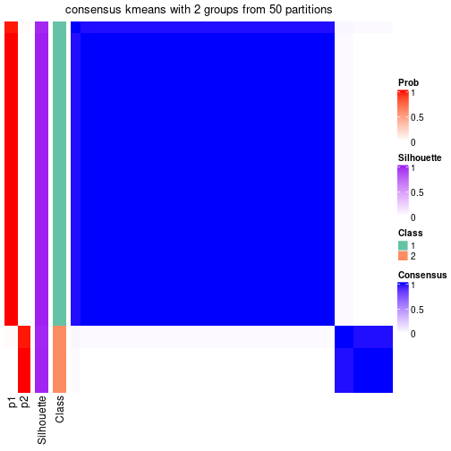</p>

</div>
<div id='tab-node-031-consensus-heatmap-2'>
<pre><code class="r">consensus_heatmap(res, k = 3)
</code></pre>

<p></p>

</div>
<div id='tab-node-031-consensus-heatmap-3'>
<pre><code class="r">consensus_heatmap(res, k = 4)
</code></pre>

<p></p>

</div>
<div id='tab-node-031-consensus-heatmap-4'>
<pre><code class="r">consensus_heatmap(res, k = 5)
</code></pre>

<p></p>

</div>
<div id='tab-node-031-consensus-heatmap-5'>
<pre><code class="r">consensus_heatmap(res, k = 6)
</code></pre>

<p></p>

</div>
<div id='tab-node-031-consensus-heatmap-6'>
<pre><code class="r">consensus_heatmap(res, k = 7)
</code></pre>

<p></p>

</div>
<div id='tab-node-031-consensus-heatmap-7'>
<pre><code class="r">consensus_heatmap(res, k = 8)
</code></pre>

<p></p>

</div>
</div>

Heatmaps for the membership of samples in all partitions to see how consistent they are:


<script>
$( function() {
	$( '#tabs-node-031-membership-heatmap' ).tabs();
} );
</script>
<div id='tabs-node-031-membership-heatmap'>
<ul>
<li><a href='#tab-node-031-membership-heatmap-1'>k = 2</a></li>
<li><a href='#tab-node-031-membership-heatmap-2'>k = 3</a></li>
<li><a href='#tab-node-031-membership-heatmap-3'>k = 4</a></li>
<li><a href='#tab-node-031-membership-heatmap-4'>k = 5</a></li>
<li><a href='#tab-node-031-membership-heatmap-5'>k = 6</a></li>
<li><a href='#tab-node-031-membership-heatmap-6'>k = 7</a></li>
<li><a href='#tab-node-031-membership-heatmap-7'>k = 8</a></li>
</ul>
<div id='tab-node-031-membership-heatmap-1'>
<pre><code class="r">membership_heatmap(res, k = 2)
</code></pre>

<p></p>

</div>
<div id='tab-node-031-membership-heatmap-2'>
<pre><code class="r">membership_heatmap(res, k = 3)
</code></pre>

<p></p>

</div>
<div id='tab-node-031-membership-heatmap-3'>
<pre><code class="r">membership_heatmap(res, k = 4)
</code></pre>

<p></p>

</div>
<div id='tab-node-031-membership-heatmap-4'>
<pre><code class="r">membership_heatmap(res, k = 5)
</code></pre>

<p></p>

</div>
<div id='tab-node-031-membership-heatmap-5'>
<pre><code class="r">membership_heatmap(res, k = 6)
</code></pre>

<p></p>

</div>
<div id='tab-node-031-membership-heatmap-6'>
<pre><code class="r">membership_heatmap(res, k = 7)
</code></pre>

<p></p>

</div>
<div id='tab-node-031-membership-heatmap-7'>
<pre><code class="r">membership_heatmap(res, k = 8)
</code></pre>

<p></p>

</div>
</div>

As soon as the classes for columns are determined, the signatures
that are significantly different between subgroups can be looked for. 
Following are the heatmaps for signatures.


<script>
$( function() {
	$( '#tabs-node-031-get-signatures' ).tabs();
} );
</script>
<div id='tabs-node-031-get-signatures'>
<ul>
<li><a href='#tab-node-031-get-signatures-1'>k = 2</a></li>
<li><a href='#tab-node-031-get-signatures-2'>k = 3</a></li>
<li><a href='#tab-node-031-get-signatures-3'>k = 4</a></li>
<li><a href='#tab-node-031-get-signatures-4'>k = 5</a></li>
<li><a href='#tab-node-031-get-signatures-5'>k = 6</a></li>
<li><a href='#tab-node-031-get-signatures-6'>k = 7</a></li>
<li><a href='#tab-node-031-get-signatures-7'>k = 8</a></li>
</ul>
<div id='tab-node-031-get-signatures-1'>
<pre><code class="r">get_signatures(res, k = 2)
</code></pre>

<p></p>

</div>
<div id='tab-node-031-get-signatures-2'>
<pre><code class="r">get_signatures(res, k = 3)
</code></pre>

<p></p>

</div>
<div id='tab-node-031-get-signatures-3'>
<pre><code class="r">get_signatures(res, k = 4)
</code></pre>

<p></p>

</div>
<div id='tab-node-031-get-signatures-4'>
<pre><code class="r">get_signatures(res, k = 5)
</code></pre>

<p>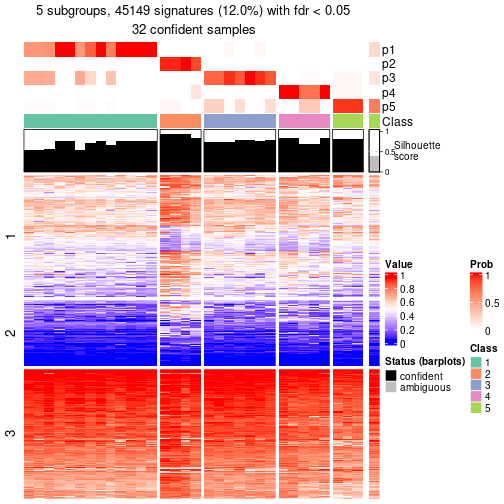</p>

</div>
<div id='tab-node-031-get-signatures-5'>
<pre><code class="r">get_signatures(res, k = 6)
</code></pre>

<p></p>

</div>
<div id='tab-node-031-get-signatures-6'>
<pre><code class="r">get_signatures(res, k = 7)
</code></pre>

<p></p>

</div>
<div id='tab-node-031-get-signatures-7'>
<pre><code class="r">get_signatures(res, k = 8)
</code></pre>

<p></p>

</div>
</div>


Compare the overlap of signatures from different k:

```r
compare_signatures(res)
```


`get_signature()` returns a data frame invisibly. To get the list of signatures, the function
call should be assigned to a variable explicitly. In following code, if `plot` argument is set
to `FALSE`, no heatmap is plotted while only the differential analysis is performed.

```r
# code only for demonstration
tb = get_signature(res, k = ..., plot = FALSE)
```

An example of the output of `tb` is:

```
#>   which_row         fdr    mean_1    mean_2 scaled_mean_1 scaled_mean_2 km
#> 1        38 0.042760348  8.373488  9.131774    -0.5533452     0.5164555  1
#> 2        40 0.018707592  7.106213  8.469186    -0.6173731     0.5762149  1
#> 3        55 0.019134737 10.221463 11.207825    -0.6159697     0.5749050  1
#> 4        59 0.006059896  5.921854  7.869574    -0.6899429     0.6439467  1
#> 5        60 0.018055526  8.928898 10.211722    -0.6204761     0.5791110  1
#> 6        98 0.009384629 15.714769 14.887706     0.6635654    -0.6193277  2
...
```

The columns in `tb` are:

1. `which_row`: row indices corresponding to the input matrix.
2. `fdr`: FDR for the differential test. 
3. `mean_x`: The mean value in group x.
4. `scaled_mean_x`: The mean value in group x after rows are scaled.
5. `km`: Row groups if k-means clustering is applied to rows (which is done by automatically selecting number of clusters).

If there are too many signatures, `top_signatures = ...` can be set to only show the 
signatures with the highest FDRs:

```r
# code only for demonstration
# e.g. to show the top 500 most significant rows
tb = get_signature(res, k = ..., top_signatures = 500)
```

If the signatures are defined as these which are uniquely high in current group, `diff_method` argument
can be set to `"uniquely_high_in_one_group"`:

```r
# code only for demonstration
tb = get_signature(res, k = ..., diff_method = "uniquely_high_in_one_group")
```


UMAP plot which shows how samples are separated.


<script>
$( function() {
	$( '#tabs-node-031-dimension-reduction' ).tabs();
} );
</script>
<div id='tabs-node-031-dimension-reduction'>
<ul>
<li><a href='#tab-node-031-dimension-reduction-1'>k = 2</a></li>
<li><a href='#tab-node-031-dimension-reduction-2'>k = 3</a></li>
<li><a href='#tab-node-031-dimension-reduction-3'>k = 4</a></li>
<li><a href='#tab-node-031-dimension-reduction-4'>k = 5</a></li>
<li><a href='#tab-node-031-dimension-reduction-5'>k = 6</a></li>
<li><a href='#tab-node-031-dimension-reduction-6'>k = 7</a></li>
<li><a href='#tab-node-031-dimension-reduction-7'>k = 8</a></li>
</ul>
<div id='tab-node-031-dimension-reduction-1'>
<pre><code class="r">dimension_reduction(res, k = 2, method = &quot;UMAP&quot;)
</code></pre>

<p></p>

</div>
<div id='tab-node-031-dimension-reduction-2'>
<pre><code class="r">dimension_reduction(res, k = 3, method = &quot;UMAP&quot;)
</code></pre>

<p></p>

</div>
<div id='tab-node-031-dimension-reduction-3'>
<pre><code class="r">dimension_reduction(res, k = 4, method = &quot;UMAP&quot;)
</code></pre>

<p></p>

</div>
<div id='tab-node-031-dimension-reduction-4'>
<pre><code class="r">dimension_reduction(res, k = 5, method = &quot;UMAP&quot;)
</code></pre>

<p></p>

</div>
<div id='tab-node-031-dimension-reduction-5'>
<pre><code class="r">dimension_reduction(res, k = 6, method = &quot;UMAP&quot;)
</code></pre>

<p></p>

</div>
<div id='tab-node-031-dimension-reduction-6'>
<pre><code class="r">dimension_reduction(res, k = 7, method = &quot;UMAP&quot;)
</code></pre>

<p></p>

</div>
<div id='tab-node-031-dimension-reduction-7'>
<pre><code class="r">dimension_reduction(res, k = 8, method = &quot;UMAP&quot;)
</code></pre>

<p></p>

</div>
</div>


Following heatmap shows how subgroups are split when increasing `k`:

```r
collect_classes(res)
```


If matrix rows can be associated to genes, consider to use `functional_enrichment(res,
...)` to perform function enrichment for the signature genes. See [this vignette](https://jokergoo.github.io/cola_vignettes/functional_enrichment.html) for more detailed explanations.


 

---------------------------------------------------


### Node0311


Parent node: [Node031](#Node031).
Child nodes: 
                Node01311-leaf
        ,
                Node01312-leaf
        ,
                Node03111-leaf
        ,
                Node03112-leaf
        ,
                Node03113-leaf
        .


The object with results only for a single top-value method and a single partitioning method 
can be extracted as:

```r
res = res_rh["0311"]
```

A summary of `res` and all the functions that can be applied to it:

```r
res
```

```
#> A 'ConsensusPartition' object with k = 2, 3, 4, 5, 6, 7, 8.
#>   On a matrix with 30000 rows and 17 columns.
#>   Top rows (1000) are extracted by 'SD' method.
#>   Subgroups are detected by 'kmeans' method.
#>   Performed in total 350 partitions by row resampling.
#>   Best k for subgroups seems to be 7.
#> 
#> Following methods can be applied to this 'ConsensusPartition' object:
#>  [1] "cola_report"             "collect_classes"         "collect_plots"          
#>  [4] "collect_stats"           "colnames"                "compare_partitions"     
#>  [7] "compare_signatures"      "consensus_heatmap"       "dimension_reduction"    
#> [10] "functional_enrichment"   "get_anno_col"            "get_anno"               
#> [13] "get_classes"             "get_consensus"           "get_matrix"             
#> [16] "get_membership"          "get_param"               "get_signatures"         
#> [19] "get_stats"               "is_best_k"               "is_stable_k"            
#> [22] "membership_heatmap"      "ncol"                    "nrow"                   
#> [25] "plot_ecdf"               "predict_classes"         "rownames"               
#> [28] "select_partition_number" "show"                    "suggest_best_k"         
#> [31] "test_to_known_factors"   "top_rows_heatmap"
```

`collect_plots()` function collects all the plots made from `res` for all `k` (number of subgroups)
into one single page to provide an easy and fast comparison between different `k`.

```r
collect_plots(res)
```


The plots are:

- The first row: a plot of the eCDF (empirical cumulative distribution
  function) curves of the consensus matrix for each `k` and the heatmap of
  predicted classes for each `k`.
- The second row: heatmaps of the consensus matrix for each `k`.
- The third row: heatmaps of the membership matrix for each `k`.
- The fouth row: heatmaps of the signatures for each `k`.

All the plots in panels can be made by individual functions and they are
plotted later in this section.

`select_partition_number()` produces several plots showing different
statistics for choosing "optimized" `k`. There are following statistics:

- eCDF curves of the consensus matrix for each `k`;
- 1-PAC. [The PAC score](https://en.wikipedia.org/wiki/Consensus_clustering#Over-interpretation_potential_of_consensus_clustering)
  measures the proportion of the ambiguous subgrouping.
- Mean silhouette score.
- Concordance. The mean probability of fiting the consensus subgroup labels in all
  partitions.
- Area increased. Denote $A_k$ as the area under the eCDF curve for current
  `k`, the area increased is defined as $A_k - A_{k-1}$.
- Rand index. The percent of pairs of samples that are both in a same cluster
  or both are not in a same cluster in the partition of k and k-1.
- Jaccard index. The ratio of pairs of samples are both in a same cluster in
  the partition of k and k-1 and the pairs of samples are both in a same
  cluster in the partition k or k-1.

The detailed explanations of these statistics can be found in [the _cola_
vignette](https://jokergoo.github.io/cola_vignettes/cola.html#toc_13).

Generally speaking, higher 1-PAC score, higher mean silhouette score or higher
concordance corresponds to better partition. Rand index and Jaccard index
measure how similar the current partition is compared to partition with `k-1`.
If they are too similar, we won't accept `k` is better than `k-1`.

```r
select_partition_number(res)
```


The numeric values for all these statistics can be obtained by `get_stats()`.

```r
get_stats(res)
```

```
#>   k 1-PAC mean_silhouette concordance area_increased  Rand Jaccard
#> 2 2 0.559           0.814       0.900         0.3844 0.691   0.691
#> 3 3 0.640           0.960       0.927         0.5772 0.669   0.521
#> 4 4 0.779           0.841       0.868         0.2103 0.897   0.714
#> 5 5 0.794           0.916       0.913         0.0881 0.926   0.714
#> 6 6 0.838           0.845       0.900         0.0397 1.000   1.000
#> 7 7 0.904           0.793       0.886         0.0279 0.971   0.840
#> 8 8 0.868           0.635       0.836         0.0241 0.993   0.952
```

`suggest_best_k()` suggests the best $k$ based on these statistics. The rules are as follows:

- All $k$ with Jaccard index larger than 0.95 are removed because increasing
  $k$ does not provide enough extra information. If all $k$ are removed, it is
  marked as no subgroup is detected.
- For all $k$ with 1-PAC score larger than 0.9, the maximal $k$ is taken as
  the best $k$, and other $k$ are marked as optional $k$.
- If it does not fit the second rule. The $k$ with the maximal vote of the
  highest 1-PAC score, highest mean silhouette, and highest concordance is
  taken as the best $k$.

```r
suggest_best_k(res)
```

```
#> [1] 7
```


Following is the table of the partitions (You need to click the **show/hide
code output** link to see it). The membership matrix (columns with name `p*`)
is inferred by
[`clue::cl_consensus()`](https://www.rdocumentation.org/link/cl_consensus?package=clue)
function with the `SE` method. Basically the value in the membership matrix
represents the probability to belong to a certain group. The finall subgroup
label for an item is determined with the group with highest probability it
belongs to.

In `get_classes()` function, the entropy is calculated from the membership
matrix and the silhouette score is calculated from the consensus matrix.


<script>
$( function() {
	$( '#tabs-node-0311-get-classes' ).tabs();
} );
</script>
<div id='tabs-node-0311-get-classes'>
<ul>
<li><a href='#tab-node-0311-get-classes-1'>k = 2</a></li>
<li><a href='#tab-node-0311-get-classes-2'>k = 3</a></li>
<li><a href='#tab-node-0311-get-classes-3'>k = 4</a></li>
<li><a href='#tab-node-0311-get-classes-4'>k = 5</a></li>
<li><a href='#tab-node-0311-get-classes-5'>k = 6</a></li>
<li><a href='#tab-node-0311-get-classes-6'>k = 7</a></li>
<li><a href='#tab-node-0311-get-classes-7'>k = 8</a></li>
</ul>

<div id='tab-node-0311-get-classes-1'>
<p><a id='tab-node-0311-get-classes-1-a' style='color:#0366d6' href='#'>show/hide code output</a></p>
<pre><code class="r">cbind(get_classes(res, k = 2), get_membership(res, k = 2))
</code></pre>

<pre><code>#&gt;                 class entropy silhouette   p1   p2
#&gt; TCGA.B3.8121.01     2   0.925      1.000 0.34 0.66
#&gt; TCGA.GL.A9DD.01     1   0.925      0.848 0.66 0.34
#&gt; TCGA.IA.A83S.01     1   0.925      0.848 0.66 0.34
#&gt; TCGA.KV.A6GD.01     1   0.925      0.848 0.66 0.34
#&gt; TCGA.BQ.5889.01     1   0.000      0.643 1.00 0.00
#&gt; TCGA.B1.A47O.01     2   0.925      1.000 0.34 0.66
#&gt; TCGA.B9.A5W8.01     1   0.925      0.848 0.66 0.34
#&gt; TCGA.HE.7128.01     1   0.925      0.848 0.66 0.34
#&gt; TCGA.BQ.7059.01     1   0.925      0.848 0.66 0.34
#&gt; TCGA.BQ.7049.01     1   0.000      0.643 1.00 0.00
#&gt; TCGA.HE.A5NF.01     1   0.925      0.848 0.66 0.34
#&gt; TCGA.HE.A5NK.01     1   0.925      0.848 0.66 0.34
#&gt; TCGA.AL.7173.01     2   0.925      1.000 0.34 0.66
#&gt; TCGA.DW.7838.01     1   0.000      0.643 1.00 0.00
#&gt; TCGA.V9.A7HT.01     1   0.925      0.848 0.66 0.34
#&gt; TCGA.DZ.6132.01     1   0.000      0.643 1.00 0.00
#&gt; TCGA.2K.A9WE.01     1   0.000      0.643 1.00 0.00
</code></pre>

<script>
$('#tab-node-0311-get-classes-1-a').parent().next().next().hide();
$('#tab-node-0311-get-classes-1-a').click(function(){
  $('#tab-node-0311-get-classes-1-a').parent().next().next().toggle();
  return(false);
});
</script>
</div>

<div id='tab-node-0311-get-classes-2'>
<p><a id='tab-node-0311-get-classes-2-a' style='color:#0366d6' href='#'>show/hide code output</a></p>
<pre><code class="r">cbind(get_classes(res, k = 3), get_membership(res, k = 3))
</code></pre>

<pre><code>#&gt;                 class entropy silhouette   p1   p2   p3
#&gt; TCGA.B3.8121.01     2  0.0892      0.981 0.00 0.98 0.02
#&gt; TCGA.GL.A9DD.01     1  0.3340      0.950 0.88 0.00 0.12
#&gt; TCGA.IA.A83S.01     1  0.2537      0.954 0.92 0.00 0.08
#&gt; TCGA.KV.A6GD.01     1  0.2959      0.955 0.90 0.00 0.10
#&gt; TCGA.BQ.5889.01     3  0.2537      0.993 0.08 0.00 0.92
#&gt; TCGA.B1.A47O.01     2  0.0892      0.981 0.00 0.98 0.02
#&gt; TCGA.B9.A5W8.01     1  0.0892      0.890 0.98 0.02 0.00
#&gt; TCGA.HE.7128.01     1  0.2959      0.955 0.90 0.00 0.10
#&gt; TCGA.BQ.7059.01     1  0.3340      0.950 0.88 0.00 0.12
#&gt; TCGA.BQ.7049.01     3  0.2537      0.993 0.08 0.00 0.92
#&gt; TCGA.HE.A5NF.01     1  0.2959      0.955 0.90 0.00 0.10
#&gt; TCGA.HE.A5NK.01     1  0.2537      0.954 0.92 0.00 0.08
#&gt; TCGA.AL.7173.01     2  0.2537      0.962 0.00 0.92 0.08
#&gt; TCGA.DW.7838.01     3  0.2066      0.973 0.06 0.00 0.94
#&gt; TCGA.V9.A7HT.01     1  0.0892      0.890 0.98 0.02 0.00
#&gt; TCGA.DZ.6132.01     3  0.2537      0.993 0.08 0.00 0.92
#&gt; TCGA.2K.A9WE.01     3  0.2537      0.993 0.08 0.00 0.92
</code></pre>

<script>
$('#tab-node-0311-get-classes-2-a').parent().next().next().hide();
$('#tab-node-0311-get-classes-2-a').click(function(){
  $('#tab-node-0311-get-classes-2-a').parent().next().next().toggle();
  return(false);
});
</script>
</div>

<div id='tab-node-0311-get-classes-3'>
<p><a id='tab-node-0311-get-classes-3-a' style='color:#0366d6' href='#'>show/hide code output</a></p>
<pre><code class="r">cbind(get_classes(res, k = 4), get_membership(res, k = 4))
</code></pre>

<pre><code>#&gt;                 class entropy silhouette   p1   p2   p3   p4
#&gt; TCGA.B3.8121.01     2  0.0000      0.951 0.00 1.00 0.00 0.00
#&gt; TCGA.GL.A9DD.01     1  0.4624      0.509 0.66 0.00 0.00 0.34
#&gt; TCGA.IA.A83S.01     1  0.0000      0.741 1.00 0.00 0.00 0.00
#&gt; TCGA.KV.A6GD.01     1  0.0000      0.741 1.00 0.00 0.00 0.00
#&gt; TCGA.BQ.5889.01     3  0.0000      0.995 0.00 0.00 1.00 0.00
#&gt; TCGA.B1.A47O.01     2  0.0000      0.951 0.00 1.00 0.00 0.00
#&gt; TCGA.B9.A5W8.01     4  0.4994      1.000 0.48 0.00 0.00 0.52
#&gt; TCGA.HE.7128.01     1  0.0000      0.741 1.00 0.00 0.00 0.00
#&gt; TCGA.BQ.7059.01     1  0.4624      0.509 0.66 0.00 0.00 0.34
#&gt; TCGA.BQ.7049.01     3  0.0000      0.995 0.00 0.00 1.00 0.00
#&gt; TCGA.HE.A5NF.01     1  0.0000      0.741 1.00 0.00 0.00 0.00
#&gt; TCGA.HE.A5NK.01     1  0.2345      0.552 0.90 0.00 0.00 0.10
#&gt; TCGA.AL.7173.01     2  0.2921      0.899 0.00 0.86 0.00 0.14
#&gt; TCGA.DW.7838.01     3  0.0707      0.981 0.00 0.00 0.98 0.02
#&gt; TCGA.V9.A7HT.01     4  0.4994      1.000 0.48 0.00 0.00 0.52
#&gt; TCGA.DZ.6132.01     3  0.0000      0.995 0.00 0.00 1.00 0.00
#&gt; TCGA.2K.A9WE.01     3  0.0000      0.995 0.00 0.00 1.00 0.00
</code></pre>

<script>
$('#tab-node-0311-get-classes-3-a').parent().next().next().hide();
$('#tab-node-0311-get-classes-3-a').click(function(){
  $('#tab-node-0311-get-classes-3-a').parent().next().next().toggle();
  return(false);
});
</script>
</div>

<div id='tab-node-0311-get-classes-4'>
<p><a id='tab-node-0311-get-classes-4-a' style='color:#0366d6' href='#'>show/hide code output</a></p>
<pre><code class="r">cbind(get_classes(res, k = 5), get_membership(res, k = 5))
</code></pre>

<pre><code>#&gt;                 class entropy silhouette   p1   p2   p3   p4   p5
#&gt; TCGA.B3.8121.01     2  0.0609      0.908 0.00 0.98 0.00 0.02 0.00
#&gt; TCGA.GL.A9DD.01     5  0.5092      0.894 0.26 0.00 0.02 0.04 0.68
#&gt; TCGA.IA.A83S.01     1  0.0000      0.909 1.00 0.00 0.00 0.00 0.00
#&gt; TCGA.KV.A6GD.01     1  0.0609      0.918 0.98 0.00 0.02 0.00 0.00
#&gt; TCGA.BQ.5889.01     3  0.0000      0.972 0.00 0.00 1.00 0.00 0.00
#&gt; TCGA.B1.A47O.01     2  0.0000      0.908 0.00 1.00 0.00 0.00 0.00
#&gt; TCGA.B9.A5W8.01     4  0.2516      0.971 0.14 0.00 0.00 0.86 0.00
#&gt; TCGA.HE.7128.01     1  0.1216      0.905 0.96 0.00 0.02 0.02 0.00
#&gt; TCGA.BQ.7059.01     5  0.4096      0.898 0.20 0.00 0.04 0.00 0.76
#&gt; TCGA.BQ.7049.01     3  0.1648      0.950 0.00 0.00 0.94 0.02 0.04
#&gt; TCGA.HE.A5NF.01     1  0.0609      0.918 0.98 0.00 0.02 0.00 0.00
#&gt; TCGA.HE.A5NK.01     1  0.3697      0.740 0.82 0.00 0.00 0.08 0.10
#&gt; TCGA.AL.7173.01     2  0.4170      0.822 0.00 0.78 0.00 0.08 0.14
#&gt; TCGA.DW.7838.01     3  0.1043      0.949 0.00 0.00 0.96 0.00 0.04
#&gt; TCGA.V9.A7HT.01     4  0.2732      0.971 0.16 0.00 0.00 0.84 0.00
#&gt; TCGA.DZ.6132.01     3  0.0609      0.969 0.00 0.00 0.98 0.00 0.02
#&gt; TCGA.2K.A9WE.01     3  0.0000      0.972 0.00 0.00 1.00 0.00 0.00
</code></pre>

<script>
$('#tab-node-0311-get-classes-4-a').parent().next().next().hide();
$('#tab-node-0311-get-classes-4-a').click(function(){
  $('#tab-node-0311-get-classes-4-a').parent().next().next().toggle();
  return(false);
});
</script>
</div>

<div id='tab-node-0311-get-classes-5'>
<p><a id='tab-node-0311-get-classes-5-a' style='color:#0366d6' href='#'>show/hide code output</a></p>
<pre><code class="r">cbind(get_classes(res, k = 6), get_membership(res, k = 6))
</code></pre>

<pre><code>#&gt;                 class entropy silhouette   p1   p2   p3   p4   p5   p6
#&gt; TCGA.B3.8121.01     2  0.0000      0.853 0.00 1.00 0.00 0.00 0.00 0.00
#&gt; TCGA.GL.A9DD.01     5  0.2793      0.746 0.20 0.00 0.00 0.00 0.80 0.00
#&gt; TCGA.IA.A83S.01     1  0.0000      0.893 1.00 0.00 0.00 0.00 0.00 0.00
#&gt; TCGA.KV.A6GD.01     1  0.0000      0.893 1.00 0.00 0.00 0.00 0.00 0.00
#&gt; TCGA.BQ.5889.01     3  0.0000      0.922 0.00 0.00 1.00 0.00 0.00 0.00
#&gt; TCGA.B1.A47O.01     2  0.0000      0.853 0.00 1.00 0.00 0.00 0.00 0.00
#&gt; TCGA.B9.A5W8.01     4  0.0937      1.000 0.04 0.00 0.00 0.96 0.00 0.00
#&gt; TCGA.HE.7128.01     1  0.0000      0.893 1.00 0.00 0.00 0.00 0.00 0.00
#&gt; TCGA.BQ.7059.01     5  0.4926      0.743 0.12 0.00 0.00 0.00 0.64 0.24
#&gt; TCGA.BQ.7049.01     3  0.3787      0.785 0.00 0.00 0.78 0.00 0.12 0.10
#&gt; TCGA.HE.A5NF.01     1  0.0000      0.893 1.00 0.00 0.00 0.00 0.00 0.00
#&gt; TCGA.HE.A5NK.01     1  0.4844      0.502 0.62 0.00 0.00 0.04 0.02 0.32
#&gt; TCGA.AL.7173.01     2  0.3578      0.683 0.00 0.66 0.00 0.00 0.00 0.34
#&gt; TCGA.DW.7838.01     3  0.2403      0.867 0.00 0.00 0.90 0.04 0.04 0.02
#&gt; TCGA.V9.A7HT.01     4  0.0937      1.000 0.04 0.00 0.00 0.96 0.00 0.00
#&gt; TCGA.DZ.6132.01     3  0.0547      0.919 0.00 0.00 0.98 0.00 0.00 0.02
#&gt; TCGA.2K.A9WE.01     3  0.0000      0.922 0.00 0.00 1.00 0.00 0.00 0.00
</code></pre>

<script>
$('#tab-node-0311-get-classes-5-a').parent().next().next().hide();
$('#tab-node-0311-get-classes-5-a').click(function(){
  $('#tab-node-0311-get-classes-5-a').parent().next().next().toggle();
  return(false);
});
</script>
</div>

<div id='tab-node-0311-get-classes-6'>
<p><a id='tab-node-0311-get-classes-6-a' style='color:#0366d6' href='#'>show/hide code output</a></p>
<pre><code class="r">cbind(get_classes(res, k = 7), get_membership(res, k = 7))
</code></pre>

<pre><code>#&gt;                 class entropy silhouette   p1   p2   p3   p4   p5   p6   p7
#&gt; TCGA.B3.8121.01     2  0.1363      0.803 0.00 0.94 0.04 0.00 0.02 0.00 0.00
#&gt; TCGA.GL.A9DD.01     5  0.4426      0.642 0.06 0.00 0.38 0.00 0.56 0.00 0.00
#&gt; TCGA.IA.A83S.01     1  0.0000      1.000 1.00 0.00 0.00 0.00 0.00 0.00 0.00
#&gt; TCGA.KV.A6GD.01     1  0.0000      1.000 1.00 0.00 0.00 0.00 0.00 0.00 0.00
#&gt; TCGA.BQ.5889.01     6  0.0000      0.914 0.00 0.00 0.00 0.00 0.00 1.00 0.00
#&gt; TCGA.B1.A47O.01     2  0.0000      0.803 0.00 1.00 0.00 0.00 0.00 0.00 0.00
#&gt; TCGA.B9.A5W8.01     4  0.0000      0.801 0.00 0.00 0.00 1.00 0.00 0.00 0.00
#&gt; TCGA.HE.7128.01     1  0.0000      1.000 1.00 0.00 0.00 0.00 0.00 0.00 0.00
#&gt; TCGA.BQ.7059.01     5  0.0504      0.649 0.02 0.00 0.00 0.00 0.98 0.00 0.00
#&gt; TCGA.BQ.7049.01     6  0.3835      0.742 0.00 0.00 0.16 0.00 0.00 0.74 0.10
#&gt; TCGA.HE.A5NF.01     1  0.0000      1.000 1.00 0.00 0.00 0.00 0.00 0.00 0.00
#&gt; TCGA.HE.A5NK.01     7  0.3459      0.000 0.40 0.00 0.00 0.00 0.00 0.00 0.60
#&gt; TCGA.AL.7173.01     2  0.4789      0.623 0.00 0.60 0.14 0.00 0.00 0.00 0.26
#&gt; TCGA.DW.7838.01     6  0.1006      0.901 0.00 0.00 0.00 0.00 0.02 0.96 0.02
#&gt; TCGA.V9.A7HT.01     4  0.3186      0.801 0.00 0.00 0.22 0.76 0.00 0.00 0.02
#&gt; TCGA.DZ.6132.01     6  0.1433      0.890 0.00 0.00 0.08 0.00 0.00 0.92 0.00
#&gt; TCGA.2K.A9WE.01     6  0.0000      0.914 0.00 0.00 0.00 0.00 0.00 1.00 0.00
</code></pre>

<script>
$('#tab-node-0311-get-classes-6-a').parent().next().next().hide();
$('#tab-node-0311-get-classes-6-a').click(function(){
  $('#tab-node-0311-get-classes-6-a').parent().next().next().toggle();
  return(false);
});
</script>
</div>

<div id='tab-node-0311-get-classes-7'>
<p><a id='tab-node-0311-get-classes-7-a' style='color:#0366d6' href='#'>show/hide code output</a></p>
<pre><code class="r">cbind(get_classes(res, k = 8), get_membership(res, k = 8))
</code></pre>

<pre><code>#&gt;                 class entropy silhouette   p1   p2   p3   p4   p5   p6   p7   p8
#&gt; TCGA.B3.8121.01     2  0.3329      0.733 0.00 0.52 0.48 0.00 0.00 0.00 0.00 0.00
#&gt; TCGA.GL.A9DD.01     5  0.2981      0.000 0.02 0.00 0.00 0.00 0.76 0.00 0.00 0.22
#&gt; TCGA.IA.A83S.01     1  0.0000      0.988 1.00 0.00 0.00 0.00 0.00 0.00 0.00 0.00
#&gt; TCGA.KV.A6GD.01     1  0.0000      0.988 1.00 0.00 0.00 0.00 0.00 0.00 0.00 0.00
#&gt; TCGA.BQ.5889.01     6  0.0000      0.777 0.00 0.00 0.00 0.00 0.00 1.00 0.00 0.00
#&gt; TCGA.B1.A47O.01     2  0.4995      0.733 0.00 0.52 0.36 0.00 0.08 0.00 0.04 0.00
#&gt; TCGA.B9.A5W8.01     4  0.0000      0.828 0.00 0.00 0.00 1.00 0.00 0.00 0.00 0.00
#&gt; TCGA.HE.7128.01     1  0.0471      0.963 0.98 0.00 0.00 0.00 0.02 0.00 0.00 0.00
#&gt; TCGA.BQ.7059.01     8  0.0000      0.000 0.00 0.00 0.00 0.00 0.00 0.00 0.00 1.00
#&gt; TCGA.BQ.7049.01     6  0.5425      0.273 0.00 0.00 0.34 0.00 0.02 0.44 0.20 0.00
#&gt; TCGA.HE.A5NF.01     1  0.0000      0.988 1.00 0.00 0.00 0.00 0.00 0.00 0.00 0.00
#&gt; TCGA.HE.A5NK.01     7  0.3658      0.000 0.40 0.00 0.00 0.02 0.00 0.00 0.58 0.00
#&gt; TCGA.AL.7173.01     2  0.0000      0.523 0.00 1.00 0.00 0.00 0.00 0.00 0.00 0.00
#&gt; TCGA.DW.7838.01     6  0.3817      0.636 0.00 0.00 0.12 0.00 0.00 0.76 0.08 0.04
#&gt; TCGA.V9.A7HT.01     4  0.3454      0.828 0.00 0.00 0.06 0.80 0.08 0.00 0.06 0.00
#&gt; TCGA.DZ.6132.01     6  0.1887      0.752 0.00 0.00 0.00 0.00 0.06 0.90 0.04 0.00
#&gt; TCGA.2K.A9WE.01     6  0.0000      0.777 0.00 0.00 0.00 0.00 0.00 1.00 0.00 0.00
</code></pre>

<script>
$('#tab-node-0311-get-classes-7-a').parent().next().next().hide();
$('#tab-node-0311-get-classes-7-a').click(function(){
  $('#tab-node-0311-get-classes-7-a').parent().next().next().toggle();
  return(false);
});
</script>
</div>
</div>

Heatmaps for the consensus matrix. It visualizes the probability of two
samples to be in a same group.


<script>
$( function() {
	$( '#tabs-node-0311-consensus-heatmap' ).tabs();
} );
</script>
<div id='tabs-node-0311-consensus-heatmap'>
<ul>
<li><a href='#tab-node-0311-consensus-heatmap-1'>k = 2</a></li>
<li><a href='#tab-node-0311-consensus-heatmap-2'>k = 3</a></li>
<li><a href='#tab-node-0311-consensus-heatmap-3'>k = 4</a></li>
<li><a href='#tab-node-0311-consensus-heatmap-4'>k = 5</a></li>
<li><a href='#tab-node-0311-consensus-heatmap-5'>k = 6</a></li>
<li><a href='#tab-node-0311-consensus-heatmap-6'>k = 7</a></li>
<li><a href='#tab-node-0311-consensus-heatmap-7'>k = 8</a></li>
</ul>
<div id='tab-node-0311-consensus-heatmap-1'>
<pre><code class="r">consensus_heatmap(res, k = 2)
</code></pre>

<p></p>

</div>
<div id='tab-node-0311-consensus-heatmap-2'>
<pre><code class="r">consensus_heatmap(res, k = 3)
</code></pre>

<p></p>

</div>
<div id='tab-node-0311-consensus-heatmap-3'>
<pre><code class="r">consensus_heatmap(res, k = 4)
</code></pre>

<p></p>

</div>
<div id='tab-node-0311-consensus-heatmap-4'>
<pre><code class="r">consensus_heatmap(res, k = 5)
</code></pre>

<p></p>

</div>
<div id='tab-node-0311-consensus-heatmap-5'>
<pre><code class="r">consensus_heatmap(res, k = 6)
</code></pre>

<p></p>

</div>
<div id='tab-node-0311-consensus-heatmap-6'>
<pre><code class="r">consensus_heatmap(res, k = 7)
</code></pre>

<p>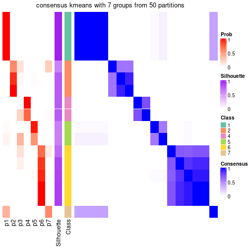</p>

</div>
<div id='tab-node-0311-consensus-heatmap-7'>
<pre><code class="r">consensus_heatmap(res, k = 8)
</code></pre>

<p></p>

</div>
</div>

Heatmaps for the membership of samples in all partitions to see how consistent they are:


<script>
$( function() {
	$( '#tabs-node-0311-membership-heatmap' ).tabs();
} );
</script>
<div id='tabs-node-0311-membership-heatmap'>
<ul>
<li><a href='#tab-node-0311-membership-heatmap-1'>k = 2</a></li>
<li><a href='#tab-node-0311-membership-heatmap-2'>k = 3</a></li>
<li><a href='#tab-node-0311-membership-heatmap-3'>k = 4</a></li>
<li><a href='#tab-node-0311-membership-heatmap-4'>k = 5</a></li>
<li><a href='#tab-node-0311-membership-heatmap-5'>k = 6</a></li>
<li><a href='#tab-node-0311-membership-heatmap-6'>k = 7</a></li>
<li><a href='#tab-node-0311-membership-heatmap-7'>k = 8</a></li>
</ul>
<div id='tab-node-0311-membership-heatmap-1'>
<pre><code class="r">membership_heatmap(res, k = 2)
</code></pre>

<p></p>

</div>
<div id='tab-node-0311-membership-heatmap-2'>
<pre><code class="r">membership_heatmap(res, k = 3)
</code></pre>

<p></p>

</div>
<div id='tab-node-0311-membership-heatmap-3'>
<pre><code class="r">membership_heatmap(res, k = 4)
</code></pre>

<p></p>

</div>
<div id='tab-node-0311-membership-heatmap-4'>
<pre><code class="r">membership_heatmap(res, k = 5)
</code></pre>

<p></p>

</div>
<div id='tab-node-0311-membership-heatmap-5'>
<pre><code class="r">membership_heatmap(res, k = 6)
</code></pre>

<p></p>

</div>
<div id='tab-node-0311-membership-heatmap-6'>
<pre><code class="r">membership_heatmap(res, k = 7)
</code></pre>

<p></p>

</div>
<div id='tab-node-0311-membership-heatmap-7'>
<pre><code class="r">membership_heatmap(res, k = 8)
</code></pre>

<p></p>

</div>
</div>

As soon as the classes for columns are determined, the signatures
that are significantly different between subgroups can be looked for. 
Following are the heatmaps for signatures.


<script>
$( function() {
	$( '#tabs-node-0311-get-signatures' ).tabs();
} );
</script>
<div id='tabs-node-0311-get-signatures'>
<ul>
<li><a href='#tab-node-0311-get-signatures-1'>k = 2</a></li>
<li><a href='#tab-node-0311-get-signatures-2'>k = 3</a></li>
<li><a href='#tab-node-0311-get-signatures-3'>k = 4</a></li>
<li><a href='#tab-node-0311-get-signatures-4'>k = 5</a></li>
<li><a href='#tab-node-0311-get-signatures-5'>k = 6</a></li>
<li><a href='#tab-node-0311-get-signatures-6'>k = 7</a></li>
<li><a href='#tab-node-0311-get-signatures-7'>k = 8</a></li>
</ul>
<div id='tab-node-0311-get-signatures-1'>
<pre><code class="r">get_signatures(res, k = 2)
</code></pre>

<p></p>

</div>
<div id='tab-node-0311-get-signatures-2'>
<pre><code class="r">get_signatures(res, k = 3)
</code></pre>

<p></p>

</div>
<div id='tab-node-0311-get-signatures-3'>
<pre><code class="r">get_signatures(res, k = 4)
</code></pre>

<p></p>

</div>
<div id='tab-node-0311-get-signatures-4'>
<pre><code class="r">get_signatures(res, k = 5)
</code></pre>

<p></p>

</div>
<div id='tab-node-0311-get-signatures-5'>
<pre><code class="r">get_signatures(res, k = 6)
</code></pre>

<p></p>

</div>
<div id='tab-node-0311-get-signatures-6'>
<pre><code class="r">get_signatures(res, k = 7)
</code></pre>

<p></p>

</div>
<div id='tab-node-0311-get-signatures-7'>
<pre><code class="r">get_signatures(res, k = 8)
</code></pre>

<p></p>

</div>
</div>


Compare the overlap of signatures from different k:

```r
compare_signatures(res)
```


`get_signature()` returns a data frame invisibly. To get the list of signatures, the function
call should be assigned to a variable explicitly. In following code, if `plot` argument is set
to `FALSE`, no heatmap is plotted while only the differential analysis is performed.

```r
# code only for demonstration
tb = get_signature(res, k = ..., plot = FALSE)
```

An example of the output of `tb` is:

```
#>   which_row         fdr    mean_1    mean_2 scaled_mean_1 scaled_mean_2 km
#> 1        38 0.042760348  8.373488  9.131774    -0.5533452     0.5164555  1
#> 2        40 0.018707592  7.106213  8.469186    -0.6173731     0.5762149  1
#> 3        55 0.019134737 10.221463 11.207825    -0.6159697     0.5749050  1
#> 4        59 0.006059896  5.921854  7.869574    -0.6899429     0.6439467  1
#> 5        60 0.018055526  8.928898 10.211722    -0.6204761     0.5791110  1
#> 6        98 0.009384629 15.714769 14.887706     0.6635654    -0.6193277  2
...
```

The columns in `tb` are:

1. `which_row`: row indices corresponding to the input matrix.
2. `fdr`: FDR for the differential test. 
3. `mean_x`: The mean value in group x.
4. `scaled_mean_x`: The mean value in group x after rows are scaled.
5. `km`: Row groups if k-means clustering is applied to rows (which is done by automatically selecting number of clusters).

If there are too many signatures, `top_signatures = ...` can be set to only show the 
signatures with the highest FDRs:

```r
# code only for demonstration
# e.g. to show the top 500 most significant rows
tb = get_signature(res, k = ..., top_signatures = 500)
```

If the signatures are defined as these which are uniquely high in current group, `diff_method` argument
can be set to `"uniquely_high_in_one_group"`:

```r
# code only for demonstration
tb = get_signature(res, k = ..., diff_method = "uniquely_high_in_one_group")
```


UMAP plot which shows how samples are separated.


<script>
$( function() {
	$( '#tabs-node-0311-dimension-reduction' ).tabs();
} );
</script>
<div id='tabs-node-0311-dimension-reduction'>
<ul>
<li><a href='#tab-node-0311-dimension-reduction-1'>k = 2</a></li>
<li><a href='#tab-node-0311-dimension-reduction-2'>k = 3</a></li>
<li><a href='#tab-node-0311-dimension-reduction-3'>k = 4</a></li>
<li><a href='#tab-node-0311-dimension-reduction-4'>k = 5</a></li>
<li><a href='#tab-node-0311-dimension-reduction-5'>k = 6</a></li>
<li><a href='#tab-node-0311-dimension-reduction-6'>k = 7</a></li>
<li><a href='#tab-node-0311-dimension-reduction-7'>k = 8</a></li>
</ul>
<div id='tab-node-0311-dimension-reduction-1'>
<pre><code class="r">dimension_reduction(res, k = 2, method = &quot;UMAP&quot;)
</code></pre>

<p></p>

</div>
<div id='tab-node-0311-dimension-reduction-2'>
<pre><code class="r">dimension_reduction(res, k = 3, method = &quot;UMAP&quot;)
</code></pre>

<p></p>

</div>
<div id='tab-node-0311-dimension-reduction-3'>
<pre><code class="r">dimension_reduction(res, k = 4, method = &quot;UMAP&quot;)
</code></pre>

<p></p>

</div>
<div id='tab-node-0311-dimension-reduction-4'>
<pre><code class="r">dimension_reduction(res, k = 5, method = &quot;UMAP&quot;)
</code></pre>

<p></p>

</div>
<div id='tab-node-0311-dimension-reduction-5'>
<pre><code class="r">dimension_reduction(res, k = 6, method = &quot;UMAP&quot;)
</code></pre>

<p></p>

</div>
<div id='tab-node-0311-dimension-reduction-6'>
<pre><code class="r">dimension_reduction(res, k = 7, method = &quot;UMAP&quot;)
</code></pre>

<p></p>

</div>
<div id='tab-node-0311-dimension-reduction-7'>
<pre><code class="r">dimension_reduction(res, k = 8, method = &quot;UMAP&quot;)
</code></pre>

<p></p>

</div>
</div>


Following heatmap shows how subgroups are split when increasing `k`:

```r
collect_classes(res)
```


If matrix rows can be associated to genes, consider to use `functional_enrichment(res,
...)` to perform function enrichment for the signature genes. See [this vignette](https://jokergoo.github.io/cola_vignettes/functional_enrichment.html) for more detailed explanations.


 

---------------------------------------------------


### Node032


Parent node: [Node03](#Node03).
Child nodes: 
                Node0121-leaf
        ,
                Node0122-leaf
        ,
                Node0123-leaf
        ,
                Node0124-leaf
        ,
                [Node0131](#Node0131)
        ,
                Node0132-leaf
        ,
                Node0221-leaf
        ,
                Node0222-leaf
        ,
                Node0223-leaf
        ,
                [Node0311](#Node0311)
        ,
                Node0312-leaf
        ,
                Node0313-leaf
        ,
                Node0321-leaf
        ,
                Node0322-leaf
        ,
                Node0431-leaf
        ,
                Node0432-leaf
        ,
                Node0433-leaf
        ,
                Node0511-leaf
        ,
                Node0512-leaf
        ,
                Node0513-leaf
        ,
                Node0521-leaf
        ,
                Node0522-leaf
        ,
                Node0523-leaf
        ,
                Node0531-leaf
        ,
                Node0532-leaf
        ,
                Node0533-leaf
        .


The object with results only for a single top-value method and a single partitioning method 
can be extracted as:

```r
res = res_rh["032"]
```

A summary of `res` and all the functions that can be applied to it:

```r
res
```

```
#> A 'ConsensusPartition' object with k = 2, 3, 4, 5, 6, 7, 8.
#>   On a matrix with 30000 rows and 22 columns.
#>   Top rows (1000) are extracted by 'SD' method.
#>   Subgroups are detected by 'kmeans' method.
#>   Performed in total 350 partitions by row resampling.
#>   Best k for subgroups seems to be 2.
#> 
#> Following methods can be applied to this 'ConsensusPartition' object:
#>  [1] "cola_report"             "collect_classes"         "collect_plots"          
#>  [4] "collect_stats"           "colnames"                "compare_partitions"     
#>  [7] "compare_signatures"      "consensus_heatmap"       "dimension_reduction"    
#> [10] "functional_enrichment"   "get_anno_col"            "get_anno"               
#> [13] "get_classes"             "get_consensus"           "get_matrix"             
#> [16] "get_membership"          "get_param"               "get_signatures"         
#> [19] "get_stats"               "is_best_k"               "is_stable_k"            
#> [22] "membership_heatmap"      "ncol"                    "nrow"                   
#> [25] "plot_ecdf"               "predict_classes"         "rownames"               
#> [28] "select_partition_number" "show"                    "suggest_best_k"         
#> [31] "test_to_known_factors"   "top_rows_heatmap"
```

`collect_plots()` function collects all the plots made from `res` for all `k` (number of subgroups)
into one single page to provide an easy and fast comparison between different `k`.

```r
collect_plots(res)
```


The plots are:

- The first row: a plot of the eCDF (empirical cumulative distribution
  function) curves of the consensus matrix for each `k` and the heatmap of
  predicted classes for each `k`.
- The second row: heatmaps of the consensus matrix for each `k`.
- The third row: heatmaps of the membership matrix for each `k`.
- The fouth row: heatmaps of the signatures for each `k`.

All the plots in panels can be made by individual functions and they are
plotted later in this section.

`select_partition_number()` produces several plots showing different
statistics for choosing "optimized" `k`. There are following statistics:

- eCDF curves of the consensus matrix for each `k`;
- 1-PAC. [The PAC score](https://en.wikipedia.org/wiki/Consensus_clustering#Over-interpretation_potential_of_consensus_clustering)
  measures the proportion of the ambiguous subgrouping.
- Mean silhouette score.
- Concordance. The mean probability of fiting the consensus subgroup labels in all
  partitions.
- Area increased. Denote $A_k$ as the area under the eCDF curve for current
  `k`, the area increased is defined as $A_k - A_{k-1}$.
- Rand index. The percent of pairs of samples that are both in a same cluster
  or both are not in a same cluster in the partition of k and k-1.
- Jaccard index. The ratio of pairs of samples are both in a same cluster in
  the partition of k and k-1 and the pairs of samples are both in a same
  cluster in the partition k or k-1.

The detailed explanations of these statistics can be found in [the _cola_
vignette](https://jokergoo.github.io/cola_vignettes/cola.html#toc_13).

Generally speaking, higher 1-PAC score, higher mean silhouette score or higher
concordance corresponds to better partition. Rand index and Jaccard index
measure how similar the current partition is compared to partition with `k-1`.
If they are too similar, we won't accept `k` is better than `k-1`.

```r
select_partition_number(res)
```


The numeric values for all these statistics can be obtained by `get_stats()`.

```r
get_stats(res)
```

```
#>   k 1-PAC mean_silhouette concordance area_increased  Rand Jaccard
#> 2 2 1.000           0.976       0.980         0.5128 0.481   0.481
#> 3 3 0.737           0.807       0.905         0.1936 0.952   0.901
#> 4 4 0.614           0.667       0.811         0.1316 0.931   0.840
#> 5 5 0.610           0.739       0.825         0.0987 0.870   0.643
#> 6 6 0.600           0.586       0.717         0.0578 0.948   0.778
#> 7 7 0.753           0.765       0.837         0.0573 0.900   0.521
#> 8 8 0.771           0.645       0.829         0.0211 0.983   0.871
```

`suggest_best_k()` suggests the best $k$ based on these statistics. The rules are as follows:

- All $k$ with Jaccard index larger than 0.95 are removed because increasing
  $k$ does not provide enough extra information. If all $k$ are removed, it is
  marked as no subgroup is detected.
- For all $k$ with 1-PAC score larger than 0.9, the maximal $k$ is taken as
  the best $k$, and other $k$ are marked as optional $k$.
- If it does not fit the second rule. The $k$ with the maximal vote of the
  highest 1-PAC score, highest mean silhouette, and highest concordance is
  taken as the best $k$.

```r
suggest_best_k(res)
```

```
#> [1] 2
```


Following is the table of the partitions (You need to click the **show/hide
code output** link to see it). The membership matrix (columns with name `p*`)
is inferred by
[`clue::cl_consensus()`](https://www.rdocumentation.org/link/cl_consensus?package=clue)
function with the `SE` method. Basically the value in the membership matrix
represents the probability to belong to a certain group. The finall subgroup
label for an item is determined with the group with highest probability it
belongs to.

In `get_classes()` function, the entropy is calculated from the membership
matrix and the silhouette score is calculated from the consensus matrix.


<script>
$( function() {
	$( '#tabs-node-032-get-classes' ).tabs();
} );
</script>
<div id='tabs-node-032-get-classes'>
<ul>
<li><a href='#tab-node-032-get-classes-1'>k = 2</a></li>
<li><a href='#tab-node-032-get-classes-2'>k = 3</a></li>
<li><a href='#tab-node-032-get-classes-3'>k = 4</a></li>
<li><a href='#tab-node-032-get-classes-4'>k = 5</a></li>
<li><a href='#tab-node-032-get-classes-5'>k = 6</a></li>
<li><a href='#tab-node-032-get-classes-6'>k = 7</a></li>
<li><a href='#tab-node-032-get-classes-7'>k = 8</a></li>
</ul>

<div id='tab-node-032-get-classes-1'>
<p><a id='tab-node-032-get-classes-1-a' style='color:#0366d6' href='#'>show/hide code output</a></p>
<pre><code class="r">cbind(get_classes(res, k = 2), get_membership(res, k = 2))
</code></pre>

<pre><code>#&gt;                 class entropy silhouette   p1   p2
#&gt; TCGA.PJ.A8JU.01     2   0.141      1.000 0.02 0.98
#&gt; TCGA.F9.A7Q0.01     1   0.795      0.707 0.76 0.24
#&gt; TCGA.A4.A7UZ.01     1   0.000      0.979 1.00 0.00
#&gt; TCGA.BQ.5880.01     1   0.000      0.979 1.00 0.00
#&gt; TCGA.B1.A655.01     2   0.141      1.000 0.02 0.98
#&gt; TCGA.Y8.A896.01     1   0.000      0.979 1.00 0.00
#&gt; TCGA.BQ.5888.01     2   0.141      1.000 0.02 0.98
#&gt; TCGA.IA.A83V.01     1   0.000      0.979 1.00 0.00
#&gt; TCGA.4A.A93Y.01     2   0.141      1.000 0.02 0.98
#&gt; TCGA.A4.8518.01     1   0.000      0.979 1.00 0.00
#&gt; TCGA.MH.A855.01     2   0.141      1.000 0.02 0.98
#&gt; TCGA.2Z.A9JO.01     2   0.141      1.000 0.02 0.98
#&gt; TCGA.2Z.A9JK.01     1   0.000      0.979 1.00 0.00
#&gt; TCGA.BQ.5892.01     1   0.000      0.979 1.00 0.00
#&gt; TCGA.BQ.5884.01     2   0.141      1.000 0.02 0.98
#&gt; TCGA.5P.A9KC.01     2   0.141      1.000 0.02 0.98
#&gt; TCGA.WN.AB4C.01     2   0.141      1.000 0.02 0.98
#&gt; TCGA.G7.6796.01     1   0.000      0.979 1.00 0.00
#&gt; TCGA.2Z.A9J2.01     2   0.141      1.000 0.02 0.98
#&gt; TCGA.UZ.A9PM.01     1   0.000      0.979 1.00 0.00
#&gt; TCGA.UZ.A9PN.01     1   0.000      0.979 1.00 0.00
#&gt; TCGA.A4.7585.01     1   0.000      0.979 1.00 0.00
</code></pre>

<script>
$('#tab-node-032-get-classes-1-a').parent().next().next().hide();
$('#tab-node-032-get-classes-1-a').click(function(){
  $('#tab-node-032-get-classes-1-a').parent().next().next().toggle();
  return(false);
});
</script>
</div>

<div id='tab-node-032-get-classes-2'>
<p><a id='tab-node-032-get-classes-2-a' style='color:#0366d6' href='#'>show/hide code output</a></p>
<pre><code class="r">cbind(get_classes(res, k = 3), get_membership(res, k = 3))
</code></pre>

<pre><code>#&gt;                 class entropy silhouette   p1   p2   p3
#&gt; TCGA.PJ.A8JU.01     2  0.4555      0.729 0.00 0.80 0.20
#&gt; TCGA.F9.A7Q0.01     3  0.5416      0.000 0.08 0.10 0.82
#&gt; TCGA.A4.A7UZ.01     1  0.0000      0.922 1.00 0.00 0.00
#&gt; TCGA.BQ.5880.01     1  0.2066      0.895 0.94 0.00 0.06
#&gt; TCGA.B1.A655.01     2  0.1529      0.846 0.00 0.96 0.04
#&gt; TCGA.Y8.A896.01     1  0.3340      0.899 0.88 0.00 0.12
#&gt; TCGA.BQ.5888.01     2  0.5835      0.523 0.00 0.66 0.34
#&gt; TCGA.IA.A83V.01     1  0.3340      0.899 0.88 0.00 0.12
#&gt; TCGA.4A.A93Y.01     2  0.4291      0.762 0.00 0.82 0.18
#&gt; TCGA.A4.8518.01     1  0.1529      0.906 0.96 0.00 0.04
#&gt; TCGA.MH.A855.01     2  0.1529      0.837 0.00 0.96 0.04
#&gt; TCGA.2Z.A9JO.01     2  0.1529      0.837 0.00 0.96 0.04
#&gt; TCGA.2Z.A9JK.01     1  0.1529      0.922 0.96 0.00 0.04
#&gt; TCGA.BQ.5892.01     1  0.0892      0.923 0.98 0.00 0.02
#&gt; TCGA.BQ.5884.01     2  0.1529      0.846 0.00 0.96 0.04
#&gt; TCGA.5P.A9KC.01     2  0.3686      0.779 0.00 0.86 0.14
#&gt; TCGA.WN.AB4C.01     2  0.1529      0.846 0.00 0.96 0.04
#&gt; TCGA.G7.6796.01     1  0.3340      0.899 0.88 0.00 0.12
#&gt; TCGA.2Z.A9J2.01     2  0.4002      0.766 0.00 0.84 0.16
#&gt; TCGA.UZ.A9PM.01     1  0.0000      0.922 1.00 0.00 0.00
#&gt; TCGA.UZ.A9PN.01     1  0.3340      0.899 0.88 0.00 0.12
#&gt; TCGA.A4.7585.01     1  0.2066      0.895 0.94 0.00 0.06
</code></pre>

<script>
$('#tab-node-032-get-classes-2-a').parent().next().next().hide();
$('#tab-node-032-get-classes-2-a').click(function(){
  $('#tab-node-032-get-classes-2-a').parent().next().next().toggle();
  return(false);
});
</script>
</div>

<div id='tab-node-032-get-classes-3'>
<p><a id='tab-node-032-get-classes-3-a' style='color:#0366d6' href='#'>show/hide code output</a></p>
<pre><code class="r">cbind(get_classes(res, k = 4), get_membership(res, k = 4))
</code></pre>

<pre><code>#&gt;                 class entropy silhouette   p1   p2   p3   p4
#&gt; TCGA.PJ.A8JU.01     4  0.3975      0.924 0.00 0.24 0.00 0.76
#&gt; TCGA.F9.A7Q0.01     3  0.7528      0.000 0.14 0.04 0.60 0.22
#&gt; TCGA.A4.A7UZ.01     1  0.4907      0.672 0.58 0.00 0.42 0.00
#&gt; TCGA.BQ.5880.01     1  0.7040      0.580 0.46 0.00 0.42 0.12
#&gt; TCGA.B1.A655.01     2  0.3610      0.724 0.00 0.80 0.00 0.20
#&gt; TCGA.Y8.A896.01     1  0.0707      0.685 0.98 0.00 0.02 0.00
#&gt; TCGA.BQ.5888.01     2  0.1211      0.719 0.00 0.96 0.00 0.04
#&gt; TCGA.IA.A83V.01     1  0.0707      0.685 0.98 0.00 0.02 0.00
#&gt; TCGA.4A.A93Y.01     2  0.0000      0.756 0.00 1.00 0.00 0.00
#&gt; TCGA.A4.8518.01     1  0.4907      0.672 0.58 0.00 0.42 0.00
#&gt; TCGA.MH.A855.01     2  0.4522      0.513 0.00 0.68 0.00 0.32
#&gt; TCGA.2Z.A9JO.01     2  0.4522      0.513 0.00 0.68 0.00 0.32
#&gt; TCGA.2Z.A9JK.01     1  0.1913      0.706 0.94 0.00 0.04 0.02
#&gt; TCGA.BQ.5892.01     1  0.3037      0.712 0.88 0.00 0.10 0.02
#&gt; TCGA.BQ.5884.01     2  0.1637      0.765 0.00 0.94 0.00 0.06
#&gt; TCGA.5P.A9KC.01     2  0.0000      0.756 0.00 1.00 0.00 0.00
#&gt; TCGA.WN.AB4C.01     2  0.3610      0.724 0.00 0.80 0.00 0.20
#&gt; TCGA.G7.6796.01     1  0.0707      0.685 0.98 0.00 0.02 0.00
#&gt; TCGA.2Z.A9J2.01     4  0.4277      0.922 0.00 0.28 0.00 0.72
#&gt; TCGA.UZ.A9PM.01     1  0.4855      0.679 0.60 0.00 0.40 0.00
#&gt; TCGA.UZ.A9PN.01     1  0.0000      0.695 1.00 0.00 0.00 0.00
#&gt; TCGA.A4.7585.01     1  0.7040      0.580 0.46 0.00 0.42 0.12
</code></pre>

<script>
$('#tab-node-032-get-classes-3-a').parent().next().next().hide();
$('#tab-node-032-get-classes-3-a').click(function(){
  $('#tab-node-032-get-classes-3-a').parent().next().next().toggle();
  return(false);
});
</script>
</div>

<div id='tab-node-032-get-classes-4'>
<p><a id='tab-node-032-get-classes-4-a' style='color:#0366d6' href='#'>show/hide code output</a></p>
<pre><code class="r">cbind(get_classes(res, k = 5), get_membership(res, k = 5))
</code></pre>

<pre><code>#&gt;                 class entropy silhouette   p1   p2   p3   p4   p5
#&gt; TCGA.PJ.A8JU.01     4  0.4254      0.877 0.00 0.04 0.00 0.74 0.22
#&gt; TCGA.F9.A7Q0.01     3  0.1043      0.000 0.04 0.00 0.96 0.00 0.00
#&gt; TCGA.A4.A7UZ.01     5  0.4182      0.816 0.40 0.00 0.00 0.00 0.60
#&gt; TCGA.BQ.5880.01     5  0.3690      0.786 0.20 0.00 0.00 0.02 0.78
#&gt; TCGA.B1.A655.01     2  0.3731      0.758 0.00 0.80 0.00 0.16 0.04
#&gt; TCGA.Y8.A896.01     1  0.1410      0.817 0.94 0.00 0.06 0.00 0.00
#&gt; TCGA.BQ.5888.01     2  0.0609      0.791 0.00 0.98 0.00 0.00 0.02
#&gt; TCGA.IA.A83V.01     1  0.2012      0.800 0.92 0.00 0.06 0.00 0.02
#&gt; TCGA.4A.A93Y.01     2  0.0609      0.791 0.00 0.98 0.00 0.00 0.02
#&gt; TCGA.A4.8518.01     5  0.4060      0.827 0.36 0.00 0.00 0.00 0.64
#&gt; TCGA.MH.A855.01     2  0.5156      0.558 0.00 0.62 0.00 0.32 0.06
#&gt; TCGA.2Z.A9JO.01     2  0.5156      0.558 0.00 0.62 0.00 0.32 0.06
#&gt; TCGA.2Z.A9JK.01     1  0.4312      0.747 0.78 0.00 0.04 0.16 0.02
#&gt; TCGA.BQ.5892.01     1  0.5055      0.714 0.74 0.00 0.04 0.16 0.06
#&gt; TCGA.BQ.5884.01     2  0.0609      0.797 0.00 0.98 0.00 0.02 0.00
#&gt; TCGA.5P.A9KC.01     2  0.2012      0.757 0.00 0.92 0.00 0.06 0.02
#&gt; TCGA.WN.AB4C.01     2  0.3731      0.758 0.00 0.80 0.00 0.16 0.04
#&gt; TCGA.G7.6796.01     1  0.1410      0.817 0.94 0.00 0.06 0.00 0.00
#&gt; TCGA.2Z.A9J2.01     4  0.3641      0.879 0.00 0.06 0.00 0.82 0.12
#&gt; TCGA.UZ.A9PM.01     5  0.4182      0.816 0.40 0.00 0.00 0.00 0.60
#&gt; TCGA.UZ.A9PN.01     1  0.1648      0.812 0.94 0.00 0.02 0.04 0.00
#&gt; TCGA.A4.7585.01     5  0.3690      0.786 0.20 0.00 0.00 0.02 0.78
</code></pre>

<script>
$('#tab-node-032-get-classes-4-a').parent().next().next().hide();
$('#tab-node-032-get-classes-4-a').click(function(){
  $('#tab-node-032-get-classes-4-a').parent().next().next().toggle();
  return(false);
});
</script>
</div>

<div id='tab-node-032-get-classes-5'>
<p><a id='tab-node-032-get-classes-5-a' style='color:#0366d6' href='#'>show/hide code output</a></p>
<pre><code class="r">cbind(get_classes(res, k = 6), get_membership(res, k = 6))
</code></pre>

<pre><code>#&gt;                 class entropy silhouette   p1   p2 p3   p4   p5   p6
#&gt; TCGA.PJ.A8JU.01     4   0.263      0.646 0.00 0.00  0 0.82 0.00 0.18
#&gt; TCGA.F9.A7Q0.01     3   0.000      0.000 0.00 0.00  1 0.00 0.00 0.00
#&gt; TCGA.A4.A7UZ.01     5   0.181      0.756 0.10 0.00  0 0.00 0.90 0.00
#&gt; TCGA.BQ.5880.01     5   0.332      0.763 0.02 0.00  0 0.14 0.82 0.02
#&gt; TCGA.B1.A655.01     2   0.535      0.110 0.06 0.50  0 0.02 0.00 0.42
#&gt; TCGA.Y8.A896.01     1   0.331      0.712 0.72 0.00  0 0.00 0.28 0.00
#&gt; TCGA.BQ.5888.01     2   0.000      0.524 0.00 1.00  0 0.00 0.00 0.00
#&gt; TCGA.IA.A83V.01     1   0.350      0.674 0.68 0.00  0 0.00 0.32 0.00
#&gt; TCGA.4A.A93Y.01     2   0.000      0.524 0.00 1.00  0 0.00 0.00 0.00
#&gt; TCGA.A4.8518.01     5   0.000      0.794 0.00 0.00  0 0.00 1.00 0.00
#&gt; TCGA.MH.A855.01     6   0.442      1.000 0.00 0.34  0 0.04 0.00 0.62
#&gt; TCGA.2Z.A9JO.01     6   0.442      1.000 0.00 0.34  0 0.04 0.00 0.62
#&gt; TCGA.2Z.A9JK.01     1   0.651      0.538 0.56 0.00  0 0.16 0.12 0.16
#&gt; TCGA.BQ.5892.01     1   0.693      0.486 0.50 0.00  0 0.16 0.16 0.18
#&gt; TCGA.BQ.5884.01     2   0.446      0.280 0.06 0.66  0 0.00 0.00 0.28
#&gt; TCGA.5P.A9KC.01     2   0.181      0.442 0.00 0.90  0 0.00 0.00 0.10
#&gt; TCGA.WN.AB4C.01     2   0.535      0.110 0.06 0.50  0 0.02 0.00 0.42
#&gt; TCGA.G7.6796.01     1   0.331      0.712 0.72 0.00  0 0.00 0.28 0.00
#&gt; TCGA.2Z.A9J2.01     4   0.529      0.649 0.06 0.02  0 0.54 0.00 0.38
#&gt; TCGA.UZ.A9PM.01     5   0.226      0.710 0.14 0.00  0 0.00 0.86 0.00
#&gt; TCGA.UZ.A9PN.01     1   0.398      0.705 0.74 0.00  0 0.02 0.22 0.02
#&gt; TCGA.A4.7585.01     5   0.332      0.763 0.02 0.00  0 0.14 0.82 0.02
</code></pre>

<script>
$('#tab-node-032-get-classes-5-a').parent().next().next().hide();
$('#tab-node-032-get-classes-5-a').click(function(){
  $('#tab-node-032-get-classes-5-a').parent().next().next().toggle();
  return(false);
});
</script>
</div>

<div id='tab-node-032-get-classes-6'>
<p><a id='tab-node-032-get-classes-6-a' style='color:#0366d6' href='#'>show/hide code output</a></p>
<pre><code class="r">cbind(get_classes(res, k = 7), get_membership(res, k = 7))
</code></pre>

<pre><code>#&gt;                 class entropy silhouette   p1   p2 p3   p4   p5   p6   p7
#&gt; TCGA.PJ.A8JU.01     4  0.1671      0.821 0.00 0.00  0 0.90 0.00 0.10 0.00
#&gt; TCGA.F9.A7Q0.01     3  0.0000      0.000 0.00 0.00  1 0.00 0.00 0.00 0.00
#&gt; TCGA.A4.A7UZ.01     5  0.5848      0.631 0.20 0.16  0 0.04 0.58 0.00 0.02
#&gt; TCGA.BQ.5880.01     5  0.0863      0.817 0.04 0.00  0 0.00 0.96 0.00 0.00
#&gt; TCGA.B1.A655.01     6  0.0000      0.658 0.00 0.00  0 0.00 0.00 1.00 0.00
#&gt; TCGA.Y8.A896.01     1  0.0000      0.957 1.00 0.00  0 0.00 0.00 0.00 0.00
#&gt; TCGA.BQ.5888.01     2  0.3139      0.955 0.00 0.70  0 0.00 0.00 0.30 0.00
#&gt; TCGA.IA.A83V.01     1  0.1006      0.930 0.96 0.02  0 0.02 0.00 0.00 0.00
#&gt; TCGA.4A.A93Y.01     2  0.3139      0.955 0.00 0.70  0 0.00 0.00 0.30 0.00
#&gt; TCGA.A4.8518.01     5  0.1363      0.814 0.04 0.02  0 0.00 0.94 0.00 0.00
#&gt; TCGA.MH.A855.01     6  0.6099      0.568 0.00 0.06  0 0.16 0.02 0.56 0.20
#&gt; TCGA.2Z.A9JO.01     6  0.6099      0.568 0.00 0.06  0 0.16 0.02 0.56 0.20
#&gt; TCGA.2Z.A9JK.01     7  0.2832      0.963 0.24 0.00  0 0.00 0.00 0.00 0.76
#&gt; TCGA.BQ.5892.01     7  0.3186      0.963 0.22 0.00  0 0.00 0.02 0.00 0.76
#&gt; TCGA.BQ.5884.01     6  0.2259      0.479 0.00 0.16  0 0.00 0.00 0.84 0.00
#&gt; TCGA.5P.A9KC.01     2  0.2832      0.911 0.00 0.76  0 0.00 0.00 0.24 0.00
#&gt; TCGA.WN.AB4C.01     6  0.0000      0.658 0.00 0.00  0 0.00 0.00 1.00 0.00
#&gt; TCGA.G7.6796.01     1  0.0000      0.957 1.00 0.00  0 0.00 0.00 0.00 0.00
#&gt; TCGA.2Z.A9J2.01     4  0.4110      0.821 0.00 0.10  0 0.78 0.02 0.06 0.04
#&gt; TCGA.UZ.A9PM.01     5  0.3984      0.680 0.28 0.02  0 0.02 0.68 0.00 0.00
#&gt; TCGA.UZ.A9PN.01     1  0.1363      0.909 0.94 0.00  0 0.02 0.00 0.00 0.04
#&gt; TCGA.A4.7585.01     5  0.0863      0.817 0.04 0.00  0 0.00 0.96 0.00 0.00
</code></pre>

<script>
$('#tab-node-032-get-classes-6-a').parent().next().next().hide();
$('#tab-node-032-get-classes-6-a').click(function(){
  $('#tab-node-032-get-classes-6-a').parent().next().next().toggle();
  return(false);
});
</script>
</div>

<div id='tab-node-032-get-classes-7'>
<p><a id='tab-node-032-get-classes-7-a' style='color:#0366d6' href='#'>show/hide code output</a></p>
<pre><code class="r">cbind(get_classes(res, k = 8), get_membership(res, k = 8))
</code></pre>

<pre><code>#&gt;                 class entropy silhouette   p1   p2 p3   p4   p5   p6   p7   p8
#&gt; TCGA.PJ.A8JU.01     4   0.453      0.609 0.00 0.02  0 0.68 0.08 0.00 0.02 0.20
#&gt; TCGA.F9.A7Q0.01     3   0.000      0.000 0.00 0.00  1 0.00 0.00 0.00 0.00 0.00
#&gt; TCGA.A4.A7UZ.01     8   0.441      0.000 0.12 0.00  0 0.00 0.28 0.00 0.00 0.60
#&gt; TCGA.BQ.5880.01     5   0.128      0.607 0.04 0.00  0 0.02 0.94 0.00 0.00 0.00
#&gt; TCGA.B1.A655.01     6   0.000      0.707 0.00 0.00  0 0.00 0.00 1.00 0.00 0.00
#&gt; TCGA.Y8.A896.01     1   0.000      0.911 1.00 0.00  0 0.00 0.00 0.00 0.00 0.00
#&gt; TCGA.BQ.5888.01     2   0.241      0.929 0.00 0.80  0 0.00 0.00 0.20 0.00 0.00
#&gt; TCGA.IA.A83V.01     1   0.109      0.867 0.94 0.00  0 0.00 0.00 0.00 0.00 0.06
#&gt; TCGA.4A.A93Y.01     2   0.241      0.929 0.00 0.80  0 0.00 0.00 0.20 0.00 0.00
#&gt; TCGA.A4.8518.01     5   0.319      0.517 0.06 0.04  0 0.00 0.82 0.00 0.00 0.08
#&gt; TCGA.MH.A855.01     6   0.648      0.593 0.00 0.08  0 0.12 0.00 0.52 0.14 0.14
#&gt; TCGA.2Z.A9JO.01     6   0.648      0.593 0.00 0.08  0 0.12 0.00 0.52 0.14 0.14
#&gt; TCGA.2Z.A9JK.01     7   0.211      0.970 0.16 0.00  0 0.00 0.00 0.00 0.84 0.00
#&gt; TCGA.BQ.5892.01     7   0.240      0.970 0.14 0.00  0 0.00 0.02 0.00 0.84 0.00
#&gt; TCGA.BQ.5884.01     6   0.134      0.678 0.00 0.08  0 0.00 0.00 0.92 0.00 0.00
#&gt; TCGA.5P.A9KC.01     2   0.349      0.857 0.00 0.78  0 0.00 0.04 0.14 0.00 0.04
#&gt; TCGA.WN.AB4C.01     6   0.000      0.707 0.00 0.00  0 0.00 0.00 1.00 0.00 0.00
#&gt; TCGA.G7.6796.01     1   0.000      0.911 1.00 0.00  0 0.00 0.00 0.00 0.00 0.00
#&gt; TCGA.2Z.A9J2.01     4   0.156      0.611 0.00 0.06  0 0.92 0.00 0.02 0.00 0.00
#&gt; TCGA.UZ.A9PM.01     5   0.533     -0.159 0.38 0.04  0 0.00 0.46 0.00 0.00 0.12
#&gt; TCGA.UZ.A9PN.01     1   0.286      0.786 0.84 0.06  0 0.00 0.00 0.00 0.08 0.02
#&gt; TCGA.A4.7585.01     5   0.128      0.607 0.04 0.00  0 0.02 0.94 0.00 0.00 0.00
</code></pre>

<script>
$('#tab-node-032-get-classes-7-a').parent().next().next().hide();
$('#tab-node-032-get-classes-7-a').click(function(){
  $('#tab-node-032-get-classes-7-a').parent().next().next().toggle();
  return(false);
});
</script>
</div>
</div>

Heatmaps for the consensus matrix. It visualizes the probability of two
samples to be in a same group.


<script>
$( function() {
	$( '#tabs-node-032-consensus-heatmap' ).tabs();
} );
</script>
<div id='tabs-node-032-consensus-heatmap'>
<ul>
<li><a href='#tab-node-032-consensus-heatmap-1'>k = 2</a></li>
<li><a href='#tab-node-032-consensus-heatmap-2'>k = 3</a></li>
<li><a href='#tab-node-032-consensus-heatmap-3'>k = 4</a></li>
<li><a href='#tab-node-032-consensus-heatmap-4'>k = 5</a></li>
<li><a href='#tab-node-032-consensus-heatmap-5'>k = 6</a></li>
<li><a href='#tab-node-032-consensus-heatmap-6'>k = 7</a></li>
<li><a href='#tab-node-032-consensus-heatmap-7'>k = 8</a></li>
</ul>
<div id='tab-node-032-consensus-heatmap-1'>
<pre><code class="r">consensus_heatmap(res, k = 2)
</code></pre>

<p></p>

</div>
<div id='tab-node-032-consensus-heatmap-2'>
<pre><code class="r">consensus_heatmap(res, k = 3)
</code></pre>

<p></p>

</div>
<div id='tab-node-032-consensus-heatmap-3'>
<pre><code class="r">consensus_heatmap(res, k = 4)
</code></pre>

<p></p>

</div>
<div id='tab-node-032-consensus-heatmap-4'>
<pre><code class="r">consensus_heatmap(res, k = 5)
</code></pre>

<p></p>

</div>
<div id='tab-node-032-consensus-heatmap-5'>
<pre><code class="r">consensus_heatmap(res, k = 6)
</code></pre>

<p></p>

</div>
<div id='tab-node-032-consensus-heatmap-6'>
<pre><code class="r">consensus_heatmap(res, k = 7)
</code></pre>

<p></p>

</div>
<div id='tab-node-032-consensus-heatmap-7'>
<pre><code class="r">consensus_heatmap(res, k = 8)
</code></pre>

<p></p>

</div>
</div>

Heatmaps for the membership of samples in all partitions to see how consistent they are:


<script>
$( function() {
	$( '#tabs-node-032-membership-heatmap' ).tabs();
} );
</script>
<div id='tabs-node-032-membership-heatmap'>
<ul>
<li><a href='#tab-node-032-membership-heatmap-1'>k = 2</a></li>
<li><a href='#tab-node-032-membership-heatmap-2'>k = 3</a></li>
<li><a href='#tab-node-032-membership-heatmap-3'>k = 4</a></li>
<li><a href='#tab-node-032-membership-heatmap-4'>k = 5</a></li>
<li><a href='#tab-node-032-membership-heatmap-5'>k = 6</a></li>
<li><a href='#tab-node-032-membership-heatmap-6'>k = 7</a></li>
<li><a href='#tab-node-032-membership-heatmap-7'>k = 8</a></li>
</ul>
<div id='tab-node-032-membership-heatmap-1'>
<pre><code class="r">membership_heatmap(res, k = 2)
</code></pre>

<p></p>

</div>
<div id='tab-node-032-membership-heatmap-2'>
<pre><code class="r">membership_heatmap(res, k = 3)
</code></pre>

<p></p>

</div>
<div id='tab-node-032-membership-heatmap-3'>
<pre><code class="r">membership_heatmap(res, k = 4)
</code></pre>

<p></p>

</div>
<div id='tab-node-032-membership-heatmap-4'>
<pre><code class="r">membership_heatmap(res, k = 5)
</code></pre>

<p></p>

</div>
<div id='tab-node-032-membership-heatmap-5'>
<pre><code class="r">membership_heatmap(res, k = 6)
</code></pre>

<p></p>

</div>
<div id='tab-node-032-membership-heatmap-6'>
<pre><code class="r">membership_heatmap(res, k = 7)
</code></pre>

<p></p>

</div>
<div id='tab-node-032-membership-heatmap-7'>
<pre><code class="r">membership_heatmap(res, k = 8)
</code></pre>

<p></p>

</div>
</div>

As soon as the classes for columns are determined, the signatures
that are significantly different between subgroups can be looked for. 
Following are the heatmaps for signatures.


<script>
$( function() {
	$( '#tabs-node-032-get-signatures' ).tabs();
} );
</script>
<div id='tabs-node-032-get-signatures'>
<ul>
<li><a href='#tab-node-032-get-signatures-1'>k = 2</a></li>
<li><a href='#tab-node-032-get-signatures-2'>k = 3</a></li>
<li><a href='#tab-node-032-get-signatures-3'>k = 4</a></li>
<li><a href='#tab-node-032-get-signatures-4'>k = 5</a></li>
<li><a href='#tab-node-032-get-signatures-5'>k = 6</a></li>
<li><a href='#tab-node-032-get-signatures-6'>k = 7</a></li>
<li><a href='#tab-node-032-get-signatures-7'>k = 8</a></li>
</ul>
<div id='tab-node-032-get-signatures-1'>
<pre><code class="r">get_signatures(res, k = 2)
</code></pre>

<p></p>

</div>
<div id='tab-node-032-get-signatures-2'>
<pre><code class="r">get_signatures(res, k = 3)
</code></pre>

<p></p>

</div>
<div id='tab-node-032-get-signatures-3'>
<pre><code class="r">get_signatures(res, k = 4)
</code></pre>

<p></p>

</div>
<div id='tab-node-032-get-signatures-4'>
<pre><code class="r">get_signatures(res, k = 5)
</code></pre>

<p></p>

</div>
<div id='tab-node-032-get-signatures-5'>
<pre><code class="r">get_signatures(res, k = 6)
</code></pre>

<p></p>

</div>
<div id='tab-node-032-get-signatures-6'>
<pre><code class="r">get_signatures(res, k = 7)
</code></pre>

<p></p>

</div>
<div id='tab-node-032-get-signatures-7'>
<pre><code class="r">get_signatures(res, k = 8)
</code></pre>

<p></p>

</div>
</div>


Compare the overlap of signatures from different k:

```r
compare_signatures(res)
```


`get_signature()` returns a data frame invisibly. To get the list of signatures, the function
call should be assigned to a variable explicitly. In following code, if `plot` argument is set
to `FALSE`, no heatmap is plotted while only the differential analysis is performed.

```r
# code only for demonstration
tb = get_signature(res, k = ..., plot = FALSE)
```

An example of the output of `tb` is:

```
#>   which_row         fdr    mean_1    mean_2 scaled_mean_1 scaled_mean_2 km
#> 1        38 0.042760348  8.373488  9.131774    -0.5533452     0.5164555  1
#> 2        40 0.018707592  7.106213  8.469186    -0.6173731     0.5762149  1
#> 3        55 0.019134737 10.221463 11.207825    -0.6159697     0.5749050  1
#> 4        59 0.006059896  5.921854  7.869574    -0.6899429     0.6439467  1
#> 5        60 0.018055526  8.928898 10.211722    -0.6204761     0.5791110  1
#> 6        98 0.009384629 15.714769 14.887706     0.6635654    -0.6193277  2
...
```

The columns in `tb` are:

1. `which_row`: row indices corresponding to the input matrix.
2. `fdr`: FDR for the differential test. 
3. `mean_x`: The mean value in group x.
4. `scaled_mean_x`: The mean value in group x after rows are scaled.
5. `km`: Row groups if k-means clustering is applied to rows (which is done by automatically selecting number of clusters).

If there are too many signatures, `top_signatures = ...` can be set to only show the 
signatures with the highest FDRs:

```r
# code only for demonstration
# e.g. to show the top 500 most significant rows
tb = get_signature(res, k = ..., top_signatures = 500)
```

If the signatures are defined as these which are uniquely high in current group, `diff_method` argument
can be set to `"uniquely_high_in_one_group"`:

```r
# code only for demonstration
tb = get_signature(res, k = ..., diff_method = "uniquely_high_in_one_group")
```


UMAP plot which shows how samples are separated.


<script>
$( function() {
	$( '#tabs-node-032-dimension-reduction' ).tabs();
} );
</script>
<div id='tabs-node-032-dimension-reduction'>
<ul>
<li><a href='#tab-node-032-dimension-reduction-1'>k = 2</a></li>
<li><a href='#tab-node-032-dimension-reduction-2'>k = 3</a></li>
<li><a href='#tab-node-032-dimension-reduction-3'>k = 4</a></li>
<li><a href='#tab-node-032-dimension-reduction-4'>k = 5</a></li>
<li><a href='#tab-node-032-dimension-reduction-5'>k = 6</a></li>
<li><a href='#tab-node-032-dimension-reduction-6'>k = 7</a></li>
<li><a href='#tab-node-032-dimension-reduction-7'>k = 8</a></li>
</ul>
<div id='tab-node-032-dimension-reduction-1'>
<pre><code class="r">dimension_reduction(res, k = 2, method = &quot;UMAP&quot;)
</code></pre>

<p></p>

</div>
<div id='tab-node-032-dimension-reduction-2'>
<pre><code class="r">dimension_reduction(res, k = 3, method = &quot;UMAP&quot;)
</code></pre>

<p></p>

</div>
<div id='tab-node-032-dimension-reduction-3'>
<pre><code class="r">dimension_reduction(res, k = 4, method = &quot;UMAP&quot;)
</code></pre>

<p></p>

</div>
<div id='tab-node-032-dimension-reduction-4'>
<pre><code class="r">dimension_reduction(res, k = 5, method = &quot;UMAP&quot;)
</code></pre>

<p></p>

</div>
<div id='tab-node-032-dimension-reduction-5'>
<pre><code class="r">dimension_reduction(res, k = 6, method = &quot;UMAP&quot;)
</code></pre>

<p></p>

</div>
<div id='tab-node-032-dimension-reduction-6'>
<pre><code class="r">dimension_reduction(res, k = 7, method = &quot;UMAP&quot;)
</code></pre>

<p></p>

</div>
<div id='tab-node-032-dimension-reduction-7'>
<pre><code class="r">dimension_reduction(res, k = 8, method = &quot;UMAP&quot;)
</code></pre>

<p></p>

</div>
</div>


Following heatmap shows how subgroups are split when increasing `k`:

```r
collect_classes(res)
```


If matrix rows can be associated to genes, consider to use `functional_enrichment(res,
...)` to perform function enrichment for the signature genes. See [this vignette](https://jokergoo.github.io/cola_vignettes/functional_enrichment.html) for more detailed explanations.


 

---------------------------------------------------


### Node04


Parent node: [Node0](#Node0).
Child nodes: 
                Node011-leaf
        ,
                [Node012](#Node012)
        ,
                [Node013](#Node013)
        ,
                Node021-leaf
        ,
                [Node022](#Node022)
        ,
                Node023-leaf
        ,
                [Node031](#Node031)
        ,
                [Node032](#Node032)
        ,
                Node033-leaf
        ,
                Node041-leaf
        ,
                Node042-leaf
        ,
                [Node043](#Node043)
        ,
                Node044-leaf
        ,
                [Node051](#Node051)
        ,
                [Node052](#Node052)
        ,
                [Node053](#Node053)
        ,
                Node054-leaf
        .


The object with results only for a single top-value method and a single partitioning method 
can be extracted as:

```r
res = res_rh["04"]
```

A summary of `res` and all the functions that can be applied to it:

```r
res
```

```
#> A 'ConsensusPartition' object with k = 2, 3, 4, 5, 6, 7, 8.
#>   On a matrix with 30000 rows and 44 columns.
#>   Top rows (1000) are extracted by 'SD' method.
#>   Subgroups are detected by 'kmeans' method.
#>   Performed in total 350 partitions by row resampling.
#>   Best k for subgroups seems to be 6.
#> 
#> Following methods can be applied to this 'ConsensusPartition' object:
#>  [1] "cola_report"             "collect_classes"         "collect_plots"          
#>  [4] "collect_stats"           "colnames"                "compare_partitions"     
#>  [7] "compare_signatures"      "consensus_heatmap"       "dimension_reduction"    
#> [10] "functional_enrichment"   "get_anno_col"            "get_anno"               
#> [13] "get_classes"             "get_consensus"           "get_matrix"             
#> [16] "get_membership"          "get_param"               "get_signatures"         
#> [19] "get_stats"               "is_best_k"               "is_stable_k"            
#> [22] "membership_heatmap"      "ncol"                    "nrow"                   
#> [25] "plot_ecdf"               "predict_classes"         "rownames"               
#> [28] "select_partition_number" "show"                    "suggest_best_k"         
#> [31] "test_to_known_factors"   "top_rows_heatmap"
```

`collect_plots()` function collects all the plots made from `res` for all `k` (number of subgroups)
into one single page to provide an easy and fast comparison between different `k`.

```r
collect_plots(res)
```


The plots are:

- The first row: a plot of the eCDF (empirical cumulative distribution
  function) curves of the consensus matrix for each `k` and the heatmap of
  predicted classes for each `k`.
- The second row: heatmaps of the consensus matrix for each `k`.
- The third row: heatmaps of the membership matrix for each `k`.
- The fouth row: heatmaps of the signatures for each `k`.

All the plots in panels can be made by individual functions and they are
plotted later in this section.

`select_partition_number()` produces several plots showing different
statistics for choosing "optimized" `k`. There are following statistics:

- eCDF curves of the consensus matrix for each `k`;
- 1-PAC. [The PAC score](https://en.wikipedia.org/wiki/Consensus_clustering#Over-interpretation_potential_of_consensus_clustering)
  measures the proportion of the ambiguous subgrouping.
- Mean silhouette score.
- Concordance. The mean probability of fiting the consensus subgroup labels in all
  partitions.
- Area increased. Denote $A_k$ as the area under the eCDF curve for current
  `k`, the area increased is defined as $A_k - A_{k-1}$.
- Rand index. The percent of pairs of samples that are both in a same cluster
  or both are not in a same cluster in the partition of k and k-1.
- Jaccard index. The ratio of pairs of samples are both in a same cluster in
  the partition of k and k-1 and the pairs of samples are both in a same
  cluster in the partition k or k-1.

The detailed explanations of these statistics can be found in [the _cola_
vignette](https://jokergoo.github.io/cola_vignettes/cola.html#toc_13).

Generally speaking, higher 1-PAC score, higher mean silhouette score or higher
concordance corresponds to better partition. Rand index and Jaccard index
measure how similar the current partition is compared to partition with `k-1`.
If they are too similar, we won't accept `k` is better than `k-1`.

```r
select_partition_number(res)
```

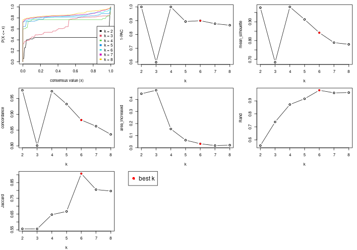

The numeric values for all these statistics can be obtained by `get_stats()`.

```r
get_stats(res)
```

```
#>   k 1-PAC mean_silhouette concordance area_increased  Rand Jaccard
#> 2 2 1.000           0.976       0.976         0.4466 0.556   0.556
#> 3 3 0.598           0.685       0.801         0.4754 0.738   0.556
#> 4 4 1.000           0.980       0.973         0.1552 0.872   0.646
#> 5 5 0.894           0.913       0.932         0.0627 0.916   0.667
#> 6 6 0.900           0.842       0.882         0.0329 0.982   0.907
#> 7 7 0.878           0.789       0.862         0.0177 0.962   0.805
#> 8 8 0.867           0.780       0.836         0.0212 0.964   0.796
```

`suggest_best_k()` suggests the best $k$ based on these statistics. The rules are as follows:

- All $k$ with Jaccard index larger than 0.95 are removed because increasing
  $k$ does not provide enough extra information. If all $k$ are removed, it is
  marked as no subgroup is detected.
- For all $k$ with 1-PAC score larger than 0.9, the maximal $k$ is taken as
  the best $k$, and other $k$ are marked as optional $k$.
- If it does not fit the second rule. The $k$ with the maximal vote of the
  highest 1-PAC score, highest mean silhouette, and highest concordance is
  taken as the best $k$.

```r
suggest_best_k(res)
```

```
#> [1] 6
#> attr(,"optional")
#> [1] 2 4
```

There is also optional best $k$ = 2 4 that is worth to check.

Following is the table of the partitions (You need to click the **show/hide
code output** link to see it). The membership matrix (columns with name `p*`)
is inferred by
[`clue::cl_consensus()`](https://www.rdocumentation.org/link/cl_consensus?package=clue)
function with the `SE` method. Basically the value in the membership matrix
represents the probability to belong to a certain group. The finall subgroup
label for an item is determined with the group with highest probability it
belongs to.

In `get_classes()` function, the entropy is calculated from the membership
matrix and the silhouette score is calculated from the consensus matrix.


<script>
$( function() {
	$( '#tabs-node-04-get-classes' ).tabs();
} );
</script>
<div id='tabs-node-04-get-classes'>
<ul>
<li><a href='#tab-node-04-get-classes-1'>k = 2</a></li>
<li><a href='#tab-node-04-get-classes-2'>k = 3</a></li>
<li><a href='#tab-node-04-get-classes-3'>k = 4</a></li>
<li><a href='#tab-node-04-get-classes-4'>k = 5</a></li>
<li><a href='#tab-node-04-get-classes-5'>k = 6</a></li>
<li><a href='#tab-node-04-get-classes-6'>k = 7</a></li>
<li><a href='#tab-node-04-get-classes-7'>k = 8</a></li>
</ul>

<div id='tab-node-04-get-classes-1'>
<p><a id='tab-node-04-get-classes-1-a' style='color:#0366d6' href='#'>show/hide code output</a></p>
<pre><code class="r">cbind(get_classes(res, k = 2), get_membership(res, k = 2))
</code></pre>

<pre><code>#&gt;                 class entropy silhouette   p1   p2
#&gt; TCGA.SX.A7SM.01     2   0.141      0.978 0.02 0.98
#&gt; TCGA.4A.A93X.01     2   0.141      0.978 0.02 0.98
#&gt; TCGA.BQ.5894.01     1   0.141      0.993 0.98 0.02
#&gt; TCGA.BQ.5882.01     2   0.242      0.974 0.04 0.96
#&gt; TCGA.BQ.5893.01     1   0.141      0.993 0.98 0.02
#&gt; TCGA.IZ.8195.01     2   0.000      0.975 0.00 1.00
#&gt; TCGA.G7.A8LD.01     2   0.584      0.884 0.14 0.86
#&gt; TCGA.J7.8537.01     1   0.000      0.984 1.00 0.00
#&gt; TCGA.BQ.5890.01     2   0.141      0.978 0.02 0.98
#&gt; TCGA.BQ.5879.01     1   0.141      0.993 0.98 0.02
#&gt; TCGA.GL.A9DE.01     2   0.141      0.978 0.02 0.98
#&gt; TCGA.B9.A8YI.01     2   0.000      0.975 0.00 1.00
#&gt; TCGA.F9.A8NY.01     1   0.141      0.993 0.98 0.02
#&gt; TCGA.BQ.5891.01     2   0.242      0.974 0.04 0.96
#&gt; TCGA.P4.AAVO.01     2   0.000      0.975 0.00 1.00
#&gt; TCGA.A4.A5Y1.01     2   0.242      0.974 0.04 0.96
#&gt; TCGA.BQ.5875.01     2   0.141      0.978 0.02 0.98
#&gt; TCGA.Q2.A5QZ.01     2   0.141      0.978 0.02 0.98
#&gt; TCGA.P4.A5E8.01     1   0.141      0.993 0.98 0.02
#&gt; TCGA.B9.A5W9.01     2   0.141      0.969 0.02 0.98
#&gt; TCGA.P4.AAVK.01     2   0.242      0.974 0.04 0.96
#&gt; TCGA.5P.A9K9.01     2   0.242      0.974 0.04 0.96
#&gt; TCGA.IA.A40Y.01     2   0.584      0.884 0.14 0.86
#&gt; TCGA.P4.A5EA.01     1   0.141      0.993 0.98 0.02
#&gt; TCGA.5P.A9K3.01     2   0.141      0.978 0.02 0.98
#&gt; TCGA.B9.A44B.01     2   0.141      0.978 0.02 0.98
#&gt; TCGA.BQ.5877.01     2   0.242      0.974 0.04 0.96
#&gt; TCGA.2Z.A9JG.01     2   0.141      0.969 0.02 0.98
#&gt; TCGA.2Z.A9JI.01     1   0.000      0.984 1.00 0.00
#&gt; TCGA.5P.A9JU.01     2   0.141      0.978 0.02 0.98
#&gt; TCGA.F9.A4JJ.01     1   0.141      0.993 0.98 0.02
#&gt; TCGA.UZ.A9PQ.01     2   0.000      0.975 0.00 1.00
#&gt; TCGA.UZ.A9Q1.01     2   0.000      0.975 0.00 1.00
#&gt; TCGA.GL.6846.01     2   0.000      0.975 0.00 1.00
#&gt; TCGA.G7.6793.01     1   0.141      0.993 0.98 0.02
#&gt; TCGA.BQ.7061.01     2   0.141      0.978 0.02 0.98
#&gt; TCGA.BQ.7058.01     2   0.141      0.978 0.02 0.98
#&gt; TCGA.GL.7966.01     1   0.141      0.993 0.98 0.02
#&gt; TCGA.AL.A5DJ.01     1   0.000      0.984 1.00 0.00
#&gt; TCGA.BQ.7048.01     2   0.000      0.975 0.00 1.00
#&gt; TCGA.BQ.5887.01     2   0.402      0.946 0.08 0.92
#&gt; TCGA.A4.7915.01     1   0.141      0.993 0.98 0.02
#&gt; TCGA.G7.6789.01     1   0.000      0.984 1.00 0.00
#&gt; TCGA.BQ.7044.01     2   0.000      0.975 0.00 1.00
</code></pre>

<script>
$('#tab-node-04-get-classes-1-a').parent().next().next().hide();
$('#tab-node-04-get-classes-1-a').click(function(){
  $('#tab-node-04-get-classes-1-a').parent().next().next().toggle();
  return(false);
});
</script>
</div>

<div id='tab-node-04-get-classes-2'>
<p><a id='tab-node-04-get-classes-2-a' style='color:#0366d6' href='#'>show/hide code output</a></p>
<pre><code class="r">cbind(get_classes(res, k = 3), get_membership(res, k = 3))
</code></pre>

<pre><code>#&gt;                 class entropy silhouette   p1   p2   p3
#&gt; TCGA.SX.A7SM.01     2   0.630      0.663 0.00 0.52 0.48
#&gt; TCGA.4A.A93X.01     2   0.630      0.663 0.00 0.52 0.48
#&gt; TCGA.BQ.5894.01     1   0.000      1.000 1.00 0.00 0.00
#&gt; TCGA.BQ.5882.01     3   0.369      0.581 0.00 0.14 0.86
#&gt; TCGA.BQ.5893.01     1   0.000      1.000 1.00 0.00 0.00
#&gt; TCGA.IZ.8195.01     2   0.000      0.637 0.00 1.00 0.00
#&gt; TCGA.G7.A8LD.01     3   0.918      0.649 0.22 0.24 0.54
#&gt; TCGA.J7.8537.01     3   0.827      0.567 0.40 0.08 0.52
#&gt; TCGA.BQ.5890.01     2   0.630      0.663 0.00 0.52 0.48
#&gt; TCGA.BQ.5879.01     1   0.000      1.000 1.00 0.00 0.00
#&gt; TCGA.GL.A9DE.01     2   0.630      0.663 0.00 0.52 0.48
#&gt; TCGA.B9.A8YI.01     2   0.000      0.637 0.00 1.00 0.00
#&gt; TCGA.F9.A8NY.01     1   0.000      1.000 1.00 0.00 0.00
#&gt; TCGA.BQ.5891.01     3   0.369      0.581 0.00 0.14 0.86
#&gt; TCGA.P4.AAVO.01     2   0.000      0.637 0.00 1.00 0.00
#&gt; TCGA.A4.A5Y1.01     3   0.000      0.472 0.00 0.00 1.00
#&gt; TCGA.BQ.5875.01     2   0.630      0.663 0.00 0.52 0.48
#&gt; TCGA.Q2.A5QZ.01     2   0.153      0.616 0.00 0.96 0.04
#&gt; TCGA.P4.A5E8.01     1   0.000      1.000 1.00 0.00 0.00
#&gt; TCGA.B9.A5W9.01     2   0.630     -0.441 0.00 0.52 0.48
#&gt; TCGA.P4.AAVK.01     2   0.630      0.663 0.00 0.52 0.48
#&gt; TCGA.5P.A9K9.01     3   0.628      0.451 0.00 0.46 0.54
#&gt; TCGA.IA.A40Y.01     3   0.832      0.690 0.24 0.14 0.62
#&gt; TCGA.P4.A5EA.01     1   0.000      1.000 1.00 0.00 0.00
#&gt; TCGA.5P.A9K3.01     2   0.630      0.663 0.00 0.52 0.48
#&gt; TCGA.B9.A44B.01     2   0.630      0.663 0.00 0.52 0.48
#&gt; TCGA.BQ.5877.01     3   0.000      0.472 0.00 0.00 1.00
#&gt; TCGA.2Z.A9JG.01     2   0.000      0.637 0.00 1.00 0.00
#&gt; TCGA.2Z.A9JI.01     3   0.821      0.598 0.38 0.08 0.54
#&gt; TCGA.5P.A9JU.01     2   0.630      0.663 0.00 0.52 0.48
#&gt; TCGA.F9.A4JJ.01     1   0.000      1.000 1.00 0.00 0.00
#&gt; TCGA.UZ.A9PQ.01     2   0.000      0.637 0.00 1.00 0.00
#&gt; TCGA.UZ.A9Q1.01     2   0.000      0.637 0.00 1.00 0.00
#&gt; TCGA.GL.6846.01     2   0.000      0.637 0.00 1.00 0.00
#&gt; TCGA.G7.6793.01     1   0.000      1.000 1.00 0.00 0.00
#&gt; TCGA.BQ.7061.01     2   0.630      0.663 0.00 0.52 0.48
#&gt; TCGA.BQ.7058.01     2   0.630      0.663 0.00 0.52 0.48
#&gt; TCGA.GL.7966.01     1   0.000      1.000 1.00 0.00 0.00
#&gt; TCGA.AL.A5DJ.01     3   0.827      0.567 0.40 0.08 0.52
#&gt; TCGA.BQ.7048.01     2   0.000      0.637 0.00 1.00 0.00
#&gt; TCGA.BQ.5887.01     3   0.832      0.690 0.24 0.14 0.62
#&gt; TCGA.A4.7915.01     1   0.000      1.000 1.00 0.00 0.00
#&gt; TCGA.G7.6789.01     3   0.821      0.598 0.38 0.08 0.54
#&gt; TCGA.BQ.7044.01     2   0.000      0.637 0.00 1.00 0.00
</code></pre>

<script>
$('#tab-node-04-get-classes-2-a').parent().next().next().hide();
$('#tab-node-04-get-classes-2-a').click(function(){
  $('#tab-node-04-get-classes-2-a').parent().next().next().toggle();
  return(false);
});
</script>
</div>

<div id='tab-node-04-get-classes-3'>
<p><a id='tab-node-04-get-classes-3-a' style='color:#0366d6' href='#'>show/hide code output</a></p>
<pre><code class="r">cbind(get_classes(res, k = 4), get_membership(res, k = 4))
</code></pre>

<pre><code>#&gt;                 class entropy silhouette   p1   p2   p3   p4
#&gt; TCGA.SX.A7SM.01     2  0.0000      0.998 0.00 1.00 0.00 0.00
#&gt; TCGA.4A.A93X.01     2  0.0000      0.998 0.00 1.00 0.00 0.00
#&gt; TCGA.BQ.5894.01     1  0.0000      0.976 1.00 0.00 0.00 0.00
#&gt; TCGA.BQ.5882.01     3  0.0000      0.981 0.00 0.00 1.00 0.00
#&gt; TCGA.BQ.5893.01     1  0.1637      0.976 0.94 0.00 0.00 0.06
#&gt; TCGA.IZ.8195.01     4  0.1637      0.988 0.00 0.06 0.00 0.94
#&gt; TCGA.G7.A8LD.01     3  0.0000      0.981 0.00 0.00 1.00 0.00
#&gt; TCGA.J7.8537.01     3  0.0000      0.981 0.00 0.00 1.00 0.00
#&gt; TCGA.BQ.5890.01     2  0.0000      0.998 0.00 1.00 0.00 0.00
#&gt; TCGA.BQ.5879.01     1  0.1637      0.976 0.94 0.00 0.00 0.06
#&gt; TCGA.GL.A9DE.01     2  0.0000      0.998 0.00 1.00 0.00 0.00
#&gt; TCGA.B9.A8YI.01     4  0.1637      0.988 0.00 0.06 0.00 0.94
#&gt; TCGA.F9.A8NY.01     1  0.1637      0.976 0.94 0.00 0.00 0.06
#&gt; TCGA.BQ.5891.01     3  0.0000      0.981 0.00 0.00 1.00 0.00
#&gt; TCGA.P4.AAVO.01     4  0.1637      0.988 0.00 0.06 0.00 0.94
#&gt; TCGA.A4.A5Y1.01     3  0.2345      0.899 0.00 0.10 0.90 0.00
#&gt; TCGA.BQ.5875.01     2  0.0707      0.978 0.00 0.98 0.00 0.02
#&gt; TCGA.Q2.A5QZ.01     4  0.2411      0.956 0.00 0.04 0.04 0.92
#&gt; TCGA.P4.A5E8.01     1  0.0000      0.976 1.00 0.00 0.00 0.00
#&gt; TCGA.B9.A5W9.01     4  0.1637      0.925 0.00 0.00 0.06 0.94
#&gt; TCGA.P4.AAVK.01     2  0.0000      0.998 0.00 1.00 0.00 0.00
#&gt; TCGA.5P.A9K9.01     3  0.0000      0.981 0.00 0.00 1.00 0.00
#&gt; TCGA.IA.A40Y.01     3  0.0000      0.981 0.00 0.00 1.00 0.00
#&gt; TCGA.P4.A5EA.01     1  0.0000      0.976 1.00 0.00 0.00 0.00
#&gt; TCGA.5P.A9K3.01     2  0.0000      0.998 0.00 1.00 0.00 0.00
#&gt; TCGA.B9.A44B.01     2  0.0000      0.998 0.00 1.00 0.00 0.00
#&gt; TCGA.BQ.5877.01     3  0.2345      0.899 0.00 0.10 0.90 0.00
#&gt; TCGA.2Z.A9JG.01     4  0.1637      0.988 0.00 0.06 0.00 0.94
#&gt; TCGA.2Z.A9JI.01     3  0.0000      0.981 0.00 0.00 1.00 0.00
#&gt; TCGA.5P.A9JU.01     2  0.0000      0.998 0.00 1.00 0.00 0.00
#&gt; TCGA.F9.A4JJ.01     1  0.0000      0.976 1.00 0.00 0.00 0.00
#&gt; TCGA.UZ.A9PQ.01     4  0.1637      0.988 0.00 0.06 0.00 0.94
#&gt; TCGA.UZ.A9Q1.01     4  0.1637      0.988 0.00 0.06 0.00 0.94
#&gt; TCGA.GL.6846.01     4  0.1637      0.988 0.00 0.06 0.00 0.94
#&gt; TCGA.G7.6793.01     1  0.1637      0.976 0.94 0.00 0.00 0.06
#&gt; TCGA.BQ.7061.01     2  0.0000      0.998 0.00 1.00 0.00 0.00
#&gt; TCGA.BQ.7058.01     2  0.0000      0.998 0.00 1.00 0.00 0.00
#&gt; TCGA.GL.7966.01     1  0.1637      0.976 0.94 0.00 0.00 0.06
#&gt; TCGA.AL.A5DJ.01     3  0.0000      0.981 0.00 0.00 1.00 0.00
#&gt; TCGA.BQ.7048.01     4  0.1637      0.988 0.00 0.06 0.00 0.94
#&gt; TCGA.BQ.5887.01     3  0.0000      0.981 0.00 0.00 1.00 0.00
#&gt; TCGA.A4.7915.01     1  0.0000      0.976 1.00 0.00 0.00 0.00
#&gt; TCGA.G7.6789.01     3  0.0000      0.981 0.00 0.00 1.00 0.00
#&gt; TCGA.BQ.7044.01     4  0.1637      0.988 0.00 0.06 0.00 0.94
</code></pre>

<script>
$('#tab-node-04-get-classes-3-a').parent().next().next().hide();
$('#tab-node-04-get-classes-3-a').click(function(){
  $('#tab-node-04-get-classes-3-a').parent().next().next().toggle();
  return(false);
});
</script>
</div>

<div id='tab-node-04-get-classes-4'>
<p><a id='tab-node-04-get-classes-4-a' style='color:#0366d6' href='#'>show/hide code output</a></p>
<pre><code class="r">cbind(get_classes(res, k = 5), get_membership(res, k = 5))
</code></pre>

<pre><code>#&gt;                 class entropy silhouette   p1   p2   p3   p4   p5
#&gt; TCGA.SX.A7SM.01     2  0.1043      1.000 0.00 0.96 0.00 0.04 0.00
#&gt; TCGA.4A.A93X.01     2  0.1043      1.000 0.00 0.96 0.00 0.04 0.00
#&gt; TCGA.BQ.5894.01     1  0.3037      0.936 0.86 0.04 0.00 0.00 0.10
#&gt; TCGA.BQ.5882.01     3  0.2732      0.790 0.00 0.00 0.84 0.00 0.16
#&gt; TCGA.BQ.5893.01     1  0.0000      0.941 1.00 0.00 0.00 0.00 0.00
#&gt; TCGA.IZ.8195.01     4  0.0000      0.952 0.00 0.00 0.00 1.00 0.00
#&gt; TCGA.G7.A8LD.01     3  0.0609      0.966 0.00 0.00 0.98 0.00 0.02
#&gt; TCGA.J7.8537.01     3  0.0000      0.967 0.00 0.00 1.00 0.00 0.00
#&gt; TCGA.BQ.5890.01     2  0.1043      1.000 0.00 0.96 0.00 0.04 0.00
#&gt; TCGA.BQ.5879.01     1  0.0000      0.941 1.00 0.00 0.00 0.00 0.00
#&gt; TCGA.GL.A9DE.01     2  0.1043      1.000 0.00 0.96 0.00 0.04 0.00
#&gt; TCGA.B9.A8YI.01     4  0.0000      0.952 0.00 0.00 0.00 1.00 0.00
#&gt; TCGA.F9.A8NY.01     1  0.0000      0.941 1.00 0.00 0.00 0.00 0.00
#&gt; TCGA.BQ.5891.01     5  0.2732      0.780 0.00 0.00 0.16 0.00 0.84
#&gt; TCGA.P4.AAVO.01     4  0.0000      0.952 0.00 0.00 0.00 1.00 0.00
#&gt; TCGA.A4.A5Y1.01     5  0.2732      0.780 0.00 0.00 0.16 0.00 0.84
#&gt; TCGA.BQ.5875.01     5  0.3106      0.767 0.00 0.14 0.02 0.00 0.84
#&gt; TCGA.Q2.A5QZ.01     4  0.4967      0.526 0.00 0.00 0.28 0.66 0.06
#&gt; TCGA.P4.A5E8.01     1  0.2616      0.940 0.88 0.02 0.00 0.00 0.10
#&gt; TCGA.B9.A5W9.01     5  0.3424      0.667 0.00 0.00 0.00 0.24 0.76
#&gt; TCGA.P4.AAVK.01     5  0.3424      0.675 0.00 0.24 0.00 0.00 0.76
#&gt; TCGA.5P.A9K9.01     3  0.0000      0.967 0.00 0.00 1.00 0.00 0.00
#&gt; TCGA.IA.A40Y.01     3  0.0609      0.966 0.00 0.00 0.98 0.00 0.02
#&gt; TCGA.P4.A5EA.01     1  0.3037      0.936 0.86 0.04 0.00 0.00 0.10
#&gt; TCGA.5P.A9K3.01     2  0.1043      1.000 0.00 0.96 0.00 0.04 0.00
#&gt; TCGA.B9.A44B.01     2  0.1043      1.000 0.00 0.96 0.00 0.04 0.00
#&gt; TCGA.BQ.5877.01     5  0.2929      0.776 0.00 0.00 0.18 0.00 0.82
#&gt; TCGA.2Z.A9JG.01     5  0.3424      0.667 0.00 0.00 0.00 0.24 0.76
#&gt; TCGA.2Z.A9JI.01     3  0.0000      0.967 0.00 0.00 1.00 0.00 0.00
#&gt; TCGA.5P.A9JU.01     2  0.1043      1.000 0.00 0.96 0.00 0.04 0.00
#&gt; TCGA.F9.A4JJ.01     1  0.2616      0.940 0.88 0.02 0.00 0.00 0.10
#&gt; TCGA.UZ.A9PQ.01     4  0.0000      0.952 0.00 0.00 0.00 1.00 0.00
#&gt; TCGA.UZ.A9Q1.01     4  0.0000      0.952 0.00 0.00 0.00 1.00 0.00
#&gt; TCGA.GL.6846.01     4  0.0000      0.952 0.00 0.00 0.00 1.00 0.00
#&gt; TCGA.G7.6793.01     1  0.0609      0.936 0.98 0.02 0.00 0.00 0.00
#&gt; TCGA.BQ.7061.01     2  0.1043      1.000 0.00 0.96 0.00 0.04 0.00
#&gt; TCGA.BQ.7058.01     2  0.1043      1.000 0.00 0.96 0.00 0.04 0.00
#&gt; TCGA.GL.7966.01     1  0.0000      0.941 1.00 0.00 0.00 0.00 0.00
#&gt; TCGA.AL.A5DJ.01     3  0.0609      0.966 0.00 0.00 0.98 0.00 0.02
#&gt; TCGA.BQ.7048.01     4  0.0000      0.952 0.00 0.00 0.00 1.00 0.00
#&gt; TCGA.BQ.5887.01     3  0.0000      0.967 0.00 0.00 1.00 0.00 0.00
#&gt; TCGA.A4.7915.01     1  0.2616      0.940 0.88 0.02 0.00 0.00 0.10
#&gt; TCGA.G7.6789.01     3  0.0609      0.966 0.00 0.00 0.98 0.00 0.02
#&gt; TCGA.BQ.7044.01     4  0.0000      0.952 0.00 0.00 0.00 1.00 0.00
</code></pre>

<script>
$('#tab-node-04-get-classes-4-a').parent().next().next().hide();
$('#tab-node-04-get-classes-4-a').click(function(){
  $('#tab-node-04-get-classes-4-a').parent().next().next().toggle();
  return(false);
});
</script>
</div>

<div id='tab-node-04-get-classes-5'>
<p><a id='tab-node-04-get-classes-5-a' style='color:#0366d6' href='#'>show/hide code output</a></p>
<pre><code class="r">cbind(get_classes(res, k = 6), get_membership(res, k = 6))
</code></pre>

<pre><code>#&gt;                 class entropy silhouette   p1   p2   p3   p4   p5   p6
#&gt; TCGA.SX.A7SM.01     2  0.0547     0.9835 0.00 0.98 0.02 0.00 0.00 0.00
#&gt; TCGA.4A.A93X.01     2  0.0000     0.9882 0.00 1.00 0.00 0.00 0.00 0.00
#&gt; TCGA.BQ.5894.01     1  0.3198     0.8678 0.74 0.00 0.26 0.00 0.00 0.00
#&gt; TCGA.BQ.5882.01     6  0.3679     0.5651 0.00 0.00 0.04 0.00 0.20 0.76
#&gt; TCGA.BQ.5893.01     1  0.0547     0.8678 0.98 0.00 0.02 0.00 0.00 0.00
#&gt; TCGA.IZ.8195.01     4  0.0000     0.9690 0.00 0.00 0.00 1.00 0.00 0.00
#&gt; TCGA.G7.A8LD.01     6  0.4172     0.7289 0.00 0.00 0.28 0.00 0.04 0.68
#&gt; TCGA.J7.8537.01     6  0.0547     0.7576 0.00 0.00 0.00 0.00 0.02 0.98
#&gt; TCGA.BQ.5890.01     2  0.0000     0.9882 0.00 1.00 0.00 0.00 0.00 0.00
#&gt; TCGA.BQ.5879.01     1  0.0000     0.8719 1.00 0.00 0.00 0.00 0.00 0.00
#&gt; TCGA.GL.A9DE.01     2  0.0547     0.9835 0.00 0.98 0.02 0.00 0.00 0.00
#&gt; TCGA.B9.A8YI.01     4  0.1556     0.9478 0.00 0.00 0.08 0.92 0.00 0.00
#&gt; TCGA.F9.A8NY.01     1  0.0000     0.8719 1.00 0.00 0.00 0.00 0.00 0.00
#&gt; TCGA.BQ.5891.01     5  0.1807     0.8014 0.00 0.00 0.06 0.00 0.92 0.02
#&gt; TCGA.P4.AAVO.01     4  0.0000     0.9690 0.00 0.00 0.00 1.00 0.00 0.00
#&gt; TCGA.A4.A5Y1.01     5  0.1807     0.8014 0.00 0.00 0.06 0.00 0.92 0.02
#&gt; TCGA.BQ.5875.01     5  0.2794     0.7946 0.00 0.06 0.08 0.00 0.86 0.00
#&gt; TCGA.Q2.A5QZ.01     6  0.6547    -0.0108 0.00 0.00 0.14 0.36 0.06 0.44
#&gt; TCGA.P4.A5E8.01     1  0.3198     0.8688 0.74 0.00 0.26 0.00 0.00 0.00
#&gt; TCGA.B9.A5W9.01     5  0.4926     0.7002 0.00 0.00 0.24 0.12 0.64 0.00
#&gt; TCGA.P4.AAVK.01     5  0.3679     0.7099 0.00 0.20 0.04 0.00 0.76 0.00
#&gt; TCGA.5P.A9K9.01     6  0.0547     0.7660 0.00 0.00 0.02 0.00 0.00 0.98
#&gt; TCGA.IA.A40Y.01     6  0.4631     0.6885 0.00 0.00 0.32 0.00 0.06 0.62
#&gt; TCGA.P4.A5EA.01     1  0.3198     0.8678 0.74 0.00 0.26 0.00 0.00 0.00
#&gt; TCGA.5P.A9K3.01     2  0.0547     0.9789 0.00 0.98 0.00 0.00 0.02 0.00
#&gt; TCGA.B9.A44B.01     2  0.0000     0.9882 0.00 1.00 0.00 0.00 0.00 0.00
#&gt; TCGA.BQ.5877.01     5  0.1480     0.7993 0.00 0.00 0.04 0.00 0.94 0.02
#&gt; TCGA.2Z.A9JG.01     5  0.4926     0.7002 0.00 0.00 0.24 0.12 0.64 0.00
#&gt; TCGA.2Z.A9JI.01     6  0.2094     0.7688 0.00 0.00 0.08 0.00 0.02 0.90
#&gt; TCGA.5P.A9JU.01     2  0.0547     0.9789 0.00 0.98 0.00 0.00 0.02 0.00
#&gt; TCGA.F9.A4JJ.01     1  0.3076     0.8719 0.76 0.00 0.24 0.00 0.00 0.00
#&gt; TCGA.UZ.A9PQ.01     4  0.1556     0.9478 0.00 0.00 0.08 0.92 0.00 0.00
#&gt; TCGA.UZ.A9Q1.01     4  0.0000     0.9690 0.00 0.00 0.00 1.00 0.00 0.00
#&gt; TCGA.GL.6846.01     4  0.0000     0.9690 0.00 0.00 0.00 1.00 0.00 0.00
#&gt; TCGA.G7.6793.01     1  0.0547     0.8688 0.98 0.00 0.02 0.00 0.00 0.00
#&gt; TCGA.BQ.7061.01     2  0.0000     0.9882 0.00 1.00 0.00 0.00 0.00 0.00
#&gt; TCGA.BQ.7058.01     2  0.0547     0.9835 0.00 0.98 0.02 0.00 0.00 0.00
#&gt; TCGA.GL.7966.01     1  0.0547     0.8678 0.98 0.00 0.02 0.00 0.00 0.00
#&gt; TCGA.AL.A5DJ.01     6  0.3198     0.7470 0.00 0.00 0.26 0.00 0.00 0.74
#&gt; TCGA.BQ.7048.01     4  0.1556     0.9478 0.00 0.00 0.08 0.92 0.00 0.00
#&gt; TCGA.BQ.5887.01     6  0.0547     0.7576 0.00 0.00 0.00 0.00 0.02 0.98
#&gt; TCGA.A4.7915.01     1  0.3076     0.8719 0.76 0.00 0.24 0.00 0.00 0.00
#&gt; TCGA.G7.6789.01     6  0.4067     0.7341 0.00 0.00 0.26 0.00 0.04 0.70
#&gt; TCGA.BQ.7044.01     4  0.0000     0.9690 0.00 0.00 0.00 1.00 0.00 0.00
</code></pre>

<script>
$('#tab-node-04-get-classes-5-a').parent().next().next().hide();
$('#tab-node-04-get-classes-5-a').click(function(){
  $('#tab-node-04-get-classes-5-a').parent().next().next().toggle();
  return(false);
});
</script>
</div>

<div id='tab-node-04-get-classes-6'>
<p><a id='tab-node-04-get-classes-6-a' style='color:#0366d6' href='#'>show/hide code output</a></p>
<pre><code class="r">cbind(get_classes(res, k = 7), get_membership(res, k = 7))
</code></pre>

<pre><code>#&gt;                 class entropy silhouette   p1   p2   p3   p4   p5   p6   p7
#&gt; TCGA.SX.A7SM.01     3  0.0863      0.941 0.00 0.04 0.96 0.00 0.00 0.00 0.00
#&gt; TCGA.4A.A93X.01     3  0.0504      0.945 0.00 0.00 0.98 0.00 0.00 0.00 0.02
#&gt; TCGA.BQ.5894.01     1  0.3011      0.893 0.82 0.12 0.00 0.00 0.00 0.00 0.06
#&gt; TCGA.BQ.5882.01     5  0.5378      0.113 0.00 0.30 0.00 0.00 0.48 0.22 0.00
#&gt; TCGA.BQ.5893.01     1  0.1363      0.879 0.94 0.04 0.00 0.00 0.00 0.00 0.02
#&gt; TCGA.IZ.8195.01     4  0.0000      0.947 0.00 0.00 0.00 1.00 0.00 0.00 0.00
#&gt; TCGA.G7.A8LD.01     6  0.2259      0.715 0.00 0.16 0.00 0.00 0.00 0.84 0.00
#&gt; TCGA.J7.8537.01     6  0.3139      0.749 0.00 0.30 0.00 0.00 0.00 0.70 0.00
#&gt; TCGA.BQ.5890.01     3  0.0000      0.945 0.00 0.00 1.00 0.00 0.00 0.00 0.00
#&gt; TCGA.BQ.5879.01     1  0.0000      0.896 1.00 0.00 0.00 0.00 0.00 0.00 0.00
#&gt; TCGA.GL.A9DE.01     3  0.0863      0.941 0.00 0.04 0.96 0.00 0.00 0.00 0.00
#&gt; TCGA.B9.A8YI.01     4  0.2421      0.917 0.00 0.08 0.00 0.88 0.02 0.00 0.02
#&gt; TCGA.F9.A8NY.01     1  0.0000      0.896 1.00 0.00 0.00 0.00 0.00 0.00 0.00
#&gt; TCGA.BQ.5891.01     5  0.5536      0.227 0.00 0.22 0.00 0.00 0.54 0.02 0.22
#&gt; TCGA.P4.AAVO.01     4  0.0000      0.947 0.00 0.00 0.00 1.00 0.00 0.00 0.00
#&gt; TCGA.A4.A5Y1.01     5  0.5536      0.227 0.00 0.22 0.00 0.00 0.54 0.02 0.22
#&gt; TCGA.BQ.5875.01     5  0.0000      0.450 0.00 0.00 0.00 0.00 1.00 0.00 0.00
#&gt; TCGA.Q2.A5QZ.01     5  0.6386      0.195 0.00 0.38 0.00 0.08 0.42 0.10 0.02
#&gt; TCGA.P4.A5E8.01     1  0.3449      0.883 0.78 0.14 0.00 0.00 0.00 0.00 0.08
#&gt; TCGA.B9.A5W9.01     7  0.2722      1.000 0.00 0.00 0.00 0.04 0.12 0.00 0.84
#&gt; TCGA.P4.AAVK.01     5  0.4451      0.304 0.00 0.10 0.26 0.00 0.64 0.00 0.00
#&gt; TCGA.5P.A9K9.01     6  0.3139      0.764 0.00 0.30 0.00 0.00 0.00 0.70 0.00
#&gt; TCGA.IA.A40Y.01     6  0.2081      0.696 0.00 0.14 0.00 0.00 0.00 0.86 0.00
#&gt; TCGA.P4.A5EA.01     1  0.3011      0.893 0.82 0.12 0.00 0.00 0.00 0.00 0.06
#&gt; TCGA.5P.A9K3.01     3  0.2769      0.873 0.00 0.04 0.86 0.00 0.08 0.00 0.02
#&gt; TCGA.B9.A44B.01     3  0.0504      0.945 0.00 0.00 0.98 0.00 0.00 0.00 0.02
#&gt; TCGA.BQ.5877.01     5  0.1006      0.455 0.00 0.00 0.00 0.00 0.96 0.02 0.02
#&gt; TCGA.2Z.A9JG.01     7  0.2722      1.000 0.00 0.00 0.00 0.04 0.12 0.00 0.84
#&gt; TCGA.2Z.A9JI.01     6  0.2422      0.791 0.00 0.18 0.00 0.00 0.00 0.82 0.00
#&gt; TCGA.5P.A9JU.01     3  0.2769      0.873 0.00 0.04 0.86 0.00 0.08 0.00 0.02
#&gt; TCGA.F9.A4JJ.01     1  0.2803      0.897 0.84 0.10 0.00 0.00 0.00 0.00 0.06
#&gt; TCGA.UZ.A9PQ.01     4  0.2421      0.917 0.00 0.08 0.00 0.88 0.02 0.00 0.02
#&gt; TCGA.UZ.A9Q1.01     4  0.0504      0.945 0.00 0.02 0.00 0.98 0.00 0.00 0.00
#&gt; TCGA.GL.6846.01     4  0.0000      0.947 0.00 0.00 0.00 1.00 0.00 0.00 0.00
#&gt; TCGA.G7.6793.01     1  0.0504      0.894 0.98 0.02 0.00 0.00 0.00 0.00 0.00
#&gt; TCGA.BQ.7061.01     3  0.1006      0.933 0.00 0.02 0.96 0.00 0.02 0.00 0.00
#&gt; TCGA.BQ.7058.01     3  0.0863      0.941 0.00 0.04 0.96 0.00 0.00 0.00 0.00
#&gt; TCGA.GL.7966.01     1  0.1363      0.879 0.94 0.04 0.00 0.00 0.00 0.00 0.02
#&gt; TCGA.AL.A5DJ.01     6  0.0863      0.778 0.00 0.04 0.00 0.00 0.00 0.96 0.00
#&gt; TCGA.BQ.7048.01     4  0.2421      0.917 0.00 0.08 0.00 0.88 0.02 0.00 0.02
#&gt; TCGA.BQ.5887.01     6  0.3139      0.749 0.00 0.30 0.00 0.00 0.00 0.70 0.00
#&gt; TCGA.A4.7915.01     1  0.2803      0.897 0.84 0.10 0.00 0.00 0.00 0.00 0.06
#&gt; TCGA.G7.6789.01     6  0.0000      0.784 0.00 0.00 0.00 0.00 0.00 1.00 0.00
#&gt; TCGA.BQ.7044.01     4  0.0000      0.947 0.00 0.00 0.00 1.00 0.00 0.00 0.00
</code></pre>

<script>
$('#tab-node-04-get-classes-6-a').parent().next().next().hide();
$('#tab-node-04-get-classes-6-a').click(function(){
  $('#tab-node-04-get-classes-6-a').parent().next().next().toggle();
  return(false);
});
</script>
</div>

<div id='tab-node-04-get-classes-7'>
<p><a id='tab-node-04-get-classes-7-a' style='color:#0366d6' href='#'>show/hide code output</a></p>
<pre><code class="r">cbind(get_classes(res, k = 8), get_membership(res, k = 8))
</code></pre>

<pre><code>#&gt;                 class entropy silhouette   p1   p2   p3   p4   p5   p6   p7   p8
#&gt; TCGA.SX.A7SM.01     3  0.0000      0.910 0.00 0.00 1.00 0.00 0.00 0.00 0.00 0.00
#&gt; TCGA.4A.A93X.01     3  0.0471      0.907 0.00 0.00 0.98 0.00 0.00 0.02 0.00 0.00
#&gt; TCGA.BQ.5894.01     1  0.3618      0.755 0.60 0.00 0.00 0.00 0.00 0.02 0.00 0.38
#&gt; TCGA.BQ.5882.01     6  0.3663      0.586 0.00 0.10 0.00 0.00 0.06 0.78 0.00 0.06
#&gt; TCGA.BQ.5893.01     1  0.1607      0.754 0.92 0.00 0.00 0.00 0.00 0.00 0.04 0.04
#&gt; TCGA.IZ.8195.01     4  0.0471      0.873 0.00 0.00 0.00 0.98 0.00 0.00 0.02 0.00
#&gt; TCGA.G7.A8LD.01     2  0.0000      0.877 0.00 1.00 0.00 0.00 0.00 0.00 0.00 0.00
#&gt; TCGA.J7.8537.01     6  0.3374      0.687 0.00 0.30 0.00 0.00 0.00 0.68 0.00 0.02
#&gt; TCGA.BQ.5890.01     3  0.0471      0.907 0.00 0.00 0.98 0.00 0.00 0.00 0.00 0.02
#&gt; TCGA.BQ.5879.01     1  0.0000      0.769 1.00 0.00 0.00 0.00 0.00 0.00 0.00 0.00
#&gt; TCGA.GL.A9DE.01     3  0.0000      0.910 0.00 0.00 1.00 0.00 0.00 0.00 0.00 0.00
#&gt; TCGA.B9.A8YI.01     4  0.3895      0.804 0.00 0.00 0.00 0.74 0.00 0.12 0.02 0.12
#&gt; TCGA.F9.A8NY.01     1  0.0000      0.769 1.00 0.00 0.00 0.00 0.00 0.00 0.00 0.00
#&gt; TCGA.BQ.5891.01     5  0.2350      0.634 0.00 0.00 0.00 0.00 0.86 0.00 0.04 0.10
#&gt; TCGA.P4.AAVO.01     4  0.0471      0.873 0.00 0.00 0.00 0.98 0.00 0.00 0.02 0.00
#&gt; TCGA.A4.A5Y1.01     5  0.0471      0.689 0.00 0.00 0.00 0.00 0.98 0.00 0.02 0.00
#&gt; TCGA.BQ.5875.01     5  0.4560      0.624 0.00 0.00 0.00 0.00 0.60 0.18 0.00 0.22
#&gt; TCGA.Q2.A5QZ.01     6  0.3319      0.464 0.00 0.02 0.00 0.06 0.02 0.82 0.00 0.08
#&gt; TCGA.P4.A5E8.01     1  0.4100      0.749 0.58 0.00 0.00 0.00 0.00 0.00 0.06 0.36
#&gt; TCGA.B9.A5W9.01     7  0.1765      1.000 0.00 0.00 0.00 0.00 0.12 0.00 0.88 0.00
#&gt; TCGA.P4.AAVK.01     5  0.3991      0.608 0.00 0.00 0.22 0.00 0.70 0.02 0.00 0.06
#&gt; TCGA.5P.A9K9.01     6  0.3272      0.613 0.00 0.42 0.00 0.00 0.00 0.58 0.00 0.00
#&gt; TCGA.IA.A40Y.01     2  0.3311      0.732 0.00 0.80 0.00 0.00 0.14 0.02 0.02 0.02
#&gt; TCGA.P4.A5EA.01     1  0.3618      0.755 0.60 0.00 0.00 0.00 0.00 0.02 0.00 0.38
#&gt; TCGA.5P.A9K3.01     3  0.3291      0.748 0.00 0.00 0.70 0.00 0.00 0.00 0.02 0.28
#&gt; TCGA.B9.A44B.01     3  0.0471      0.907 0.00 0.00 0.98 0.00 0.00 0.02 0.00 0.00
#&gt; TCGA.BQ.5877.01     5  0.3227      0.703 0.00 0.00 0.00 0.00 0.78 0.14 0.00 0.08
#&gt; TCGA.2Z.A9JG.01     7  0.1765      1.000 0.00 0.00 0.00 0.00 0.12 0.00 0.88 0.00
#&gt; TCGA.2Z.A9JI.01     6  0.3329      0.501 0.00 0.48 0.00 0.00 0.00 0.52 0.00 0.00
#&gt; TCGA.5P.A9JU.01     3  0.3291      0.748 0.00 0.00 0.70 0.00 0.00 0.00 0.02 0.28
#&gt; TCGA.F9.A4JJ.01     1  0.3193      0.764 0.62 0.00 0.00 0.00 0.00 0.00 0.00 0.38
#&gt; TCGA.UZ.A9PQ.01     4  0.3895      0.804 0.00 0.00 0.00 0.74 0.00 0.12 0.02 0.12
#&gt; TCGA.UZ.A9Q1.01     4  0.0941      0.868 0.00 0.00 0.00 0.96 0.00 0.02 0.02 0.00
#&gt; TCGA.GL.6846.01     4  0.0471      0.873 0.00 0.00 0.00 0.98 0.00 0.00 0.02 0.00
#&gt; TCGA.G7.6793.01     1  0.0471      0.768 0.98 0.00 0.00 0.00 0.00 0.02 0.00 0.00
#&gt; TCGA.BQ.7061.01     3  0.1765      0.866 0.00 0.00 0.88 0.00 0.00 0.00 0.00 0.12
#&gt; TCGA.BQ.7058.01     3  0.0000      0.910 0.00 0.00 1.00 0.00 0.00 0.00 0.00 0.00
#&gt; TCGA.GL.7966.01     1  0.1275      0.756 0.94 0.00 0.00 0.00 0.00 0.02 0.00 0.04
#&gt; TCGA.AL.A5DJ.01     2  0.1091      0.855 0.00 0.94 0.00 0.00 0.00 0.06 0.00 0.00
#&gt; TCGA.BQ.7048.01     4  0.3895      0.804 0.00 0.00 0.00 0.74 0.00 0.12 0.02 0.12
#&gt; TCGA.BQ.5887.01     6  0.3514      0.682 0.00 0.34 0.00 0.00 0.00 0.64 0.00 0.02
#&gt; TCGA.A4.7915.01     1  0.3193      0.764 0.62 0.00 0.00 0.00 0.00 0.00 0.00 0.38
#&gt; TCGA.G7.6789.01     2  0.0471      0.880 0.00 0.98 0.00 0.00 0.00 0.02 0.00 0.00
#&gt; TCGA.BQ.7044.01     4  0.0471      0.873 0.00 0.00 0.00 0.98 0.00 0.00 0.02 0.00
</code></pre>

<script>
$('#tab-node-04-get-classes-7-a').parent().next().next().hide();
$('#tab-node-04-get-classes-7-a').click(function(){
  $('#tab-node-04-get-classes-7-a').parent().next().next().toggle();
  return(false);
});
</script>
</div>
</div>

Heatmaps for the consensus matrix. It visualizes the probability of two
samples to be in a same group.


<script>
$( function() {
	$( '#tabs-node-04-consensus-heatmap' ).tabs();
} );
</script>
<div id='tabs-node-04-consensus-heatmap'>
<ul>
<li><a href='#tab-node-04-consensus-heatmap-1'>k = 2</a></li>
<li><a href='#tab-node-04-consensus-heatmap-2'>k = 3</a></li>
<li><a href='#tab-node-04-consensus-heatmap-3'>k = 4</a></li>
<li><a href='#tab-node-04-consensus-heatmap-4'>k = 5</a></li>
<li><a href='#tab-node-04-consensus-heatmap-5'>k = 6</a></li>
<li><a href='#tab-node-04-consensus-heatmap-6'>k = 7</a></li>
<li><a href='#tab-node-04-consensus-heatmap-7'>k = 8</a></li>
</ul>
<div id='tab-node-04-consensus-heatmap-1'>
<pre><code class="r">consensus_heatmap(res, k = 2)
</code></pre>

<p></p>

</div>
<div id='tab-node-04-consensus-heatmap-2'>
<pre><code class="r">consensus_heatmap(res, k = 3)
</code></pre>

<p></p>

</div>
<div id='tab-node-04-consensus-heatmap-3'>
<pre><code class="r">consensus_heatmap(res, k = 4)
</code></pre>

<p></p>

</div>
<div id='tab-node-04-consensus-heatmap-4'>
<pre><code class="r">consensus_heatmap(res, k = 5)
</code></pre>

<p></p>

</div>
<div id='tab-node-04-consensus-heatmap-5'>
<pre><code class="r">consensus_heatmap(res, k = 6)
</code></pre>

<p></p>

</div>
<div id='tab-node-04-consensus-heatmap-6'>
<pre><code class="r">consensus_heatmap(res, k = 7)
</code></pre>

<p></p>

</div>
<div id='tab-node-04-consensus-heatmap-7'>
<pre><code class="r">consensus_heatmap(res, k = 8)
</code></pre>

<p></p>

</div>
</div>

Heatmaps for the membership of samples in all partitions to see how consistent they are:


<script>
$( function() {
	$( '#tabs-node-04-membership-heatmap' ).tabs();
} );
</script>
<div id='tabs-node-04-membership-heatmap'>
<ul>
<li><a href='#tab-node-04-membership-heatmap-1'>k = 2</a></li>
<li><a href='#tab-node-04-membership-heatmap-2'>k = 3</a></li>
<li><a href='#tab-node-04-membership-heatmap-3'>k = 4</a></li>
<li><a href='#tab-node-04-membership-heatmap-4'>k = 5</a></li>
<li><a href='#tab-node-04-membership-heatmap-5'>k = 6</a></li>
<li><a href='#tab-node-04-membership-heatmap-6'>k = 7</a></li>
<li><a href='#tab-node-04-membership-heatmap-7'>k = 8</a></li>
</ul>
<div id='tab-node-04-membership-heatmap-1'>
<pre><code class="r">membership_heatmap(res, k = 2)
</code></pre>

<p></p>

</div>
<div id='tab-node-04-membership-heatmap-2'>
<pre><code class="r">membership_heatmap(res, k = 3)
</code></pre>

<p></p>

</div>
<div id='tab-node-04-membership-heatmap-3'>
<pre><code class="r">membership_heatmap(res, k = 4)
</code></pre>

<p></p>

</div>
<div id='tab-node-04-membership-heatmap-4'>
<pre><code class="r">membership_heatmap(res, k = 5)
</code></pre>

<p></p>

</div>
<div id='tab-node-04-membership-heatmap-5'>
<pre><code class="r">membership_heatmap(res, k = 6)
</code></pre>

<p></p>

</div>
<div id='tab-node-04-membership-heatmap-6'>
<pre><code class="r">membership_heatmap(res, k = 7)
</code></pre>

<p></p>

</div>
<div id='tab-node-04-membership-heatmap-7'>
<pre><code class="r">membership_heatmap(res, k = 8)
</code></pre>

<p></p>

</div>
</div>

As soon as the classes for columns are determined, the signatures
that are significantly different between subgroups can be looked for. 
Following are the heatmaps for signatures.


<script>
$( function() {
	$( '#tabs-node-04-get-signatures' ).tabs();
} );
</script>
<div id='tabs-node-04-get-signatures'>
<ul>
<li><a href='#tab-node-04-get-signatures-1'>k = 2</a></li>
<li><a href='#tab-node-04-get-signatures-2'>k = 3</a></li>
<li><a href='#tab-node-04-get-signatures-3'>k = 4</a></li>
<li><a href='#tab-node-04-get-signatures-4'>k = 5</a></li>
<li><a href='#tab-node-04-get-signatures-5'>k = 6</a></li>
<li><a href='#tab-node-04-get-signatures-6'>k = 7</a></li>
<li><a href='#tab-node-04-get-signatures-7'>k = 8</a></li>
</ul>
<div id='tab-node-04-get-signatures-1'>
<pre><code class="r">get_signatures(res, k = 2)
</code></pre>

<p></p>

</div>
<div id='tab-node-04-get-signatures-2'>
<pre><code class="r">get_signatures(res, k = 3)
</code></pre>

<p></p>

</div>
<div id='tab-node-04-get-signatures-3'>
<pre><code class="r">get_signatures(res, k = 4)
</code></pre>

<p></p>

</div>
<div id='tab-node-04-get-signatures-4'>
<pre><code class="r">get_signatures(res, k = 5)
</code></pre>

<p></p>

</div>
<div id='tab-node-04-get-signatures-5'>
<pre><code class="r">get_signatures(res, k = 6)
</code></pre>

<p></p>

</div>
<div id='tab-node-04-get-signatures-6'>
<pre><code class="r">get_signatures(res, k = 7)
</code></pre>

<p></p>

</div>
<div id='tab-node-04-get-signatures-7'>
<pre><code class="r">get_signatures(res, k = 8)
</code></pre>

<p></p>

</div>
</div>


Compare the overlap of signatures from different k:

```r
compare_signatures(res)
```


`get_signature()` returns a data frame invisibly. To get the list of signatures, the function
call should be assigned to a variable explicitly. In following code, if `plot` argument is set
to `FALSE`, no heatmap is plotted while only the differential analysis is performed.

```r
# code only for demonstration
tb = get_signature(res, k = ..., plot = FALSE)
```

An example of the output of `tb` is:

```
#>   which_row         fdr    mean_1    mean_2 scaled_mean_1 scaled_mean_2 km
#> 1        38 0.042760348  8.373488  9.131774    -0.5533452     0.5164555  1
#> 2        40 0.018707592  7.106213  8.469186    -0.6173731     0.5762149  1
#> 3        55 0.019134737 10.221463 11.207825    -0.6159697     0.5749050  1
#> 4        59 0.006059896  5.921854  7.869574    -0.6899429     0.6439467  1
#> 5        60 0.018055526  8.928898 10.211722    -0.6204761     0.5791110  1
#> 6        98 0.009384629 15.714769 14.887706     0.6635654    -0.6193277  2
...
```

The columns in `tb` are:

1. `which_row`: row indices corresponding to the input matrix.
2. `fdr`: FDR for the differential test. 
3. `mean_x`: The mean value in group x.
4. `scaled_mean_x`: The mean value in group x after rows are scaled.
5. `km`: Row groups if k-means clustering is applied to rows (which is done by automatically selecting number of clusters).

If there are too many signatures, `top_signatures = ...` can be set to only show the 
signatures with the highest FDRs:

```r
# code only for demonstration
# e.g. to show the top 500 most significant rows
tb = get_signature(res, k = ..., top_signatures = 500)
```

If the signatures are defined as these which are uniquely high in current group, `diff_method` argument
can be set to `"uniquely_high_in_one_group"`:

```r
# code only for demonstration
tb = get_signature(res, k = ..., diff_method = "uniquely_high_in_one_group")
```


UMAP plot which shows how samples are separated.


<script>
$( function() {
	$( '#tabs-node-04-dimension-reduction' ).tabs();
} );
</script>
<div id='tabs-node-04-dimension-reduction'>
<ul>
<li><a href='#tab-node-04-dimension-reduction-1'>k = 2</a></li>
<li><a href='#tab-node-04-dimension-reduction-2'>k = 3</a></li>
<li><a href='#tab-node-04-dimension-reduction-3'>k = 4</a></li>
<li><a href='#tab-node-04-dimension-reduction-4'>k = 5</a></li>
<li><a href='#tab-node-04-dimension-reduction-5'>k = 6</a></li>
<li><a href='#tab-node-04-dimension-reduction-6'>k = 7</a></li>
<li><a href='#tab-node-04-dimension-reduction-7'>k = 8</a></li>
</ul>
<div id='tab-node-04-dimension-reduction-1'>
<pre><code class="r">dimension_reduction(res, k = 2, method = &quot;UMAP&quot;)
</code></pre>

<p></p>

</div>
<div id='tab-node-04-dimension-reduction-2'>
<pre><code class="r">dimension_reduction(res, k = 3, method = &quot;UMAP&quot;)
</code></pre>

<p></p>

</div>
<div id='tab-node-04-dimension-reduction-3'>
<pre><code class="r">dimension_reduction(res, k = 4, method = &quot;UMAP&quot;)
</code></pre>

<p></p>

</div>
<div id='tab-node-04-dimension-reduction-4'>
<pre><code class="r">dimension_reduction(res, k = 5, method = &quot;UMAP&quot;)
</code></pre>

<p></p>

</div>
<div id='tab-node-04-dimension-reduction-5'>
<pre><code class="r">dimension_reduction(res, k = 6, method = &quot;UMAP&quot;)
</code></pre>

<p></p>

</div>
<div id='tab-node-04-dimension-reduction-6'>
<pre><code class="r">dimension_reduction(res, k = 7, method = &quot;UMAP&quot;)
</code></pre>

<p></p>

</div>
<div id='tab-node-04-dimension-reduction-7'>
<pre><code class="r">dimension_reduction(res, k = 8, method = &quot;UMAP&quot;)
</code></pre>

<p></p>

</div>
</div>


Following heatmap shows how subgroups are split when increasing `k`:

```r
collect_classes(res)
```


If matrix rows can be associated to genes, consider to use `functional_enrichment(res,
...)` to perform function enrichment for the signature genes. See [this vignette](https://jokergoo.github.io/cola_vignettes/functional_enrichment.html) for more detailed explanations.


 

---------------------------------------------------


### Node043


Parent node: [Node04](#Node04).
Child nodes: 
                Node0121-leaf
        ,
                Node0122-leaf
        ,
                Node0123-leaf
        ,
                Node0124-leaf
        ,
                [Node0131](#Node0131)
        ,
                Node0132-leaf
        ,
                Node0221-leaf
        ,
                Node0222-leaf
        ,
                Node0223-leaf
        ,
                [Node0311](#Node0311)
        ,
                Node0312-leaf
        ,
                Node0313-leaf
        ,
                Node0321-leaf
        ,
                Node0322-leaf
        ,
                Node0431-leaf
        ,
                Node0432-leaf
        ,
                Node0433-leaf
        ,
                Node0511-leaf
        ,
                Node0512-leaf
        ,
                Node0513-leaf
        ,
                Node0521-leaf
        ,
                Node0522-leaf
        ,
                Node0523-leaf
        ,
                Node0531-leaf
        ,
                Node0532-leaf
        ,
                Node0533-leaf
        .


The object with results only for a single top-value method and a single partitioning method 
can be extracted as:

```r
res = res_rh["043"]
```

A summary of `res` and all the functions that can be applied to it:

```r
res
```

```
#> A 'ConsensusPartition' object with k = 2, 3, 4, 5, 6, 7, 8.
#>   On a matrix with 30000 rows and 12 columns.
#>   Top rows (1000) are extracted by 'ATC' method.
#>   Subgroups are detected by 'skmeans' method.
#>   Performed in total 350 partitions by row resampling.
#>   Best k for subgroups seems to be 7.
#> 
#> Following methods can be applied to this 'ConsensusPartition' object:
#>  [1] "cola_report"             "collect_classes"         "collect_plots"          
#>  [4] "collect_stats"           "colnames"                "compare_partitions"     
#>  [7] "compare_signatures"      "consensus_heatmap"       "dimension_reduction"    
#> [10] "functional_enrichment"   "get_anno_col"            "get_anno"               
#> [13] "get_classes"             "get_consensus"           "get_matrix"             
#> [16] "get_membership"          "get_param"               "get_signatures"         
#> [19] "get_stats"               "is_best_k"               "is_stable_k"            
#> [22] "membership_heatmap"      "ncol"                    "nrow"                   
#> [25] "plot_ecdf"               "predict_classes"         "rownames"               
#> [28] "select_partition_number" "show"                    "suggest_best_k"         
#> [31] "test_to_known_factors"   "top_rows_heatmap"
```

`collect_plots()` function collects all the plots made from `res` for all `k` (number of subgroups)
into one single page to provide an easy and fast comparison between different `k`.

```r
collect_plots(res)
```


The plots are:

- The first row: a plot of the eCDF (empirical cumulative distribution
  function) curves of the consensus matrix for each `k` and the heatmap of
  predicted classes for each `k`.
- The second row: heatmaps of the consensus matrix for each `k`.
- The third row: heatmaps of the membership matrix for each `k`.
- The fouth row: heatmaps of the signatures for each `k`.

All the plots in panels can be made by individual functions and they are
plotted later in this section.

`select_partition_number()` produces several plots showing different
statistics for choosing "optimized" `k`. There are following statistics:

- eCDF curves of the consensus matrix for each `k`;
- 1-PAC. [The PAC score](https://en.wikipedia.org/wiki/Consensus_clustering#Over-interpretation_potential_of_consensus_clustering)
  measures the proportion of the ambiguous subgrouping.
- Mean silhouette score.
- Concordance. The mean probability of fiting the consensus subgroup labels in all
  partitions.
- Area increased. Denote $A_k$ as the area under the eCDF curve for current
  `k`, the area increased is defined as $A_k - A_{k-1}$.
- Rand index. The percent of pairs of samples that are both in a same cluster
  or both are not in a same cluster in the partition of k and k-1.
- Jaccard index. The ratio of pairs of samples are both in a same cluster in
  the partition of k and k-1 and the pairs of samples are both in a same
  cluster in the partition k or k-1.

The detailed explanations of these statistics can be found in [the _cola_
vignette](https://jokergoo.github.io/cola_vignettes/cola.html#toc_13).

Generally speaking, higher 1-PAC score, higher mean silhouette score or higher
concordance corresponds to better partition. Rand index and Jaccard index
measure how similar the current partition is compared to partition with `k-1`.
If they are too similar, we won't accept `k` is better than `k-1`.

```r
select_partition_number(res)
```


The numeric values for all these statistics can be obtained by `get_stats()`.

```r
get_stats(res)
```

```
#>   k 1-PAC mean_silhouette concordance area_increased  Rand Jaccard
#> 2 2 1.000           0.993       0.997         0.4871 0.515   0.515
#> 3 3 1.000           1.000       1.000         0.4935 0.758   0.529
#> 4 4 1.000           0.909       0.990         0.0632 0.955   0.833
#> 5 5 0.894           0.898       0.968         0.0755 0.939   0.733
#> 6 6 0.924           0.776       0.963         0.0572 0.955   0.727
#> 7 7 0.924           0.636       0.942         0.0316 0.939   0.556
#> 8 8 0.970           0.519       0.970         0.0191 0.985   0.833
```

`suggest_best_k()` suggests the best $k$ based on these statistics. The rules are as follows:

- All $k$ with Jaccard index larger than 0.95 are removed because increasing
  $k$ does not provide enough extra information. If all $k$ are removed, it is
  marked as no subgroup is detected.
- For all $k$ with 1-PAC score larger than 0.9, the maximal $k$ is taken as
  the best $k$, and other $k$ are marked as optional $k$.
- If it does not fit the second rule. The $k$ with the maximal vote of the
  highest 1-PAC score, highest mean silhouette, and highest concordance is
  taken as the best $k$.

```r
suggest_best_k(res)
```

```
#> [1] 7
#> attr(,"optional")
#> [1] 2 3 6
```

There is also optional best $k$ = 2 3 6 that is worth to check.

Following is the table of the partitions (You need to click the **show/hide
code output** link to see it). The membership matrix (columns with name `p*`)
is inferred by
[`clue::cl_consensus()`](https://www.rdocumentation.org/link/cl_consensus?package=clue)
function with the `SE` method. Basically the value in the membership matrix
represents the probability to belong to a certain group. The finall subgroup
label for an item is determined with the group with highest probability it
belongs to.

In `get_classes()` function, the entropy is calculated from the membership
matrix and the silhouette score is calculated from the consensus matrix.


<script>
$( function() {
	$( '#tabs-node-043-get-classes' ).tabs();
} );
</script>
<div id='tabs-node-043-get-classes'>
<ul>
<li><a href='#tab-node-043-get-classes-1'>k = 2</a></li>
<li><a href='#tab-node-043-get-classes-2'>k = 3</a></li>
<li><a href='#tab-node-043-get-classes-3'>k = 4</a></li>
<li><a href='#tab-node-043-get-classes-4'>k = 5</a></li>
<li><a href='#tab-node-043-get-classes-5'>k = 6</a></li>
<li><a href='#tab-node-043-get-classes-6'>k = 7</a></li>
<li><a href='#tab-node-043-get-classes-7'>k = 8</a></li>
</ul>

<div id='tab-node-043-get-classes-1'>
<p><a id='tab-node-043-get-classes-1-a' style='color:#0366d6' href='#'>show/hide code output</a></p>
<pre><code class="r">cbind(get_classes(res, k = 2), get_membership(res, k = 2))
</code></pre>

<pre><code>#&gt;                 class entropy silhouette   p1   p2
#&gt; TCGA.BQ.5882.01     2   0.242      0.958 0.04 0.96
#&gt; TCGA.G7.A8LD.01     2   0.000      0.994 0.00 1.00
#&gt; TCGA.J7.8537.01     2   0.000      0.994 0.00 1.00
#&gt; TCGA.BQ.5891.01     1   0.000      1.000 1.00 0.00
#&gt; TCGA.A4.A5Y1.01     1   0.000      1.000 1.00 0.00
#&gt; TCGA.5P.A9K9.01     2   0.000      0.994 0.00 1.00
#&gt; TCGA.IA.A40Y.01     1   0.000      1.000 1.00 0.00
#&gt; TCGA.BQ.5877.01     1   0.000      1.000 1.00 0.00
#&gt; TCGA.2Z.A9JI.01     2   0.000      0.994 0.00 1.00
#&gt; TCGA.AL.A5DJ.01     2   0.000      0.994 0.00 1.00
#&gt; TCGA.BQ.5887.01     2   0.000      0.994 0.00 1.00
#&gt; TCGA.G7.6789.01     2   0.000      0.994 0.00 1.00
</code></pre>

<script>
$('#tab-node-043-get-classes-1-a').parent().next().next().hide();
$('#tab-node-043-get-classes-1-a').click(function(){
  $('#tab-node-043-get-classes-1-a').parent().next().next().toggle();
  return(false);
});
</script>
</div>

<div id='tab-node-043-get-classes-2'>
<p><a id='tab-node-043-get-classes-2-a' style='color:#0366d6' href='#'>show/hide code output</a></p>
<pre><code class="r">cbind(get_classes(res, k = 3), get_membership(res, k = 3))
</code></pre>

<pre><code>#&gt;                 class entropy silhouette p1 p2 p3
#&gt; TCGA.BQ.5882.01     2       0          1  0  1  0
#&gt; TCGA.G7.A8LD.01     3       0          1  0  0  1
#&gt; TCGA.J7.8537.01     2       0          1  0  1  0
#&gt; TCGA.BQ.5891.01     1       0          1  1  0  0
#&gt; TCGA.A4.A5Y1.01     1       0          1  1  0  0
#&gt; TCGA.5P.A9K9.01     3       0          1  0  0  1
#&gt; TCGA.IA.A40Y.01     1       0          1  1  0  0
#&gt; TCGA.BQ.5877.01     1       0          1  1  0  0
#&gt; TCGA.2Z.A9JI.01     2       0          1  0  1  0
#&gt; TCGA.AL.A5DJ.01     3       0          1  0  0  1
#&gt; TCGA.BQ.5887.01     2       0          1  0  1  0
#&gt; TCGA.G7.6789.01     3       0          1  0  0  1
</code></pre>

<script>
$('#tab-node-043-get-classes-2-a').parent().next().next().hide();
$('#tab-node-043-get-classes-2-a').click(function(){
  $('#tab-node-043-get-classes-2-a').parent().next().next().toggle();
  return(false);
});
</script>
</div>

<div id='tab-node-043-get-classes-3'>
<p><a id='tab-node-043-get-classes-3-a' style='color:#0366d6' href='#'>show/hide code output</a></p>
<pre><code class="r">cbind(get_classes(res, k = 4), get_membership(res, k = 4))
</code></pre>

<pre><code>#&gt;                 class entropy silhouette   p1 p2   p3   p4
#&gt; TCGA.BQ.5882.01     2   0.000      1.000 0.00  1 0.00 0.00
#&gt; TCGA.G7.A8LD.01     4   0.121      0.000 0.00  0 0.04 0.96
#&gt; TCGA.J7.8537.01     2   0.000      1.000 0.00  1 0.00 0.00
#&gt; TCGA.BQ.5891.01     1   0.121      0.976 0.96  0 0.00 0.04
#&gt; TCGA.A4.A5Y1.01     1   0.121      0.976 0.96  0 0.00 0.04
#&gt; TCGA.5P.A9K9.01     3   0.000      1.000 0.00  0 1.00 0.00
#&gt; TCGA.IA.A40Y.01     1   0.000      0.976 1.00  0 0.00 0.00
#&gt; TCGA.BQ.5877.01     1   0.000      0.976 1.00  0 0.00 0.00
#&gt; TCGA.2Z.A9JI.01     2   0.000      1.000 0.00  1 0.00 0.00
#&gt; TCGA.AL.A5DJ.01     3   0.000      1.000 0.00  0 1.00 0.00
#&gt; TCGA.BQ.5887.01     2   0.000      1.000 0.00  1 0.00 0.00
#&gt; TCGA.G7.6789.01     3   0.000      1.000 0.00  0 1.00 0.00
</code></pre>

<script>
$('#tab-node-043-get-classes-3-a').parent().next().next().hide();
$('#tab-node-043-get-classes-3-a').click(function(){
  $('#tab-node-043-get-classes-3-a').parent().next().next().toggle();
  return(false);
});
</script>
</div>

<div id='tab-node-043-get-classes-4'>
<p><a id='tab-node-043-get-classes-4-a' style='color:#0366d6' href='#'>show/hide code output</a></p>
<pre><code class="r">cbind(get_classes(res, k = 5), get_membership(res, k = 5))
</code></pre>

<pre><code>#&gt;                 class entropy silhouette   p1   p2 p3 p4   p5
#&gt; TCGA.BQ.5882.01     2  0.2280      0.897 0.12 0.88  0  0 0.00
#&gt; TCGA.G7.A8LD.01     4  0.0000      0.000 0.00 0.00  0  1 0.00
#&gt; TCGA.J7.8537.01     2  0.0000      0.960 0.00 1.00  0  0 0.00
#&gt; TCGA.BQ.5891.01     1  0.2280      1.000 0.88 0.00  0  0 0.12
#&gt; TCGA.A4.A5Y1.01     1  0.2280      1.000 0.88 0.00  0  0 0.12
#&gt; TCGA.5P.A9K9.01     3  0.0000      1.000 0.00 0.00  1  0 0.00
#&gt; TCGA.IA.A40Y.01     5  0.0000      1.000 0.00 0.00  0  0 1.00
#&gt; TCGA.BQ.5877.01     5  0.0000      1.000 0.00 0.00  0  0 1.00
#&gt; TCGA.2Z.A9JI.01     2  0.0000      0.960 0.00 1.00  0  0 0.00
#&gt; TCGA.AL.A5DJ.01     3  0.0000      1.000 0.00 0.00  1  0 0.00
#&gt; TCGA.BQ.5887.01     2  0.0609      0.957 0.02 0.98  0  0 0.00
#&gt; TCGA.G7.6789.01     3  0.0000      1.000 0.00 0.00  1  0 0.00
</code></pre>

<script>
$('#tab-node-043-get-classes-4-a').parent().next().next().hide();
$('#tab-node-043-get-classes-4-a').click(function(){
  $('#tab-node-043-get-classes-4-a').parent().next().next().toggle();
  return(false);
});
</script>
</div>

<div id='tab-node-043-get-classes-5'>
<p><a id='tab-node-043-get-classes-5-a' style='color:#0366d6' href='#'>show/hide code output</a></p>
<pre><code class="r">cbind(get_classes(res, k = 6), get_membership(res, k = 6))
</code></pre>

<pre><code>#&gt;                 class entropy silhouette   p1   p2 p3 p4   p5   p6
#&gt; TCGA.BQ.5882.01     6  0.0937      0.000 0.00 0.04  0  0 0.00 0.96
#&gt; TCGA.G7.A8LD.01     4  0.0000      0.000 0.00 0.00  0  1 0.00 0.00
#&gt; TCGA.J7.8537.01     2  0.0000      0.810 0.00 1.00  0  0 0.00 0.00
#&gt; TCGA.BQ.5891.01     1  0.0000      1.000 1.00 0.00  0  0 0.00 0.00
#&gt; TCGA.A4.A5Y1.01     1  0.0000      1.000 1.00 0.00  0  0 0.00 0.00
#&gt; TCGA.5P.A9K9.01     3  0.0000      1.000 0.00 0.00  1  0 0.00 0.00
#&gt; TCGA.IA.A40Y.01     5  0.0547      0.947 0.02 0.00  0  0 0.98 0.00
#&gt; TCGA.BQ.5877.01     5  0.0937      0.947 0.00 0.00  0  0 0.96 0.04
#&gt; TCGA.2Z.A9JI.01     2  0.1814      0.850 0.00 0.90  0  0 0.00 0.10
#&gt; TCGA.AL.A5DJ.01     3  0.0000      1.000 0.00 0.00  1  0 0.00 0.00
#&gt; TCGA.BQ.5887.01     2  0.3076      0.758 0.00 0.76  0  0 0.00 0.24
#&gt; TCGA.G7.6789.01     3  0.0000      1.000 0.00 0.00  1  0 0.00 0.00
</code></pre>

<script>
$('#tab-node-043-get-classes-5-a').parent().next().next().hide();
$('#tab-node-043-get-classes-5-a').click(function(){
  $('#tab-node-043-get-classes-5-a').parent().next().next().toggle();
  return(false);
});
</script>
</div>

<div id='tab-node-043-get-classes-6'>
<p><a id='tab-node-043-get-classes-6-a' style='color:#0366d6' href='#'>show/hide code output</a></p>
<pre><code class="r">cbind(get_classes(res, k = 7), get_membership(res, k = 7))
</code></pre>

<pre><code>#&gt;                 class entropy silhouette p1   p2   p3 p4   p5   p6   p7
#&gt; TCGA.BQ.5882.01     6  0.0000      0.534  0 0.00 0.00  0 0.00 1.00 0.00
#&gt; TCGA.G7.A8LD.01     4  0.0000      0.000  0 0.00 0.00  1 0.00 0.00 0.00
#&gt; TCGA.J7.8537.01     2  0.2259      0.000  0 0.84 0.00  0 0.00 0.00 0.16
#&gt; TCGA.BQ.5891.01     1  0.0000      1.000  1 0.00 0.00  0 0.00 0.00 0.00
#&gt; TCGA.A4.A5Y1.01     1  0.0000      1.000  1 0.00 0.00  0 0.00 0.00 0.00
#&gt; TCGA.5P.A9K9.01     3  0.0504      0.983  0 0.02 0.98  0 0.00 0.00 0.00
#&gt; TCGA.IA.A40Y.01     5  0.2081      0.880  0 0.14 0.00  0 0.86 0.00 0.00
#&gt; TCGA.BQ.5877.01     5  0.0000      0.880  0 0.00 0.00  0 1.00 0.00 0.00
#&gt; TCGA.2Z.A9JI.01     7  0.0000      0.000  0 0.00 0.00  0 0.00 0.00 1.00
#&gt; TCGA.AL.A5DJ.01     3  0.0000      0.991  0 0.00 1.00  0 0.00 0.00 0.00
#&gt; TCGA.BQ.5887.01     6  0.4698      0.373  0 0.24 0.00  0 0.00 0.62 0.14
#&gt; TCGA.G7.6789.01     3  0.0000      0.991  0 0.00 1.00  0 0.00 0.00 0.00
</code></pre>

<script>
$('#tab-node-043-get-classes-6-a').parent().next().next().hide();
$('#tab-node-043-get-classes-6-a').click(function(){
  $('#tab-node-043-get-classes-6-a').parent().next().next().toggle();
  return(false);
});
</script>
</div>

<div id='tab-node-043-get-classes-7'>
<p><a id='tab-node-043-get-classes-7-a' style='color:#0366d6' href='#'>show/hide code output</a></p>
<pre><code class="r">cbind(get_classes(res, k = 8), get_membership(res, k = 8))
</code></pre>

<pre><code>#&gt;                 class entropy silhouette p1   p2   p3 p4   p5  p6   p7   p8
#&gt; TCGA.BQ.5882.01     6  0.0000      0.664  0 0.00 0.00  0 0.00 1.0 0.00 0.00
#&gt; TCGA.G7.A8LD.01     4  0.0000      0.000  0 0.00 0.00  1 0.00 0.0 0.00 0.00
#&gt; TCGA.J7.8537.01     2  0.0471      0.000  0 0.98 0.00  0 0.00 0.0 0.02 0.00
#&gt; TCGA.BQ.5891.01     1  0.0000      1.000  1 0.00 0.00  0 0.00 0.0 0.00 0.00
#&gt; TCGA.A4.A5Y1.01     1  0.0000      1.000  1 0.00 0.00  0 0.00 0.0 0.00 0.00
#&gt; TCGA.5P.A9K9.01     3  0.0471      0.983  0 0.02 0.98  0 0.00 0.0 0.00 0.00
#&gt; TCGA.IA.A40Y.01     5  0.0471      0.000  0 0.00 0.00  0 0.98 0.0 0.00 0.02
#&gt; TCGA.BQ.5877.01     8  0.0000      0.000  0 0.00 0.00  0 0.00 0.0 0.00 1.00
#&gt; TCGA.2Z.A9JI.01     7  0.0000      0.000  0 0.00 0.00  0 0.00 0.0 1.00 0.00
#&gt; TCGA.AL.A5DJ.01     3  0.0000      0.991  0 0.00 1.00  0 0.00 0.0 0.00 0.00
#&gt; TCGA.BQ.5887.01     6  0.3637      0.604  0 0.26 0.00  0 0.02 0.7 0.02 0.00
#&gt; TCGA.G7.6789.01     3  0.0000      0.991  0 0.00 1.00  0 0.00 0.0 0.00 0.00
</code></pre>

<script>
$('#tab-node-043-get-classes-7-a').parent().next().next().hide();
$('#tab-node-043-get-classes-7-a').click(function(){
  $('#tab-node-043-get-classes-7-a').parent().next().next().toggle();
  return(false);
});
</script>
</div>
</div>

Heatmaps for the consensus matrix. It visualizes the probability of two
samples to be in a same group.


<script>
$( function() {
	$( '#tabs-node-043-consensus-heatmap' ).tabs();
} );
</script>
<div id='tabs-node-043-consensus-heatmap'>
<ul>
<li><a href='#tab-node-043-consensus-heatmap-1'>k = 2</a></li>
<li><a href='#tab-node-043-consensus-heatmap-2'>k = 3</a></li>
<li><a href='#tab-node-043-consensus-heatmap-3'>k = 4</a></li>
<li><a href='#tab-node-043-consensus-heatmap-4'>k = 5</a></li>
<li><a href='#tab-node-043-consensus-heatmap-5'>k = 6</a></li>
<li><a href='#tab-node-043-consensus-heatmap-6'>k = 7</a></li>
<li><a href='#tab-node-043-consensus-heatmap-7'>k = 8</a></li>
</ul>
<div id='tab-node-043-consensus-heatmap-1'>
<pre><code class="r">consensus_heatmap(res, k = 2)
</code></pre>

<p></p>

</div>
<div id='tab-node-043-consensus-heatmap-2'>
<pre><code class="r">consensus_heatmap(res, k = 3)
</code></pre>

<p></p>

</div>
<div id='tab-node-043-consensus-heatmap-3'>
<pre><code class="r">consensus_heatmap(res, k = 4)
</code></pre>

<p></p>

</div>
<div id='tab-node-043-consensus-heatmap-4'>
<pre><code class="r">consensus_heatmap(res, k = 5)
</code></pre>

<p></p>

</div>
<div id='tab-node-043-consensus-heatmap-5'>
<pre><code class="r">consensus_heatmap(res, k = 6)
</code></pre>

<p></p>

</div>
<div id='tab-node-043-consensus-heatmap-6'>
<pre><code class="r">consensus_heatmap(res, k = 7)
</code></pre>

<p></p>

</div>
<div id='tab-node-043-consensus-heatmap-7'>
<pre><code class="r">consensus_heatmap(res, k = 8)
</code></pre>

<p></p>

</div>
</div>

Heatmaps for the membership of samples in all partitions to see how consistent they are:


<script>
$( function() {
	$( '#tabs-node-043-membership-heatmap' ).tabs();
} );
</script>
<div id='tabs-node-043-membership-heatmap'>
<ul>
<li><a href='#tab-node-043-membership-heatmap-1'>k = 2</a></li>
<li><a href='#tab-node-043-membership-heatmap-2'>k = 3</a></li>
<li><a href='#tab-node-043-membership-heatmap-3'>k = 4</a></li>
<li><a href='#tab-node-043-membership-heatmap-4'>k = 5</a></li>
<li><a href='#tab-node-043-membership-heatmap-5'>k = 6</a></li>
<li><a href='#tab-node-043-membership-heatmap-6'>k = 7</a></li>
<li><a href='#tab-node-043-membership-heatmap-7'>k = 8</a></li>
</ul>
<div id='tab-node-043-membership-heatmap-1'>
<pre><code class="r">membership_heatmap(res, k = 2)
</code></pre>

<p></p>

</div>
<div id='tab-node-043-membership-heatmap-2'>
<pre><code class="r">membership_heatmap(res, k = 3)
</code></pre>

<p></p>

</div>
<div id='tab-node-043-membership-heatmap-3'>
<pre><code class="r">membership_heatmap(res, k = 4)
</code></pre>

<p></p>

</div>
<div id='tab-node-043-membership-heatmap-4'>
<pre><code class="r">membership_heatmap(res, k = 5)
</code></pre>

<p></p>

</div>
<div id='tab-node-043-membership-heatmap-5'>
<pre><code class="r">membership_heatmap(res, k = 6)
</code></pre>

<p></p>

</div>
<div id='tab-node-043-membership-heatmap-6'>
<pre><code class="r">membership_heatmap(res, k = 7)
</code></pre>

<p></p>

</div>
<div id='tab-node-043-membership-heatmap-7'>
<pre><code class="r">membership_heatmap(res, k = 8)
</code></pre>

<p></p>

</div>
</div>

As soon as the classes for columns are determined, the signatures
that are significantly different between subgroups can be looked for. 
Following are the heatmaps for signatures.


<script>
$( function() {
	$( '#tabs-node-043-get-signatures' ).tabs();
} );
</script>
<div id='tabs-node-043-get-signatures'>
<ul>
<li><a href='#tab-node-043-get-signatures-1'>k = 2</a></li>
<li><a href='#tab-node-043-get-signatures-2'>k = 3</a></li>
<li><a href='#tab-node-043-get-signatures-3'>k = 4</a></li>
<li><a href='#tab-node-043-get-signatures-4'>k = 5</a></li>
<li><a href='#tab-node-043-get-signatures-5'>k = 6</a></li>
<li><a href='#tab-node-043-get-signatures-6'>k = 7</a></li>
<li><a href='#tab-node-043-get-signatures-7'>k = 8</a></li>
</ul>
<div id='tab-node-043-get-signatures-1'>
<pre><code class="r">get_signatures(res, k = 2)
</code></pre>

<p>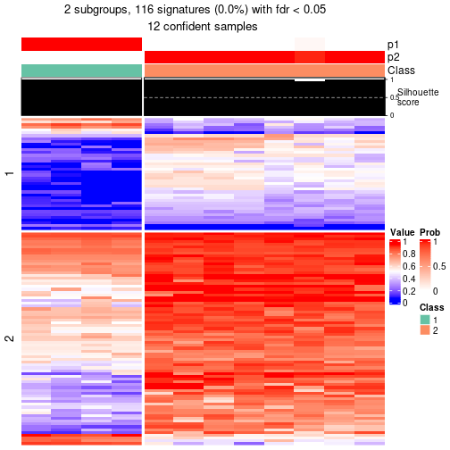</p>

</div>
<div id='tab-node-043-get-signatures-2'>
<pre><code class="r">get_signatures(res, k = 3)
</code></pre>

<p>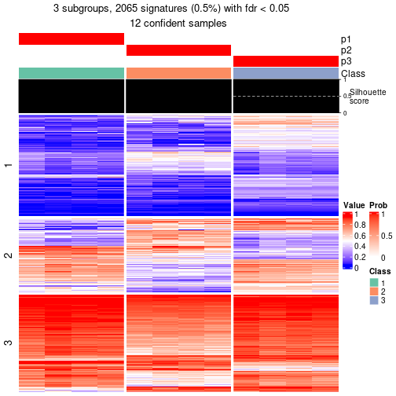</p>

</div>
<div id='tab-node-043-get-signatures-3'>
<pre><code class="r">get_signatures(res, k = 4)
</code></pre>

<p></p>

</div>
<div id='tab-node-043-get-signatures-4'>
<pre><code class="r">get_signatures(res, k = 5)
</code></pre>

<p></p>

</div>
<div id='tab-node-043-get-signatures-5'>
<pre><code class="r">get_signatures(res, k = 6)
</code></pre>

<p></p>

</div>
<div id='tab-node-043-get-signatures-6'>
<pre><code class="r">get_signatures(res, k = 7)
</code></pre>

<p></p>

</div>
<div id='tab-node-043-get-signatures-7'>
<pre><code class="r">get_signatures(res, k = 8)
</code></pre>

<p></p>

</div>
</div>


Compare the overlap of signatures from different k:

```r
compare_signatures(res)
```


`get_signature()` returns a data frame invisibly. To get the list of signatures, the function
call should be assigned to a variable explicitly. In following code, if `plot` argument is set
to `FALSE`, no heatmap is plotted while only the differential analysis is performed.

```r
# code only for demonstration
tb = get_signature(res, k = ..., plot = FALSE)
```

An example of the output of `tb` is:

```
#>   which_row         fdr    mean_1    mean_2 scaled_mean_1 scaled_mean_2 km
#> 1        38 0.042760348  8.373488  9.131774    -0.5533452     0.5164555  1
#> 2        40 0.018707592  7.106213  8.469186    -0.6173731     0.5762149  1
#> 3        55 0.019134737 10.221463 11.207825    -0.6159697     0.5749050  1
#> 4        59 0.006059896  5.921854  7.869574    -0.6899429     0.6439467  1
#> 5        60 0.018055526  8.928898 10.211722    -0.6204761     0.5791110  1
#> 6        98 0.009384629 15.714769 14.887706     0.6635654    -0.6193277  2
...
```

The columns in `tb` are:

1. `which_row`: row indices corresponding to the input matrix.
2. `fdr`: FDR for the differential test. 
3. `mean_x`: The mean value in group x.
4. `scaled_mean_x`: The mean value in group x after rows are scaled.
5. `km`: Row groups if k-means clustering is applied to rows (which is done by automatically selecting number of clusters).

If there are too many signatures, `top_signatures = ...` can be set to only show the 
signatures with the highest FDRs:

```r
# code only for demonstration
# e.g. to show the top 500 most significant rows
tb = get_signature(res, k = ..., top_signatures = 500)
```

If the signatures are defined as these which are uniquely high in current group, `diff_method` argument
can be set to `"uniquely_high_in_one_group"`:

```r
# code only for demonstration
tb = get_signature(res, k = ..., diff_method = "uniquely_high_in_one_group")
```


UMAP plot which shows how samples are separated.


<script>
$( function() {
	$( '#tabs-node-043-dimension-reduction' ).tabs();
} );
</script>
<div id='tabs-node-043-dimension-reduction'>
<ul>
<li><a href='#tab-node-043-dimension-reduction-1'>k = 2</a></li>
<li><a href='#tab-node-043-dimension-reduction-2'>k = 3</a></li>
<li><a href='#tab-node-043-dimension-reduction-3'>k = 4</a></li>
<li><a href='#tab-node-043-dimension-reduction-4'>k = 5</a></li>
<li><a href='#tab-node-043-dimension-reduction-5'>k = 6</a></li>
<li><a href='#tab-node-043-dimension-reduction-6'>k = 7</a></li>
<li><a href='#tab-node-043-dimension-reduction-7'>k = 8</a></li>
</ul>
<div id='tab-node-043-dimension-reduction-1'>
<pre><code class="r">dimension_reduction(res, k = 2, method = &quot;UMAP&quot;)
</code></pre>

<p></p>

</div>
<div id='tab-node-043-dimension-reduction-2'>
<pre><code class="r">dimension_reduction(res, k = 3, method = &quot;UMAP&quot;)
</code></pre>

<p></p>

</div>
<div id='tab-node-043-dimension-reduction-3'>
<pre><code class="r">dimension_reduction(res, k = 4, method = &quot;UMAP&quot;)
</code></pre>

<p></p>

</div>
<div id='tab-node-043-dimension-reduction-4'>
<pre><code class="r">dimension_reduction(res, k = 5, method = &quot;UMAP&quot;)
</code></pre>

<p></p>

</div>
<div id='tab-node-043-dimension-reduction-5'>
<pre><code class="r">dimension_reduction(res, k = 6, method = &quot;UMAP&quot;)
</code></pre>

<p></p>

</div>
<div id='tab-node-043-dimension-reduction-6'>
<pre><code class="r">dimension_reduction(res, k = 7, method = &quot;UMAP&quot;)
</code></pre>

<p></p>

</div>
<div id='tab-node-043-dimension-reduction-7'>
<pre><code class="r">dimension_reduction(res, k = 8, method = &quot;UMAP&quot;)
</code></pre>

<p></p>

</div>
</div>


Following heatmap shows how subgroups are split when increasing `k`:

```r
collect_classes(res)
```


If matrix rows can be associated to genes, consider to use `functional_enrichment(res,
...)` to perform function enrichment for the signature genes. See [this vignette](https://jokergoo.github.io/cola_vignettes/functional_enrichment.html) for more detailed explanations.


 

---------------------------------------------------


### Node05


Parent node: [Node0](#Node0).
Child nodes: 
                Node011-leaf
        ,
                [Node012](#Node012)
        ,
                [Node013](#Node013)
        ,
                Node021-leaf
        ,
                [Node022](#Node022)
        ,
                Node023-leaf
        ,
                [Node031](#Node031)
        ,
                [Node032](#Node032)
        ,
                Node033-leaf
        ,
                Node041-leaf
        ,
                Node042-leaf
        ,
                [Node043](#Node043)
        ,
                Node044-leaf
        ,
                [Node051](#Node051)
        ,
                [Node052](#Node052)
        ,
                [Node053](#Node053)
        ,
                Node054-leaf
        .


The object with results only for a single top-value method and a single partitioning method 
can be extracted as:

```r
res = res_rh["05"]
```

A summary of `res` and all the functions that can be applied to it:

```r
res
```

```
#> A 'ConsensusPartition' object with k = 2, 3, 4, 5, 6, 7, 8.
#>   On a matrix with 30000 rows and 83 columns.
#>   Top rows (1000) are extracted by 'ATC' method.
#>   Subgroups are detected by 'skmeans' method.
#>   Performed in total 350 partitions by row resampling.
#>   Best k for subgroups seems to be 8.
#> 
#> Following methods can be applied to this 'ConsensusPartition' object:
#>  [1] "cola_report"             "collect_classes"         "collect_plots"          
#>  [4] "collect_stats"           "colnames"                "compare_partitions"     
#>  [7] "compare_signatures"      "consensus_heatmap"       "dimension_reduction"    
#> [10] "functional_enrichment"   "get_anno_col"            "get_anno"               
#> [13] "get_classes"             "get_consensus"           "get_matrix"             
#> [16] "get_membership"          "get_param"               "get_signatures"         
#> [19] "get_stats"               "is_best_k"               "is_stable_k"            
#> [22] "membership_heatmap"      "ncol"                    "nrow"                   
#> [25] "plot_ecdf"               "predict_classes"         "rownames"               
#> [28] "select_partition_number" "show"                    "suggest_best_k"         
#> [31] "test_to_known_factors"   "top_rows_heatmap"
```

`collect_plots()` function collects all the plots made from `res` for all `k` (number of subgroups)
into one single page to provide an easy and fast comparison between different `k`.

```r
collect_plots(res)
```


The plots are:

- The first row: a plot of the eCDF (empirical cumulative distribution
  function) curves of the consensus matrix for each `k` and the heatmap of
  predicted classes for each `k`.
- The second row: heatmaps of the consensus matrix for each `k`.
- The third row: heatmaps of the membership matrix for each `k`.
- The fouth row: heatmaps of the signatures for each `k`.

All the plots in panels can be made by individual functions and they are
plotted later in this section.

`select_partition_number()` produces several plots showing different
statistics for choosing "optimized" `k`. There are following statistics:

- eCDF curves of the consensus matrix for each `k`;
- 1-PAC. [The PAC score](https://en.wikipedia.org/wiki/Consensus_clustering#Over-interpretation_potential_of_consensus_clustering)
  measures the proportion of the ambiguous subgrouping.
- Mean silhouette score.
- Concordance. The mean probability of fiting the consensus subgroup labels in all
  partitions.
- Area increased. Denote $A_k$ as the area under the eCDF curve for current
  `k`, the area increased is defined as $A_k - A_{k-1}$.
- Rand index. The percent of pairs of samples that are both in a same cluster
  or both are not in a same cluster in the partition of k and k-1.
- Jaccard index. The ratio of pairs of samples are both in a same cluster in
  the partition of k and k-1 and the pairs of samples are both in a same
  cluster in the partition k or k-1.

The detailed explanations of these statistics can be found in [the _cola_
vignette](https://jokergoo.github.io/cola_vignettes/cola.html#toc_13).

Generally speaking, higher 1-PAC score, higher mean silhouette score or higher
concordance corresponds to better partition. Rand index and Jaccard index
measure how similar the current partition is compared to partition with `k-1`.
If they are too similar, we won't accept `k` is better than `k-1`.

```r
select_partition_number(res)
```


The numeric values for all these statistics can be obtained by `get_stats()`.

```r
get_stats(res)
```

```
#>   k 1-PAC mean_silhouette concordance area_increased  Rand Jaccard
#> 2 2 1.000           0.996       0.998         0.3844 0.617   0.617
#> 3 3 1.000           0.982       0.993         0.6634 0.658   0.482
#> 4 4 0.988           0.971       0.987         0.0669 0.855   0.650
#> 5 5 0.858           0.895       0.909         0.0939 0.872   0.625
#> 6 6 0.853           0.835       0.889         0.0551 0.980   0.915
#> 7 7 0.892           0.818       0.892         0.0490 0.922   0.661
#> 8 8 0.915           0.883       0.923         0.0247 0.980   0.880
```

`suggest_best_k()` suggests the best $k$ based on these statistics. The rules are as follows:

- All $k$ with Jaccard index larger than 0.95 are removed because increasing
  $k$ does not provide enough extra information. If all $k$ are removed, it is
  marked as no subgroup is detected.
- For all $k$ with 1-PAC score larger than 0.9, the maximal $k$ is taken as
  the best $k$, and other $k$ are marked as optional $k$.
- If it does not fit the second rule. The $k$ with the maximal vote of the
  highest 1-PAC score, highest mean silhouette, and highest concordance is
  taken as the best $k$.

```r
suggest_best_k(res)
```

```
#> [1] 8
#> attr(,"optional")
#> [1] 2 3 4
```

There is also optional best $k$ = 2 3 4 that is worth to check.

Following is the table of the partitions (You need to click the **show/hide
code output** link to see it). The membership matrix (columns with name `p*`)
is inferred by
[`clue::cl_consensus()`](https://www.rdocumentation.org/link/cl_consensus?package=clue)
function with the `SE` method. Basically the value in the membership matrix
represents the probability to belong to a certain group. The finall subgroup
label for an item is determined with the group with highest probability it
belongs to.

In `get_classes()` function, the entropy is calculated from the membership
matrix and the silhouette score is calculated from the consensus matrix.


<script>
$( function() {
	$( '#tabs-node-05-get-classes' ).tabs();
} );
</script>
<div id='tabs-node-05-get-classes'>
<ul>
<li><a href='#tab-node-05-get-classes-1'>k = 2</a></li>
<li><a href='#tab-node-05-get-classes-2'>k = 3</a></li>
<li><a href='#tab-node-05-get-classes-3'>k = 4</a></li>
<li><a href='#tab-node-05-get-classes-4'>k = 5</a></li>
<li><a href='#tab-node-05-get-classes-5'>k = 6</a></li>
<li><a href='#tab-node-05-get-classes-6'>k = 7</a></li>
<li><a href='#tab-node-05-get-classes-7'>k = 8</a></li>
</ul>

<div id='tab-node-05-get-classes-1'>
<p><a id='tab-node-05-get-classes-1-a' style='color:#0366d6' href='#'>show/hide code output</a></p>
<pre><code class="r">cbind(get_classes(res, k = 2), get_membership(res, k = 2))
</code></pre>

<pre><code>#&gt;                 class entropy silhouette   p1   p2
#&gt; TCGA.IA.A83W.01     1   0.000      0.998 1.00 0.00
#&gt; TCGA.G7.A8LC.01     1   0.000      0.998 1.00 0.00
#&gt; TCGA.EV.5901.01     2   0.000      0.999 0.00 1.00
#&gt; TCGA.SX.A7SR.01     1   0.000      0.998 1.00 0.00
#&gt; TCGA.IZ.A6M8.01     1   0.000      0.998 1.00 0.00
#&gt; TCGA.MH.A856.01     1   0.000      0.998 1.00 0.00
#&gt; TCGA.B9.5156.01     1   0.000      0.998 1.00 0.00
#&gt; TCGA.Y8.A897.01     1   0.000      0.998 1.00 0.00
#&gt; TCGA.SX.A7SP.01     2   0.000      0.999 0.00 1.00
#&gt; TCGA.Y8.A8RZ.01     2   0.000      0.999 0.00 1.00
#&gt; TCGA.A4.A5XZ.01     2   0.141      0.979 0.02 0.98
#&gt; TCGA.Y8.A898.01     1   0.000      0.998 1.00 0.00
#&gt; TCGA.Y8.A8RY.01     1   0.000      0.998 1.00 0.00
#&gt; TCGA.SX.A7SN.01     1   0.000      0.998 1.00 0.00
#&gt; TCGA.A4.8517.01     1   0.000      0.998 1.00 0.00
#&gt; TCGA.SX.A7SO.01     2   0.000      0.999 0.00 1.00
#&gt; TCGA.B1.A657.01     1   0.000      0.998 1.00 0.00
#&gt; TCGA.EV.5903.01     1   0.000      0.998 1.00 0.00
#&gt; TCGA.A4.A6HP.01     1   0.000      0.998 1.00 0.00
#&gt; TCGA.BQ.5886.01     1   0.000      0.998 1.00 0.00
#&gt; TCGA.A4.A5Y0.01     2   0.000      0.999 0.00 1.00
#&gt; TCGA.A4.8098.01     1   0.000      0.998 1.00 0.00
#&gt; TCGA.DW.5560.01     2   0.000      0.999 0.00 1.00
#&gt; TCGA.A4.8310.01     1   0.000      0.998 1.00 0.00
#&gt; TCGA.2Z.A9J8.01     2   0.000      0.999 0.00 1.00
#&gt; TCGA.P4.A5E7.01     2   0.000      0.999 0.00 1.00
#&gt; TCGA.2Z.A9JM.01     1   0.000      0.998 1.00 0.00
#&gt; TCGA.2Z.A9JD.01     1   0.000      0.998 1.00 0.00
#&gt; TCGA.SX.A71V.01     1   0.000      0.998 1.00 0.00
#&gt; TCGA.IA.A40X.01     2   0.000      0.999 0.00 1.00
#&gt; TCGA.5P.A9KE.01     1   0.000      0.998 1.00 0.00
#&gt; TCGA.5P.A9KA.01     1   0.000      0.998 1.00 0.00
#&gt; TCGA.A4.A772.01     1   0.000      0.998 1.00 0.00
#&gt; TCGA.IA.A40U.01     1   0.000      0.998 1.00 0.00
#&gt; TCGA.DW.7963.01     1   0.000      0.998 1.00 0.00
#&gt; TCGA.2Z.A9JL.01     1   0.000      0.998 1.00 0.00
#&gt; TCGA.P4.AAVM.01     1   0.000      0.998 1.00 0.00
#&gt; TCGA.5P.A9JZ.01     2   0.000      0.999 0.00 1.00
#&gt; TCGA.BQ.5881.01     1   0.000      0.998 1.00 0.00
#&gt; TCGA.UZ.A9PS.01     2   0.000      0.999 0.00 1.00
#&gt; TCGA.5P.A9K0.01     1   0.000      0.998 1.00 0.00
#&gt; TCGA.5P.A9K6.01     1   0.000      0.998 1.00 0.00
#&gt; TCGA.P4.A5E6.01     1   0.000      0.998 1.00 0.00
#&gt; TCGA.BQ.5885.01     1   0.000      0.998 1.00 0.00
#&gt; TCGA.2Z.A9JP.01     1   0.000      0.998 1.00 0.00
#&gt; TCGA.2Z.A9JR.01     1   0.000      0.998 1.00 0.00
#&gt; TCGA.GL.A59T.01     1   0.000      0.998 1.00 0.00
#&gt; TCGA.B1.A47M.01     1   0.000      0.998 1.00 0.00
#&gt; TCGA.2Z.A9JJ.01     2   0.000      0.999 0.00 1.00
#&gt; TCGA.2Z.A9JT.01     1   0.000      0.998 1.00 0.00
#&gt; TCGA.HE.A5NL.01     1   0.000      0.998 1.00 0.00
#&gt; TCGA.G7.7502.01     1   0.000      0.998 1.00 0.00
#&gt; TCGA.DW.7841.01     1   0.000      0.998 1.00 0.00
#&gt; TCGA.BQ.7045.01     1   0.000      0.998 1.00 0.00
#&gt; TCGA.A4.7996.01     2   0.000      0.999 0.00 1.00
#&gt; TCGA.BQ.7046.01     1   0.000      0.998 1.00 0.00
#&gt; TCGA.G7.7501.01     2   0.000      0.999 0.00 1.00
#&gt; TCGA.DW.7834.01     1   0.000      0.998 1.00 0.00
#&gt; TCGA.BQ.7060.01     1   0.000      0.998 1.00 0.00
#&gt; TCGA.G7.6792.01     1   0.000      0.998 1.00 0.00
#&gt; TCGA.GL.7773.01     2   0.000      0.999 0.00 1.00
#&gt; TCGA.BQ.7053.01     2   0.000      0.999 0.00 1.00
#&gt; TCGA.BQ.7062.01     1   0.000      0.998 1.00 0.00
#&gt; TCGA.A4.7288.01     2   0.000      0.999 0.00 1.00
#&gt; TCGA.A4.7286.01     1   0.000      0.998 1.00 0.00
#&gt; TCGA.G7.6795.01     1   0.000      0.998 1.00 0.00
#&gt; TCGA.MH.A55W.01     1   0.000      0.998 1.00 0.00
#&gt; TCGA.G7.6790.01     1   0.000      0.998 1.00 0.00
#&gt; TCGA.A4.7997.01     1   0.000      0.998 1.00 0.00
#&gt; TCGA.MH.A561.01     1   0.000      0.998 1.00 0.00
#&gt; TCGA.A4.A57E.01     2   0.000      0.999 0.00 1.00
#&gt; TCGA.DW.7837.01     1   0.000      0.998 1.00 0.00
#&gt; TCGA.SX.A71U.01     1   0.000      0.998 1.00 0.00
#&gt; TCGA.BQ.7050.01     2   0.000      0.999 0.00 1.00
#&gt; TCGA.J7.6720.01     1   0.000      0.998 1.00 0.00
#&gt; TCGA.MH.A562.01     1   0.000      0.998 1.00 0.00
#&gt; TCGA.A4.7584.01     1   0.000      0.998 1.00 0.00
#&gt; TCGA.BQ.7056.01     2   0.000      0.999 0.00 1.00
#&gt; TCGA.2Z.A9J1.01     1   0.000      0.998 1.00 0.00
#&gt; TCGA.UN.AAZ9.01     1   0.529      0.863 0.88 0.12
#&gt; TCGA.2Z.A9J6.01     1   0.000      0.998 1.00 0.00
#&gt; TCGA.A4.7583.01     1   0.000      0.998 1.00 0.00
#&gt; TCGA.2Z.A9J5.01     1   0.000      0.998 1.00 0.00
</code></pre>

<script>
$('#tab-node-05-get-classes-1-a').parent().next().next().hide();
$('#tab-node-05-get-classes-1-a').click(function(){
  $('#tab-node-05-get-classes-1-a').parent().next().next().toggle();
  return(false);
});
</script>
</div>

<div id='tab-node-05-get-classes-2'>
<p><a id='tab-node-05-get-classes-2-a' style='color:#0366d6' href='#'>show/hide code output</a></p>
<pre><code class="r">cbind(get_classes(res, k = 3), get_membership(res, k = 3))
</code></pre>

<pre><code>#&gt;                 class entropy silhouette   p1   p2   p3
#&gt; TCGA.IA.A83W.01     1  0.0000      0.998 1.00 0.00 0.00
#&gt; TCGA.G7.A8LC.01     3  0.0000      0.984 0.00 0.00 1.00
#&gt; TCGA.EV.5901.01     2  0.0000      1.000 0.00 1.00 0.00
#&gt; TCGA.SX.A7SR.01     1  0.0000      0.998 1.00 0.00 0.00
#&gt; TCGA.IZ.A6M8.01     3  0.0000      0.984 0.00 0.00 1.00
#&gt; TCGA.MH.A856.01     1  0.0000      0.998 1.00 0.00 0.00
#&gt; TCGA.B9.5156.01     1  0.0000      0.998 1.00 0.00 0.00
#&gt; TCGA.Y8.A897.01     1  0.0000      0.998 1.00 0.00 0.00
#&gt; TCGA.SX.A7SP.01     2  0.0000      1.000 0.00 1.00 0.00
#&gt; TCGA.Y8.A8RZ.01     3  0.0000      0.984 0.00 0.00 1.00
#&gt; TCGA.A4.A5XZ.01     3  0.0000      0.984 0.00 0.00 1.00
#&gt; TCGA.Y8.A898.01     1  0.0000      0.998 1.00 0.00 0.00
#&gt; TCGA.Y8.A8RY.01     1  0.0000      0.998 1.00 0.00 0.00
#&gt; TCGA.SX.A7SN.01     1  0.0000      0.998 1.00 0.00 0.00
#&gt; TCGA.A4.8517.01     3  0.0000      0.984 0.00 0.00 1.00
#&gt; TCGA.SX.A7SO.01     3  0.0892      0.966 0.00 0.02 0.98
#&gt; TCGA.B1.A657.01     1  0.0000      0.998 1.00 0.00 0.00
#&gt; TCGA.EV.5903.01     1  0.0000      0.998 1.00 0.00 0.00
#&gt; TCGA.A4.A6HP.01     1  0.0000      0.998 1.00 0.00 0.00
#&gt; TCGA.BQ.5886.01     3  0.0000      0.984 0.00 0.00 1.00
#&gt; TCGA.A4.A5Y0.01     2  0.0000      1.000 0.00 1.00 0.00
#&gt; TCGA.A4.8098.01     3  0.0000      0.984 0.00 0.00 1.00
#&gt; TCGA.DW.5560.01     2  0.0000      1.000 0.00 1.00 0.00
#&gt; TCGA.A4.8310.01     3  0.0000      0.984 0.00 0.00 1.00
#&gt; TCGA.2Z.A9J8.01     3  0.0000      0.984 0.00 0.00 1.00
#&gt; TCGA.P4.A5E7.01     2  0.0000      1.000 0.00 1.00 0.00
#&gt; TCGA.2Z.A9JM.01     1  0.0000      0.998 1.00 0.00 0.00
#&gt; TCGA.2Z.A9JD.01     3  0.0000      0.984 0.00 0.00 1.00
#&gt; TCGA.SX.A71V.01     3  0.0000      0.984 0.00 0.00 1.00
#&gt; TCGA.IA.A40X.01     2  0.0000      1.000 0.00 1.00 0.00
#&gt; TCGA.5P.A9KE.01     3  0.0000      0.984 0.00 0.00 1.00
#&gt; TCGA.5P.A9KA.01     1  0.0000      0.998 1.00 0.00 0.00
#&gt; TCGA.A4.A772.01     1  0.0000      0.998 1.00 0.00 0.00
#&gt; TCGA.IA.A40U.01     3  0.0000      0.984 0.00 0.00 1.00
#&gt; TCGA.DW.7963.01     1  0.0892      0.977 0.98 0.00 0.02
#&gt; TCGA.2Z.A9JL.01     1  0.0000      0.998 1.00 0.00 0.00
#&gt; TCGA.P4.AAVM.01     3  0.0000      0.984 0.00 0.00 1.00
#&gt; TCGA.5P.A9JZ.01     2  0.0000      1.000 0.00 1.00 0.00
#&gt; TCGA.BQ.5881.01     3  0.0000      0.984 0.00 0.00 1.00
#&gt; TCGA.UZ.A9PS.01     2  0.0000      1.000 0.00 1.00 0.00
#&gt; TCGA.5P.A9K0.01     3  0.0000      0.984 0.00 0.00 1.00
#&gt; TCGA.5P.A9K6.01     1  0.0000      0.998 1.00 0.00 0.00
#&gt; TCGA.P4.A5E6.01     3  0.0000      0.984 0.00 0.00 1.00
#&gt; TCGA.BQ.5885.01     3  0.0000      0.984 0.00 0.00 1.00
#&gt; TCGA.2Z.A9JP.01     3  0.0000      0.984 0.00 0.00 1.00
#&gt; TCGA.2Z.A9JR.01     1  0.0000      0.998 1.00 0.00 0.00
#&gt; TCGA.GL.A59T.01     1  0.0000      0.998 1.00 0.00 0.00
#&gt; TCGA.B1.A47M.01     1  0.0000      0.998 1.00 0.00 0.00
#&gt; TCGA.2Z.A9JJ.01     2  0.0000      1.000 0.00 1.00 0.00
#&gt; TCGA.2Z.A9JT.01     3  0.0000      0.984 0.00 0.00 1.00
#&gt; TCGA.HE.A5NL.01     1  0.0000      0.998 1.00 0.00 0.00
#&gt; TCGA.G7.7502.01     3  0.0000      0.984 0.00 0.00 1.00
#&gt; TCGA.DW.7841.01     1  0.0000      0.998 1.00 0.00 0.00
#&gt; TCGA.BQ.7045.01     3  0.0000      0.984 0.00 0.00 1.00
#&gt; TCGA.A4.7996.01     3  0.6244      0.214 0.00 0.44 0.56
#&gt; TCGA.BQ.7046.01     3  0.0000      0.984 0.00 0.00 1.00
#&gt; TCGA.G7.7501.01     2  0.0000      1.000 0.00 1.00 0.00
#&gt; TCGA.DW.7834.01     1  0.0000      0.998 1.00 0.00 0.00
#&gt; TCGA.BQ.7060.01     3  0.0000      0.984 0.00 0.00 1.00
#&gt; TCGA.G7.6792.01     1  0.0000      0.998 1.00 0.00 0.00
#&gt; TCGA.GL.7773.01     2  0.0000      1.000 0.00 1.00 0.00
#&gt; TCGA.BQ.7053.01     2  0.0000      1.000 0.00 1.00 0.00
#&gt; TCGA.BQ.7062.01     1  0.0000      0.998 1.00 0.00 0.00
#&gt; TCGA.A4.7288.01     2  0.0000      1.000 0.00 1.00 0.00
#&gt; TCGA.A4.7286.01     3  0.0000      0.984 0.00 0.00 1.00
#&gt; TCGA.G7.6795.01     1  0.0000      0.998 1.00 0.00 0.00
#&gt; TCGA.MH.A55W.01     3  0.0000      0.984 0.00 0.00 1.00
#&gt; TCGA.G7.6790.01     1  0.0000      0.998 1.00 0.00 0.00
#&gt; TCGA.A4.7997.01     1  0.0000      0.998 1.00 0.00 0.00
#&gt; TCGA.MH.A561.01     1  0.0000      0.998 1.00 0.00 0.00
#&gt; TCGA.A4.A57E.01     3  0.0892      0.966 0.00 0.02 0.98
#&gt; TCGA.DW.7837.01     1  0.0000      0.998 1.00 0.00 0.00
#&gt; TCGA.SX.A71U.01     1  0.0000      0.998 1.00 0.00 0.00
#&gt; TCGA.BQ.7050.01     2  0.0000      1.000 0.00 1.00 0.00
#&gt; TCGA.J7.6720.01     1  0.0000      0.998 1.00 0.00 0.00
#&gt; TCGA.MH.A562.01     1  0.0000      0.998 1.00 0.00 0.00
#&gt; TCGA.A4.7584.01     1  0.2066      0.931 0.94 0.00 0.06
#&gt; TCGA.BQ.7056.01     2  0.0000      1.000 0.00 1.00 0.00
#&gt; TCGA.2Z.A9J1.01     1  0.0000      0.998 1.00 0.00 0.00
#&gt; TCGA.UN.AAZ9.01     3  0.0000      0.984 0.00 0.00 1.00
#&gt; TCGA.2Z.A9J6.01     1  0.0000      0.998 1.00 0.00 0.00
#&gt; TCGA.A4.7583.01     3  0.0000      0.984 0.00 0.00 1.00
#&gt; TCGA.2Z.A9J5.01     1  0.0000      0.998 1.00 0.00 0.00
</code></pre>

<script>
$('#tab-node-05-get-classes-2-a').parent().next().next().hide();
$('#tab-node-05-get-classes-2-a').click(function(){
  $('#tab-node-05-get-classes-2-a').parent().next().next().toggle();
  return(false);
});
</script>
</div>

<div id='tab-node-05-get-classes-3'>
<p><a id='tab-node-05-get-classes-3-a' style='color:#0366d6' href='#'>show/hide code output</a></p>
<pre><code class="r">cbind(get_classes(res, k = 4), get_membership(res, k = 4))
</code></pre>

<pre><code>#&gt;                 class entropy silhouette   p1   p2   p3   p4
#&gt; TCGA.IA.A83W.01     1  0.0000      0.998 1.00 0.00 0.00 0.00
#&gt; TCGA.G7.A8LC.01     3  0.0000      0.981 0.00 0.00 1.00 0.00
#&gt; TCGA.EV.5901.01     4  0.0000      1.000 0.00 0.00 0.00 1.00
#&gt; TCGA.SX.A7SR.01     1  0.0000      0.998 1.00 0.00 0.00 0.00
#&gt; TCGA.IZ.A6M8.01     3  0.0000      0.981 0.00 0.00 1.00 0.00
#&gt; TCGA.MH.A856.01     1  0.0000      0.998 1.00 0.00 0.00 0.00
#&gt; TCGA.B9.5156.01     1  0.0000      0.998 1.00 0.00 0.00 0.00
#&gt; TCGA.Y8.A897.01     1  0.1913      0.935 0.94 0.00 0.02 0.04
#&gt; TCGA.SX.A7SP.01     2  0.5151      0.727 0.00 0.76 0.10 0.14
#&gt; TCGA.Y8.A8RZ.01     2  0.0000      0.951 0.00 1.00 0.00 0.00
#&gt; TCGA.A4.A5XZ.01     3  0.0000      0.981 0.00 0.00 1.00 0.00
#&gt; TCGA.Y8.A898.01     1  0.0000      0.998 1.00 0.00 0.00 0.00
#&gt; TCGA.Y8.A8RY.01     1  0.0000      0.998 1.00 0.00 0.00 0.00
#&gt; TCGA.SX.A7SN.01     1  0.0000      0.998 1.00 0.00 0.00 0.00
#&gt; TCGA.A4.8517.01     3  0.0000      0.981 0.00 0.00 1.00 0.00
#&gt; TCGA.SX.A7SO.01     2  0.0000      0.951 0.00 1.00 0.00 0.00
#&gt; TCGA.B1.A657.01     1  0.0000      0.998 1.00 0.00 0.00 0.00
#&gt; TCGA.EV.5903.01     1  0.0000      0.998 1.00 0.00 0.00 0.00
#&gt; TCGA.A4.A6HP.01     1  0.0000      0.998 1.00 0.00 0.00 0.00
#&gt; TCGA.BQ.5886.01     3  0.0000      0.981 0.00 0.00 1.00 0.00
#&gt; TCGA.A4.A5Y0.01     2  0.0000      0.951 0.00 1.00 0.00 0.00
#&gt; TCGA.A4.8098.01     3  0.0000      0.981 0.00 0.00 1.00 0.00
#&gt; TCGA.DW.5560.01     4  0.0000      1.000 0.00 0.00 0.00 1.00
#&gt; TCGA.A4.8310.01     3  0.0000      0.981 0.00 0.00 1.00 0.00
#&gt; TCGA.2Z.A9J8.01     2  0.0000      0.951 0.00 1.00 0.00 0.00
#&gt; TCGA.P4.A5E7.01     4  0.0000      1.000 0.00 0.00 0.00 1.00
#&gt; TCGA.2Z.A9JM.01     1  0.0000      0.998 1.00 0.00 0.00 0.00
#&gt; TCGA.2Z.A9JD.01     3  0.0000      0.981 0.00 0.00 1.00 0.00
#&gt; TCGA.SX.A71V.01     3  0.0000      0.981 0.00 0.00 1.00 0.00
#&gt; TCGA.IA.A40X.01     2  0.0000      0.951 0.00 1.00 0.00 0.00
#&gt; TCGA.5P.A9KE.01     3  0.0000      0.981 0.00 0.00 1.00 0.00
#&gt; TCGA.5P.A9KA.01     1  0.0000      0.998 1.00 0.00 0.00 0.00
#&gt; TCGA.A4.A772.01     1  0.0000      0.998 1.00 0.00 0.00 0.00
#&gt; TCGA.IA.A40U.01     3  0.0000      0.981 0.00 0.00 1.00 0.00
#&gt; TCGA.DW.7963.01     3  0.0707      0.962 0.02 0.00 0.98 0.00
#&gt; TCGA.2Z.A9JL.01     1  0.0000      0.998 1.00 0.00 0.00 0.00
#&gt; TCGA.P4.AAVM.01     3  0.0000      0.981 0.00 0.00 1.00 0.00
#&gt; TCGA.5P.A9JZ.01     4  0.0000      1.000 0.00 0.00 0.00 1.00
#&gt; TCGA.BQ.5881.01     3  0.0000      0.981 0.00 0.00 1.00 0.00
#&gt; TCGA.UZ.A9PS.01     2  0.3606      0.830 0.00 0.84 0.02 0.14
#&gt; TCGA.5P.A9K0.01     3  0.0000      0.981 0.00 0.00 1.00 0.00
#&gt; TCGA.5P.A9K6.01     3  0.2921      0.809 0.14 0.00 0.86 0.00
#&gt; TCGA.P4.A5E6.01     3  0.0000      0.981 0.00 0.00 1.00 0.00
#&gt; TCGA.BQ.5885.01     3  0.0000      0.981 0.00 0.00 1.00 0.00
#&gt; TCGA.2Z.A9JP.01     3  0.0000      0.981 0.00 0.00 1.00 0.00
#&gt; TCGA.2Z.A9JR.01     1  0.0000      0.998 1.00 0.00 0.00 0.00
#&gt; TCGA.GL.A59T.01     1  0.0000      0.998 1.00 0.00 0.00 0.00
#&gt; TCGA.B1.A47M.01     1  0.0000      0.998 1.00 0.00 0.00 0.00
#&gt; TCGA.2Z.A9JJ.01     4  0.0000      1.000 0.00 0.00 0.00 1.00
#&gt; TCGA.2Z.A9JT.01     3  0.0000      0.981 0.00 0.00 1.00 0.00
#&gt; TCGA.HE.A5NL.01     1  0.0000      0.998 1.00 0.00 0.00 0.00
#&gt; TCGA.G7.7502.01     3  0.0000      0.981 0.00 0.00 1.00 0.00
#&gt; TCGA.DW.7841.01     1  0.0000      0.998 1.00 0.00 0.00 0.00
#&gt; TCGA.BQ.7045.01     3  0.0000      0.981 0.00 0.00 1.00 0.00
#&gt; TCGA.A4.7996.01     3  0.2921      0.831 0.00 0.00 0.86 0.14
#&gt; TCGA.BQ.7046.01     3  0.0000      0.981 0.00 0.00 1.00 0.00
#&gt; TCGA.G7.7501.01     2  0.0000      0.951 0.00 1.00 0.00 0.00
#&gt; TCGA.DW.7834.01     1  0.0000      0.998 1.00 0.00 0.00 0.00
#&gt; TCGA.BQ.7060.01     3  0.0000      0.981 0.00 0.00 1.00 0.00
#&gt; TCGA.G7.6792.01     1  0.0000      0.998 1.00 0.00 0.00 0.00
#&gt; TCGA.GL.7773.01     4  0.0000      1.000 0.00 0.00 0.00 1.00
#&gt; TCGA.BQ.7053.01     2  0.0000      0.951 0.00 1.00 0.00 0.00
#&gt; TCGA.BQ.7062.01     3  0.0707      0.962 0.02 0.00 0.98 0.00
#&gt; TCGA.A4.7288.01     2  0.3606      0.830 0.00 0.84 0.02 0.14
#&gt; TCGA.A4.7286.01     3  0.0000      0.981 0.00 0.00 1.00 0.00
#&gt; TCGA.G7.6795.01     1  0.0000      0.998 1.00 0.00 0.00 0.00
#&gt; TCGA.MH.A55W.01     3  0.0000      0.981 0.00 0.00 1.00 0.00
#&gt; TCGA.G7.6790.01     3  0.2921      0.809 0.14 0.00 0.86 0.00
#&gt; TCGA.A4.7997.01     1  0.0000      0.998 1.00 0.00 0.00 0.00
#&gt; TCGA.MH.A561.01     1  0.0000      0.998 1.00 0.00 0.00 0.00
#&gt; TCGA.A4.A57E.01     2  0.0000      0.951 0.00 1.00 0.00 0.00
#&gt; TCGA.DW.7837.01     1  0.0000      0.998 1.00 0.00 0.00 0.00
#&gt; TCGA.SX.A71U.01     1  0.0000      0.998 1.00 0.00 0.00 0.00
#&gt; TCGA.BQ.7050.01     2  0.0000      0.951 0.00 1.00 0.00 0.00
#&gt; TCGA.J7.6720.01     1  0.0000      0.998 1.00 0.00 0.00 0.00
#&gt; TCGA.MH.A562.01     1  0.0000      0.998 1.00 0.00 0.00 0.00
#&gt; TCGA.A4.7584.01     3  0.0707      0.962 0.02 0.00 0.98 0.00
#&gt; TCGA.BQ.7056.01     2  0.0000      0.951 0.00 1.00 0.00 0.00
#&gt; TCGA.2Z.A9J1.01     1  0.0000      0.998 1.00 0.00 0.00 0.00
#&gt; TCGA.UN.AAZ9.01     3  0.0000      0.981 0.00 0.00 1.00 0.00
#&gt; TCGA.2Z.A9J6.01     1  0.0000      0.998 1.00 0.00 0.00 0.00
#&gt; TCGA.A4.7583.01     3  0.0000      0.981 0.00 0.00 1.00 0.00
#&gt; TCGA.2Z.A9J5.01     1  0.0000      0.998 1.00 0.00 0.00 0.00
</code></pre>

<script>
$('#tab-node-05-get-classes-3-a').parent().next().next().hide();
$('#tab-node-05-get-classes-3-a').click(function(){
  $('#tab-node-05-get-classes-3-a').parent().next().next().toggle();
  return(false);
});
</script>
</div>

<div id='tab-node-05-get-classes-4'>
<p><a id='tab-node-05-get-classes-4-a' style='color:#0366d6' href='#'>show/hide code output</a></p>
<pre><code class="r">cbind(get_classes(res, k = 5), get_membership(res, k = 5))
</code></pre>

<pre><code>#&gt;                 class entropy silhouette   p1   p2   p3   p4   p5
#&gt; TCGA.IA.A83W.01     5  0.3684      1.000 0.28 0.00 0.00 0.00 0.72
#&gt; TCGA.G7.A8LC.01     3  0.0000      0.968 0.00 0.00 1.00 0.00 0.00
#&gt; TCGA.EV.5901.01     4  0.0000      1.000 0.00 0.00 0.00 1.00 0.00
#&gt; TCGA.SX.A7SR.01     1  0.0000      0.903 1.00 0.00 0.00 0.00 0.00
#&gt; TCGA.IZ.A6M8.01     3  0.0609      0.950 0.02 0.00 0.98 0.00 0.00
#&gt; TCGA.MH.A856.01     5  0.3684      1.000 0.28 0.00 0.00 0.00 0.72
#&gt; TCGA.B9.5156.01     1  0.0000      0.903 1.00 0.00 0.00 0.00 0.00
#&gt; TCGA.Y8.A897.01     1  0.1732      0.827 0.92 0.00 0.00 0.00 0.08
#&gt; TCGA.SX.A7SP.01     2  0.7587      0.225 0.00 0.44 0.32 0.16 0.08
#&gt; TCGA.Y8.A8RZ.01     2  0.3109      0.780 0.00 0.80 0.00 0.00 0.20
#&gt; TCGA.A4.A5XZ.01     3  0.1732      0.901 0.00 0.00 0.92 0.00 0.08
#&gt; TCGA.Y8.A898.01     1  0.0000      0.903 1.00 0.00 0.00 0.00 0.00
#&gt; TCGA.Y8.A8RY.01     1  0.0000      0.903 1.00 0.00 0.00 0.00 0.00
#&gt; TCGA.SX.A7SN.01     5  0.3684      1.000 0.28 0.00 0.00 0.00 0.72
#&gt; TCGA.A4.8517.01     3  0.0000      0.968 0.00 0.00 1.00 0.00 0.00
#&gt; TCGA.SX.A7SO.01     2  0.3109      0.780 0.00 0.80 0.00 0.00 0.20
#&gt; TCGA.B1.A657.01     1  0.0000      0.903 1.00 0.00 0.00 0.00 0.00
#&gt; TCGA.EV.5903.01     5  0.3684      1.000 0.28 0.00 0.00 0.00 0.72
#&gt; TCGA.A4.A6HP.01     5  0.3684      1.000 0.28 0.00 0.00 0.00 0.72
#&gt; TCGA.BQ.5886.01     3  0.0000      0.968 0.00 0.00 1.00 0.00 0.00
#&gt; TCGA.A4.A5Y0.01     2  0.0000      0.830 0.00 1.00 0.00 0.00 0.00
#&gt; TCGA.A4.8098.01     3  0.0000      0.968 0.00 0.00 1.00 0.00 0.00
#&gt; TCGA.DW.5560.01     4  0.0000      1.000 0.00 0.00 0.00 1.00 0.00
#&gt; TCGA.A4.8310.01     3  0.0000      0.968 0.00 0.00 1.00 0.00 0.00
#&gt; TCGA.2Z.A9J8.01     2  0.3109      0.780 0.00 0.80 0.00 0.00 0.20
#&gt; TCGA.P4.A5E7.01     4  0.0000      1.000 0.00 0.00 0.00 1.00 0.00
#&gt; TCGA.2Z.A9JM.01     5  0.3684      1.000 0.28 0.00 0.00 0.00 0.72
#&gt; TCGA.2Z.A9JD.01     3  0.0000      0.968 0.00 0.00 1.00 0.00 0.00
#&gt; TCGA.SX.A71V.01     3  0.0000      0.968 0.00 0.00 1.00 0.00 0.00
#&gt; TCGA.IA.A40X.01     2  0.0609      0.827 0.00 0.98 0.00 0.02 0.00
#&gt; TCGA.5P.A9KE.01     3  0.0000      0.968 0.00 0.00 1.00 0.00 0.00
#&gt; TCGA.5P.A9KA.01     5  0.3684      1.000 0.28 0.00 0.00 0.00 0.72
#&gt; TCGA.A4.A772.01     1  0.0000      0.903 1.00 0.00 0.00 0.00 0.00
#&gt; TCGA.IA.A40U.01     3  0.0000      0.968 0.00 0.00 1.00 0.00 0.00
#&gt; TCGA.DW.7963.01     1  0.3895      0.541 0.68 0.00 0.32 0.00 0.00
#&gt; TCGA.2Z.A9JL.01     5  0.3684      1.000 0.28 0.00 0.00 0.00 0.72
#&gt; TCGA.P4.AAVM.01     3  0.0000      0.968 0.00 0.00 1.00 0.00 0.00
#&gt; TCGA.5P.A9JZ.01     4  0.0000      1.000 0.00 0.00 0.00 1.00 0.00
#&gt; TCGA.BQ.5881.01     3  0.0000      0.968 0.00 0.00 1.00 0.00 0.00
#&gt; TCGA.UZ.A9PS.01     2  0.5347      0.640 0.00 0.72 0.04 0.16 0.08
#&gt; TCGA.5P.A9K0.01     3  0.0000      0.968 0.00 0.00 1.00 0.00 0.00
#&gt; TCGA.5P.A9K6.01     1  0.3561      0.624 0.74 0.00 0.26 0.00 0.00
#&gt; TCGA.P4.A5E6.01     3  0.0000      0.968 0.00 0.00 1.00 0.00 0.00
#&gt; TCGA.BQ.5885.01     3  0.0000      0.968 0.00 0.00 1.00 0.00 0.00
#&gt; TCGA.2Z.A9JP.01     3  0.0000      0.968 0.00 0.00 1.00 0.00 0.00
#&gt; TCGA.2Z.A9JR.01     1  0.0000      0.903 1.00 0.00 0.00 0.00 0.00
#&gt; TCGA.GL.A59T.01     1  0.0000      0.903 1.00 0.00 0.00 0.00 0.00
#&gt; TCGA.B1.A47M.01     1  0.0000      0.903 1.00 0.00 0.00 0.00 0.00
#&gt; TCGA.2Z.A9JJ.01     4  0.0000      1.000 0.00 0.00 0.00 1.00 0.00
#&gt; TCGA.2Z.A9JT.01     3  0.0000      0.968 0.00 0.00 1.00 0.00 0.00
#&gt; TCGA.HE.A5NL.01     1  0.0000      0.903 1.00 0.00 0.00 0.00 0.00
#&gt; TCGA.G7.7502.01     3  0.0000      0.968 0.00 0.00 1.00 0.00 0.00
#&gt; TCGA.DW.7841.01     5  0.3684      1.000 0.28 0.00 0.00 0.00 0.72
#&gt; TCGA.BQ.7045.01     3  0.1410      0.908 0.06 0.00 0.94 0.00 0.00
#&gt; TCGA.A4.7996.01     3  0.3946      0.764 0.00 0.00 0.80 0.12 0.08
#&gt; TCGA.BQ.7046.01     3  0.0000      0.968 0.00 0.00 1.00 0.00 0.00
#&gt; TCGA.G7.7501.01     2  0.0000      0.830 0.00 1.00 0.00 0.00 0.00
#&gt; TCGA.DW.7834.01     1  0.0000      0.903 1.00 0.00 0.00 0.00 0.00
#&gt; TCGA.BQ.7060.01     3  0.0000      0.968 0.00 0.00 1.00 0.00 0.00
#&gt; TCGA.G7.6792.01     5  0.3684      1.000 0.28 0.00 0.00 0.00 0.72
#&gt; TCGA.GL.7773.01     4  0.0000      1.000 0.00 0.00 0.00 1.00 0.00
#&gt; TCGA.BQ.7053.01     2  0.0609      0.827 0.00 0.98 0.00 0.02 0.00
#&gt; TCGA.BQ.7062.01     1  0.3684      0.594 0.72 0.00 0.28 0.00 0.00
#&gt; TCGA.A4.7288.01     2  0.5347      0.640 0.00 0.72 0.04 0.16 0.08
#&gt; TCGA.A4.7286.01     3  0.0000      0.968 0.00 0.00 1.00 0.00 0.00
#&gt; TCGA.G7.6795.01     1  0.0000      0.903 1.00 0.00 0.00 0.00 0.00
#&gt; TCGA.MH.A55W.01     3  0.0000      0.968 0.00 0.00 1.00 0.00 0.00
#&gt; TCGA.G7.6790.01     1  0.3561      0.624 0.74 0.00 0.26 0.00 0.00
#&gt; TCGA.A4.7997.01     5  0.3684      1.000 0.28 0.00 0.00 0.00 0.72
#&gt; TCGA.MH.A561.01     1  0.0000      0.903 1.00 0.00 0.00 0.00 0.00
#&gt; TCGA.A4.A57E.01     2  0.3109      0.780 0.00 0.80 0.00 0.00 0.20
#&gt; TCGA.DW.7837.01     5  0.3684      1.000 0.28 0.00 0.00 0.00 0.72
#&gt; TCGA.SX.A71U.01     1  0.0000      0.903 1.00 0.00 0.00 0.00 0.00
#&gt; TCGA.BQ.7050.01     2  0.0609      0.827 0.00 0.98 0.00 0.02 0.00
#&gt; TCGA.J7.6720.01     1  0.0000      0.903 1.00 0.00 0.00 0.00 0.00
#&gt; TCGA.MH.A562.01     1  0.0000      0.903 1.00 0.00 0.00 0.00 0.00
#&gt; TCGA.A4.7584.01     3  0.3895      0.492 0.32 0.00 0.68 0.00 0.00
#&gt; TCGA.BQ.7056.01     2  0.0000      0.830 0.00 1.00 0.00 0.00 0.00
#&gt; TCGA.2Z.A9J1.01     5  0.3684      1.000 0.28 0.00 0.00 0.00 0.72
#&gt; TCGA.UN.AAZ9.01     3  0.1732      0.901 0.00 0.00 0.92 0.00 0.08
#&gt; TCGA.2Z.A9J6.01     1  0.0000      0.903 1.00 0.00 0.00 0.00 0.00
#&gt; TCGA.A4.7583.01     3  0.0000      0.968 0.00 0.00 1.00 0.00 0.00
#&gt; TCGA.2Z.A9J5.01     1  0.0000      0.903 1.00 0.00 0.00 0.00 0.00
</code></pre>

<script>
$('#tab-node-05-get-classes-4-a').parent().next().next().hide();
$('#tab-node-05-get-classes-4-a').click(function(){
  $('#tab-node-05-get-classes-4-a').parent().next().next().toggle();
  return(false);
});
</script>
</div>

<div id='tab-node-05-get-classes-5'>
<p><a id='tab-node-05-get-classes-5-a' style='color:#0366d6' href='#'>show/hide code output</a></p>
<pre><code class="r">cbind(get_classes(res, k = 6), get_membership(res, k = 6))
</code></pre>

<pre><code>#&gt;                 class entropy silhouette   p1   p2   p3   p4   p5   p6
#&gt; TCGA.IA.A83W.01     5  0.1267      1.000 0.06 0.00 0.00 0.00 0.94 0.00
#&gt; TCGA.G7.A8LC.01     3  0.5247      0.764 0.12 0.00 0.72 0.08 0.02 0.06
#&gt; TCGA.EV.5901.01     4  0.3797      0.813 0.00 0.00 0.00 0.58 0.00 0.42
#&gt; TCGA.SX.A7SR.01     1  0.0000      0.937 1.00 0.00 0.00 0.00 0.00 0.00
#&gt; TCGA.IZ.A6M8.01     3  0.0000      0.878 0.00 0.00 1.00 0.00 0.00 0.00
#&gt; TCGA.MH.A856.01     5  0.1267      1.000 0.06 0.00 0.00 0.00 0.94 0.00
#&gt; TCGA.B9.5156.01     1  0.0547      0.935 0.98 0.00 0.00 0.00 0.02 0.00
#&gt; TCGA.Y8.A897.01     1  0.3409      0.613 0.70 0.00 0.00 0.30 0.00 0.00
#&gt; TCGA.SX.A7SP.01     2  0.3864      0.502 0.00 0.52 0.00 0.48 0.00 0.00
#&gt; TCGA.Y8.A8RZ.01     6  0.4632      1.000 0.00 0.44 0.00 0.00 0.04 0.52
#&gt; TCGA.A4.A5XZ.01     3  0.5815      0.392 0.00 0.02 0.48 0.42 0.02 0.06
#&gt; TCGA.Y8.A898.01     1  0.0000      0.937 1.00 0.00 0.00 0.00 0.00 0.00
#&gt; TCGA.Y8.A8RY.01     1  0.0547      0.935 0.98 0.00 0.00 0.00 0.02 0.00
#&gt; TCGA.SX.A7SN.01     5  0.1267      1.000 0.06 0.00 0.00 0.00 0.94 0.00
#&gt; TCGA.A4.8517.01     3  0.0000      0.878 0.00 0.00 1.00 0.00 0.00 0.00
#&gt; TCGA.SX.A7SO.01     6  0.4632      1.000 0.00 0.44 0.00 0.00 0.04 0.52
#&gt; TCGA.B1.A657.01     1  0.0000      0.937 1.00 0.00 0.00 0.00 0.00 0.00
#&gt; TCGA.EV.5903.01     5  0.1267      1.000 0.06 0.00 0.00 0.00 0.94 0.00
#&gt; TCGA.A4.A6HP.01     5  0.1267      1.000 0.06 0.00 0.00 0.00 0.94 0.00
#&gt; TCGA.BQ.5886.01     3  0.1480      0.874 0.00 0.00 0.94 0.04 0.02 0.00
#&gt; TCGA.A4.A5Y0.01     2  0.0547      0.596 0.00 0.98 0.00 0.00 0.00 0.02
#&gt; TCGA.A4.8098.01     3  0.3045      0.854 0.00 0.00 0.86 0.06 0.02 0.06
#&gt; TCGA.DW.5560.01     4  0.3797      0.813 0.00 0.00 0.00 0.58 0.00 0.42
#&gt; TCGA.A4.8310.01     3  0.2020      0.872 0.00 0.00 0.92 0.04 0.02 0.02
#&gt; TCGA.2Z.A9J8.01     6  0.4632      1.000 0.00 0.44 0.00 0.00 0.04 0.52
#&gt; TCGA.P4.A5E7.01     4  0.3797      0.813 0.00 0.00 0.00 0.58 0.00 0.42
#&gt; TCGA.2Z.A9JM.01     5  0.1267      1.000 0.06 0.00 0.00 0.00 0.94 0.00
#&gt; TCGA.2Z.A9JD.01     3  0.0000      0.878 0.00 0.00 1.00 0.00 0.00 0.00
#&gt; TCGA.SX.A71V.01     3  0.4984      0.779 0.12 0.00 0.74 0.06 0.02 0.06
#&gt; TCGA.IA.A40X.01     2  0.0547      0.629 0.00 0.98 0.00 0.02 0.00 0.00
#&gt; TCGA.5P.A9KE.01     3  0.0000      0.878 0.00 0.00 1.00 0.00 0.00 0.00
#&gt; TCGA.5P.A9KA.01     5  0.1267      1.000 0.06 0.00 0.00 0.00 0.94 0.00
#&gt; TCGA.A4.A772.01     1  0.0000      0.937 1.00 0.00 0.00 0.00 0.00 0.00
#&gt; TCGA.IA.A40U.01     3  0.4259      0.827 0.06 0.00 0.80 0.06 0.02 0.06
#&gt; TCGA.DW.7963.01     1  0.3198      0.655 0.74 0.00 0.26 0.00 0.00 0.00
#&gt; TCGA.2Z.A9JL.01     5  0.1267      1.000 0.06 0.00 0.00 0.00 0.94 0.00
#&gt; TCGA.P4.AAVM.01     3  0.0000      0.878 0.00 0.00 1.00 0.00 0.00 0.00
#&gt; TCGA.5P.A9JZ.01     4  0.3797      0.813 0.00 0.00 0.00 0.58 0.00 0.42
#&gt; TCGA.BQ.5881.01     3  0.0000      0.878 0.00 0.00 1.00 0.00 0.00 0.00
#&gt; TCGA.UZ.A9PS.01     2  0.3864      0.502 0.00 0.52 0.00 0.48 0.00 0.00
#&gt; TCGA.5P.A9K0.01     3  0.0000      0.878 0.00 0.00 1.00 0.00 0.00 0.00
#&gt; TCGA.5P.A9K6.01     1  0.2941      0.727 0.78 0.00 0.22 0.00 0.00 0.00
#&gt; TCGA.P4.A5E6.01     3  0.2020      0.872 0.00 0.00 0.92 0.04 0.02 0.02
#&gt; TCGA.BQ.5885.01     3  0.3324      0.846 0.00 0.00 0.84 0.08 0.02 0.06
#&gt; TCGA.2Z.A9JP.01     3  0.0000      0.878 0.00 0.00 1.00 0.00 0.00 0.00
#&gt; TCGA.2Z.A9JR.01     1  0.0937      0.925 0.96 0.00 0.00 0.00 0.04 0.00
#&gt; TCGA.GL.A59T.01     1  0.0000      0.937 1.00 0.00 0.00 0.00 0.00 0.00
#&gt; TCGA.B1.A47M.01     1  0.0000      0.937 1.00 0.00 0.00 0.00 0.00 0.00
#&gt; TCGA.2Z.A9JJ.01     4  0.3797      0.813 0.00 0.00 0.00 0.58 0.00 0.42
#&gt; TCGA.2Z.A9JT.01     3  0.0000      0.878 0.00 0.00 1.00 0.00 0.00 0.00
#&gt; TCGA.HE.A5NL.01     1  0.0547      0.935 0.98 0.00 0.00 0.00 0.02 0.00
#&gt; TCGA.G7.7502.01     3  0.4984      0.778 0.12 0.00 0.74 0.06 0.02 0.06
#&gt; TCGA.DW.7841.01     5  0.1267      1.000 0.06 0.00 0.00 0.00 0.94 0.00
#&gt; TCGA.BQ.7045.01     3  0.0937      0.851 0.04 0.00 0.96 0.00 0.00 0.00
#&gt; TCGA.A4.7996.01     4  0.6028     -0.359 0.00 0.08 0.42 0.46 0.02 0.02
#&gt; TCGA.BQ.7046.01     3  0.0000      0.878 0.00 0.00 1.00 0.00 0.00 0.00
#&gt; TCGA.G7.7501.01     2  0.0547      0.596 0.00 0.98 0.00 0.00 0.00 0.02
#&gt; TCGA.DW.7834.01     1  0.0937      0.925 0.96 0.00 0.00 0.00 0.04 0.00
#&gt; TCGA.BQ.7060.01     3  0.0000      0.878 0.00 0.00 1.00 0.00 0.00 0.00
#&gt; TCGA.G7.6792.01     5  0.1267      1.000 0.06 0.00 0.00 0.00 0.94 0.00
#&gt; TCGA.GL.7773.01     4  0.3797      0.813 0.00 0.00 0.00 0.58 0.00 0.42
#&gt; TCGA.BQ.7053.01     2  0.0547      0.629 0.00 0.98 0.00 0.02 0.00 0.00
#&gt; TCGA.BQ.7062.01     1  0.1480      0.885 0.94 0.00 0.04 0.00 0.02 0.00
#&gt; TCGA.A4.7288.01     2  0.3864      0.502 0.00 0.52 0.00 0.48 0.00 0.00
#&gt; TCGA.A4.7286.01     3  0.3045      0.854 0.00 0.00 0.86 0.06 0.02 0.06
#&gt; TCGA.G7.6795.01     1  0.0000      0.937 1.00 0.00 0.00 0.00 0.00 0.00
#&gt; TCGA.MH.A55W.01     3  0.3045      0.854 0.00 0.00 0.86 0.06 0.02 0.06
#&gt; TCGA.G7.6790.01     1  0.1267      0.885 0.94 0.00 0.06 0.00 0.00 0.00
#&gt; TCGA.A4.7997.01     5  0.1267      1.000 0.06 0.00 0.00 0.00 0.94 0.00
#&gt; TCGA.MH.A561.01     1  0.0000      0.937 1.00 0.00 0.00 0.00 0.00 0.00
#&gt; TCGA.A4.A57E.01     6  0.4632      1.000 0.00 0.44 0.00 0.00 0.04 0.52
#&gt; TCGA.DW.7837.01     5  0.1267      1.000 0.06 0.00 0.00 0.00 0.94 0.00
#&gt; TCGA.SX.A71U.01     1  0.0547      0.935 0.98 0.00 0.00 0.00 0.02 0.00
#&gt; TCGA.BQ.7050.01     2  0.0547      0.629 0.00 0.98 0.00 0.02 0.00 0.00
#&gt; TCGA.J7.6720.01     1  0.0937      0.925 0.96 0.00 0.00 0.00 0.04 0.00
#&gt; TCGA.MH.A562.01     1  0.0937      0.925 0.96 0.00 0.00 0.00 0.04 0.00
#&gt; TCGA.A4.7584.01     3  0.2048      0.766 0.12 0.00 0.88 0.00 0.00 0.00
#&gt; TCGA.BQ.7056.01     2  0.0547      0.596 0.00 0.98 0.00 0.00 0.00 0.02
#&gt; TCGA.2Z.A9J1.01     5  0.1267      1.000 0.06 0.00 0.00 0.00 0.94 0.00
#&gt; TCGA.UN.AAZ9.01     3  0.6124      0.385 0.04 0.00 0.46 0.42 0.02 0.06
#&gt; TCGA.2Z.A9J6.01     1  0.0937      0.925 0.96 0.00 0.00 0.00 0.04 0.00
#&gt; TCGA.A4.7583.01     3  0.3948      0.838 0.04 0.00 0.82 0.06 0.02 0.06
#&gt; TCGA.2Z.A9J5.01     1  0.0000      0.937 1.00 0.00 0.00 0.00 0.00 0.00
</code></pre>

<script>
$('#tab-node-05-get-classes-5-a').parent().next().next().hide();
$('#tab-node-05-get-classes-5-a').click(function(){
  $('#tab-node-05-get-classes-5-a').parent().next().next().toggle();
  return(false);
});
</script>
</div>

<div id='tab-node-05-get-classes-6'>
<p><a id='tab-node-05-get-classes-6-a' style='color:#0366d6' href='#'>show/hide code output</a></p>
<pre><code class="r">cbind(get_classes(res, k = 7), get_membership(res, k = 7))
</code></pre>

<pre><code>#&gt;                 class entropy silhouette   p1   p2   p3   p4   p5   p6   p7
#&gt; TCGA.IA.A83W.01     5  0.0863     0.9900 0.04 0.00 0.00 0.00 0.96 0.00 0.00
#&gt; TCGA.G7.A8LC.01     7  0.2745     0.7714 0.02 0.00 0.16 0.00 0.00 0.00 0.82
#&gt; TCGA.EV.5901.01     4  0.0000     0.9953 0.00 0.00 0.00 1.00 0.00 0.00 0.00
#&gt; TCGA.SX.A7SR.01     1  0.0504     0.9610 0.98 0.00 0.00 0.00 0.00 0.00 0.02
#&gt; TCGA.IZ.A6M8.01     3  0.0000     0.8145 0.00 0.00 1.00 0.00 0.00 0.00 0.00
#&gt; TCGA.MH.A856.01     5  0.0863     0.9900 0.04 0.00 0.00 0.00 0.96 0.00 0.00
#&gt; TCGA.B9.5156.01     1  0.0000     0.9664 1.00 0.00 0.00 0.00 0.00 0.00 0.00
#&gt; TCGA.Y8.A897.01     1  0.5398     0.4522 0.60 0.00 0.00 0.00 0.04 0.16 0.20
#&gt; TCGA.SX.A7SP.01     2  0.5628     0.5602 0.00 0.56 0.00 0.00 0.04 0.22 0.18
#&gt; TCGA.Y8.A8RZ.01     6  0.2708     0.9807 0.00 0.22 0.00 0.00 0.00 0.78 0.00
#&gt; TCGA.A4.A5XZ.01     7  0.6495     0.3333 0.00 0.06 0.16 0.00 0.04 0.22 0.52
#&gt; TCGA.Y8.A898.01     1  0.0000     0.9664 1.00 0.00 0.00 0.00 0.00 0.00 0.00
#&gt; TCGA.Y8.A8RY.01     1  0.0000     0.9664 1.00 0.00 0.00 0.00 0.00 0.00 0.00
#&gt; TCGA.SX.A7SN.01     5  0.1166     0.9795 0.06 0.00 0.00 0.00 0.94 0.00 0.00
#&gt; TCGA.A4.8517.01     3  0.0000     0.8145 0.00 0.00 1.00 0.00 0.00 0.00 0.00
#&gt; TCGA.SX.A7SO.01     6  0.2832     0.9805 0.00 0.24 0.00 0.00 0.00 0.76 0.00
#&gt; TCGA.B1.A657.01     1  0.0504     0.9610 0.98 0.00 0.00 0.00 0.00 0.00 0.02
#&gt; TCGA.EV.5903.01     5  0.0863     0.9900 0.04 0.00 0.00 0.00 0.96 0.00 0.00
#&gt; TCGA.A4.A6HP.01     5  0.1166     0.9795 0.06 0.00 0.00 0.00 0.94 0.00 0.00
#&gt; TCGA.BQ.5886.01     3  0.3745     0.3922 0.00 0.00 0.70 0.00 0.00 0.04 0.26
#&gt; TCGA.A4.A5Y0.01     2  0.1166     0.6987 0.00 0.94 0.00 0.00 0.00 0.06 0.00
#&gt; TCGA.A4.8098.01     7  0.3388     0.7715 0.00 0.00 0.20 0.00 0.00 0.04 0.76
#&gt; TCGA.DW.5560.01     4  0.0000     0.9953 0.00 0.00 0.00 1.00 0.00 0.00 0.00
#&gt; TCGA.A4.8310.01     3  0.3685     0.2431 0.00 0.00 0.66 0.00 0.00 0.02 0.32
#&gt; TCGA.2Z.A9J8.01     6  0.2708     0.9807 0.00 0.22 0.00 0.00 0.00 0.78 0.00
#&gt; TCGA.P4.A5E7.01     4  0.0000     0.9953 0.00 0.00 0.00 1.00 0.00 0.00 0.00
#&gt; TCGA.2Z.A9JM.01     5  0.0863     0.9900 0.04 0.00 0.00 0.00 0.96 0.00 0.00
#&gt; TCGA.2Z.A9JD.01     3  0.0000     0.8145 0.00 0.00 1.00 0.00 0.00 0.00 0.00
#&gt; TCGA.SX.A71V.01     7  0.3795     0.7494 0.06 0.00 0.22 0.00 0.00 0.00 0.72
#&gt; TCGA.IA.A40X.01     2  0.0504     0.7205 0.00 0.98 0.00 0.00 0.00 0.02 0.00
#&gt; TCGA.5P.A9KE.01     3  0.0000     0.8145 0.00 0.00 1.00 0.00 0.00 0.00 0.00
#&gt; TCGA.5P.A9KA.01     5  0.0863     0.9900 0.04 0.00 0.00 0.00 0.96 0.00 0.00
#&gt; TCGA.A4.A772.01     1  0.0000     0.9664 1.00 0.00 0.00 0.00 0.00 0.00 0.00
#&gt; TCGA.IA.A40U.01     7  0.2572     0.7779 0.00 0.00 0.20 0.00 0.00 0.00 0.80
#&gt; TCGA.DW.7963.01     3  0.3459     0.2950 0.40 0.00 0.60 0.00 0.00 0.00 0.00
#&gt; TCGA.2Z.A9JL.01     5  0.0863     0.9900 0.04 0.00 0.00 0.00 0.96 0.00 0.00
#&gt; TCGA.P4.AAVM.01     3  0.1006     0.7925 0.00 0.00 0.96 0.00 0.00 0.02 0.02
#&gt; TCGA.5P.A9JZ.01     4  0.0504     0.9765 0.00 0.02 0.00 0.98 0.00 0.00 0.00
#&gt; TCGA.BQ.5881.01     3  0.0000     0.8145 0.00 0.00 1.00 0.00 0.00 0.00 0.00
#&gt; TCGA.UZ.A9PS.01     2  0.5628     0.5602 0.00 0.56 0.00 0.00 0.04 0.22 0.18
#&gt; TCGA.5P.A9K0.01     3  0.1006     0.7925 0.00 0.00 0.96 0.00 0.00 0.02 0.02
#&gt; TCGA.5P.A9K6.01     3  0.3459     0.2912 0.40 0.00 0.60 0.00 0.00 0.00 0.00
#&gt; TCGA.P4.A5E6.01     3  0.4127     0.0677 0.00 0.00 0.60 0.00 0.00 0.04 0.36
#&gt; TCGA.BQ.5885.01     7  0.3388     0.7715 0.00 0.00 0.20 0.00 0.00 0.04 0.76
#&gt; TCGA.2Z.A9JP.01     3  0.0000     0.8145 0.00 0.00 1.00 0.00 0.00 0.00 0.00
#&gt; TCGA.2Z.A9JR.01     1  0.0000     0.9664 1.00 0.00 0.00 0.00 0.00 0.00 0.00
#&gt; TCGA.GL.A59T.01     1  0.0504     0.9610 0.98 0.00 0.00 0.00 0.00 0.00 0.02
#&gt; TCGA.B1.A47M.01     1  0.0504     0.9610 0.98 0.00 0.00 0.00 0.00 0.00 0.02
#&gt; TCGA.2Z.A9JJ.01     4  0.0000     0.9953 0.00 0.00 0.00 1.00 0.00 0.00 0.00
#&gt; TCGA.2Z.A9JT.01     3  0.0000     0.8145 0.00 0.00 1.00 0.00 0.00 0.00 0.00
#&gt; TCGA.HE.A5NL.01     1  0.0000     0.9664 1.00 0.00 0.00 0.00 0.00 0.00 0.00
#&gt; TCGA.G7.7502.01     7  0.4353     0.7021 0.10 0.00 0.24 0.00 0.00 0.00 0.66
#&gt; TCGA.DW.7841.01     5  0.1433     0.9566 0.08 0.00 0.00 0.00 0.92 0.00 0.00
#&gt; TCGA.BQ.7045.01     3  0.0000     0.8145 0.00 0.00 1.00 0.00 0.00 0.00 0.00
#&gt; TCGA.A4.7996.01     7  0.6495     0.3333 0.00 0.06 0.16 0.00 0.04 0.22 0.52
#&gt; TCGA.BQ.7046.01     3  0.2163     0.7071 0.00 0.00 0.88 0.00 0.00 0.02 0.10
#&gt; TCGA.G7.7501.01     2  0.1166     0.6987 0.00 0.94 0.00 0.00 0.00 0.06 0.00
#&gt; TCGA.DW.7834.01     1  0.0000     0.9664 1.00 0.00 0.00 0.00 0.00 0.00 0.00
#&gt; TCGA.BQ.7060.01     3  0.0000     0.8145 0.00 0.00 1.00 0.00 0.00 0.00 0.00
#&gt; TCGA.G7.6792.01     5  0.0863     0.9900 0.04 0.00 0.00 0.00 0.96 0.00 0.00
#&gt; TCGA.GL.7773.01     4  0.0000     0.9953 0.00 0.00 0.00 1.00 0.00 0.00 0.00
#&gt; TCGA.BQ.7053.01     2  0.0000     0.7248 0.00 1.00 0.00 0.00 0.00 0.00 0.00
#&gt; TCGA.BQ.7062.01     1  0.1363     0.9224 0.94 0.00 0.02 0.00 0.00 0.00 0.04
#&gt; TCGA.A4.7288.01     2  0.5628     0.5602 0.00 0.56 0.00 0.00 0.04 0.22 0.18
#&gt; TCGA.A4.7286.01     7  0.2945     0.7511 0.00 0.00 0.26 0.00 0.00 0.00 0.74
#&gt; TCGA.G7.6795.01     1  0.0000     0.9664 1.00 0.00 0.00 0.00 0.00 0.00 0.00
#&gt; TCGA.MH.A55W.01     7  0.3943     0.4836 0.00 0.00 0.42 0.00 0.00 0.02 0.56
#&gt; TCGA.G7.6790.01     1  0.1363     0.9187 0.94 0.00 0.04 0.00 0.00 0.00 0.02
#&gt; TCGA.A4.7997.01     5  0.0863     0.9900 0.04 0.00 0.00 0.00 0.96 0.00 0.00
#&gt; TCGA.MH.A561.01     1  0.0504     0.9610 0.98 0.00 0.00 0.00 0.00 0.00 0.02
#&gt; TCGA.A4.A57E.01     6  0.2832     0.9805 0.00 0.24 0.00 0.00 0.00 0.76 0.00
#&gt; TCGA.DW.7837.01     5  0.1166     0.9795 0.06 0.00 0.00 0.00 0.94 0.00 0.00
#&gt; TCGA.SX.A71U.01     1  0.0000     0.9664 1.00 0.00 0.00 0.00 0.00 0.00 0.00
#&gt; TCGA.BQ.7050.01     2  0.0000     0.7248 0.00 1.00 0.00 0.00 0.00 0.00 0.00
#&gt; TCGA.J7.6720.01     1  0.0000     0.9664 1.00 0.00 0.00 0.00 0.00 0.00 0.00
#&gt; TCGA.MH.A562.01     1  0.0000     0.9664 1.00 0.00 0.00 0.00 0.00 0.00 0.00
#&gt; TCGA.A4.7584.01     3  0.0000     0.8145 0.00 0.00 1.00 0.00 0.00 0.00 0.00
#&gt; TCGA.BQ.7056.01     2  0.1166     0.6987 0.00 0.94 0.00 0.00 0.00 0.06 0.00
#&gt; TCGA.2Z.A9J1.01     5  0.0863     0.9900 0.04 0.00 0.00 0.00 0.96 0.00 0.00
#&gt; TCGA.UN.AAZ9.01     7  0.1166     0.6919 0.00 0.00 0.06 0.00 0.00 0.00 0.94
#&gt; TCGA.2Z.A9J6.01     1  0.0000     0.9664 1.00 0.00 0.00 0.00 0.00 0.00 0.00
#&gt; TCGA.A4.7583.01     7  0.2708     0.7746 0.00 0.00 0.22 0.00 0.00 0.00 0.78
#&gt; TCGA.2Z.A9J5.01     1  0.0504     0.9610 0.98 0.00 0.00 0.00 0.00 0.00 0.02
</code></pre>

<script>
$('#tab-node-05-get-classes-6-a').parent().next().next().hide();
$('#tab-node-05-get-classes-6-a').click(function(){
  $('#tab-node-05-get-classes-6-a').parent().next().next().toggle();
  return(false);
});
</script>
</div>

<div id='tab-node-05-get-classes-7'>
<p><a id='tab-node-05-get-classes-7-a' style='color:#0366d6' href='#'>show/hide code output</a></p>
<pre><code class="r">cbind(get_classes(res, k = 8), get_membership(res, k = 8))
</code></pre>

<pre><code>#&gt;                 class entropy silhouette   p1   p2   p3   p4   p5   p6   p7   p8
#&gt; TCGA.IA.A83W.01     5  0.1408      0.942 0.00 0.02 0.00 0.00 0.94 0.02 0.00 0.02
#&gt; TCGA.G7.A8LC.01     7  0.1874      0.823 0.02 0.00 0.02 0.00 0.00 0.02 0.92 0.02
#&gt; TCGA.EV.5901.01     4  0.0000      0.995 0.00 0.00 0.00 1.00 0.00 0.00 0.00 0.00
#&gt; TCGA.SX.A7SR.01     1  0.0471      0.967 0.98 0.00 0.00 0.00 0.00 0.00 0.00 0.02
#&gt; TCGA.IZ.A6M8.01     3  0.1091      0.838 0.00 0.00 0.94 0.00 0.00 0.00 0.00 0.06
#&gt; TCGA.MH.A856.01     5  0.1408      0.942 0.00 0.02 0.00 0.00 0.94 0.02 0.00 0.02
#&gt; TCGA.B9.5156.01     1  0.0471      0.965 0.98 0.00 0.00 0.00 0.00 0.00 0.02 0.00
#&gt; TCGA.Y8.A897.01     8  0.3449      0.437 0.32 0.00 0.00 0.00 0.00 0.00 0.02 0.66
#&gt; TCGA.SX.A7SP.01     8  0.2114      0.777 0.00 0.16 0.00 0.00 0.00 0.00 0.00 0.84
#&gt; TCGA.Y8.A8RZ.01     6  0.0808      0.986 0.00 0.04 0.00 0.00 0.00 0.96 0.00 0.00
#&gt; TCGA.A4.A5XZ.01     8  0.2623      0.739 0.00 0.00 0.10 0.00 0.00 0.00 0.06 0.84
#&gt; TCGA.Y8.A898.01     1  0.0471      0.967 0.98 0.00 0.00 0.00 0.00 0.00 0.00 0.02
#&gt; TCGA.Y8.A8RY.01     1  0.0941      0.958 0.96 0.00 0.00 0.00 0.00 0.00 0.02 0.02
#&gt; TCGA.SX.A7SN.01     5  0.1408      0.923 0.02 0.00 0.00 0.00 0.94 0.00 0.02 0.02
#&gt; TCGA.A4.8517.01     3  0.0471      0.847 0.00 0.00 0.98 0.00 0.00 0.00 0.02 0.00
#&gt; TCGA.SX.A7SO.01     6  0.1557      0.973 0.00 0.06 0.00 0.00 0.00 0.92 0.00 0.02
#&gt; TCGA.B1.A657.01     1  0.0471      0.967 0.98 0.00 0.00 0.00 0.00 0.00 0.00 0.02
#&gt; TCGA.EV.5903.01     5  0.0000      0.940 0.00 0.00 0.00 0.00 1.00 0.00 0.00 0.00
#&gt; TCGA.A4.A6HP.01     5  0.1741      0.911 0.04 0.00 0.00 0.00 0.92 0.00 0.02 0.02
#&gt; TCGA.BQ.5886.01     3  0.2981      0.656 0.00 0.00 0.76 0.00 0.00 0.00 0.22 0.02
#&gt; TCGA.A4.A5Y0.01     2  0.0471      0.984 0.00 0.98 0.00 0.00 0.00 0.02 0.00 0.00
#&gt; TCGA.A4.8098.01     7  0.2025      0.876 0.00 0.00 0.10 0.00 0.00 0.02 0.88 0.00
#&gt; TCGA.DW.5560.01     4  0.0000      0.995 0.00 0.00 0.00 1.00 0.00 0.00 0.00 0.00
#&gt; TCGA.A4.8310.01     3  0.3374      0.516 0.00 0.00 0.68 0.00 0.00 0.00 0.30 0.02
#&gt; TCGA.2Z.A9J8.01     6  0.0808      0.986 0.00 0.04 0.00 0.00 0.00 0.96 0.00 0.00
#&gt; TCGA.P4.A5E7.01     4  0.0000      0.995 0.00 0.00 0.00 1.00 0.00 0.00 0.00 0.00
#&gt; TCGA.2Z.A9JM.01     5  0.0941      0.931 0.00 0.00 0.00 0.00 0.96 0.00 0.02 0.02
#&gt; TCGA.2Z.A9JD.01     3  0.1091      0.838 0.00 0.00 0.94 0.00 0.00 0.00 0.00 0.06
#&gt; TCGA.SX.A71V.01     7  0.3314      0.833 0.08 0.00 0.10 0.00 0.00 0.00 0.80 0.02
#&gt; TCGA.IA.A40X.01     2  0.0471      0.984 0.00 0.98 0.00 0.00 0.00 0.00 0.00 0.02
#&gt; TCGA.5P.A9KE.01     3  0.0471      0.845 0.00 0.00 0.98 0.00 0.00 0.00 0.00 0.02
#&gt; TCGA.5P.A9KA.01     5  0.1408      0.942 0.00 0.02 0.00 0.00 0.94 0.02 0.00 0.02
#&gt; TCGA.A4.A772.01     1  0.0000      0.968 1.00 0.00 0.00 0.00 0.00 0.00 0.00 0.00
#&gt; TCGA.IA.A40U.01     7  0.1804      0.878 0.02 0.00 0.08 0.00 0.00 0.00 0.90 0.00
#&gt; TCGA.DW.7963.01     3  0.4134      0.449 0.30 0.00 0.62 0.00 0.00 0.00 0.00 0.08
#&gt; TCGA.2Z.A9JL.01     5  0.1408      0.942 0.00 0.02 0.00 0.00 0.94 0.02 0.00 0.02
#&gt; TCGA.P4.AAVM.01     3  0.0941      0.843 0.00 0.00 0.96 0.00 0.00 0.00 0.02 0.02
#&gt; TCGA.5P.A9JZ.01     4  0.0471      0.975 0.00 0.02 0.00 0.98 0.00 0.00 0.00 0.00
#&gt; TCGA.BQ.5881.01     3  0.0941      0.843 0.00 0.00 0.96 0.00 0.00 0.00 0.02 0.02
#&gt; TCGA.UZ.A9PS.01     8  0.2114      0.777 0.00 0.16 0.00 0.00 0.00 0.00 0.00 0.84
#&gt; TCGA.5P.A9K0.01     3  0.0941      0.843 0.00 0.00 0.96 0.00 0.00 0.00 0.02 0.02
#&gt; TCGA.5P.A9K6.01     3  0.3660      0.575 0.24 0.00 0.70 0.00 0.00 0.00 0.00 0.06
#&gt; TCGA.P4.A5E6.01     3  0.3449      0.472 0.00 0.00 0.66 0.00 0.00 0.00 0.32 0.02
#&gt; TCGA.BQ.5885.01     7  0.2224      0.873 0.00 0.00 0.12 0.00 0.00 0.02 0.86 0.00
#&gt; TCGA.2Z.A9JP.01     3  0.0471      0.847 0.00 0.00 0.98 0.00 0.00 0.00 0.02 0.00
#&gt; TCGA.2Z.A9JR.01     1  0.0941      0.958 0.96 0.00 0.00 0.00 0.00 0.00 0.02 0.02
#&gt; TCGA.GL.A59T.01     1  0.0471      0.967 0.98 0.00 0.00 0.00 0.00 0.00 0.00 0.02
#&gt; TCGA.B1.A47M.01     1  0.0471      0.967 0.98 0.00 0.00 0.00 0.00 0.00 0.00 0.02
#&gt; TCGA.2Z.A9JJ.01     4  0.0000      0.995 0.00 0.00 0.00 1.00 0.00 0.00 0.00 0.00
#&gt; TCGA.2Z.A9JT.01     3  0.0471      0.847 0.00 0.00 0.98 0.00 0.00 0.00 0.02 0.00
#&gt; TCGA.HE.A5NL.01     1  0.0000      0.968 1.00 0.00 0.00 0.00 0.00 0.00 0.00 0.00
#&gt; TCGA.G7.7502.01     7  0.3314      0.823 0.10 0.00 0.08 0.00 0.00 0.00 0.80 0.02
#&gt; TCGA.DW.7841.01     5  0.2020      0.891 0.06 0.00 0.00 0.00 0.90 0.00 0.02 0.02
#&gt; TCGA.BQ.7045.01     3  0.1091      0.838 0.00 0.00 0.94 0.00 0.00 0.00 0.00 0.06
#&gt; TCGA.A4.7996.01     8  0.2623      0.739 0.00 0.00 0.10 0.00 0.00 0.00 0.06 0.84
#&gt; TCGA.BQ.7046.01     3  0.2404      0.754 0.00 0.00 0.84 0.00 0.00 0.00 0.14 0.02
#&gt; TCGA.G7.7501.01     2  0.0471      0.984 0.00 0.98 0.00 0.00 0.00 0.02 0.00 0.00
#&gt; TCGA.DW.7834.01     1  0.0941      0.958 0.96 0.00 0.00 0.00 0.00 0.00 0.02 0.02
#&gt; TCGA.BQ.7060.01     3  0.1091      0.838 0.00 0.00 0.94 0.00 0.00 0.00 0.00 0.06
#&gt; TCGA.G7.6792.01     5  0.1408      0.942 0.00 0.02 0.00 0.00 0.94 0.02 0.00 0.02
#&gt; TCGA.GL.7773.01     4  0.0000      0.995 0.00 0.00 0.00 1.00 0.00 0.00 0.00 0.00
#&gt; TCGA.BQ.7053.01     2  0.0471      0.984 0.00 0.98 0.00 0.00 0.00 0.00 0.00 0.02
#&gt; TCGA.BQ.7062.01     1  0.0941      0.954 0.96 0.00 0.00 0.00 0.00 0.00 0.02 0.02
#&gt; TCGA.A4.7288.01     8  0.2114      0.777 0.00 0.16 0.00 0.00 0.00 0.00 0.00 0.84
#&gt; TCGA.A4.7286.01     7  0.1765      0.871 0.00 0.00 0.12 0.00 0.00 0.00 0.88 0.00
#&gt; TCGA.G7.6795.01     1  0.0000      0.968 1.00 0.00 0.00 0.00 0.00 0.00 0.00 0.00
#&gt; TCGA.MH.A55W.01     7  0.3095      0.731 0.00 0.00 0.24 0.00 0.00 0.00 0.74 0.02
#&gt; TCGA.G7.6790.01     1  0.0941      0.954 0.96 0.00 0.00 0.00 0.00 0.00 0.02 0.02
#&gt; TCGA.A4.7997.01     5  0.0941      0.943 0.00 0.02 0.00 0.00 0.96 0.02 0.00 0.00
#&gt; TCGA.MH.A561.01     1  0.0471      0.967 0.98 0.00 0.00 0.00 0.00 0.00 0.00 0.02
#&gt; TCGA.A4.A57E.01     6  0.1275      0.984 0.00 0.04 0.00 0.00 0.00 0.94 0.00 0.02
#&gt; TCGA.DW.7837.01     5  0.1741      0.911 0.04 0.00 0.00 0.00 0.92 0.00 0.02 0.02
#&gt; TCGA.SX.A71U.01     1  0.0941      0.958 0.96 0.00 0.00 0.00 0.00 0.00 0.02 0.02
#&gt; TCGA.BQ.7050.01     2  0.0471      0.984 0.00 0.98 0.00 0.00 0.00 0.00 0.00 0.02
#&gt; TCGA.J7.6720.01     1  0.0941      0.958 0.96 0.00 0.00 0.00 0.00 0.00 0.02 0.02
#&gt; TCGA.MH.A562.01     1  0.1408      0.943 0.94 0.00 0.00 0.00 0.02 0.00 0.02 0.02
#&gt; TCGA.A4.7584.01     3  0.1091      0.838 0.00 0.00 0.94 0.00 0.00 0.00 0.00 0.06
#&gt; TCGA.BQ.7056.01     2  0.0471      0.984 0.00 0.98 0.00 0.00 0.00 0.02 0.00 0.00
#&gt; TCGA.2Z.A9J1.01     5  0.0471      0.942 0.00 0.00 0.00 0.00 0.98 0.00 0.00 0.02
#&gt; TCGA.UN.AAZ9.01     7  0.1557      0.811 0.00 0.00 0.00 0.00 0.00 0.02 0.92 0.06
#&gt; TCGA.2Z.A9J6.01     1  0.0941      0.958 0.96 0.00 0.00 0.00 0.00 0.00 0.02 0.02
#&gt; TCGA.A4.7583.01     7  0.1091      0.879 0.00 0.00 0.06 0.00 0.00 0.00 0.94 0.00
#&gt; TCGA.2Z.A9J5.01     1  0.0471      0.967 0.98 0.00 0.00 0.00 0.00 0.00 0.00 0.02
</code></pre>

<script>
$('#tab-node-05-get-classes-7-a').parent().next().next().hide();
$('#tab-node-05-get-classes-7-a').click(function(){
  $('#tab-node-05-get-classes-7-a').parent().next().next().toggle();
  return(false);
});
</script>
</div>
</div>

Heatmaps for the consensus matrix. It visualizes the probability of two
samples to be in a same group.


<script>
$( function() {
	$( '#tabs-node-05-consensus-heatmap' ).tabs();
} );
</script>
<div id='tabs-node-05-consensus-heatmap'>
<ul>
<li><a href='#tab-node-05-consensus-heatmap-1'>k = 2</a></li>
<li><a href='#tab-node-05-consensus-heatmap-2'>k = 3</a></li>
<li><a href='#tab-node-05-consensus-heatmap-3'>k = 4</a></li>
<li><a href='#tab-node-05-consensus-heatmap-4'>k = 5</a></li>
<li><a href='#tab-node-05-consensus-heatmap-5'>k = 6</a></li>
<li><a href='#tab-node-05-consensus-heatmap-6'>k = 7</a></li>
<li><a href='#tab-node-05-consensus-heatmap-7'>k = 8</a></li>
</ul>
<div id='tab-node-05-consensus-heatmap-1'>
<pre><code class="r">consensus_heatmap(res, k = 2)
</code></pre>

<p></p>

</div>
<div id='tab-node-05-consensus-heatmap-2'>
<pre><code class="r">consensus_heatmap(res, k = 3)
</code></pre>

<p></p>

</div>
<div id='tab-node-05-consensus-heatmap-3'>
<pre><code class="r">consensus_heatmap(res, k = 4)
</code></pre>

<p></p>

</div>
<div id='tab-node-05-consensus-heatmap-4'>
<pre><code class="r">consensus_heatmap(res, k = 5)
</code></pre>

<p></p>

</div>
<div id='tab-node-05-consensus-heatmap-5'>
<pre><code class="r">consensus_heatmap(res, k = 6)
</code></pre>

<p></p>

</div>
<div id='tab-node-05-consensus-heatmap-6'>
<pre><code class="r">consensus_heatmap(res, k = 7)
</code></pre>

<p></p>

</div>
<div id='tab-node-05-consensus-heatmap-7'>
<pre><code class="r">consensus_heatmap(res, k = 8)
</code></pre>

<p></p>

</div>
</div>

Heatmaps for the membership of samples in all partitions to see how consistent they are:


<script>
$( function() {
	$( '#tabs-node-05-membership-heatmap' ).tabs();
} );
</script>
<div id='tabs-node-05-membership-heatmap'>
<ul>
<li><a href='#tab-node-05-membership-heatmap-1'>k = 2</a></li>
<li><a href='#tab-node-05-membership-heatmap-2'>k = 3</a></li>
<li><a href='#tab-node-05-membership-heatmap-3'>k = 4</a></li>
<li><a href='#tab-node-05-membership-heatmap-4'>k = 5</a></li>
<li><a href='#tab-node-05-membership-heatmap-5'>k = 6</a></li>
<li><a href='#tab-node-05-membership-heatmap-6'>k = 7</a></li>
<li><a href='#tab-node-05-membership-heatmap-7'>k = 8</a></li>
</ul>
<div id='tab-node-05-membership-heatmap-1'>
<pre><code class="r">membership_heatmap(res, k = 2)
</code></pre>

<p></p>

</div>
<div id='tab-node-05-membership-heatmap-2'>
<pre><code class="r">membership_heatmap(res, k = 3)
</code></pre>

<p></p>

</div>
<div id='tab-node-05-membership-heatmap-3'>
<pre><code class="r">membership_heatmap(res, k = 4)
</code></pre>

<p></p>

</div>
<div id='tab-node-05-membership-heatmap-4'>
<pre><code class="r">membership_heatmap(res, k = 5)
</code></pre>

<p></p>

</div>
<div id='tab-node-05-membership-heatmap-5'>
<pre><code class="r">membership_heatmap(res, k = 6)
</code></pre>

<p></p>

</div>
<div id='tab-node-05-membership-heatmap-6'>
<pre><code class="r">membership_heatmap(res, k = 7)
</code></pre>

<p></p>

</div>
<div id='tab-node-05-membership-heatmap-7'>
<pre><code class="r">membership_heatmap(res, k = 8)
</code></pre>

<p></p>

</div>
</div>

As soon as the classes for columns are determined, the signatures
that are significantly different between subgroups can be looked for. 
Following are the heatmaps for signatures.


<script>
$( function() {
	$( '#tabs-node-05-get-signatures' ).tabs();
} );
</script>
<div id='tabs-node-05-get-signatures'>
<ul>
<li><a href='#tab-node-05-get-signatures-1'>k = 2</a></li>
<li><a href='#tab-node-05-get-signatures-2'>k = 3</a></li>
<li><a href='#tab-node-05-get-signatures-3'>k = 4</a></li>
<li><a href='#tab-node-05-get-signatures-4'>k = 5</a></li>
<li><a href='#tab-node-05-get-signatures-5'>k = 6</a></li>
<li><a href='#tab-node-05-get-signatures-6'>k = 7</a></li>
<li><a href='#tab-node-05-get-signatures-7'>k = 8</a></li>
</ul>
<div id='tab-node-05-get-signatures-1'>
<pre><code class="r">get_signatures(res, k = 2)
</code></pre>

<p></p>

</div>
<div id='tab-node-05-get-signatures-2'>
<pre><code class="r">get_signatures(res, k = 3)
</code></pre>

<p>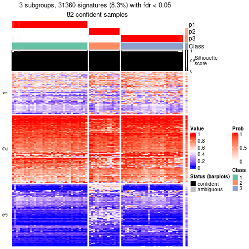</p>

</div>
<div id='tab-node-05-get-signatures-3'>
<pre><code class="r">get_signatures(res, k = 4)
</code></pre>

<p></p>

</div>
<div id='tab-node-05-get-signatures-4'>
<pre><code class="r">get_signatures(res, k = 5)
</code></pre>

<p></p>

</div>
<div id='tab-node-05-get-signatures-5'>
<pre><code class="r">get_signatures(res, k = 6)
</code></pre>

<p></p>

</div>
<div id='tab-node-05-get-signatures-6'>
<pre><code class="r">get_signatures(res, k = 7)
</code></pre>

<p></p>

</div>
<div id='tab-node-05-get-signatures-7'>
<pre><code class="r">get_signatures(res, k = 8)
</code></pre>

<p></p>

</div>
</div>


Compare the overlap of signatures from different k:

```r
compare_signatures(res)
```


`get_signature()` returns a data frame invisibly. To get the list of signatures, the function
call should be assigned to a variable explicitly. In following code, if `plot` argument is set
to `FALSE`, no heatmap is plotted while only the differential analysis is performed.

```r
# code only for demonstration
tb = get_signature(res, k = ..., plot = FALSE)
```

An example of the output of `tb` is:

```
#>   which_row         fdr    mean_1    mean_2 scaled_mean_1 scaled_mean_2 km
#> 1        38 0.042760348  8.373488  9.131774    -0.5533452     0.5164555  1
#> 2        40 0.018707592  7.106213  8.469186    -0.6173731     0.5762149  1
#> 3        55 0.019134737 10.221463 11.207825    -0.6159697     0.5749050  1
#> 4        59 0.006059896  5.921854  7.869574    -0.6899429     0.6439467  1
#> 5        60 0.018055526  8.928898 10.211722    -0.6204761     0.5791110  1
#> 6        98 0.009384629 15.714769 14.887706     0.6635654    -0.6193277  2
...
```

The columns in `tb` are:

1. `which_row`: row indices corresponding to the input matrix.
2. `fdr`: FDR for the differential test. 
3. `mean_x`: The mean value in group x.
4. `scaled_mean_x`: The mean value in group x after rows are scaled.
5. `km`: Row groups if k-means clustering is applied to rows (which is done by automatically selecting number of clusters).

If there are too many signatures, `top_signatures = ...` can be set to only show the 
signatures with the highest FDRs:

```r
# code only for demonstration
# e.g. to show the top 500 most significant rows
tb = get_signature(res, k = ..., top_signatures = 500)
```

If the signatures are defined as these which are uniquely high in current group, `diff_method` argument
can be set to `"uniquely_high_in_one_group"`:

```r
# code only for demonstration
tb = get_signature(res, k = ..., diff_method = "uniquely_high_in_one_group")
```


UMAP plot which shows how samples are separated.


<script>
$( function() {
	$( '#tabs-node-05-dimension-reduction' ).tabs();
} );
</script>
<div id='tabs-node-05-dimension-reduction'>
<ul>
<li><a href='#tab-node-05-dimension-reduction-1'>k = 2</a></li>
<li><a href='#tab-node-05-dimension-reduction-2'>k = 3</a></li>
<li><a href='#tab-node-05-dimension-reduction-3'>k = 4</a></li>
<li><a href='#tab-node-05-dimension-reduction-4'>k = 5</a></li>
<li><a href='#tab-node-05-dimension-reduction-5'>k = 6</a></li>
<li><a href='#tab-node-05-dimension-reduction-6'>k = 7</a></li>
<li><a href='#tab-node-05-dimension-reduction-7'>k = 8</a></li>
</ul>
<div id='tab-node-05-dimension-reduction-1'>
<pre><code class="r">dimension_reduction(res, k = 2, method = &quot;UMAP&quot;)
</code></pre>

<p></p>

</div>
<div id='tab-node-05-dimension-reduction-2'>
<pre><code class="r">dimension_reduction(res, k = 3, method = &quot;UMAP&quot;)
</code></pre>

<p></p>

</div>
<div id='tab-node-05-dimension-reduction-3'>
<pre><code class="r">dimension_reduction(res, k = 4, method = &quot;UMAP&quot;)
</code></pre>

<p></p>

</div>
<div id='tab-node-05-dimension-reduction-4'>
<pre><code class="r">dimension_reduction(res, k = 5, method = &quot;UMAP&quot;)
</code></pre>

<p></p>

</div>
<div id='tab-node-05-dimension-reduction-5'>
<pre><code class="r">dimension_reduction(res, k = 6, method = &quot;UMAP&quot;)
</code></pre>

<p></p>

</div>
<div id='tab-node-05-dimension-reduction-6'>
<pre><code class="r">dimension_reduction(res, k = 7, method = &quot;UMAP&quot;)
</code></pre>

<p></p>

</div>
<div id='tab-node-05-dimension-reduction-7'>
<pre><code class="r">dimension_reduction(res, k = 8, method = &quot;UMAP&quot;)
</code></pre>

<p></p>

</div>
</div>


Following heatmap shows how subgroups are split when increasing `k`:

```r
collect_classes(res)
```


If matrix rows can be associated to genes, consider to use `functional_enrichment(res,
...)` to perform function enrichment for the signature genes. See [this vignette](https://jokergoo.github.io/cola_vignettes/functional_enrichment.html) for more detailed explanations.


 

---------------------------------------------------


### Node051


Parent node: [Node05](#Node05).
Child nodes: 
                Node0121-leaf
        ,
                Node0122-leaf
        ,
                Node0123-leaf
        ,
                Node0124-leaf
        ,
                [Node0131](#Node0131)
        ,
                Node0132-leaf
        ,
                Node0221-leaf
        ,
                Node0222-leaf
        ,
                Node0223-leaf
        ,
                [Node0311](#Node0311)
        ,
                Node0312-leaf
        ,
                Node0313-leaf
        ,
                Node0321-leaf
        ,
                Node0322-leaf
        ,
                Node0431-leaf
        ,
                Node0432-leaf
        ,
                Node0433-leaf
        ,
                Node0511-leaf
        ,
                Node0512-leaf
        ,
                Node0513-leaf
        ,
                Node0521-leaf
        ,
                Node0522-leaf
        ,
                Node0523-leaf
        ,
                Node0531-leaf
        ,
                Node0532-leaf
        ,
                Node0533-leaf
        .


The object with results only for a single top-value method and a single partitioning method 
can be extracted as:

```r
res = res_rh["051"]
```

A summary of `res` and all the functions that can be applied to it:

```r
res
```

```
#> A 'ConsensusPartition' object with k = 2, 3, 4, 5, 6, 7, 8.
#>   On a matrix with 30000 rows and 32 columns.
#>   Top rows (1000) are extracted by 'ATC' method.
#>   Subgroups are detected by 'kmeans' method.
#>   Performed in total 350 partitions by row resampling.
#>   Best k for subgroups seems to be 3.
#> 
#> Following methods can be applied to this 'ConsensusPartition' object:
#>  [1] "cola_report"             "collect_classes"         "collect_plots"          
#>  [4] "collect_stats"           "colnames"                "compare_partitions"     
#>  [7] "compare_signatures"      "consensus_heatmap"       "dimension_reduction"    
#> [10] "functional_enrichment"   "get_anno_col"            "get_anno"               
#> [13] "get_classes"             "get_consensus"           "get_matrix"             
#> [16] "get_membership"          "get_param"               "get_signatures"         
#> [19] "get_stats"               "is_best_k"               "is_stable_k"            
#> [22] "membership_heatmap"      "ncol"                    "nrow"                   
#> [25] "plot_ecdf"               "predict_classes"         "rownames"               
#> [28] "select_partition_number" "show"                    "suggest_best_k"         
#> [31] "test_to_known_factors"   "top_rows_heatmap"
```

`collect_plots()` function collects all the plots made from `res` for all `k` (number of subgroups)
into one single page to provide an easy and fast comparison between different `k`.

```r
collect_plots(res)
```


The plots are:

- The first row: a plot of the eCDF (empirical cumulative distribution
  function) curves of the consensus matrix for each `k` and the heatmap of
  predicted classes for each `k`.
- The second row: heatmaps of the consensus matrix for each `k`.
- The third row: heatmaps of the membership matrix for each `k`.
- The fouth row: heatmaps of the signatures for each `k`.

All the plots in panels can be made by individual functions and they are
plotted later in this section.

`select_partition_number()` produces several plots showing different
statistics for choosing "optimized" `k`. There are following statistics:

- eCDF curves of the consensus matrix for each `k`;
- 1-PAC. [The PAC score](https://en.wikipedia.org/wiki/Consensus_clustering#Over-interpretation_potential_of_consensus_clustering)
  measures the proportion of the ambiguous subgrouping.
- Mean silhouette score.
- Concordance. The mean probability of fiting the consensus subgroup labels in all
  partitions.
- Area increased. Denote $A_k$ as the area under the eCDF curve for current
  `k`, the area increased is defined as $A_k - A_{k-1}$.
- Rand index. The percent of pairs of samples that are both in a same cluster
  or both are not in a same cluster in the partition of k and k-1.
- Jaccard index. The ratio of pairs of samples are both in a same cluster in
  the partition of k and k-1 and the pairs of samples are both in a same
  cluster in the partition k or k-1.

The detailed explanations of these statistics can be found in [the _cola_
vignette](https://jokergoo.github.io/cola_vignettes/cola.html#toc_13).

Generally speaking, higher 1-PAC score, higher mean silhouette score or higher
concordance corresponds to better partition. Rand index and Jaccard index
measure how similar the current partition is compared to partition with `k-1`.
If they are too similar, we won't accept `k` is better than `k-1`.

```r
select_partition_number(res)
```


The numeric values for all these statistics can be obtained by `get_stats()`.

```r
get_stats(res)
```

```
#>   k 1-PAC mean_silhouette concordance area_increased  Rand Jaccard
#> 2 2 0.685           0.805       0.914         0.4623 0.583   0.583
#> 3 3 1.000           1.000       1.000         0.4182 0.698   0.508
#> 4 4 0.752           0.689       0.863         0.1301 0.883   0.672
#> 5 5 0.703           0.691       0.829         0.0725 0.903   0.644
#> 6 6 0.713           0.493       0.686         0.0355 0.909   0.609
#> 7 7 0.789           0.667       0.784         0.0388 0.940   0.688
#> 8 8 0.821           0.646       0.810         0.0208 0.944   0.659
```

`suggest_best_k()` suggests the best $k$ based on these statistics. The rules are as follows:

- All $k$ with Jaccard index larger than 0.95 are removed because increasing
  $k$ does not provide enough extra information. If all $k$ are removed, it is
  marked as no subgroup is detected.
- For all $k$ with 1-PAC score larger than 0.9, the maximal $k$ is taken as
  the best $k$, and other $k$ are marked as optional $k$.
- If it does not fit the second rule. The $k$ with the maximal vote of the
  highest 1-PAC score, highest mean silhouette, and highest concordance is
  taken as the best $k$.

```r
suggest_best_k(res)
```

```
#> [1] 3
```


Following is the table of the partitions (You need to click the **show/hide
code output** link to see it). The membership matrix (columns with name `p*`)
is inferred by
[`clue::cl_consensus()`](https://www.rdocumentation.org/link/cl_consensus?package=clue)
function with the `SE` method. Basically the value in the membership matrix
represents the probability to belong to a certain group. The finall subgroup
label for an item is determined with the group with highest probability it
belongs to.

In `get_classes()` function, the entropy is calculated from the membership
matrix and the silhouette score is calculated from the consensus matrix.


<script>
$( function() {
	$( '#tabs-node-051-get-classes' ).tabs();
} );
</script>
<div id='tabs-node-051-get-classes'>
<ul>
<li><a href='#tab-node-051-get-classes-1'>k = 2</a></li>
<li><a href='#tab-node-051-get-classes-2'>k = 3</a></li>
<li><a href='#tab-node-051-get-classes-3'>k = 4</a></li>
<li><a href='#tab-node-051-get-classes-4'>k = 5</a></li>
<li><a href='#tab-node-051-get-classes-5'>k = 6</a></li>
<li><a href='#tab-node-051-get-classes-6'>k = 7</a></li>
<li><a href='#tab-node-051-get-classes-7'>k = 8</a></li>
</ul>

<div id='tab-node-051-get-classes-1'>
<p><a id='tab-node-051-get-classes-1-a' style='color:#0366d6' href='#'>show/hide code output</a></p>
<pre><code class="r">cbind(get_classes(res, k = 2), get_membership(res, k = 2))
</code></pre>

<pre><code>#&gt;                 class entropy silhouette   p1   p2
#&gt; TCGA.IA.A83W.01     2   0.000      1.000 0.00 1.00
#&gt; TCGA.SX.A7SR.01     1   0.000      0.862 1.00 0.00
#&gt; TCGA.MH.A856.01     2   0.000      1.000 0.00 1.00
#&gt; TCGA.B9.5156.01     1   0.000      0.862 1.00 0.00
#&gt; TCGA.Y8.A897.01     1   0.000      0.862 1.00 0.00
#&gt; TCGA.Y8.A898.01     1   0.000      0.862 1.00 0.00
#&gt; TCGA.Y8.A8RY.01     1   0.000      0.862 1.00 0.00
#&gt; TCGA.SX.A7SN.01     1   0.995      0.342 0.54 0.46
#&gt; TCGA.B1.A657.01     1   0.000      0.862 1.00 0.00
#&gt; TCGA.EV.5903.01     2   0.000      1.000 0.00 1.00
#&gt; TCGA.A4.A6HP.01     1   0.995      0.342 0.54 0.46
#&gt; TCGA.2Z.A9JM.01     2   0.000      1.000 0.00 1.00
#&gt; TCGA.5P.A9KA.01     2   0.000      1.000 0.00 1.00
#&gt; TCGA.A4.A772.01     1   0.000      0.862 1.00 0.00
#&gt; TCGA.2Z.A9JL.01     2   0.000      1.000 0.00 1.00
#&gt; TCGA.2Z.A9JR.01     1   0.000      0.862 1.00 0.00
#&gt; TCGA.GL.A59T.01     1   0.000      0.862 1.00 0.00
#&gt; TCGA.B1.A47M.01     1   0.000      0.862 1.00 0.00
#&gt; TCGA.HE.A5NL.01     1   0.990      0.378 0.56 0.44
#&gt; TCGA.DW.7841.01     1   0.995      0.342 0.54 0.46
#&gt; TCGA.DW.7834.01     1   0.000      0.862 1.00 0.00
#&gt; TCGA.G7.6792.01     2   0.000      1.000 0.00 1.00
#&gt; TCGA.G7.6795.01     1   0.000      0.862 1.00 0.00
#&gt; TCGA.A4.7997.01     2   0.000      1.000 0.00 1.00
#&gt; TCGA.MH.A561.01     1   0.000      0.862 1.00 0.00
#&gt; TCGA.DW.7837.01     1   0.995      0.342 0.54 0.46
#&gt; TCGA.SX.A71U.01     1   0.000      0.862 1.00 0.00
#&gt; TCGA.J7.6720.01     1   0.000      0.862 1.00 0.00
#&gt; TCGA.MH.A562.01     1   0.000      0.862 1.00 0.00
#&gt; TCGA.2Z.A9J1.01     2   0.000      1.000 0.00 1.00
#&gt; TCGA.2Z.A9J6.01     1   0.995      0.342 0.54 0.46
#&gt; TCGA.2Z.A9J5.01     1   0.000      0.862 1.00 0.00
</code></pre>

<script>
$('#tab-node-051-get-classes-1-a').parent().next().next().hide();
$('#tab-node-051-get-classes-1-a').click(function(){
  $('#tab-node-051-get-classes-1-a').parent().next().next().toggle();
  return(false);
});
</script>
</div>

<div id='tab-node-051-get-classes-2'>
<p><a id='tab-node-051-get-classes-2-a' style='color:#0366d6' href='#'>show/hide code output</a></p>
<pre><code class="r">cbind(get_classes(res, k = 3), get_membership(res, k = 3))
</code></pre>

<pre><code>#&gt;                 class entropy silhouette p1 p2 p3
#&gt; TCGA.IA.A83W.01     2       0          1  0  1  0
#&gt; TCGA.SX.A7SR.01     1       0          1  1  0  0
#&gt; TCGA.MH.A856.01     2       0          1  0  1  0
#&gt; TCGA.B9.5156.01     3       0          1  0  0  1
#&gt; TCGA.Y8.A897.01     1       0          1  1  0  0
#&gt; TCGA.Y8.A898.01     1       0          1  1  0  0
#&gt; TCGA.Y8.A8RY.01     1       0          1  1  0  0
#&gt; TCGA.SX.A7SN.01     3       0          1  0  0  1
#&gt; TCGA.B1.A657.01     1       0          1  1  0  0
#&gt; TCGA.EV.5903.01     3       0          1  0  0  1
#&gt; TCGA.A4.A6HP.01     3       0          1  0  0  1
#&gt; TCGA.2Z.A9JM.01     3       0          1  0  0  1
#&gt; TCGA.5P.A9KA.01     2       0          1  0  1  0
#&gt; TCGA.A4.A772.01     1       0          1  1  0  0
#&gt; TCGA.2Z.A9JL.01     2       0          1  0  1  0
#&gt; TCGA.2Z.A9JR.01     1       0          1  1  0  0
#&gt; TCGA.GL.A59T.01     1       0          1  1  0  0
#&gt; TCGA.B1.A47M.01     1       0          1  1  0  0
#&gt; TCGA.HE.A5NL.01     3       0          1  0  0  1
#&gt; TCGA.DW.7841.01     3       0          1  0  0  1
#&gt; TCGA.DW.7834.01     1       0          1  1  0  0
#&gt; TCGA.G7.6792.01     2       0          1  0  1  0
#&gt; TCGA.G7.6795.01     1       0          1  1  0  0
#&gt; TCGA.A4.7997.01     2       0          1  0  1  0
#&gt; TCGA.MH.A561.01     1       0          1  1  0  0
#&gt; TCGA.DW.7837.01     3       0          1  0  0  1
#&gt; TCGA.SX.A71U.01     1       0          1  1  0  0
#&gt; TCGA.J7.6720.01     1       0          1  1  0  0
#&gt; TCGA.MH.A562.01     3       0          1  0  0  1
#&gt; TCGA.2Z.A9J1.01     2       0          1  0  1  0
#&gt; TCGA.2Z.A9J6.01     3       0          1  0  0  1
#&gt; TCGA.2Z.A9J5.01     1       0          1  1  0  0
</code></pre>

<script>
$('#tab-node-051-get-classes-2-a').parent().next().next().hide();
$('#tab-node-051-get-classes-2-a').click(function(){
  $('#tab-node-051-get-classes-2-a').parent().next().next().toggle();
  return(false);
});
</script>
</div>

<div id='tab-node-051-get-classes-3'>
<p><a id='tab-node-051-get-classes-3-a' style='color:#0366d6' href='#'>show/hide code output</a></p>
<pre><code class="r">cbind(get_classes(res, k = 4), get_membership(res, k = 4))
</code></pre>

<pre><code>#&gt;                 class entropy silhouette   p1   p2   p3   p4
#&gt; TCGA.IA.A83W.01     2  0.1637     0.9005 0.00 0.94 0.00 0.06
#&gt; TCGA.SX.A7SR.01     1  0.0000     0.8554 1.00 0.00 0.00 0.00
#&gt; TCGA.MH.A856.01     2  0.0000     0.9219 0.00 1.00 0.00 0.00
#&gt; TCGA.B9.5156.01     4  0.2647     0.4563 0.00 0.00 0.12 0.88
#&gt; TCGA.Y8.A897.01     1  0.1637     0.8282 0.94 0.00 0.00 0.06
#&gt; TCGA.Y8.A898.01     1  0.0000     0.8554 1.00 0.00 0.00 0.00
#&gt; TCGA.Y8.A8RY.01     1  0.4977    -0.0542 0.54 0.00 0.00 0.46
#&gt; TCGA.SX.A7SN.01     3  0.0000     0.8144 0.00 0.00 1.00 0.00
#&gt; TCGA.B1.A657.01     1  0.0707     0.8497 0.98 0.00 0.00 0.02
#&gt; TCGA.EV.5903.01     3  0.0000     0.8144 0.00 0.00 1.00 0.00
#&gt; TCGA.A4.A6HP.01     3  0.1211     0.8191 0.00 0.00 0.96 0.04
#&gt; TCGA.2Z.A9JM.01     3  0.0000     0.8144 0.00 0.00 1.00 0.00
#&gt; TCGA.5P.A9KA.01     2  0.5327     0.6450 0.00 0.72 0.22 0.06
#&gt; TCGA.A4.A772.01     4  0.4713     0.3703 0.36 0.00 0.00 0.64
#&gt; TCGA.2Z.A9JL.01     2  0.1637     0.9222 0.00 0.94 0.00 0.06
#&gt; TCGA.2Z.A9JR.01     4  0.4977     0.1068 0.46 0.00 0.00 0.54
#&gt; TCGA.GL.A59T.01     1  0.0000     0.8554 1.00 0.00 0.00 0.00
#&gt; TCGA.B1.A47M.01     1  0.0000     0.8554 1.00 0.00 0.00 0.00
#&gt; TCGA.HE.A5NL.01     3  0.4948     0.5780 0.00 0.00 0.56 0.44
#&gt; TCGA.DW.7841.01     3  0.3610     0.7929 0.00 0.00 0.80 0.20
#&gt; TCGA.DW.7834.01     1  0.5000    -0.2022 0.50 0.00 0.00 0.50
#&gt; TCGA.G7.6792.01     2  0.0000     0.9219 0.00 1.00 0.00 0.00
#&gt; TCGA.G7.6795.01     1  0.0000     0.8554 1.00 0.00 0.00 0.00
#&gt; TCGA.A4.7997.01     2  0.1637     0.9222 0.00 0.94 0.00 0.06
#&gt; TCGA.MH.A561.01     1  0.0000     0.8554 1.00 0.00 0.00 0.00
#&gt; TCGA.DW.7837.01     3  0.3610     0.7929 0.00 0.00 0.80 0.20
#&gt; TCGA.SX.A71U.01     1  0.2647     0.7709 0.88 0.00 0.00 0.12
#&gt; TCGA.J7.6720.01     1  0.1211     0.8394 0.96 0.00 0.00 0.04
#&gt; TCGA.MH.A562.01     4  0.4713     0.1190 0.00 0.00 0.36 0.64
#&gt; TCGA.2Z.A9J1.01     2  0.1637     0.9222 0.00 0.94 0.00 0.06
#&gt; TCGA.2Z.A9J6.01     3  0.4790     0.6626 0.00 0.00 0.62 0.38
#&gt; TCGA.2Z.A9J5.01     4  0.2647     0.5944 0.12 0.00 0.00 0.88
</code></pre>

<script>
$('#tab-node-051-get-classes-3-a').parent().next().next().hide();
$('#tab-node-051-get-classes-3-a').click(function(){
  $('#tab-node-051-get-classes-3-a').parent().next().next().toggle();
  return(false);
});
</script>
</div>

<div id='tab-node-051-get-classes-4'>
<p><a id='tab-node-051-get-classes-4-a' style='color:#0366d6' href='#'>show/hide code output</a></p>
<pre><code class="r">cbind(get_classes(res, k = 5), get_membership(res, k = 5))
</code></pre>

<pre><code>#&gt;                 class entropy silhouette   p1   p2   p3   p4   p5
#&gt; TCGA.IA.A83W.01     2   0.342     0.8120 0.00 0.84 0.00 0.08 0.08
#&gt; TCGA.SX.A7SR.01     1   0.000     0.8445 1.00 0.00 0.00 0.00 0.00
#&gt; TCGA.MH.A856.01     2   0.000     0.8778 0.00 1.00 0.00 0.00 0.00
#&gt; TCGA.B9.5156.01     5   0.516     0.6028 0.00 0.00 0.06 0.32 0.62
#&gt; TCGA.Y8.A897.01     1   0.273     0.7239 0.84 0.00 0.00 0.16 0.00
#&gt; TCGA.Y8.A898.01     1   0.000     0.8445 1.00 0.00 0.00 0.00 0.00
#&gt; TCGA.Y8.A8RY.01     4   0.453     0.6434 0.26 0.00 0.00 0.70 0.04
#&gt; TCGA.SX.A7SN.01     3   0.000     0.7931 0.00 0.00 1.00 0.00 0.00
#&gt; TCGA.B1.A657.01     1   0.141     0.8132 0.94 0.00 0.00 0.06 0.00
#&gt; TCGA.EV.5903.01     3   0.104     0.7905 0.00 0.00 0.96 0.00 0.04
#&gt; TCGA.A4.A6HP.01     3   0.273     0.7775 0.00 0.00 0.84 0.00 0.16
#&gt; TCGA.2Z.A9JM.01     3   0.104     0.7905 0.00 0.00 0.96 0.00 0.04
#&gt; TCGA.5P.A9KA.01     2   0.667     0.5976 0.00 0.62 0.12 0.10 0.16
#&gt; TCGA.A4.A772.01     4   0.521     0.5241 0.12 0.00 0.00 0.68 0.20
#&gt; TCGA.2Z.A9JL.01     2   0.244     0.8740 0.00 0.90 0.00 0.04 0.06
#&gt; TCGA.2Z.A9JR.01     4   0.351     0.7251 0.18 0.00 0.00 0.80 0.02
#&gt; TCGA.GL.A59T.01     1   0.000     0.8445 1.00 0.00 0.00 0.00 0.00
#&gt; TCGA.B1.A47M.01     1   0.000     0.8445 1.00 0.00 0.00 0.00 0.00
#&gt; TCGA.HE.A5NL.01     5   0.395     0.6398 0.00 0.00 0.12 0.08 0.80
#&gt; TCGA.DW.7841.01     3   0.436     0.6785 0.00 0.00 0.68 0.02 0.30
#&gt; TCGA.DW.7834.01     4   0.311     0.7263 0.20 0.00 0.00 0.80 0.00
#&gt; TCGA.G7.6792.01     2   0.000     0.8778 0.00 1.00 0.00 0.00 0.00
#&gt; TCGA.G7.6795.01     1   0.000     0.8445 1.00 0.00 0.00 0.00 0.00
#&gt; TCGA.A4.7997.01     2   0.275     0.8705 0.00 0.88 0.00 0.08 0.04
#&gt; TCGA.MH.A561.01     1   0.165     0.8107 0.94 0.00 0.00 0.02 0.04
#&gt; TCGA.DW.7837.01     3   0.436     0.6785 0.00 0.00 0.68 0.02 0.30
#&gt; TCGA.SX.A71U.01     1   0.406     0.3676 0.64 0.00 0.00 0.36 0.00
#&gt; TCGA.J7.6720.01     1   0.516    -0.0956 0.52 0.00 0.00 0.44 0.04
#&gt; TCGA.MH.A562.01     4   0.589     0.1669 0.00 0.00 0.22 0.60 0.18
#&gt; TCGA.2Z.A9J1.01     2   0.244     0.8740 0.00 0.90 0.00 0.04 0.06
#&gt; TCGA.2Z.A9J6.01     5   0.293     0.5283 0.00 0.00 0.18 0.00 0.82
#&gt; TCGA.2Z.A9J5.01     5   0.530     0.4141 0.06 0.00 0.00 0.36 0.58
</code></pre>

<script>
$('#tab-node-051-get-classes-4-a').parent().next().next().hide();
$('#tab-node-051-get-classes-4-a').click(function(){
  $('#tab-node-051-get-classes-4-a').parent().next().next().toggle();
  return(false);
});
</script>
</div>

<div id='tab-node-051-get-classes-5'>
<p><a id='tab-node-051-get-classes-5-a' style='color:#0366d6' href='#'>show/hide code output</a></p>
<pre><code class="r">cbind(get_classes(res, k = 6), get_membership(res, k = 6))
</code></pre>

<pre><code>#&gt;                 class entropy silhouette   p1   p2   p3   p4   p5   p6
#&gt; TCGA.IA.A83W.01     2  0.3756    -0.0625 0.00 0.60 0.00 0.00 0.00 0.40
#&gt; TCGA.SX.A7SR.01     1  0.0000     0.8109 1.00 0.00 0.00 0.00 0.00 0.00
#&gt; TCGA.MH.A856.01     2  0.3315     0.5729 0.00 0.78 0.00 0.02 0.00 0.20
#&gt; TCGA.B9.5156.01     5  0.5922     0.3778 0.00 0.00 0.00 0.34 0.44 0.22
#&gt; TCGA.Y8.A897.01     1  0.4195     0.5266 0.74 0.00 0.00 0.20 0.02 0.04
#&gt; TCGA.Y8.A898.01     1  0.0000     0.8109 1.00 0.00 0.00 0.00 0.00 0.00
#&gt; TCGA.Y8.A8RY.01     4  0.5029     0.6920 0.26 0.00 0.00 0.62 0.00 0.12
#&gt; TCGA.SX.A7SN.01     3  0.0000     0.7897 0.00 0.00 1.00 0.00 0.00 0.00
#&gt; TCGA.B1.A657.01     1  0.1092     0.7937 0.96 0.00 0.00 0.02 0.00 0.02
#&gt; TCGA.EV.5903.01     3  0.0000     0.7897 0.00 0.00 1.00 0.00 0.00 0.00
#&gt; TCGA.A4.A6HP.01     3  0.3864     0.2221 0.00 0.00 0.52 0.00 0.48 0.00
#&gt; TCGA.2Z.A9JM.01     3  0.0937     0.7761 0.00 0.00 0.96 0.00 0.00 0.04
#&gt; TCGA.5P.A9KA.01     6  0.6323     0.0000 0.00 0.38 0.04 0.00 0.14 0.44
#&gt; TCGA.A4.A772.01     4  0.5854     0.4397 0.12 0.00 0.00 0.64 0.12 0.12
#&gt; TCGA.2Z.A9JL.01     2  0.0547     0.6789 0.00 0.98 0.00 0.02 0.00 0.00
#&gt; TCGA.2Z.A9JR.01     4  0.2941     0.7590 0.22 0.00 0.00 0.78 0.00 0.00
#&gt; TCGA.GL.A59T.01     1  0.0000     0.8109 1.00 0.00 0.00 0.00 0.00 0.00
#&gt; TCGA.B1.A47M.01     1  0.1865     0.7655 0.92 0.00 0.00 0.04 0.00 0.04
#&gt; TCGA.HE.A5NL.01     5  0.4890     0.4257 0.00 0.00 0.00 0.18 0.66 0.16
#&gt; TCGA.DW.7841.01     5  0.3797    -0.3194 0.00 0.00 0.42 0.00 0.58 0.00
#&gt; TCGA.DW.7834.01     4  0.2941     0.7590 0.22 0.00 0.00 0.78 0.00 0.00
#&gt; TCGA.G7.6792.01     2  0.3315     0.5729 0.00 0.78 0.00 0.02 0.00 0.20
#&gt; TCGA.G7.6795.01     1  0.0000     0.8109 1.00 0.00 0.00 0.00 0.00 0.00
#&gt; TCGA.A4.7997.01     2  0.0000     0.6802 0.00 1.00 0.00 0.00 0.00 0.00
#&gt; TCGA.MH.A561.01     1  0.4798     0.4266 0.62 0.00 0.00 0.08 0.00 0.30
#&gt; TCGA.DW.7837.01     5  0.3797    -0.3194 0.00 0.00 0.42 0.00 0.58 0.00
#&gt; TCGA.SX.A71U.01     1  0.4420     0.1900 0.62 0.00 0.00 0.34 0.00 0.04
#&gt; TCGA.J7.6720.01     4  0.5324     0.5767 0.34 0.00 0.00 0.54 0.00 0.12
#&gt; TCGA.MH.A562.01     5  0.5447     0.0257 0.00 0.00 0.12 0.42 0.46 0.00
#&gt; TCGA.2Z.A9J1.01     2  0.0547     0.6789 0.00 0.98 0.00 0.02 0.00 0.00
#&gt; TCGA.2Z.A9J6.01     5  0.5184     0.4008 0.00 0.00 0.02 0.12 0.66 0.20
#&gt; TCGA.2Z.A9J5.01     5  0.5957     0.3257 0.00 0.00 0.00 0.38 0.40 0.22
</code></pre>

<script>
$('#tab-node-051-get-classes-5-a').parent().next().next().hide();
$('#tab-node-051-get-classes-5-a').click(function(){
  $('#tab-node-051-get-classes-5-a').parent().next().next().toggle();
  return(false);
});
</script>
</div>

<div id='tab-node-051-get-classes-6'>
<p><a id='tab-node-051-get-classes-6-a' style='color:#0366d6' href='#'>show/hide code output</a></p>
<pre><code class="r">cbind(get_classes(res, k = 7), get_membership(res, k = 7))
</code></pre>

<pre><code>#&gt;                 class entropy silhouette   p1   p2   p3   p4   p5   p6   p7
#&gt; TCGA.IA.A83W.01     6  0.3459     0.4391 0.00 0.40 0.00 0.00 0.00 0.60 0.00
#&gt; TCGA.SX.A7SR.01     1  0.0000     0.7719 1.00 0.00 0.00 0.00 0.00 0.00 0.00
#&gt; TCGA.MH.A856.01     2  0.3526     0.6621 0.00 0.76 0.06 0.00 0.00 0.18 0.00
#&gt; TCGA.B9.5156.01     5  0.2163     0.7442 0.00 0.00 0.00 0.10 0.88 0.00 0.02
#&gt; TCGA.Y8.A897.01     1  0.6429     0.4202 0.54 0.00 0.08 0.22 0.04 0.12 0.00
#&gt; TCGA.Y8.A898.01     1  0.0000     0.7719 1.00 0.00 0.00 0.00 0.00 0.00 0.00
#&gt; TCGA.Y8.A8RY.01     4  0.1363     0.6969 0.04 0.00 0.02 0.94 0.00 0.00 0.00
#&gt; TCGA.SX.A7SN.01     3  0.4710     0.8285 0.00 0.00 0.48 0.00 0.04 0.02 0.46
#&gt; TCGA.B1.A657.01     1  0.2769     0.7362 0.86 0.00 0.04 0.00 0.02 0.08 0.00
#&gt; TCGA.EV.5903.01     3  0.3496     0.8883 0.00 0.00 0.58 0.00 0.00 0.00 0.42
#&gt; TCGA.A4.A6HP.01     7  0.1363     0.7762 0.00 0.00 0.04 0.00 0.00 0.02 0.94
#&gt; TCGA.2Z.A9JM.01     3  0.3546     0.8729 0.00 0.00 0.54 0.00 0.00 0.00 0.46
#&gt; TCGA.5P.A9KA.01     6  0.5162     0.6005 0.00 0.16 0.06 0.00 0.02 0.68 0.08
#&gt; TCGA.A4.A772.01     4  0.5516     0.3238 0.00 0.00 0.04 0.50 0.36 0.10 0.00
#&gt; TCGA.2Z.A9JL.01     2  0.0000     0.7911 0.00 1.00 0.00 0.00 0.00 0.00 0.00
#&gt; TCGA.2Z.A9JR.01     4  0.2376     0.7077 0.02 0.00 0.00 0.86 0.12 0.00 0.00
#&gt; TCGA.GL.A59T.01     1  0.1363     0.7662 0.94 0.00 0.02 0.00 0.00 0.04 0.00
#&gt; TCGA.B1.A47M.01     1  0.1664     0.7526 0.92 0.00 0.00 0.06 0.00 0.02 0.00
#&gt; TCGA.HE.A5NL.01     5  0.4242     0.7400 0.00 0.00 0.02 0.00 0.72 0.08 0.18
#&gt; TCGA.DW.7841.01     7  0.0863     0.9008 0.00 0.00 0.00 0.00 0.04 0.00 0.96
#&gt; TCGA.DW.7834.01     4  0.2376     0.7077 0.02 0.00 0.00 0.86 0.12 0.00 0.00
#&gt; TCGA.G7.6792.01     2  0.3526     0.6621 0.00 0.76 0.06 0.00 0.00 0.18 0.00
#&gt; TCGA.G7.6795.01     1  0.0000     0.7719 1.00 0.00 0.00 0.00 0.00 0.00 0.00
#&gt; TCGA.A4.7997.01     2  0.1860     0.7551 0.00 0.92 0.04 0.02 0.02 0.00 0.00
#&gt; TCGA.MH.A561.01     1  0.6871     0.2920 0.46 0.00 0.22 0.14 0.02 0.16 0.00
#&gt; TCGA.DW.7837.01     7  0.0863     0.9008 0.00 0.00 0.00 0.00 0.04 0.00 0.96
#&gt; TCGA.SX.A71U.01     1  0.6263     0.0892 0.42 0.00 0.04 0.40 0.04 0.10 0.00
#&gt; TCGA.J7.6720.01     4  0.2163     0.6575 0.10 0.00 0.02 0.88 0.00 0.00 0.00
#&gt; TCGA.MH.A562.01     4  0.4710     0.0976 0.00 0.00 0.00 0.48 0.04 0.02 0.46
#&gt; TCGA.2Z.A9J1.01     2  0.0000     0.7911 0.00 1.00 0.00 0.00 0.00 0.00 0.00
#&gt; TCGA.2Z.A9J6.01     5  0.4500     0.6973 0.00 0.00 0.02 0.00 0.68 0.08 0.22
#&gt; TCGA.2Z.A9J5.01     5  0.1671     0.7311 0.00 0.00 0.00 0.10 0.90 0.00 0.00
</code></pre>

<script>
$('#tab-node-051-get-classes-6-a').parent().next().next().hide();
$('#tab-node-051-get-classes-6-a').click(function(){
  $('#tab-node-051-get-classes-6-a').parent().next().next().toggle();
  return(false);
});
</script>
</div>

<div id='tab-node-051-get-classes-7'>
<p><a id='tab-node-051-get-classes-7-a' style='color:#0366d6' href='#'>show/hide code output</a></p>
<pre><code class="r">cbind(get_classes(res, k = 8), get_membership(res, k = 8))
</code></pre>

<pre><code>#&gt;                 class entropy silhouette   p1   p2   p3   p4   p5   p6   p7   p8
#&gt; TCGA.IA.A83W.01     6  0.3015      0.580 0.00 0.32 0.00 0.00 0.00 0.68 0.00 0.00
#&gt; TCGA.SX.A7SR.01     1  0.0471      0.704 0.98 0.00 0.00 0.00 0.00 0.00 0.00 0.02
#&gt; TCGA.MH.A856.01     2  0.4280      0.462 0.00 0.68 0.00 0.02 0.00 0.24 0.04 0.02
#&gt; TCGA.B9.5156.01     5  0.1275      0.794 0.00 0.00 0.00 0.04 0.94 0.00 0.02 0.00
#&gt; TCGA.Y8.A897.01     1  0.7521     -0.130 0.36 0.00 0.12 0.28 0.04 0.12 0.00 0.08
#&gt; TCGA.Y8.A898.01     1  0.0000      0.709 1.00 0.00 0.00 0.00 0.00 0.00 0.00 0.00
#&gt; TCGA.Y8.A8RY.01     4  0.2071      0.750 0.04 0.00 0.04 0.90 0.00 0.00 0.00 0.02
#&gt; TCGA.SX.A7SN.01     3  0.2852      0.930 0.00 0.00 0.72 0.00 0.00 0.00 0.28 0.00
#&gt; TCGA.B1.A657.01     1  0.2025      0.638 0.88 0.00 0.00 0.00 0.02 0.00 0.00 0.10
#&gt; TCGA.EV.5903.01     3  0.2650      0.952 0.00 0.00 0.76 0.00 0.00 0.00 0.24 0.00
#&gt; TCGA.A4.A6HP.01     7  0.1804      0.703 0.00 0.00 0.08 0.00 0.00 0.00 0.90 0.02
#&gt; TCGA.2Z.A9JM.01     3  0.3404      0.944 0.00 0.00 0.72 0.00 0.00 0.00 0.24 0.04
#&gt; TCGA.5P.A9KA.01     6  0.3178      0.668 0.00 0.14 0.04 0.00 0.00 0.80 0.02 0.00
#&gt; TCGA.A4.A772.01     4  0.5564      0.468 0.00 0.00 0.10 0.52 0.28 0.00 0.00 0.10
#&gt; TCGA.2Z.A9JL.01     2  0.1887      0.637 0.00 0.90 0.04 0.00 0.00 0.00 0.00 0.06
#&gt; TCGA.2Z.A9JR.01     4  0.0941      0.764 0.02 0.00 0.00 0.96 0.02 0.00 0.00 0.00
#&gt; TCGA.GL.A59T.01     1  0.1091      0.693 0.94 0.00 0.00 0.00 0.00 0.00 0.00 0.06
#&gt; TCGA.B1.A47M.01     1  0.2204      0.623 0.90 0.00 0.02 0.04 0.00 0.02 0.00 0.02
#&gt; TCGA.HE.A5NL.01     5  0.4186      0.802 0.00 0.00 0.02 0.00 0.72 0.18 0.06 0.02
#&gt; TCGA.DW.7841.01     7  0.0808      0.775 0.00 0.00 0.00 0.00 0.04 0.00 0.96 0.00
#&gt; TCGA.DW.7834.01     4  0.0941      0.764 0.02 0.00 0.00 0.96 0.02 0.00 0.00 0.00
#&gt; TCGA.G7.6792.01     2  0.4280      0.462 0.00 0.68 0.00 0.02 0.00 0.24 0.04 0.02
#&gt; TCGA.G7.6795.01     1  0.0471      0.704 0.98 0.00 0.00 0.00 0.00 0.00 0.00 0.02
#&gt; TCGA.A4.7997.01     2  0.2114      0.591 0.00 0.84 0.00 0.00 0.00 0.00 0.00 0.16
#&gt; TCGA.MH.A561.01     8  0.3658      0.000 0.40 0.00 0.00 0.02 0.00 0.00 0.00 0.58
#&gt; TCGA.DW.7837.01     7  0.0808      0.775 0.00 0.00 0.00 0.00 0.04 0.00 0.96 0.00
#&gt; TCGA.SX.A71U.01     4  0.5909      0.437 0.22 0.00 0.12 0.54 0.02 0.00 0.00 0.10
#&gt; TCGA.J7.6720.01     4  0.2348      0.737 0.06 0.00 0.04 0.88 0.00 0.00 0.00 0.02
#&gt; TCGA.MH.A562.01     7  0.3449      0.507 0.00 0.00 0.00 0.32 0.00 0.00 0.66 0.02
#&gt; TCGA.2Z.A9J1.01     2  0.1887      0.637 0.00 0.90 0.04 0.00 0.00 0.00 0.00 0.06
#&gt; TCGA.2Z.A9J6.01     5  0.4186      0.802 0.00 0.00 0.02 0.00 0.72 0.18 0.06 0.02
#&gt; TCGA.2Z.A9J5.01     5  0.0471      0.786 0.00 0.00 0.00 0.02 0.98 0.00 0.00 0.00
</code></pre>

<script>
$('#tab-node-051-get-classes-7-a').parent().next().next().hide();
$('#tab-node-051-get-classes-7-a').click(function(){
  $('#tab-node-051-get-classes-7-a').parent().next().next().toggle();
  return(false);
});
</script>
</div>
</div>

Heatmaps for the consensus matrix. It visualizes the probability of two
samples to be in a same group.


<script>
$( function() {
	$( '#tabs-node-051-consensus-heatmap' ).tabs();
} );
</script>
<div id='tabs-node-051-consensus-heatmap'>
<ul>
<li><a href='#tab-node-051-consensus-heatmap-1'>k = 2</a></li>
<li><a href='#tab-node-051-consensus-heatmap-2'>k = 3</a></li>
<li><a href='#tab-node-051-consensus-heatmap-3'>k = 4</a></li>
<li><a href='#tab-node-051-consensus-heatmap-4'>k = 5</a></li>
<li><a href='#tab-node-051-consensus-heatmap-5'>k = 6</a></li>
<li><a href='#tab-node-051-consensus-heatmap-6'>k = 7</a></li>
<li><a href='#tab-node-051-consensus-heatmap-7'>k = 8</a></li>
</ul>
<div id='tab-node-051-consensus-heatmap-1'>
<pre><code class="r">consensus_heatmap(res, k = 2)
</code></pre>

<p></p>

</div>
<div id='tab-node-051-consensus-heatmap-2'>
<pre><code class="r">consensus_heatmap(res, k = 3)
</code></pre>

<p></p>

</div>
<div id='tab-node-051-consensus-heatmap-3'>
<pre><code class="r">consensus_heatmap(res, k = 4)
</code></pre>

<p></p>

</div>
<div id='tab-node-051-consensus-heatmap-4'>
<pre><code class="r">consensus_heatmap(res, k = 5)
</code></pre>

<p></p>

</div>
<div id='tab-node-051-consensus-heatmap-5'>
<pre><code class="r">consensus_heatmap(res, k = 6)
</code></pre>

<p></p>

</div>
<div id='tab-node-051-consensus-heatmap-6'>
<pre><code class="r">consensus_heatmap(res, k = 7)
</code></pre>

<p></p>

</div>
<div id='tab-node-051-consensus-heatmap-7'>
<pre><code class="r">consensus_heatmap(res, k = 8)
</code></pre>

<p></p>

</div>
</div>

Heatmaps for the membership of samples in all partitions to see how consistent they are:


<script>
$( function() {
	$( '#tabs-node-051-membership-heatmap' ).tabs();
} );
</script>
<div id='tabs-node-051-membership-heatmap'>
<ul>
<li><a href='#tab-node-051-membership-heatmap-1'>k = 2</a></li>
<li><a href='#tab-node-051-membership-heatmap-2'>k = 3</a></li>
<li><a href='#tab-node-051-membership-heatmap-3'>k = 4</a></li>
<li><a href='#tab-node-051-membership-heatmap-4'>k = 5</a></li>
<li><a href='#tab-node-051-membership-heatmap-5'>k = 6</a></li>
<li><a href='#tab-node-051-membership-heatmap-6'>k = 7</a></li>
<li><a href='#tab-node-051-membership-heatmap-7'>k = 8</a></li>
</ul>
<div id='tab-node-051-membership-heatmap-1'>
<pre><code class="r">membership_heatmap(res, k = 2)
</code></pre>

<p></p>

</div>
<div id='tab-node-051-membership-heatmap-2'>
<pre><code class="r">membership_heatmap(res, k = 3)
</code></pre>

<p></p>

</div>
<div id='tab-node-051-membership-heatmap-3'>
<pre><code class="r">membership_heatmap(res, k = 4)
</code></pre>

<p></p>

</div>
<div id='tab-node-051-membership-heatmap-4'>
<pre><code class="r">membership_heatmap(res, k = 5)
</code></pre>

<p>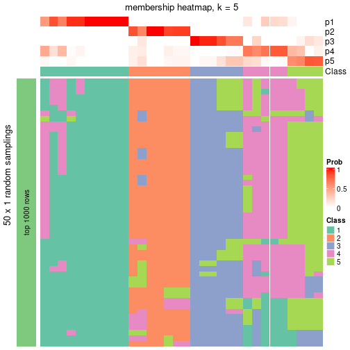</p>

</div>
<div id='tab-node-051-membership-heatmap-5'>
<pre><code class="r">membership_heatmap(res, k = 6)
</code></pre>

<p></p>

</div>
<div id='tab-node-051-membership-heatmap-6'>
<pre><code class="r">membership_heatmap(res, k = 7)
</code></pre>

<p></p>

</div>
<div id='tab-node-051-membership-heatmap-7'>
<pre><code class="r">membership_heatmap(res, k = 8)
</code></pre>

<p></p>

</div>
</div>

As soon as the classes for columns are determined, the signatures
that are significantly different between subgroups can be looked for. 
Following are the heatmaps for signatures.


<script>
$( function() {
	$( '#tabs-node-051-get-signatures' ).tabs();
} );
</script>
<div id='tabs-node-051-get-signatures'>
<ul>
<li><a href='#tab-node-051-get-signatures-1'>k = 2</a></li>
<li><a href='#tab-node-051-get-signatures-2'>k = 3</a></li>
<li><a href='#tab-node-051-get-signatures-3'>k = 4</a></li>
<li><a href='#tab-node-051-get-signatures-4'>k = 5</a></li>
<li><a href='#tab-node-051-get-signatures-5'>k = 6</a></li>
<li><a href='#tab-node-051-get-signatures-6'>k = 7</a></li>
<li><a href='#tab-node-051-get-signatures-7'>k = 8</a></li>
</ul>
<div id='tab-node-051-get-signatures-1'>
<pre><code class="r">get_signatures(res, k = 2)
</code></pre>

<p></p>

</div>
<div id='tab-node-051-get-signatures-2'>
<pre><code class="r">get_signatures(res, k = 3)
</code></pre>

<p></p>

</div>
<div id='tab-node-051-get-signatures-3'>
<pre><code class="r">get_signatures(res, k = 4)
</code></pre>

<p></p>

</div>
<div id='tab-node-051-get-signatures-4'>
<pre><code class="r">get_signatures(res, k = 5)
</code></pre>

<p></p>

</div>
<div id='tab-node-051-get-signatures-5'>
<pre><code class="r">get_signatures(res, k = 6)
</code></pre>

<p></p>

</div>
<div id='tab-node-051-get-signatures-6'>
<pre><code class="r">get_signatures(res, k = 7)
</code></pre>

<p></p>

</div>
<div id='tab-node-051-get-signatures-7'>
<pre><code class="r">get_signatures(res, k = 8)
</code></pre>

<p></p>

</div>
</div>


Compare the overlap of signatures from different k:

```r
compare_signatures(res)
```

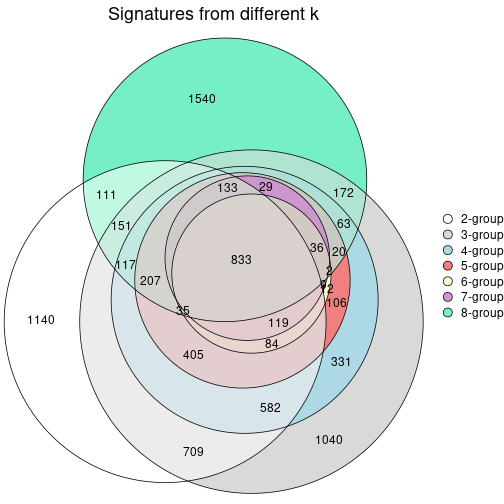

`get_signature()` returns a data frame invisibly. To get the list of signatures, the function
call should be assigned to a variable explicitly. In following code, if `plot` argument is set
to `FALSE`, no heatmap is plotted while only the differential analysis is performed.

```r
# code only for demonstration
tb = get_signature(res, k = ..., plot = FALSE)
```

An example of the output of `tb` is:

```
#>   which_row         fdr    mean_1    mean_2 scaled_mean_1 scaled_mean_2 km
#> 1        38 0.042760348  8.373488  9.131774    -0.5533452     0.5164555  1
#> 2        40 0.018707592  7.106213  8.469186    -0.6173731     0.5762149  1
#> 3        55 0.019134737 10.221463 11.207825    -0.6159697     0.5749050  1
#> 4        59 0.006059896  5.921854  7.869574    -0.6899429     0.6439467  1
#> 5        60 0.018055526  8.928898 10.211722    -0.6204761     0.5791110  1
#> 6        98 0.009384629 15.714769 14.887706     0.6635654    -0.6193277  2
...
```

The columns in `tb` are:

1. `which_row`: row indices corresponding to the input matrix.
2. `fdr`: FDR for the differential test. 
3. `mean_x`: The mean value in group x.
4. `scaled_mean_x`: The mean value in group x after rows are scaled.
5. `km`: Row groups if k-means clustering is applied to rows (which is done by automatically selecting number of clusters).

If there are too many signatures, `top_signatures = ...` can be set to only show the 
signatures with the highest FDRs:

```r
# code only for demonstration
# e.g. to show the top 500 most significant rows
tb = get_signature(res, k = ..., top_signatures = 500)
```

If the signatures are defined as these which are uniquely high in current group, `diff_method` argument
can be set to `"uniquely_high_in_one_group"`:

```r
# code only for demonstration
tb = get_signature(res, k = ..., diff_method = "uniquely_high_in_one_group")
```


UMAP plot which shows how samples are separated.


<script>
$( function() {
	$( '#tabs-node-051-dimension-reduction' ).tabs();
} );
</script>
<div id='tabs-node-051-dimension-reduction'>
<ul>
<li><a href='#tab-node-051-dimension-reduction-1'>k = 2</a></li>
<li><a href='#tab-node-051-dimension-reduction-2'>k = 3</a></li>
<li><a href='#tab-node-051-dimension-reduction-3'>k = 4</a></li>
<li><a href='#tab-node-051-dimension-reduction-4'>k = 5</a></li>
<li><a href='#tab-node-051-dimension-reduction-5'>k = 6</a></li>
<li><a href='#tab-node-051-dimension-reduction-6'>k = 7</a></li>
<li><a href='#tab-node-051-dimension-reduction-7'>k = 8</a></li>
</ul>
<div id='tab-node-051-dimension-reduction-1'>
<pre><code class="r">dimension_reduction(res, k = 2, method = &quot;UMAP&quot;)
</code></pre>

<p></p>

</div>
<div id='tab-node-051-dimension-reduction-2'>
<pre><code class="r">dimension_reduction(res, k = 3, method = &quot;UMAP&quot;)
</code></pre>

<p></p>

</div>
<div id='tab-node-051-dimension-reduction-3'>
<pre><code class="r">dimension_reduction(res, k = 4, method = &quot;UMAP&quot;)
</code></pre>

<p></p>

</div>
<div id='tab-node-051-dimension-reduction-4'>
<pre><code class="r">dimension_reduction(res, k = 5, method = &quot;UMAP&quot;)
</code></pre>

<p></p>

</div>
<div id='tab-node-051-dimension-reduction-5'>
<pre><code class="r">dimension_reduction(res, k = 6, method = &quot;UMAP&quot;)
</code></pre>

<p></p>

</div>
<div id='tab-node-051-dimension-reduction-6'>
<pre><code class="r">dimension_reduction(res, k = 7, method = &quot;UMAP&quot;)
</code></pre>

<p></p>

</div>
<div id='tab-node-051-dimension-reduction-7'>
<pre><code class="r">dimension_reduction(res, k = 8, method = &quot;UMAP&quot;)
</code></pre>

<p></p>

</div>
</div>


Following heatmap shows how subgroups are split when increasing `k`:

```r
collect_classes(res)
```


If matrix rows can be associated to genes, consider to use `functional_enrichment(res,
...)` to perform function enrichment for the signature genes. See [this vignette](https://jokergoo.github.io/cola_vignettes/functional_enrichment.html) for more detailed explanations.


 

---------------------------------------------------


### Node052


Parent node: [Node05](#Node05).
Child nodes: 
                Node0121-leaf
        ,
                Node0122-leaf
        ,
                Node0123-leaf
        ,
                Node0124-leaf
        ,
                [Node0131](#Node0131)
        ,
                Node0132-leaf
        ,
                Node0221-leaf
        ,
                Node0222-leaf
        ,
                Node0223-leaf
        ,
                [Node0311](#Node0311)
        ,
                Node0312-leaf
        ,
                Node0313-leaf
        ,
                Node0321-leaf
        ,
                Node0322-leaf
        ,
                Node0431-leaf
        ,
                Node0432-leaf
        ,
                Node0433-leaf
        ,
                Node0511-leaf
        ,
                Node0512-leaf
        ,
                Node0513-leaf
        ,
                Node0521-leaf
        ,
                Node0522-leaf
        ,
                Node0523-leaf
        ,
                Node0531-leaf
        ,
                Node0532-leaf
        ,
                Node0533-leaf
        .


The object with results only for a single top-value method and a single partitioning method 
can be extracted as:

```r
res = res_rh["052"]
```

A summary of `res` and all the functions that can be applied to it:

```r
res
```

```
#> A 'ConsensusPartition' object with k = 2, 3, 4, 5, 6, 7, 8.
#>   On a matrix with 30000 rows and 13 columns.
#>   Top rows (1000) are extracted by 'ATC' method.
#>   Subgroups are detected by 'skmeans' method.
#>   Performed in total 350 partitions by row resampling.
#>   Best k for subgroups seems to be 4.
#> 
#> Following methods can be applied to this 'ConsensusPartition' object:
#>  [1] "cola_report"             "collect_classes"         "collect_plots"          
#>  [4] "collect_stats"           "colnames"                "compare_partitions"     
#>  [7] "compare_signatures"      "consensus_heatmap"       "dimension_reduction"    
#> [10] "functional_enrichment"   "get_anno_col"            "get_anno"               
#> [13] "get_classes"             "get_consensus"           "get_matrix"             
#> [16] "get_membership"          "get_param"               "get_signatures"         
#> [19] "get_stats"               "is_best_k"               "is_stable_k"            
#> [22] "membership_heatmap"      "ncol"                    "nrow"                   
#> [25] "plot_ecdf"               "predict_classes"         "rownames"               
#> [28] "select_partition_number" "show"                    "suggest_best_k"         
#> [31] "test_to_known_factors"   "top_rows_heatmap"
```

`collect_plots()` function collects all the plots made from `res` for all `k` (number of subgroups)
into one single page to provide an easy and fast comparison between different `k`.

```r
collect_plots(res)
```


The plots are:

- The first row: a plot of the eCDF (empirical cumulative distribution
  function) curves of the consensus matrix for each `k` and the heatmap of
  predicted classes for each `k`.
- The second row: heatmaps of the consensus matrix for each `k`.
- The third row: heatmaps of the membership matrix for each `k`.
- The fouth row: heatmaps of the signatures for each `k`.

All the plots in panels can be made by individual functions and they are
plotted later in this section.

`select_partition_number()` produces several plots showing different
statistics for choosing "optimized" `k`. There are following statistics:

- eCDF curves of the consensus matrix for each `k`;
- 1-PAC. [The PAC score](https://en.wikipedia.org/wiki/Consensus_clustering#Over-interpretation_potential_of_consensus_clustering)
  measures the proportion of the ambiguous subgrouping.
- Mean silhouette score.
- Concordance. The mean probability of fiting the consensus subgroup labels in all
  partitions.
- Area increased. Denote $A_k$ as the area under the eCDF curve for current
  `k`, the area increased is defined as $A_k - A_{k-1}$.
- Rand index. The percent of pairs of samples that are both in a same cluster
  or both are not in a same cluster in the partition of k and k-1.
- Jaccard index. The ratio of pairs of samples are both in a same cluster in
  the partition of k and k-1 and the pairs of samples are both in a same
  cluster in the partition k or k-1.

The detailed explanations of these statistics can be found in [the _cola_
vignette](https://jokergoo.github.io/cola_vignettes/cola.html#toc_13).

Generally speaking, higher 1-PAC score, higher mean silhouette score or higher
concordance corresponds to better partition. Rand index and Jaccard index
measure how similar the current partition is compared to partition with `k-1`.
If they are too similar, we won't accept `k` is better than `k-1`.

```r
select_partition_number(res)
```


The numeric values for all these statistics can be obtained by `get_stats()`.

```r
get_stats(res)
```

```
#>   k 1-PAC mean_silhouette concordance area_increased  Rand Jaccard
#> 2 2 1.000           1.000       1.000         0.5133 0.487   0.487
#> 3 3 1.000           0.997       0.998         0.1488 0.923   0.842
#> 4 4 1.000           0.911       0.991         0.1562 0.910   0.781
#> 5 5 0.833           0.690       0.920         0.0627 0.987   0.960
#> 6 6 0.808           0.663       0.862         0.0974 0.846   0.500
#> 7 7 0.846           0.649       0.965         0.0861 0.974   0.833
#> 8 8 0.897           0.497       0.922         0.0493 0.962   0.700
```

`suggest_best_k()` suggests the best $k$ based on these statistics. The rules are as follows:

- All $k$ with Jaccard index larger than 0.95 are removed because increasing
  $k$ does not provide enough extra information. If all $k$ are removed, it is
  marked as no subgroup is detected.
- For all $k$ with 1-PAC score larger than 0.9, the maximal $k$ is taken as
  the best $k$, and other $k$ are marked as optional $k$.
- If it does not fit the second rule. The $k$ with the maximal vote of the
  highest 1-PAC score, highest mean silhouette, and highest concordance is
  taken as the best $k$.

```r
suggest_best_k(res)
```

```
#> [1] 4
#> attr(,"optional")
#> [1] 2
```

There is also optional best $k$ = 2 that is worth to check.

Following is the table of the partitions (You need to click the **show/hide
code output** link to see it). The membership matrix (columns with name `p*`)
is inferred by
[`clue::cl_consensus()`](https://www.rdocumentation.org/link/cl_consensus?package=clue)
function with the `SE` method. Basically the value in the membership matrix
represents the probability to belong to a certain group. The finall subgroup
label for an item is determined with the group with highest probability it
belongs to.

In `get_classes()` function, the entropy is calculated from the membership
matrix and the silhouette score is calculated from the consensus matrix.


<script>
$( function() {
	$( '#tabs-node-052-get-classes' ).tabs();
} );
</script>
<div id='tabs-node-052-get-classes'>
<ul>
<li><a href='#tab-node-052-get-classes-1'>k = 2</a></li>
<li><a href='#tab-node-052-get-classes-2'>k = 3</a></li>
<li><a href='#tab-node-052-get-classes-3'>k = 4</a></li>
<li><a href='#tab-node-052-get-classes-4'>k = 5</a></li>
<li><a href='#tab-node-052-get-classes-5'>k = 6</a></li>
<li><a href='#tab-node-052-get-classes-6'>k = 7</a></li>
<li><a href='#tab-node-052-get-classes-7'>k = 8</a></li>
</ul>

<div id='tab-node-052-get-classes-1'>
<p><a id='tab-node-052-get-classes-1-a' style='color:#0366d6' href='#'>show/hide code output</a></p>
<pre><code class="r">cbind(get_classes(res, k = 2), get_membership(res, k = 2))
</code></pre>

<pre><code>#&gt;                 class entropy silhouette p1 p2
#&gt; TCGA.SX.A7SP.01     2       0          1  0  1
#&gt; TCGA.Y8.A8RZ.01     1       0          1  1  0
#&gt; TCGA.SX.A7SO.01     1       0          1  1  0
#&gt; TCGA.A4.A5Y0.01     2       0          1  0  1
#&gt; TCGA.2Z.A9J8.01     1       0          1  1  0
#&gt; TCGA.IA.A40X.01     2       0          1  0  1
#&gt; TCGA.UZ.A9PS.01     2       0          1  0  1
#&gt; TCGA.G7.7501.01     1       0          1  1  0
#&gt; TCGA.BQ.7053.01     2       0          1  0  1
#&gt; TCGA.A4.7288.01     2       0          1  0  1
#&gt; TCGA.A4.A57E.01     1       0          1  1  0
#&gt; TCGA.BQ.7050.01     2       0          1  0  1
#&gt; TCGA.BQ.7056.01     2       0          1  0  1
</code></pre>

<script>
$('#tab-node-052-get-classes-1-a').parent().next().next().hide();
$('#tab-node-052-get-classes-1-a').click(function(){
  $('#tab-node-052-get-classes-1-a').parent().next().next().toggle();
  return(false);
});
</script>
</div>

<div id='tab-node-052-get-classes-2'>
<p><a id='tab-node-052-get-classes-2-a' style='color:#0366d6' href='#'>show/hide code output</a></p>
<pre><code class="r">cbind(get_classes(res, k = 3), get_membership(res, k = 3))
</code></pre>

<pre><code>#&gt;                 class entropy silhouette   p1 p2   p3
#&gt; TCGA.SX.A7SP.01     2  0.0000       1.00 0.00  1 0.00
#&gt; TCGA.Y8.A8RZ.01     3  0.0000       0.98 0.00  0 1.00
#&gt; TCGA.SX.A7SO.01     1  0.0000       1.00 1.00  0 0.00
#&gt; TCGA.A4.A5Y0.01     2  0.0000       1.00 0.00  1 0.00
#&gt; TCGA.2Z.A9J8.01     3  0.0892       0.98 0.02  0 0.98
#&gt; TCGA.IA.A40X.01     2  0.0000       1.00 0.00  1 0.00
#&gt; TCGA.UZ.A9PS.01     2  0.0000       1.00 0.00  1 0.00
#&gt; TCGA.G7.7501.01     1  0.0000       1.00 1.00  0 0.00
#&gt; TCGA.BQ.7053.01     2  0.0000       1.00 0.00  1 0.00
#&gt; TCGA.A4.7288.01     2  0.0000       1.00 0.00  1 0.00
#&gt; TCGA.A4.A57E.01     1  0.0000       1.00 1.00  0 0.00
#&gt; TCGA.BQ.7050.01     2  0.0000       1.00 0.00  1 0.00
#&gt; TCGA.BQ.7056.01     2  0.0000       1.00 0.00  1 0.00
</code></pre>

<script>
$('#tab-node-052-get-classes-2-a').parent().next().next().hide();
$('#tab-node-052-get-classes-2-a').click(function(){
  $('#tab-node-052-get-classes-2-a').parent().next().next().toggle();
  return(false);
});
</script>
</div>

<div id='tab-node-052-get-classes-3'>
<p><a id='tab-node-052-get-classes-3-a' style='color:#0366d6' href='#'>show/hide code output</a></p>
<pre><code class="r">cbind(get_classes(res, k = 4), get_membership(res, k = 4))
</code></pre>

<pre><code>#&gt;                 class entropy silhouette p1   p2   p3   p4
#&gt; TCGA.SX.A7SP.01     2  0.0000      0.987  0 1.00 0.00 0.00
#&gt; TCGA.Y8.A8RZ.01     3  0.0000      0.984  0 0.00 1.00 0.00
#&gt; TCGA.SX.A7SO.01     1  0.0000      1.000  1 0.00 0.00 0.00
#&gt; TCGA.A4.A5Y0.01     2  0.0000      0.987  0 1.00 0.00 0.00
#&gt; TCGA.2Z.A9J8.01     3  0.0707      0.984  0 0.00 0.98 0.02
#&gt; TCGA.IA.A40X.01     2  0.1211      0.968  0 0.96 0.00 0.04
#&gt; TCGA.UZ.A9PS.01     2  0.0000      0.987  0 1.00 0.00 0.00
#&gt; TCGA.G7.7501.01     1  0.0000      1.000  1 0.00 0.00 0.00
#&gt; TCGA.BQ.7053.01     2  0.0707      0.983  0 0.98 0.00 0.02
#&gt; TCGA.A4.7288.01     2  0.0000      0.987  0 1.00 0.00 0.00
#&gt; TCGA.A4.A57E.01     1  0.0000      1.000  1 0.00 0.00 0.00
#&gt; TCGA.BQ.7050.01     2  0.0707      0.983  0 0.98 0.00 0.02
#&gt; TCGA.BQ.7056.01     4  0.0707      0.000  0 0.02 0.00 0.98
</code></pre>

<script>
$('#tab-node-052-get-classes-3-a').parent().next().next().hide();
$('#tab-node-052-get-classes-3-a').click(function(){
  $('#tab-node-052-get-classes-3-a').parent().next().next().toggle();
  return(false);
});
</script>
</div>

<div id='tab-node-052-get-classes-4'>
<p><a id='tab-node-052-get-classes-4-a' style='color:#0366d6' href='#'>show/hide code output</a></p>
<pre><code class="r">cbind(get_classes(res, k = 5), get_membership(res, k = 5))
</code></pre>

<pre><code>#&gt;                 class entropy silhouette   p1   p2   p3 p4  p5
#&gt; TCGA.SX.A7SP.01     2  0.0609      0.888 0.00 0.98 0.02  0 0.0
#&gt; TCGA.Y8.A8RZ.01     3  0.3796      0.000 0.00 0.00 0.70  0 0.3
#&gt; TCGA.SX.A7SO.01     1  0.1732      0.928 0.92 0.00 0.08  0 0.0
#&gt; TCGA.A4.A5Y0.01     2  0.0000      0.888 0.00 1.00 0.00  0 0.0
#&gt; TCGA.2Z.A9J8.01     5  0.0000      0.000 0.00 0.00 0.00  0 1.0
#&gt; TCGA.IA.A40X.01     2  0.3274      0.854 0.00 0.78 0.22  0 0.0
#&gt; TCGA.UZ.A9PS.01     2  0.0000      0.888 0.00 1.00 0.00  0 0.0
#&gt; TCGA.G7.7501.01     1  0.0000      0.965 1.00 0.00 0.00  0 0.0
#&gt; TCGA.BQ.7053.01     2  0.3274      0.854 0.00 0.78 0.22  0 0.0
#&gt; TCGA.A4.7288.01     2  0.0000      0.888 0.00 1.00 0.00  0 0.0
#&gt; TCGA.A4.A57E.01     1  0.0000      0.965 1.00 0.00 0.00  0 0.0
#&gt; TCGA.BQ.7050.01     2  0.3274      0.854 0.00 0.78 0.22  0 0.0
#&gt; TCGA.BQ.7056.01     4  0.0000      0.000 0.00 0.00 0.00  1 0.0
</code></pre>

<script>
$('#tab-node-052-get-classes-4-a').parent().next().next().hide();
$('#tab-node-052-get-classes-4-a').click(function(){
  $('#tab-node-052-get-classes-4-a').parent().next().next().toggle();
  return(false);
});
</script>
</div>

<div id='tab-node-052-get-classes-5'>
<p><a id='tab-node-052-get-classes-5-a' style='color:#0366d6' href='#'>show/hide code output</a></p>
<pre><code class="r">cbind(get_classes(res, k = 6), get_membership(res, k = 6))
</code></pre>

<pre><code>#&gt;                 class entropy silhouette  p1   p2   p3   p4   p5   p6
#&gt; TCGA.SX.A7SP.01     2  0.3864      0.852 0.0 0.52 0.00 0.00 0.00 0.48
#&gt; TCGA.Y8.A8RZ.01     3  0.0000      0.000 0.0 0.00 1.00 0.00 0.00 0.00
#&gt; TCGA.SX.A7SO.01     1  0.4482      0.580 0.6 0.00 0.00 0.36 0.04 0.00
#&gt; TCGA.A4.A5Y0.01     2  0.3647      0.867 0.0 0.64 0.00 0.00 0.00 0.36
#&gt; TCGA.2Z.A9J8.01     5  0.0937      0.000 0.0 0.00 0.04 0.00 0.96 0.00
#&gt; TCGA.IA.A40X.01     6  0.0000      0.963 0.0 0.00 0.00 0.00 0.00 1.00
#&gt; TCGA.UZ.A9PS.01     2  0.3797      0.926 0.0 0.58 0.00 0.00 0.00 0.42
#&gt; TCGA.G7.7501.01     1  0.0000      0.811 1.0 0.00 0.00 0.00 0.00 0.00
#&gt; TCGA.BQ.7053.01     6  0.0937      0.923 0.0 0.04 0.00 0.00 0.00 0.96
#&gt; TCGA.A4.7288.01     2  0.3797      0.926 0.0 0.58 0.00 0.00 0.00 0.42
#&gt; TCGA.A4.A57E.01     1  0.0000      0.811 1.0 0.00 0.00 0.00 0.00 0.00
#&gt; TCGA.BQ.7050.01     6  0.0000      0.963 0.0 0.00 0.00 0.00 0.00 1.00
#&gt; TCGA.BQ.7056.01     4  0.3647      0.000 0.0 0.36 0.00 0.64 0.00 0.00
</code></pre>

<script>
$('#tab-node-052-get-classes-5-a').parent().next().next().hide();
$('#tab-node-052-get-classes-5-a').click(function(){
  $('#tab-node-052-get-classes-5-a').parent().next().next().toggle();
  return(false);
});
</script>
</div>

<div id='tab-node-052-get-classes-6'>
<p><a id='tab-node-052-get-classes-6-a' style='color:#0366d6' href='#'>show/hide code output</a></p>
<pre><code class="r">cbind(get_classes(res, k = 7), get_membership(res, k = 7))
</code></pre>

<pre><code>#&gt;                 class entropy silhouette   p1   p2 p3 p4 p5   p6   p7
#&gt; TCGA.SX.A7SP.01     2  0.2422      0.859 0.00 0.82  0  0  0 0.18 0.00
#&gt; TCGA.Y8.A8RZ.01     3  0.0000      0.000 0.00 0.00  1  0  0 0.00 0.00
#&gt; TCGA.SX.A7SO.01     7  0.0504      0.000 0.02 0.00  0  0  0 0.00 0.98
#&gt; TCGA.A4.A5Y0.01     2  0.0504      0.846 0.00 0.98  0  0  0 0.00 0.02
#&gt; TCGA.2Z.A9J8.01     5  0.0000      0.000 0.00 0.00  0  0  1 0.00 0.00
#&gt; TCGA.IA.A40X.01     6  0.0504      0.973 0.00 0.02  0  0  0 0.98 0.00
#&gt; TCGA.UZ.A9PS.01     2  0.1671      0.915 0.00 0.90  0  0  0 0.10 0.00
#&gt; TCGA.G7.7501.01     1  0.0000      1.000 1.00 0.00  0  0  0 0.00 0.00
#&gt; TCGA.BQ.7053.01     6  0.0863      0.962 0.00 0.04  0  0  0 0.96 0.00
#&gt; TCGA.A4.7288.01     2  0.1433      0.915 0.00 0.92  0  0  0 0.08 0.00
#&gt; TCGA.A4.A57E.01     1  0.0000      1.000 1.00 0.00  0  0  0 0.00 0.00
#&gt; TCGA.BQ.7050.01     6  0.0000      0.962 0.00 0.00  0  0  0 1.00 0.00
#&gt; TCGA.BQ.7056.01     4  0.0000      0.000 0.00 0.00  0  1  0 0.00 0.00
</code></pre>

<script>
$('#tab-node-052-get-classes-6-a').parent().next().next().hide();
$('#tab-node-052-get-classes-6-a').click(function(){
  $('#tab-node-052-get-classes-6-a').parent().next().next().toggle();
  return(false);
});
</script>
</div>

<div id='tab-node-052-get-classes-7'>
<p><a id='tab-node-052-get-classes-7-a' style='color:#0366d6' href='#'>show/hide code output</a></p>
<pre><code class="r">cbind(get_classes(res, k = 8), get_membership(res, k = 8))
</code></pre>

<pre><code>#&gt;                 class entropy silhouette   p1   p2 p3 p4 p5   p6 p7   p8
#&gt; TCGA.SX.A7SP.01     2  0.0000      0.440 0.00 1.00  0  0  0 0.00  0 0.00
#&gt; TCGA.Y8.A8RZ.01     3  0.0000      0.000 0.00 0.00  1  0  0 0.00  0 0.00
#&gt; TCGA.SX.A7SO.01     7  0.0000      0.000 0.00 0.00  0  0  0 0.00  1 0.00
#&gt; TCGA.A4.A5Y0.01     8  0.1091      0.000 0.00 0.06  0  0  0 0.00  0 0.94
#&gt; TCGA.2Z.A9J8.01     5  0.0000      0.000 0.00 0.00  0  0  1 0.00  0 0.00
#&gt; TCGA.IA.A40X.01     6  0.1607      0.924 0.00 0.04  0  0  0 0.92  0 0.04
#&gt; TCGA.UZ.A9PS.01     2  0.3193      0.662 0.00 0.62  0  0  0 0.00  0 0.38
#&gt; TCGA.G7.7501.01     1  0.0471      0.984 0.98 0.00  0  0  0 0.00  0 0.02
#&gt; TCGA.BQ.7053.01     6  0.1563      0.901 0.00 0.10  0  0  0 0.90  0 0.00
#&gt; TCGA.A4.7288.01     2  0.3193      0.662 0.00 0.62  0  0  0 0.00  0 0.38
#&gt; TCGA.A4.A57E.01     1  0.0000      0.984 1.00 0.00  0  0  0 0.00  0 0.00
#&gt; TCGA.BQ.7050.01     6  0.0000      0.906 0.00 0.00  0  0  0 1.00  0 0.00
#&gt; TCGA.BQ.7056.01     4  0.0000      0.000 0.00 0.00  0  1  0 0.00  0 0.00
</code></pre>

<script>
$('#tab-node-052-get-classes-7-a').parent().next().next().hide();
$('#tab-node-052-get-classes-7-a').click(function(){
  $('#tab-node-052-get-classes-7-a').parent().next().next().toggle();
  return(false);
});
</script>
</div>
</div>

Heatmaps for the consensus matrix. It visualizes the probability of two
samples to be in a same group.


<script>
$( function() {
	$( '#tabs-node-052-consensus-heatmap' ).tabs();
} );
</script>
<div id='tabs-node-052-consensus-heatmap'>
<ul>
<li><a href='#tab-node-052-consensus-heatmap-1'>k = 2</a></li>
<li><a href='#tab-node-052-consensus-heatmap-2'>k = 3</a></li>
<li><a href='#tab-node-052-consensus-heatmap-3'>k = 4</a></li>
<li><a href='#tab-node-052-consensus-heatmap-4'>k = 5</a></li>
<li><a href='#tab-node-052-consensus-heatmap-5'>k = 6</a></li>
<li><a href='#tab-node-052-consensus-heatmap-6'>k = 7</a></li>
<li><a href='#tab-node-052-consensus-heatmap-7'>k = 8</a></li>
</ul>
<div id='tab-node-052-consensus-heatmap-1'>
<pre><code class="r">consensus_heatmap(res, k = 2)
</code></pre>

<p></p>

</div>
<div id='tab-node-052-consensus-heatmap-2'>
<pre><code class="r">consensus_heatmap(res, k = 3)
</code></pre>

<p></p>

</div>
<div id='tab-node-052-consensus-heatmap-3'>
<pre><code class="r">consensus_heatmap(res, k = 4)
</code></pre>

<p></p>

</div>
<div id='tab-node-052-consensus-heatmap-4'>
<pre><code class="r">consensus_heatmap(res, k = 5)
</code></pre>

<p></p>

</div>
<div id='tab-node-052-consensus-heatmap-5'>
<pre><code class="r">consensus_heatmap(res, k = 6)
</code></pre>

<p></p>

</div>
<div id='tab-node-052-consensus-heatmap-6'>
<pre><code class="r">consensus_heatmap(res, k = 7)
</code></pre>

<p></p>

</div>
<div id='tab-node-052-consensus-heatmap-7'>
<pre><code class="r">consensus_heatmap(res, k = 8)
</code></pre>

<p></p>

</div>
</div>

Heatmaps for the membership of samples in all partitions to see how consistent they are:


<script>
$( function() {
	$( '#tabs-node-052-membership-heatmap' ).tabs();
} );
</script>
<div id='tabs-node-052-membership-heatmap'>
<ul>
<li><a href='#tab-node-052-membership-heatmap-1'>k = 2</a></li>
<li><a href='#tab-node-052-membership-heatmap-2'>k = 3</a></li>
<li><a href='#tab-node-052-membership-heatmap-3'>k = 4</a></li>
<li><a href='#tab-node-052-membership-heatmap-4'>k = 5</a></li>
<li><a href='#tab-node-052-membership-heatmap-5'>k = 6</a></li>
<li><a href='#tab-node-052-membership-heatmap-6'>k = 7</a></li>
<li><a href='#tab-node-052-membership-heatmap-7'>k = 8</a></li>
</ul>
<div id='tab-node-052-membership-heatmap-1'>
<pre><code class="r">membership_heatmap(res, k = 2)
</code></pre>

<p></p>

</div>
<div id='tab-node-052-membership-heatmap-2'>
<pre><code class="r">membership_heatmap(res, k = 3)
</code></pre>

<p></p>

</div>
<div id='tab-node-052-membership-heatmap-3'>
<pre><code class="r">membership_heatmap(res, k = 4)
</code></pre>

<p></p>

</div>
<div id='tab-node-052-membership-heatmap-4'>
<pre><code class="r">membership_heatmap(res, k = 5)
</code></pre>

<p></p>

</div>
<div id='tab-node-052-membership-heatmap-5'>
<pre><code class="r">membership_heatmap(res, k = 6)
</code></pre>

<p></p>

</div>
<div id='tab-node-052-membership-heatmap-6'>
<pre><code class="r">membership_heatmap(res, k = 7)
</code></pre>

<p></p>

</div>
<div id='tab-node-052-membership-heatmap-7'>
<pre><code class="r">membership_heatmap(res, k = 8)
</code></pre>

<p></p>

</div>
</div>

As soon as the classes for columns are determined, the signatures
that are significantly different between subgroups can be looked for. 
Following are the heatmaps for signatures.


<script>
$( function() {
	$( '#tabs-node-052-get-signatures' ).tabs();
} );
</script>
<div id='tabs-node-052-get-signatures'>
<ul>
<li><a href='#tab-node-052-get-signatures-1'>k = 2</a></li>
<li><a href='#tab-node-052-get-signatures-2'>k = 3</a></li>
<li><a href='#tab-node-052-get-signatures-3'>k = 4</a></li>
<li><a href='#tab-node-052-get-signatures-4'>k = 5</a></li>
<li><a href='#tab-node-052-get-signatures-5'>k = 6</a></li>
<li><a href='#tab-node-052-get-signatures-6'>k = 7</a></li>
<li><a href='#tab-node-052-get-signatures-7'>k = 8</a></li>
</ul>
<div id='tab-node-052-get-signatures-1'>
<pre><code class="r">get_signatures(res, k = 2)
</code></pre>

<p></p>

</div>
<div id='tab-node-052-get-signatures-2'>
<pre><code class="r">get_signatures(res, k = 3)
</code></pre>

<p></p>

</div>
<div id='tab-node-052-get-signatures-3'>
<pre><code class="r">get_signatures(res, k = 4)
</code></pre>

<p></p>

</div>
<div id='tab-node-052-get-signatures-4'>
<pre><code class="r">get_signatures(res, k = 5)
</code></pre>

<p></p>

</div>
<div id='tab-node-052-get-signatures-5'>
<pre><code class="r">get_signatures(res, k = 6)
</code></pre>

<p></p>

</div>
<div id='tab-node-052-get-signatures-6'>
<pre><code class="r">get_signatures(res, k = 7)
</code></pre>

<p></p>

</div>
<div id='tab-node-052-get-signatures-7'>
<pre><code class="r">get_signatures(res, k = 8)
</code></pre>

<p></p>

</div>
</div>


Compare the overlap of signatures from different k:

```r
compare_signatures(res)
```


`get_signature()` returns a data frame invisibly. To get the list of signatures, the function
call should be assigned to a variable explicitly. In following code, if `plot` argument is set
to `FALSE`, no heatmap is plotted while only the differential analysis is performed.

```r
# code only for demonstration
tb = get_signature(res, k = ..., plot = FALSE)
```

An example of the output of `tb` is:

```
#>   which_row         fdr    mean_1    mean_2 scaled_mean_1 scaled_mean_2 km
#> 1        38 0.042760348  8.373488  9.131774    -0.5533452     0.5164555  1
#> 2        40 0.018707592  7.106213  8.469186    -0.6173731     0.5762149  1
#> 3        55 0.019134737 10.221463 11.207825    -0.6159697     0.5749050  1
#> 4        59 0.006059896  5.921854  7.869574    -0.6899429     0.6439467  1
#> 5        60 0.018055526  8.928898 10.211722    -0.6204761     0.5791110  1
#> 6        98 0.009384629 15.714769 14.887706     0.6635654    -0.6193277  2
...
```

The columns in `tb` are:

1. `which_row`: row indices corresponding to the input matrix.
2. `fdr`: FDR for the differential test. 
3. `mean_x`: The mean value in group x.
4. `scaled_mean_x`: The mean value in group x after rows are scaled.
5. `km`: Row groups if k-means clustering is applied to rows (which is done by automatically selecting number of clusters).

If there are too many signatures, `top_signatures = ...` can be set to only show the 
signatures with the highest FDRs:

```r
# code only for demonstration
# e.g. to show the top 500 most significant rows
tb = get_signature(res, k = ..., top_signatures = 500)
```

If the signatures are defined as these which are uniquely high in current group, `diff_method` argument
can be set to `"uniquely_high_in_one_group"`:

```r
# code only for demonstration
tb = get_signature(res, k = ..., diff_method = "uniquely_high_in_one_group")
```


UMAP plot which shows how samples are separated.


<script>
$( function() {
	$( '#tabs-node-052-dimension-reduction' ).tabs();
} );
</script>
<div id='tabs-node-052-dimension-reduction'>
<ul>
<li><a href='#tab-node-052-dimension-reduction-1'>k = 2</a></li>
<li><a href='#tab-node-052-dimension-reduction-2'>k = 3</a></li>
<li><a href='#tab-node-052-dimension-reduction-3'>k = 4</a></li>
<li><a href='#tab-node-052-dimension-reduction-4'>k = 5</a></li>
<li><a href='#tab-node-052-dimension-reduction-5'>k = 6</a></li>
<li><a href='#tab-node-052-dimension-reduction-6'>k = 7</a></li>
<li><a href='#tab-node-052-dimension-reduction-7'>k = 8</a></li>
</ul>
<div id='tab-node-052-dimension-reduction-1'>
<pre><code class="r">dimension_reduction(res, k = 2, method = &quot;UMAP&quot;)
</code></pre>

<p></p>

</div>
<div id='tab-node-052-dimension-reduction-2'>
<pre><code class="r">dimension_reduction(res, k = 3, method = &quot;UMAP&quot;)
</code></pre>

<p></p>

</div>
<div id='tab-node-052-dimension-reduction-3'>
<pre><code class="r">dimension_reduction(res, k = 4, method = &quot;UMAP&quot;)
</code></pre>

<p></p>

</div>
<div id='tab-node-052-dimension-reduction-4'>
<pre><code class="r">dimension_reduction(res, k = 5, method = &quot;UMAP&quot;)
</code></pre>

<p></p>

</div>
<div id='tab-node-052-dimension-reduction-5'>
<pre><code class="r">dimension_reduction(res, k = 6, method = &quot;UMAP&quot;)
</code></pre>

<p></p>

</div>
<div id='tab-node-052-dimension-reduction-6'>
<pre><code class="r">dimension_reduction(res, k = 7, method = &quot;UMAP&quot;)
</code></pre>

<p>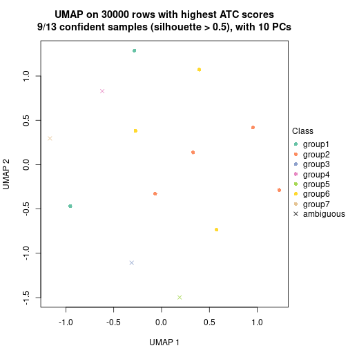</p>

</div>
<div id='tab-node-052-dimension-reduction-7'>
<pre><code class="r">dimension_reduction(res, k = 8, method = &quot;UMAP&quot;)
</code></pre>

<p></p>

</div>
</div>


Following heatmap shows how subgroups are split when increasing `k`:

```r
collect_classes(res)
```


If matrix rows can be associated to genes, consider to use `functional_enrichment(res,
...)` to perform function enrichment for the signature genes. See [this vignette](https://jokergoo.github.io/cola_vignettes/functional_enrichment.html) for more detailed explanations.


 

---------------------------------------------------


### Node053


Parent node: [Node05](#Node05).
Child nodes: 
                Node0121-leaf
        ,
                Node0122-leaf
        ,
                Node0123-leaf
        ,
                Node0124-leaf
        ,
                [Node0131](#Node0131)
        ,
                Node0132-leaf
        ,
                Node0221-leaf
        ,
                Node0222-leaf
        ,
                Node0223-leaf
        ,
                [Node0311](#Node0311)
        ,
                Node0312-leaf
        ,
                Node0313-leaf
        ,
                Node0321-leaf
        ,
                Node0322-leaf
        ,
                Node0431-leaf
        ,
                Node0432-leaf
        ,
                Node0433-leaf
        ,
                Node0511-leaf
        ,
                Node0512-leaf
        ,
                Node0513-leaf
        ,
                Node0521-leaf
        ,
                Node0522-leaf
        ,
                Node0523-leaf
        ,
                Node0531-leaf
        ,
                Node0532-leaf
        ,
                Node0533-leaf
        .


The object with results only for a single top-value method and a single partitioning method 
can be extracted as:

```r
res = res_rh["053"]
```

A summary of `res` and all the functions that can be applied to it:

```r
res
```

```
#> A 'ConsensusPartition' object with k = 2, 3, 4, 5, 6, 7, 8.
#>   On a matrix with 30000 rows and 32 columns.
#>   Top rows (1000) are extracted by 'ATC' method.
#>   Subgroups are detected by 'kmeans' method.
#>   Performed in total 350 partitions by row resampling.
#>   Best k for subgroups seems to be 3.
#> 
#> Following methods can be applied to this 'ConsensusPartition' object:
#>  [1] "cola_report"             "collect_classes"         "collect_plots"          
#>  [4] "collect_stats"           "colnames"                "compare_partitions"     
#>  [7] "compare_signatures"      "consensus_heatmap"       "dimension_reduction"    
#> [10] "functional_enrichment"   "get_anno_col"            "get_anno"               
#> [13] "get_classes"             "get_consensus"           "get_matrix"             
#> [16] "get_membership"          "get_param"               "get_signatures"         
#> [19] "get_stats"               "is_best_k"               "is_stable_k"            
#> [22] "membership_heatmap"      "ncol"                    "nrow"                   
#> [25] "plot_ecdf"               "predict_classes"         "rownames"               
#> [28] "select_partition_number" "show"                    "suggest_best_k"         
#> [31] "test_to_known_factors"   "top_rows_heatmap"
```

`collect_plots()` function collects all the plots made from `res` for all `k` (number of subgroups)
into one single page to provide an easy and fast comparison between different `k`.

```r
collect_plots(res)
```


The plots are:

- The first row: a plot of the eCDF (empirical cumulative distribution
  function) curves of the consensus matrix for each `k` and the heatmap of
  predicted classes for each `k`.
- The second row: heatmaps of the consensus matrix for each `k`.
- The third row: heatmaps of the membership matrix for each `k`.
- The fouth row: heatmaps of the signatures for each `k`.

All the plots in panels can be made by individual functions and they are
plotted later in this section.

`select_partition_number()` produces several plots showing different
statistics for choosing "optimized" `k`. There are following statistics:

- eCDF curves of the consensus matrix for each `k`;
- 1-PAC. [The PAC score](https://en.wikipedia.org/wiki/Consensus_clustering#Over-interpretation_potential_of_consensus_clustering)
  measures the proportion of the ambiguous subgrouping.
- Mean silhouette score.
- Concordance. The mean probability of fiting the consensus subgroup labels in all
  partitions.
- Area increased. Denote $A_k$ as the area under the eCDF curve for current
  `k`, the area increased is defined as $A_k - A_{k-1}$.
- Rand index. The percent of pairs of samples that are both in a same cluster
  or both are not in a same cluster in the partition of k and k-1.
- Jaccard index. The ratio of pairs of samples are both in a same cluster in
  the partition of k and k-1 and the pairs of samples are both in a same
  cluster in the partition k or k-1.

The detailed explanations of these statistics can be found in [the _cola_
vignette](https://jokergoo.github.io/cola_vignettes/cola.html#toc_13).

Generally speaking, higher 1-PAC score, higher mean silhouette score or higher
concordance corresponds to better partition. Rand index and Jaccard index
measure how similar the current partition is compared to partition with `k-1`.
If they are too similar, we won't accept `k` is better than `k-1`.

```r
select_partition_number(res)
```


The numeric values for all these statistics can be obtained by `get_stats()`.

```r
get_stats(res)
```

```
#>   k 1-PAC mean_silhouette concordance area_increased  Rand Jaccard
#> 2 2 0.557           0.920       0.931         0.4560 0.492   0.492
#> 3 3 1.000           1.000       1.000         0.3228 0.865   0.736
#> 4 4 0.743           0.562       0.807         0.1600 0.915   0.787
#> 5 5 0.715           0.697       0.721         0.0997 0.847   0.558
#> 6 6 0.724           0.828       0.853         0.0663 0.909   0.628
#> 7 7 0.687           0.789       0.811         0.0164 1.000   1.000
#> 8 8 0.844           0.725       0.781         0.0451 1.000   1.000
```

`suggest_best_k()` suggests the best $k$ based on these statistics. The rules are as follows:

- All $k$ with Jaccard index larger than 0.95 are removed because increasing
  $k$ does not provide enough extra information. If all $k$ are removed, it is
  marked as no subgroup is detected.
- For all $k$ with 1-PAC score larger than 0.9, the maximal $k$ is taken as
  the best $k$, and other $k$ are marked as optional $k$.
- If it does not fit the second rule. The $k$ with the maximal vote of the
  highest 1-PAC score, highest mean silhouette, and highest concordance is
  taken as the best $k$.

```r
suggest_best_k(res)
```

```
#> [1] 3
```


Following is the table of the partitions (You need to click the **show/hide
code output** link to see it). The membership matrix (columns with name `p*`)
is inferred by
[`clue::cl_consensus()`](https://www.rdocumentation.org/link/cl_consensus?package=clue)
function with the `SE` method. Basically the value in the membership matrix
represents the probability to belong to a certain group. The finall subgroup
label for an item is determined with the group with highest probability it
belongs to.

In `get_classes()` function, the entropy is calculated from the membership
matrix and the silhouette score is calculated from the consensus matrix.


<script>
$( function() {
	$( '#tabs-node-053-get-classes' ).tabs();
} );
</script>
<div id='tabs-node-053-get-classes'>
<ul>
<li><a href='#tab-node-053-get-classes-1'>k = 2</a></li>
<li><a href='#tab-node-053-get-classes-2'>k = 3</a></li>
<li><a href='#tab-node-053-get-classes-3'>k = 4</a></li>
<li><a href='#tab-node-053-get-classes-4'>k = 5</a></li>
<li><a href='#tab-node-053-get-classes-5'>k = 6</a></li>
<li><a href='#tab-node-053-get-classes-6'>k = 7</a></li>
<li><a href='#tab-node-053-get-classes-7'>k = 8</a></li>
</ul>

<div id='tab-node-053-get-classes-1'>
<p><a id='tab-node-053-get-classes-1-a' style='color:#0366d6' href='#'>show/hide code output</a></p>
<pre><code class="r">cbind(get_classes(res, k = 2), get_membership(res, k = 2))
</code></pre>

<pre><code>#&gt;                 class entropy silhouette   p1   p2
#&gt; TCGA.G7.A8LC.01     2   0.000      0.823 0.00 1.00
#&gt; TCGA.IZ.A6M8.01     1   0.000      0.993 1.00 0.00
#&gt; TCGA.A4.A5XZ.01     2   0.990      0.476 0.44 0.56
#&gt; TCGA.A4.8517.01     1   0.000      0.993 1.00 0.00
#&gt; TCGA.BQ.5886.01     1   0.000      0.993 1.00 0.00
#&gt; TCGA.A4.8098.01     2   0.000      0.823 0.00 1.00
#&gt; TCGA.A4.8310.01     2   0.722      0.887 0.20 0.80
#&gt; TCGA.2Z.A9JD.01     1   0.000      0.993 1.00 0.00
#&gt; TCGA.SX.A71V.01     2   0.722      0.887 0.20 0.80
#&gt; TCGA.5P.A9KE.01     1   0.000      0.993 1.00 0.00
#&gt; TCGA.IA.A40U.01     2   0.402      0.854 0.08 0.92
#&gt; TCGA.DW.7963.01     1   0.000      0.993 1.00 0.00
#&gt; TCGA.P4.AAVM.01     1   0.000      0.993 1.00 0.00
#&gt; TCGA.BQ.5881.01     1   0.000      0.993 1.00 0.00
#&gt; TCGA.5P.A9K0.01     1   0.000      0.993 1.00 0.00
#&gt; TCGA.5P.A9K6.01     1   0.000      0.993 1.00 0.00
#&gt; TCGA.P4.A5E6.01     1   0.469      0.859 0.90 0.10
#&gt; TCGA.BQ.5885.01     2   0.722      0.887 0.20 0.80
#&gt; TCGA.2Z.A9JP.01     1   0.000      0.993 1.00 0.00
#&gt; TCGA.2Z.A9JT.01     1   0.000      0.993 1.00 0.00
#&gt; TCGA.G7.7502.01     2   0.722      0.887 0.20 0.80
#&gt; TCGA.BQ.7045.01     1   0.000      0.993 1.00 0.00
#&gt; TCGA.A4.7996.01     2   0.722      0.887 0.20 0.80
#&gt; TCGA.BQ.7046.01     1   0.000      0.993 1.00 0.00
#&gt; TCGA.BQ.7060.01     1   0.000      0.993 1.00 0.00
#&gt; TCGA.BQ.7062.01     2   0.722      0.887 0.20 0.80
#&gt; TCGA.A4.7286.01     2   0.722      0.887 0.20 0.80
#&gt; TCGA.MH.A55W.01     2   0.722      0.887 0.20 0.80
#&gt; TCGA.G7.6790.01     1   0.000      0.993 1.00 0.00
#&gt; TCGA.A4.7584.01     1   0.000      0.993 1.00 0.00
#&gt; TCGA.UN.AAZ9.01     2   0.000      0.823 0.00 1.00
#&gt; TCGA.A4.7583.01     2   0.000      0.823 0.00 1.00
</code></pre>

<script>
$('#tab-node-053-get-classes-1-a').parent().next().next().hide();
$('#tab-node-053-get-classes-1-a').click(function(){
  $('#tab-node-053-get-classes-1-a').parent().next().next().toggle();
  return(false);
});
</script>
</div>

<div id='tab-node-053-get-classes-2'>
<p><a id='tab-node-053-get-classes-2-a' style='color:#0366d6' href='#'>show/hide code output</a></p>
<pre><code class="r">cbind(get_classes(res, k = 3), get_membership(res, k = 3))
</code></pre>

<pre><code>#&gt;                 class entropy silhouette p1 p2 p3
#&gt; TCGA.G7.A8LC.01     3       0          1  0  0  1
#&gt; TCGA.IZ.A6M8.01     1       0          1  1  0  0
#&gt; TCGA.A4.A5XZ.01     2       0          1  0  1  0
#&gt; TCGA.A4.8517.01     1       0          1  1  0  0
#&gt; TCGA.BQ.5886.01     1       0          1  1  0  0
#&gt; TCGA.A4.8098.01     3       0          1  0  0  1
#&gt; TCGA.A4.8310.01     2       0          1  0  1  0
#&gt; TCGA.2Z.A9JD.01     1       0          1  1  0  0
#&gt; TCGA.SX.A71V.01     2       0          1  0  1  0
#&gt; TCGA.5P.A9KE.01     1       0          1  1  0  0
#&gt; TCGA.IA.A40U.01     2       0          1  0  1  0
#&gt; TCGA.DW.7963.01     1       0          1  1  0  0
#&gt; TCGA.P4.AAVM.01     1       0          1  1  0  0
#&gt; TCGA.BQ.5881.01     1       0          1  1  0  0
#&gt; TCGA.5P.A9K0.01     1       0          1  1  0  0
#&gt; TCGA.5P.A9K6.01     1       0          1  1  0  0
#&gt; TCGA.P4.A5E6.01     2       0          1  0  1  0
#&gt; TCGA.BQ.5885.01     2       0          1  0  1  0
#&gt; TCGA.2Z.A9JP.01     1       0          1  1  0  0
#&gt; TCGA.2Z.A9JT.01     1       0          1  1  0  0
#&gt; TCGA.G7.7502.01     2       0          1  0  1  0
#&gt; TCGA.BQ.7045.01     1       0          1  1  0  0
#&gt; TCGA.A4.7996.01     2       0          1  0  1  0
#&gt; TCGA.BQ.7046.01     1       0          1  1  0  0
#&gt; TCGA.BQ.7060.01     1       0          1  1  0  0
#&gt; TCGA.BQ.7062.01     2       0          1  0  1  0
#&gt; TCGA.A4.7286.01     2       0          1  0  1  0
#&gt; TCGA.MH.A55W.01     2       0          1  0  1  0
#&gt; TCGA.G7.6790.01     1       0          1  1  0  0
#&gt; TCGA.A4.7584.01     1       0          1  1  0  0
#&gt; TCGA.UN.AAZ9.01     3       0          1  0  0  1
#&gt; TCGA.A4.7583.01     3       0          1  0  0  1
</code></pre>

<script>
$('#tab-node-053-get-classes-2-a').parent().next().next().hide();
$('#tab-node-053-get-classes-2-a').click(function(){
  $('#tab-node-053-get-classes-2-a').parent().next().next().toggle();
  return(false);
});
</script>
</div>

<div id='tab-node-053-get-classes-3'>
<p><a id='tab-node-053-get-classes-3-a' style='color:#0366d6' href='#'>show/hide code output</a></p>
<pre><code class="r">cbind(get_classes(res, k = 4), get_membership(res, k = 4))
</code></pre>

<pre><code>#&gt;                 class entropy silhouette   p1   p2   p3   p4
#&gt; TCGA.G7.A8LC.01     3  0.2647     0.9516 0.00 0.00 0.88 0.12
#&gt; TCGA.IZ.A6M8.01     1  0.4406     0.1307 0.70 0.00 0.00 0.30
#&gt; TCGA.A4.A5XZ.01     2  0.0707     0.9442 0.00 0.98 0.00 0.02
#&gt; TCGA.A4.8517.01     1  0.3801     0.3823 0.78 0.00 0.00 0.22
#&gt; TCGA.BQ.5886.01     1  0.5000    -0.8088 0.50 0.00 0.00 0.50
#&gt; TCGA.A4.8098.01     3  0.0707     0.9454 0.00 0.00 0.98 0.02
#&gt; TCGA.A4.8310.01     2  0.3610     0.8383 0.00 0.80 0.00 0.20
#&gt; TCGA.2Z.A9JD.01     1  0.0000     0.4963 1.00 0.00 0.00 0.00
#&gt; TCGA.SX.A71V.01     2  0.0000     0.9524 0.00 1.00 0.00 0.00
#&gt; TCGA.5P.A9KE.01     1  0.4713     0.1460 0.64 0.00 0.00 0.36
#&gt; TCGA.IA.A40U.01     2  0.0000     0.9524 0.00 1.00 0.00 0.00
#&gt; TCGA.DW.7963.01     4  0.4994     0.7386 0.48 0.00 0.00 0.52
#&gt; TCGA.P4.AAVM.01     1  0.0000     0.4963 1.00 0.00 0.00 0.00
#&gt; TCGA.BQ.5881.01     1  0.4713     0.1460 0.64 0.00 0.00 0.36
#&gt; TCGA.5P.A9K0.01     1  0.4907     0.0973 0.58 0.00 0.00 0.42
#&gt; TCGA.5P.A9K6.01     1  0.0000     0.4963 1.00 0.00 0.00 0.00
#&gt; TCGA.P4.A5E6.01     2  0.1211     0.9319 0.00 0.96 0.00 0.04
#&gt; TCGA.BQ.5885.01     2  0.2011     0.9176 0.00 0.92 0.00 0.08
#&gt; TCGA.2Z.A9JP.01     1  0.4624     0.2699 0.66 0.00 0.00 0.34
#&gt; TCGA.2Z.A9JT.01     4  0.4713     0.6006 0.36 0.00 0.00 0.64
#&gt; TCGA.G7.7502.01     2  0.0000     0.9524 0.00 1.00 0.00 0.00
#&gt; TCGA.BQ.7045.01     1  0.4790    -0.4419 0.62 0.00 0.00 0.38
#&gt; TCGA.A4.7996.01     2  0.3610     0.8383 0.00 0.80 0.00 0.20
#&gt; TCGA.BQ.7046.01     4  0.4994     0.7181 0.48 0.00 0.00 0.52
#&gt; TCGA.BQ.7060.01     1  0.0000     0.4963 1.00 0.00 0.00 0.00
#&gt; TCGA.BQ.7062.01     2  0.0000     0.9524 0.00 1.00 0.00 0.00
#&gt; TCGA.A4.7286.01     2  0.0000     0.9524 0.00 1.00 0.00 0.00
#&gt; TCGA.MH.A55W.01     2  0.0000     0.9524 0.00 1.00 0.00 0.00
#&gt; TCGA.G7.6790.01     1  0.4855    -0.4493 0.60 0.00 0.00 0.40
#&gt; TCGA.A4.7584.01     1  0.0000     0.4963 1.00 0.00 0.00 0.00
#&gt; TCGA.UN.AAZ9.01     3  0.2647     0.9516 0.00 0.00 0.88 0.12
#&gt; TCGA.A4.7583.01     3  0.0000     0.9498 0.00 0.00 1.00 0.00
</code></pre>

<script>
$('#tab-node-053-get-classes-3-a').parent().next().next().hide();
$('#tab-node-053-get-classes-3-a').click(function(){
  $('#tab-node-053-get-classes-3-a').parent().next().next().toggle();
  return(false);
});
</script>
</div>

<div id='tab-node-053-get-classes-4'>
<p><a id='tab-node-053-get-classes-4-a' style='color:#0366d6' href='#'>show/hide code output</a></p>
<pre><code class="r">cbind(get_classes(res, k = 5), get_membership(res, k = 5))
</code></pre>

<pre><code>#&gt;                 class entropy silhouette   p1   p2   p3   p4   p5
#&gt; TCGA.G7.A8LC.01     3   0.000      0.943 0.00 0.00 1.00 0.00 0.00
#&gt; TCGA.IZ.A6M8.01     1   0.413      0.329 0.62 0.00 0.00 0.38 0.00
#&gt; TCGA.A4.A5XZ.01     2   0.426      0.862 0.00 0.56 0.00 0.00 0.44
#&gt; TCGA.A4.8517.01     1   0.104      0.504 0.96 0.00 0.00 0.04 0.00
#&gt; TCGA.BQ.5886.01     4   0.597      0.981 0.14 0.30 0.00 0.56 0.00
#&gt; TCGA.A4.8098.01     3   0.275      0.943 0.00 0.08 0.88 0.04 0.00
#&gt; TCGA.A4.8310.01     5   0.000      0.758 0.00 0.00 0.00 0.00 1.00
#&gt; TCGA.2Z.A9JD.01     1   0.429      0.480 0.54 0.00 0.00 0.46 0.00
#&gt; TCGA.SX.A71V.01     2   0.535      0.888 0.00 0.56 0.00 0.06 0.38
#&gt; TCGA.5P.A9KE.01     1   0.311      0.437 0.80 0.00 0.00 0.20 0.00
#&gt; TCGA.IA.A40U.01     2   0.535      0.888 0.00 0.56 0.00 0.06 0.38
#&gt; TCGA.DW.7963.01     4   0.597      0.981 0.14 0.30 0.00 0.56 0.00
#&gt; TCGA.P4.AAVM.01     1   0.429      0.480 0.54 0.00 0.00 0.46 0.00
#&gt; TCGA.BQ.5881.01     1   0.311      0.437 0.80 0.00 0.00 0.20 0.00
#&gt; TCGA.5P.A9K0.01     1   0.311      0.437 0.80 0.00 0.00 0.20 0.00
#&gt; TCGA.5P.A9K6.01     1   0.429      0.480 0.54 0.00 0.00 0.46 0.00
#&gt; TCGA.P4.A5E6.01     2   0.516      0.808 0.00 0.52 0.00 0.04 0.44
#&gt; TCGA.BQ.5885.01     5   0.413      0.168 0.00 0.26 0.00 0.02 0.72
#&gt; TCGA.2Z.A9JP.01     1   0.252      0.472 0.86 0.00 0.00 0.14 0.00
#&gt; TCGA.2Z.A9JT.01     1   0.423     -0.101 0.58 0.00 0.00 0.42 0.00
#&gt; TCGA.G7.7502.01     2   0.423      0.881 0.00 0.58 0.00 0.00 0.42
#&gt; TCGA.BQ.7045.01     4   0.579      0.972 0.12 0.30 0.00 0.58 0.00
#&gt; TCGA.A4.7996.01     5   0.000      0.758 0.00 0.00 0.00 0.00 1.00
#&gt; TCGA.BQ.7046.01     4   0.597      0.981 0.14 0.30 0.00 0.56 0.00
#&gt; TCGA.BQ.7060.01     1   0.429      0.480 0.54 0.00 0.00 0.46 0.00
#&gt; TCGA.BQ.7062.01     2   0.413      0.903 0.00 0.62 0.00 0.00 0.38
#&gt; TCGA.A4.7286.01     2   0.505      0.897 0.00 0.58 0.00 0.04 0.38
#&gt; TCGA.MH.A55W.01     2   0.468      0.902 0.00 0.60 0.00 0.02 0.38
#&gt; TCGA.G7.6790.01     4   0.579      0.972 0.12 0.30 0.00 0.58 0.00
#&gt; TCGA.A4.7584.01     1   0.429      0.480 0.54 0.00 0.00 0.46 0.00
#&gt; TCGA.UN.AAZ9.01     3   0.000      0.943 0.00 0.00 1.00 0.00 0.00
#&gt; TCGA.A4.7583.01     3   0.275      0.943 0.00 0.08 0.88 0.04 0.00
</code></pre>

<script>
$('#tab-node-053-get-classes-4-a').parent().next().next().hide();
$('#tab-node-053-get-classes-4-a').click(function(){
  $('#tab-node-053-get-classes-4-a').parent().next().next().toggle();
  return(false);
});
</script>
</div>

<div id='tab-node-053-get-classes-5'>
<p><a id='tab-node-053-get-classes-5-a' style='color:#0366d6' href='#'>show/hide code output</a></p>
<pre><code class="r">cbind(get_classes(res, k = 6), get_membership(res, k = 6))
</code></pre>

<pre><code>#&gt;                 class entropy silhouette   p1   p2   p3   p4   p5   p6
#&gt; TCGA.G7.A8LC.01     3  0.0000      0.928 0.00 0.00 1.00 0.00 0.00 0.00
#&gt; TCGA.IZ.A6M8.01     1  0.4903      0.679 0.70 0.00 0.00 0.02 0.14 0.14
#&gt; TCGA.A4.A5XZ.01     2  0.3007      0.746 0.00 0.86 0.00 0.04 0.08 0.02
#&gt; TCGA.A4.8517.01     1  0.1814      0.753 0.90 0.00 0.00 0.00 0.00 0.10
#&gt; TCGA.BQ.5886.01     4  0.5157      0.825 0.10 0.00 0.00 0.70 0.14 0.06
#&gt; TCGA.A4.8098.01     3  0.3045      0.922 0.00 0.00 0.86 0.02 0.06 0.06
#&gt; TCGA.A4.8310.01     5  0.2793      1.000 0.00 0.20 0.00 0.00 0.80 0.00
#&gt; TCGA.2Z.A9JD.01     6  0.2631      1.000 0.18 0.00 0.00 0.00 0.00 0.82
#&gt; TCGA.SX.A71V.01     2  0.1807      0.798 0.00 0.92 0.00 0.06 0.00 0.02
#&gt; TCGA.5P.A9KE.01     1  0.3318      0.807 0.82 0.00 0.00 0.02 0.14 0.02
#&gt; TCGA.IA.A40U.01     2  0.2474      0.782 0.00 0.88 0.00 0.08 0.00 0.04
#&gt; TCGA.DW.7963.01     4  0.3572      0.920 0.10 0.00 0.00 0.82 0.02 0.06
#&gt; TCGA.P4.AAVM.01     6  0.2631      1.000 0.18 0.00 0.00 0.00 0.00 0.82
#&gt; TCGA.BQ.5881.01     1  0.3318      0.807 0.82 0.00 0.00 0.02 0.14 0.02
#&gt; TCGA.5P.A9K0.01     1  0.0000      0.814 1.00 0.00 0.00 0.00 0.00 0.00
#&gt; TCGA.5P.A9K6.01     6  0.2631      1.000 0.18 0.00 0.00 0.00 0.00 0.82
#&gt; TCGA.P4.A5E6.01     2  0.4519      0.653 0.00 0.76 0.00 0.10 0.08 0.06
#&gt; TCGA.BQ.5885.01     2  0.5347     -0.216 0.00 0.50 0.00 0.02 0.42 0.06
#&gt; TCGA.2Z.A9JP.01     1  0.0937      0.796 0.96 0.00 0.00 0.00 0.00 0.04
#&gt; TCGA.2Z.A9JT.01     1  0.2790      0.679 0.84 0.00 0.00 0.14 0.02 0.00
#&gt; TCGA.G7.7502.01     2  0.1267      0.790 0.00 0.94 0.00 0.00 0.06 0.00
#&gt; TCGA.BQ.7045.01     4  0.3321      0.926 0.10 0.00 0.00 0.82 0.00 0.08
#&gt; TCGA.A4.7996.01     5  0.2793      1.000 0.00 0.20 0.00 0.00 0.80 0.00
#&gt; TCGA.BQ.7046.01     4  0.2474      0.921 0.08 0.00 0.00 0.88 0.00 0.04
#&gt; TCGA.BQ.7060.01     6  0.2631      1.000 0.18 0.00 0.00 0.00 0.00 0.82
#&gt; TCGA.BQ.7062.01     2  0.0000      0.809 0.00 1.00 0.00 0.00 0.00 0.00
#&gt; TCGA.A4.7286.01     2  0.2190      0.790 0.00 0.90 0.00 0.06 0.00 0.04
#&gt; TCGA.MH.A55W.01     2  0.0547      0.809 0.00 0.98 0.00 0.02 0.00 0.00
#&gt; TCGA.G7.6790.01     4  0.2794      0.918 0.08 0.00 0.00 0.86 0.00 0.06
#&gt; TCGA.A4.7584.01     6  0.2631      1.000 0.18 0.00 0.00 0.00 0.00 0.82
#&gt; TCGA.UN.AAZ9.01     3  0.0000      0.928 0.00 0.00 1.00 0.00 0.00 0.00
#&gt; TCGA.A4.7583.01     3  0.3103      0.922 0.00 0.00 0.86 0.04 0.06 0.04
</code></pre>

<script>
$('#tab-node-053-get-classes-5-a').parent().next().next().hide();
$('#tab-node-053-get-classes-5-a').click(function(){
  $('#tab-node-053-get-classes-5-a').parent().next().next().toggle();
  return(false);
});
</script>
</div>

<div id='tab-node-053-get-classes-6'>
<p><a id='tab-node-053-get-classes-6-a' style='color:#0366d6' href='#'>show/hide code output</a></p>
<pre><code class="r">cbind(get_classes(res, k = 7), get_membership(res, k = 7))
</code></pre>

<pre><code>#&gt;                 class entropy silhouette   p1   p2   p3   p4   p5   p6   p7
#&gt; TCGA.G7.A8LC.01     3  0.0000    0.72721 0.00 0.00 1.00 0.00 0.00 0.00 0.00
#&gt; TCGA.IZ.A6M8.01     1  0.5170    0.58259 0.66 0.08 0.00 0.12 0.00 0.14 0.00
#&gt; TCGA.A4.A5XZ.01     7  0.4357    0.67369 0.00 0.10 0.00 0.04 0.08 0.02 0.76
#&gt; TCGA.A4.8517.01     1  0.2569    0.71466 0.84 0.02 0.00 0.00 0.00 0.14 0.00
#&gt; TCGA.BQ.5886.01     4  0.3449    0.88628 0.14 0.08 0.00 0.78 0.00 0.00 0.00
#&gt; TCGA.A4.8098.01     3  0.3562    0.67670 0.00 0.50 0.50 0.00 0.00 0.00 0.00
#&gt; TCGA.A4.8310.01     5  0.0504    1.00000 0.00 0.00 0.00 0.00 0.98 0.00 0.02
#&gt; TCGA.2Z.A9JD.01     6  0.4905    0.90362 0.16 0.10 0.00 0.06 0.00 0.68 0.00
#&gt; TCGA.SX.A71V.01     7  0.2912    0.74823 0.00 0.04 0.00 0.00 0.00 0.14 0.82
#&gt; TCGA.5P.A9KE.01     1  0.2572    0.80134 0.86 0.08 0.00 0.06 0.00 0.00 0.00
#&gt; TCGA.IA.A40U.01     7  0.3244    0.73601 0.00 0.04 0.00 0.00 0.00 0.18 0.78
#&gt; TCGA.DW.7963.01     4  0.2081    0.94921 0.14 0.00 0.00 0.86 0.00 0.00 0.00
#&gt; TCGA.P4.AAVM.01     6  0.3370    0.96624 0.16 0.00 0.00 0.06 0.00 0.78 0.00
#&gt; TCGA.BQ.5881.01     1  0.2572    0.80134 0.86 0.08 0.00 0.06 0.00 0.00 0.00
#&gt; TCGA.5P.A9K0.01     1  0.1166    0.80537 0.94 0.06 0.00 0.00 0.00 0.00 0.00
#&gt; TCGA.5P.A9K6.01     6  0.4001    0.94564 0.18 0.02 0.00 0.06 0.00 0.74 0.00
#&gt; TCGA.P4.A5E6.01     7  0.5853    0.53732 0.00 0.20 0.00 0.10 0.08 0.02 0.60
#&gt; TCGA.BQ.5885.01     7  0.6578   -0.00316 0.00 0.12 0.00 0.06 0.34 0.04 0.44
#&gt; TCGA.2Z.A9JP.01     1  0.1363    0.79462 0.94 0.02 0.00 0.00 0.00 0.04 0.00
#&gt; TCGA.2Z.A9JT.01     1  0.2313    0.76336 0.88 0.06 0.00 0.06 0.00 0.00 0.00
#&gt; TCGA.G7.7502.01     7  0.0863    0.75824 0.00 0.00 0.00 0.00 0.04 0.00 0.96
#&gt; TCGA.BQ.7045.01     4  0.2081    0.94921 0.14 0.00 0.00 0.86 0.00 0.00 0.00
#&gt; TCGA.A4.7996.01     5  0.0504    1.00000 0.00 0.00 0.00 0.00 0.98 0.00 0.02
#&gt; TCGA.BQ.7046.01     4  0.2376    0.94178 0.12 0.00 0.00 0.86 0.02 0.00 0.00
#&gt; TCGA.BQ.7060.01     6  0.3370    0.96624 0.16 0.00 0.00 0.06 0.00 0.78 0.00
#&gt; TCGA.BQ.7062.01     7  0.0000    0.76802 0.00 0.00 0.00 0.00 0.00 0.00 1.00
#&gt; TCGA.A4.7286.01     7  0.1166    0.76544 0.00 0.00 0.00 0.00 0.00 0.06 0.94
#&gt; TCGA.MH.A55W.01     7  0.2912    0.74823 0.00 0.04 0.00 0.00 0.00 0.14 0.82
#&gt; TCGA.G7.6790.01     4  0.2376    0.94178 0.12 0.00 0.00 0.86 0.02 0.00 0.00
#&gt; TCGA.A4.7584.01     6  0.3370    0.96624 0.16 0.00 0.00 0.06 0.00 0.78 0.00
#&gt; TCGA.UN.AAZ9.01     3  0.0000    0.72721 0.00 0.00 1.00 0.00 0.00 0.00 0.00
#&gt; TCGA.A4.7583.01     3  0.4622    0.70350 0.00 0.38 0.56 0.04 0.00 0.02 0.00
</code></pre>

<script>
$('#tab-node-053-get-classes-6-a').parent().next().next().hide();
$('#tab-node-053-get-classes-6-a').click(function(){
  $('#tab-node-053-get-classes-6-a').parent().next().next().toggle();
  return(false);
});
</script>
</div>

<div id='tab-node-053-get-classes-7'>
<p><a id='tab-node-053-get-classes-7-a' style='color:#0366d6' href='#'>show/hide code output</a></p>
<pre><code class="r">cbind(get_classes(res, k = 8), get_membership(res, k = 8))
</code></pre>

<pre><code>#&gt;                 class entropy silhouette   p1   p2   p3   p4   p5   p6   p7   p8
#&gt; TCGA.G7.A8LC.01     3  0.3299     0.7338 0.44 0.00 0.56 0.00 0.00 0.00 0.00 0.00
#&gt; TCGA.IZ.A6M8.01     2  0.2350     0.6021 0.00 0.86 0.00 0.00 0.00 0.10 0.00 0.04
#&gt; TCGA.A4.A5XZ.01     7  0.4433     0.5584 0.20 0.00 0.00 0.06 0.00 0.00 0.68 0.06
#&gt; TCGA.A4.8517.01     2  0.5329     0.6163 0.04 0.46 0.00 0.00 0.00 0.12 0.00 0.38
#&gt; TCGA.BQ.5886.01     4  0.3943     0.5650 0.00 0.40 0.00 0.56 0.00 0.04 0.00 0.00
#&gt; TCGA.A4.8098.01     3  0.1275     0.7063 0.02 0.00 0.94 0.04 0.00 0.00 0.00 0.00
#&gt; TCGA.A4.8310.01     5  0.0000     1.0000 0.00 0.00 0.00 0.00 1.00 0.00 0.00 0.00
#&gt; TCGA.2Z.A9JD.01     6  0.2348     0.9233 0.06 0.02 0.00 0.00 0.00 0.88 0.00 0.04
#&gt; TCGA.SX.A71V.01     7  0.4504     0.6389 0.10 0.00 0.00 0.02 0.00 0.00 0.64 0.24
#&gt; TCGA.5P.A9KE.01     2  0.0000     0.6808 0.00 1.00 0.00 0.00 0.00 0.00 0.00 0.00
#&gt; TCGA.IA.A40U.01     7  0.4833     0.6165 0.12 0.00 0.00 0.02 0.00 0.00 0.58 0.28
#&gt; TCGA.DW.7963.01     4  0.2888     0.8308 0.00 0.16 0.00 0.80 0.00 0.04 0.00 0.00
#&gt; TCGA.P4.AAVM.01     6  0.0471     0.9627 0.00 0.02 0.00 0.00 0.00 0.98 0.00 0.00
#&gt; TCGA.BQ.5881.01     2  0.0000     0.6808 0.00 1.00 0.00 0.00 0.00 0.00 0.00 0.00
#&gt; TCGA.5P.A9K0.01     2  0.3329     0.6709 0.00 0.52 0.00 0.00 0.00 0.00 0.00 0.48
#&gt; TCGA.5P.A9K6.01     6  0.2020     0.9300 0.02 0.02 0.00 0.00 0.00 0.90 0.00 0.06
#&gt; TCGA.P4.A5E6.01     7  0.5537     0.3847 0.34 0.00 0.00 0.08 0.00 0.00 0.48 0.10
#&gt; TCGA.BQ.5885.01     7  0.6431     0.0728 0.16 0.00 0.00 0.00 0.26 0.02 0.44 0.12
#&gt; TCGA.2Z.A9JP.01     2  0.3942     0.7021 0.02 0.62 0.00 0.00 0.00 0.02 0.00 0.34
#&gt; TCGA.2Z.A9JT.01     2  0.3237     0.6914 0.00 0.60 0.00 0.00 0.00 0.00 0.00 0.40
#&gt; TCGA.G7.7502.01     7  0.0000     0.6810 0.00 0.00 0.00 0.00 0.00 0.00 1.00 0.00
#&gt; TCGA.BQ.7045.01     4  0.2165     0.8653 0.00 0.06 0.00 0.88 0.00 0.06 0.00 0.00
#&gt; TCGA.A4.7996.01     5  0.0000     1.0000 0.00 0.00 0.00 0.00 1.00 0.00 0.00 0.00
#&gt; TCGA.BQ.7046.01     4  0.1887     0.8644 0.00 0.06 0.00 0.90 0.00 0.04 0.00 0.00
#&gt; TCGA.BQ.7060.01     6  0.0471     0.9627 0.00 0.02 0.00 0.00 0.00 0.98 0.00 0.00
#&gt; TCGA.BQ.7062.01     7  0.0000     0.6810 0.00 0.00 0.00 0.00 0.00 0.00 1.00 0.00
#&gt; TCGA.A4.7286.01     7  0.3073     0.6601 0.10 0.00 0.00 0.00 0.00 0.00 0.80 0.10
#&gt; TCGA.MH.A55W.01     7  0.3537     0.6580 0.02 0.00 0.00 0.02 0.00 0.00 0.72 0.24
#&gt; TCGA.G7.6790.01     4  0.1887     0.8560 0.00 0.04 0.00 0.90 0.00 0.06 0.00 0.00
#&gt; TCGA.A4.7584.01     6  0.0471     0.9627 0.00 0.02 0.00 0.00 0.00 0.98 0.00 0.00
#&gt; TCGA.UN.AAZ9.01     3  0.3299     0.7338 0.44 0.00 0.56 0.00 0.00 0.00 0.00 0.00
#&gt; TCGA.A4.7583.01     3  0.0471     0.7147 0.00 0.00 0.98 0.00 0.00 0.00 0.00 0.02
</code></pre>

<script>
$('#tab-node-053-get-classes-7-a').parent().next().next().hide();
$('#tab-node-053-get-classes-7-a').click(function(){
  $('#tab-node-053-get-classes-7-a').parent().next().next().toggle();
  return(false);
});
</script>
</div>
</div>

Heatmaps for the consensus matrix. It visualizes the probability of two
samples to be in a same group.


<script>
$( function() {
	$( '#tabs-node-053-consensus-heatmap' ).tabs();
} );
</script>
<div id='tabs-node-053-consensus-heatmap'>
<ul>
<li><a href='#tab-node-053-consensus-heatmap-1'>k = 2</a></li>
<li><a href='#tab-node-053-consensus-heatmap-2'>k = 3</a></li>
<li><a href='#tab-node-053-consensus-heatmap-3'>k = 4</a></li>
<li><a href='#tab-node-053-consensus-heatmap-4'>k = 5</a></li>
<li><a href='#tab-node-053-consensus-heatmap-5'>k = 6</a></li>
<li><a href='#tab-node-053-consensus-heatmap-6'>k = 7</a></li>
<li><a href='#tab-node-053-consensus-heatmap-7'>k = 8</a></li>
</ul>
<div id='tab-node-053-consensus-heatmap-1'>
<pre><code class="r">consensus_heatmap(res, k = 2)
</code></pre>

<p></p>

</div>
<div id='tab-node-053-consensus-heatmap-2'>
<pre><code class="r">consensus_heatmap(res, k = 3)
</code></pre>

<p></p>

</div>
<div id='tab-node-053-consensus-heatmap-3'>
<pre><code class="r">consensus_heatmap(res, k = 4)
</code></pre>

<p></p>

</div>
<div id='tab-node-053-consensus-heatmap-4'>
<pre><code class="r">consensus_heatmap(res, k = 5)
</code></pre>

<p>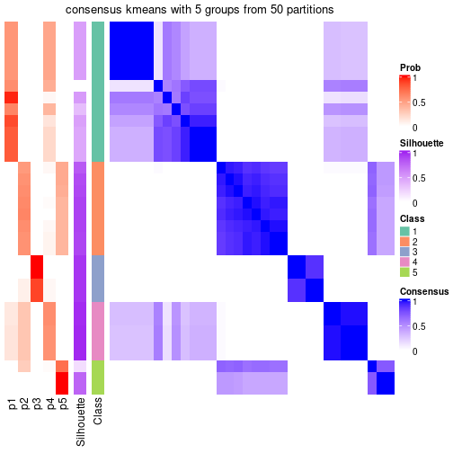</p>

</div>
<div id='tab-node-053-consensus-heatmap-5'>
<pre><code class="r">consensus_heatmap(res, k = 6)
</code></pre>

<p></p>

</div>
<div id='tab-node-053-consensus-heatmap-6'>
<pre><code class="r">consensus_heatmap(res, k = 7)
</code></pre>

<p></p>

</div>
<div id='tab-node-053-consensus-heatmap-7'>
<pre><code class="r">consensus_heatmap(res, k = 8)
</code></pre>

<p></p>

</div>
</div>

Heatmaps for the membership of samples in all partitions to see how consistent they are:


<script>
$( function() {
	$( '#tabs-node-053-membership-heatmap' ).tabs();
} );
</script>
<div id='tabs-node-053-membership-heatmap'>
<ul>
<li><a href='#tab-node-053-membership-heatmap-1'>k = 2</a></li>
<li><a href='#tab-node-053-membership-heatmap-2'>k = 3</a></li>
<li><a href='#tab-node-053-membership-heatmap-3'>k = 4</a></li>
<li><a href='#tab-node-053-membership-heatmap-4'>k = 5</a></li>
<li><a href='#tab-node-053-membership-heatmap-5'>k = 6</a></li>
<li><a href='#tab-node-053-membership-heatmap-6'>k = 7</a></li>
<li><a href='#tab-node-053-membership-heatmap-7'>k = 8</a></li>
</ul>
<div id='tab-node-053-membership-heatmap-1'>
<pre><code class="r">membership_heatmap(res, k = 2)
</code></pre>

<p></p>

</div>
<div id='tab-node-053-membership-heatmap-2'>
<pre><code class="r">membership_heatmap(res, k = 3)
</code></pre>

<p></p>

</div>
<div id='tab-node-053-membership-heatmap-3'>
<pre><code class="r">membership_heatmap(res, k = 4)
</code></pre>

<p></p>

</div>
<div id='tab-node-053-membership-heatmap-4'>
<pre><code class="r">membership_heatmap(res, k = 5)
</code></pre>

<p></p>

</div>
<div id='tab-node-053-membership-heatmap-5'>
<pre><code class="r">membership_heatmap(res, k = 6)
</code></pre>

<p></p>

</div>
<div id='tab-node-053-membership-heatmap-6'>
<pre><code class="r">membership_heatmap(res, k = 7)
</code></pre>

<p></p>

</div>
<div id='tab-node-053-membership-heatmap-7'>
<pre><code class="r">membership_heatmap(res, k = 8)
</code></pre>

<p></p>

</div>
</div>

As soon as the classes for columns are determined, the signatures
that are significantly different between subgroups can be looked for. 
Following are the heatmaps for signatures.


<script>
$( function() {
	$( '#tabs-node-053-get-signatures' ).tabs();
} );
</script>
<div id='tabs-node-053-get-signatures'>
<ul>
<li><a href='#tab-node-053-get-signatures-1'>k = 2</a></li>
<li><a href='#tab-node-053-get-signatures-2'>k = 3</a></li>
<li><a href='#tab-node-053-get-signatures-3'>k = 4</a></li>
<li><a href='#tab-node-053-get-signatures-4'>k = 5</a></li>
<li><a href='#tab-node-053-get-signatures-5'>k = 6</a></li>
<li><a href='#tab-node-053-get-signatures-6'>k = 7</a></li>
<li><a href='#tab-node-053-get-signatures-7'>k = 8</a></li>
</ul>
<div id='tab-node-053-get-signatures-1'>
<pre><code class="r">get_signatures(res, k = 2)
</code></pre>

<p></p>

</div>
<div id='tab-node-053-get-signatures-2'>
<pre><code class="r">get_signatures(res, k = 3)
</code></pre>

<p></p>

</div>
<div id='tab-node-053-get-signatures-3'>
<pre><code class="r">get_signatures(res, k = 4)
</code></pre>

<p></p>

</div>
<div id='tab-node-053-get-signatures-4'>
<pre><code class="r">get_signatures(res, k = 5)
</code></pre>

<p></p>

</div>
<div id='tab-node-053-get-signatures-5'>
<pre><code class="r">get_signatures(res, k = 6)
</code></pre>

<p></p>

</div>
<div id='tab-node-053-get-signatures-6'>
<pre><code class="r">get_signatures(res, k = 7)
</code></pre>

<p></p>

</div>
<div id='tab-node-053-get-signatures-7'>
<pre><code class="r">get_signatures(res, k = 8)
</code></pre>

<p></p>

</div>
</div>


Compare the overlap of signatures from different k:

```r
compare_signatures(res)
```


`get_signature()` returns a data frame invisibly. To get the list of signatures, the function
call should be assigned to a variable explicitly. In following code, if `plot` argument is set
to `FALSE`, no heatmap is plotted while only the differential analysis is performed.

```r
# code only for demonstration
tb = get_signature(res, k = ..., plot = FALSE)
```

An example of the output of `tb` is:

```
#>   which_row         fdr    mean_1    mean_2 scaled_mean_1 scaled_mean_2 km
#> 1        38 0.042760348  8.373488  9.131774    -0.5533452     0.5164555  1
#> 2        40 0.018707592  7.106213  8.469186    -0.6173731     0.5762149  1
#> 3        55 0.019134737 10.221463 11.207825    -0.6159697     0.5749050  1
#> 4        59 0.006059896  5.921854  7.869574    -0.6899429     0.6439467  1
#> 5        60 0.018055526  8.928898 10.211722    -0.6204761     0.5791110  1
#> 6        98 0.009384629 15.714769 14.887706     0.6635654    -0.6193277  2
...
```

The columns in `tb` are:

1. `which_row`: row indices corresponding to the input matrix.
2. `fdr`: FDR for the differential test. 
3. `mean_x`: The mean value in group x.
4. `scaled_mean_x`: The mean value in group x after rows are scaled.
5. `km`: Row groups if k-means clustering is applied to rows (which is done by automatically selecting number of clusters).

If there are too many signatures, `top_signatures = ...` can be set to only show the 
signatures with the highest FDRs:

```r
# code only for demonstration
# e.g. to show the top 500 most significant rows
tb = get_signature(res, k = ..., top_signatures = 500)
```

If the signatures are defined as these which are uniquely high in current group, `diff_method` argument
can be set to `"uniquely_high_in_one_group"`:

```r
# code only for demonstration
tb = get_signature(res, k = ..., diff_method = "uniquely_high_in_one_group")
```


UMAP plot which shows how samples are separated.


<script>
$( function() {
	$( '#tabs-node-053-dimension-reduction' ).tabs();
} );
</script>
<div id='tabs-node-053-dimension-reduction'>
<ul>
<li><a href='#tab-node-053-dimension-reduction-1'>k = 2</a></li>
<li><a href='#tab-node-053-dimension-reduction-2'>k = 3</a></li>
<li><a href='#tab-node-053-dimension-reduction-3'>k = 4</a></li>
<li><a href='#tab-node-053-dimension-reduction-4'>k = 5</a></li>
<li><a href='#tab-node-053-dimension-reduction-5'>k = 6</a></li>
<li><a href='#tab-node-053-dimension-reduction-6'>k = 7</a></li>
<li><a href='#tab-node-053-dimension-reduction-7'>k = 8</a></li>
</ul>
<div id='tab-node-053-dimension-reduction-1'>
<pre><code class="r">dimension_reduction(res, k = 2, method = &quot;UMAP&quot;)
</code></pre>

<p></p>

</div>
<div id='tab-node-053-dimension-reduction-2'>
<pre><code class="r">dimension_reduction(res, k = 3, method = &quot;UMAP&quot;)
</code></pre>

<p></p>

</div>
<div id='tab-node-053-dimension-reduction-3'>
<pre><code class="r">dimension_reduction(res, k = 4, method = &quot;UMAP&quot;)
</code></pre>

<p></p>

</div>
<div id='tab-node-053-dimension-reduction-4'>
<pre><code class="r">dimension_reduction(res, k = 5, method = &quot;UMAP&quot;)
</code></pre>

<p></p>

</div>
<div id='tab-node-053-dimension-reduction-5'>
<pre><code class="r">dimension_reduction(res, k = 6, method = &quot;UMAP&quot;)
</code></pre>

<p></p>

</div>
<div id='tab-node-053-dimension-reduction-6'>
<pre><code class="r">dimension_reduction(res, k = 7, method = &quot;UMAP&quot;)
</code></pre>

<p></p>

</div>
<div id='tab-node-053-dimension-reduction-7'>
<pre><code class="r">dimension_reduction(res, k = 8, method = &quot;UMAP&quot;)
</code></pre>

<p></p>

</div>
</div>


Following heatmap shows how subgroups are split when increasing `k`:

```r
collect_classes(res)
```


If matrix rows can be associated to genes, consider to use `functional_enrichment(res,
...)` to perform function enrichment for the signature genes. See [this vignette](https://jokergoo.github.io/cola_vignettes/functional_enrichment.html) for more detailed explanations.


 

## Session info


```r
sessionInfo()
```

```
#> R version 4.1.0 (2021-05-18)
#> Platform: x86_64-pc-linux-gnu (64-bit)
#> Running under: CentOS Linux 7 (Core)
#> 
#> Matrix products: default
#> BLAS/LAPACK: /usr/lib64/libopenblas-r0.3.3.so
#> 
#> locale:
#>  [1] LC_CTYPE=en_US.UTF-8       LC_NUMERIC=C               LC_TIME=en_US.UTF-8       
#>  [4] LC_COLLATE=en_US.UTF-8     LC_MONETARY=en_US.UTF-8    LC_MESSAGES=en_US.UTF-8   
#>  [7] LC_PAPER=en_US.UTF-8       LC_NAME=C                  LC_ADDRESS=C              
#> [10] LC_TELEPHONE=C             LC_MEASUREMENT=en_US.UTF-8 LC_IDENTIFICATION=C       
#> 
#> attached base packages:
#> [1] grid      stats     graphics  grDevices utils     datasets  methods   base     
#> 
#> other attached packages:
#> [1] genefilter_1.74.0    ComplexHeatmap_2.8.0 markdown_1.1         knitr_1.33          
#> [5] matrixStats_0.59.0   cola_1.9.4          
#> 
#> loaded via a namespace (and not attached):
#>   [1] bitops_1.0-7           bit64_4.0.5            doParallel_1.0.16      RColorBrewer_1.1-2    
#>   [5] httr_1.4.2             GenomeInfoDb_1.28.1    data.tree_1.0.0        tools_4.1.0           
#>   [9] utf8_1.2.1             R6_2.5.0               irlba_2.3.3            DBI_1.1.1             
#>  [13] BiocGenerics_0.38.0    colorspace_2.0-2       GetoptLong_1.0.5       gridExtra_2.3         
#>  [17] tidyselect_1.1.1       bit_4.0.4              compiler_4.1.0         Biobase_2.52.0        
#>  [21] Cairo_1.5-12.2         xml2_1.3.2             microbenchmark_1.4-7   slam_0.1-48           
#>  [25] scales_1.1.1           askpass_1.1            stringr_1.4.0          digest_0.6.27         
#>  [29] XVector_0.32.0         pkgconfig_2.0.3        umap_0.2.7.0           fastmap_1.1.0         
#>  [33] highr_0.9              rlang_0.4.11           GlobalOptions_0.1.2    rstudioapi_0.13       
#>  [37] RSQLite_2.2.7          impute_1.66.0          generics_0.1.0         shape_1.4.6           
#>  [41] jsonlite_1.7.2         mclust_5.4.7           dplyr_1.0.7            dendextend_1.15.1     
#>  [45] RCurl_1.98-1.3         magrittr_2.0.1         GenomeInfoDbData_1.2.6 Matrix_1.3-4          
#>  [49] fansi_0.5.0            Rcpp_1.0.7             munsell_0.5.0          S4Vectors_0.30.0      
#>  [53] viridis_0.6.1          reticulate_1.20        lifecycle_1.0.0        scatterplot3d_0.3-41  
#>  [57] stringi_1.7.3          zlibbioc_1.38.0        blob_1.2.1             parallel_4.1.0        
#>  [61] crayon_1.4.1           lattice_0.20-44        Biostrings_2.60.1      splines_4.1.0         
#>  [65] annotate_1.70.0        circlize_0.4.13        KEGGREST_1.32.0        polylabelr_0.2.0      
#>  [69] pillar_1.6.1           rjson_0.2.20           codetools_0.2-18       stats4_4.1.0          
#>  [73] XML_3.99-0.6           glue_1.4.2             evaluate_0.14          png_0.1-7             
#>  [77] vctrs_0.3.8            foreach_1.5.1          polyclip_1.10-0        purrr_0.3.4           
#>  [81] gtable_0.3.0           openssl_1.4.4          assertthat_0.2.1       clue_0.3-59           
#>  [85] cachem_1.0.5           ggplot2_3.3.5          xfun_0.24              eulerr_6.1.0          
#>  [89] xtable_1.8-4           skmeans_0.2-13         RSpectra_0.16-0        viridisLite_0.4.0     
#>  [93] survival_3.2-11        tibble_3.1.2           Polychrome_1.3.1       iterators_1.0.13      
#>  [97] AnnotationDbi_1.54.1   memoise_2.0.0          IRanges_2.26.0         cluster_2.1.2         
#> [101] ellipsis_0.3.2         brew_1.0-6
```


